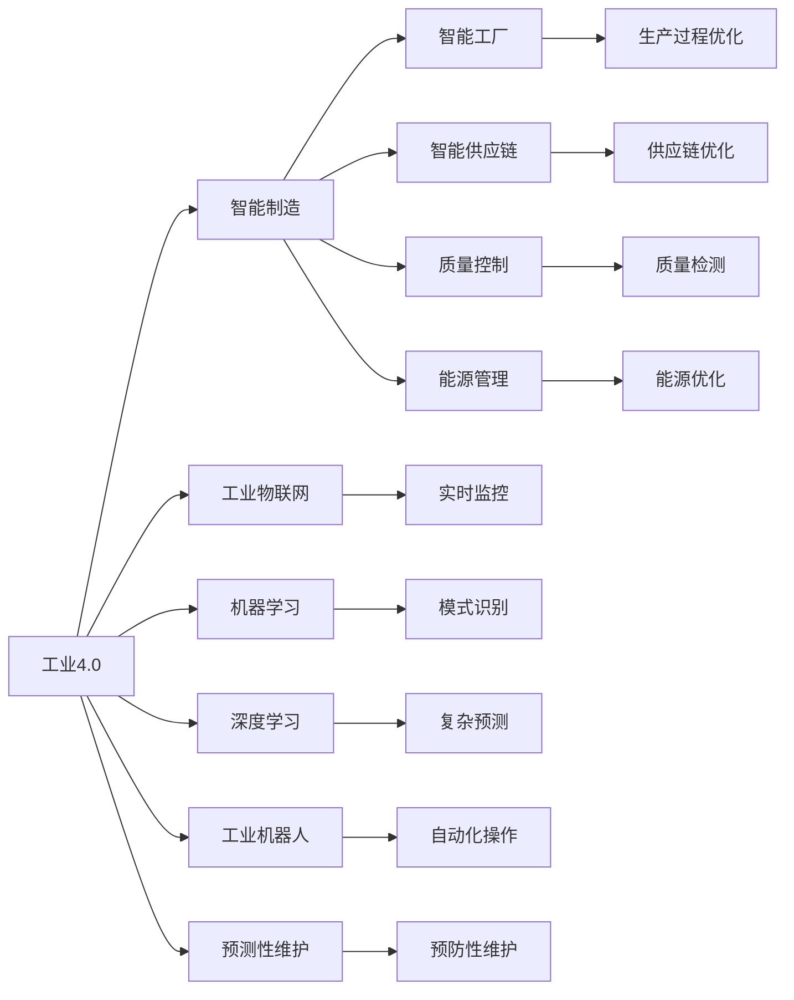
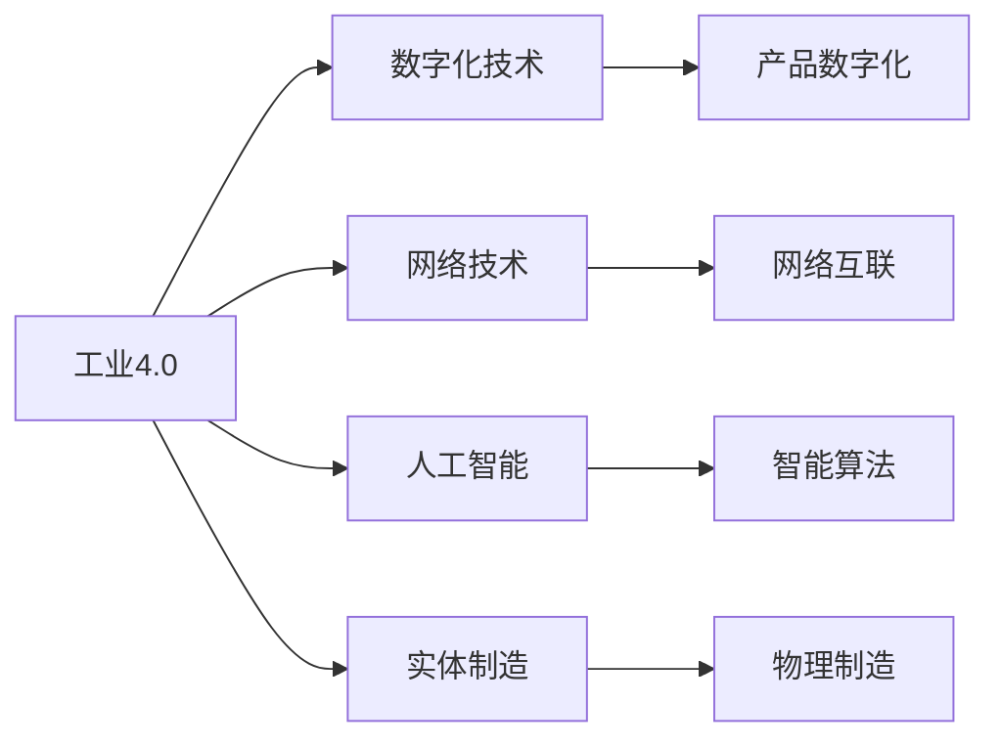
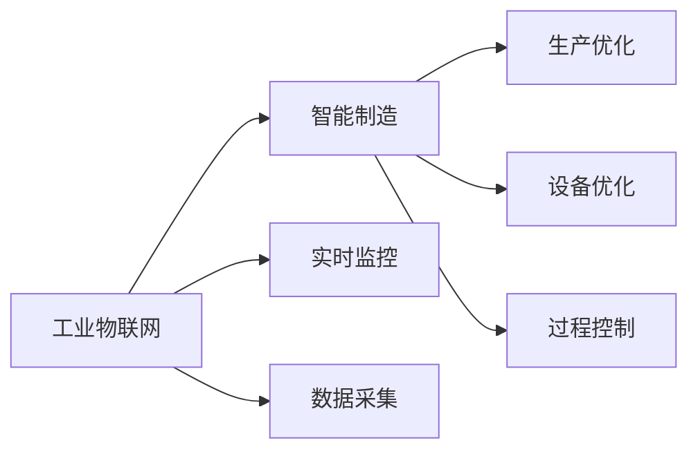
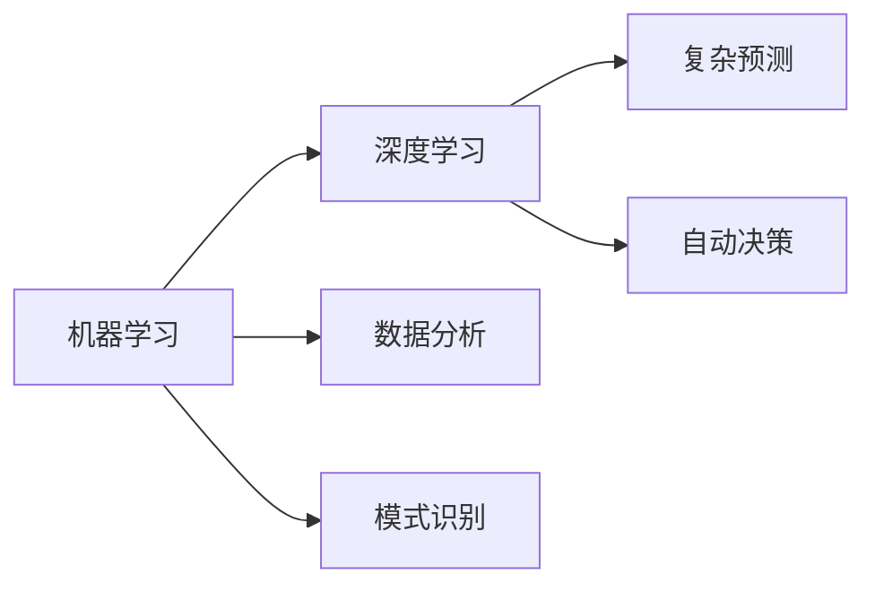
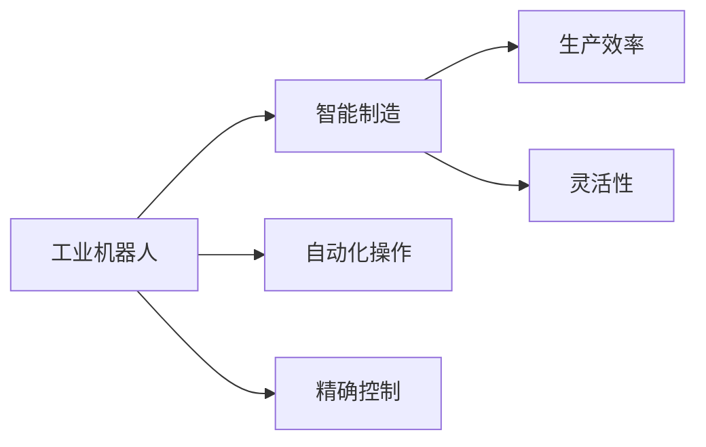
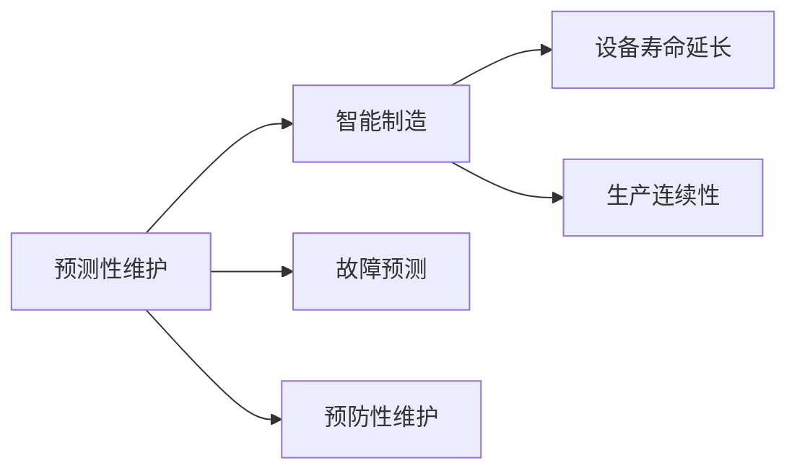
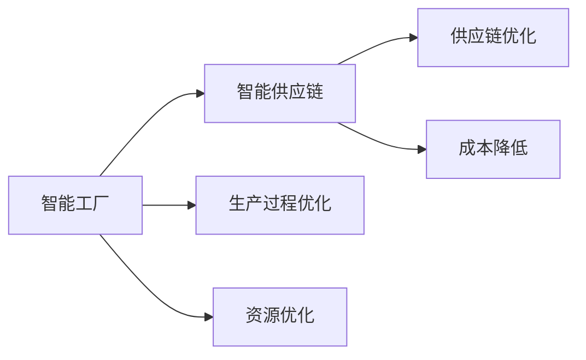
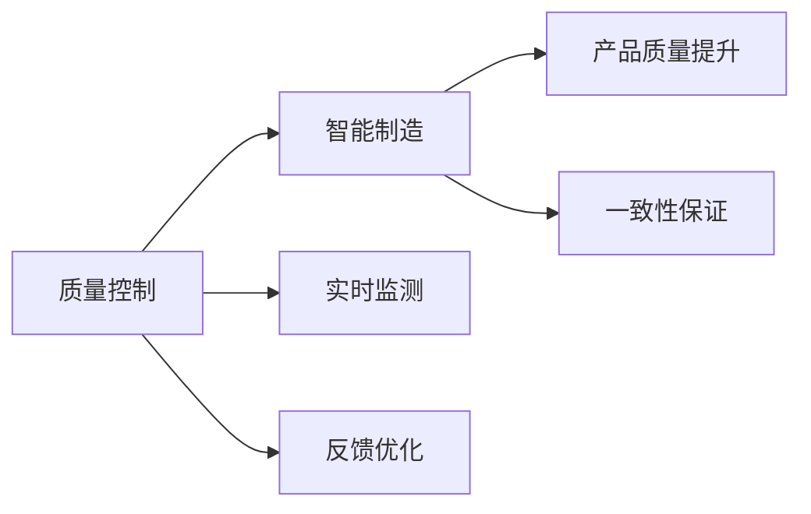
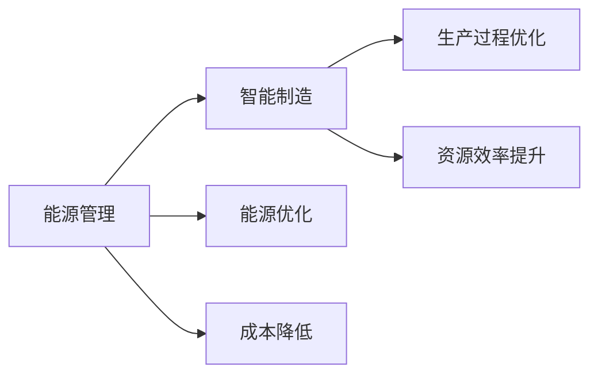
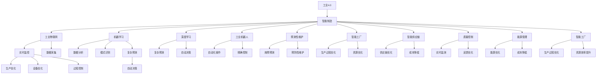

                 

# AI在智能制造中的应用:工业4.0的核心

> 关键词：工业4.0, 智能制造, AI技术, 自动化, 数据分析, 工业物联网(IoT), 机器学习, 深度学习, 工业机器人, 预测性维护, 能源管理, 智能工厂, 智能供应链

## 1. 背景介绍

### 1.1 问题由来

随着全球经济的快速发展，制造业正面临着前所未有的挑战。人口红利逐渐消失，劳动力成本不断上升，环保法规日益严格，消费者需求日益个性化。在这样的背景下，如何提升生产效率、降低成本、提高产品质量，成为制造业企业必须面对的问题。

近年来，工业4.0的概念应运而生，将数字化技术、网络技术、人工智能与实体制造深度融合，实现了生产过程的高度自动化、智能化和柔性化。其中，人工智能技术的广泛应用，成为推动工业4.0发展的核心驱动力。

### 1.2 问题核心关键点

人工智能在智能制造中的应用，主要围绕以下几个核心关键点展开：

- **自动化**：利用AI技术实现生产过程的自动化和智能化，减少人工干预。
- **数据分析**：通过大数据分析和机器学习算法，优化生产流程和资源配置。
- **工业物联网(IoT)**：将传感器、设备、软件和人员互联，实现设备和工艺的实时监控和优化。
- **预测性维护**：利用AI技术对设备进行预测性维护，避免突发故障，延长设备寿命。
- **智能工厂和供应链**：实现生产过程的可视化和优化，提升整个生产链的智能化水平。
- **质量控制**：通过AI技术实现对产品质量的实时监测和反馈，提升产品质量。
- **能源管理**：利用AI技术优化能源消耗，降低生产成本。

这些核心关键点共同构成了智能制造的基本框架，使得AI技术在工业4.0的各个环节中得到了广泛应用。

### 1.3 问题研究意义

人工智能在智能制造中的应用，具有以下几方面的重要意义：

1. **提高生产效率**：通过自动化和智能化，提升生产线的效率和灵活性，降低人工成本。
2. **优化资源配置**：通过数据分析和预测，优化资源分配和生产计划，减少资源浪费。
3. **提升产品质量**：利用AI技术实时监控和反馈，确保产品质量的一致性和稳定性。
4. **增强企业竞争力**：通过智能化改造，提升企业的市场响应速度和产品竞争力。
5. **降低运营成本**：减少故障率，优化能源和物料使用，降低企业的运营成本。

## 2. 核心概念与联系

### 2.1 核心概念概述

为更好地理解人工智能在智能制造中的应用，本节将介绍几个密切相关的核心概念：

- **工业4.0**：通过数字化技术、网络技术、人工智能与实体制造的深度融合，实现生产过程的高度自动化、智能化和柔性化。
- **智能制造**：利用先进制造技术、IT技术、网络技术、自动化技术、新型传感器技术，实现智能工厂、智能供应链、智能产品和服务。
- **工业物联网(IoT)**：将传感器、设备、软件和人员互联，实现设备和工艺的实时监控和优化。
- **机器学习**：通过算法让计算机从数据中学习，以完成某些任务，例如图像识别、语音识别、自然语言处理等。
- **深度学习**：利用多层神经网络，通过反向传播算法优化参数，进行复杂的模式识别和预测。
- **工业机器人**：在工业生产中，利用机械臂、视觉传感器等技术，实现高度自动化和智能化操作。
- **预测性维护**：通过数据分析和机器学习算法，预测设备故障，进行预防性维护，避免突发故障。
- **智能工厂和供应链**：实现生产过程的可视化和优化，提升整个生产链的智能化水平。
- **质量控制**：通过AI技术实现对产品质量的实时监测和反馈，提升产品质量。
- **能源管理**：利用AI技术优化能源消耗，降低生产成本。

这些核心概念之间的逻辑关系可以通过以下Mermaid流程图来展示：



这个流程图展示了大语言模型微调过程中各个核心概念的关系和作用：

1. 工业4.0是智能制造的基础，将数字化技术、网络技术、人工智能与实体制造深度融合。
2. 工业物联网是工业4.0的核心组成部分，通过传感器、设备、软件和人员的互联，实现设备和工艺的实时监控和优化。
3. 机器学习和深度学习是智能制造的核心技术，通过数据分析和模式识别，优化生产流程和资源配置。
4. 工业机器人在生产过程中发挥重要作用，通过自动化和智能化操作，提高生产效率和灵活性。
5. 预测性维护利用机器学习对设备进行故障预测，避免突发故障，延长设备寿命。
6. 智能工厂和供应链实现生产过程的可视化和优化，提升整个生产链的智能化水平。
7. 质量控制通过AI技术实时监测和反馈，确保产品质量的一致性和稳定性。
8. 能源管理利用AI技术优化能源消耗，降低生产成本。

这些核心概念共同构成了智能制造的基本框架，使得AI技术在工业4.0的各个环节中得到了广泛应用。

### 2.2 概念间的关系

这些核心概念之间存在着紧密的联系，形成了智能制造的整体生态系统。下面我们通过几个Mermaid流程图来展示这些概念之间的关系。

#### 2.2.1 工业4.0的基本架构



这个流程图展示了工业4.0的基本架构，即通过数字化技术、网络技术、人工智能与实体制造的深度融合，实现生产过程的高度自动化、智能化和柔性化。

#### 2.2.2 工业物联网与智能制造



这个流程图展示了工业物联网在智能制造中的应用，即通过实时监控和数据采集，优化生产过程和设备性能，实现生产过程的可视化和优化。

#### 2.2.3 机器学习与深度学习



这个流程图展示了机器学习和深度学习在智能制造中的应用，即通过数据分析和模式识别，优化生产流程和资源配置，进行复杂的模式识别和预测，并自动做出决策。

#### 2.2.4 工业机器人与智能制造



这个流程图展示了工业机器人在智能制造中的应用，即通过自动化和智能化操作，提高生产效率和灵活性。

#### 2.2.5 预测性维护与智能制造



这个流程图展示了预测性维护在智能制造中的应用，即通过故障预测和预防性维护，延长设备寿命，保持生产连续性。

#### 2.2.6 智能工厂与智能供应链



这个流程图展示了智能工厂和智能供应链在智能制造中的应用，即通过生产过程优化和资源优化，提升整个生产链的智能化水平，实现供应链优化和成本降低。

#### 2.2.7 质量控制与智能制造



这个流程图展示了质量控制在智能制造中的应用，即通过实时监测和反馈优化，确保产品质量的一致性和稳定性。

#### 2.2.8 能源管理与智能制造



这个流程图展示了能源管理在智能制造中的应用，即通过能源优化和成本降低，实现生产过程优化和资源效率提升。

### 2.3 核心概念的整体架构

最后，我们用一个综合的流程图来展示这些核心概念在大语言模型微调过程中的整体架构：



这个综合流程图展示了从工业4.0到智能制造的完整过程，各个核心概念在智能制造中的作用和相互联系。

## 3. 核心算法原理 & 具体操作步骤
### 3.1 算法原理概述

人工智能在智能制造中的应用，本质上是通过算法和数据实现生产过程的自动化、智能化和优化。其核心算法原理包括：

- **机器学习**：通过算法让计算机从数据中学习，以完成某些任务，例如图像识别、语音识别、自然语言处理等。
- **深度学习**：利用多层神经网络，通过反向传播算法优化参数，进行复杂的模式识别和预测。
- **强化学习**：通过试错学习和奖励机制，优化决策策略，实现智能控制。

这些算法在智能制造中的应用，旨在通过数据驱动和智能控制，提升生产效率、优化资源配置、增强设备性能、保障产品质量和降低运营成本。

### 3.2 算法步骤详解

基于机器学习和深度学习的AI在智能制造中的应用，主要包括以下几个关键步骤：

**Step 1: 数据收集与预处理**
- 收集工业生产中的各种数据，包括传感器数据、生产设备数据、工艺数据等。
- 对数据进行清洗、去噪、标准化等预处理，以提高数据质量。

**Step 2: 模型训练与优化**
- 根据具体的任务，选择合适的模型结构，如卷积神经网络(CNN)、循环神经网络(RNN)、长短时记忆网络(LSTM)、自编码器(AE)等。
- 使用训练数据对模型进行训练，通过反向传播算法优化模型参数。
- 使用验证数据对模型进行调优，避免过拟合。

**Step 3: 模型部署与应用**
- 将训练好的模型部署到生产设备或云端平台，实现实时监控和预测。
- 通过API接口或数据可视化工具，实时展示生产状态和决策结果。
- 定期对模型进行更新和优化，确保其适应生产环境的变化。

**Step 4: 效果评估与优化**
- 通过测试数据对模型进行评估，计算模型性能指标如准确率、召回率、F1分数等。
- 根据评估结果，对模型进行优化，调整模型参数或重新训练。

### 3.3 算法优缺点

基于机器学习和深度学习的AI在智能制造中的应用，具有以下优缺点：

**优点**：
- **高效性**：通过数据驱动，实现高效的生产过程优化和设备管理。
- **智能化**：实现生产过程的实时监控和智能控制，提升生产效率和产品质量。
- **灵活性**：适用于多种生产场景，可快速部署和应用。

**缺点**：
- **数据依赖**：需要大量的高质量数据进行训练，数据收集和标注成本较高。
- **模型复杂**：模型结构复杂，训练和优化需要较高的计算资源和时间成本。
- **鲁棒性不足**：模型对数据的变化和噪声敏感，鲁棒性有待提高。
- **可解释性差**：黑盒模型难以解释其内部决策过程，对模型调试和优化带来困难。

### 3.4 算法应用领域

基于机器学习和深度学习的AI在智能制造中的应用，已经广泛应用于以下几个领域：

1. **预测性维护**：利用机器学习对设备进行故障预测，进行预防性维护，避免突发故障，延长设备寿命。
2. **质量控制**：通过AI技术实时监测和反馈，确保产品质量的一致性和稳定性。
3. **智能工厂和供应链**：实现生产过程的可视化和优化，提升整个生产链的智能化水平。
4. **能源管理**：利用AI技术优化能源消耗，降低生产成本。
5. **自动化与智能化**：通过工业机器人和自动化设备，实现生产过程的自动化和智能化。
6. **工业物联网**：通过传感器、设备、软件和人员的互联，实现设备和工艺的实时监控和优化。

## 4. 数学模型和公式 & 详细讲解 & 举例说明

### 4.1 数学模型构建

在智能制造中，机器学习和深度学习模型的构建，通常基于以下数学模型：

1. **线性回归模型**：
   $$
   y = w_0 + w_1x_1 + w_2x_2 + \cdots + w_nx_n + \epsilon
   $$
   其中，$y$ 为目标变量，$x_i$ 为特征变量，$w_i$ 为模型参数，$\epsilon$ 为噪声。

2. **逻辑回归模型**：
   $$
   P(y=1|x) = \frac{1}{1+e^{-z}} \\
   P(y=0|x) = \frac{e^{-z}}{1+e^{-z}}
   $$
   其中，$z = w_0 + w_1x_1 + w_2x_2 + \cdots + w_nx_n$。

3. **卷积神经网络(CNN)**：
   $$
   h_i = g(\sum_{j=0}^{n-1}w_{i,j}x_j + b_i) \\
   H_k = \max_i h_i
   $$
   其中，$h_i$ 为卷积层输出，$g$ 为激活函数，$w_{i,j}$ 为卷积核，$b_i$ 为偏置项。

4. **循环神经网络(RNN)**：
   $$
   h_t = g(Uh_{t-1} + Wh_{t-1}x_t + b_h) \\
   y_t = g(Vh_t + b_y)
   $$
   其中，$h_t$ 为隐藏状态，$g$ 为激活函数，$U$、$W$、$V$ 为权重矩阵，$b_h$、$b_y$ 为偏置项。

5. **长短时记忆网络(LSTM)**：
   $$
   f_t = \sigma(W_fh_{t-1} + U_fx_t + b_f) \\
   i_t = \sigma(W_ix_{t-1} + U_ix_t + b_i) \\
   g_t = \tanh(W_gx_t + U_gh_{t-1} + b_g) \\
   o_t = \sigma(W_ox_{t-1} + U_oh_{t-1} + b_o) \\
   c_t = f_t \odot c_{t-1} + i_t \odot g_t \\
   h_t = o_t \odot \tanh(c_t)
   $$
   其中，$f_t$、$i_t$、$g_t$、$o_t$ 为门函数，$c_t$ 为细胞状态，$h_t$ 为隐藏状态。

6. **自编码器(AE)**：
   $$
   h = \sigma(Wx + b) \\
   \hat{x} = \sigma(W'h + b')
   $$
   其中，$x$ 为输入，$h$ 为隐藏层输出，$\hat{x}$ 为重构输出。

### 4.2 公式推导过程

以下我们将通过几个具体案例，对智能制造中的常见算法模型进行详细讲解。

**案例一：预测性维护**
- 数据：设备运行数据，包括温度、振动、电流等。
- 目标：预测设备故障，进行预防性维护。
- 模型：线性回归模型、决策树模型、随机森林模型、梯度提升机模型等。

**案例二：质量控制**
- 数据：生产过程中的各项指标，如压力、流量、温度等。
- 目标：实时监测产品质量，确保产品质量的一致性和稳定性。
- 模型：卷积神经网络(CNN)、循环神经网络(RNN)、长短时记忆网络(LSTM)、自编码器(AE)等。

**案例三：智能工厂和供应链**
- 数据：生产计划、物流数据、库存数据等。
- 目标：优化生产计划和供应链管理，提升生产效率和降低成本。
- 模型：线性回归模型、优化算法、强化学习算法等。

**案例四：能源管理**
- 数据：能源消耗数据、设备运行数据等。
- 目标：优化能源消耗，降低生产成本。
- 模型：卷积神经网络(CNN)、循环神经网络(RNN)、长短时记忆网络(LSTM)等。

### 4.3 案例分析与讲解

通过以上案例，我们可以更深入地理解智能制造中机器学习和深度学习的实际应用。下面将通过几个具体的案例，对智能制造中的常见算法模型进行详细讲解。

**案例一：预测性维护**
- 数据：设备运行数据，包括温度、振动、电流等。
- 目标：预测设备故障，进行预防性维护。
- 模型：线性回归模型、决策树模型、随机森林模型、梯度提升机模型等。
- 算法步骤：
  1. 数据收集与预处理：收集设备运行数据，并进行清洗、去噪、标准化等预处理。
  2. 模型训练与优化：选择合适的模型，如线性回归模型，使用训练数据进行模型训练，通过反向传播算法优化模型参数。
  3. 模型部署与应用：将训练好的模型部署到生产设备或云端平台，实现实时监控和预测。
  4. 效果评估与优化：通过测试数据对模型进行评估，计算模型性能指标如准确率、召回率、F1分数等，根据评估结果，对模型进行优化，调整模型参数或重新训练。

**案例二：质量控制**
- 数据：生产过程中的各项指标，如压力、流量、温度等。
- 目标：实时监测产品质量，确保产品质量的一致性和稳定性。
- 模型：卷积神经网络(CNN)、循环神经网络(RNN)、长短时记忆网络(LSTM)、自编码器(AE)等。
- 算法步骤：
  1. 数据收集与预处理：收集生产过程中的各项指标数据，并进行清洗、去噪、标准化等预处理。
  2. 模型训练与优化：选择合适的模型，如卷积神经网络(CNN)，使用训练数据进行模型训练，通过反向传播算法优化模型参数。
  3. 模型部署与应用：将训练好的模型部署到生产设备或云端平台，实现实时监测和反馈。
  4. 效果评估与优化：通过测试数据对模型进行评估，计算模型性能指标如准确率、召回率、F1分数等，根据评估结果，对模型进行优化，调整模型参数或重新训练。

**案例三：智能工厂和供应链**
- 数据：生产计划、物流数据、库存数据等。
- 目标：优化生产计划和供应链管理，提升生产效率和降低成本。
- 模型：线性回归模型、优化算法、强化学习算法等。
- 算法步骤：
  1. 数据收集与预处理：收集生产计划、物流数据、库存数据等，并进行清洗、去噪、标准化等预处理。
  2. 模型训练与优化：选择合适的模型，如线性回归模型，使用训练数据进行模型训练，通过反向传播算法优化模型参数。
  3. 模型部署与应用：将训练好的模型部署到生产设备或云端平台，实现实时监控和优化。
  4. 效果评估与优化：通过测试数据对模型进行评估，计算模型性能指标如准确率、召回率、F1分数等，根据评估结果，对模型进行优化，调整模型参数或重新训练。

**案例四：能源管理**
- 数据：能源消耗数据、设备运行数据等。
- 目标：优化能源消耗，降低生产成本。
- 模型：卷积神经网络(CNN)、循环神经网络(RNN)、长短时记忆网络(LSTM)等。
- 算法步骤：
  1. 数据收集与预处理：收集能源消耗数据、设备运行数据等，并进行清洗、去噪、标准化等预处理。
  2. 模型训练与优化：选择合适的模型，如卷积神经网络(CNN)，使用训练数据进行模型训练，通过反向传播算法优化模型参数。
  3. 模型部署与应用：将训练好的模型部署到生产设备或云端平台，实现实时监测和优化。
  4. 效果评估与优化：通过测试数据对模型进行评估，计算模型性能指标如准确率、召回率、F1分数等，根据评估结果，对模型进行优化，调整模型参数或重新训练。

## 5. 项目实践：代码实例和详细解释说明
### 5.1 开发环境搭建

在进行智能制造中AI模型的开发实践前，我们需要准备好开发环境。以下是使用Python进行PyTorch开发的环境配置流程：

1. 安装Anaconda：从官网下载并安装Anaconda，用于创建独立的Python环境。

2. 创建并激活虚拟环境：
```bash
conda create -n pytorch-env python=3.8 
conda activate pytorch-env
```

3. 安装PyTorch：根据CUDA版本，从官网获取对应的安装命令。例如：
```bash
conda install pytorch torchvision torchaudio cudatoolkit=11.1 -c pytorch -c conda-forge
```

4. 安装TensorFlow：安装TensorFlow库，支持多种计算平台。

5. 安装TensorBoard：TensorFlow配套的可视化工具，实时监测模型训练状态，并提供丰富的图表呈现方式。

6. 安装TensorFlow Extended(TF Extended)：TensorFlow的扩展库，提供更多的高级功能，如模型压缩、分布式训练等。

7. 安装Keras：基于TensorFlow的高层API，简化模型开发流程。

完成上述步骤后，即可在`pytorch-env`环境中开始AI模型的开发实践。

### 5.2 源代码详细实现

这里以预测性维护为例，展示使用TensorFlow进行智能制造中AI模型的代码实现。

首先，定义预测性维护的数据集：

```python
import tensorflow as tf
import pandas as pd

# 定义数据集路径
data_path = 'predictive_maintenance_data.csv'

# 读取数据集
data = pd.read_csv(data_path)

# 定义数据集的特征和标签
features = ['temperature', 'vibration', 'current']
label = 'failure_time'

# 将数据集分为训练集和测试集
train_data = data[features + [label]]
test_data = data[features]

# 定义模型输入和输出的占位符
input_placeholder = tf.placeholder(tf.float32, shape=[None, len(features)])
label_placeholder = tf.placeholder(tf.float32, shape=[None, 1])
```

然后，定义模型结构：

```python
# 定义模型参数
learning_rate = 0.01
num_epochs = 10

# 定义模型结构
model = tf.keras.Sequential([
    tf.keras.layers.Dense(64, activation='relu', input_shape=[len(features)]),
    

