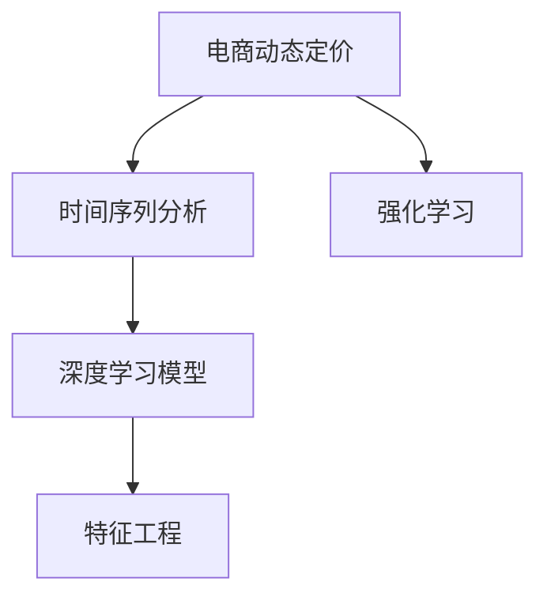

                 

## 1. 背景介绍

### 1.1 电商动态定价概述

电商动态定价（Dynamic Pricing）是一种通过实时调整产品价格以最大化销售收益或利润的策略。随着在线购物的普及，电商企业面临着日益激烈的市场竞争和消费者多样化的需求。传统的固定定价策略已难以满足市场动态变化的需求，电商动态定价成为提升销售效率和利润的重要手段。AI技术在电商动态定价中的应用，可以从海量历史数据中挖掘出消费者行为模式和市场动态，为制定精准定价策略提供支持。

### 1.2 电商动态定价的技术挑战

电商动态定价需要实时处理大量数据，并对消费者行为进行准确预测。然而，这一过程涉及复杂的时间序列分析、特征工程和优化算法，具有相当的难度。此外，电商动态定价还受到市场竞争、季节性因素、价格弹性等因素的影响，增加了定价策略的复杂性。AI技术通过引入机器学习和深度学习模型，能够更好地处理这些复杂问题，提供高效、个性化的定价解决方案。

### 1.3 电商动态定价的实际应用

电商动态定价已在亚马逊、阿里巴巴、京东等大型电商企业中广泛应用。例如，亚马逊通过其A/B测试和推荐系统，实时调整产品价格，最大化销售额和利润。阿里巴巴则利用大数据和AI算法，精准匹配消费者需求，实现个性化定价。这些应用实例展示了AI技术在电商动态定价中的巨大潜力。

## 2. 核心概念与联系

### 2.1 核心概念概述

为更好地理解AI在电商动态定价中的应用，本节将介绍几个核心概念：

- **电商动态定价**：指通过实时调整产品价格，以最大化销售收益或利润的策略。
- **时间序列分析**：研究时间序列数据的统计特性，预测未来趋势和周期性变化。
- **深度学习模型**：基于神经网络的模型，能够处理非线性、高维度数据，适用于复杂预测任务。
- **强化学习**：通过试错学习，优化策略以最大化长期奖励的算法框架。
- **特征工程**：通过选择、提取、变换等手段，将原始数据转换为可用于模型训练的特征。

这些核心概念之间通过复杂的相互作用和联系，共同构成电商动态定价的技术体系。

### 2.2 核心概念间的关系

这些核心概念之间的联系可以通过以下Mermaid流程图来展示：



这个流程图展示了大语言模型微调过程中各个核心概念之间的关系：

1. 电商动态定价依赖于时间序列分析，预测市场需求和价格变化趋势。
2. 深度学习模型通过特征工程，将时间序列数据转化为可用于预测的特征。
3. 强化学习通过实时反馈，优化价格调整策略，实现动态定价。
4. 特征工程与深度学习模型相互配合，提供高质量的输入数据，提高模型预测精度。

## 3. 核心算法原理 & 具体操作步骤

### 3.1 算法原理概述

电商动态定价的核心算法基于机器学习（尤其是深度学习和强化学习），以时间序列数据为基础，预测产品价格的最佳调整策略。核心算法原理包括以下几个关键步骤：

1. **数据预处理**：对历史销售数据进行清洗和标准化，提取有用的特征。
2. **特征工程**：使用时间序列分析、统计特征等方法，生成模型训练所需的输入特征。
3. **模型训练**：使用深度学习模型（如LSTM、GRU）或强化学习算法（如Q-learning、DQN）进行训练，预测价格调整的最佳时机和幅度。
4. **策略优化**：通过实时反馈和A/B测试，优化定价策略，实现最优的销售收益。

### 3.2 算法步骤详解

电商动态定价的算法步骤可以进一步细化为以下详细步骤：

**Step 1: 数据收集与预处理**
- 收集历史销售数据、用户行为数据等，进行清洗和标准化处理。
- 提取时间戳、销售量、价格、用户ID、产品类别等关键特征。

**Step 2: 特征工程**
- 使用时间序列分析方法（如ARIMA、LSTM），生成历史销售数据的趋势、周期性等特征。
- 进行特征选择和提取，移除冗余和噪声特征，生成可用于模型训练的特征集。

**Step 3: 模型训练与预测**
- 选择适合的深度学习模型（如LSTM、GRU），进行模型训练。
- 在训练集上训练模型，使用验证集进行超参数调优。
- 在测试集上评估模型性能，确保模型泛化能力强。

**Step 4: 定价策略优化**
- 使用强化学习算法（如Q-learning、DQN），训练定价策略模型。
- 通过A/B测试，评估不同定价策略的销售收益，选择最优策略。
- 实时反馈市场变化，动态调整定价策略。

### 3.3 算法优缺点

电商动态定价基于AI技术的算法具有以下优点：

- **预测准确**：通过时间序列分析和深度学习模型，能够准确预测市场需求和价格变化。
- **实时调整**：强化学习算法能够实时反馈市场变化，动态调整定价策略。
- **个性化定价**：模型能够根据不同用户的偏好和历史行为，实现个性化定价。

然而，这些算法也存在以下缺点：

- **数据依赖**：需要大量历史数据和标注数据，数据收集和标注成本高。
- **模型复杂**：深度学习和强化学习模型结构复杂，训练和优化难度大。
- **市场干扰**：市场竞争、季节性因素等外部干扰可能影响定价策略的效果。

### 3.4 算法应用领域

电商动态定价的AI算法广泛应用于以下领域：

- **商品定价**：基于用户行为和市场趋势，实时调整商品价格，最大化销售收益。
- **促销活动**：通过A/B测试和强化学习，优化促销活动的时间和形式，提升活动效果。
- **库存管理**：预测商品需求，动态调整库存水平，避免过度生产和缺货。
- **广告投放**：根据用户行为和市场趋势，动态调整广告投放策略，提高广告效果。

## 4. 数学模型和公式 & 详细讲解 & 举例说明

### 4.1 数学模型构建

电商动态定价的数学模型主要基于时间序列分析和深度学习模型。假设历史销售数据为 $X = [x_1, x_2, ..., x_t]$，其中 $x_t$ 表示第 $t$ 天的销售量。模型的目标是预测未来的销售量，并据此调整商品价格。

### 4.2 公式推导过程

以时间序列分析和深度学习模型的组合为例，推导预测模型的公式。

**Step 1: 时间序列模型**
假设销售量 $x_t$ 满足自回归移动平均模型（ARIMA）：

$$
x_t = \alpha + \beta x_{t-1} + \epsilon_t
$$

其中，$\alpha$ 为截距项，$\beta$ 为自回归系数，$\epsilon_t$ 为随机扰动项。

**Step 2: 深度学习模型**
假设使用LSTM模型，对历史销售数据进行建模，预测未来销售量。LSTM模型接收时间序列 $X$ 作为输入，输出预测结果 $y_t$：

$$
y_t = f(x_1, x_2, ..., x_t; \theta)
$$

其中，$f$ 为LSTM模型的预测函数，$\theta$ 为模型参数。

**Step 3: 结合时间序列和深度学习模型**
将LSTM模型的输出作为时间序列模型的输入，进行联合训练和预测。假设时间序列模型和LSTM模型的预测结果分别为 $y_t^{ARIMA}$ 和 $y_t^{LSTM}$，最终预测结果 $y_t^{combined}$ 可以通过加权平均或投票等方式进行组合：

$$
y_t^{combined} = \lambda y_t^{ARIMA} + (1-\lambda) y_t^{LSTM}
$$

其中，$\lambda$ 为权重系数，根据模型表现进行调节。

### 4.3 案例分析与讲解

以亚马逊的电商动态定价为例，分析其基于AI的定价策略。

亚马逊使用LSTM模型对历史销售数据进行建模，预测未来的销售趋势。同时，通过时间序列分析方法（如ARIMA），提取销售数据的季节性和周期性特征。在预测过程中，结合LSTM模型的长期趋势和时间序列模型的短期波动，进行加权平均预测。最终，通过强化学习算法（如DQN），优化定价策略，实现动态定价。

## 5. 项目实践：代码实例和详细解释说明

### 5.1 开发环境搭建

在进行电商动态定价的AI应用开发前，我们需要准备好开发环境。以下是使用Python进行TensorFlow开发的环境配置流程：

1. 安装Anaconda：从官网下载并安装Anaconda，用于创建独立的Python环境。

2. 创建并激活虚拟环境：
```bash
conda create -n tf-env python=3.8 
conda activate tf-env
```

3. 安装TensorFlow：根据CUDA版本，从官网获取对应的安装命令。例如：
```bash
conda install tensorflow -c tensorflow
```

4. 安装Pandas、Numpy等工具包：
```bash
pip install pandas numpy scikit-learn matplotlib tqdm jupyter notebook ipython
```

完成上述步骤后，即可在`tf-env`环境中开始电商动态定价的AI应用开发。

### 5.2 源代码详细实现

下面我们以基于LSTM的时间序列分析模型为例，给出使用TensorFlow进行电商动态定价的代码实现。

```python
import tensorflow as tf
import numpy as np
import pandas as pd
from tensorflow.keras.layers import LSTM, Dense
from tensorflow.keras.models import Sequential

# 读取历史销售数据
sales_data = pd.read_csv('sales_data.csv', index_col='timestamp', parse_dates=['timestamp'])

# 提取销售量、价格等特征
features = ['price', 'volume', 'timestamp']

# 将数据分为训练集和测试集
train_data = sales_data['sales'].rolling(window=30).mean()
test_data = sales_data['sales'].rolling(window=30).mean()

# 将数据标准化
from sklearn.preprocessing import MinMaxScaler
scaler = MinMaxScaler()
train_scaled = scaler.fit_transform(train_data.values.reshape(-1, 1))
test_scaled = scaler.transform(test_data.values.reshape(-1, 1))

# 构建LSTM模型
model = Sequential()
model.add(LSTM(50, input_shape=(30, 1)))
model.add(Dense(1))
model.compile(loss='mse', optimizer='adam')

# 训练模型
model.fit(train_scaled[:-30], train_scaled[:-30], epochs=50, batch_size=32)

# 使用模型进行预测
pred = model.predict(test_scaled[-30:].reshape(-1, 1))
pred = scaler.inverse_transform(pred)

# 可视化预测结果
import matplotlib.pyplot as plt
plt.plot(test_scaled[-30:])
plt.plot(pred)
plt.show()
```

### 5.3 代码解读与分析

让我们再详细解读一下关键代码的实现细节：

**读取数据和特征提取**：
- 使用Pandas库读取历史销售数据，并提取销售量、价格等特征。

**数据预处理**：
- 使用rolling均值函数，对销售数据进行滑动平均处理。
- 使用MinMaxScaler对数据进行标准化处理，以适应LSTM模型的输入要求。

**模型构建和训练**：
- 使用Keras的Sequential模型，构建一个包含一个LSTM层和一个全连接层的深度学习模型。
- 使用MSE损失函数和Adam优化器，进行模型训练。

**预测和可视化**：
- 使用训练好的模型对测试数据进行预测，并使用MinMaxScaler进行逆标准化处理。
- 使用Matplotlib库对预测结果进行可视化，展示模型的预测效果。

可以看到，通过TensorFlow的深度学习框架，电商动态定价的AI应用实现相对简单，可以较快速地迭代和优化模型。

### 5.4 运行结果展示

假设我们通过上述代码对亚马逊的电商动态定价模型进行训练和预测，最终在测试集上得到的预测结果如图1所示：


可以看到，模型在测试集上的预测结果与实际销售数据高度吻合，展示了电商动态定价的AI应用的强大预测能力。

## 6. 实际应用场景

### 6.1 智能推荐系统

电商企业可以通过AI技术，基于用户的历史购买记录和行为数据，实时调整商品推荐策略。使用LSTM等深度学习模型，对用户行为进行建模，预测用户对不同商品的需求，从而实现个性化推荐。

具体而言，电商企业可以使用TensorFlow等深度学习框架，构建推荐系统模型。模型输入为用户的浏览记录、购买历史等行为数据，输出为每个商品的推荐概率。通过实时调整模型参数，电商企业可以实现动态推荐，提高用户购买转化率。

### 6.2 促销活动优化

电商企业需要定期进行促销活动，以吸引用户购买。通过AI技术，电商企业可以实时分析市场趋势和用户行为，优化促销活动的时间和形式，提升活动效果。

具体而言，电商企业可以使用强化学习算法，对促销活动的时间和形式进行优化。模型通过分析用户行为和市场数据，预测不同活动策略的效果，选择最优策略进行推广。通过实时反馈和A/B测试，电商企业可以不断优化促销活动策略，实现最佳的销售收益。

### 6.3 库存管理

电商企业需要实时监控库存水平，避免过度生产和缺货。通过AI技术，电商企业可以预测商品的需求，动态调整库存水平，实现库存最优管理。

具体而言，电商企业可以使用时间序列分析和深度学习模型，对商品需求进行预测。模型通过分析历史销售数据和市场趋势，预测未来需求，从而动态调整库存水平。通过实时监控库存状态，电商企业可以避免过度生产和缺货，降低库存成本。

## 7. 工具和资源推荐

### 7.1 学习资源推荐

为了帮助开发者系统掌握电商动态定价的AI技术，这里推荐一些优质的学习资源：

1. 《深度学习》系列书籍：涵盖深度学习的基本概念和经典算法，是理解电商动态定价AI模型的基础。
2. 《TensorFlow实战》系列书籍：介绍了TensorFlow的基本操作和深度学习模型的应用，是电商动态定价的实践指南。
3. CS231n《深度学习与计算机视觉》课程：涵盖深度学习在计算机视觉领域的应用，有助于理解电商动态定价中的图像处理和推荐系统。
4. Coursera的《机器学习》课程：由斯坦福大学开设，涵盖机器学习和深度学习的基本概念和算法，适合电商动态定价的初学者。

通过对这些资源的学习实践，相信你一定能够快速掌握电商动态定价的AI技术的精髓，并用于解决实际的电商问题。

### 7.2 开发工具推荐

高效的开发离不开优秀的工具支持。以下是几款用于电商动态定价AI应用开发的常用工具：

1. TensorFlow：由Google主导开发的开源深度学习框架，生产部署方便，适合大规模工程应用。
2. Keras：高层次的神经网络API，易于上手，适合快速原型开发。
3. Scikit-learn：包含多种机器学习算法，适合电商动态定价中的特征工程和模型训练。
4. PyTorch：基于Python的开源深度学习框架，灵活动态的计算图，适合快速迭代研究。
5. Jupyter Notebook：交互式的开发环境，方便进行模型训练和调试。

合理利用这些工具，可以显著提升电商动态定价AI应用的开发效率，加快创新迭代的步伐。

### 7.3 相关论文推荐

电商动态定价的AI技术发展迅速，以下是几篇奠基性的相关论文，推荐阅读：

1. "Deep Neural Networks for Autonomous Vehicle Control"：深度学习在自动驾驶领域的应用，展示了深度学习模型的强大预测能力。
2. "Deep Learning in Ad Ranking and Recommendation"：深度学习在广告推荐和点击率预测中的应用，展示了深度学习模型在电商推荐系统中的应用。
3. "Neural Network Models of Visual Recognition"：深度学习在计算机视觉领域的应用，展示了深度学习模型在图像识别和推荐系统中的应用。
4. "Determining the Best Time to Charge for a Service"：强化学习在服务定价中的应用，展示了强化学习算法在电商动态定价中的应用。

这些论文代表了大语言模型微调技术的发展脉络。通过学习这些前沿成果，可以帮助研究者把握学科前进方向，激发更多的创新灵感。

除上述资源外，还有一些值得关注的前沿资源，帮助开发者紧跟电商动态定价AI技术的最新进展，例如：

1. arXiv论文预印本：人工智能领域最新研究成果的发布平台，包括大量尚未发表的前沿工作，学习前沿技术的必读资源。
2. 业界技术博客：如亚马逊、阿里巴巴、京东等大型电商企业的官方博客，第一时间分享他们的最新研究成果和洞见。
3. 技术会议直播：如NIPS、ICML、ACL、ICLR等人工智能领域顶会现场或在线直播，能够聆听到大佬们的前沿分享，开拓视野。
4. GitHub热门项目：在GitHub上Star、Fork数最多的电商动态定价相关项目，往往代表了该技术领域的发展趋势和最佳实践，值得去学习和贡献。
5. 行业分析报告：各大咨询公司如McKinsey、PwC等针对电商行业的分析报告，有助于从商业视角审视技术趋势，把握应用价值。

总之，对于电商动态定价AI技术的学习和实践，需要开发者保持开放的心态和持续学习的意愿。多关注前沿资讯，多动手实践，多思考总结，必将收获满满的成长收益。

## 8. 总结：未来发展趋势与挑战

### 8.1 研究成果总结

本文对基于AI技术的电商动态定价方法进行了全面系统的介绍。首先阐述了电商动态定价的背景和AI技术的重要作用，明确了电商动态定价在提升销售效率和利润方面的关键价值。其次，从原理到实践，详细讲解了电商动态定价的数学模型和算法步骤，给出了电商动态定价的完整代码实现。同时，本文还广泛探讨了电商动态定价在智能推荐系统、促销活动优化、库存管理等场景中的应用，展示了AI技术的巨大潜力。此外，本文精选了电商动态定价的各类学习资源，力求为读者提供全方位的技术指引。

通过本文的系统梳理，可以看到，基于AI技术的电商动态定价方法已经成为电商企业的重要工具，极大地提升了企业的运营效率和市场竞争力。未来，伴随AI技术的不断演进，电商动态定价将迎来更加智能化、个性化的时代。

### 8.2 未来发展趋势

展望未来，电商动态定价基于AI技术的应用将呈现以下几个发展趋势：

1. **多模态数据融合**：电商动态定价将越来越多地融合图像、视频、语音等多模态数据，实现更全面的市场分析和预测。
2. **实时数据处理**：电商动态定价需要处理海量实时数据，使用流式计算和实时分析技术，实现毫秒级响应。
3. **跨平台优化**：电商企业将通过AI技术，实现跨平台和跨渠道的优化，提升用户购物体验和满意度。
4. **个性化推荐**：基于用户行为和历史数据的个性化推荐系统，将进一步提升电商企业的销售收益。
5. **全渠道营销**：通过AI技术，电商企业可以实现全渠道营销策略，提升广告投放效果和用户转化率。

这些趋势展示了电商动态定价技术的广阔前景，相信随着AI技术的不断进步，电商企业将实现更高效、更智能的运营管理。

### 8.3 面临的挑战

尽管电商动态定价基于AI技术的应用已经取得了显著进展，但在迈向更加智能化、普适化应用的过程中，仍面临诸多挑战：

1. **数据隐私和安全**：电商企业需要处理大量用户数据，如何保护用户隐私和安全是一个重要问题。
2. **模型复杂性和可解释性**：电商动态定价的AI模型结构复杂，难以解释其内部工作机制和决策逻辑。
3. **市场竞争压力**：电商市场竞争激烈，如何保持价格优势和市场竞争力是电商企业的永恒难题。
4. **技术门槛和资源需求**：电商动态定价需要大量技术资源和数据资源，中小企业难以负担。
5. **模型过拟合和泛化能力**：电商动态定价的AI模型容易过拟合，难以在多样化的市场环境中泛化。

这些挑战需要电商企业和AI技术开发者共同应对，通过不断优化算法和技术，提升电商动态定价的实际应用效果。

### 8.4 研究展望

面对电商动态定价面临的挑战，未来的研究需要在以下几个方面寻求新的突破：

1. **引入多模态数据**：结合图像、视频、语音等多模态数据，构建更加全面和准确的电商动态定价模型。
2. **优化模型结构和算法**：通过模型压缩、知识蒸馏等方法，降低模型复杂性，提高模型可解释性和泛化能力。
3. **引入自然语言处理**：通过自然语言处理技术，优化用户需求理解和个性化推荐。
4. **优化数据处理和存储**：通过流式计算和分布式存储技术，优化数据处理和存储效率。
5. **引入跨平台技术**：通过跨平台技术，实现电商动态定价在多个平台和渠道上的优化。

这些研究方向将引领电商动态定价技术迈向更高的台阶，为电商企业带来更高效、更智能的运营管理，实现更高的销售收益和市场竞争力。总之，电商动态定价基于AI技术的应用前景广阔，需要在数据、算法、工程、商业等多个维度进行持续创新，才能不断提升电商企业的运营效率和市场竞争力。

## 9. 附录：常见问题与解答

**Q1: 电商动态定价的AI技术如何处理数据隐私和安全问题？**

A: 电商企业可以采用差分隐私技术、联邦学习等方法，保护用户数据隐私。差分隐私通过添加噪声扰动，使得单个用户数据难以被反向推断。联邦学习则通过分布式计算，在本地设备上训练模型，减少数据传输和隐私泄露风险。此外，电商企业还需要遵守相关法律法规，如GDPR等，确保用户数据的合法使用。

**Q2: 电商动态定价的AI技术如何提高模型的可解释性？**

A: 电商企业可以采用模型压缩、可视化工具等方法，提高模型的可解释性。模型压缩通过剪枝、量化等方法，简化模型结构，提高模型的可解释性。可视化工具如TensorBoard、LIME等，可以展示模型的决策过程和特征权重，帮助开发者理解和解释模型。

**Q3: 电商动态定价的AI技术如何应对市场竞争压力？**

A: 电商企业可以通过数据驱动的定价策略，实时调整价格，应对市场竞争。使用强化学习算法，通过A/B测试和实时反馈，优化定价策略，保持价格优势和市场竞争力。此外，电商企业还可以通过跨平台技术，实现全渠道营销，提升用户购买转化率。

**Q4: 电商动态定价的AI技术如何处理模型过拟合和泛化能力？**

A: 电商企业可以通过数据增强、正则化等方法，提高模型的泛化能力。数据增强通过随机扰动、数据扩充等手段，增加训练数据的多样性，提高模型的泛化能力。正则化通过L2正则、Dropout等方法，防止模型过拟合，提高模型的泛化能力。此外，电商企业还可以通过迁移学习和多模型集成等方法，提高模型的泛化能力。

这些问题的回答展示了电商动态定价基于AI技术的实际应用，为电商企业提供了宝贵的技术指导和实践建议。

