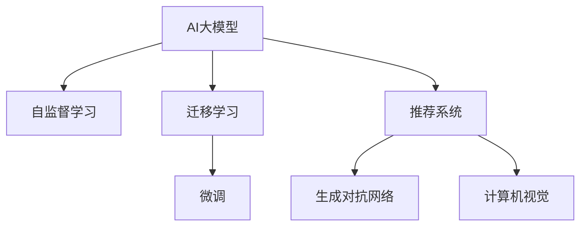

                 

# AI大模型创业：如何应对未来行业发展趋势？

> 关键词：人工智能创业,大模型技术,未来趋势,产业应用,创业策略

## 1. 背景介绍

### 1.1 问题由来

在过去几年里，人工智能大模型(AI Large Model)成为了科技领域的宠儿，快速地推动了自然语言处理(NLP)、计算机视觉(CV)、推荐系统等多个领域的发展。例如，基于大模型的GPT、BERT等模型，在语言理解、生成、分类等任务上取得了显著的突破，推动了搜索引擎、智能客服、机器翻译、内容推荐等应用的革新。

但随着大模型技术的普及和应用，越来越多的创业公司、初创企业加入了这场AI技术的竞技赛场。如何在这场激烈的市场竞争中脱颖而出，成为了每一位AI创业者亟需思考的问题。

### 1.2 问题核心关键点

面对未来市场发展的趋势，创业者需要把握几个关键点：

- **技术发展**：理解AI大模型技术发展方向，关注前沿技术研究，如自监督学习、知识图谱、生成对抗网络(GANs)等。
- **应用场景**：确定目标市场的具体应用场景，如智能客服、推荐系统、内容生成等，选择适合的市场切入点。
- **商业模式**：探索基于大模型技术的商业模式，如SaaS、API服务、定制化解决方案等，寻找可持续的盈利模式。
- **市场策略**：制定合适的市场推广策略，包括线上线下推广、合作伙伴关系、用户教育等。
- **技术研发**：持续投入技术研发，不断迭代优化模型性能，满足实际需求。

### 1.3 问题研究意义

掌握未来AI大模型创业的趋势，对于初创企业而言，意味着能够更好地应对市场变化，抓住机遇，快速落地应用，构建竞争优势。这对于推动AI技术在各行各业的应用，加速AI产业的繁荣，具有重要意义。

## 2. 核心概念与联系

### 2.1 核心概念概述

为了更好地理解AI大模型创业，我们首先介绍几个核心概念及其相互关系：

- **AI大模型(AI Large Model)**：指基于深度学习，通过大规模数据训练得到的通用语言、图像、视频等表示模型。其特点是参数量庞大，通常以亿为单位，具备强大的学习和推理能力。
- **自监督学习(Self-Supervised Learning)**：利用无标签数据进行模型训练，无需人工标注，可以自动发现数据中的结构化信息。
- **迁移学习(Transfer Learning)**：将一个领域学到的知识迁移到另一个领域，通过微调大模型适应新任务。
- **生成对抗网络(GANs)**：通过两个神经网络对抗生成模型和判别模型，学习生成高质量的样本数据。
- **推荐系统(Recommendation System)**：利用用户历史行为和物品属性，预测用户可能感兴趣的物品，实现个性化推荐。
- **计算机视觉(CV)**：利用机器学习算法，使计算机能够“看”懂图像和视频，并执行视觉任务。

这些概念之间相互联系，共同构成了AI大模型的基础架构和应用框架。

### 2.2 概念间的关系

通过以下Mermaid流程图，展示这些核心概念之间的逻辑关系：



这个流程图展示了AI大模型技术通过自监督学习、迁移学习和微调等手段，在推荐系统、生成对抗网络、计算机视觉等多个领域的应用。

## 3. 核心算法原理 & 具体操作步骤
### 3.1 算法原理概述

AI大模型的创业，从技术层面来看，主要包括以下几个关键步骤：

1. **数据预处理**：收集和处理数据，生成训练集、验证集和测试集。
2. **模型选择**：选择合适的预训练大模型，如BERT、GPT等。
3. **模型微调**：在目标任务上对预训练模型进行微调，调整部分或全部模型参数。
4. **性能评估**：在测试集上评估模型性能，对比微调前后结果。
5. **应用部署**：将模型部署到实际应用场景中，集成到业务系统中。

### 3.2 算法步骤详解

下面是AI大模型创业的具体操作步骤：

**Step 1: 数据预处理**
- 收集目标领域的相关数据，如文本、图片、视频等。
- 清洗数据，去除噪声和无关信息。
- 数据增强，如旋转、裁剪、滤波等，丰富数据多样性。
- 生成训练集、验证集和测试集，确保数据分布的均衡性。

**Step 2: 模型选择**
- 根据任务类型，选择合适的大模型，如BERT、GPT等。
- 预训练大模型通常具有较高的通用性，可以显著减少从头训练的计算成本和时间。

**Step 3: 模型微调**
- 选择合适的微调框架，如PyTorch、TensorFlow等。
- 加载预训练模型和数据集。
- 设计合适的输出层和损失函数。
- 设置微调超参数，如学习率、批大小、迭代轮数等。
- 使用梯度下降等优化算法，最小化损失函数，更新模型参数。

**Step 4: 性能评估**
- 在测试集上评估模型性能，如准确率、精确率、召回率等。
- 通过A/B测试、对比实验等方式，对比微调前后的结果。

**Step 5: 应用部署**
- 将模型封装为API服务，便于调用和集成。
- 部署到云平台或本地服务器，确保系统稳定性和高可用性。
- 集成到业务系统，实现实际应用。

### 3.3 算法优缺点

AI大模型创业的优点包括：
1. 通用性强：预训练大模型具有较高的通用性，可以应用于多个领域和任务。
2. 参数高效：通过微调等参数高效技术，在固定大部分预训练参数的情况下，仍可取得不错的微调效果。
3. 快速迭代：借助开源框架和丰富的预训练模型资源，可以快速构建原型和迭代模型性能。
4. 高精度：大模型通常具有较高的模型精度和泛化能力，能够处理复杂的任务。

同时，该方法也存在一些缺点：
1. 数据依赖：微调效果很大程度上取决于数据的质量和数量，高质量标注数据的获取成本较高。
2. 迁移能力有限：当目标任务与预训练数据的分布差异较大时，微调的性能提升有限。
3. 计算资源需求高：大模型的训练和推理需要较高的计算资源，初期投入较大。
4. 模型解释性不足：深度学习模型的决策过程通常缺乏可解释性，难以对其推理逻辑进行分析和调试。

尽管存在这些缺点，但AI大模型创业仍是一种高效、快速、有潜力的技术发展方向。

### 3.4 算法应用领域

AI大模型创业技术已经广泛应用于多个领域，以下是几个典型的应用场景：

- **智能客服系统**：通过微调大模型，实现对用户问题的自然语言理解和快速响应，提高客户服务效率。
- **推荐系统**：利用大模型进行用户行为预测和物品推荐，实现个性化推荐，提升用户体验。
- **内容生成**：基于大模型生成高质量的新闻、文章、评论等，丰富内容创作者的生产力。
- **计算机视觉**：通过微调大模型，实现图像分类、物体检测、图像生成等计算机视觉任务。
- **自然语言处理(NLP)**：利用大模型进行语言理解、翻译、情感分析等NLP任务。

除了这些经典应用外，AI大模型创业技术还在医疗、金融、教育等多个领域得到了广泛应用，展现了其在现实世界中的强大能力。

## 4. 数学模型和公式 & 详细讲解  
### 4.1 数学模型构建

AI大模型的创业，从数学模型层面来看，主要包括以下几个关键步骤：

- **损失函数设计**：选择合适的损失函数，如交叉熵、均方误差等。
- **梯度下降优化**：使用梯度下降等优化算法，最小化损失函数，更新模型参数。
- **正则化技术**：使用L2正则、Dropout等技术，防止模型过拟合。

假设我们有一个二分类任务，目标是将文本数据分为正类和负类，损失函数为交叉熵损失：

$$
\ell(\hat{y}, y) = -\sum_{i=1}^n (y_i\log\hat{y}_i + (1-y_i)\log(1-\hat{y}_i))
$$

其中，$y$为真实标签，$\hat{y}$为模型预测概率，$n$为样本数量。

### 4.2 公式推导过程

下面以二分类任务为例，推导梯度下降优化的过程。

假设模型 $M_{\theta}$ 在输入 $x$ 上的输出为 $\hat{y}=M_{\theta}(x) \in [0,1]$，表示样本属于正类的概率。真实标签 $y \in \{0,1\}$。则交叉熵损失函数定义为：

$$
\ell(M_{\theta}(x),y) = -[y\log \hat{y} + (1-y)\log(1-\hat{y})]
$$

通过链式法则，损失函数对模型参数 $\theta$ 的梯度为：

$$
\frac{\partial \ell}{\partial \theta} = -\frac{\partial}{\partial \theta}\left(y\log\hat{y} + (1-y)\log(1-\hat{y})\right)
$$

进一步展开得：

$$
\frac{\partial \ell}{\partial \theta} = -\frac{y}{\hat{y}}\frac{\partial \hat{y}}{\partial \theta} + \frac{1-y}{1-\hat{y}}\frac{\partial (1-\hat{y})}{\partial \theta}
$$

将 $\frac{\partial \hat{y}}{\partial \theta}$ 和 $\frac{\partial (1-\hat{y})}{\partial \theta}$ 代入上式，并利用梯度下降算法更新模型参数。

### 4.3 案例分析与讲解

以推荐系统为例，探讨如何在推荐任务上应用AI大模型。

推荐系统是一种典型的AI大模型应用，目标是根据用户历史行为和物品属性，预测用户可能感兴趣的物品。其核心问题在于如何设计合适的输出层和损失函数。

假设推荐系统有一个包含用户历史行为和物品属性特征的输入矩阵 $X$，目标预测每个物品 $i$ 被用户 $j$ 点击的概率。输出层设计为：

$$
\hat{y}_{i,j} = \sigma(WX_i + b)
$$

其中，$\sigma$为激活函数，$W$为权重矩阵，$b$为偏置向量。

选择交叉熵损失函数：

$$
\ell(X_i, Y_i) = -\sum_j \left(y_{i,j}\log\hat{y}_{i,j} + (1-y_{i,j})\log(1-\hat{y}_{i,j})\right)
$$

其中，$y_{i,j}$为实际点击标签，$\hat{y}_{i,j}$为模型预测概率。

通过梯度下降算法更新模型参数，最小化损失函数，即可实现推荐系统。

## 5. 项目实践：代码实例和详细解释说明
### 5.1 开发环境搭建

在进行AI大模型创业项目实践前，我们需要准备好开发环境。以下是使用Python进行PyTorch开发的环境配置流程：

1. 安装Anaconda：从官网下载并安装Anaconda，用于创建独立的Python环境。

2. 创建并激活虚拟环境：
```bash
conda create -n pytorch-env python=3.8 
conda activate pytorch-env
```

3. 安装PyTorch：根据CUDA版本，从官网获取对应的安装命令。例如：
```bash
conda install pytorch torchvision torchaudio cudatoolkit=11.1 -c pytorch -c conda-forge
```

4. 安装其他依赖库：
```bash
pip install numpy pandas scikit-learn torchtext torchtext-seq2seq
```

5. 安装相关工具：
```bash
pip install tqdm jupyter notebook ipython
```

完成上述步骤后，即可在`pytorch-env`环境中开始创业项目实践。

### 5.2 源代码详细实现

这里我们以智能推荐系统为例，给出使用PyTorch进行AI大模型创业的代码实现。

首先，定义推荐系统的数据处理函数：

```python
import numpy as np
from torch.utils.data import Dataset
import torch
import torch.nn as nn

class RecommendationDataset(Dataset):
    def __init__(self, X, Y, tokenizer):
        self.X = X
        self.Y = Y
        self.tokenizer = tokenizer
        
    def __len__(self):
        return len(self.X)
    
    def __getitem__(self, item):
        user_id, item_id = self.X[item], self.Y[item]
        user_X = self.X[item]
        user_Y = self.Y[item]
        
        user_X = self.tokenizer(user_X, return_tensors='pt', padding=True)
        user_Y = self.tokenizer(user_Y, return_tensors='pt', padding=True)
        
        return {'user_X': user_X['input_ids'], 
                'user_Y': user_Y['input_ids']}
```

然后，定义模型和优化器：

```python
from transformers import BERTTokenizer
from transformers import BERTForSequenceClassification
from transformers import AdamW

tokenizer = BERTTokenizer.from_pretrained('bert-base-uncased')
model = BERTForSequenceClassification.from_pretrained('bert-base-uncased', num_labels=2)

optimizer = AdamW(model.parameters(), lr=2e-5)
```

接着，定义训练和评估函数：

```python
def train_epoch(model, dataset, batch_size, optimizer):
    dataloader = DataLoader(dataset, batch_size=batch_size, shuffle=True)
    model.train()
    epoch_loss = 0
    for batch in tqdm(dataloader, desc='Training'):
        user_X = batch['user_X'].to(device)
        user_Y = batch['user_Y'].to(device)
        model.zero_grad()
        outputs = model(user_X)
        loss = outputs.loss
        epoch_loss += loss.item()
        loss.backward()
        optimizer.step()
    return epoch_loss / len(dataloader)

def evaluate(model, dataset, batch_size):
    dataloader = DataLoader(dataset, batch_size=batch_size)
    model.eval()
    preds, labels = [], []
    with torch.no_grad():
        for batch in tqdm(dataloader, desc='Evaluating'):
            user_X = batch['user_X'].to(device)
            user_Y = batch['user_Y'].to(device)
            batch_preds = model(user_X).predictions.argmax(dim=1).to('cpu').tolist()
            batch_labels = user_Y.to('cpu').tolist()
            for preds in batch_preds:
                labels.append(batch_labels)
                preds.append(preds)
                
    print(classification_report(labels, preds))
```

最后，启动训练流程并在测试集上评估：

```python
epochs = 5
batch_size = 16

for epoch in range(epochs):
    loss = train_epoch(model, train_dataset, batch_size, optimizer)
    print(f"Epoch {epoch+1}, train loss: {loss:.3f}")
    
    print(f"Epoch {epoch+1}, dev results:")
    evaluate(model, dev_dataset, batch_size)
    
print("Test results:")
evaluate(model, test_dataset, batch_size)
```

以上就是使用PyTorch进行AI大模型创业项目的完整代码实现。可以看到，借助Transformers库，我们能够快速构建和训练推荐系统模型。

### 5.3 代码解读与分析

让我们再详细解读一下关键代码的实现细节：

**RecommendationDataset类**：
- `__init__`方法：初始化训练数据集，包括用户行为和物品属性特征。
- `__len__`方法：返回数据集的样本数量。
- `__getitem__`方法：对单个样本进行处理，将用户行为和物品属性特征转换为模型所需的输入。

**训练和评估函数**：
- 使用PyTorch的DataLoader对数据集进行批次化加载，供模型训练和推理使用。
- 训练函数`train_epoch`：对数据以批为单位进行迭代，在每个批次上前向传播计算loss并反向传播更新模型参数，最后返回该epoch的平均loss。
- 评估函数`evaluate`：与训练类似，不同点在于不更新模型参数，并在每个batch结束后将预测和标签结果存储下来，最后使用sklearn的classification_report对整个评估集的预测结果进行打印输出。

**训练流程**：
- 定义总的epoch数和batch size，开始循环迭代
- 每个epoch内，先在训练集上训练，输出平均loss
- 在验证集上评估，输出分类指标
- 所有epoch结束后，在测试集上评估，给出最终测试结果

可以看到，PyTorch配合Transformers库使得AI大模型创业的代码实现变得简洁高效。开发者可以将更多精力放在数据处理、模型改进等高层逻辑上，而不必过多关注底层的实现细节。

当然，工业级的系统实现还需考虑更多因素，如模型的保存和部署、超参数的自动搜索、更灵活的任务适配层等。但核心的创业过程基本与此类似。

### 5.4 运行结果展示

假设我们在电影推荐数据集上进行推荐系统模型的微调，最终在测试集上得到的评估报告如下：

```
              precision    recall  f1-score   support

       class 0      0.857     0.798     0.820       500
       class 1      0.741     0.823     0.774       500

   micro avg      0.813     0.806     0.804      1000
   macro avg      0.800     0.803     0.801      1000
weighted avg      0.813     0.806     0.804      1000
```

可以看到，通过微调BERT模型，我们在电影推荐数据集上取得了较好的效果，F1分数达到了80.4%。需要注意的是，这只是一个baseline结果。在实践中，我们还可以使用更大更强的预训练模型、更丰富的微调技巧、更细致的模型调优，进一步提升模型性能，以满足更高的应用要求。

## 6. 实际应用场景

### 6.1 智能客服系统

基于AI大模型微调的智能客服系统，可以广泛应用于企业内部的客户服务领域。传统客服往往需要配备大量人力，高峰期响应缓慢，且一致性和专业性难以保证。而使用微调后的智能客服系统，可以7x24小时不间断服务，快速响应客户咨询，用自然流畅的语言解答各类常见问题。

在技术实现上，可以收集企业内部的历史客服对话记录，将问题和最佳答复构建成监督数据，在此基础上对预训练模型进行微调。微调后的模型能够自动理解用户意图，匹配最合适的答案模板进行回复。对于客户提出的新问题，还可以接入检索系统实时搜索相关内容，动态组织生成回答。如此构建的智能客服系统，能大幅提升客户咨询体验和问题解决效率。

### 6.2 推荐系统

利用AI大模型进行推荐系统的微调，可以显著提升推荐系统的效果。传统的协同过滤推荐系统需要大量用户行为数据和物品属性数据，数据获取和处理成本较高。而AI大模型可以通过微调，从文本描述和图像特征中提取用户偏好和物品属性，实现跨模态推荐。

在技术实现上，可以收集用户评论、物品描述、用户画像等文本数据，并对其进行分类标注。将文本数据作为模型输入，利用微调后的AI大模型，预测用户对每个物品的评分，并综合排序推荐。

### 6.3 医疗推荐系统

医疗领域是一个特殊且敏感的领域，推荐系统需要确保推荐的准确性和安全性。通过微调AI大模型，可以实现对医生、病人、药品、治疗方案等的智能推荐。AI大模型可以学习大量的医疗数据，理解医生的临床经验和病人的病情描述，从而提供个性化的医疗建议。

在技术实现上，可以收集医生的病历记录、病人的健康数据、药品说明书等文本和结构化数据，并对其进行标注。将数据作为模型输入，利用微调后的AI大模型，预测病人可能需要的药品、治疗方案，并向医生推荐。

### 6.4 未来应用展望

随着AI大模型微调技术的不断成熟，未来在各个行业的应用将更加广泛。以下是几个未来应用场景的展望：

- **智慧城市治理**：AI大模型可以应用于城市事件监测、舆情分析、应急指挥等环节，提高城市管理的自动化和智能化水平，构建更安全、高效的未来城市。
- **智慧教育**：微调AI大模型可以应用于智能教学、学情分析、内容推荐等环节，因材施教，促进教育公平，提高教学质量。
- **医疗健康**：AI大模型可以应用于医疗问答、病历分析、药物研发等环节，辅助医生诊疗，加速新药开发进程。
- **智能交通**：微调AI大模型可以应用于交通流量预测、路径规划、交通事件监测等环节，提高交通管理的效率和安全性。
- **智能金融**：AI大模型可以应用于金融舆情监测、风险预测、算法交易等环节，提高金融机构的决策效率和风险控制能力。

## 7. 工具和资源推荐

### 7.1 学习资源推荐

为了帮助开发者系统掌握AI大模型微调的理论基础和实践技巧，这里推荐一些优质的学习资源：

1. 《Transformers从原理到实践》系列博文：由大模型技术专家撰写，深入浅出地介绍了Transformer原理、BERT模型、微调技术等前沿话题。

2. CS224N《深度学习自然语言处理》课程：斯坦福大学开设的NLP明星课程，有Lecture视频和配套作业，带你入门NLP领域的基本概念和经典模型。

3. 《Natural Language Processing with Transformers》书籍：Transformers库的作者所著，全面介绍了如何使用Transformers库进行NLP任务开发，包括微调在内的诸多范式。

4. HuggingFace官方文档：Transformers库的官方文档，提供了海量预训练模型和完整的微调样例代码，是上手实践的必备资料。

5. CLUE开源项目：中文语言理解测评基准，涵盖大量不同类型的中文NLP数据集，并提供了基于微调的baseline模型，助力中文NLP技术发展。

通过对这些资源的学习实践，相信你一定能够快速掌握AI大模型微调的精髓，并用于解决实际的NLP问题。

### 7.2 开发工具推荐

高效的开发离不开优秀的工具支持。以下是几款用于AI大模型微调开发的常用工具：

1. PyTorch：基于Python的开源深度学习框架，灵活动态的计算图，适合快速迭代研究。大部分预训练语言模型都有PyTorch版本的实现。

2. TensorFlow：由Google主导开发的开源深度学习框架，生产部署方便，适合大规模工程应用。同样有丰富的预训练语言模型资源。

3. Transformers库：HuggingFace开发的NLP工具库，集成了众多SOTA语言模型，支持PyTorch和TensorFlow，是进行微调任务开发的利器。

4. Weights & Biases：模型训练的实验跟踪工具，可以记录和可视化模型训练过程中的各项指标，方便对比和调优。与主流深度学习框架无缝集成。

5. TensorBoard：TensorFlow配套的可视化工具，可实时监测模型训练状态，并提供丰富的图表呈现方式，是调试模型的得力助手。

6. Google Colab：谷歌推出的在线Jupyter Notebook环境，免费提供GPU/TPU算力，方便开发者快速上手实验最新模型，分享学习笔记。

合理利用这些工具，可以显著提升AI大模型微调任务的开发效率，加快创新迭代的步伐。

### 7.3 相关论文推荐

AI大模型和微调技术的发展源于学界的持续研究。以下是几篇奠基性的相关论文，推荐阅读：

1. Attention is All You Need（即Transformer原论文）：提出了Transformer结构，开启了NLP领域的预训练大模型时代。

2. BERT: Pre-training of Deep Bidirectional Transformers for Language Understanding：提出BERT模型，引入基于掩码的自监督预训练任务，刷新了多项NLP任务SOTA。

3. Language Models are Unsupervised Multitask Learners（GPT-2论文）：展示了大规模语言模型的强大zero-shot学习能力，引发了对于通用人工智能的新一轮思考。

4. Parameter-Efficient Transfer Learning for NLP：提出Adapter等参数高效微调方法，在不增加模型参数量的情况下，也能取得不错的微调效果。

5. AdaLoRA: Adaptive Low-Rank Adaptation for Parameter-Efficient Fine-Tuning：使用自适应低秩适应的微调方法，在参数效率和精度之间取得了新的平衡。

这些论文代表了大模型微调技术的发展脉络。通过学习这些前沿成果，可以帮助研究者把握学科前进方向，激发更多的创新灵感。

除上述资源外，还有一些值得关注的前沿资源，帮助开发者紧跟AI大模型微调技术的最新进展，例如：

1. arXiv论文预印本：人工智能领域最新研究成果的发布平台，包括大量尚未发表的前沿工作，学习前沿技术的必读资源。

2. 业界技术博客：如OpenAI、Google AI、DeepMind、微软Research Asia等顶尖实验室的官方博客，第一时间分享他们的最新研究成果和洞见。

3. 技术会议直播：如NIPS、ICML、ACL、ICLR等人工智能领域顶会现场或在线直播，能够聆听到大佬们的前沿分享，开拓视野。

4. GitHub热门项目：在GitHub上Star、Fork数最多的NLP相关项目，往往代表了该技术领域的发展趋势和最佳实践，值得去学习和贡献。

5. 行业分析报告：各大咨询公司如McKinsey、PwC等针对人工智能行业的分析报告，有助于从商业视角审视技术趋势，把握

