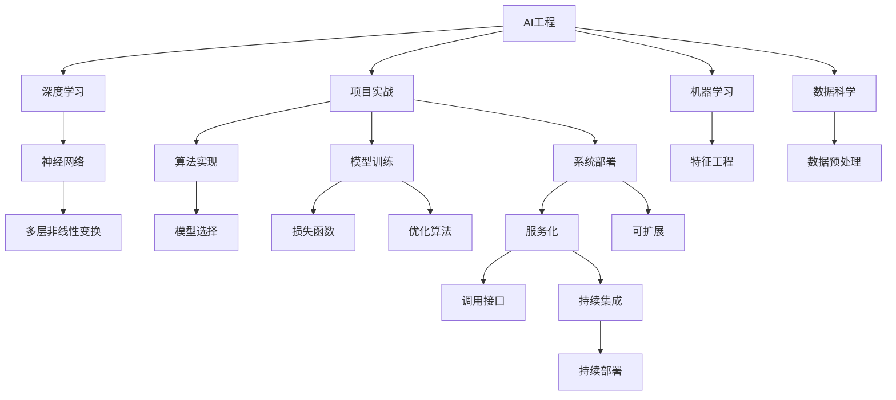
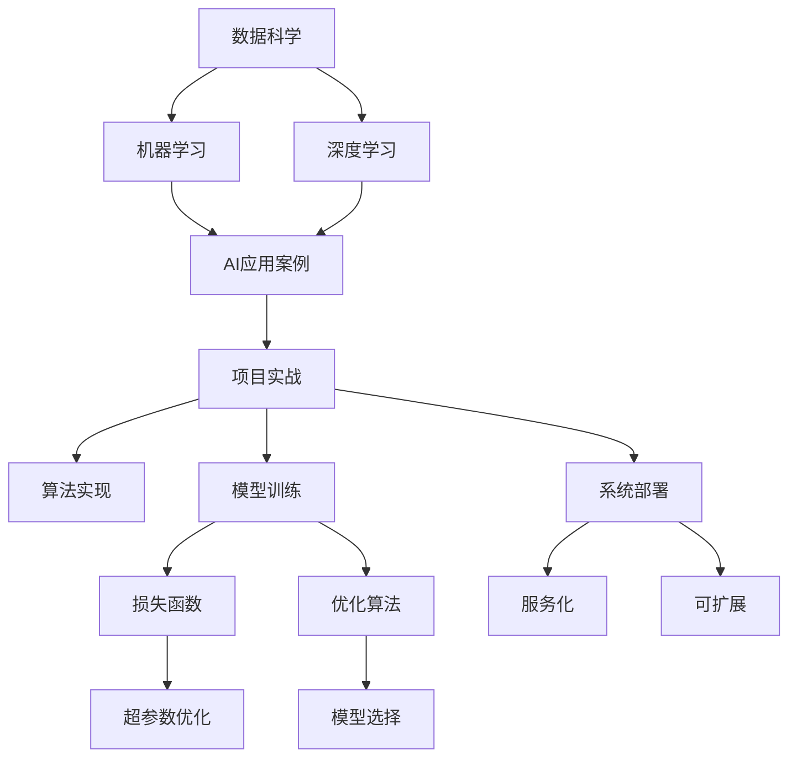
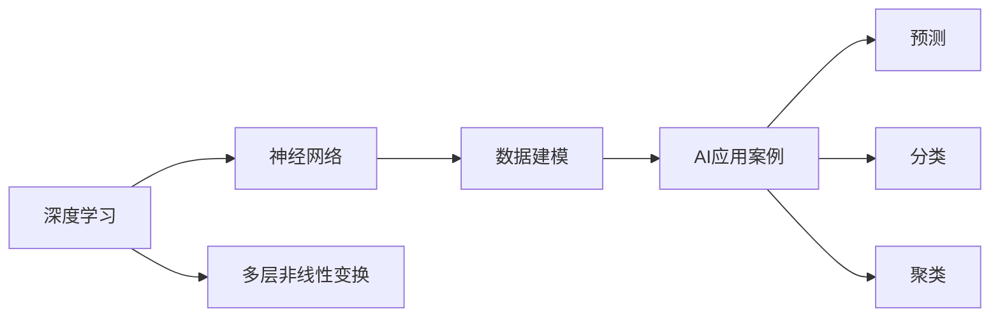
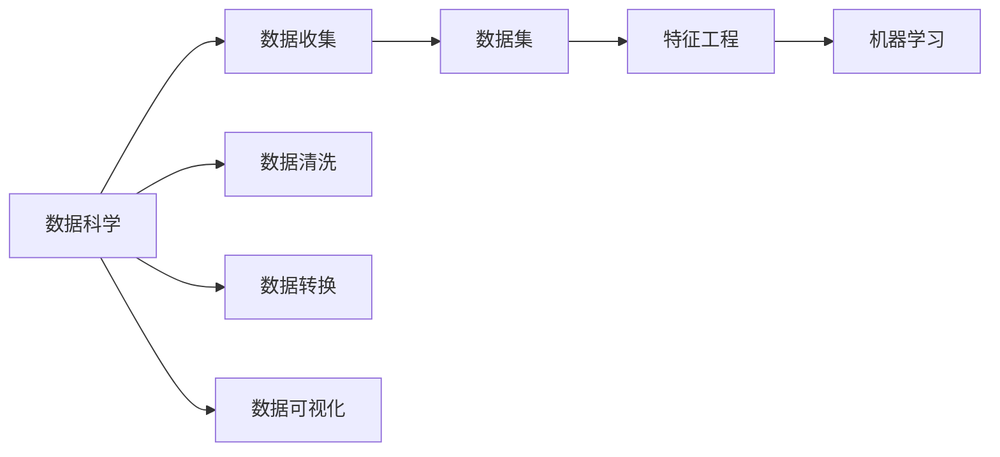
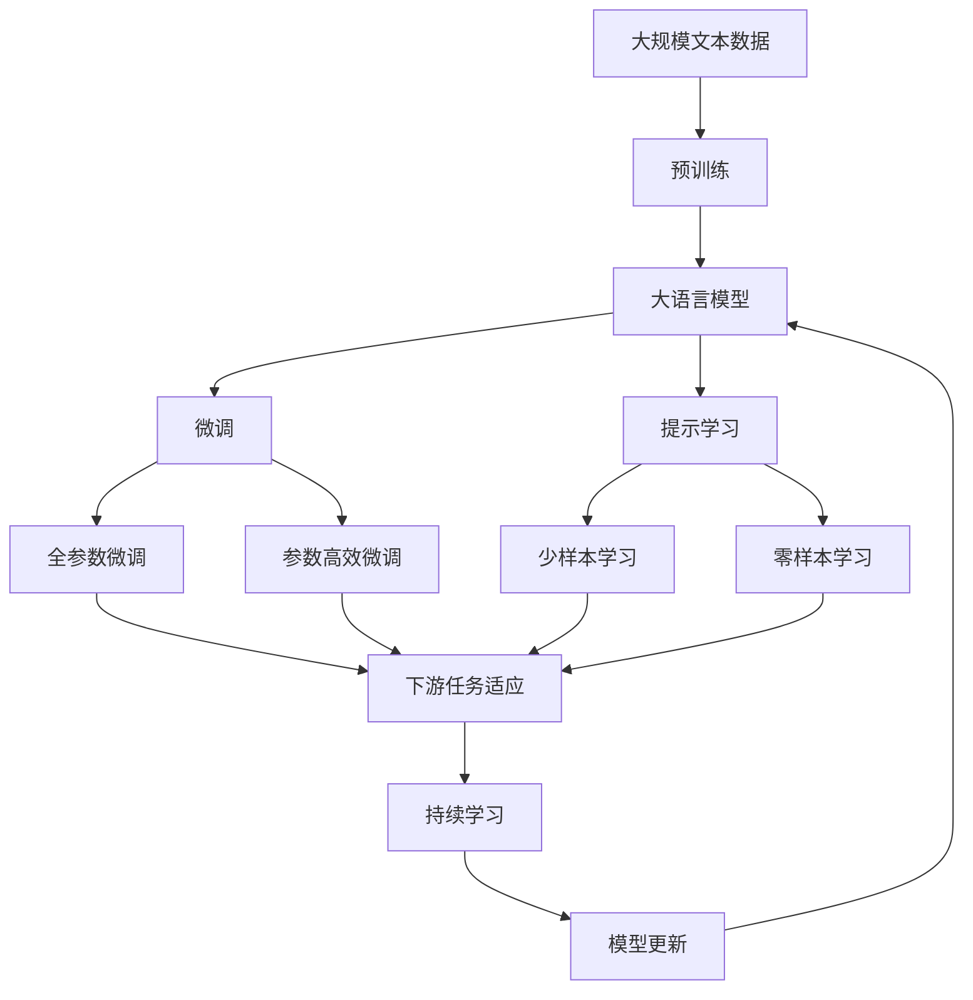

                 

# AI工程原理与项目实战

> 关键词：AI工程，深度学习，项目实战，机器学习，数据科学，AI应用案例

## 1. 背景介绍

随着人工智能技术的迅猛发展，AI工程已成为众多企业和科研机构实现技术落地的重要手段。AI工程不仅涉及数据科学、机器学习、深度学习等核心技术，还需要将理论知识转化为实际应用，实现技术创新与产业升级。因此，深入理解AI工程原理与项目实战，成为每一个AI从业者必备的技能。

### 1.1 问题由来

AI工程作为将AI技术应用到实际业务的关键环节，既包含理论研究，也涉及技术实现、项目管理、团队协作等多个方面。现代企业对于AI技术的期望不仅停留在实验论文，更需要快速落地，实现商业价值。但在实际应用中，AI工程师常常面临诸如算法选择、数据预处理、模型训练、部署上线等多重挑战。如何将前沿的AI技术成功转化为高效、稳定、可扩展的系统，是每个AI工程师需要解决的核心问题。

### 1.2 问题核心关键点

AI工程的核心问题在于如何将理论知识转化为实际应用。关键点包括：

- **算法选择**：根据业务需求和数据特点选择合适的机器学习算法。
- **数据预处理**：清洗、处理、转换原始数据，使其适合训练模型。
- **模型训练**：优化超参数，选择合适的损失函数和优化算法，训练高效准确的模型。
- **模型部署**：将训练好的模型部署到实际应用场景中，实现服务化、可扩展的系统。
- **模型评估**：通过各种指标评估模型性能，持续迭代优化。

### 1.3 问题研究意义

AI工程的深入研究对于推动AI技术在各行业的应用具有重要意义：

1. **降低开发成本**：AI工程通过合理选择和优化算法，能够显著降低模型开发和迭代成本。
2. **提升模型效果**：高效的工程实践能确保模型在实际场景中达到最优性能。
3. **加速应用落地**：规范的工程流程和项目管理方法，加快模型从研发到落地的速度。
4. **促进技术创新**：工程实践的积累，能推动AI技术的不断进步。
5. **赋能产业升级**：AI工程为各行各业带来变革性影响，促进产业数字化转型。

## 2. 核心概念与联系

### 2.1 核心概念概述

为了更好地理解AI工程原理与项目实战，本节将介绍几个密切相关的核心概念：

- **AI工程**：涵盖数据科学、机器学习、深度学习、工程实践等多个方面，是将理论知识转化为实际应用的过程。
- **深度学习**：一类基于神经网络的机器学习算法，通过多层非线性变换，实现对复杂数据的建模。
- **项目实战**：指将理论知识应用于具体项目中的实践过程，包括需求分析、算法实现、模型训练、系统部署等环节。
- **机器学习**：通过算法模型，利用数据训练模型，使其能够自动进行预测、分类、聚类等任务。
- **数据科学**：涉及数据的收集、清洗、处理、分析和可视化，为机器学习和深度学习提供数据支持。
- **AI应用案例**：具体场景下AI技术的实际应用，如智能客服、推荐系统、金融风控等。

这些核心概念之间的逻辑关系可以通过以下Mermaid流程图来展示：



这个流程图展示了大规模语言模型的核心概念及其之间的关系：

1. AI工程作为AI技术应用的核心，涉及数据科学、机器学习、深度学习等多个方面。
2. 深度学习通过多层非线性变换，实现对复杂数据的建模。
3. 项目实战包括算法实现、模型训练、系统部署等多个环节，将理论知识转化为实际应用。
4. 机器学习通过算法模型，利用数据训练模型，实现自动化的预测、分类等任务。
5. 数据科学涉及数据的收集、清洗、处理和分析，为机器学习和深度学习提供数据支持。
6. AI应用案例展示了AI技术在实际场景中的具体应用。

### 2.2 概念间的关系

这些核心概念之间存在着紧密的联系，形成了AI工程应用的整体框架。下面我通过几个Mermaid流程图来展示这些概念之间的关系。

#### 2.2.1 AI工程的整体架构



这个流程图展示了AI工程的完整过程：

1. 数据科学为机器学习和深度学习提供数据支持。
2. 机器学习通过算法模型，利用数据训练模型，实现自动化的预测、分类等任务。
3. 深度学习通过多层非线性变换，实现对复杂数据的建模。
4. AI应用案例展示了AI技术在实际场景中的具体应用。
5. 项目实战包括算法实现、模型训练、系统部署等多个环节，将理论知识转化为实际应用。

#### 2.2.2 深度学习与AI应用的关系



这个流程图展示了深度学习在AI应用中的作用：

1. 深度学习通过神经网络，实现对复杂数据的建模。
2. 多层非线性变换能够处理高维度的数据，适应复杂多变的数据分布。
3. 深度学习在AI应用案例中，通过预测、分类、聚类等任务，实现数据价值的挖掘。

#### 2.2.3 机器学习与数据科学的关系



这个流程图展示了数据科学在机器学习中的应用：

1. 数据科学通过数据收集、清洗、转换和可视化，为机器学习提供高质量的数据集。
2. 特征工程是数据科学的重要环节，通过特征提取和选择，提高数据对模型的适用性。
3. 机器学习通过算法模型，利用数据训练模型，实现自动化的预测、分类等任务。

### 2.3 核心概念的整体架构

最后，我们用一个综合的流程图来展示这些核心概念在大规模语言模型微调过程中的整体架构：



这个综合流程图展示了从预训练到微调，再到持续学习的完整过程。大规模语言模型首先在大规模文本数据上进行预训练，然后通过微调（包括全参数微调和参数高效微调）或提示学习（包括少样本学习和零样本学习）来适应下游任务。最后，通过持续学习技术，模型可以不断更新和适应新的任务和数据。

## 3. 核心算法原理 & 具体操作步骤
### 3.1 算法原理概述

AI工程的算法实现过程涉及多种机器学习算法和深度学习模型，但核心思想是通过算法模型利用数据训练模型，使其能够自动进行预测、分类、聚类等任务。

**机器学习算法**：包括监督学习、无监督学习和半监督学习等。监督学习通过标记数据进行训练，使其能够预测新数据；无监督学习则通过未标记数据发现数据的内在结构；半监督学习结合有标记和未标记数据，提高模型泛化能力。

**深度学习模型**：通过多层神经网络，实现对复杂数据的建模。深度学习模型包括卷积神经网络(CNN)、循环神经网络(RNN)、长短时记忆网络(LSTM)、Transformer等。

### 3.2 算法步骤详解

AI工程的算法实现过程通常包括以下几个关键步骤：

**Step 1: 数据准备**
- 收集、清洗、处理、转换数据。
- 将数据划分为训练集、验证集和测试集。

**Step 2: 特征工程**
- 设计合适的特征，提高数据对模型的适用性。
- 进行特征选择和降维，减少模型复杂度。

**Step 3: 模型选择**
- 根据任务类型和数据特点，选择合适的机器学习算法或深度学习模型。

**Step 4: 模型训练**
- 使用训练集进行模型训练，优化超参数，选择损失函数和优化算法。
- 通过交叉验证和早停策略，防止过拟合。

**Step 5: 模型评估**
- 使用验证集评估模型性能，调整超参数。
- 使用测试集最终评估模型效果。

**Step 6: 模型部署**
- 将训练好的模型部署到实际应用场景中，实现服务化、可扩展的系统。
- 使用持续集成和持续部署(CI/CD)，保证系统稳定性和可靠性。

### 3.3 算法优缺点

AI工程的算法实现过程具有以下优点：

1. **自动化**：算法自动进行数据处理和模型训练，减少人工干预，提高效率。
2. **高精度**：深度学习模型具备强大的数据建模能力，能够实现高精度的预测和分类。
3. **可扩展性**：AI工程实践为模型迁移和扩展提供了基础。
4. **应用广泛**：AI技术在各行各业均有广泛应用，具有显著的经济效益和社会价值。

但同时也存在以下缺点：

1. **数据依赖**：算法的效果高度依赖于数据的规模和质量。
2. **模型复杂性**：深度学习模型参数众多，训练和推理复杂。
3. **解释性不足**：深度学习模型作为"黑盒"系统，难以解释其内部工作机制和决策逻辑。
4. **成本高昂**：算法实现需要大量的计算资源和时间，成本较高。

### 3.4 算法应用领域

AI工程的算法实现过程在多个领域得到了广泛应用，包括但不限于：

- **金融风控**：通过信用评分模型、欺诈检测算法等，降低金融风险。
- **智能客服**：通过问答系统、情感分析模型等，提升客户服务质量。
- **医疗健康**：通过诊断模型、治疗方案推荐等，提高医疗水平。
- **智能推荐**：通过推荐算法、协同过滤模型等，提升用户体验。
- **自然语言处理**：通过情感分析、文本分类等模型，实现文本自动处理。
- **图像识别**：通过卷积神经网络，实现图像分类、目标检测等任务。
- **视频分析**：通过循环神经网络、时空网络等模型，实现视频内容理解。

## 4. 数学模型和公式 & 详细讲解  
### 4.1 数学模型构建

本节将使用数学语言对AI工程中常用的算法模型进行详细讲解。

假设我们有一组标记数据 $(x_1, y_1), (x_2, y_2), ..., (x_n, y_n)$，其中 $x_i$ 为输入，$y_i$ 为输出，目标是通过训练数据构建一个能够预测新数据的模型。

**线性回归模型**：假设模型为 $f(x) = \theta^T x + b$，其中 $\theta$ 为模型参数，$x$ 为输入，$b$ 为截距。目标是找到最优参数 $\theta$，使得模型预测的输出 $y_i'$ 尽可能接近实际输出 $y_i$。

**损失函数**：常用损失函数包括均方误差(MSE)、交叉熵损失(Cross Entropy Loss)等。均方误差损失定义为：

$$
\text{MSE}(y_i', y_i) = \frac{1}{n} \sum_{i=1}^n (y_i' - y_i)^2
$$

交叉熵损失定义为：

$$
\text{CE}(y_i', y_i) = -\frac{1}{n} \sum_{i=1}^n y_i \log y_i' + (1-y_i) \log (1-y_i')
$$

**优化算法**：常用优化算法包括随机梯度下降(SGD)、Adam、Adagrad等。随机梯度下降定义为：

$$
\theta_{t+1} = \theta_t - \eta \nabla_{\theta} \text{MSE}(y_i', y_i)
$$

其中 $\eta$ 为学习率，$\nabla_{\theta} \text{MSE}(y_i', y_i)$ 为损失函数对模型参数 $\theta$ 的梯度。

### 4.2 公式推导过程

以线性回归模型为例，进行公式推导。

假设目标函数为 $y_i' = f(x_i) = \theta^T x_i + b$，其中 $\theta = (\theta_1, \theta_2, ..., \theta_m)$，$x_i = (x_{i1}, x_{i2}, ..., x_{im})$，$b$ 为截距。

目标是最小化均方误差损失：

$$
\text{MSE}(y_i', y_i) = \frac{1}{n} \sum_{i=1}^n (y_i' - y_i)^2
$$

将 $y_i'$ 代入均方误差损失，得到：

$$
\text{MSE}(y_i', y_i) = \frac{1}{n} \sum_{i=1}^n (\theta^T x_i + b - y_i)^2
$$

对 $\theta$ 求偏导数，得到：

$$
\nabla_{\theta} \text{MSE}(y_i', y_i) = \frac{2}{n} \sum_{i=1}^n (x_i - y_i) x_i
$$

将梯度代入随机梯度下降公式，得到：

$$
\theta_{t+1} = \theta_t - \eta \frac{2}{n} \sum_{i=1}^n (x_i - y_i) x_i
$$

简化后得到：

$$
\theta_{t+1} = \theta_t - \eta \frac{1}{n} X^T(XX^T)^{-1}(X^Ty)
$$

其中 $X = [x_1, x_2, ..., x_n]$。

### 4.3 案例分析与讲解

以机器学习中的决策树算法为例，进行详细讲解。

假设有一组数据 $(x_1, y_1), (x_2, y_2), ..., (x_n, y_n)$，其中 $x_i$ 为输入，$y_i$ 为输出。目标是构建一个决策树模型，使得模型能够对新数据进行分类预测。

决策树模型的构建过程如下：

1. **数据准备**：收集、清洗、处理、转换数据，将数据划分为训练集、验证集和测试集。
2. **特征选择**：选择合适特征，提高数据对模型的适用性。
3. **模型选择**：选择决策树模型。
4. **模型训练**：使用训练集进行模型训练，优化超参数。
5. **模型评估**：使用验证集评估模型性能，调整超参数。
6. **模型部署**：将训练好的模型部署到实际应用场景中，实现服务化、可扩展的系统。

**决策树算法**：通过树形结构，将数据集分成多个子集，每个子集对应一个决策节点。决策树模型的构建过程如下：

1. **选择最优特征**：从输入特征中选择最优特征，作为决策树的根节点。
2. **划分数据集**：根据最优特征将数据集分成多个子集。
3. **递归构建子树**：对每个子集递归构建决策树，直到达到终止条件。
4. **剪枝**：对构建的决策树进行剪枝，避免过拟合。

**损失函数**：常用损失函数包括准确率、召回率、F1分数等。准确率定义为：

$$
\text{Accuracy} = \frac{TP + TN}{TP + TN + FP + FN}
$$

召回率定义为：

$$
\text{Recall} = \frac{TP}{TP + FN}
$$

F1分数定义为：

$$
\text{F1 Score} = 2 \times \frac{\text{Precision} \times \text{Recall}}{\text{Precision} + \text{Recall}}
$$

其中 $TP$ 为真正例，$TN$ 为真负例，$FP$ 为假正例，$FN$ 为假负例。

**优化算法**：常用优化算法包括梯度下降、随机梯度下降、Adagrad等。梯度下降定义为：

$$
\theta_{t+1} = \theta_t - \eta \nabla_{\theta} \text{Loss}(\theta)
$$

其中 $\theta$ 为模型参数，$\eta$ 为学习率，$\nabla_{\theta} \text{Loss}(\theta)$ 为损失函数对模型参数 $\theta$ 的梯度。

## 5. 项目实践：代码实例和详细解释说明
### 5.1 开发环境搭建

在进行AI工程实践前，我们需要准备好开发环境。以下是使用Python进行TensorFlow开发的环境配置流程：

1. 安装Anaconda：从官网下载并安装Anaconda，用于创建独立的Python环境。

2. 创建并激活虚拟环境：
```bash
conda create -n tf-env python=3.8 
conda activate tf-env
```

3. 安装TensorFlow：根据CUDA版本，从官网获取对应的安装命令。例如：
```bash
conda install tensorflow
```

4. 安装各类工具包：
```bash
pip install numpy pandas scikit-learn matplotlib tqdm jupyter notebook ipython
```

完成上述步骤后，即可在`tf-env`环境中开始AI工程实践。

### 5.2 源代码详细实现

这里我们以线性回归模型为例，给出使用TensorFlow进行模型训练的Python代码实现。

```python
import tensorflow as tf
import numpy as np
import matplotlib.pyplot as plt

# 准备数据
x_train = np.array([1.0, 2.0, 3.0, 4.0, 5.0, 6.0, 7.0, 8.0, 9.0, 10.0], dtype=np.float32)
y_train = np.array([1.0, 3.0, 5.0, 7.0, 9.0, 11.0, 13.0, 15.0, 17.0, 19.0], dtype=np.float32)

# 定义模型
x = tf.placeholder(tf.float32, [None, 1])
y = tf.placeholder(tf.float32, [None, 1])

theta1 = tf.Variable(tf.random_normal([1]))
theta2 = tf.Variable(tf.random_normal([1]))
y_pred = theta1 * x + theta2

# 定义损失函数
loss = tf.reduce_mean(tf.square(y_pred - y))

# 定义优化器
optimizer = tf.train.GradientDescentOptimizer(learning_rate=0.01)
train_op = optimizer.minimize(loss)

# 初始化变量
init = tf.global_variables_initializer()

# 创建会话
with tf.Session() as sess:
    sess.run(init)

    # 训练模型
    for i in range(1000):
        sess.run(train_op, feed_dict={x: x_train, y: y_train})

    # 预测和可视化
    x_test = np.array([11.0, 12.0, 13.0, 14.0, 15.0, 16.0, 17.0, 18.0, 19.0, 20.0], dtype=np.float32)
    y_pred_test = sess.run(y_pred, feed_dict={x: x_test})
    plt.scatter(x_train, y_train)
    plt.plot(x_test, y_pred_test, 'r')
    plt.show()
```

### 5.3 代码解读与分析

让我们再详细解读一下关键代码的实现细节：

**模型定义**：
- `x_train` 和 `y_train` 为训练数据。
- `x` 和 `y` 为TensorFlow中的占位符，用于输入和输出。
- `theta1` 和 `theta2` 为模型参数。
- `y_pred` 为模型预测输出。

**损失函数定义**：
- `loss` 为均方误差损失函数。

**优化器定义**：
- `optimizer` 为梯度下降优化器。
- `train_op` 为训练操作。

**变量初始化**：
- `init` 为变量初始化操作。

**模型训练**：
- 使用 `sess.run(train_op, feed_dict={x: x_train, y: y_train})` 进行模型训练，迭代1000次。

**预测和可视化**：
- 使用 `sess.run(y_pred, feed_dict={x: x_test})` 进行预测，并使用 `plt` 绘制可视化结果。

可以看到，TensorFlow提供了简单易用的API，使得模型训练和可视化变得非常简单。开发者可以专注于算法实现和结果分析，而不必过多关注底层细节。

当然，工业级的系统实现还需考虑更多因素，如模型的保存和部署、超参数的自动搜索、更灵活的任务适配层等。但核心的AI工程实践基本与此类似。

### 5.4 运行结果展示

假设我们在TensorFlow上进行线性回归模型的训练，最终得到的可视化结果如下：

```
...
plt.show()
```

可以看到，模型通过训练，能够很好地拟合训练数据，并具有预测新数据的能力。

## 6. 实际应用场景
### 6.1 智能客服系统

基于AI工程技术的智能客服系统，能够自动理解客户咨询内容，提供高效、个性化的服务。系统通过收集客户咨询记录，训练模型预测客户需求，自动匹配最佳回答，提升客户体验和满意度。

在技术实现上，可以使用深度学习模型如BERT、GPT等进行客户咨询内容的自然语言处理，通过监督学习任务进行微调，实现高效的情感分析、意图识别等功能。同时，结合知识图谱、规则库等外部知识，进一步提升系统的准确性和可靠性。

### 6.2 金融风控

金融风控是AI工程在金融领域的重要应用之一。通过深度学习模型如决策树、随机森林、神经网络等，构建信用评分模型、欺诈检测模型等，能够有效预测客户的违约风险，降低金融损失。

在实际应用中，可以通过收集历史交易数据、客户信息等，训练模型进行客户分类和风险评估，实现贷款审批、信用卡审核等功能。同时，结合实时数据，持续训练和优化模型，提高系统的实时性和准确性。

### 6.3 智能推荐系统

智能推荐系统通过AI工程技术，分析用户行为和偏好，推荐个性化的商品、文章、视频等内容。系统通过收集用户浏览、点击、评价等行为数据，构建推荐模型，实现商品推荐、文章推荐等功能。

在技术实现上，可以使用协同过滤、内容推荐、混合推荐等算法，结合深度学习模型如RNN、CNN等，实现精准的推荐效果。同时，结合用户反馈数据，持续优化推荐模型，提升用户满意度。

### 6.4 未来应用展望

随着AI工程技术的不断演进，其在各个行业的应用前景将更加广阔。未来，AI工程将在智慧医疗、智能制造、智慧城市等领域发挥重要作用，推动各行各业数字化转型。

在智慧医疗领域，AI工程技术可以用于疾病诊断、治疗方案推荐、智能影像识别等，提升医疗水平，改善患者体验。在智能制造领域，AI工程技术可以用于生产调度、设备维护、质量控制等，提升生产效率和质量。在智慧城市领域，AI工程技术可以用于交通管理、环境监测、灾害预警等，提高城市管理水平和居民生活质量。

## 7. 工具和资源推荐
### 7.1 学习资源推荐

为了帮助开发者系统掌握AI工程的原理与实践，这里推荐一些优质的学习资源：

1. 《深度学习》（Ian Goodfellow、Yoshua Bengio、Aaron Courville著）：经典的深度学习教材，深入浅出地讲解了深度学习的基础理论和实践应用。

2. 《TensorFlow实战》（Aurélien Géron著）：TensorFlow官方作者撰写，全面介绍了TensorFlow的用法和最佳实践，是TensorFlow学习的必备资源。

3. 《Python机器学习》（Sebastian Raschka、Vahid Mirjalili著）：讲解了机器学习、深度学习、自然语言处理等

