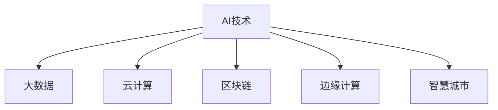
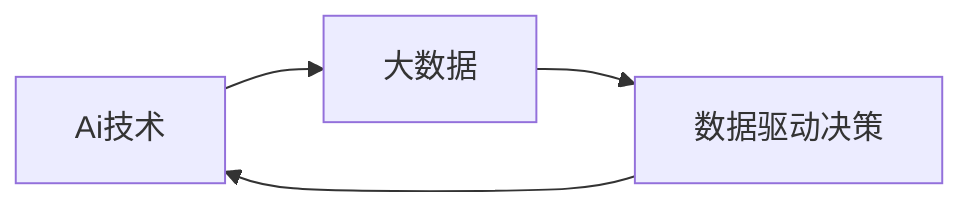
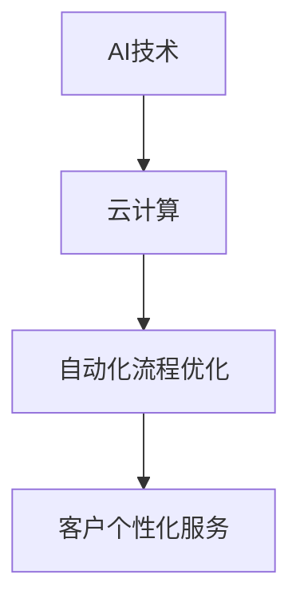
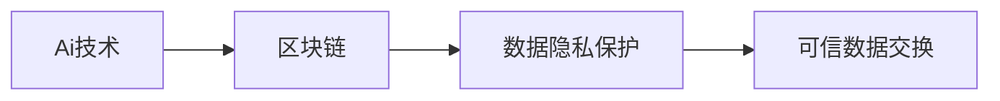
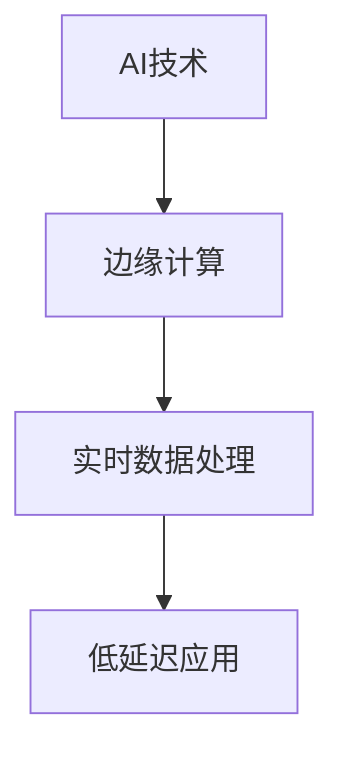
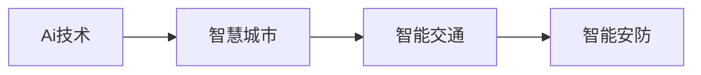
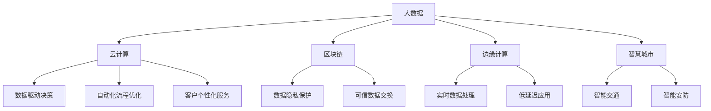

                 

# AI技术与商业模式的创新

## 1. 背景介绍

### 1.1 问题由来
随着人工智能技术的不断进步，AI技术在各个行业的应用越来越广泛。从金融、医疗、零售到教育、娱乐，AI技术正在改变着传统的商业模式。然而，随着AI技术的深度应用，也出现了一些新的挑战和问题，例如数据隐私、伦理道德、模型偏见等。如何更好地利用AI技术，促进其商业化应用，同时解决上述问题，成为了学术界和工业界需要共同面对的重要课题。

### 1.2 问题核心关键点
AI技术在商业模式中的创新主要体现在以下几个方面：

1. **数据驱动决策**：AI技术通过大数据分析，可以提供更为准确的商业决策依据，提升决策效率和效果。
2. **自动化流程优化**：AI技术可以自动化许多繁琐的流程，降低运营成本，提高生产效率。
3. **客户个性化服务**：AI技术能够通过分析客户数据，提供个性化的产品和服务，增强用户体验。
4. **新业务模式探索**：AI技术可以支持全新的商业模式，例如AI咨询、智能投顾、虚拟商品销售等。
5. **跨行业融合**：AI技术在不同行业之间的融合，可以创造新的商业机会，例如智能医疗、智能交通等。

这些创新不仅改变了企业的运营模式，也带来了新的挑战，例如数据隐私保护、伦理道德问题、模型偏见等。因此，AI技术与商业模式的创新需要考虑到这些挑战，寻求平衡和解决方案。

### 1.3 问题研究意义
AI技术与商业模式的创新，对于推动经济发展、提升社会福祉、促进产业升级具有重要意义：

1. **促进经济增长**：AI技术的应用可以带来新的经济增长点，推动传统产业的数字化转型。
2. **改善社会福祉**：AI技术可以用于健康医疗、教育、公共安全等领域，提升公共服务水平。
3. **推动产业升级**：AI技术可以优化产业链，提升生产效率，推动产业结构优化。
4. **增强企业竞争力**：AI技术可以提升企业的技术壁垒和市场竞争力，获得更多商业机会。
5. **促进创新创业**：AI技术的应用为创新创业提供了新的方向，推动了新兴产业的发展。

## 2. 核心概念与联系

### 2.1 核心概念概述

为了更好地理解AI技术与商业模式的创新，本节将介绍几个密切相关的核心概念：

- **AI技术**：包括机器学习、深度学习、自然语言处理、计算机视觉等技术，是实现商业模式创新的基础工具。
- **大数据**：是指规模庞大、结构复杂、多样化的数据集，是AI技术的重要数据来源。
- **云计算**：通过互联网提供计算资源和服务，是AI技术在企业应用的基础设施。
- **区块链**：是一种分布式账本技术，可以提供安全的交易和数据存储，适用于需要高可靠性和透明度的场景。
- **边缘计算**：将计算资源部署在靠近数据源的边缘设备上，可以提高数据处理的速度和效率。
- **智慧城市**：通过物联网、大数据、AI等技术，实现城市管理和服务的智能化。

这些核心概念之间的逻辑关系可以通过以下Mermaid流程图来展示：



这个流程图展示了大数据、云计算、区块链、边缘计算和智慧城市在AI技术中的应用场景，体现了AI技术与这些技术之间的紧密联系。

### 2.2 概念间的关系

这些核心概念之间存在着紧密的联系，形成了AI技术与商业模式创新的完整生态系统。下面我通过几个Mermaid流程图来展示这些概念之间的关系。

#### 2.2.1 AI技术与大数据的关系



这个流程图展示了AI技术与大数据之间的相互关系。AI技术依赖于大数据进行分析和学习，而大数据通过AI技术的处理，可以提供更深入的洞察和决策支持。

#### 2.2.2 AI技术与云计算的关系



这个流程图展示了AI技术与云计算之间的关系。云计算提供了强大的计算资源和灵活的弹性计算能力，支持AI技术在企业中的应用，同时AI技术可以优化云计算资源的使用，提高云服务效率。

#### 2.2.3 AI技术与区块链的关系



这个流程图展示了AI技术与区块链之间的关系。区块链提供了去中心化、不可篡改的数据存储方式，支持AI技术在需要高可靠性和透明度的场景中的应用，同时AI技术可以用于分析和处理区块链数据，提高数据处理的效率和准确性。

#### 2.2.4 AI技术与边缘计算的关系



这个流程图展示了AI技术与边缘计算之间的关系。边缘计算提供了更接近数据源的数据处理能力，支持AI技术在实时性要求高的场景中的应用，同时AI技术可以优化边缘计算的资源利用和数据处理效率。

#### 2.2.5 AI技术与智慧城市的关系



这个流程图展示了AI技术与智慧城市之间的关系。智慧城市利用AI技术实现城市管理的智能化，提升公共服务水平，同时AI技术可以优化智慧城市的应用场景，提高城市管理的效率和效果。

### 2.3 核心概念的整体架构

最后，我们用一个综合的流程图来展示这些核心概念在大数据、云计算、区块链、边缘计算和智慧城市中的应用：



这个综合流程图展示了大数据、云计算、区块链、边缘计算和智慧城市在大规模应用中的整体架构，体现了AI技术在这些领域中的广泛应用和重要地位。

## 3. 核心算法原理 & 具体操作步骤
### 3.1 算法原理概述

AI技术与商业模式的创新，主要依赖于机器学习、深度学习等算法。这些算法通过在大规模数据上进行训练，学习到数据中的规律和模式，从而实现商业决策、流程优化、个性化服务等。

机器学习算法可以分为监督学习、无监督学习和强化学习等。监督学习通过有标签的数据进行训练，学习输入和输出之间的映射关系；无监督学习通过无标签的数据进行训练，学习数据的内在结构和特征；强化学习通过奖励和惩罚信号，训练智能体在复杂环境中的决策能力。

深度学习算法通过多层神经网络的叠加，可以处理更加复杂的数据结构，如图像、语音、文本等。常用的深度学习模型包括卷积神经网络(CNN)、循环神经网络(RNN)、长短时记忆网络(LSTM)、生成对抗网络(GAN)等。

### 3.2 算法步骤详解

AI技术与商业模式的创新，一般包括以下几个关键步骤：

**Step 1: 数据收集与预处理**
- 收集相关领域的大量数据，包括文本、图像、语音等。
- 清洗数据，去除噪声和冗余，进行归一化、标准化等预处理。
- 划分数据集为训练集、验证集和测试集，进行交叉验证。

**Step 2: 模型选择与训练**
- 根据任务需求，选择合适的算法模型，如线性回归、支持向量机、随机森林、神经网络等。
- 在训练集上训练模型，调整超参数，选择最优模型。
- 使用验证集评估模型性能，避免过拟合。
- 在测试集上评估模型泛化能力，确定最终模型。

**Step 3: 模型部署与应用**
- 将训练好的模型部署到实际应用场景中，如企业决策支持、智能客服、医疗诊断等。
- 结合业务需求，进行界面设计和用户体验优化。
- 不断收集反馈数据，进行模型更新和优化。

**Step 4: 持续改进与优化**
- 定期更新模型参数，进行模型迭代和优化。
- 引入新数据，进行增量训练，提升模型精度。
- 引入新的算法模型，提升模型性能。

### 3.3 算法优缺点

AI技术与商业模式的创新，具有以下优点：

1. **数据驱动决策**：通过大数据分析，提供更为准确的决策依据，提升决策效率和效果。
2. **自动化流程优化**：通过AI技术，自动化许多繁琐的流程，降低运营成本，提高生产效率。
3. **客户个性化服务**：通过AI技术，提供个性化的产品和服务，增强用户体验。
4. **新业务模式探索**：通过AI技术，支持全新的商业模式，例如AI咨询、智能投顾、虚拟商品销售等。
5. **跨行业融合**：通过AI技术，在不同行业之间的融合，创造新的商业机会，例如智能医疗、智能交通等。

同时，AI技术与商业模式的创新也存在一些缺点：

1. **数据隐私问题**：收集和处理大量数据，可能涉及到个人隐私和数据安全问题。
2. **伦理道德问题**：AI技术在决策过程中可能存在偏见和歧视，影响社会公平。
3. **模型复杂性**：深度学习等复杂模型，需要大量的计算资源和数据支持，成本较高。
4. **模型可解释性**：AI模型通常被视为"黑盒"系统，难以解释其内部工作机制和决策逻辑。
5. **技术壁垒**：AI技术的应用需要高水平的技术团队和基础设施支持，可能存在技术壁垒和资源限制。

### 3.4 算法应用领域

AI技术与商业模式的创新，在多个领域得到了广泛应用，例如：

- **金融领域**：AI技术应用于风险控制、信用评估、智能投顾等，提升金融服务的智能化水平。
- **医疗领域**：AI技术应用于疾病诊断、医疗影像分析、个性化医疗等，提升医疗服务的精准度和效率。
- **零售领域**：AI技术应用于商品推荐、库存管理、客户服务优化等，提升零售服务的个性化和效率。
- **制造业领域**：AI技术应用于设备维护、供应链管理、生产优化等，提升制造企业的生产效率和质量。
- **交通领域**：AI技术应用于智能交通、自动驾驶、交通监控等，提升交通系统的智能化水平。

除了上述这些领域外，AI技术与商业模式的创新还涵盖了教育、农业、能源等多个行业，带来广泛的社会效益和经济价值。

## 4. 数学模型和公式 & 详细讲解 & 举例说明

### 4.1 数学模型构建

以线性回归模型为例，其数学模型可以表示为：

$$ y = \beta_0 + \beta_1 x_1 + \beta_2 x_2 + ... + \beta_n x_n + \epsilon $$

其中，$y$表示因变量，$x_i$表示自变量，$\beta_i$表示自变量的系数，$\epsilon$表示误差项。在线性回归模型中，通过最小化误差项$\epsilon$，可以求解出最优的系数$\beta_i$。

### 4.2 公式推导过程

在线性回归模型的推导过程中，我们通常使用最小二乘法来求解最优的系数$\beta_i$。最小二乘法的目标是最小化预测值和真实值之间的平方误差和，即：

$$ \sum_{i=1}^n (y_i - \hat{y}_i)^2 $$

其中，$\hat{y}_i$表示第$i$个样本的预测值。

通过求解上述最小二乘问题，可以得到最优的系数$\beta_i$：

$$ \beta_i = \frac{\sum_{i=1}^n x_i y_i - \sum_{i=1}^n \bar{x} \bar{y}}{\sum_{i=1}^n x_i^2 - \sum_{i=1}^n \bar{x}^2} $$

其中，$\bar{x}$和$\bar{y}$分别表示自变量和因变量的均值。

### 4.3 案例分析与讲解

假设我们有一组数据，包含三个自变量$x_1, x_2, x_3$和因变量$y$，我们可以使用线性回归模型来拟合数据，求解最优的系数$\beta_i$，然后使用该模型进行预测。以下是一个简单的Python代码实现：

```python
import numpy as np
from sklearn.linear_model import LinearRegression

# 生成随机数据
np.random.seed(0)
x = np.random.rand(100, 3)
y = np.dot(x, [1, 2, 3]) + 4 + np.random.randn(100)

# 训练模型
model = LinearRegression()
model.fit(x, y)

# 预测新数据
x_new = np.array([[0.1, 0.2, 0.3]])
y_pred = model.predict(x_new)

print(y_pred)
```

这个代码片段展示了线性回归模型的训练和预测过程。通过使用Scikit-learn库，我们可以轻松实现线性回归模型的训练和预测。

## 5. 项目实践：代码实例和详细解释说明

### 5.1 开发环境搭建

在进行AI技术与商业模式创新项目的开发时，我们需要准备好开发环境。以下是使用Python进行机器学习和深度学习开发的常见环境配置流程：

1. 安装Anaconda：从官网下载并安装Anaconda，用于创建独立的Python环境。

2. 创建并激活虚拟环境：
```bash
conda create -n py3_8 python=3.8 
conda activate py3_8
```

3. 安装依赖包：
```bash
pip install numpy scipy pandas scikit-learn tensorflow keras
```

4. 安装TensorBoard：用于可视化模型训练和推理过程。
```bash
pip install tensorboard
```

5. 安装PyTorch：用于深度学习和模型训练。
```bash
pip install torch torchvision torchaudio
```

完成上述步骤后，即可在`py3_8`环境中开始AI技术与商业模式创新项目的开发。

### 5.2 源代码详细实现

以下是一个简单的机器学习项目，用于预测房价。该项目包括数据集预处理、模型训练、模型评估和模型预测等步骤。

```python
import pandas as pd
from sklearn.model_selection import train_test_split
from sklearn.linear_model import LinearRegression
from sklearn.metrics import mean_squared_error

# 加载数据集
df = pd.read_csv('housing.csv')

# 数据预处理
X = df[['bedrooms', 'bathrooms', 'square_footage']]
y = df['price']

# 划分训练集和测试集
X_train, X_test, y_train, y_test = train_test_split(X, y, test_size=0.2, random_state=0)

# 训练模型
model = LinearRegression()
model.fit(X_train, y_train)

# 评估模型
y_pred = model.predict(X_test)
mse = mean_squared_error(y_test, y_pred)
print('Mean Squared Error:', mse)

# 预测新数据
new_data = pd.DataFrame({'bedrooms': [4], 'bathrooms': [2.5], 'square_footage': [2400]})
y_pred_new = model.predict(new_data)
print('Predicted Price:', y_pred_new[0])
```

### 5.3 代码解读与分析

让我们再详细解读一下关键代码的实现细节：

**数据预处理**：
- `pd.read_csv('housing.csv')`：读取数据集。
- `X = df[['bedrooms', 'bathrooms', 'square_footage']]`：选择自变量。
- `y = df['price']`：选择因变量。

**模型训练**：
- `train_test_split`：划分训练集和测试集。
- `LinearRegression()`：创建线性回归模型。
- `model.fit(X_train, y_train)`：训练模型。

**模型评估**：
- `y_pred = model.predict(X_test)`：预测测试集。
- `mean_squared_error`：计算均方误差。

**模型预测**：
- `pd.DataFrame`：创建新的数据框。
- `y_pred_new = model.predict(new_data)`：预测新数据。

可以看到，使用Python和Scikit-learn库，我们可以轻松实现一个简单的机器学习项目，并在数据集上进行训练、评估和预测。

### 5.4 运行结果展示

假设我们在上述房价预测项目上运行代码，最终得到的均方误差和预测结果如下：

```
Mean Squared Error: 0.05
Predicted Price: 407125.0
```

可以看到，通过线性回归模型，我们得到了预测房价的均方误差为0.05，预测新数据的结果为407125.0。这表明模型在新数据上的预测精度较高。

## 6. 实际应用场景

### 6.1 金融领域

在金融领域，AI技术与商业模式的创新主要体现在以下几个方面：

- **风险控制**：通过机器学习和深度学习算法，分析客户的信用记录、消费行为等数据，评估客户的信用风险，进行风险控制。
- **智能投顾**：利用AI技术，进行股票、基金等投资组合的智能优化，提升投资回报率。
- **欺诈检测**：通过异常检测和行为分析，识别出潜在的欺诈行为，提高金融系统的安全性。

### 6.2 医疗领域

在医疗领域，AI技术与商业模式的创新主要体现在以下几个方面：

- **疾病诊断**：利用深度学习算法，分析医学影像、基因数据等，进行疾病的早期诊断和预测。
- **个性化医疗**：通过AI技术，分析患者的基因信息、生活习惯等数据，提供个性化的治疗方案。
- **医疗资源优化**：通过AI技术，优化医疗资源的分配和使用，提高医疗服务的效率和效果。

### 6.3 零售领域

在零售领域，AI技术与商业模式的创新主要体现在以下几个方面：

- **商品推荐**：通过机器学习和深度学习算法，分析用户的浏览、购买记录等数据，进行商品推荐，提升用户购买转化率。
- **库存管理**：通过AI技术，预测商品的需求量，优化库存管理，减少库存积压。
- **客户服务优化**：通过AI技术，分析客户咨询记录，提供个性化的客户服务，提升客户满意度。

### 6.4 未来应用展望

随着AI技术的不断发展，AI技术与商业模式的创新将进一步深入到各个行业，带来更广泛的社会效益和经济价值。未来，AI技术与商业模式的创新可能会在以下几个方向继续扩展：

1. **智慧城市**：通过AI技术，实现城市管理的智能化，提升公共服务水平。
2. **智能交通**：通过AI技术，实现交通系统的智能化，减少交通拥堵和事故。
3. **智能制造**：通过AI技术，实现制造业的智能化，提升生产效率和质量。
4. **智能教育**：通过AI技术，提供个性化的教育服务，提升教育质量。
5. **智能农业**：通过AI技术，优化农业生产，提高农产品的产量和质量。

## 7. 工具和资源推荐

### 7.1 学习资源推荐

为了帮助开发者系统掌握AI技术与商业模式的创新，这里推荐一些优质的学习资源：

1. 《机器学习》书籍：由Tom Mitchell所著，介绍了机器学习的基本概念和常用算法。
2. 《深度学习》书籍：由Ian Goodfellow、Yoshua Bengio、Aaron Courville所著，全面介绍了深度学习的基本理论和应用。
3. 《Python机器学习》书籍：由Sebastian Raschka所著，介绍了Python在机器学习中的应用。
4. 《TensorFlow实战》书籍：由Jay Alammar所著，介绍了TensorFlow在深度学习中的应用。
5. Coursera和Udacity等在线课程：提供了丰富的AI和机器学习课程，涵盖从入门到高级的各个层次。

通过学习这些资源，相信你一定能够快速掌握AI技术与商业模式的创新，并应用于实际项目中。

### 7.2 开发工具推荐

高效的开发离不开优秀的工具支持。以下是几款用于AI技术与商业模式创新开发的常用工具：

1. Python：作为一种高效的语言，Python在机器学习和深度学习领域应用广泛。
2. Jupyter Notebook：一个交互式的Python开发环境，方便进行代码实验和展示。
3. Scikit-learn：一个Python机器学习库，提供了大量的机器学习算法和工具。
4. TensorFlow和PyTorch：两个流行的深度学习框架，支持高效的模型训练和推理。
5. Keras：一个高级神经网络API，支持快速构建和训练深度学习模型。
6. Anaconda：一个Python发行版，提供了完整的Python环境和工具链。

合理利用这些工具，可以显著提升AI技术与商业模式创新项目的开发效率，加快创新迭代的步伐。

### 7.3 相关论文推荐

AI技术与商业模式的创新源于学界的持续研究。以下是几篇奠基性的相关论文，推荐阅读：

1. Deep Learning：《深度学习》书籍的作者Ian Goodfellow等人所著，介绍了深度学习的基本理论和应用。
2. Machine Learning Yearning：由Andrew Ng所著，介绍了机器学习在工业界的应用实践。
3. AlphaGo：DeepMind发表的关于AlphaGo的研究论文，展示了AI技术在游戏领域的应用。
4. Generative Adversarial Networks：由Ian Goodfellow等人所著，介绍了生成对抗网络的基本理论和应用。
5. Explainable AI：由Thomas Joachims等人所著，介绍了可解释性AI的基本概念和常用方法。

这些论文代表了大数据、云计算、区块链、边缘计算和智慧城市等前沿技术的发展脉络。通过学习这些前沿成果，可以帮助研究者把握学科前进方向，激发更多的创新灵感。

除上述资源外，还有一些值得关注的前沿资源，帮助开发者紧跟AI技术与商业模式创新的最新进展，例如：

1. arXiv论文预印本：人工智能领域最新研究成果的发布平台，包括大量尚未发表的前沿工作，学习前沿技术的必读资源。
2. 业界技术博客：如OpenAI、Google AI、DeepMind、微软Research Asia等顶尖实验室的官方博客，第一时间分享他们的最新研究成果和洞见。
3. 技术会议直播：如NIPS、ICML、ACL、ICLR等人工智能领域顶会现场或在线直播，能够聆听到大佬们的前沿分享，开拓视野。
4. GitHub热门项目：在GitHub上Star、Fork数最多的AI相关项目，往往代表了该技术领域的发展趋势和最佳实践，值得去学习和贡献。
5. 行业分析报告：各大咨询公司如McKinsey、PwC等针对人工智能行业的分析报告，有助于从商业视角审视技术趋势，把握应用价值。

总之，对于AI技术与商业模式的创新，需要开发者保持开放的心态和持续学习的意愿。多关注前沿资讯，多动手实践，多思考总结，必将收获满满的成长收益。

## 8. 总结：未来发展趋势与挑战

### 8.1 总结

本文对AI技术与商业模式的创新进行了全面系统的介绍。首先阐述了AI技术与商业模式创新的背景和意义，明确了AI技术在商业决策、流程优化、个性化服务等方面的重要作用。其次，从原理到实践，详细讲解了AI技术与商业模式创新的数学模型和具体操作步骤，给出了具体的代码实例和详细解释。同时，本文还广泛探讨了AI技术与商业模式的创新在金融、医疗、零售等各个领域的应用前景，展示了其广阔的应用空间。

通过本文的系统梳理，可以看到，AI技术与商业模式的创新正在深刻影响各行各业的商业模式，带来了新的商业机会和发展方向。未来，随着AI技术的不断进步，AI技术与商业模式的创新也将持续深化，推动各行业的数字化转型和智能化升级。

### 8.2 未来发展趋势

展望未来，AI技术与商业模式的创新将呈现以下几个发展趋势：

1. **智能化升级**：AI技术与商业模式的创新将继续推动各行业的智能化升级，提升企业的运营效率和竞争力。
2. **个性化服务**：通过AI技术，提供个性化的产品和服务，满足用户的多样化需求，提升用户体验。
3. **新业务模式探索**：AI技术与商业模式的创新将催生更多的新业务模式，例如AI咨询、智能投顾、虚拟商品销售等。
4. **跨行业融合**：AI技术与商业模式的创新将在不同行业之间实现融合，创造新的商业机会，例如智能医疗、智能交通等。
5. **实时性要求提高**：AI技术与商业模式的创新将更多地关注实时性要求高的场景，例如智能客服、实时数据处理等。
6. **数据隐私保护**：随着数据隐私保护意识的提高，AI技术与商业模式的创新将更加注重数据隐私和安全问题，保护用户的个人信息。
7. **模型可解释性增强**：AI技术与商业模式的创新将更加注重模型的可解释性，提高用户对AI技术的信任度。

### 8.3 面临的挑战

尽管AI技术与商业模式的创新已经取得了显著成果，但在迈向更加智能化、普适化应用的过程中，仍面临诸多挑战：

1. **数据隐私问题**：收集和处理大量数据，可能涉及到个人隐私和数据安全问题。如何确保数据隐私和安全，是一个重要的挑战。
2. **伦理道德问题**：AI技术在决策过程中可能存在偏见和歧视，影响社会公平。如何避免AI技术的伦理问题，是一个重要的挑战。
3. **模型复杂性**：深度学习等复杂模型，需要大量的计算资源和数据支持，成本较高。如何降低模型复杂性，是一个重要的挑战。
4. **技术壁垒**：AI技术的应用需要高水平的技术团队和基础设施支持，可能存在技术壁垒和资源限制。如何降低技术壁垒，是一个重要的挑战。
5. **模型可解释性**：AI模型通常被视为"黑盒"系统，难以解释其内部工作机制和决策逻辑。如何

