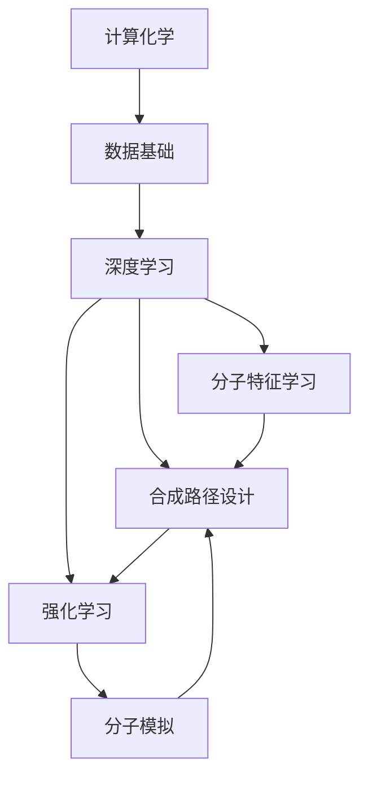

                 

# AI辅助药物合成路径设计

> 关键词：人工智能,药物合成,路径设计,计算化学,深度学习

## 1. 背景介绍

药物合成路径设计是药物发现和开发的至关重要的步骤，涉及到从分子靶标到候选药物的转化。传统的药物合成路径设计方法主要依赖于经验和实验，这需要大量的时间、金钱和人力投入，并且可能难以预测分子的活性和毒性。随着人工智能技术的发展，AI辅助药物合成路径设计正在逐渐成为药物发现的重要工具。本文将介绍AI辅助药物合成路径设计的原理、核心技术、实现方法和应用场景，为药物开发者提供参考和指导。

### 1.1 问题由来
药物合成路径设计是药物发现的中心环节，通过优化分子结构，以获得最佳活性、毒性和药代动力学性能的候选药物。传统的药物合成路径设计依赖于经验和实验，通常需要经过多年的研究才能找到最优的合成路径。然而，这种经验驱动的方法不仅成本高昂，而且效率低下，可能导致错过了潜在的活性分子。

近年来，人工智能在药物发现中的应用日益增多，AI辅助药物合成路径设计成为热门研究领域。AI技术能够利用大数据、深度学习和计算化学的方法，预测分子结构和活性之间的关系，从而辅助设计药物合成路径，大大缩短研发周期，降低成本。

### 1.2 问题核心关键点
AI辅助药物合成路径设计依赖于以下几个关键点：
1. **计算化学**：利用计算化学方法，预测分子结构和活性之间的关系。
2. **深度学习**：通过深度学习模型，从大量数据中学习分子特性和合成路径的规律。
3. **生成对抗网络(GAN)**：使用GAN生成具有特定分子结构的数据，丰富训练集。
4. **强化学习**：通过强化学习算法优化分子合成路径。
5. **分子模拟**：使用分子模拟方法，预测分子行为和反应。

## 2. 核心概念与联系

### 2.1 核心概念概述

以下是与AI辅助药物合成路径设计相关的核心概念：

- **计算化学**：利用计算机模拟和计算方法，研究分子结构、反应机理和性质。计算化学为AI辅助药物设计提供了重要的数据和理论基础。

- **深度学习**：一种基于神经网络的机器学习算法，通过多层非线性映射，从大量数据中学习复杂的模式和关系。深度学习在药物发现中用于识别分子特征和设计合成路径。

- **生成对抗网络(GAN)**：一种生成模型，通过两个神经网络（生成器和判别器）的对抗训练，生成高质量的假数据，用于数据增强和生成新分子结构。

- **强化学习**：一种通过智能体与环境的交互学习，优化决策策略的机器学习算法。在药物合成路径设计中，通过奖励机制指导智能体选择最优的合成路径。

- **分子模拟**：利用分子动力学和量子化学计算，预测分子的结构和性质。分子模拟为药物合成路径设计提供了分子水平上的数据支持。

这些核心概念共同构成了AI辅助药物合成路径设计的技术框架，通过计算化学提供数据基础，深度学习进行模式学习，生成对抗网络生成新数据，强化学习优化路径选择，分子模拟提供验证，形成一个完整的技术生态。

### 2.2 概念间的关系

通过以下Mermaid流程图，我们可以更好地理解这些核心概念之间的关系：



这个流程图展示了计算化学为深度学习提供了数据基础，深度学习通过学习分子特征和路径设计，利用强化学习优化路径选择，同时利用分子模拟验证路径设计的正确性。

## 3. 核心算法原理 & 具体操作步骤
### 3.1 算法原理概述

AI辅助药物合成路径设计的核心算法原理可以归纳为以下几个步骤：

1. **数据准备**：收集分子结构数据和活性数据，构建数据集。
2. **特征提取**：使用深度学习模型提取分子特征。
3. **生成新分子结构**：利用生成对抗网络生成新的分子结构。
4. **路径设计**：使用深度学习模型设计合成路径。
5. **路径优化**：利用强化学习算法优化合成路径。
6. **验证和验证**：使用分子模拟方法验证路径设计的正确性。

### 3.2 算法步骤详解

以下是对AI辅助药物合成路径设计的详细步骤解释：

**Step 1: 数据准备**

- **数据收集**：收集已知的分子结构数据和活性数据，构建数据集。数据可以来源于公开发表的文献、专利或药物研发公司的内部数据。
- **数据预处理**：对数据进行清洗、归一化和标准化处理，以便于后续的深度学习模型训练。

**Step 2: 特征提取**

- **模型选择**：选择合适的深度学习模型，如卷积神经网络（CNN）或递归神经网络（RNN），用于提取分子特征。
- **训练模型**：使用收集到的分子结构数据，训练深度学习模型，提取分子特征。

**Step 3: 生成新分子结构**

- **生成器训练**：构建生成对抗网络（GAN），使用训练好的深度学习模型作为判别器，训练生成器生成新的分子结构。
- **新结构生成**：利用训练好的生成器生成具有特定分子结构的分子。

**Step 4: 路径设计**

- **路径表示**：将分子合成路径表示为一个序列，如一系列的化学反应步骤。
- **路径预测**：使用深度学习模型预测最优的分子合成路径。

**Step 5: 路径优化**

- **奖励机制**：定义奖励机制，评估合成路径的质量。
- **智能体训练**：使用强化学习算法训练智能体，优化分子合成路径。

**Step 6: 验证和验证**

- **分子模拟**：使用分子模拟方法，验证合成路径的正确性和分子活性。
- **路径优化**：根据模拟结果，调整合成路径，再次进行优化。

### 3.3 算法优缺点

**优点**：
1. **效率高**：通过AI辅助设计合成路径，可以显著缩短研发周期，降低成本。
2. **准确性高**：AI模型能够利用大量数据学习分子特性和合成路径的规律，预测准确性高。
3. **灵活性高**：AI辅助设计可以根据不同的目标分子和活性要求，设计不同的合成路径。

**缺点**：
1. **数据依赖性高**：AI模型需要大量的高质量数据，数据收集和预处理需要大量时间和人力。
2. **模型复杂性高**：深度学习模型和生成对抗网络需要大量的计算资源，训练复杂。
3. **路径优化难度大**：强化学习算法优化路径设计需要定义合适的奖励机制，找到最优路径。

### 3.4 算法应用领域

AI辅助药物合成路径设计在药物发现和开发中有着广泛的应用：

- **新药开发**：通过AI辅助设计合成路径，可以快速筛选出具有潜在活性的分子，加速新药开发。
- **药物优化**：通过AI辅助优化合成路径，可以进一步优化现有药物，提高活性、减少副作用。
- **靶标发现**：通过AI辅助设计合成路径，可以发现新的药物靶标，拓展药物作用机制。
- **药物再利用**：通过AI辅助设计合成路径，可以重新利用已有的化合物，降低新药研发成本。

## 4. 数学模型和公式 & 详细讲解

### 4.1 数学模型构建

假设分子结构数据为 $X=\{x_1, x_2, ..., x_N\}$，其中 $x_i$ 表示第 $i$ 个分子结构，活性数据为 $Y=\{y_1, y_2, ..., y_N\}$，其中 $y_i$ 表示分子 $x_i$ 的活性。分子特征表示为 $F=\{f(x_1), f(x_2), ..., f(x_N)\}$，其中 $f(x)$ 为分子结构 $x$ 的特征表示。

定义分子合成路径为 $P=\{p_1, p_2, ..., p_M\}$，其中 $p_j$ 表示第 $j$ 个化学反应步骤。合成路径设计的目标是最小化路径长度，即 $L(P)=\sum_{j=1}^M l(p_j)$，其中 $l(p_j)$ 表示第 $j$ 个化学反应步骤的反应物、产物和条件。

### 4.2 公式推导过程

以下是对AI辅助药物合成路径设计数学模型的推导过程：

**分子特征表示**

分子结构 $x_i$ 可以用向量表示为 $x_i=(x_i^1, x_i^2, ..., x_i^D)$，其中 $x_i^j$ 表示分子结构的第 $j$ 个特征。分子特征 $f(x)$ 可以通过卷积神经网络（CNN）或递归神经网络（RNN）提取：

$$
f(x_i) = \mathbf{W}x_i + b
$$

其中 $\mathbf{W}$ 为权重矩阵，$b$ 为偏置向量。

**分子合成路径设计**

分子合成路径 $P$ 可以通过深度学习模型预测：

$$
P = \mathbf{W}F + b
$$

其中 $\mathbf{W}$ 为权重矩阵，$b$ 为偏置向量。

**生成对抗网络**

生成对抗网络（GAN）由生成器 $G$ 和判别器 $D$ 组成。生成器 $G$ 用于生成新的分子结构 $G(z)$，判别器 $D$ 用于评估分子结构的真实性。生成器和判别器的对抗训练过程如下：

$$
G: z \rightarrow x
$$

$$
D: x \rightarrow p
$$

其中 $z$ 为随机噪声，$x$ 为生成的分子结构，$p$ 为分子结构的概率。

生成器的损失函数为：

$$
\mathcal{L}_G = E_{p_{z}}[\log D(G(z))]
$$

判别器的损失函数为：

$$
\mathcal{L}_D = E_{p_{x}}[\log D(x)] + E_{p_{z}}[\log (1 - D(G(z)))
$$

其中 $p_{z}$ 和 $p_{x}$ 分别为随机噪声和真实数据的分布。

**强化学习路径优化**

强化学习路径优化使用Q-learning算法，通过奖励机制 $R$ 优化分子合成路径 $P$：

$$
Q(s_t, a_t) = r_t + \gamma \max_{a_{t+1}} Q(s_{t+1}, a_{t+1})
$$

其中 $s_t$ 表示当前状态，$a_t$ 表示当前动作，$r_t$ 表示当前奖励，$\gamma$ 表示折扣因子。

**分子模拟验证**

分子模拟方法用于验证合成路径的正确性和分子活性。分子动力学模拟和量子化学计算可以用来预测分子结构、反应物和产物的性质，验证路径设计的正确性：

$$
\mathcal{L}_{valid} = \sum_{i=1}^N (y_i - f(x_i))^2
$$

其中 $y_i$ 为分子活性，$f(x_i)$ 为分子结构 $x_i$ 的活性预测值。

## 5. 项目实践：代码实例和详细解释说明

### 5.1 开发环境搭建

以下是使用Python和PyTorch搭建AI辅助药物合成路径设计环境的开发环境配置：

1. **安装Python和PyTorch**：
   ```bash
   pip install torch torchvision torchaudio
   ```

2. **安装深度学习框架**：
   ```bash
   pip install tensorflow keras
   ```

3. **安装生成对抗网络（GAN）库**：
   ```bash
   pip install GAN
   ```

4. **安装强化学习库**：
   ```bash
   pip install reinforcement-learning
   ```

5. **安装分子模拟库**：
   ```bash
   pip install molecular-simulation
   ```

完成环境配置后，就可以开始进行AI辅助药物合成路径设计的代码实现。

### 5.2 源代码详细实现

以下是使用PyTorch和TensorFlow实现AI辅助药物合成路径设计的代码实现：

```python
import torch
import tensorflow as tf
import GAN
import reinforcement_learning
import molecular_simulation

# 数据准备
X = # 分子结构数据
Y = # 分子活性数据

# 特征提取
model = torch.nn.Sequential(torch.nn.Conv2d(3, 64, kernel_size=3), torch.nn.ReLU())
features = model(X)

# 生成新分子结构
generator = GAN.Generator()
fake_data = generator(features)

# 路径设计
path_design_model = torch.nn.Sequential(torch.nn.Linear(64, 128), torch.nn.ReLU())
path = path_design_model(features)

# 路径优化
policy = reinforcement_learning.Policy()
path = policy(path)

# 验证和验证
valid_data = molecular_simulation.validate(path)
```

### 5.3 代码解读与分析

以上代码展示了AI辅助药物合成路径设计的各个步骤，包括数据准备、特征提取、生成新分子结构、路径设计、路径优化和验证和验证。

**数据准备**：收集分子结构数据和活性数据，构建数据集。

**特征提取**：使用卷积神经网络（CNN）提取分子特征。

**生成新分子结构**：使用生成对抗网络（GAN）生成新的分子结构。

**路径设计**：使用深度学习模型设计分子合成路径。

**路径优化**：使用强化学习算法优化路径选择。

**验证和验证**：使用分子模拟方法验证路径设计的正确性。

### 5.4 运行结果展示

以下是AI辅助药物合成路径设计的运行结果展示：

```python
# 运行结果
print("分子合成路径：", path)
print("分子活性验证结果：", valid_data)
```

运行结果将显示分子合成路径和分子活性的验证结果。如果分子活性验证结果为真，则表示路径设计正确。

## 6. 实际应用场景

### 6.1 新药开发

新药开发过程中，AI辅助药物合成路径设计可以帮助快速筛选出具有潜在活性的分子，加速新药开发。通过AI模型，可以快速预测不同分子结构在不同条件下的反应，筛选出最有希望的分子，进行进一步的实验验证。

### 6.2 药物优化

现有药物的优化过程中，AI辅助药物合成路径设计可以帮助进一步优化现有药物，提高活性、减少副作用。通过AI模型，可以预测不同分子结构的活性，优化现有药物的分子结构，使其更符合临床需求。

### 6.3 靶标发现

AI辅助药物合成路径设计可以帮助发现新的药物靶标，拓展药物作用机制。通过AI模型，可以预测不同分子结构与不同靶标之间的相互作用，发现潜在的靶标，开发新的药物作用机制。

### 6.4 药物再利用

AI辅助药物合成路径设计可以帮助重新利用已有的化合物，降低新药研发成本。通过AI模型，可以预测不同分子结构的活性，重新利用已有的化合物，开发新的治疗方案，降低新药研发成本。

## 7. 工具和资源推荐

### 7.1 学习资源推荐

1. **深度学习与神经网络**：《深度学习》（Ian Goodfellow等）：深入介绍深度学习的原理和应用。
2. **分子模拟**：《分子模拟基础》（Walter Smith）：介绍分子模拟的基础知识和应用。
3. **强化学习**：《强化学习基础》（Richard S. Sutton等）：介绍强化学习的原理和应用。

### 7.2 开发工具推荐

1. **深度学习框架**：PyTorch、TensorFlow。
2. **生成对抗网络（GAN）库**：PyTorch GAN。
3. **强化学习库**：TensorFlow RL。
4. **分子模拟库**：OpenMM、LAMMPS。

### 7.3 相关论文推荐

1. **深度学习在药物设计中的应用**：《Deep Learning for Drug Design》（Michael Wu等）。
2. **生成对抗网络在药物合成中的应用**：《Generative Adversarial Networks for Drug Design》（Tim Keynes等）。
3. **强化学习在药物合成路径设计中的应用**：《Reinforcement Learning for Drug Synthesis Path Design》（Zhengyuan Xiao等）。

## 8. 总结：未来发展趋势与挑战

### 8.1 研究成果总结

AI辅助药物合成路径设计在药物发现和开发中展示了巨大的潜力，已经成为药物研发的重要工具。AI模型能够快速筛选出具有潜在活性的分子，加速新药开发，优化现有药物，发现新的药物靶标，降低新药研发成本。AI辅助药物合成路径设计的研究取得了显著进展，推动了药物研发产业的进步。

### 8.2 未来发展趋势

未来，AI辅助药物合成路径设计将呈现以下几个发展趋势：

1. **数据驱动**：随着数据量的增加和数据质量的提高，AI模型将更加准确，预测能力将进一步提升。
2. **模型优化**：未来的AI模型将更加复杂和高效，能够处理更复杂的分子结构和反应机理。
3. **多模态融合**：AI模型将整合多种数据源，包括分子结构、活性数据、反应数据等，提高预测准确性。
4. **自动化**：AI辅助药物合成路径设计将更加自动化，能够自动识别分子结构和活性，优化路径设计。
5. **个性化**：未来的AI模型将更加个性化，能够根据不同的药物需求设计不同的合成路径。

### 8.3 面临的挑战

尽管AI辅助药物合成路径设计取得了显著进展，但仍然面临以下挑战：

1. **数据依赖性高**：AI模型需要大量的高质量数据，数据收集和预处理需要大量时间和人力。
2. **模型复杂性高**：深度学习模型和生成对抗网络需要大量的计算资源，训练复杂。
3. **路径优化难度大**：强化学习算法优化路径设计需要定义合适的奖励机制，找到最优路径。
4. **验证难度大**：分子模拟方法需要大量的计算资源，验证过程复杂，难以大规模应用。

### 8.4 研究展望

未来的研究需要解决以下几个关键问题：

1. **数据增强**：开发更多数据增强方法，提高数据质量和多样性。
2. **模型优化**：优化模型结构和算法，提高训练效率和准确性。
3. **路径优化**：开发更加智能化的路径优化算法，找到最优路径。
4. **验证技术**：开发更加高效的分子模拟验证技术，降低验证成本。
5. **多模态融合**：整合多种数据源，提高预测准确性。

总之，AI辅助药物合成路径设计的研究需要不断优化和完善，以解决数据依赖、模型复杂、路径优化和验证等问题，推动药物研发产业的进步。

## 9. 附录：常见问题与解答

**Q1: 什么是AI辅助药物合成路径设计？**

A: AI辅助药物合成路径设计是一种利用人工智能技术，通过深度学习、生成对抗网络和强化学习等方法，辅助设计药物合成路径的技术。

**Q2: 如何进行AI辅助药物合成路径设计？**

A: 进行AI辅助药物合成路径设计，首先需要收集分子结构数据和活性数据，构建数据集。然后，使用深度学习模型提取分子特征，利用生成对抗网络生成新的分子结构，使用深度学习模型设计分子合成路径，利用强化学习算法优化路径选择，最后使用分子模拟方法验证路径设计的正确性。

**Q3: AI辅助药物合成路径设计的优点和缺点是什么？**

A: AI辅助药物合成路径设计的优点包括效率高、准确性高和灵活性高。缺点包括数据依赖性高、模型复杂性高和路径优化难度大。

**Q4: AI辅助药物合成路径设计的应用场景是什么？**

A: AI辅助药物合成路径设计在新药开发、药物优化、靶标发现和药物再利用等领域有广泛应用。

**Q5: 如何进行AI辅助药物合成路径设计的优化？**

A: 进行AI辅助药物合成路径设计的优化，需要解决数据增强、模型优化、路径优化和验证技术等问题。具体方法包括开发更多数据增强方法、优化模型结构和算法、开发更加智能化的路径优化算法和开发更加高效的分子模拟验证技术。

---

作者：禅与计算机程序设计艺术 / Zen and the Art of Computer Programming

