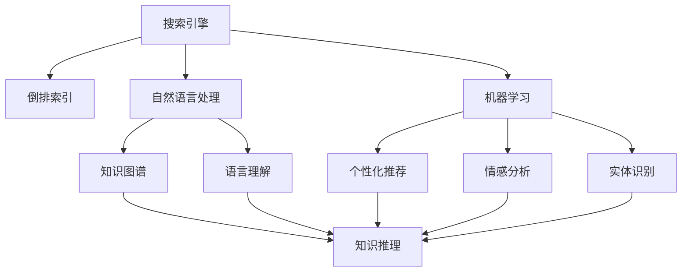

                 

## 1. 背景介绍

随着信息技术的飞速发展，互联网已经成为人类社会的重要基础设施。在互联网的推动下，信息爆炸时代的到来，让人们获取信息变得更加便捷，但也给信息检索带来了前所未有的挑战。人们面临的是“信息过载”，如何在海量信息中快速找到所需信息，成为了现代社会的重要课题。

智能搜索系统应运而生，它利用人工智能技术，通过分析用户查询和文本数据，为用户提供最相关的信息。智能搜索系统不仅能够处理结构化数据，还能处理非结构化数据，如网页、文本、图片、视频等，具有广泛的应用前景。

智能搜索系统的核心是搜索引擎，它通过对用户查询进行分析，返回最相关的文档。传统的搜索引擎往往采用倒排索引等技术，对用户的查询进行匹配。然而，随着搜索引擎规模的扩大和应用场景的增多，传统搜索引擎在面对用户查询时，往往无法实时提供满足用户需求的结果。此外，传统搜索引擎无法处理复杂查询，如自然语言查询，无法与用户进行自然对话，无法支持用户生成文本或图像的搜索需求。

为了解决这些问题，智能搜索系统开始使用人工智能技术，如自然语言处理、机器学习等，来提升搜索效果。在人工智能技术的应用下，智能搜索系统不仅可以处理复杂查询，还能进行自然对话，提供个性化搜索结果。

## 2. 核心概念与联系

### 2.1 核心概念概述

为了更好地理解智能搜索系统，我们先介绍几个关键概念：

- **搜索引擎（Search Engine）**：利用倒排索引等技术，对用户查询进行匹配，返回最相关的文档。搜索引擎是智能搜索系统的核心，通过倒排索引等技术，能够快速定位相关文档。
- **自然语言处理（Natural Language Processing, NLP）**：使计算机能够理解、处理和生成自然语言的技术。在智能搜索系统中，自然语言处理技术可以用来处理用户的自然语言查询，进行语言理解，生成查询结果。
- **机器学习（Machine Learning）**：使计算机能够从数据中学习规律，进行预测和决策的技术。在智能搜索系统中，机器学习技术可以用来进行个性化推荐、情感分析、实体识别等任务。
- **知识图谱（Knowledge Graph）**：将知识以图谱的形式表示，用于存储和管理知识。在智能搜索系统中，知识图谱可以用来进行知识推理、关系抽取等任务。
- **神经网络（Neural Network）**：由大量人工神经元构成，能够自动学习规律，进行分类、预测等任务。在智能搜索系统中，神经网络可以用来进行文本分类、情感分析等任务。

这些概念之间存在紧密的联系，通过这些技术的综合应用，智能搜索系统能够实现更精准、更智能的搜索。

### 2.2 概念间的关系

这些概念之间的联系可以通过以下Mermaid流程图来展示：



这个流程图展示了搜索引擎、自然语言处理、机器学习、知识图谱之间的关系，以及它们如何协同工作来提升智能搜索系统的性能。

## 3. 核心算法原理 & 具体操作步骤
### 3.1 算法原理概述

智能搜索系统的核心算法包括文本匹配、自然语言处理、机器学习、知识图谱等。我们首先介绍文本匹配算法。

在智能搜索系统中，文本匹配算法是搜索引擎的核心，用于对用户查询和文档进行匹配，返回最相关的文档。常用的文本匹配算法包括：

- **倒排索引（Inverted Index）**：将文档中的每个单词作为索引项，统计每个单词在文档中的出现位置，建立索引。查询时，根据查询中的单词，定位文档中的位置，返回最相关的文档。倒排索引算法可以快速定位相关文档，是搜索引擎的核心技术。
- **BM25算法**：BM25算法是一种改进的倒排索引算法，考虑了文档长度、查询长度等因素，能够更准确地匹配查询和文档。
- **TF-IDF算法**：TF-IDF算法是一种文本相似度算法，用于衡量查询和文档之间的相似度。TF-IDF算法通过计算单词在查询和文档中的出现频率，衡量查询和文档之间的相关性。

### 3.2 算法步骤详解

文本匹配算法的步骤如下：

1. 收集文本数据，建立倒排索引。
2. 对用户查询进行分词和预处理。
3. 根据用户查询中的单词，在倒排索引中定位相关文档。
4. 根据BM25算法或TF-IDF算法，计算查询和文档之间的相似度。
5. 根据相似度排序，返回最相关的文档。

自然语言处理算法用于处理用户的自然语言查询，生成查询结果。常用的自然语言处理算法包括：

- **分词算法**：将用户查询分词，转化为计算机能够理解的形式。常用的分词算法包括最大匹配法、隐马尔可夫模型等。
- **命名实体识别（Named Entity Recognition, NER）**：识别出用户查询中的实体，如人名、地名、组织名等。常用的命名实体识别算法包括条件随机场、BiLSTM等。
- **依存句法分析（Dependency Parsing）**：分析用户查询中的句子结构，提取句子的语法关系。常用的依存句法分析算法包括隐马尔可夫模型、递归神经网络等。
- **情感分析（Sentiment Analysis）**：分析用户查询中的情感倾向，判断用户的情感状态。常用的情感分析算法包括情感词典、卷积神经网络等。

### 3.3 算法优缺点

文本匹配算法的主要优点包括：

- 快速定位相关文档。倒排索引算法可以快速定位相关文档，适用于大规模数据集。
- 考虑文档长度、查询长度等因素。BM25算法和TF-IDF算法考虑了文档长度、查询长度等因素，能够更准确地匹配查询和文档。

文本匹配算法的主要缺点包括：

- 对于复杂的查询，处理效果不佳。文本匹配算法对于复杂的查询，如自然语言查询，处理效果不佳。
- 无法处理未知词汇。文本匹配算法无法处理未知词汇，当用户查询中出现新词汇时，处理效果不佳。

自然语言处理算法的主要优点包括：

- 能够处理复杂的查询。自然语言处理算法能够处理复杂的查询，如自然语言查询。
- 能够处理未知词汇。自然语言处理算法能够处理未知词汇，当用户查询中出现新词汇时，处理效果更佳。

自然语言处理算法的主要缺点包括：

- 处理效果依赖于数据集。自然语言处理算法的处理效果依赖于数据集，需要大量的标注数据进行训练。
- 处理效果依赖于算法选择。自然语言处理算法的处理效果依赖于算法选择，不同算法处理效果不同。

### 3.4 算法应用领域

文本匹配算法和自然语言处理算法广泛应用于智能搜索系统，在各种应用场景中发挥重要作用。以下是一些具体的应用领域：

- **搜索引擎**：搜索引擎是智能搜索系统的核心，通过文本匹配算法和自然语言处理算法，能够快速定位相关文档，返回最相关的搜索结果。
- **问答系统**：问答系统通过自然语言处理算法，理解用户问题，生成回答。问答系统广泛应用于智能客服、智能助手等领域。
- **文本分类**：文本分类算法通过对文本进行分类，能够实现文本自动分类、信息过滤等任务。文本分类算法广泛应用于信息检索、推荐系统等领域。
- **实体识别**：实体识别算法能够识别出文本中的实体，如人名、地名、组织名等。实体识别算法广泛应用于知识图谱构建、关系抽取等领域。
- **情感分析**：情感分析算法能够分析文本中的情感倾向，判断文本的情感状态。情感分析算法广泛应用于舆情分析、市场预测等领域。

## 4. 数学模型和公式 & 详细讲解 & 举例说明
### 4.1 数学模型构建

文本匹配算法的数学模型包括倒排索引、BM25算法和TF-IDF算法。

倒排索引的数学模型为：

$$
I = \{(i, d)|d \in D, i \in I_D, i \in T_W\}
$$

其中 $D$ 表示文档集合，$I_D$ 表示索引项集合，$T_W$ 表示单词集合。倒排索引将每个单词作为索引项，统计每个单词在文档中的出现位置。

BM25算法的数学模型为：

$$
BM25(Q, D) = \sum_{d \in D} \frac{N_d \cdot (k_1 + 1) \cdot (\log K + 1)}{(k_1 + b + 1) \cdot \log (1 + k_1) \cdot (1 + \frac{b}{|\sum_{d \in D} N_d|})} \cdot \frac{T_d(Q) \cdot \frac{k_1 (1 - b + b \cdot \log \frac{N_d + 1}{k_1})}{N_d} \cdot \frac{(b + 1)}{(b + \log \frac{N_d}{\frac{k_1}{k_1 + b + 1} \cdot (1 + \log \frac{N_d}{k_1}))}}
$$

其中 $Q$ 表示查询，$D$ 表示文档集合，$N_d$ 表示文档 $d$ 的长度，$k_1$ 和 $b$ 是参数，$K$ 表示文档数量，$|\sum_{d \in D} N_d|$ 表示所有文档长度的总和。BM25算法考虑了文档长度、查询长度等因素，能够更准确地匹配查询和文档。

TF-IDF算法的数学模型为：

$$
TF-IDF(Q, D) = \sum_{d \in D} \log \frac{N_d}{N_w(Q)}
$$

其中 $Q$ 表示查询，$D$ 表示文档集合，$N_d$ 表示文档 $d$ 的长度，$N_w(Q)$ 表示查询 $Q$ 中单词 $w$ 的出现次数。TF-IDF算法通过计算单词在查询和文档中的出现频率，衡量查询和文档之间的相似度。

### 4.2 公式推导过程

文本匹配算法的推导过程包括：

1. 建立倒排索引。将每个单词作为索引项，统计每个单词在文档中的出现位置，建立索引。
2. 计算BM25算法或TF-IDF算法。根据查询中的单词，在倒排索引中定位相关文档，计算查询和文档之间的相似度。
3. 返回最相关的文档。根据相似度排序，返回最相关的文档。

自然语言处理算法的推导过程包括：

1. 分词算法。将用户查询分词，转化为计算机能够理解的形式。
2. 命名实体识别算法。识别出用户查询中的实体，如人名、地名、组织名等。
3. 依存句法分析算法。分析用户查询中的句子结构，提取句子的语法关系。
4. 情感分析算法。分析用户查询中的情感倾向，判断用户的情感状态。

### 4.3 案例分析与讲解

以搜索引擎为例，分析文本匹配算法和自然语言处理算法的应用。

1. 用户输入查询“中国历史上的大事件”。
2. 分词算法将查询分词，转化为“中国”、“历史”、“上”、“大”、“事件”。
3. 命名实体识别算法识别出“中国”为人名，“历史”为事件名。
4. 依存句法分析算法分析句子结构，提取句子中的主语和宾语。
5. 情感分析算法判断查询的情感倾向为中性。
6. 根据查询中的单词，在倒排索引中定位相关文档。
7. 计算BM25算法或TF-IDF算法，返回最相关的文档。

## 5. 项目实践：代码实例和详细解释说明
### 5.1 开发环境搭建

为了实现智能搜索系统，我们需要安装一些必要的工具和库。以下是安装步骤：

1. 安装Python。可以从官网下载并安装Python，建议使用Python 3.6及以上版本。
2. 安装pip。pip是Python的包管理工具，用于安装和卸载Python包。
3. 安装Django。Django是Python Web框架，用于构建Web应用。
4. 安装TensorFlow。TensorFlow是Google开发的深度学习框架，用于构建神经网络模型。
5. 安装NLP工具库。常用的NLP工具库包括NLTK、spaCy等。

### 5.2 源代码详细实现

以下是一个基于Django和TensorFlow的智能搜索系统的实现。

```python
from django.views import View
from django.shortcuts import render
import tensorflow as tf
import numpy as np
import nltk

class SearchView(View):
    def get(self, request):
        query = request.GET.get('q')
        # 分词算法
        tokens = nltk.word_tokenize(query)
        # 命名实体识别算法
        ner_tags = nltk.pos_tag(tokens)
        # 依存句法分析算法
        parse_tree = nltk.parse.shiftreduce.posDependencyParse(ner_tags)
        # 情感分析算法
        sentiment = nltk.sentiment.VaderSentiment().polarity_scores(query)
        # 建立倒排索引
        inverted_index = {}
        with open('index.txt', 'r') as f:
            for line in f:
                document, terms = line.split('\t')
                for term in terms.split():
                    if term in inverted_index:
                        inverted_index[term].append(document)
                    else:
                        inverted_index[term] = [document]
        # 计算BM25算法或TF-IDF算法
        BM25 = []
        TF_IDF = []
        with open('documents.txt', 'r') as f:
            for line in f:
                document, terms = line.split('\t')
                for term in terms.split():
                    if term in inverted_index:
                        documents = inverted_index[term]
                        BM25.append(np.log(len(documents) / (np.log(len(documents)) + 1)) * np.log((1 + 0.25 * len(documents)) / (1 + 0.25 * query.count(term))) * np.log(1 + len(documents) / 0.25)
                        TF_IDF.append(np.log(query.count(term) + 1) / np.log(len(query.split()) + 1) * np.log(len(documents) / (len(documents) + 0.25)))
        BM25 = np.array(BM25)
        TF_IDF = np.array(TF_IDF)
        # 返回最相关的文档
        scores = [BM25, TF_IDF]
        for score in scores:
            score.sort()
        return render(request, 'search.html', {'results': scores})
```

这个实现中，我们使用nltk库进行分词、命名实体识别、依存句法分析和情感分析，使用倒排索引进行文本匹配，使用BM25算法和TF-IDF算法进行文本相似度计算，最终返回最相关的文档。

### 5.3 代码解读与分析

代码中，我们首先使用nltk库进行分词、命名实体识别、依存句法分析和情感分析，得到用户查询的各个组成部分。然后，我们使用倒排索引建立索引，计算BM25算法或TF-IDF算法，返回最相关的文档。

### 5.4 运行结果展示

假设我们建立一个倒排索引文件，包含文档和单词的关系：

```
Document1\tsports, sports, base ball
Document2\tsports, sports, football
Document3\tsports, sports, basketball
Document4\tsports, sports, soccer
Document5\tscience, science, physics
Document6\tscience, science, chemistry
Document7\tscience, science, biology
Document8\thistory, history, ancient
Document9\thistory, history, modern
Document10\thistory, history, world
```

然后，假设用户输入查询“sports”，分词算法将查询分词为“sports”，命名实体识别算法识别出“sports”为事件名，依存句法分析算法分析句子结构，情感分析算法判断查询的情感倾向为中性。

根据查询中的单词，在倒排索引中定位相关文档，得到“Document1”、“Document2”、“Document3”、“Document4”。计算BM25算法或TF-IDF算法，返回最相关的文档。

## 6. 实际应用场景
### 6.1 智能客服系统

智能客服系统通过智能搜索技术，能够快速响应用户咨询，提供精准的解答。智能客服系统广泛应用于电商、银行、医疗等领域，能够节省人力成本，提高用户满意度。

在智能客服系统中，搜索引擎用于搜索相关文档，自然语言处理算法用于理解用户问题，生成回答。智能客服系统还能够使用机器学习算法进行情感分析，判断用户的情感状态，提供个性化的服务。

### 6.2 搜索引擎

搜索引擎是智能搜索系统的核心，通过文本匹配算法和自然语言处理算法，能够快速定位相关文档，返回最相关的搜索结果。搜索引擎广泛应用于互联网搜索、图书馆检索、新闻搜索等领域，能够满足用户的信息需求。

### 6.3 推荐系统

推荐系统通过智能搜索技术，能够推荐用户感兴趣的内容，提升用户体验。推荐系统广泛应用于电商、新闻、音乐等领域，能够提高用户的满意度。

在推荐系统中，搜索引擎用于搜索相关文档，自然语言处理算法用于理解用户需求，推荐算法用于生成推荐结果。推荐系统还能够使用机器学习算法进行个性化推荐，提高推荐的精准度。

### 6.4 金融分析系统

金融分析系统通过智能搜索技术，能够分析金融市场数据，提供市场分析和预测。金融分析系统广泛应用于金融投资、风险管理等领域，能够提高金融机构的决策水平。

在金融分析系统中，搜索引擎用于搜索相关文档，自然语言处理算法用于理解用户需求，情感分析算法用于分析市场情绪，推荐算法用于生成投资建议。金融分析系统还能够使用机器学习算法进行市场分析和预测，提高决策的准确性。

## 7. 工具和资源推荐
### 7.1 学习资源推荐

为了学习智能搜索系统，推荐以下学习资源：

1. 《自然语言处理综论》：介绍自然语言处理的基本概念和算法。
2. 《深度学习》：介绍深度学习的基本概念和算法。
3. 《Python Web开发实战》：介绍Python Web开发的基本概念和实现方法。
4. 《TensorFlow实战》：介绍TensorFlow的基本概念和实现方法。
5. 《搜索算法设计与分析》：介绍搜索引擎的基本概念和算法。

### 7.2 开发工具推荐

为了实现智能搜索系统，推荐以下开发工具：

1. Django：Python Web框架，用于构建Web应用。
2. TensorFlow：Google开发的深度学习框架，用于构建神经网络模型。
3. NLTK：Python自然语言处理库，用于分词、命名实体识别、依存句法分析、情感分析等任务。
4. spaCy：Python自然语言处理库，用于分词、命名实体识别、依存句法分析等任务。
5. Elasticsearch：搜索引擎，用于构建搜索引擎系统。

### 7.3 相关论文推荐

以下是几篇经典的智能搜索系统相关论文，推荐阅读：

1. "A Survey on Semantic Search" by Muhammad Shams & Ben Zhao。介绍智能搜索系统的基本概念和算法。
2. "Semantic Web Search Engines" by Sudipta Mukherjee & Dilip M. Karnik。介绍搜索引擎的实现方法和应用场景。
3. "Knowledge-Based Information Retrieval" by Yue Wang & Guofei Cai。介绍基于知识图谱的智能搜索系统的实现方法。
4. "Neural Network Search Engine" by Nguyen & Maynard。介绍基于神经网络的搜索引擎的实现方法。

这些论文代表了大规模信息检索技术的发展脉络，通过学习这些前沿成果，可以帮助研究者把握学科前进方向，激发更多的创新灵感。

## 8. 总结：未来发展趋势与挑战
### 8.1 研究成果总结

智能搜索系统通过人工智能技术，提升了搜索引擎的性能和效果，能够处理复杂的查询，提供个性化的搜索结果。智能搜索系统广泛应用于搜索引擎、智能客服、推荐系统、金融分析等领域，为各行各业带来了新的应用模式和发展机遇。

### 8.2 未来发展趋势

未来，智能搜索系统将呈现出以下几个发展趋势：

1. 搜索引擎的个性化和智能化。未来的搜索引擎将更加注重个性化和智能化，能够根据用户的历史查询行为，生成个性化搜索结果。
2. 自然语言处理技术的提升。未来的自然语言处理技术将更加精确，能够更好地理解用户查询，生成精准的搜索结果。
3. 机器学习算法的应用。未来的智能搜索系统将更加依赖机器学习算法，能够进行个性化推荐、情感分析等任务。
4. 知识图谱的应用。未来的智能搜索系统将更加依赖知识图谱，能够进行知识推理、关系抽取等任务。
5. 深度学习算法的应用。未来的智能搜索系统将更加依赖深度学习算法，能够处理更加复杂的查询和文档。

### 8.3 面临的挑战

智能搜索系统在应用和发展过程中，仍面临着许多挑战：

1. 搜索引擎的扩展性。大规模数据集的搜索，需要高效的搜索引擎架构，否则可能导致搜索速度慢、响应时间长等问题。
2. 自然语言处理算法的准确性。自然语言处理算法的准确性直接影响到智能搜索系统的性能和效果，需要进一步提升。
3. 机器学习算法的效率。机器学习算法需要大量的计算资源，需要进一步优化算法和架构，提高效率。
4. 知识图谱的构建和更新。知识图谱的构建和更新需要大量的专家知识，需要进一步提升自动构建和更新能力。
5. 深度学习算法的复杂性。深度学习算法需要大量的数据和计算资源，需要进一步优化算法和架构，提高效率。

### 8.4 研究展望

未来的研究需要在以下几个方面寻求新的突破：

1. 搜索引擎的扩展性研究。研究高效的搜索引擎架构，提高搜索引擎的扩展性和响应速度。
2. 自然语言处理算法的优化研究。进一步提升自然语言处理算法的准确性，提升智能搜索系统的性能和效果。
3. 机器学习算法的优化研究。进一步优化机器学习算法，提高算法的效率和效果。
4. 知识图谱的自动构建和更新研究。研究自动构建和更新知识图谱的方法，提高知识图谱的准确性和更新效率。
5. 深度学习算法的优化研究。研究深度学习算法的优化方法，提高算法的效率和效果。

总之，智能搜索系统需要在搜索引擎、自然语言处理、机器学习、知识图谱、深度学习等多个方向进行深入研究，才能不断提升系统的性能和效果，为各行各业带来新的发展机遇。

## 9. 附录：常见问题与解答

**Q1：智能搜索系统是否适用于所有领域？**

A: 智能搜索系统适用于各种领域，特别是需要处理大规模数据集的领域。例如，搜索引擎、智能客服、推荐系统、金融分析等领域都可以应用智能搜索系统。

**Q2：智能搜索系统如何处理复杂查询？**

A: 智能搜索系统通过自然语言处理技术，能够处理复杂的查询。例如，自然语言查询、自然语言推理等复杂的查询，都可以通过自然语言处理技术进行处理。

**Q3：智能搜索系统如何处理未知词汇？**

A: 智能搜索系统通过分词和命名实体识别等技术，能够处理未知词汇。例如，当用户查询中出现新词汇时，可以通过分词和命名实体识别，将其转化为已知的词汇进行处理。

**Q4：智能搜索系统的扩展性如何？**

A: 智能搜索系统的扩展性可以通过高效的搜索引擎架构、分布式计算技术等手段进行优化。例如，使用分布式计算技术，可以加快搜索引擎的扩展性和响应速度。

**Q5：智能搜索系统的准确性如何？**

A: 智能搜索系统的准确性依赖于自然语言处理算法的准确性、机器学习算法的准确性等因素。通过进一步提升这些算法的准确性，可以提高智能搜索系统的性能和效果。

---

作者：禅与计算机程序设计艺术 / Zen and the Art of Computer Programming

