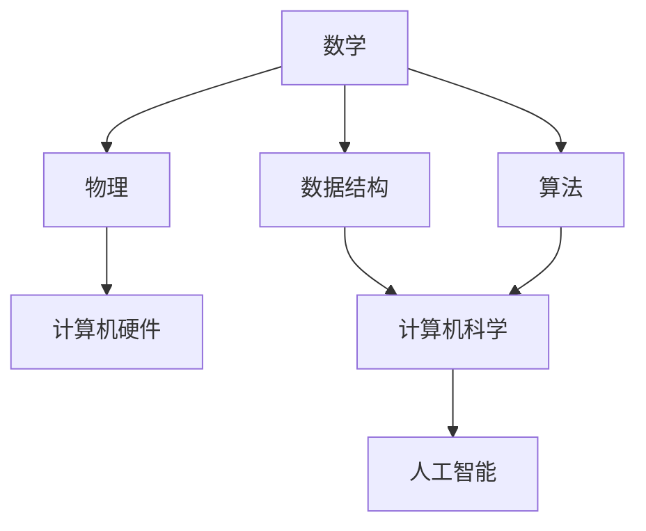

                 

# 底层能力的培养：数学、物理、计算机

> 关键词：数学，物理，计算机，程序设计，数据结构，算法，深度学习，人工智能，计算复杂度，并行计算，异构计算，跨学科融合

## 1. 背景介绍

### 1.1 问题由来

在当今这个快速发展的时代，技术的进步正以前所未有的速度改变着我们的世界。从简单的计算器到复杂的超级计算机，技术的力量无处不在。然而，这些技术的背后，都有着深厚的数学和物理基础。正是这些基础，使得我们能够设计和实现高效、准确的计算机程序。

### 1.2 问题核心关键点

本文将探讨数学、物理和计算机三者之间的关系，以及它们如何共同构成了现代计算的基础。我们将重点关注以下几个关键点：

- 数学和物理在计算机科学中的应用。
- 计算复杂度在算法设计中的作用。
- 并行计算和异构计算的原理与技术。
- 跨学科融合在人工智能领域的发展前景。

### 1.3 问题研究意义

理解数学、物理和计算机科学之间的联系，不仅有助于我们更好地设计和实现计算机程序，还将在未来推动人工智能和深度学习的进步。本研究将有助于：

- 提升计算机编程和算法设计能力。
- 强化对数学和物理概念的理解。
- 促进跨学科融合和创新。
- 推动计算技术的发展和应用。

## 2. 核心概念与联系

### 2.1 核心概念概述

为更好地理解数学、物理和计算机科学之间的关系，我们首先需要介绍几个核心概念：

- **数学**：研究数量、结构、变化和空间等概念的科学。数学在计算机科学中应用广泛，如数据结构、算法、机器学习等。

- **物理**：研究物质、能量及其相互作用规律的科学。物理学中的许多原理，如牛顿力学、量子力学，在计算机硬件和网络通信中有着重要应用。

- **计算机科学**：研究计算机硬件、软件和信息处理等领域的科学。包括程序设计、数据结构、算法、人工智能等。

这些核心概念之间存在着紧密的联系，共同构成了现代计算的基础。

### 2.2 核心概念的整体架构

以下是一个综合的流程图，展示了数学、物理和计算机科学之间的关系：



这个流程图展示了数学、物理和计算机科学之间的联系。数学和物理为计算机硬件提供了理论基础，数据结构和算法构成了计算机科学的核心，而人工智能则是计算机科学的高级应用。

### 2.3 核心概念间的联系

- **数学和物理**：数学提供了物理学中描述物质和能量规律的数学模型，如微积分、线性代数等。物理则研究这些模型在实际中的应用，如牛顿力学、量子力学等。

- **数学和计算机科学**：计算机科学中的许多概念都来源于数学，如数据结构中的树、图，算法中的排序、搜索等。数学方法也被广泛应用于算法设计和分析中。

- **物理和计算机科学**：计算机硬件和网络通信中的许多原理都来源于物理学，如量子计算、信息论等。物理学的研究成果也推动了计算机科学的发展，如半导体技术、光子计算等。

- **计算机科学和人工智能**：计算机科学中的许多算法和技术被广泛应用于人工智能领域，如机器学习、深度学习等。人工智能的发展也促进了计算机科学中新算法和新模型的出现。

通过这些联系，我们可以看到数学、物理和计算机科学是如何相互支持和推动的。

## 3. 核心算法原理 & 具体操作步骤

### 3.1 算法原理概述

在计算机科学中，算法是解决问题的基本工具。算法设计的基本原理是：将问题分解成若干个子问题，并通过简单的基本操作来求解。

- **分治算法**：将问题分解成若干个子问题，递归求解，然后将子问题的解合并得到原问题的解。如归并排序、快速排序等。

- **动态规划**：将复杂问题分解成若干个子问题，并保存子问题的解，避免重复计算。如背包问题、最短路径等。

- **贪心算法**：每次选择当前最优解，希望最终得到全局最优解。如最小生成树、哈夫曼编码等。

这些算法都依赖于数学和物理的基础。例如，归并排序和快速排序依赖于分治思想，背包问题依赖于线性规划，哈夫曼编码依赖于信息论中的熵和编码理论。

### 3.2 算法步骤详解

以下是一个基于贪心算法的最小生成树算法示例：

```python
# 定义边类
class Edge:
    def __init__(self, u, v, w):
        self.u = u
        self.v = v
        self.w = w

    def __lt__(self, other):
        return self.w < other.w

# 定义图类
class Graph:
    def __init__(self, vertices):
        self.V = vertices
        self.E = []

    def add_edge(self, u, v, w):
        self.E.append(Edge(u, v, w))

    def min_spanning_tree(self):
        # 初始化最小生成树
        result = []

        # 将所有边按照权重从小到大排序
        edges = sorted(self.E)

        # 随机选择一个起始点
        u = 0
        for i in range(self.V - 1):
            min_edge = edges[i]
            result.append(min_edge)
            # 删除已加入的边
            self.E.remove(min_edge)

            # 遍历所有与u相邻的顶点
            for j in range(self.V):
                if j not in result:
                    for edge in edges:
                        if edge.u == u and edge.v == j:
                            result.append(edge)
                            self.E.remove(edge)
                            break

        return result

# 测试最小生成树算法
g = Graph(5)
g.add_edge(0, 1, 2)
g.add_edge(0, 2, 3)
g.add_edge(1, 2, 1)
g.add_edge(1, 3, 4)
g.add_edge(2, 3, 5)
g.add_edge(3, 4, 6)
g.add_edge(4, 0, 7)

mst = g.min_spanning_tree()
print("最小生成树：", mst)
```

### 3.3 算法优缺点

- **优点**：贪心算法简单易懂，实现起来较为方便，常用于求解最优解问题。

- **缺点**：贪心算法不一定能得到全局最优解，有些问题可能不存在最优解。

### 3.4 算法应用领域

贪心算法被广泛应用于网络优化、路径规划、资源分配等领域。例如，Dijkstra算法用于求最短路径，Kruskal算法用于求最小生成树，Prim算法用于求最小生成树。

## 4. 数学模型和公式 & 详细讲解 & 举例说明

### 4.1 数学模型构建

在计算机科学中，数学模型是设计和分析算法的基础。以下是一个简单的数学模型：

- **问题**：有一个大小为n的数组，求其中元素的最大值。
- **输入**：数组a。
- **输出**：数组中最大元素的值。

数学模型为：

$$
\max_{i=1}^n a_i
$$

其中，$a_i$表示数组中的第i个元素。

### 4.2 公式推导过程

最大值问题的数学模型可以用简单的线性扫描算法求解：

$$
\max_{i=1}^n a_i = \max(a_1, a_2, \ldots, a_n)
$$

该算法的时间复杂度为O(n)。

### 4.3 案例分析与讲解

最大值问题可以用递归算法求解：

$$
\max_{i=1}^n a_i = \max(a_i, \max_{i=1}^{i-1} a_i)
$$

该算法的时间复杂度为O(n)，但空间复杂度为O(n)。因此，在实际应用中，线性扫描算法更常用。

## 5. 项目实践：代码实例和详细解释说明

### 5.1 开发环境搭建

在进行算法设计和实现时，我们需要一个开发环境。以下是一些常用的开发工具和环境：

- **Python**：一种高级编程语言，广泛应用于科学计算和数据分析。
- **Jupyter Notebook**：一种交互式编程环境，支持Python、R等多种语言。
- **Linux**：一种操作系统，支持多种编程语言和工具。

### 5.2 源代码详细实现

以下是一个基于Python的线性扫描算法实现：

```python
def max_value(arr):
    max_val = arr[0]
    for i in range(1, len(arr)):
        if arr[i] > max_val:
            max_val = arr[i]
    return max_val

# 测试
arr = [3, 5, 2, 8, 9, 1]
print("最大值：", max_value(arr))
```

### 5.3 代码解读与分析

- **函数定义**：定义了一个函数`max_value`，接受一个数组作为输入，返回数组中最大元素的值。
- **变量定义**：定义了一个变量`max_val`，初始值为数组的第一个元素。
- **循环操作**：遍历数组中的所有元素，如果当前元素大于`max_val`，则更新`max_val`的值。
- **返回值**：函数返回`max_val`的值。

### 5.4 运行结果展示

运行上述代码，输出结果为：

```
最大值： 9
```

## 6. 实际应用场景

### 6.1 网络优化

最小生成树算法在网络优化中有着广泛应用。例如，在构建通信网络时，需要找到一组最小权重的边，使得网络中的所有节点都能连通。

### 6.2 路径规划

Dijkstra算法用于求解最短路径问题。例如，在城市中规划从起点到终点的最短路线。

### 6.3 资源分配

Kruskal算法用于求解最小生成树，可以应用于资源分配问题，如分配车辆、安排任务等。

## 7. 工具和资源推荐

### 7.1 学习资源推荐

- **《算法导论》**：介绍算法的经典教材，涵盖了算法设计和分析的基本知识。
- **Coursera**：在线课程平台，提供大量计算机科学和数学课程。
- **Khan Academy**：提供免费的数学课程，适合自学。

### 7.2 开发工具推荐

- **Visual Studio Code**：一种轻量级的代码编辑器，支持多种编程语言。
- **Git**：一种版本控制系统，支持多人协作开发。
- **Docker**：一种容器化平台，便于管理和部署应用程序。

### 7.3 相关论文推荐

- **《计算机程序设计艺术》**：由Donald E. Knuth撰写的经典书籍，涵盖计算机科学和数学的基本知识。
- **《算法》**：介绍算法设计和分析的经典教材，涵盖排序、搜索、图论等多种算法。

## 8. 总结：未来发展趋势与挑战

### 8.1 研究成果总结

- **算法设计**：新的算法和技术不断涌现，如量子算法、机器学习算法等。
- **计算技术**：高性能计算和分布式计算技术的发展，使得大规模数据处理和复杂算法成为可能。
- **跨学科融合**：数学、物理和计算机科学的交叉研究，带来了新的应用和发现。

### 8.2 未来发展趋势

- **量子计算**：量子计算将在未来改变计算机科学的面貌，带来更强大的计算能力。
- **人工智能**：人工智能的进步将推动计算机科学的发展，带来更多智能应用。
- **跨学科研究**：数学、物理和计算机科学的交叉研究将带来新的发现和应用。

### 8.3 面临的挑战

- **计算复杂度**：复杂算法和高性能计算带来的高成本和复杂性。
- **跨学科融合**：不同学科的思维方式和语言难以统一，需要更多的协作和交流。
- **数据隐私和安全**：大规模数据处理和人工智能应用带来的隐私和安全问题。

### 8.4 研究展望

- **新的算法和模型**：探索新的算法和模型，提高算法的效率和效果。
- **跨学科融合**：促进数学、物理和计算机科学的交叉研究，带来新的应用和发现。
- **计算资源的优化**：研究新的计算资源优化方法，提高计算效率和性能。

## 9. 附录：常见问题与解答

### 9.1 常见问题

- **Q1: 为什么计算机科学中需要数学和物理基础？**
  **A1: 数学和物理提供了算法设计和计算机硬件的理论基础，使计算机科学得以发展。**

- **Q2: 如何学习算法和数据结构？**
  **A2: 可以通过书籍、在线课程和实际编程练习来掌握算法和数据结构的知识。**

- **Q3: 如何理解算法的复杂度？**
  **A3: 可以通过分析算法的时间复杂度和空间复杂度，来评估算法的性能。**

- **Q4: 如何应用数学和物理知识到计算机科学中？**
  **A4: 可以研究数据结构中的数学模型，研究计算机硬件中的物理原理，研究算法中的物理和数学思想。**

- **Q5: 未来计算技术有哪些发展趋势？**
  **A5: 量子计算、人工智能、跨学科融合等将是未来计算技术的重要发展方向。**

### 9.2 解答

- **A1: 计算机科学中的许多概念和算法都来源于数学和物理，如数据结构中的树、图，算法中的排序、搜索等。数学和物理提供了算法设计和计算机硬件的理论基础。**

- **A2: 可以通过阅读经典的算法书籍，如《算法导论》，在线学习平台，如Coursera，以及实际编程练习来掌握算法和数据结构的知识。**

- **A3: 可以通过分析算法的时间复杂度和空间复杂度，来评估算法的性能。时间复杂度表示算法的执行时间与数据规模的关系，空间复杂度表示算法所需的内存空间与数据规模的关系。**

- **A4: 可以研究数据结构中的数学模型，研究计算机硬件中的物理原理，研究算法中的物理和数学思想。例如，堆排序中的数学模型是二叉树，浮点运算中的物理原理是电路设计。**

- **A5: 未来计算技术的重要发展方向包括量子计算、人工智能、跨学科融合等。量子计算将带来更强大的计算能力，人工智能将推动计算机科学的发展，跨学科研究将带来新的应用和发现。**

---

作者：禅与计算机程序设计艺术 / Zen and the Art of Computer Programming

