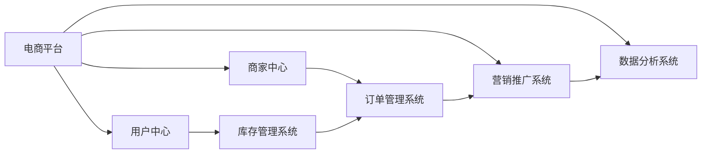

                 

# 建设电商生态系统的重要性

在数字化转型的浪潮中，电商平台已成为商家与消费者连接的桥梁。建设一个健康的电商生态系统，不仅能够提升用户体验，还能促进商家成长，推动整个行业的繁荣发展。本文将探讨建设电商生态系统的重要性，分析其核心概念和构建步骤，并通过具体案例展示其应用效果。

## 1. 背景介绍

### 1.1 问题由来
随着互联网的普及，消费者购物习惯发生了显著变化，从线下实体店转向线上电商平台成为主流趋势。电商平台不仅提供了便捷的购物体验，还整合了支付、物流、客服等多样化服务，成为了数字经济的重要组成部分。然而，电商平台的发展也面临诸多挑战，如流量争夺、用户体验、商品质量等问题。如何建设一个健康的电商生态系统，提升平台的用户粘性和商家满意度，是当前电商平台发展的关键。

### 1.2 问题核心关键点
建设电商生态系统的核心在于打造一个多方共赢的生态系统。主要关注点包括：

- **用户体验**：电商平台需要提供便捷、安全的购物体验，以吸引和留住用户。
- **商家成长**：为商家提供多元化的营销工具和稳定的流量来源，帮助其扩大业务。
- **商品丰富度**：增加商品种类和质量，满足消费者多样化需求。
- **物流配送**：高效、准确的物流系统，提升用户满意度。
- **技术支撑**：强大的技术平台，支持平台运营和管理。

## 2. 核心概念与联系

### 2.1 核心概念概述

构建电商生态系统涉及多个核心概念，包括：

- **电商平台**：提供商品展示、交易、支付、物流等服务的平台。
- **用户中心**：提供用户注册、登录、个人信息管理等功能。
- **商家中心**：提供商家入驻、商品管理、订单管理等功能。
- **库存管理系统**：实时监控商品库存，防止超卖和缺货。
- **订单管理系统**：处理订单生成、支付、配送、评价等环节。
- **营销推广系统**：支持线上线下多渠道的营销推广活动。
- **数据分析系统**：通过大数据分析用户行为和消费趋势，提供决策支持。

这些概念相互关联，共同构建了一个完整的电商生态系统。以下是这些概念间的联系：



### 2.2 概念间的关系

通过以上流程图示例，我们可以看出各个系统间的相互依赖关系：

- **电商平台**：是整个生态系统的中心，连接用户、商家、物流等多个系统。
- **用户中心**：提供用户注册、登录、个人信息管理等基础功能，是用户与电商平台互动的入口。
- **商家中心**：提供商家入驻、商品管理、订单管理等功能，为商家运营提供支持。
- **库存管理系统**：实时监控商品库存，确保订单及时发货。
- **订单管理系统**：处理订单生成、支付、配送、评价等环节，保障交易流畅进行。
- **营销推广系统**：通过线上线下渠道的营销推广，吸引用户流量，提升商家销售。
- **数据分析系统**：通过大数据分析用户行为和消费趋势，为平台决策提供依据。

这些系统的协同工作，构成了健康的电商生态系统，实现了用户、商家、平台的多方共赢。

## 3. 核心算法原理 & 具体操作步骤

### 3.1 算法原理概述

构建电商生态系统需要考虑多个方面，如用户管理、商品管理、订单处理、物流配送等。以下是核心算法的原理概述：

- **用户管理**：采用用户ID进行唯一标识，记录用户行为数据。
- **商品管理**：通过商品ID进行唯一标识，记录商品信息、库存状态等。
- **订单管理**：记录订单信息、支付状态、配送状态等。
- **物流配送**：实时监控物流状态，确保订单按时送达。

### 3.2 算法步骤详解

建设电商生态系统的核心步骤包括：

1. **需求分析**：明确电商平台的目标用户群体和商家需求，确定系统的功能和性能指标。
2. **系统设计**：设计系统架构，包括前端、后端、数据库等组件。
3. **开发实现**：根据设计方案，进行代码实现。
4. **测试上线**：进行系统测试，确保稳定运行，然后部署到生产环境。
5. **持续优化**：根据用户反馈和业务需求，不断优化系统性能和功能。

### 3.3 算法优缺点

建设电商生态系统的算法具有以下优点：

- **用户体验提升**：通过优化界面设计和功能，提升用户购物体验。
- **商家成长支持**：提供营销工具和流量支持，帮助商家扩大业务。
- **商品丰富度**：增加商品种类和质量，满足消费者多样化需求。
- **物流配送优化**：实时监控物流状态，提升配送效率。

同时，算法也存在一些缺点：

- **开发周期长**：系统设计复杂，开发周期较长。
- **维护成本高**：系统功能丰富，维护成本较高。
- **数据安全问题**：大量用户数据和交易数据需要安全保护。

### 3.4 算法应用领域

电商生态系统的构建已经在多个领域得到广泛应用，如：

- **零售行业**：电商平台如淘宝、京东等，提供商品展示、交易、支付、物流等一体化服务。
- **餐饮行业**：通过外卖平台，提供在线订餐、支付、配送等便捷服务。
- **旅游行业**：在线旅游平台如携程、去哪儿等，提供机票、酒店、景点预订等服务。
- **医疗健康**：健康电商平台如好大夫在线，提供医疗咨询、在线诊疗等服务。

## 4. 数学模型和公式 & 详细讲解 & 举例说明

### 4.1 数学模型构建

电商生态系统的构建涉及多个模块和系统，每个模块都可以用一个数学模型来描述。

以**订单管理系统**为例，其数学模型可以描述如下：

- **订单生成模型**：
$$
\text{Order} = (OrderID, UserID, ProductID, Quantity, Price, Status)
$$

- **订单处理模型**：
$$
\text{OrderProcessing} = (OrderID, Status, ProcessingTime)
$$

- **支付模型**：
$$
\text{Payment} = (OrderID, PaymentID, PaymentMethod, Amount)
$$

### 4.2 公式推导过程

以**订单生成模型**为例，推导其基本公式：

假设订单表包含订单ID、用户ID、商品ID、数量、价格、状态等多个字段。订单生成时，根据用户输入的数据和商品信息，计算订单总金额和状态：

$$
\text{TotalAmount} = \sum_{i=1}^{n} \text{Quantity}_i \times \text{Price}_i
$$

根据订单状态的不同，计算支付金额和时间：

$$
\text{PaymentAmount} = \text{TotalAmount} \times (1 - \text{Discount})
$$

$$
\text{PaymentTime} = \text{PaymentDate} - \text{OrderDate}
$$

### 4.3 案例分析与讲解

以**淘宝平台**为例，分析其电商生态系统的构建：

- **用户管理**：通过用户ID唯一标识每个用户，记录用户行为数据，如浏览历史、购物车、订单等。
- **商品管理**：通过商品ID唯一标识每个商品，记录商品信息、库存状态、促销信息等。
- **订单管理**：记录订单信息、支付状态、配送状态等，支持多种支付方式。
- **物流配送**：与物流公司合作，实时监控物流状态，确保订单按时送达。
- **数据分析**：通过大数据分析用户行为和消费趋势，提供决策支持，优化商品推荐、营销策略等。

通过这些模块和系统，淘宝平台构建了一个完善的电商生态系统，实现了用户、商家、物流的多方共赢。

## 5. 项目实践：代码实例和详细解释说明

### 5.1 开发环境搭建

为便于后续开发和测试，搭建一个电商平台的开发环境，包括：

1. **服务器搭建**：选择高性能服务器，安装操作系统、数据库、Web服务器等。
2. **开发工具安装**：安装Python、Java、Node.js等开发工具。
3. **框架选择**：选择流行的开发框架，如Spring Boot、Django等，快速开发电商应用。
4. **数据库配置**：选择MySQL、PostgreSQL等数据库，进行数据存储和管理。
5. **测试工具配置**：安装JUnit、Selenium等测试工具，确保代码质量。

### 5.2 源代码详细实现

以下是一个简单的电商平台的订单管理系统的代码实现，以Java为例：

```java
public class Order {
    private String orderID;
    private String userID;
    private String productID;
    private int quantity;
    private double price;
    private String status;

    // getters and setters
}
```

```java
public class OrderProcessing {
    private String orderID;
    private String status;
    private int processingTime;

    // getters and setters
}
```

### 5.3 代码解读与分析

**Order类**：
- 定义了订单的基本信息，包括订单ID、用户ID、商品ID、数量、价格、状态等字段。

**OrderProcessing类**：
- 记录订单处理的信息，包括订单ID、状态、处理时间等字段。

这些代码通过Java语言的面向对象设计，实现了订单的基本管理和处理。

### 5.4 运行结果展示

通过运行上述代码，可以创建和查询订单信息，验证订单生成和处理的基本流程。例如：

```java
Order order = new Order("123", "user1", "product1", 1, 100.0, "pending");
OrderProcessing orderProcessing = new OrderProcessing("123", "processing", 10);
System.out.println(order);
System.out.println(orderProcessing);
```

## 6. 实际应用场景

### 6.1 智能客服系统

智能客服系统是电商生态系统的关键组成部分，通过自然语言处理和机器学习技术，实现自动回答用户问题，提升用户体验。

具体应用场景包括：

- **问题分类**：对用户问题进行分类，如退货、换货、物流等。
- **知识库查询**：根据用户问题，查询知识库中的相关内容，生成回答。
- **对话管理**：通过对话管理算法，实现与用户的多轮对话。
- **评价反馈**：收集用户评价，优化智能客服系统。

例如，电商平台可以集成智能客服系统，提供24小时在线服务，提升用户满意度。

### 6.2 个性化推荐系统

个性化推荐系统根据用户行为和历史数据，推荐相关商品，提升用户购买意愿。

具体应用场景包括：

- **用户画像**：通过分析用户行为数据，构建用户画像，如年龄、性别、偏好等。
- **商品推荐**：根据用户画像，推荐相关商品，如同类商品、热销商品等。
- **评价反馈**：收集用户对推荐的评价，优化推荐算法。

例如，电商平台可以集成个性化推荐系统，提升用户购买率和转化率。

### 6.3 跨平台营销推广系统

跨平台营销推广系统通过多渠道的推广活动，吸引用户流量，提升商家销售额。

具体应用场景包括：

- **社交媒体推广**：在社交媒体平台上发布广告，吸引用户流量。
- **搜索引擎优化**：优化商品标题和描述，提高搜索引擎排名。
- **邮件营销**：发送邮件营销信息，提升用户购买意愿。
- **效果监控**：监控广告效果，优化广告投放策略。

例如，电商平台可以集成跨平台营销推广系统，提升商家销售额。

## 7. 工具和资源推荐

### 7.1 学习资源推荐

为帮助开发者系统掌握电商生态系统的构建方法，推荐以下学习资源：

1. **电商平台技术架构**：深入讲解电商平台的系统架构和设计思路，如《电商平台技术架构》一书。
2. **电商营销策略**：分析电商平台的营销策略和运营方法，如《电商运营实战》一书。
3. **大数据分析**：讲解大数据分析在电商生态系统中的应用，如《大数据在电商中的应用》一书。
4. **机器学习与NLP**：学习机器学习算法和自然语言处理技术，如《机器学习实战》、《自然语言处理综述》等。
5. **云平台资源**：介绍云平台在电商平台中的应用，如AWS、阿里云等。

### 7.2 开发工具推荐

为提高电商生态系统的开发效率，推荐以下开发工具：

1. **IDE**：选择如IntelliJ IDEA、Eclipse等IDE工具，提高开发效率。
2. **版本控制**：选择如Git、SVN等版本控制工具，管理代码版本。
3. **持续集成**：选择如Jenkins、Travis CI等持续集成工具，确保代码质量。
4. **容器化部署**：选择如Docker、Kubernetes等容器化工具，提升部署效率。
5. **数据管理**：选择如MySQL、PostgreSQL等数据库，管理数据。

### 7.3 相关论文推荐

为深入了解电商生态系统的最新研究成果，推荐以下相关论文：

1. **电商平台系统架构**：介绍电商平台的技术架构和设计思路，如《电商平台系统架构研究》。
2. **电商营销数据分析**：分析电商平台的营销策略和数据分析方法，如《电商营销数据分析》。
3. **个性化推荐算法**：讲解个性化推荐算法和应用案例，如《个性化推荐算法综述》。
4. **智能客服系统**：介绍智能客服系统的设计思路和应用场景，如《智能客服系统设计与实现》。

## 8. 总结：未来发展趋势与挑战

### 8.1 研究成果总结

构建电商生态系统在提高用户体验、支持商家成长等方面具有重要意义。其研究成果主要包括以下几个方面：

1. **系统架构设计**：设计完善的系统架构，实现各个模块之间的协同工作。
2. **数据管理**：实现高效的数据存储和管理，确保数据安全和实时性。
3. **智能客服**：通过自然语言处理技术，实现自动回答用户问题，提升用户体验。
4. **个性化推荐**：通过机器学习算法，实现个性化推荐，提升用户购买意愿。
5. **营销推广**：通过多渠道推广活动，吸引用户流量，提升商家销售额。

### 8.2 未来发展趋势

未来电商生态系统的发展趋势主要包括以下几个方面：

1. **技术创新**：引入前沿技术，如人工智能、大数据、区块链等，提升系统性能。
2. **用户体验优化**：通过界面设计、交互设计等方法，提升用户购物体验。
3. **商家成长支持**：提供更多的营销工具和流量支持，帮助商家扩大业务。
4. **商品丰富度提升**：增加商品种类和质量，满足消费者多样化需求。
5. **物流配送优化**：通过物流优化算法，提升配送效率，降低配送成本。

### 8.3 面临的挑战

在电商生态系统的建设过程中，还面临以下挑战：

1. **数据安全**：大量用户数据和交易数据需要安全保护。
2. **系统复杂性**：系统功能丰富，维护成本较高。
3. **技术迭代快**：技术发展迅速，需要不断更新系统架构和功能。
4. **用户需求多变**：用户需求多样，需要灵活调整系统功能。
5. **跨平台协作**：不同平台之间的协作需要协调，确保数据一致性。

### 8.4 研究展望

未来电商生态系统的研究将关注以下几个方向：

1. **智能算法**：引入智能算法，提升推荐系统和客服系统的准确性和效率。
2. **数据安全**：加强数据安全保护，确保用户隐私和数据安全。
3. **用户体验优化**：通过界面设计和交互设计，提升用户购物体验。
4. **多平台协作**：实现跨平台协作，提升用户使用便捷性。
5. **新业务拓展**：拓展新业务领域，如健康电商、社交电商等，扩大业务范围。

## 9. 附录：常见问题与解答

**Q1：如何提升电商平台的流量和用户粘性？**

A: 提升电商平台的流量和用户粘性需要从多个方面入手，包括：

1. **内容营销**：通过内容营销吸引用户流量，如发布优质商品介绍、优惠活动等。
2. **社交媒体推广**：在社交媒体平台上发布广告，吸引用户流量。
3. **用户体验优化**：通过界面设计和交互设计，提升用户购物体验。
4. **会员制度**：建立会员制度，吸引用户注册和复购。
5. **个性化推荐**：通过机器学习算法，实现个性化推荐，提升用户购买意愿。

**Q2：电商平台的订单管理系统如何实现高效的订单处理？**

A: 电商平台的订单管理系统可以通过以下方法实现高效的订单处理：

1. **分布式架构**：采用分布式架构，提升订单处理的并发性和稳定性。
2. **缓存机制**：采用缓存机制，减少数据库访问次数，提升订单处理速度。
3. **消息队列**：采用消息队列，异步处理订单，提升系统性能。
4. **负载均衡**：采用负载均衡技术，确保订单处理的高效性。
5. **异常处理**：采用异常处理机制，确保订单处理的稳定性。

**Q3：电商平台如何保障数据安全？**

A: 电商平台保障数据安全需要从多个方面入手，包括：

1. **数据加密**：采用数据加密技术，保护用户隐私和数据安全。
2. **访问控制**：采用访问控制技术，确保数据访问的安全性。
3. **数据备份**：定期备份数据，防止数据丢失。
4. **安全审计**：定期进行安全审计，发现和修复安全隐患。
5. **应急预案**：制定应急预案，应对数据安全事件。

**Q4：电商平台如何支持商家的成长？**

A: 电商平台支持商家的成长需要从多个方面入手，包括：

1. **营销推广**：提供多种营销推广工具，帮助商家提升销量。
2. **流量支持**：提供稳定的流量支持，提升商家曝光率。
3. **技术支持**：提供技术支持，帮助商家优化店铺和商品页面。
4. **培训支持**：提供培训支持，提升商家运营能力。
5. **供应链支持**：提供供应链管理工具，帮助商家优化库存和物流。

**Q5：电商平台如何优化物流配送？**

A: 电商平台优化物流配送需要从多个方面入手，包括：

1. **物流合作伙伴**：选择可靠的物流合作伙伴，确保物流配送的及时性和准确性。
2. **物流管理平台**：建设物流管理平台，实时监控物流状态。
3. **配送优化算法**：采用配送优化算法，提升配送效率。
4. **用户评价反馈**：收集用户评价，优化物流配送服务。
5. **成本控制**：控制物流配送成本，提升配送服务的性价比。

---

作者：禅与计算机程序设计艺术 / Zen and the Art of Computer Programming

