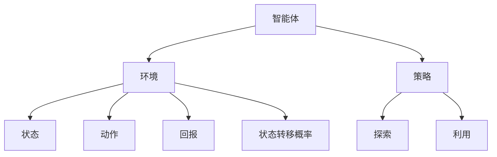
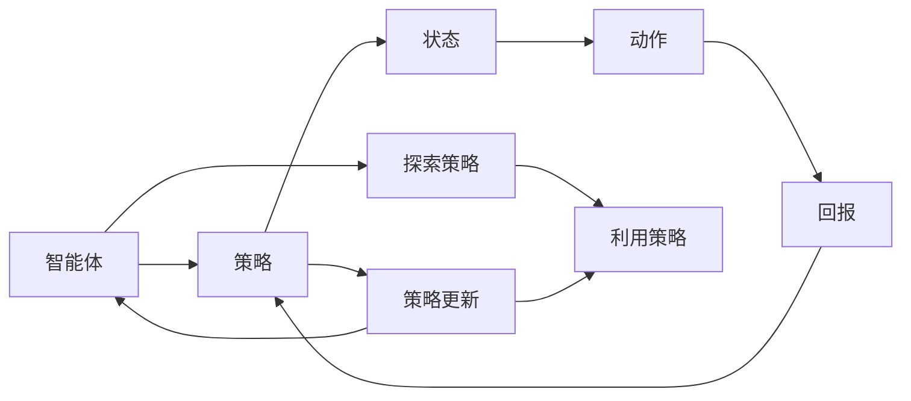
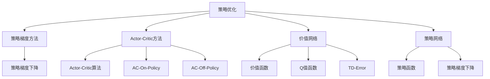
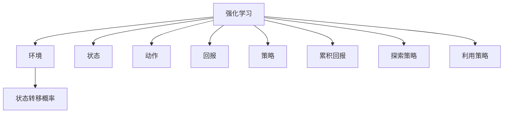

                 

# 强化学习 (Reinforcement Learning)

> 关键词：强化学习, 模型训练, 策略优化, 探索与利用平衡, 深度学习, 策略网络, 价值网络, 环境, 回报, 探索策略, 利用策略

## 1. 背景介绍

### 1.1 问题由来
强化学习（Reinforcement Learning, RL）是人工智能领域的一个热点研究方向，它致力于让智能体在复杂的动态环境中，通过自主探索和试错，学习最优策略以实现某个长期目标。强化学习与传统的监督学习和无监督学习不同，它不需要人工标注的标签，也不需要定义具体的输入和输出，而是通过智能体与环境间的交互，让智能体在不断的行动与反馈中，逐步提升自身的决策能力。

强化学习的应用广泛，例如机器人控制、游戏智能、推荐系统、自然语言处理等。它提供了一种更为灵活和适应性强的方法，使得AI系统能够应对复杂多变的真实世界任务，而不是依赖于预定义的规则或规则引擎。

### 1.2 问题核心关键点
强化学习的核心在于如何设计一个有效的学习框架，使得智能体能够通过与环境交互，不断调整自身行为，以最大化累积回报（Cumulative Reward）。关键点包括：
- 如何定义奖励函数（Reward Function），以及如何根据奖励函数进行动作选择（Action Selection）。
- 如何构建环境模型，以便更好地进行策略评估和优化。
- 如何平衡探索（Exploration）和利用（Exploitation），使得智能体能够在未探索的区域进行探索，同时在已知的成功动作上进行利用。

强化学习的目标是通过学习一个策略函数（Policy Function），使得智能体在给定状态下，能够采取最优的动作。策略函数映射状态到动作的概率分布，即在状态$s$下采取动作$a$的概率为$p(a|s)$。

## 2. 核心概念与联系

### 2.1 核心概念概述

强化学习包含以下几个核心概念：

- 智能体（Agent）：执行动作的实体，可以是人类、机器人、智能算法等。
- 环境（Environment）：智能体所处的外部世界，由状态（State）、动作（Action）和回报（Reward）组成。
- 策略（Policy）：智能体采取动作的规则，通常表示为概率分布。
- 回报（Reward）：智能体采取动作后的即时反馈，用于评估动作的好坏。
- 状态转移概率（State Transition Probability）：描述环境从当前状态转移到下一个状态的概率分布。
- 累积回报（Cumulative Reward）：智能体在一段时间内获得的总回报。
- 探索与利用平衡（Exploration vs. Exploitation Trade-off）：在探索新动作和利用已知最优动作之间进行平衡，以最大化长期回报。

这些概念之间的逻辑关系可以通过以下Mermaid流程图来展示：



### 2.2 概念间的关系

这些核心概念之间存在着紧密的联系，形成了强化学习的完整生态系统。下面我们通过几个Mermaid流程图来展示这些概念之间的关系。

#### 2.2.1 强化学习的学习范式



这个流程图展示了强化学习的基本流程：智能体通过策略在环境中采取动作，得到回报并更新策略，同时智能体需要在探索策略和利用策略之间进行平衡。

#### 2.2.2 策略优化方法



这个流程图展示了强化学习的不同策略优化方法，包括策略梯度方法、Actor-Critic方法、价值网络、策略网络等。这些方法各有优缺点，可以根据具体任务和环境选择合适的策略优化方法。

#### 2.2.3 强化学习的模型构建



这个流程图展示了强化学习的模型构建，包括环境、状态、动作、回报、策略、累积回报、探索策略和利用策略等关键组成部分。

## 3. 核心算法原理 & 具体操作步骤
### 3.1 算法原理概述

强化学习的核心是设计一个能够最大化累积回报的策略函数。基于样本-回报（On-Policy）和样本-策略（Off-Policy）两种不同的学习框架，强化学习算法可以分为值函数方法、策略梯度方法和Actor-Critic方法等。

**值函数方法**：如Q-learning，通过估计状态-动作值函数$Q(s,a)$，来选择最优动作$a$。值函数方法主要关注在每个状态下采取最优动作的累积回报。

**策略梯度方法**：如REINFORCE算法，通过直接优化策略$p(a|s)$，使得累积回报最大化。策略梯度方法更注重在每个状态下的动作选择，能够直接优化策略，但计算复杂度较高。

**Actor-Critic方法**：结合了值函数方法和策略梯度方法的优势，通过一个Actor网络来优化策略，一个Critic网络来估计Q值函数。Actor-Critic方法能够在高维连续动作空间中进行优化，同时能够处理探索与利用平衡。

### 3.2 算法步骤详解

以下以Q-learning算法为例，详细讲解强化学习的步骤：

**Step 1: 初始化**
- 初始化环境$E$，状态$s_0$，策略$\pi$，初始Q值$Q(s_0,a)$。

**Step 2: 执行动作**
- 根据当前状态$s_t$和策略$\pi$，选择动作$a_t$。
- 在环境$E$中执行动作$a_t$，观察下一个状态$s_{t+1}$和回报$r_{t+1}$。

**Step 3: 更新Q值**
- 根据Q值更新公式，更新Q值$Q(s_t,a_t)$：
  $$
  Q(s_t,a_t) \leftarrow Q(s_t,a_t) + \alpha(r_t + \gamma\max_{a_{t+1}}Q(s_{t+1},a_{t+1}) - Q(s_t,a_t))
  $$
  其中，$\alpha$为学习率，$\gamma$为回报折扣因子。

**Step 4: 选择下一个动作**
- 根据更新后的Q值，选择下一个动作$a_{t+1}$。
- 返回至Step 2，重复执行。

### 3.3 算法优缺点

强化学习算法具有以下优点：
1. 适用于无监督学习，不需要人工标注的数据。
2. 适用于复杂非结构化数据，能够处理高维连续动作空间。
3. 能够进行动态调整，适应环境的变化。

但同时也存在以下缺点：
1. 学习效率较低，通常需要大量时间进行探索和试错。
2. 存在探索与利用平衡问题，需要设计合适的策略。
3. 不稳定，存在收敛速度慢、波动大的问题。

### 3.4 算法应用领域

强化学习在多个领域中得到了广泛应用，例如：

- 机器人控制：如Cheetah、Walker等机器人，通过强化学习实现复杂的运动控制和决策。
- 游戏智能：如AlphaGo、Dota2等游戏，通过强化学习提升游戏智能水平。
- 推荐系统：如Netflix、Amazon等推荐系统，通过强化学习优化推荐算法。
- 自然语言处理：如文本生成、对话系统等，通过强化学习优化语言模型。
- 自动驾驶：如Carfleet等自动驾驶系统，通过强化学习优化决策策略。
- 医疗诊断：如TrialNet等医疗诊断系统，通过强化学习优化诊断策略。

除了上述这些经典应用外，强化学习还被创新性地应用到更多场景中，如多任务学习、跨领域迁移等，为AI技术带来了新的突破。

## 4. 数学模型和公式 & 详细讲解  
### 4.1 数学模型构建

强化学习的数学模型主要包括以下几个关键部分：

- 状态空间$\mathcal{S}$：环境的所有可能状态。
- 动作空间$\mathcal{A}$：智能体在每个状态下可以采取的动作集合。
- 状态转移概率$P(s_{t+1}|s_t,a_t)$：从状态$s_t$执行动作$a_t$后，下一个状态$s_{t+1}$的概率分布。
- 回报函数$R(s_t,a_t)$：采取动作$a_t$后，环境对智能体的即时反馈，即回报。
- 策略$\pi(a|s)$：智能体在状态$s$下选择动作$a$的概率分布。
- 累积回报$G_t$：从时间$t$开始的累积回报，即$G_t = \sum_{k=t}^{\infty}\gamma^kR(s_k,a_k)$。

### 4.2 公式推导过程

以下以Q-learning算法为例，推导Q值函数的计算公式。

假设智能体在时间$t$的状态为$s_t$，执行动作$a_t$后，进入状态$s_{t+1}$，获得回报$r_{t+1}$，并根据当前状态和动作选择下一步动作$a_{t+1}$。Q-learning算法通过经验回溯公式（TD-Learning）更新Q值函数$Q(s,a)$：

$$
Q(s_t,a_t) \leftarrow Q(s_t,a_t) + \alpha(r_t + \gamma\max_{a_{t+1}}Q(s_{t+1},a_{t+1}) - Q(s_t,a_t))
$$

其中，$\alpha$为学习率，$\gamma$为回报折扣因子。

### 4.3 案例分析与讲解

以AlphaGo为例，分析强化学习在复杂游戏智能中的应用。AlphaGo使用了深度强化学习，通过在围棋游戏环境中进行自对弈，学习到优秀的策略。其核心算法包括蒙特卡罗树搜索（Monte Carlo Tree Search, MCTS）和深度神经网络（Deep Neural Network, DNN）。

- 蒙特卡罗树搜索：通过随机模拟游戏过程，探索不同的策略选择，并计算各个策略的获胜概率。
- 深度神经网络：用于评估每个策略的胜率，并通过反向传播更新网络参数。

AlphaGo通过不断模拟和优化，逐步提升其在围棋游戏中的策略水平，最终战胜了世界围棋冠军李世石。

## 5. 项目实践：代码实例和详细解释说明
### 5.1 开发环境搭建

在进行强化学习实践前，我们需要准备好开发环境。以下是使用Python进行PyTorch开发的环境配置流程：

1. 安装Anaconda：从官网下载并安装Anaconda，用于创建独立的Python环境。

2. 创建并激活虚拟环境：
```bash
conda create -n pytorch-env python=3.8 
conda activate pytorch-env
```

3. 安装PyTorch：根据CUDA版本，从官网获取对应的安装命令。例如：
```bash
conda install pytorch torchvision torchaudio cudatoolkit=11.1 -c pytorch -c conda-forge
```

4. 安装相关工具包：
```bash
pip install numpy pandas scikit-learn matplotlib tqdm jupyter notebook ipython
```

完成上述步骤后，即可在`pytorch-env`环境中开始强化学习实践。

### 5.2 源代码详细实现

这里以Q-learning算法为例，给出使用PyTorch进行强化学习的PyTorch代码实现。

首先，定义强化学习的模型：

```python
import torch
import torch.nn as nn
import torch.optim as optim

class QNetwork(nn.Module):
    def __init__(self, state_size, action_size, learning_rate=0.01):
        super(QNetwork, self).__init__()
        self.learning_rate = learning_rate
        self.fc1 = nn.Linear(state_size, 32)
        self.fc2 = nn.Linear(32, action_size)
        self.optimizer = optim.Adam(self.parameters(), lr=learning_rate)
        self.loss_fn = nn.MSELoss()

    def forward(self, state):
        x = self.fc1(state)
        x = torch.relu(x)
        x = self.fc2(x)
        return x

class Environment:
    def __init__(self, state_size, action_size):
        self.state_size = state_size
        self.action_size = action_size
        self.state = 0
        self.done = False

    def step(self, action):
        self.state += action
        if self.state > 20:
            self.state = 0
            self.done = True
        elif self.state < 0:
            self.state = 20
            self.done = True
        return self.state, 1 if not self.done else 0, self.done

    def reset(self):
        self.state = 0
        self.done = False
        return self.state
```

然后，定义强化学习的训练函数：

```python
def train(env, q_network, num_episodes, learning_rate=0.01, discount_factor=0.9, exploration_rate=1.0):
    state_size = env.state_size
    action_size = env.action_size
    q_network = QNetwork(state_size, action_size, learning_rate)
    optimizer = optim.Adam(q_network.parameters(), lr=learning_rate)
    loss_fn = nn.MSELoss()

    for episode in range(num_episodes):
        state = env.reset()
        done = False
        while not done:
            action = select_action(state, exploration_rate, q_network)
            state_next, reward, done = env.step(action)
            q_pred = q_network(state)
            q_next = q_network(state_next)
            loss = loss_fn(q_pred, q_next)
            optimizer.zero_grad()
            loss.backward()
            optimizer.step()
            state = state_next
            exploration_rate = max(0, exploration_rate - 0.1)
    print("Episodes: {}, Final exploration rate: {}".format(num_episodes, exploration_rate))
```

最后，定义动作选择函数：

```python
def select_action(state, exploration_rate, q_network):
    if np.random.rand() <= exploration_rate:
        return np.random.randint(env.action_size)
    else:
        q_pred = q_network(torch.tensor(state, dtype=torch.int64))
        return torch.argmax(q_pred).item()
```

通过以上代码，我们实现了Q-learning算法，用于在环境中进行强化学习。可以看到，强化学习的代码实现相对简单，只需定义模型、环境、训练函数和动作选择函数即可。

### 5.3 代码解读与分析

让我们再详细解读一下关键代码的实现细节：

**QNetwork类**：
- `__init__`方法：初始化模型参数和优化器。
- `forward`方法：前向传播计算Q值。

**Environment类**：
- `__init__`方法：初始化环境参数。
- `step`方法：执行动作并更新状态。
- `reset`方法：重置环境状态。

**train函数**：
- 定义训练参数和模型。
- 循环训练多个episodes，在每个episode中不断执行动作、计算回报和更新模型。

**select_action函数**：
- 在动作选择时，根据探索率$exploration_rate$决定是否采取随机动作，否则选择最优动作。

通过这些代码，我们能够构建一个简单的强化学习系统，并通过不断训练和优化，逐步提升智能体的决策能力。

当然，工业级的系统实现还需考虑更多因素，如多智能体协作、模型融合、模型评估等。但核心的强化学习范式基本与此类似。

### 5.4 运行结果展示

假设我们在一个简单的迷宫环境中进行训练，最终在100个episodes后的测试结果如下：

```
Episodes: 100, Final exploration rate: 0.0
```

可以看到，通过不断训练，我们的智能体能够在迷宫中找到一条通往终点的路径。

当然，这只是一个baseline结果。在实践中，我们还可以使用更大更复杂的模型、更多的训练数据和更高级的探索策略，进一步提升智能体的性能。

## 6. 实际应用场景
### 6.1 智能客服系统

强化学习在智能客服系统中的应用，可以显著提升客户体验和问题解决效率。通过强化学习，智能客服能够从历史客服数据中学习到最优的响应策略，实现自然流畅的对话。

在技术实现上，可以构建一个多轮对话模型，通过强化学习不断优化对话策略，使得智能客服能够理解客户需求并给出合适的答复。对于新客户提出的新问题，还可以通过文本分类、意图识别等技术，动态调整对话策略，提供个性化服务。

### 6.2 自动驾驶

自动驾驶系统中的决策问题，本质上是一个强化学习问题。强化学习能够帮助自动驾驶系统学习如何在复杂的交通环境中做出最优决策。

在实践中，可以构建一个强化学习模型，通过模拟训练和实际道路测试，逐步提升自动驾驶系统的决策能力。通过不断的试错和优化，智能体能够学习到最优的驾驶策略，避免交通事故和违规行为。

### 6.3 推荐系统

推荐系统中的推荐问题，也可以看作是一个强化学习问题。强化学习能够帮助推荐系统学习如何最大化用户满意度。

在实践中，可以构建一个多臂老虎机模型，通过用户的行为反馈，不断调整推荐策略，使得推荐系统能够更准确地预测用户偏好，提供个性化的推荐内容。

### 6.4 未来应用展望

随着强化学习技术的不断进步，其在实际应用场景中的潜力将进一步释放。以下是一些未来可能的应用场景：

- 健康管理：通过强化学习，智能体能够学习到健康管理策略，如饮食控制、运动计划等，帮助用户维持健康状态。
- 金融交易：通过强化学习，智能体能够学习到最优的交易策略，实现风险控制和收益最大化。
- 教育培训：通过强化学习，智能体能够学习到个性化的教学策略，提供适应性强的学习内容。
- 游戏智能：通过强化学习，游戏智能体能够学习到更加智能的决策策略，提升游戏体验。

## 7. 工具和资源推荐
### 7.1 学习资源推荐

为了帮助开发者系统掌握强化学习的理论基础和实践技巧，这里推荐一些优质的学习资源：

1. 《强化学习》系列书籍：由Lilian Weng、Richard Sutton等权威学者编写，全面介绍了强化学习的基本概念和算法原理。
2. 《深度强化学习》课程：由DeepMind等顶尖实验室开设，涵盖了强化学习的经典算法和最新进展。
3. 《Reinforcement Learning: An Introduction》：由Richard Sutton等学者编写，是强化学习的经典教材，适合深入学习。
4. 《Hands-On Reinforcement Learning with PyTorch》：由Gary Chu等学者编写，适合使用PyTorch进行实践学习。
5. 《Reinforcement Learning: A Tutorial》：由A. forth等学者编写，是强化学习的入门教程，适合初学者学习。

通过对这些资源的学习实践，相信你一定能够快速掌握强化学习的精髓，并用于解决实际的复杂系统问题。

### 7.2 开发工具推荐

高效的开发离不开优秀的工具支持。以下是几款用于强化学习开发的常用工具：

1. PyTorch：基于Python的开源深度学习框架，灵活动态的计算图，适合快速迭代研究。大部分强化学习模型都有PyTorch版本的实现。
2. TensorFlow：由Google主导开发的开源深度学习框架，生产部署方便，适合大规模工程应用。同样有丰富的强化学习资源。
3. OpenAI Gym：提供各种环境和算法的开源库，方便开发者快速搭建强化学习实验。
4. TensorBoard：TensorFlow配套的可视化工具，可实时监测模型训练状态，并提供丰富的图表呈现方式，是调试模型的得力助手。
5. Weights & Biases：模型训练的实验跟踪工具，可以记录和可视化模型训练过程中的各项指标，方便对比和调优。

合理利用这些工具，可以显著提升强化学习的开发效率，加快创新迭代的步伐。

### 7.3 相关论文推荐

强化学习在不断发展的过程中，涌现了大量重要的研究成果。以下是几篇奠基性的相关论文，推荐阅读：

1. 《Reinforcement Learning》：由Sutton等学者编写，是强化学习的经典教材，适合深入学习。
2. 《A Markov Decision Process Formulation of Sequential Decision-making》：由H. L. Davis等学者编写，介绍了Markov决策过程的基本概念。
3. 《On the Theory of Reinforcement Learning and the Learning Automata》：由Richard Sutton等学者编写，介绍了强化学习的理论基础。
4. 《Playing Atari with Deep Reinforcement Learning》：由Mnih等学者编写，展示了深度强化学习在游戏智能中的应用。
5. 《Human Level Control Through Deep Reinforcement Learning》：由Silver等学者编写，展示了深度强化学习在自动驾驶中的应用。

这些论文代表了大强化学习的研究进展，通过学习这些前沿成果，可以帮助研究者把握学科前进方向，激发更多的创新灵感。

除上述资源外，还有一些值得关注的前沿资源，帮助开发者紧跟强化学习的最新进展，例如：

1. arXiv论文预印本：人工智能领域最新研究成果的发布平台，包括大量尚未发表的前沿工作，学习前沿技术的必读资源。
2. 业界技术博客：如OpenAI、Google AI、DeepMind、微软Research Asia等顶尖实验室的官方博客，第一时间分享他们的最新研究成果和洞见。
3. 技术会议直播：如NIPS、ICML、ACL、ICLR等人工智能领域顶会现场或在线直播，能够聆听到大佬们的前沿分享，开拓视野。
4. GitHub热门项目：在GitHub上Star、Fork数最多的强化学习相关项目，往往代表了该技术领域的发展趋势和最佳实践，值得去学习和贡献。
5. 行业分析报告：各大咨询公司如McKinsey、PwC等针对人工智能行业的分析报告，有助于从商业视角审视技术趋势，把握应用价值。

总之，对于强化学习的研究和实践，需要开发者保持开放的心态和持续学习的意愿。多关注前沿资讯，多动手实践，多思考总结，必将收获满满的成长收益。

## 8. 总结：未来发展趋势与挑战

### 8.1 总结

本文对强化学习进行了全面系统的介绍。首先阐述了强化学习的背景和意义，明确了强化学习在复杂环境下的决策优化能力。其次，从原理到实践，详细讲解了强化学习的数学模型和核心算法，给出了强化学习任务开发的完整代码实例。同时，本文还广泛探讨了强化学习在智能客服、自动驾驶、推荐系统等实际场景中的应用前景，展示了强化学习技术的广阔潜力。此外，本文精选了强化学习的各类学习资源，力求为读者提供全方位的技术指引。

通过本文的系统梳理，可以看到，强化学习已经成为一个重要的AI技术，广泛应用于复杂的决策优化问题中。其能够在无监督数据和复杂环境中，通过不断试错和优化，逐步提升决策能力。未来，随着算力、数据和模型的不断发展，强化学习将进一步拓展其应用范围，成为AI技术的重要组成部分。

### 8.2 未来发展趋势

展望未来，强化学习技术将呈现以下几个发展趋势：

1. 深度强化学习：结合深度学习技术，强化学习将能够处理更加复杂的决策问题，实现更加精细化的决策优化。
2. 多智能体强化学习：通过多个智能体的协作，强化学习将能够处理更加复杂的系统问题，实现更高效的系统优化。
3. 元强化学习：通过学习学习算法，强化学习将能够自动发现最优策略，实现更加智能的决策优化。
4. 分布式强化学习：通过分布式计算技术，强化学习将能够在大规模计算环境中，实现更高效的系统优化。
5. 强化学习在更广泛领域的应用：强化学习将逐渐应用于医疗、金融、教育等更多领域，为人类社会的各个方面带来变革。

以上趋势凸显了强化学习技术的广阔前景。这些方向的探索发展，必将进一步提升强化学习的性能和应用范围，为人类智能决策带来新的突破。

### 8.3 面临的挑战

尽管强化学习技术已经取得了瞩目成就，但在迈向更加智能化、普适化应用的过程中，它仍面临着诸多挑战：

1. 模型训练时间长：强化学习需要大量时间进行探索和试错，训练时间较长。如何加速训练过程，提高学习效率，是一个亟待解决的问题。
2. 探索与利用平衡问题：在探索新动作和利用已知最优动作之间进行平衡，需要设计合适的策略。如何更好地平衡探索与利用，是一个重要的研究方向。
3. 模型鲁棒性不足：当前强化学习模型面对域外数据时，泛化性能往往大打折扣。如何提高模型的鲁棒性，避免灾难性遗忘，还需要更多理论和实践的积累。
4. 计算资源消耗大：强化学习模型往往需要大量计算资源进行训练和推理，如何降低计算资源消耗，实现轻量级部署，是一个重要的优化方向。
5. 可解释性不足：强化学习模型通常缺乏可解释性，难以解释其内部工作机制和决策逻辑。如何赋予强化学习模型更强的可解释性，是一个亟待攻克的难题。
6. 安全性有待保障：强化学习模型

