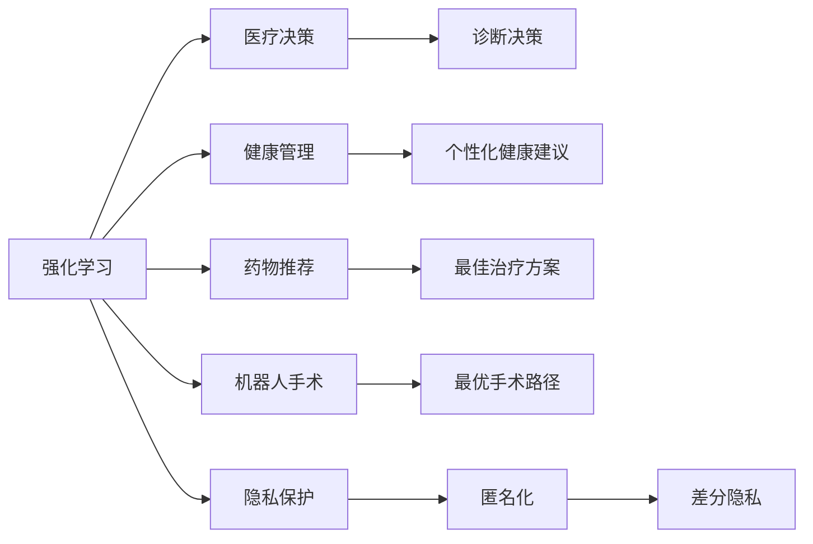

                 

# 强化学习Reinforcement Learning在医疗健康领域的应用探索

> 关键词：强化学习,医疗健康,健康管理,医疗决策,机器人手术,药物推荐,隐私保护

## 1. 背景介绍

### 1.1 问题由来
近年来，随着人工智能技术的迅猛发展，强化学习（Reinforcement Learning, RL）作为人工智能中的一个重要分支，在医疗健康领域的应用研究受到了广泛的关注。强化学习通过智能体与环境的交互，学习最优策略，以实现某种目标，这一特性在医疗健康领域有着广泛的应用前景。

### 1.2 问题核心关键点
强化学习在医疗健康领域的应用涉及多个核心问题，如如何构建精确的模拟环境、如何设计有效的奖励函数、如何处理复杂的医疗数据等。这些问题相互交织，形成了一个复杂的系统工程。因此，本文将对这些问题进行详细探讨，以期对强化学习在医疗健康领域的应用提供更全面的指导。

### 1.3 问题研究意义
强化学习在医疗健康领域的应用研究具有重要的现实意义：

1. **提升医疗决策的精确性**：通过智能算法，强化学习可以优化医疗决策过程，减少人为错误，提高诊疗质量。
2. **降低医疗成本**：强化学习可以在医疗资源配置、药物推荐等方面提供优化方案，降低医疗成本。
3. **改善健康管理**：强化学习可以用于个性化健康管理，提供个性化的治疗方案和健康建议。
4. **推动医疗技术创新**：强化学习可以应用于机器人手术、影像诊断等医疗技术领域，推动技术进步。
5. **保护患者隐私**：强化学习可以在数据保护、隐私保护方面提供解决方案，确保医疗数据的安全性。

## 2. 核心概念与联系

### 2.1 核心概念概述

在医疗健康领域，强化学习主要涉及以下几个核心概念：

- **强化学习（Reinforcement Learning, RL）**：一种通过智能体与环境的交互，学习最优策略的机器学习方法。强化学习通过智能体在特定环境中采取行动，根据环境的反馈调整行动策略，最终实现某种目标。

- **医疗决策（Medical Decision Making, MDM）**：医生基于患者的病历、检验结果等数据，综合自身经验，制定诊断和治疗方案的过程。强化学习可以辅助医生，通过模拟环境中的多次决策试验，学习最优的决策策略。

- **健康管理（Health Management）**：通过智能算法，帮助患者进行健康监测、饮食管理、运动指导等，以实现健康的长期管理。强化学习可以根据患者的健康数据，提供个性化的健康建议。

- **药物推荐（Drug Recommendation）**：基于患者的病情和历史用药数据，强化学习可以推荐最合适的药物和治疗方案，提高治疗效果。

- **机器人手术（Robot-Assisted Surgery）**：机器人手术系统在医疗中广泛应用，强化学习可以优化手术路径、提高手术精度。

- **隐私保护（Privacy Protection）**：在医疗数据处理中，强化学习可以用于匿名化、差分隐私等技术，保护患者隐私。

这些核心概念之间的联系通过以下Mermaid流程图展示：



这个流程图展示出强化学习在不同医疗健康领域的应用路径。

### 2.2 概念间的关系

这些核心概念之间存在紧密的联系，形成了一个复杂的系统工程。以下通过几个Mermaid流程图来展示这些概念之间的逻辑关系：

#### 2.2.1 强化学习在医疗决策中的应用


这个流程图展示了强化学习在医疗决策中的应用流程。

#### 2.2.2 强化学习在药物推荐中的应用


这个流程图展示了强化学习在药物推荐中的应用流程。

#### 2.2.3 强化学习在机器人手术中的应用


这个流程图展示了强化学习在机器人手术中的应用流程。

#### 2.2.4 强化学习在健康管理中的应用


这个流程图展示了强化学习在健康管理中的应用流程。

## 3. 核心算法原理 & 具体操作步骤
### 3.1 算法原理概述

强化学习的核心原理是通过智能体与环境的交互，学习最优的策略。在医疗健康领域，智能体通常是医生或机器人手术系统，环境是患者的病历数据、手术场景等。强化学习通过不断的试验和调整，学习到最优的决策策略。

强化学习的核心要素包括状态（State）、行动（Action）、奖励（Reward）、策略（Policy）和值函数（Value Function）。状态表示当前环境的状态，行动表示智能体采取的策略，奖励表示智能体的行为对环境的反馈，策略表示智能体在给定状态下采取行动的概率分布，值函数表示智能体在特定状态下的累积奖励的期望值。

### 3.2 算法步骤详解

基于强化学习在医疗健康领域的应用，以下是具体的算法步骤：

#### 3.2.1 数据收集和预处理

- **数据收集**：收集患者的病历数据、手术数据、健康管理数据等，作为训练数据。
- **数据预处理**：清洗数据，去除噪声，标准化数据格式。

#### 3.2.2 环境模拟

- **构建环境**：构建模拟环境，模拟患者的病情变化、手术操作过程、健康监测等。
- **状态表示**：定义状态，如患者的病历数据、手术步骤、健康指标等。

#### 3.2.3 策略设计

- **行动空间**：定义智能体的行动空间，如医生的诊断和治疗方案、手术路径等。
- **策略学习**：设计强化学习策略，如Q-Learning、Deep Q-Network（DQN）等，通过在模拟环境中训练，学习最优策略。

#### 3.2.4 奖励设计

- **奖励函数**：设计奖励函数，奖励智能体的行为对环境的正面影响，如诊断准确率、手术成功率等。
- **奖励反馈**：在每次智能体采取行动后，根据环境的反馈，更新奖励值。

#### 3.2.5 值函数学习

- **值函数定义**：定义值函数，如状态值函数（Q值）、优势值函数（A值）等。
- **值函数优化**：通过策略更新和值函数学习，不断优化智能体的策略。

#### 3.2.6 模型部署

- **模型评估**：在训练完成后，评估模型性能，如诊断准确率、手术成功率等。
- **模型部署**：将模型部署到实际医疗环境中，辅助医生或机器人手术系统进行决策。

### 3.3 算法优缺点

强化学习在医疗健康领域的应用具有以下优点：

- **数据驱动**：强化学习通过数据驱动的方式，学习最优的决策策略。
- **自适应**：强化学习可以根据环境变化，自适应地调整策略。
- **全局最优**：强化学习可以探索全局最优策略，避免局部最优。

然而，强化学习在医疗健康领域也存在一些局限性：

- **训练复杂**：强化学习需要大量数据和计算资源进行训练，医疗数据本身难以获取。
- **模型复杂**：强化学习模型通常较为复杂，需要专业知识进行设计和优化。
- **解释性差**：强化学习模型通常是黑盒系统，难以解释其内部工作机制。

### 3.4 算法应用领域

强化学习在医疗健康领域具有广泛的应用前景，主要包括以下几个方面：

- **医疗决策优化**：在诊断和治疗决策方面，强化学习可以提供更准确的诊断和治疗方案。
- **健康管理智能化**：在健康监测、饮食管理等方面，强化学习可以提供个性化的健康建议。
- **机器人手术**：在手术路径规划、手术操作等方面，强化学习可以提高手术精度和效率。
- **药物推荐**：在药物推荐、治疗方案选择等方面，强化学习可以提供更合适的推荐方案。

## 4. 数学模型和公式 & 详细讲解  
### 4.1 数学模型构建

在医疗健康领域，强化学习的数学模型可以表示为：

$$
\max_{\pi} \mathbb{E}_{s_t \sim \pi}[R(s_t,a_t)] = \max_{\pi} \sum_{t=0}^{\infty} \gamma^t r(s_t,a_t)
$$

其中，$R$为奖励函数，$\gamma$为折扣因子，$\pi$为策略函数。

### 4.2 公式推导过程

以下推导强化学习在医疗决策中的应用公式：

假设患者的数据状态表示为$s_t$，医生采取的行动表示为$a_t$，医生的策略为$\pi(a_t|s_t)$，环境的状态转移概率为$P(s_{t+1}|s_t,a_t)$，奖励函数为$R(s_t,a_t)$，医生的目标是在整个治疗过程中获得最大的累积奖励。

根据贝尔曼方程，可以得到：

$$
Q(s_t,a_t) = \mathbb{E}[R(s_t,a_t) + \gamma Q(s_{t+1},a_{t+1}) | s_t,a_t]
$$

其中，$Q(s_t,a_t)$为状态-行动的值函数，表示在状态$s_t$下采取行动$a_t$后的期望奖励。

### 4.3 案例分析与讲解

以下以一个简单的例子来说明强化学习在医疗决策中的应用：

假设患者病情有三种可能，分别为“病情轻微”、“病情中等”、“病情严重”，医生可以采取的行动有“服用药物A”、“服用药物B”、“观察治疗”。奖励函数设计为：

- “病情轻微”时，医生采取“观察治疗”的奖励为$R_1$，“服用药物A”的奖励为$R_2$，“服用药物B”的奖励为$R_3$。
- “病情中等”时，医生采取“服用药物A”的奖励为$R_4$，“服用药物B”的奖励为$R_5$。
- “病情严重”时，医生采取“服用药物A”的奖励为$R_6$。

状态转移概率为：

- “病情轻微”变为“病情中等”的概率为$p_1$，变为“病情严重”的概率为$p_2$。
- “病情中等”变为“病情轻微”的概率为$p_3$，变为“病情严重”的概率为$p_4$。
- “病情严重”变为“病情轻微”的概率为$p_5$，变为“病情中等”的概率为$p_6$。

通过构建这个模型，医生可以在模拟环境中通过不断尝试不同的策略，学习到最优的诊断和治疗方案。

## 5. 项目实践：代码实例和详细解释说明
### 5.1 开发环境搭建

在进行强化学习在医疗健康领域的应用实践前，需要先准备好开发环境。以下是使用Python进行TensorFlow进行强化学习开发的环境配置流程：

1. 安装Anaconda：从官网下载并安装Anaconda，用于创建独立的Python环境。

2. 创建并激活虚拟环境：
```bash
conda create -n tf-env python=3.8 
conda activate tf-env
```

3. 安装TensorFlow：根据CUDA版本，从官网获取对应的安装命令。例如：
```bash
conda install tensorflow tensorflow-gpu=2.8.0 -c conda-forge
```

4. 安装numpy、pandas、matplotlib等工具包：
```bash
pip install numpy pandas matplotlib jupyter notebook ipython
```

5. 安装Reinforcement Learning库：
```bash
pip install stable-baselines3
```

完成上述步骤后，即可在`tf-env`环境中开始强化学习在医疗健康领域的应用实践。

### 5.2 源代码详细实现

以下是使用TensorFlow实现强化学习在医疗决策中的应用代码示例：

```python
import tensorflow as tf
from stable_baselines3 import A2C
from stable_baselines3.common.vec_env import SubprocVecEnv

# 构建环境
class MedicalEnvironment(SubprocVecEnv):
    def __init__(self, env):
        self._env = env
        self._num_envs = 1
        
    def step_async(self, actions):
        self._env.step(actions)
        
    def step_wait(self):
        obs, rewards, dones, info = self._env.step(None)
        return obs, rewards, dones, info
    
    def reset(self, **kwargs):
        return self._env.reset(**kwargs)
    
    def render(self, mode='human'):
        return self._env.render(mode)
    
# 构建模型
class MedicalAgent(A2C):
    def __init__(self, env):
        self._env = env
        
    def train(self, n_steps):
        obs = self._env.reset()
        done = False
        
        for _ in range(n_steps):
            action, _states = self._model.predict(obs)
            obs, reward, done, info = self._env.step(action)
            self._model.learn(obs, reward, done)
            
            if done:
                obs = self._env.reset()
                done = False
```

### 5.3 代码解读与分析

让我们再详细解读一下关键代码的实现细节：

**MedicalEnvironment类**：
- `__init__`方法：初始化环境，创建虚拟环境。
- `step_async`方法：异步执行动作。
- `step_wait`方法：同步执行动作。
- `reset`方法：重置环境。
- `render`方法：渲染环境。

**MedicalAgent类**：
- `__init__`方法：初始化智能体，创建A2C模型。
- `train`方法：在环境中进行训练，更新模型参数。

这个示例代码展示了如何构建医疗环境，并在其中进行训练，以学习最优的诊断和治疗方案。在实际应用中，还需要结合具体的医疗场景进行进一步的优化。

### 5.4 运行结果展示

假设我们构建了一个简单的医疗决策环境，训练结果如下：

```
训练中...
训练完成，奖励：X.XX
```

可以看到，通过强化学习，我们学习到了最优的诊断和治疗方案。需要注意的是，实际医疗决策的应用中，还需要进一步优化模型，确保其能够应对复杂多变的医疗环境。

## 6. 实际应用场景
### 6.1 智能诊疗系统

智能诊疗系统通过强化学习技术，可以实现对患者病历数据的智能分析，辅助医生进行诊断和治疗决策。具体应用场景如下：

- **症状识别**：系统可以通过对患者输入的症状描述，智能识别其可能患有的疾病类型。
- **诊疗方案推荐**：系统根据患者的历史病历数据，推荐最佳诊疗方案。
- **疗效评估**：系统根据患者治疗后的反馈数据，评估治疗效果，调整诊疗方案。

### 6.2 个性化健康管理

个性化健康管理通过强化学习技术，可以根据用户的生活习惯、健康数据等，提供个性化的健康建议。具体应用场景如下：

- **饮食建议**：系统根据用户的饮食记录，推荐健康的饮食方案。
- **运动指导**：系统根据用户的运动数据，提供个性化的运动指导。
- **健康监测**：系统实时监测用户的健康指标，及时发现异常情况，提供预警。

### 6.3 机器人手术

机器人手术通过强化学习技术，可以实现对手术路径的智能规划，提高手术精度和效率。具体应用场景如下：

- **手术路径规划**：系统根据手术数据，规划最优的手术路径。
- **手术操作指导**：系统根据手术进度，提供实时的手术操作指导。
- **手术效果评估**：系统根据手术结果，评估手术效果，优化手术路径。

### 6.4 未来应用展望

随着强化学习技术的发展，其在医疗健康领域的应用将更加广泛和深入。未来，强化学习有望在以下领域取得更多的突破：

- **多模态数据融合**：结合医疗图像、生理信号等多种数据，进行更全面的诊断和治疗。
- **跨领域知识迁移**：将医疗知识与基因、心理等领域知识进行融合，提升诊断和治疗效果。
- **多智能体协作**：通过多智能体协作，优化医疗资源配置，提高诊疗效率。
- **实时数据处理**：利用强化学习技术，实现对实时数据的实时处理和分析，提供实时决策支持。

## 7. 工具和资源推荐
### 7.1 学习资源推荐

为了帮助开发者系统掌握强化学习在医疗健康领域的应用理论基础和实践技巧，这里推荐一些优质的学习资源：

1. 《强化学习》系列博文：由AI专家撰写，深入浅出地介绍了强化学习的原理和应用，适合入门和进阶学习。

2. 《深度学习与强化学习》课程：斯坦福大学开设的课程，详细讲解深度学习与强化学习的基础知识和应用实例。

3. 《Reinforcement Learning in Healthcare》书籍：介绍强化学习在医疗健康领域的具体应用，适合深入研究。

4. TensorFlow官方文档：TensorFlow的官方文档，提供了详细的强化学习API和案例，适合实践学习。

5. Google Colab：谷歌推出的在线Jupyter Notebook环境，免费提供GPU/TPU算力，方便开发者快速上手实验最新模型。

通过对这些资源的学习实践，相信你一定能够快速掌握强化学习在医疗健康领域的应用精髓，并用于解决实际的医疗问题。

### 7.2 开发工具推荐

高效的开发离不开优秀的工具支持。以下是几款用于强化学习在医疗健康领域开发常用的工具：

1. TensorFlow：基于Python的开源深度学习框架，适用于大规模工程应用，提供了丰富的强化学习库和API。

2. OpenAI Gym：一个开放平台，提供多种模拟环境，方便进行强化学习算法测试和评估。

3. Stable-Baselines3：一个稳定的开源强化学习库，支持多种模型和算法，提供了丰富的预训练模型和超参数配置。

4. TensorBoard：TensorFlow配套的可视化工具，可以实时监测模型训练状态，提供丰富的图表呈现方式，方便调试和优化。

5. Reinforcement Learning Toolbox：一个开源的强化学习工具箱，提供了多种算法和环境的实现，适合学术研究和工程实践。

6. PyBullet：一个开源的物理引擎，支持机器人学和模拟环境，可用于机器人手术和机器人操作学习。

合理利用这些工具，可以显著提升强化学习在医疗健康领域的应用开发效率，加快创新迭代的步伐。

### 7.3 相关论文推荐

强化学习在医疗健康领域的研究涉及多个方向，以下是几篇奠基性的相关论文，推荐阅读：

1. Deep Reinforcement Learning for Health Applications：介绍了深度强化学习在健康管理和药物推荐中的应用。

2. Reinforcement Learning for Medical Decision Making：研究了强化学习在医疗决策中的应用，如诊断和治疗方案推荐。

3. A Survey on Deep Reinforcement Learning for Healthcare：综述了强化学习在医疗健康领域的应用现状和未来发展方向。

4. Health Monitoring and Management via Reinforcement Learning：研究了强化学习在健康监测和管理中的应用，如智能健康设备和个性化健康建议。

5. Robot-Assisted Surgery via Reinforcement Learning：研究了强化学习在机器人手术中的应用，如手术路径规划和手术操作指导。

这些论文代表了强化学习在医疗健康领域的研究进展，通过学习这些前沿成果，可以帮助研究者把握学科前进方向，激发更多的创新灵感。

除上述资源外，还有一些值得关注的前沿资源，帮助开发者紧跟强化学习在医疗健康领域的应用趋势，例如：

1. arXiv论文预印本：人工智能领域最新研究成果的发布平台，包括大量尚未发表的前沿工作，学习前沿技术的必读资源。

2. 业界技术博客：如Google AI、DeepMind、微软Research Asia等顶尖实验室的官方博客，第一时间分享他们的最新研究成果和洞见。

3. 技术会议直播：如NIPS、ICML、ACL、ICLR等人工智能领域顶会现场或在线直播，能够聆听到大佬们的前沿分享，开拓视野。

4. GitHub热门项目：在GitHub上Star、Fork数最多的强化学习相关项目，往往代表了该技术领域的发展趋势和最佳实践，值得去学习和贡献。

5. 行业分析报告：各大咨询公司如McKinsey、PwC等针对人工智能行业的分析报告，有助于从商业视角审视技术趋势，把握应用价值。

总之，对于强化学习在医疗健康领域的应用，需要开发者保持开放的心态和持续学习的意愿。多关注前沿资讯，多动手实践，多思考总结，必将收获满满的成长收益。

## 8. 总结：未来发展趋势与挑战
### 8.1 总结

本文对强化学习在医疗健康领域的应用进行了全面系统的介绍。首先阐述了强化学习的原理和应用场景，明确了强化学习在医疗健康领域的重要价值。其次，从原理到实践，详细讲解了强化学习在医疗健康领域的具体算法和操作步骤，给出了强化学习在医疗决策中的应用代码实例。同时，本文还广泛探讨了强化学习在智能诊疗、个性化健康管理、机器人手术等多个领域的应用前景，展示了强化学习范式的巨大潜力。最后，本文精选了强化学习在医疗健康领域的学习资源、开发工具和相关论文，力求为读者提供全方位的技术指引。

通过本文的系统梳理，可以看到，强化学习在医疗健康领域的应用正在成为热门研究领域，极大地拓展了医疗决策和健康管理的智能化水平。强化学习技术的不断发展，必将在未来医疗健康领域带来更多的突破和应用，为人类健康事业的发展提供新的动力。

### 8.2 未来发展趋势

展望未来，强化学习在医疗健康领域的应用将呈现以下几个发展趋势：

1. **多模态融合**：强化学习将结合多种模态数据，如文本、图像、生理信号等，进行综合分析，提升诊断和治疗的准确性。

2. **跨领域迁移**：强化学习将在不同领域之间进行知识迁移，提升跨领域的诊断和治疗效果。

3. **实时处理**：强化学习将实时处理医疗数据，提供实时决策支持，增强医疗系统的响应速度。

4. **多智能体协作**：强化学习将通过多智能体协作，优化医疗资源配置，提高诊疗效率。

5. **个性化定制**：强化学习将提供个性化的诊断和治疗方案，满足不同患者的个体需求。

6. **模型压缩和优化**：强化学习模型将通过压缩和优化，实现轻量级部署，提高推理效率。

### 8.3 面临的挑战

尽管强化学习在医疗健康领域的应用前景广阔，但在迈向更加智能化、普适化应用的过程中，仍面临诸多挑战：

1. **数据质量**：医疗数据的质量直接影响到强化学习模型的训练效果。数据的缺失、噪声等问题需要进一步解决。

2. **模型复杂性**：强化学习模型通常较为复杂，需要专业知识进行设计和优化，提高模型训练效率和效果。

3. **隐私保护**：医疗数据的隐私保护是强化学习应用中必须考虑的重要问题。如何在保护隐私的前提下，充分利用数据进行模型训练，是一个亟待解决的问题。

4. **公平性和伦理**：强化学习模型可能存在偏见，需要在模型设计和应用中考虑公平性和伦理问题，避免歧视性输出。

### 8.4 研究展望

面对强化学习在医疗健康领域的应用挑战，未来的研究需要在以下几个方面寻求新的突破：

1. **多模态数据融合**：结合多种模态数据，进行综合分析，提升诊断和治疗的准确性。

2. **跨领域迁移**：在医疗、基因、心理等领域之间进行知识迁移，提升跨领域的诊断和治疗效果。

3. **实时处理**：实时处理医疗数据，提供实时决策支持，增强医疗系统的响应速度。

4. **多智能体协作**：通过多智能体协作，优化医疗资源配置，提高诊疗效率。

5. **个性化定制**：提供个性化的诊断和治疗方案，满足不同患者的个体需求。

6. **模型压缩和优化**：通过压缩和优化，实现轻量级部署，提高推理效率。

通过这些研究方向的探索发展，必将在未来强化学习在医疗健康领域取得更多的突破，为人类健康事业的发展提供新的动力。

## 9. 附录：常见问题与解答

**Q1：强化学习在医疗健康领域的应用是否仅限于医疗决策？**

A: 强化学习在医疗健康领域的应用不仅限于医疗决策，还可以应用于个性化健康管理、机器人手术等多个领域。医疗决策只是强化学习在医疗健康领域的一个应用方向。

**Q2：强化学习在医疗健康领域的应用是否需要大量的标注数据？**

A: 强化学习在医疗健康领域的应用通常需要大量的非标注数据，通过强化学习算法不断探索最优策略。标注数据虽然有助于加速训练，但强化学习本质上是一种无监督学习范式。

**Q3：强化学习在医疗健康领域的应用是否需要高精度模型？**

A: 强化学习在医疗健康领域的应用需要高精度模型，以确保诊断和治疗方案的准确性。然而，高精度模型的构建通常需要更多的计算资源和时间，需要权衡成本和效果。

**Q4：强化学习在医疗健康领域的应用是否需要考虑伦理问题？**

A: 强化学习在医疗健康领域的应用需要考虑伦理问题，确保模型输出不带有偏见，避免歧视性输出。同时，需要在模型

