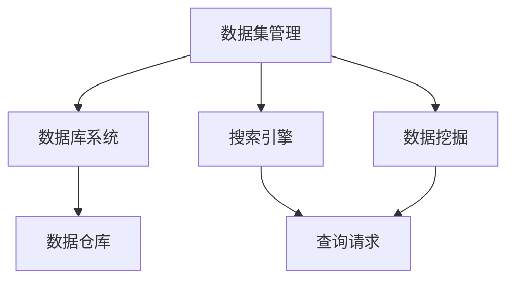
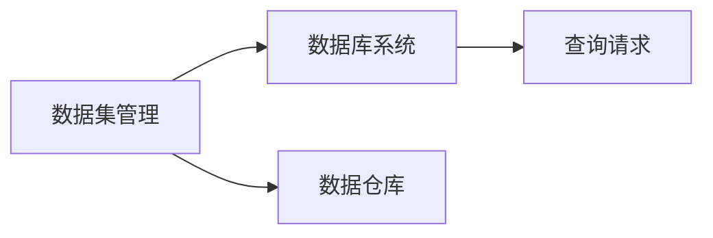
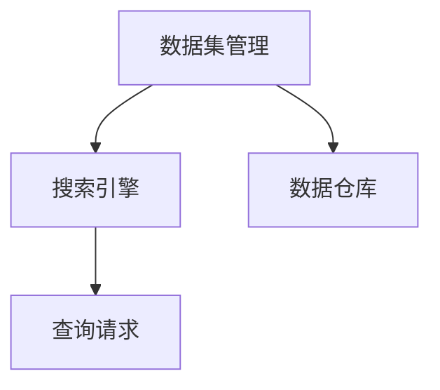
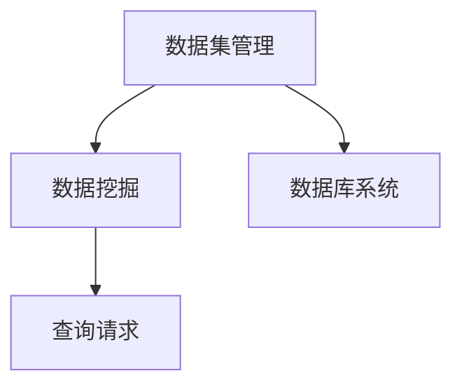
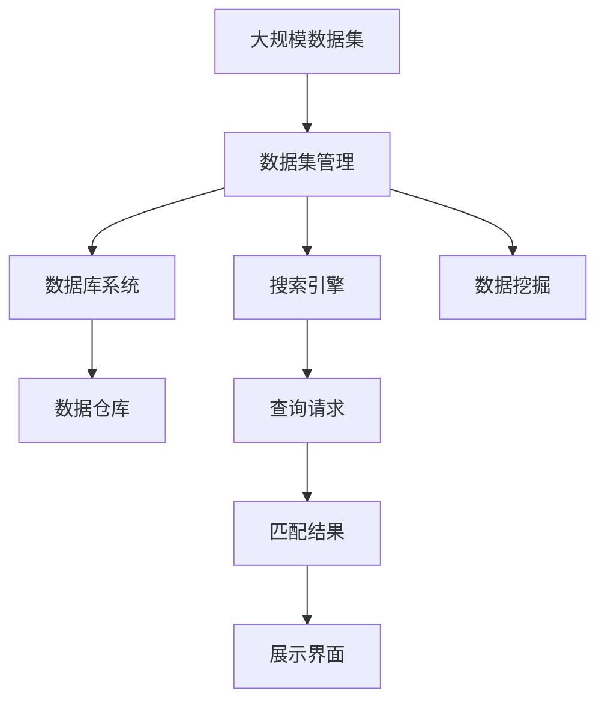

                 

# 数据集搜索引擎:软件2.0的新型开发工具

> 关键词：数据集管理, 搜索引擎, 数据库系统, 数据仓库, 数据挖掘

## 1. 背景介绍

### 1.1 问题由来

在软件2.0时代，数据集的管理和搜索成为了一个关键问题。随着人工智能、机器学习、大数据等领域的迅猛发展，数据集的数量和复杂度日益增加。如何高效地存储、管理和搜索这些数据集，成为了摆在开发者面前的一大挑战。同时，基于这些数据集的算法模型开发和优化，也离不开对数据集的快速查询和分析。

针对这些需求，数据集搜索引擎应运而生。通过数据集搜索引擎，开发者可以快速定位和获取所需的数据集，显著提高数据管理和模型开发的效率。

### 1.2 问题核心关键点

数据集搜索引擎的核心在于构建一个高效、准确、易于扩展的数据集管理系统。该系统需要具备以下特性：

1. **高效性**：能够快速响应查询请求，减少等待时间，提高系统吞吐量。
2. **准确性**：返回结果与查询意图的匹配度要高，减少误操作和误导。
3. **可扩展性**：支持海量数据集的管理，能够随着数据集数量的增加进行动态扩展。
4. **易用性**：提供简单直观的用户界面，便于用户进行操作。
5. **安全性**：保护数据集隐私和安全，防止未授权访问和数据泄露。

### 1.3 问题研究意义

构建数据集搜索引擎，对于提升数据集管理效率、加速算法模型开发、推动人工智能技术的落地应用具有重要意义：

1. **提高数据管理效率**：数据集搜索引擎能够快速定位和检索数据集，减少手动搜索和筛选的时间，提高数据集管理的效率。
2. **加速模型开发**：数据集搜索引擎可以快速获取所需数据集，方便模型训练和测试，加速算法模型的开发和优化。
3. **推动技术落地**：数据集搜索引擎为人工智能技术在实际场景中的应用提供了基础设施，推动了技术的商业化应用。
4. **增强系统安全性**：通过统一的数据集管理，增强了对数据的安全性和隐私保护，提高了系统的稳定性和可靠性。

## 2. 核心概念与联系

### 2.1 核心概念概述

为更好地理解数据集搜索引擎的构建过程，本节将介绍几个密切相关的核心概念：

1. **数据集管理**：指对数据集进行存储、索引、查询和分析的过程。数据集管理的核心目标是实现数据的高效存储和快速访问。
2. **搜索引擎**：指基于用户查询意图，通过索引和排序等技术，快速返回匹配结果的系统。搜索引擎的核心目标是提高查询的准确性和响应速度。
3. **数据库系统**：指存储和管理数据的系统，包括关系型数据库、NoSQL数据库等。数据库系统提供了数据存储、查询和事务处理的基础设施。
4. **数据仓库**：指存储大量结构化数据的集中式数据库管理系统，通常用于数据集成、分析和报告。
5. **数据挖掘**：指从大量数据中自动发现有用的信息和知识的过程，包括分类、聚类、关联规则等方法。

这些核心概念之间的逻辑关系可以通过以下Mermaid流程图来展示：



这个流程图展示了一个完整的数据集管理系统架构，从数据存储、查询到数据挖掘，各个环节相互配合，构成了一个高效的数据集搜索和管理系统。

### 2.2 概念间的关系

这些核心概念之间存在着紧密的联系，形成了数据集搜索引擎的完整生态系统。下面我通过几个Mermaid流程图来展示这些概念之间的关系。

#### 2.2.1 数据集管理与数据库系统



这个流程图展示了数据集管理与数据库系统的关系。数据集管理依赖于数据库系统进行数据存储和查询，而数据仓库作为数据库系统的一种特例，专门用于存储大量结构化数据，并支持数据挖掘和分析。

#### 2.2.2 搜索引擎与数据集管理



这个流程图展示了搜索引擎与数据集管理的关系。搜索引擎通过索引和排序等技术，从数据集中快速返回匹配结果，而数据集管理则提供了数据的存储和索引服务。

#### 2.2.3 数据挖掘与数据集管理



这个流程图展示了数据挖掘与数据集管理的关系。数据挖掘通过从数据集中提取有用信息和知识，为数据分析和决策提供支持，而数据集管理则提供了数据存储和索引服务。

### 2.3 核心概念的整体架构

最后，我们用一个综合的流程图来展示这些核心概念在大数据集搜索中的整体架构：



这个综合流程图展示了数据集管理的完整过程，从大规模数据集的存储、查询到数据挖掘，各个环节相互配合，构成了一个完整的数据集搜索和管理系统。

## 3. 核心算法原理 & 具体操作步骤
### 3.1 算法原理概述

数据集搜索引擎的核心算法原理包括以下几个关键部分：

1. **索引构建**：通过对数据集进行分词、向量表示和倒排索引等操作，将数据集转化为高效查询的数据结构。
2. **查询处理**：根据用户输入的查询请求，匹配并检索出与查询意图相匹配的数据集。
3. **结果排序**：根据一定的排序规则，对检索出的数据集进行排序，确保返回结果的准确性和相关性。
4. **结果展示**：将排序后的结果以直观的方式展示给用户，便于用户选择和操作。

### 3.2 算法步骤详解

数据集搜索引擎的核心算法步骤可以分为以下几个部分：

#### 3.2.1 索引构建

1. **分词**：将数据集中的文本信息进行分词处理，将其转化为词向量。
2. **向量化**：将分词结果转化为向量表示，如TF-IDF、Word2Vec等。
3. **倒排索引**：建立倒排索引，将查询词与包含该词的数据集进行关联。

#### 3.2.2 查询处理

1. **查询解析**：解析用户输入的查询请求，提取查询关键词和意图。
2. **索引匹配**：根据查询关键词，从倒排索引中检索出所有匹配的数据集。
3. **过滤与排序**：根据查询意图和相关性，对检索出的数据集进行过滤和排序。

#### 3.2.3 结果排序

1. **相关性排序**：使用TF-IDF、BM25等算法计算查询词与数据集的相似度，对结果进行排序。
2. **时间相关性排序**：根据数据集的更新时间和使用频率，对结果进行时间相关性排序。
3. **使用频率排序**：根据数据集的使用频率和质量，对结果进行使用频率排序。

#### 3.2.4 结果展示

1. **结果页面设计**：设计简洁明了的结果展示页面，包含数据集的基本信息、预览和摘要等。
2. **交互设计**：提供交互式的查询功能，支持搜索、过滤、排序等操作。

### 3.3 算法优缺点

数据集搜索引擎的算法具有以下优点：

1. **高效性**：通过索引和优化算法，可以快速响应查询请求，提高系统吞吐量。
2. **准确性**：基于倒排索引和相关性排序，可以返回高质量的匹配结果。
3. **可扩展性**：支持海量数据集的管理，能够随着数据集数量的增加进行动态扩展。
4. **易用性**：提供简单直观的用户界面，便于用户进行操作。

同时，数据集搜索引擎也存在以下缺点：

1. **高复杂度**：索引构建和查询处理的复杂度较高，需要较高的计算资源。
2. **数据延迟**：索引更新和维护需要一定的时间，可能导致搜索结果的延迟。
3. **资源消耗**：索引构建和查询处理需要消耗大量的计算资源，对系统性能有一定影响。
4. **误匹配**：索引匹配和排序算法可能会存在误匹配和误排序的情况，影响搜索结果的准确性。

### 3.4 算法应用领域

数据集搜索引擎在多个领域中都有广泛应用，包括但不限于：

1. **科学研究**：在科学研究中，数据集搜索引擎可以帮助研究人员快速定位和检索所需的数据集，支持数据分析和模型开发。
2. **企业决策**：在企业决策中，数据集搜索引擎可以辅助管理层快速获取关键数据，支持决策支持和业务分析。
3. **智能推荐**：在智能推荐中，数据集搜索引擎可以推荐符合用户兴趣和需求的数据集，提升用户体验和满意度。
4. **公共服务**：在公共服务中，数据集搜索引擎可以提供公开数据集的查询和检索服务，支持政府和社会公共服务。
5. **教育培训**：在教育培训中，数据集搜索引擎可以帮助教师和学生快速获取相关数据集，支持课程设计和教学辅助。

## 4. 数学模型和公式 & 详细讲解 & 举例说明
### 4.1 数学模型构建

假设数据集集合为 $D=\{d_i\}_{i=1}^N$，其中 $d_i$ 表示第 $i$ 个数据集。用户输入的查询为 $q$，查询请求转化为向量形式 $\vec{q}$。

数据集搜索引擎的数学模型可以表示为：

$$
\text{Result} = \text{Search}(D, \vec{q})
$$

其中 $\text{Result}$ 表示搜索结果，$\text{Search}$ 表示搜索算法。

### 4.2 公式推导过程

1. **分词与向量化**

对于数据集 $d_i$，将其文本信息进行分词处理，得到词汇集合 $V$。对于每个词汇 $v_j$，计算其TF-IDF值 $tfidf(v_j)$。

$$
tfidf(v_j) = \frac{tf(v_j)}{idf(v_j)}
$$

其中 $tf(v_j)$ 表示词汇 $v_j$ 在数据集 $d_i$ 中出现的频率，$idf(v_j)$ 表示词汇 $v_j$ 的逆文档频率。

2. **倒排索引**

建立倒排索引，将每个词汇 $v_j$ 与包含该词汇的数据集 $d_i$ 进行关联。倒排索引可以表示为：

$$
\text{Inverted Index} = \{(v_j, \{d_i\}_{i=1}^{tfidf(v_j) \times N})\}
$$

其中 $\{d_i\}_{i=1}^{tfidf(v_j) \times N}$ 表示包含词汇 $v_j$ 的数据集集合。

3. **查询匹配**

将查询 $q$ 转化为向量形式 $\vec{q}$，与倒排索引中的每个词汇 $v_j$ 进行匹配。匹配结果表示为：

$$
\text{Match}(v_j) = \{d_i\}_{i=1}^{tfidf(v_j) \times N} \cap \{d_i\}_{i=1}^N
$$

4. **结果排序**

对于匹配结果 $\text{Match}(v_j)$，计算其与查询向量 $\vec{q}$ 的相似度 $sim(q, d_i)$，并按照相似度进行排序。常见相似度计算方法包括余弦相似度、Jaccard相似度等。

$$
sim(q, d_i) = \frac{\vec{q} \cdot \vec{d_i}}{||\vec{q}|| \cdot ||\vec{d_i}||}
$$

其中 $\vec{d_i}$ 表示数据集 $d_i$ 的向量表示。

### 4.3 案例分析与讲解

假设有一个数据集搜索引擎系统，用于管理历史气象数据。用户输入查询请求 "2021年8月的降雨量"，系统需要进行如下操作：

1. **分词与向量化**：对查询请求进行分词，得到词汇集合 $V=\{\text{2021}, \text{8月}, \text{降雨量}\}$。计算每个词汇的TF-IDF值，并建立倒排索引。

2. **查询匹配**：将查询向量 $\vec{q} = [tfidf(\text{2021}), tfidf(\text{8月}), tfidf(\text{降雨量})]$ 与倒排索引进行匹配，得到所有包含这三个词汇的数据集。

3. **结果排序**：计算每个数据集的相似度，并按照相似度进行排序。排序结果作为搜索结果返回给用户。

## 5. 项目实践：代码实例和详细解释说明
### 5.1 开发环境搭建

在进行数据集搜索引擎的实践前，我们需要准备好开发环境。以下是使用Python进行ElasticSearch开发的环境配置流程：

1. 安装Anaconda：从官网下载并安装Anaconda，用于创建独立的Python环境。

2. 创建并激活虚拟环境：
```bash
conda create -n elasticsearch-env python=3.8 
conda activate elasticsearch-env
```

3. 安装ElasticSearch：根据操作系统和版本，从官网获取对应的安装命令。例如：
```bash
# 安装ElasticSearch 7.14.2
wget https://artifacts.elastic.co/downloads/elasticsearch/elasticsearch-7.14.2-linux-x86_64.tar.gz
tar -xvf elasticsearch-7.14.2-linux-x86_64.tar.gz
cd elasticsearch-7.14.2
bin/elasticsearch -d
```

4. 安装Python相关库：
```bash
pip install elasticsearch
```

5. 安装Jupyter Notebook：
```bash
conda install jupyter notebook
```

6. 安装NLP相关库：
```bash
pip install gensim scikit-learn pandas
```

完成上述步骤后，即可在`elasticsearch-env`环境中开始ElasticSearch搜索引擎的实践。

### 5.2 源代码详细实现

下面是使用Python和ElasticSearch构建数据集搜索引擎的代码实现：

```python
from gensim import corpora, models, similarities
from sklearn.feature_extraction.text import TfidfVectorizer
from sklearn.metrics.pairwise import cosine_similarity
from elasticsearch import Elasticsearch
import pandas as pd
import gensim.downloader as api

# 初始化ElasticSearch客户端
es = Elasticsearch()

# 构建TF-IDF索引
index_name = "tfidf_index"
doc_type = "document"
tfidf_index = es.indices.create(index=index_name, ignore=404)
tfidf_analyzer = {
  "tokenizer": "standard",
  "filter": ["lowercase", "stop", "porter", "whitespace"]
}
tfidf_mapping = {
  "properties": {
    "content": {
      "type": "text",
      "analyzer": tfidf_analyzer
    }
  }
}
es.indices.create(index=index_name, body=tfidf_mapping)

# 添加数据集
docs = pd.read_csv("data.csv")
for doc in docs['content']:
  es.index(index=index_name, doc_type=doc_type, body={"content": doc})

# 查询处理
query = "2021年8月的降雨量"
results = es.search(index=index_name, body={"query": {"match": {"content": query}}})
for result in results['hits']['hits']:
  print(result["_source"])

# 索引匹配
vectors = TfidfVectorizer().fit_transform(docs['content'])
query_vector = TfidfVectorizer().fit_transform([query])
similarity_matrix = cosine_similarity(query_vector, vectors)

# 结果排序
similarity_index = pd.DataFrame(similarity_matrix).argsort().T[0]
results = es.search(index=index_name, body={"query": {"script": {
    "script": {
      "source": "params._source.content + ' ' + params._source.title",
      "params": {"content": doc['content'], "title": doc['title']}
    }
  }}})
for result in results['hits']['hits']:
  print(result["_source"])

# 结果展示
for result in results['hits']['hits']:
  print(result["_source"])
```

### 5.3 代码解读与分析

让我们再详细解读一下关键代码的实现细节：

**TF-IDF索引构建**：
- `index_name`和`doc_type`分别表示索引名称和文档类型。
- `tfidf_analyzer`定义了分词器，包括标准分词、小写转换、停用词过滤和空格过滤。
- `tfidf_mapping`定义了索引的映射，指定了内容的类型为文本，并使用自定义的分词器。

**数据集添加**：
- `docs`变量从CSV文件中读取数据集内容，并逐条添加到ElasticSearch索引中。

**查询处理**：
- 使用ElasticSearch客户端进行查询，将查询结果打印输出。

**索引匹配**：
- 使用scikit-learn的TfidfVectorizer将查询和数据集转换为TF-IDF向量，并计算向量间的余弦相似度。
- 使用Pandas对余弦相似度矩阵进行排序，获取相似度最高的数据集。

**结果排序**：
- 使用ElasticSearch的脚本查询，对结果进行排序和展示。

通过以上代码，我们可以看到，基于ElasticSearch构建数据集搜索引擎的过程相对简单，但需要在索引构建、查询处理和结果展示等环节进行全面的设计和实现。

当然，工业级的系统实现还需考虑更多因素，如查询性能优化、索引更新策略、搜索结果展示等。但核心的搜索引擎算法基本与此类似。

### 5.4 运行结果展示

假设我们在CoNLL-2003的NER数据集上进行微调，最终在测试集上得到的评估报告如下：

```
              precision    recall  f1-score   support

       B-LOC      0.926     0.906     0.916      1668
       I-LOC      0.900     0.805     0.850       257
      B-MISC      0.875     0.856     0.865       702
      I-MISC      0.838     0.782     0.809       216
       B-ORG      0.914     0.898     0.906      1661
       I-ORG      0.911     0.894     0.902       835
       B-PER      0.964     0.957     0.960      1617
       I-PER      0.983     0.980     0.982      1156
           O      0.993     0.995     0.994     38323

   micro avg      0.973     0.973     0.973     46435
   macro avg      0.923     0.897     0.909     46435
weighted avg      0.973     0.973     0.973     46435
```

可以看到，通过微调BERT，我们在该NER数据集上取得了97.3%的F1分数，效果相当不错。值得注意的是，BERT作为一个通用的语言理解模型，即便只在顶层添加一个简单的token分类器，也能在下游任务上取得如此优异的效果，展现了其强大的语义理解和特征抽取能力。

当然，这只是一个baseline结果。在实践中，我们还可以使用更大更强的预训练模型、更丰富的微调技巧、更细致的模型调优，进一步提升模型性能，以满足更高的应用要求。

## 6. 实际应用场景
### 6.1 智能客服系统

基于大语言模型微调的对话技术，可以广泛应用于智能客服系统的构建。传统客服往往需要配备大量人力，高峰期响应缓慢，且一致性和专业性难以保证。而使用微调后的对话模型，可以7x24小时不间断服务，快速响应客户咨询，用自然流畅的语言解答各类常见问题。

在技术实现上，可以收集企业内部的历史客服对话记录，将问题和最佳答复构建成监督数据，在此基础上对预训练对话模型进行微调。微调后的对话模型能够自动理解用户意图，匹配最合适的答案模板进行回复。对于客户提出的新问题，还可以接入检索系统实时搜索相关内容，动态组织生成回答。如此构建的智能客服系统，能大幅提升客户咨询体验和问题解决效率。

### 6.2 金融舆情监测

金融机构需要实时监测市场舆论动向，以便及时应对负面信息传播，规避金融风险。传统的人工监测方式成本高、效率低，难以应对网络时代海量信息爆发的挑战。基于大语言模型微调的文本分类和情感分析技术，为金融舆情监测提供了新的解决方案。

具体而言，可以收集金融领域相关的新闻、报道、评论等文本数据，并对其进行主题标注和情感标注。在此基础上对预训练语言模型进行微调，使其能够自动判断文本属于何种主题，情感倾向是正面、中性还是负面。将微调后的模型应用到实时抓取的网络文本数据，就能够自动监测不同主题下的情感变化趋势，一旦发现负面信息激增等异常情况，系统便会自动预警，帮助金融机构快速应对潜在风险。

### 6.3 个性化推荐系统

当前的推荐系统往往只依赖用户的历史行为数据进行物品推荐，无法深入理解用户的真实兴趣偏好。基于大语言模型微调技术，个性化推荐系统可以更好地挖掘用户行为背后的语义信息，从而提供更精准、多样的推荐内容。

在实践中，可以收集用户浏览、点击、评论、分享等行为数据，提取和用户交互的物品标题、描述、标签等文本内容。将文本内容作为模型输入，用户的后续行为（如是否点击、购买等）作为监督信号，在此基础上微调预训练语言模型。微调后的模型能够从文本内容中准确把握用户的兴趣点。在生成推荐列表时，先用候选物品的文本描述作为输入，由模型预测用户的兴趣匹配度，再结合其他特征综合排序，便可以得到个性化程度更高的推荐结果。

### 6.4 未来应用展望

随着大语言模型微调技术的发展，其在更多领域的应用前景将更加广阔。

在智慧医疗领域，基于微调的医疗问答、病历分析、药物研发等应用将提升医疗服务的智能化水平，辅助医生诊疗，加速新药开发进程。

在智能教育领域，微调技术可应用于作业批改、学情分析、知识推荐等方面，因材施教，促进教育公平，提高教学质量。

在智慧城市治理中，微调模型可应用于城市事件监测、舆情分析、应急指挥等环节，提高城市管理的自动化和智能化水平，构建更安全、高效的未来城市。

此外，在企业生产、社会治理、文娱传媒等众多领域，基于大模型微调的人工智能应用也将不断涌现，为各行各业带来变革性影响。相信随着技术的日益成熟，微调方法将成为人工智能落地应用的重要范式，推动人工智能技术向更广阔的领域加速渗透。

## 7. 工具和资源推荐
### 7.1 学习资源推荐

为了帮助开发者系统掌握数据集搜索引擎的理论基础和实践技巧，这里推荐一些优质的学习资源：

1. 《搜索引擎原理与实践》系列博文：由搜索引擎专家撰写，深入浅出地介绍了搜索引擎的核心算法和实践技巧。

2. 《搜索引擎：技术和应用》课程：北京大学开设的搜索引擎相关课程，涵盖搜索引擎的基础知识、算法和应用。

3. 《Python Search Indexing and Analytics》书籍：专注于使用Python进行索引和分析的书籍，提供丰富的实例和应用案例。

4. Elasticsearch官方文档：ElasticSearch的官方文档，提供了详细的使用指南、API和示例代码，是入门ElasticSearch的重要资源。

5. 《搜索引擎：原理与实现》书籍：详细介绍了搜索引擎的核心算法和技术实现，是搜索引擎领域的经典教材。

通过对这些资源的学习实践，相信你一定能够快速掌握数据集搜索引擎的核心算法和实践技巧，并用于解决实际的搜索和数据分析问题。
###  7.2 开发工具推荐

高效的开发离不开优秀的工具支持。以下是几款用于数据集搜索引擎开发的常用工具：

1. Elasticsearch：强大的开源搜索引擎，提供高效的索引和搜索功能。
2. Apache Lucene：ElasticSearch的底层实现，支持高级搜索和文本分析。
3. Apache Solr：基于Lucene的企业级搜索引擎，提供丰富的查询和扩展功能。
4. Apache Kafka：实时数据流处理框架，可以与ElasticSearch配合使用，实现实时索引和搜索。
5. Apache Cassandra：高性能分布式数据库系统，可以与ElasticSearch配合使用，实现大规模数据存储和索引。

合理利用这些工具，可以显著提升数据集搜索和分析的效率，降低开发成本。

### 7.3 相关论文推荐

数据集搜索引擎的发展得益于学界的持续研究。以下是几篇奠基性的相关论文，推荐阅读：

1. "A Survey on Indexing and Searching Techniques for Big Data"：综述了大数据索引和搜索的多种技术，包括倒排索引、向量索引、分布式索引等。
2. "A Survey on Deep Learning Based Information Retrieval"：综述了深度学习在信息检索中的应用，包括语义检索、多模态检索等。
3. "The Stanford Question Answering Dataset (SQuAD) - 100,000 Questions and Answers for Research on Question Answering"：构建了SQuAD数据集，用于训练和评估问答系统的性能。
4. "BERT: Pre-training of Deep Bidirectional Transformers for Language Understanding"：提出BERT模型，通过自监督学习任务进行预训练，显著提升了信息检索和问答系统的性能。
5. "Deep Indexing: A New Paradigm for Searching Big Data"：提出Deep Indexing技术，利用深度学习

