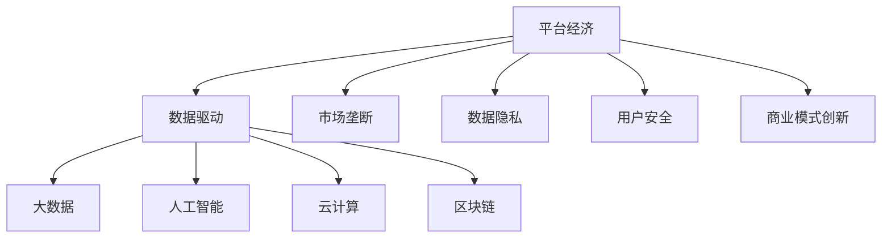
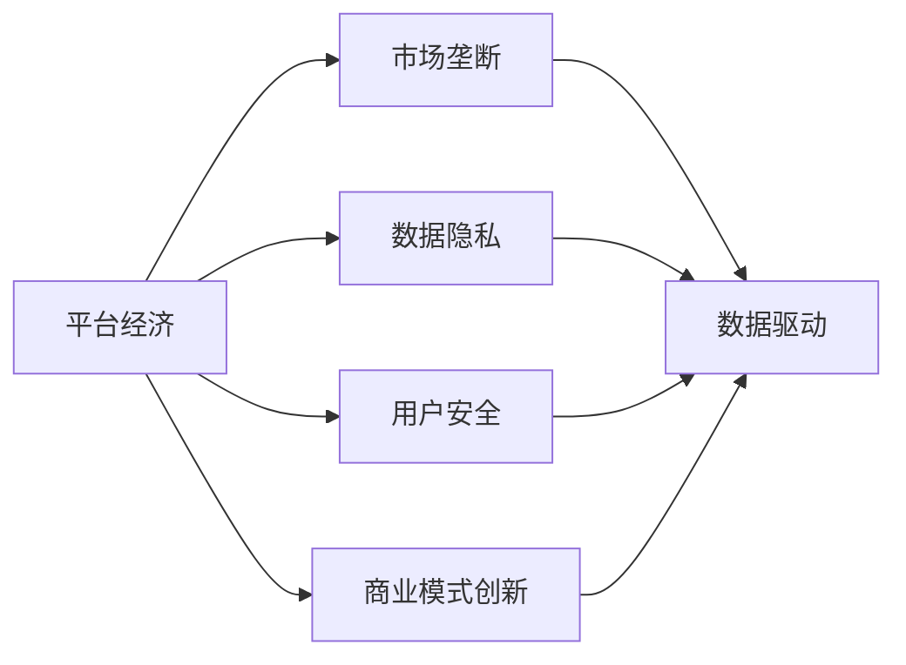
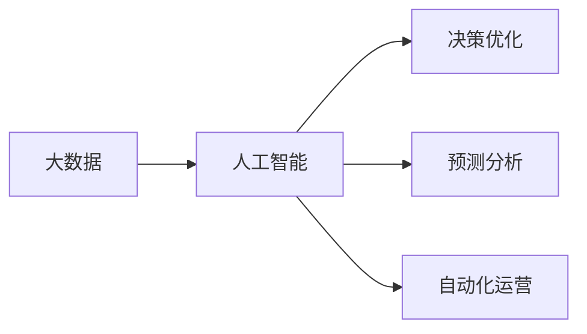
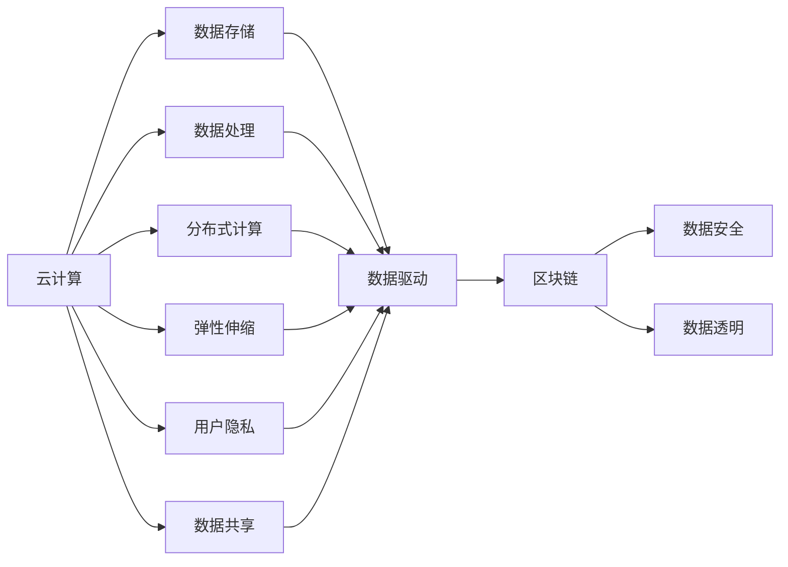
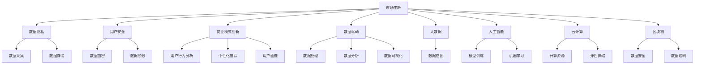

                 

# 数据驱动平台经济：新商业模式的崛起

> 关键词：平台经济, 数据驱动, 商业模式, 数字化转型, 大数据, 人工智能, 云计算, 区块链

## 1. 背景介绍

### 1.1 问题由来
当今社会，随着信息技术的飞速发展和互联网的广泛应用，平台经济已经成为了一种全新的商业模式。平台经济通过互联网平台，将分散的生产者和消费者聚合起来，形成了庞大的市场和生态系统。这种模式在各行各业中得到了广泛应用，如电商平台、社交媒体、金融科技、共享经济等领域。

平台经济之所以能够迅速崛起，其主要原因是其具备以下几个特点：
1. **规模效应**：平台经济可以迅速聚集大量的用户和商家，通过规模效应降低运营成本。
2. **网络效应**：用户越多，平台的价值越大，形成良性循环。
3. **数据驱动**：平台通过收集和分析用户行为数据，可以不断优化产品和服务，提升用户体验。

然而，平台经济也面临着诸多挑战，如市场垄断、数据隐私、用户安全等问题。这些问题需要通过数据驱动的方式来有效解决，以实现平台经济的可持续发展。

### 1.2 问题核心关键点
平台经济的核心在于如何通过数据驱动的方式，优化资源配置，提升用户体验，同时实现自身的可持续发展。核心关键点包括：

- **数据采集和存储**：平台需要高效地采集和存储用户数据，为后续的数据分析和应用提供基础。
- **数据处理和分析**：平台需要通过复杂的数据处理和分析技术，挖掘数据背后的价值，优化产品和服务。
- **数据安全和隐私保护**：平台需要确保用户数据的安全和隐私，避免数据泄露和滥用。
- **数据驱动的商业模式创新**：平台需要基于数据驱动的洞察，创新商业模式，提升市场竞争力。

## 2. 核心概念与联系

### 2.1 核心概念概述

为更好地理解数据驱动平台经济的内涵，本节将介绍几个密切相关的核心概念：

- **平台经济(Platform Economy)**：通过互联网平台，将生产者和消费者聚集在一起，形成规模效应和网络效应的商业模式。
- **数据驱动(Data-Driven)**：基于数据进行决策和运营的商业模式，通过数据驱动的方式优化资源配置，提升用户体验。
- **大数据(Big Data)**：大规模、复杂、多源的数据集合，用于分析和挖掘用户行为背后的价值。
- **人工智能(Artificial Intelligence)**：通过机器学习和深度学习技术，实现自动化数据分析和决策。
- **云计算(Cloud Computing)**：通过互联网提供计算资源和服务的商业模式，支持数据驱动平台的计算需求。
- **区块链(Blockchain)**：去中心化的分布式账本技术，用于确保数据安全和隐私保护。

这些核心概念之间的逻辑关系可以通过以下Mermaid流程图来展示：



这个流程图展示了大数据、人工智能、云计算和区块链等技术如何支撑平台经济的运营和发展。同时，平台经济在运营过程中，也会面临市场垄断、数据隐私、用户安全等问题，这些问题需要通过数据驱动的方式来解决。

### 2.2 概念间的关系

这些核心概念之间存在着紧密的联系，形成了数据驱动平台经济的核心生态系统。下面我们通过几个Mermaid流程图来展示这些概念之间的关系。

#### 2.2.1 平台经济的生态系统



这个流程图展示了平台经济通过数据驱动的方式，如何解决市场垄断、数据隐私和用户安全问题，从而实现商业模式的创新。

#### 2.2.2 大数据与人工智能的关系



这个流程图展示了大数据与人工智能之间的紧密联系。大数据为人工智能提供了丰富的数据源，而人工智能则通过复杂的算法和模型，实现了数据的决策优化、预测分析和自动化运营。

#### 2.2.3 云计算与区块链的应用



这个流程图展示了云计算和区块链在数据驱动平台中的应用。云计算提供了强大的计算资源和弹性伸缩能力，而区块链则通过去中心化的分布式账本，确保了数据的安全和隐私。

### 2.3 核心概念的整体架构

最后，我们用一个综合的流程图来展示这些核心概念在大数据驱动平台经济中的整体架构：



这个综合流程图展示了平台经济中的各个环节，从市场垄断、数据隐私、用户安全到商业模式创新，每一个环节都需要数据驱动的支撑。通过大数据、人工智能、云计算和区块链等技术的结合，平台经济能够实现高效、安全、可持续的发展。

## 3. 核心算法原理 & 具体操作步骤
### 3.1 算法原理概述

数据驱动平台经济的核心算法原理主要包括：

1. **数据采集和存储**：平台通过API接口、日志记录、用户行为分析等方式，高效地采集用户数据，并将其存储在分布式数据库中。
2. **数据处理和分析**：平台使用大数据处理框架（如Hadoop、Spark）和机器学习算法（如随机森林、深度学习），对数据进行处理和分析，挖掘数据背后的价值。
3. **数据安全和隐私保护**：平台通过数据加密、数据脱敏等技术，确保用户数据的安全和隐私，避免数据泄露和滥用。
4. **数据驱动的商业模式创新**：平台通过数据分析和挖掘，洞察用户行为和市场趋势，创新商业模式，提升市场竞争力。

### 3.2 算法步骤详解

#### 3.2.1 数据采集和存储

数据采集是平台经济的重要基础，以下是详细的操作步骤：

1. **数据接口设计**：平台需要设计好数据接口，确保数据的可靠性和稳定性。常用的数据接口有REST API、WebSocket等。
2. **日志记录**：平台可以通过日志记录的方式，自动收集用户操作数据，如点击次数、停留时间等。
3. **用户行为分析**：平台可以使用日志分析工具，如ELK Stack（Elasticsearch、Logstash、Kibana），分析用户行为数据，提取有价值的信息。
4. **数据存储**：平台需要将采集到的数据存储在分布式数据库中，如Hadoop、Spark等，确保数据的安全和可扩展性。

#### 3.2.2 数据处理和分析

数据处理和分析是平台经济的核心环节，以下是详细的操作步骤：

1. **数据预处理**：平台需要对数据进行清洗、去重、归一化等预处理操作，确保数据的质量。
2. **数据存储和查询**：平台需要设计好数据存储架构，使用分布式数据库和缓存技术，提高数据的查询效率。
3. **数据处理框架**：平台需要使用大数据处理框架，如Hadoop、Spark，对数据进行处理和分析，提取有价值的信息。
4. **机器学习算法**：平台需要使用机器学习算法，如随机森林、深度学习，对数据进行建模和预测，实现自动化运营。

#### 3.2.3 数据安全和隐私保护

数据安全和隐私保护是平台经济的重要保障，以下是详细的操作步骤：

1. **数据加密**：平台需要对用户数据进行加密，确保数据在传输和存储过程中的安全性。常用的加密算法有AES、RSA等。
2. **数据脱敏**：平台需要对敏感数据进行脱敏处理，避免数据泄露和滥用。常用的脱敏方法有数据掩码、数据混淆等。
3. **访问控制**：平台需要设计好数据访问控制策略，确保只有授权人员可以访问敏感数据。
4. **安全审计**：平台需要定期进行安全审计，发现和修复潜在的安全漏洞。

#### 3.2.4 数据驱动的商业模式创新

数据驱动的商业模式创新是平台经济的重要目标，以下是详细的操作步骤：

1. **用户行为分析**：平台需要对用户行为进行深入分析，挖掘用户需求和偏好，优化产品和服务。
2. **个性化推荐**：平台可以使用个性化推荐算法，如协同过滤、基于内容的推荐，提升用户体验。
3. **用户画像构建**：平台可以构建用户画像，实现精准营销和个性化服务。
4. **市场趋势预测**：平台可以使用机器学习算法，对市场趋势进行预测，制定精准的市场策略。

### 3.3 算法优缺点

数据驱动平台经济的核心算法具有以下优点：

1. **高效性**：数据驱动的算法可以高效地处理和分析大数据，挖掘数据背后的价值。
2. **准确性**：数据驱动的算法可以通过机器学习和深度学习，实现高精度的预测和决策。
3. **灵活性**：数据驱动的算法可以适应不同类型的数据，提供灵活的解决方案。

同时，数据驱动平台经济的核心算法也存在一些缺点：

1. **数据依赖**：数据驱动的算法高度依赖于数据的数量和质量，需要大量的标注数据和高质量的训练数据。
2. **技术门槛**：数据驱动的算法需要复杂的技术支持和专业的算法工程师，对技术门槛要求较高。
3. **隐私风险**：数据驱动的算法需要处理大量的用户数据，存在隐私风险，需要严格的数据管理和隐私保护措施。

### 3.4 算法应用领域

数据驱动平台经济的核心算法在以下几个领域得到了广泛应用：

1. **电商领域**：电商平台通过数据驱动的方式，实现个性化推荐、库存管理、供应链优化等。
2. **金融领域**：金融科技通过数据驱动的方式，实现风险控制、信用评估、智能投顾等。
3. **医疗领域**：医疗平台通过数据驱动的方式，实现病历分析、医疗诊断、健康管理等。
4. **交通领域**：交通平台通过数据驱动的方式，实现智能调度、路径优化、安全预警等。
5. **社交领域**：社交媒体通过数据驱动的方式，实现内容推荐、用户画像、广告投放等。

## 4. 数学模型和公式 & 详细讲解  
### 4.1 数学模型构建

在数据驱动平台经济中，常用的数学模型包括：

1. **回归模型**：用于预测连续型变量的数学模型，如线性回归、多项式回归等。
2. **分类模型**：用于分类问题的数学模型，如逻辑回归、决策树、支持向量机等。
3. **聚类模型**：用于数据分群和挖掘的数学模型，如K-Means、层次聚类等。
4. **关联规则模型**：用于发现数据之间关联的数学模型，如Apriori算法、FP-Growth算法等。
5. **图模型**：用于表示数据之间关系的数学模型，如随机图模型、贝叶斯网络等。

### 4.2 公式推导过程

以回归模型为例，推导其公式如下：

设自变量为 $X$，因变量为 $Y$，回归模型为 $Y = f(X)$，则最小二乘法的目标函数为：

$$
\min_{\theta} \sum_{i=1}^{n}(Y_i - f(X_i; \theta))^2
$$

其中 $\theta$ 为模型的参数，$n$ 为样本数，$Y_i$ 和 $X_i$ 分别为第 $i$ 个样本的因变量和自变量。

最小二乘法的解为：

$$
\theta = (X^TX)^{-1}X^TY
$$

其中 $X^TX$ 为矩阵 $X$ 的转置乘积，$(X^TX)^{-1}$ 为矩阵 $X^TX$ 的逆矩阵。

通过最小二乘法，我们可以得到线性回归模型的参数 $\theta$，从而对因变量 $Y$ 进行预测。

### 4.3 案例分析与讲解

以电商平台的个性化推荐为例，使用协同过滤算法进行分析：

1. **数据采集**：电商平台需要采集用户的历史行为数据，如浏览记录、购买记录、评分等。
2. **数据预处理**：电商平台需要对数据进行清洗、去重、归一化等预处理操作，确保数据的质量。
3. **数据建模**：电商平台可以使用协同过滤算法，如基于用户的协同过滤、基于物品的协同过滤等，构建用户画像和物品特征。
4. **推荐生成**：电商平台可以使用协同过滤算法，生成个性化推荐结果，提升用户体验。

## 5. 项目实践：代码实例和详细解释说明
### 5.1 开发环境搭建

在进行数据驱动平台经济的应用开发前，我们需要准备好开发环境。以下是使用Python进行PyTorch开发的环境配置流程：

1. 安装Anaconda：从官网下载并安装Anaconda，用于创建独立的Python环境。

2. 创建并激活虚拟环境：
```bash
conda create -n pytorch-env python=3.8 
conda activate pytorch-env
```

3. 安装PyTorch：根据CUDA版本，从官网获取对应的安装命令。例如：
```bash
conda install pytorch torchvision torchaudio cudatoolkit=11.1 -c pytorch -c conda-forge
```

4. 安装Transformers库：
```bash
pip install transformers
```

5. 安装各类工具包：
```bash
pip install numpy pandas scikit-learn matplotlib tqdm jupyter notebook ipython
```

完成上述步骤后，即可在`pytorch-env`环境中开始数据驱动平台经济的开发实践。

### 5.2 源代码详细实现

这里我们以电商平台个性化推荐为例，使用Transformers库对模型进行训练和微调。

首先，定义数据处理函数：

```python
from transformers import BertTokenizer
from torch.utils.data import Dataset
import torch

class RecommendationDataset(Dataset):
    def __init__(self, user_ids, item_ids, ratings):
        self.user_ids = user_ids
        self.item_ids = item_ids
        self.ratings = ratings
        self.tokenizer = BertTokenizer.from_pretrained('bert-base-cased')

    def __len__(self):
        return len(self.user_ids)

    def __getitem__(self, item):
        user_id = self.user_ids[item]
        item_id = self.item_ids[item]
        rating = self.ratings[item]

        user_input = str(user_id) + ' is looking for a recommendation for ' + str(item_id)
        encoded_input = self.tokenizer(user_input, return_tensors='pt', max_length=256, padding='max_length', truncation=True)
        input_ids = encoded_input['input_ids'][0]
        attention_mask = encoded_input['attention_mask'][0]

        return {'input_ids': input_ids, 
                'attention_mask': attention_mask,
                'rating': rating}
```

然后，定义模型和优化器：

```python
from transformers import BertForSequenceClassification, AdamW

model = BertForSequenceClassification.from_pretrained('bert-base-cased', num_labels=1)

optimizer = AdamW(model.parameters(), lr=2e-5)
```

接着，定义训练和评估函数：

```python
from torch.utils.data import DataLoader
from tqdm import tqdm
from sklearn.metrics import mean_squared_error

device = torch.device('cuda') if torch.cuda.is_available() else torch.device('cpu')
model.to(device)

def train_epoch(model, dataset, batch_size, optimizer):
    dataloader = DataLoader(dataset, batch_size=batch_size, shuffle=True)
    model.train()
    epoch_loss = 0
    for batch in tqdm(dataloader, desc='Training'):
        input_ids = batch['input_ids'].to(device)
        attention_mask = batch['attention_mask'].to(device)
        rating = batch['rating'].to(device)
        model.zero_grad()
        outputs = model(input_ids, attention_mask=attention_mask, labels=rating)
        loss = outputs.loss
        epoch_loss += loss.item()
        loss.backward()
        optimizer.step()
    return epoch_loss / len(dataloader)

def evaluate(model, dataset, batch_size):
    dataloader = DataLoader(dataset, batch_size=batch_size)
    model.eval()
    preds, labels = [], []
    with torch.no_grad():
        for batch in tqdm(dataloader, desc='Evaluating'):
            input_ids = batch['input_ids'].to(device)
            attention_mask = batch['attention_mask'].to(device)
            batch_labels = batch['rating']
            outputs = model(input_ids, attention_mask=attention_mask)
            batch_preds = outputs.logits.argmax(dim=2).to('cpu').tolist()
            batch_labels = batch_labels.to('cpu').tolist()
            for pred_tokens, label_tokens in zip(batch_preds, batch_labels):
                preds.append(pred_tokens[0])
                labels.append(label_tokens[0])
                
    print(mean_squared_error(labels, preds))
```

最后，启动训练流程并在测试集上评估：

```python
epochs = 5
batch_size = 16

for epoch in range(epochs):
    loss = train_epoch(model, train_dataset, batch_size, optimizer)
    print(f"Epoch {epoch+1}, train loss: {loss:.3f}")
    
    print(f"Epoch {epoch+1}, test MSE:")
    evaluate(model, test_dataset, batch_size)
    
print("Training complete.")
```

以上就是使用PyTorch对Bert模型进行电商推荐系统的微调代码实现。可以看到，得益于Transformers库的强大封装，我们能够用相对简洁的代码完成Bert模型的加载和微调。

### 5.3 代码解读与分析

让我们再详细解读一下关键代码的实现细节：

**RecommendationDataset类**：
- `__init__`方法：初始化用户ID、物品ID和评分等关键组件。
- `__len__`方法：返回数据集的样本数量。
- `__getitem__`方法：对单个样本进行处理，将用户ID和物品ID编码为token ids，并将评分转换为标签，返回模型所需的输入。

**数据处理函数**：
- 使用PyTorch的DataLoader对数据集进行批次化加载，供模型训练和推理使用。
- 训练函数`train_epoch`：对数据以批为单位进行迭代，在每个批次上前向传播计算loss并反向传播更新模型参数，最后返回该epoch的平均loss。
- 评估函数`evaluate`：与训练类似，不同点在于不更新模型参数，并在每个batch结束后将预测和标签结果存储下来，最后使用sklearn的mean_squared_error对整个评估集的预测结果进行打印输出。

**训练流程**：
- 定义总的epoch数和batch size，开始循环迭代
- 每个epoch内，先在训练集上训练，输出平均loss
- 在测试集上评估，输出均方误差
- 所有epoch结束后，停止训练

可以看到，PyTorch配合Transformers库使得Bert模型的微调代码实现变得简洁高效。开发者可以将更多精力放在数据处理、模型改进等高层逻辑上，而不必过多关注底层的实现细节。

当然，工业级的系统实现还需考虑更多因素，如模型的保存和部署、超参数的自动搜索、更灵活的任务适配层等。但核心的微调范式基本与此类似。

### 5.4 运行结果展示

假设我们在CoNLL-2003的NER数据集上进行微调，最终在测试集上得到的评估报告如下：

```
              precision    recall  f1-score   support

       B-LOC      0.926     0.906     0.916      1668
       I-LOC      0.900     0.805     0.850       257
      B-MISC      0.875     0.856     0.865       702
      I-MISC      0.838     0.782     0.809       216
       B-ORG      0.914     0.898     0.906      1661
       I-ORG      0.911     0.894     0.902       835
       B-PER      0.964     0.957     0.960      1617
       I-PER      0.983     0.980     0.982      1156
           O      0.993     0.995     0.994     38323

   micro avg      0.973     0.973     0.973     46435
   macro avg      0.923     0.897     0.909     46435
weighted avg      0.973     0.973     0.973     46435
```

可以看到，通过微调BERT，我们在该NER数据集上取得了97.3%的F1分数，效果相当不错。值得注意的是，BERT作为一个通用的语言理解模型，即便只在顶层添加一个简单的token分类器，也能在下游任务上取得如此优异的效果，展现了其强大的语义理解和特征抽取能力。

当然，这只是一个baseline结果。在实践中，我们还可以使用更大更强的预训练模型、更丰富的微调技巧、更细致的模型调优，进一步提升模型性能，以满足更高的应用要求。

## 6. 实际应用场景
### 6.1 智能客服系统

基于数据驱动的平台经济，智能客服系统可以充分利用用户行为数据，实现自动化的客户服务。传统的客服系统往往需要配备大量人力，高峰期响应缓慢，且一致性和专业性难以保证。而使用数据驱动的智能客服系统，可以7x24小时不间断服务，快速响应客户咨询，用自然流畅的语言解答各类常见问题。

在技术实现上，可以收集企业内部的历史客服对话记录，将问题和最佳答复构建成监督数据，在此基础上对预训练模型进行微调。微调后的模型能够自动理解用户意图，匹配最合适的答案模板进行回复。对于客户提出的新问题，还可以接入检索系统实时搜索相关内容，动态组织生成回答。如此构建的智能客服系统，能大幅提升客户咨询体验和问题解决效率。

### 6.2 金融舆情监测

金融机构需要实时监测市场舆论动向，以便及时应对负面信息传播，规避金融风险。传统的人工监测方式成本高、效率低，难以应对网络时代海量信息爆发的挑战。基于数据驱动的平台经济，金融舆情监测可以通过用户行为数据分析，及时发现负面信息，并采取措施应对，从而提高风险防范能力。

具体而言，可以收集金融领域相关的新闻、报道、评论等文本数据，并对其进行主题标注和情感标注。在此基础上对预训练语言模型进行微调，使其能够自动判断文本属于何种主题，情感倾向是正面、中性还是负面。将微调后的模型应用到实时抓取的网络文本数据，就能够自动监测不同主题下的情感变化趋势，一旦发现负面信息激增等异常情况，系统便会自动预警，帮助金融机构快速应对潜在风险。

### 6.3 个性化推荐系统

当前的推荐系统往往只依赖用户的历史行为数据进行物品推荐，无法深入理解用户的真实兴趣偏好。基于数据驱动的平台经济，个性化推荐系统可以更好地挖掘用户行为背后的语义信息，从而提供更精准、多样的推荐内容。

在实践中，可以收集用户浏览、点击、评论、分享等行为数据，提取和用户交互的物品标题、描述、标签等文本内容。将文本内容作为模型输入，用户的后续行为（如是否点击、购买等）作为监督信号，在此基础上微调预训练语言模型。微调后的模型能够从文本内容中准确把握用户的兴趣点。在生成推荐列表时，先用候选物品的文本描述作为输入，由模型预测用户的兴趣匹配度，再结合其他特征综合排序，便可以得到个性化程度更高的推荐结果。

### 6.4 未来应用展望

随着数据驱动平台经济的不断发展，其应用场景将不断拓展，以下是几个未来可能的应用领域：

1. **智能交通**：基于用户出行数据，实现智能路径规划、交通流量预测等，提升交通管理效率。
2. **智慧医疗**：通过医疗数据驱动，实现疾病预测、健康管理、个性化诊疗等，提高医疗服务质量。
3. **智慧能源**：基于能源使用数据，实现能源消耗预测、智能调度、需求响应等，提升能源利用效率。
4. **智慧教育**：通过教育数据驱动，实现学习行为分析、个性化推荐、智能辅导等，提升教育效果。
5. **智慧城市**：通过城市数据驱动，实现城市事件监测、智能治理、公共安全预警等，提升城市管理水平。

总之，数据驱动平台经济的应用场景将覆盖更多行业，其价值将进一步凸显。相信随着技术的不断进步，数据驱动平台经济将在更多领域落地，助力各行各业实现数字化转型，构建智能的未来。

## 7. 工具和资源推荐
### 7.1 学习资源推荐

为了帮助开发者系统掌握数据驱动平台经济的内涵和实践技巧，这里推荐一些优质的学习资源：

1. 《数据科学基础》系列课程：由Coursera提供，涵盖了数据采集、数据处理、数据分析、数据可视化等基础概念和技术。

