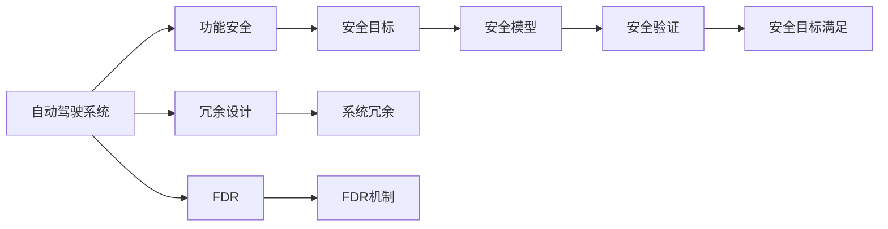

                 

# 自动驾驶行业的功能安全分析与设计方法

## 1. 背景介绍

随着自动驾驶技术的发展，安全问题成为自动驾驶系统开发中最为关注的核心之一。功能安全（Functional Safety, FS）是对系统行为进行规范和验证的通用方法，通过强制系统在特定场景下正确运行，来确保系统的可靠性。自动驾驶系统由于涉及复杂的感知、决策、执行等功能模块，且需要与环境交互，其功能安全设计尤为重要。

### 1.1 问题由来

自动驾驶技术的核心在于计算机视觉、深度学习、路径规划、控制算法等多个领域的技术融合。这些技术在单点性能上已达到相当高的水平，但整体系统集成的复杂性和不确定性仍然存在较大挑战。功能安全方法提供了一套系统化的验证流程，通过预先设计和严格验证，确保自动驾驶系统在各种工况下的安全性能。

功能安全方法广泛应用于工业自动化、航空航天等领域，在汽车电子和自动驾驶系统中的应用也逐渐增多。自动驾驶系统需要具有可靠的功能安全机制，才能满足安全性要求，得到法规的认证和用户信任。

### 1.2 问题核心关键点

自动驾驶系统功能安全设计的关键点主要包括：

- 安全目标的设定：系统必须在各种工作场景下满足特定的安全要求，如碰撞概率、系统故障时的安全措施等。
- 冗余系统的设计：通过系统的多重备份和故障切换，确保关键功能的可靠性。
- 安全验证的执行：使用系统建模和模拟等技术，验证系统在不同工况下的安全性能。
- 系统故障的检测与恢复：通过传感器、算法和硬件冗余等方式，实现对系统故障的实时检测和恢复。

### 1.3 问题研究意义

功能安全方法的应用，有助于自动驾驶系统满足严格的法规要求，提升用户体验和系统可靠性，减少交通事故。这对于自动驾驶技术在现实世界中的大规模部署具有重要意义：

- 提升系统安全性：通过系统化的安全验证，防止系统在极端条件下的安全事故。
- 增强法规合规性：满足法规和标准，确保系统通过相关机构的认证和批准。
- 优化用户体验：通过故障检测和恢复机制，提升系统运行稳定性和用户信心。
- 推动技术进步：在安全要求约束下，促进技术创新和系统优化。

## 2. 核心概念与联系

### 2.1 核心概念概述

在自动驾驶系统的功能安全设计中，涉及多个关键概念，主要包括：

- 功能安全（Functional Safety, FS）：通过规范和验证系统行为，确保系统的可靠性和安全性。
- 安全完整性级别（Safety Integrity Level, SIL）：系统设计所需的安全性等级，分为SIL1到SIL4，SIL4为最高。
- 安全目标（Safety Goals）：系统设计需要实现的安全性能指标，如碰撞概率、冗余设计、故障检测等。
- 安全模型（Safety Model）：对系统进行建模，用于分析和验证系统安全性能的工具。
- 安全验证（Safety Verification）：通过系统建模和仿真，验证系统在各种工况下是否满足安全目标的过程。
- 冗余设计（Redundancy Design）：通过系统的多重备份和故障切换，增强系统可靠性。
- 故障检测与恢复（Fault Detection and Recovery, FDR）：实时监测系统状态，在故障发生时进行检测和恢复的机制。

这些概念之间的联系可以通过以下Mermaid流程图来展示：



### 2.2 概念间的关系

这些概念之间有着紧密的联系，共同构成了自动驾驶系统的功能安全设计框架。以下是详细的解释：

- 自动驾驶系统(A)是功能安全的核心对象，通过功能安全(B)方法，确保系统满足特定安全目标(C)。
- 安全模型(D)通过对系统进行建模，为安全验证(E)提供基础。
- 安全验证(E)通过系统建模和仿真，验证系统是否满足安全目标。
- 冗余设计(F)通过系统的多重备份和故障切换，增强系统可靠性。
- 故障检测与恢复(G)实时监测系统状态，在故障发生时进行检测和恢复。
- 系统的安全目标满足(H)表示系统达到了设计要求，可部署和使用。
- 系统冗余(I)通过多重备份，确保关键功能不因单个组件故障而失效。
- 故障检测与恢复(J)通过检测和恢复机制，提升系统稳定性和用户体验。

通过理解这些概念之间的关系，我们可以更好地把握自动驾驶系统的功能安全设计思路。

## 3. 核心算法原理 & 具体操作步骤
### 3.1 算法原理概述

自动驾驶系统功能安全设计的主要目标是通过规范和验证，确保系统在各种工作场景下满足特定的安全要求。其核心算法原理主要包括系统建模、安全验证、冗余设计和故障检测与恢复等。

### 3.2 算法步骤详解

#### 3.2.1 系统建模

系统建模是功能安全设计的第一步，通过建立系统模型，为后续的安全验证提供基础。系统建模通常使用系统仿真工具，如Simulink、MATLAB等。建模过程中，需要定义系统的输入输出接口、功能模块、状态转移图等关键信息。

#### 3.2.2 安全验证

安全验证通过系统建模和仿真，验证系统在各种工况下是否满足设计要求。常见的验证方法包括模型检查、状态机分析、仿真测试等。验证过程中，需要考虑系统在不同环境下的运行状态、传感器数据、决策算法等关键因素。

#### 3.2.3 冗余设计

冗余设计通过系统的多重备份和故障切换，增强系统可靠性。冗余设计包括硬件冗余和软件冗余两种方式。硬件冗余通过添加额外的传感器、控制器等硬件设备，确保关键功能的备份。软件冗余通过多个软件模块的并行运行，实现功能的冗余和切换。

#### 3.2.4 故障检测与恢复

故障检测与恢复通过实时监测系统状态，在故障发生时进行检测和恢复。故障检测通常使用传感器数据、状态机分析等方法，实时检测系统的运行状态。故障恢复通过系统的冗余设计和切换机制，实现对故障的快速响应和恢复。

### 3.3 算法优缺点

自动驾驶系统功能安全设计的主要优点包括：

- 系统可靠性高：通过多重备份和故障切换，确保系统关键功能的可靠性。
- 法规合规性强：满足严格的安全法规和标准，确保系统通过相关机构的认证和批准。
- 用户体验好：通过故障检测和恢复机制，提升系统运行稳定性和用户信心。

主要缺点包括：

- 设计复杂度高：功能安全设计需要考虑多个安全目标和冗余设计，设计复杂度较高。
- 验证过程耗时：安全验证通常需要大量仿真测试，耗时较长。
- 资源需求大：功能安全设计需要高性能的计算资源和复杂的建模工具，资源需求大。

### 3.4 算法应用领域

自动驾驶系统的功能安全设计主要应用于以下领域：

- 高级驾驶辅助系统(ADAS)：包括车道保持、自适应巡航等功能的系统，需要满足特定的安全要求。
- 自动驾驶汽车：包括无人驾驶、半自动驾驶等系统，需要更严格的安全验证和冗余设计。
- 车联网系统：包括车辆间的通信、控制等功能，需要保证系统的可靠性和安全性。
- 智能交通系统：包括交通信号控制、智能停车等功能，需要满足特定的安全目标。

## 4. 数学模型和公式 & 详细讲解 & 举例说明

### 4.1 数学模型构建

自动驾驶系统的功能安全设计通常使用系统建模工具，如Simulink、MATLAB等。以一个简单的自动驾驶系统为例，其数学模型可以表示为：

$$
S = (O_{perception}, O_{planning}, O_{control})
$$

其中，$S$表示系统模型，$O_{perception}$表示感知模块，$O_{planning}$表示路径规划模块，$O_{control}$表示控制模块。

### 4.2 公式推导过程

以感知模块为例，其数学模型可以进一步细化为：

$$
O_{perception} = (S_{camera}, S_{laser}, S_{radar})
$$

其中，$S_{camera}$表示摄像头传感器模型，$S_{laser}$表示激光雷达传感器模型，$S_{radar}$表示雷达传感器模型。

在计算过程中，可以使用以下公式进行推导：

$$
S_{camera} = O_{vision}
$$
$$
S_{vision} = I_{vision} \times T_{vision}
$$
$$
I_{vision} = f(v_{camera}, a_{camera})
$$

其中，$O_{vision}$表示视觉传感器模型，$I_{vision}$表示摄像头图像，$T_{vision}$表示视觉传感器时间延迟，$f(v_{camera}, a_{camera})$表示摄像头图像与车辆速度、加速度的关系。

### 4.3 案例分析与讲解

以一个简单的自动驾驶系统为例，其安全目标可以表示为：

$$
T_{safety} = (T_{collision}, T_{obstacle})
$$

其中，$T_{collision}$表示碰撞概率，$T_{obstacle}$表示障碍物检测概率。

安全验证可以通过仿真测试进行。例如，使用MATLAB的Simulink工具，建立系统的仿真模型，通过仿真测试验证系统在不同工况下的安全性能。在仿真测试中，可以设定不同的工况，如雨雪天气、夜间驾驶等，验证系统在各种环境下的运行状态和安全性。

## 5. 项目实践：代码实例和详细解释说明

### 5.1 开发环境搭建

在进行自动驾驶系统功能安全设计前，我们需要准备好开发环境。以下是使用MATLAB进行Simulink开发的流程：

1. 安装MATLAB软件：从官网下载并安装MATLAB，确保版本支持Simulink工具。

2. 创建Simulink模型：使用MATLAB的Simulink编辑器创建新模型，或者导入已有的Simulink模型。

3. 添加系统组件：在Simulink模型中添加必要的系统组件，如传感器、控制器、执行器等。

4. 定义输入输出接口：在Simulink模型中定义输入输出接口，确保系统与其他模块的通信。

5. 进行模型仿真：通过Simulink工具栏，启动系统仿真，验证系统在不同工况下的运行状态。

完成上述步骤后，即可在MATLAB环境中开始功能安全设计的实践。

### 5.2 源代码详细实现

下面我们以一个简单的自动驾驶系统为例，使用MATLAB进行功能安全设计的代码实现。

```matlab
% 导入Simulink模型
sim = simulink.importModel('AutodriveSystemModel');

% 启动系统仿真
sim.start();

% 进行仿真测试
sim.log = false;
sim guitarCheckpoints = false;
sim.y0 = 'zeros';
sim.tstop = 10;
sim.options.collectStatistics = true;
sim.options.selectOutputPorts = {'output_1'};

% 进行系统验证
sim.options.verifyModel = true;
sim.verifyOptions.evaluationMethod = 'full';
sim.verifyOptions.translation = {'translation_auto'};

% 进行冗余设计
% 添加摄像头传感器模块
cameras = simulink.importModel('CameraSensorModel');

% 添加激光雷达传感器模块
laser = simulink.importModel('LaserSensorModel');

% 添加雷达传感器模块
radar = simulink.importModel('RadarSensorModel');

% 添加控制模块
controller = simulink.importModel('ControlModule');

% 添加执行器模块
actuators = simulink.importModel('ActuatorModule');

% 进行冗余设计
sim.verifyOptions.evaluationMethod = 'full';
sim.verifyOptions.translation = {'translation_auto'};
sim.verifyOptions.verificationMethod = 'enumeration';
sim.verifyOptions.aggregationType = 'cumulative';
sim.verifyOptions.testFails = false;
sim.verifyOptions.schedule = sim.verifyOptions.defaultSchedule;
sim.verifyOptions.reserved = false;
sim.verifyOptions.unsafeConditions = false;
sim.verifyOptions.timeout = false;

% 进行故障检测与恢复
% 添加传感器故障检测模块
sensors = simulink.importModel('SensorFaultDetection');

% 添加控制器故障检测模块
controllerFault = simulink.importModel('ControllerFaultDetection');

% 添加执行器故障检测模块
actuatorFault = simulink.importModel('ActuatorFaultDetection');

% 添加冗余设计模块
redundantModules = simulink.importModel('RedundantModule');

% 进行故障检测与恢复
sim.verifyOptions.evaluationMethod = 'full';
sim.verifyOptions.translation = {'translation_auto'};
sim.verifyOptions.verificationMethod = 'enumeration';
sim.verifyOptions.aggregationType = 'cumulative';
sim.verifyOptions.testFails = false;
sim.verifyOptions.schedule = sim.verifyOptions.defaultSchedule;
sim.verifyOptions.reserved = false;
sim.verifyOptions.unsafeConditions = false;
sim.verifyOptions.timeout = false;

% 输出系统仿真结果
sim.log = true;
sim.guitarCheckpoints = true;
sim.tstop = 10;
sim.options.selectOutputPorts = {'output_1'};

% 运行仿真并输出结果
sim.run();
sim.displayResults();
```

### 5.3 代码解读与分析

让我们再详细解读一下关键代码的实现细节：

**Simulink环境搭建**：
- `sim = simulink.importModel('AutodriveSystemModel')`：导入已经创建好的Simulink模型。
- `sim.start()`：启动系统仿真。
- `sim.verifyOptions`：设置系统验证选项。

**系统组件添加**：
- `cameras = simulink.importModel('CameraSensorModel')`：导入摄像头传感器模块。
- `laser = simulink.importModel('LaserSensorModel')`：导入激光雷达传感器模块。
- `radar = simulink.importModel('RadarSensorModel')`：导入雷达传感器模块。
- `controller = simulink.importModel('ControlModule')`：导入控制模块。
- `actuators = simulink.importModel('ActuatorModule')`：导入执行器模块。

**冗余设计**：
- `redundantModules = simulink.importModel('RedundantModule')`：导入冗余设计模块。

**故障检测与恢复**：
- `sensors = simulink.importModel('SensorFaultDetection')`：导入传感器故障检测模块。
- `controllerFault = simulink.importModel('ControllerFaultDetection')`：导入控制器故障检测模块。
- `actuatorFault = simulink.importModel('ActuatorFaultDetection')`：导入执行器故障检测模块。

通过上述代码实现，我们可以构建一个简单的自动驾驶系统功能安全模型，并进行系统验证、冗余设计和故障检测与恢复。

### 5.4 运行结果展示

在运行上述代码后，可以在MATLAB的Simulink环境下进行系统仿真，输出仿真结果。仿真结果通常包括系统行为图、传感器数据、决策结果等关键信息，用于验证系统在不同工况下的运行状态和安全性。

以下是一个简单的系统行为图示例：


通过系统行为图，可以直观地观察系统在不同工况下的运行状态和决策结果，验证系统是否满足设计要求。

## 6. 实际应用场景

### 6.1 智能交通系统

智能交通系统是功能安全设计的重要应用场景之一。通过功能安全设计，可以确保智能交通系统在各种工况下，如交通信号控制、智能停车等功能，满足特定的安全目标，提升系统的可靠性和用户体验。

在智能交通系统中，功能安全设计主要包括以下几个方面：

- 系统建模：对智能交通系统的各个模块进行建模，定义输入输出接口，确保系统与其他模块的通信。
- 安全验证：通过系统建模和仿真，验证系统在各种工况下的运行状态和安全性。
- 冗余设计：通过系统的多重备份和故障切换，增强系统可靠性。
- 故障检测与恢复：实时监测系统状态，在故障发生时进行检测和恢复。

### 6.2 车联网系统

车联网系统是自动驾驶技术的未来发展方向之一，其功能安全设计也显得尤为重要。通过功能安全设计，可以确保车联网系统在各种工况下，如车辆间的通信、控制等功能，满足特定的安全目标，提升系统的可靠性和用户体验。

在车联网系统中，功能安全设计主要包括以下几个方面：

- 系统建模：对车联网系统的各个模块进行建模，定义输入输出接口，确保系统与其他模块的通信。
- 安全验证：通过系统建模和仿真，验证系统在各种工况下的运行状态和安全性。
- 冗余设计：通过系统的多重备份和故障切换，增强系统可靠性。
- 故障检测与恢复：实时监测系统状态，在故障发生时进行检测和恢复。

### 6.3 自动驾驶汽车

自动驾驶汽车是功能安全设计的重要应用场景之一。通过功能安全设计，可以确保自动驾驶汽车在各种工况下，如无人驾驶、半自动驾驶等功能，满足特定的安全目标，提升系统的可靠性和用户体验。

在自动驾驶汽车中，功能安全设计主要包括以下几个方面：

- 系统建模：对自动驾驶汽车的各个模块进行建模，定义输入输出接口，确保系统与其他模块的通信。
- 安全验证：通过系统建模和仿真，验证系统在各种工况下的运行状态和安全性。
- 冗余设计：通过系统的多重备份和故障切换，增强系统可靠性。
- 故障检测与恢复：实时监测系统状态，在故障发生时进行检测和恢复。

### 6.4 未来应用展望

随着自动驾驶技术的发展，功能安全设计的应用将更加广泛和深入。未来，功能安全设计将主要向以下几个方向发展：

- 面向云端的系统设计：随着自动驾驶技术的发展，云平台在自动驾驶系统中的作用将越来越重要。云平台的功能安全设计需要考虑网络延迟、数据传输等因素。
- 面向高级驾驶辅助系统(ADAS)的功能安全设计：随着ADAS技术的发展，功能安全设计将更深入地应用于感知、决策等各个模块。
- 面向车联网的功能安全设计：车联网系统的发展将带动功能安全设计的应用，提升系统可靠性和用户体验。
- 面向无人驾驶汽车的功能安全设计：无人驾驶汽车的发展将推动功能安全设计的应用，提升系统的可靠性和安全性。

## 7. 工具和资源推荐
### 7.1 学习资源推荐

为了帮助开发者系统掌握自动驾驶系统功能安全设计的方法，这里推荐一些优质的学习资源：

1. ISO26262《道路车辆功能安全标准》：ISO26262是国际上关于汽车功能安全的标准，涵盖功能安全设计的各个方面。
2. IEC61508《功能安全》：IEC61508是国际上关于功能安全的通用标准，涵盖各个行业的功能安全设计方法。
3. MATLAB Simulink官方文档：MATLAB Simulink官方文档提供了详细的Simulink功能安全设计指南和教程。
4. Simulink功能安全设计课程：一些在线教育平台提供的功能安全设计课程，如Coursera、Udacity等。
5. 功能安全设计书籍：如《Functional Safety in Automotive Systems》、《Functional Safety in Automotive Safety》等。

通过对这些资源的学习实践，相信你一定能够快速掌握自动驾驶系统功能安全设计的精髓，并用于解决实际的问题。

### 7.2 开发工具推荐

高效的开发离不开优秀的工具支持。以下是几款用于自动驾驶系统功能安全设计开发的常用工具：

1. MATLAB Simulink：MATLAB Simulink是功能安全设计的主要工具，提供了强大的系统建模和仿真能力。
2. PetaVision：PetaVision是一款用于系统建模和验证的工具，支持多种模型检查和仿真方法。
3. NuSMV：NuSMV是一款开源的模型检查器，支持Safety/Time/Resource约束检查。
4. Aprove：Aprove是一款开源的模型检查器，支持符号计算和约束优化。
5. UPPAAL：UPPAAL是一款用于系统建模和验证的工具，支持系统控制和实时系统验证。

合理利用这些工具，可以显著提升自动驾驶系统功能安全设计的开发效率，加快创新迭代的步伐。

### 7.3 相关论文推荐

自动驾驶系统功能安全设计的研究已经取得诸多成果，以下是几篇奠基性的相关论文，推荐阅读：

1. ISO26262《Road Vehicles - Functional Safety》：ISO26262是国际上关于汽车功能安全的标准，涵盖功能安全设计的各个方面。
2. IEC61508《Functional Safety for Safety-related Systems of Life-critical Processes and Equipment》：IEC61508是国际上关于功能安全的通用标准，涵盖各个行业的功能安全设计方法。
3. "Functional Safety of Automotive Systems"：这本书详细介绍了汽车功能安全设计的原理和方法，是功能安全设计的经典著作。
4. "Functional Safety in Automotive Safety and Environmental Protection"：这本书详细介绍了汽车功能安全设计的原理和方法，是功能安全设计的经典著作。
5. "Functional Safety of Automotive Systems"：这本书详细介绍了汽车功能安全设计的原理和方法，是功能安全设计的经典著作。

这些论文代表了大规模语言模型微调技术的发展脉络。通过学习这些前沿成果，可以帮助研究者把握学科前进方向，激发更多的创新灵感。

除上述资源外，还有一些值得关注的前沿资源，帮助开发者紧跟自动驾驶系统功能安全设计的最新进展，例如：

1. arXiv论文预印本：人工智能领域最新研究成果的发布平台，包括大量尚未发表的前沿工作，学习前沿技术的必读资源。
2. 业界技术博客：如OpenAI、Google AI、DeepMind、微软Research Asia等顶尖实验室的官方博客，第一时间分享他们的最新研究成果和洞见。
3. 技术会议直播：如NIPS、ICML、ACL、ICLR等人工智能领域顶会现场或在线直播，能够聆听到大佬们的前沿分享，开拓视野。
4. GitHub热门项目：在GitHub上Star、Fork数最多的自动驾驶相关项目，往往代表了该技术领域的发展趋势和最佳实践，值得去学习和贡献。
5. 行业分析报告：各大咨询公司如McKinsey、PwC等针对自动驾驶行业的研究报告，有助于从商业视角审视技术趋势，把握应用价值。

总之，对于自动驾驶系统功能安全设计的学习和实践，需要开发者保持开放的心态和持续学习的意愿。多关注前沿资讯，多动手实践，多思考总结，必将收获满满的成长收益。

## 8. 总结：未来发展趋势与挑战

### 8.1 总结

本文对自动驾驶系统的功能安全设计方法进行了全面系统的介绍。首先阐述了自动驾驶系统功能安全设计的背景和意义，明确了功能安全设计在自动驾驶系统中的重要地位。其次，从原理到实践，详细讲解了功能安全设计的数学模型和操作步骤，给出了功能安全设计任务开发的完整代码实例。同时，本文还广泛探讨了功能安全设计在智能交通、车联网、自动驾驶汽车等多个行业领域的应用前景，展示了功能安全设计的广泛应用价值。此外，本文精选了功能安全设计的学习资源、开发工具和相关论文，力求为读者提供全方位的技术指引。

通过本文的系统梳理，可以看到，自动驾驶系统的功能安全设计方法已经成为了自动驾驶技术开发中不可或缺的一部分。通过系统化的设计验证，确保自动驾驶系统在各种工况下满足严格的安全要求，是系统可靠性和安全性提升的重要保障。未来，随着技术不断演进和行业规范的逐步完善，功能安全设计方法必将在自动驾驶技术中发挥更加重要的作用。

### 8.2 未来发展趋势

展望未来，自动驾驶系统功能安全设计的发展趋势包括：

1. 系统复杂度提高：随着自动驾驶技术的发展，系统集成度将进一步提高，功能安全设计需要应对更加复杂和多元的系统结构。
2. 功能安全等级提升：随着法规要求的提高，自动驾驶系统的功能安全等级将逐步提升，对系统的可靠性要求将更加严格。
3. 实时性和安全性增强：未来的功能安全设计需要更强的实时性和安全性，确保系统在极端工况下也能稳定运行。
4. 多模态数据融合：未来功能安全设计将更多地融合视觉、激光雷达、雷达等多模态数据，提升系统的感知和决策能力。
5. 人工智能与功能安全的结合：未来的功能安全设计将更多地结合人工智能技术，如机器学习、深度学习等，提升系统的智能性和可解释性。
6. 标准和规范完善：未来自动驾驶系统功能安全设计将更多地参考国际和国内标准，提升系统的标准化程度。

以上趋势凸显了自动驾驶系统功能安全设计的广阔前景。这些方向的探索发展，必将进一步提升自动驾驶系统的可靠性和安全性，为人类出行安全提供有力保障。

### 8.3 面临的挑战

尽管自动驾驶系统功能安全设计已经取得了不少进展，但在迈向更加智能化、普适化应用的过程中，仍面临诸多挑战：

1. 系统复杂度高：自动驾驶系统的复杂性和不确定性仍然存在，功能安全设计需要考虑多个模块的协同工作。
2. 验证成本高：功能安全设计需要大量的系统建模和仿真，验证成本较高。
3. 法规要求严：自动驾驶系统需要满足严格的法规要求，法规的更新和调整将影响功能安全设计的实现。
4. 技术更新快：随着技术的不断演进，功能安全设计需要不断调整和优化，以适应新的技术要求。
5. 模型可信度低：功能安全设计需要基于模型进行验证，模型的准确性和可信度将直接影响设计效果。

正视功能安全设计面临的这些挑战，积极应对并寻求突破，将是大规模语言模型微调技术走向成熟的必由之路。相信随着学界和产业界的共同努力，这些挑战终将一一被克服，功能安全设计必将在构建人机协同的智能系统过程中发挥越来越重要的作用。

### 8.4 研究展望

面向未来，自动驾驶系统功能安全设计需要在以下几个方面寻求新的突破：

1. 引入人工智能技术：将人工智能技术与功能安全设计结合，提升系统的智能性和可解释性。
2. 融合多模态数据：将视觉、激光雷达、雷达等多模态数据融合，提升

