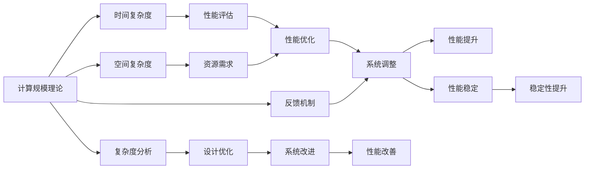
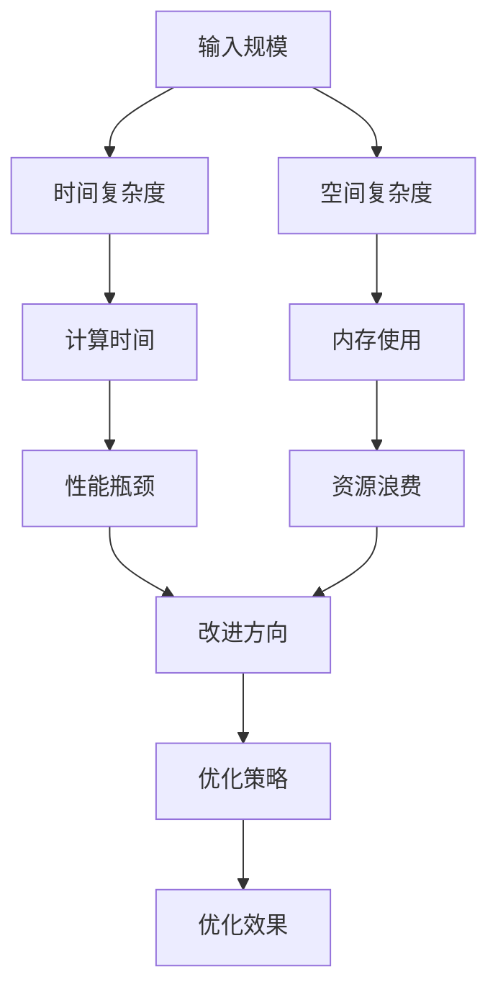
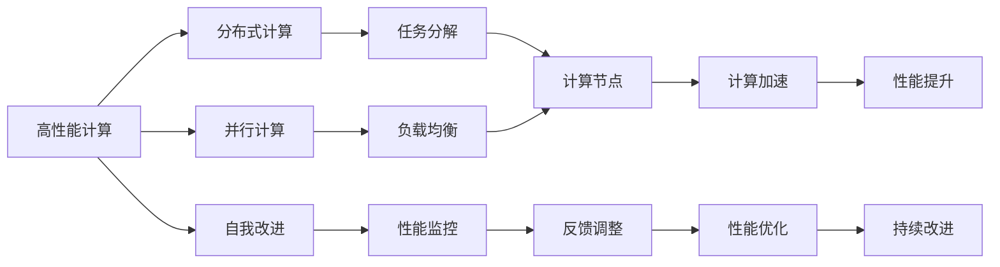
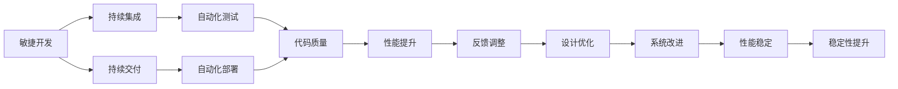
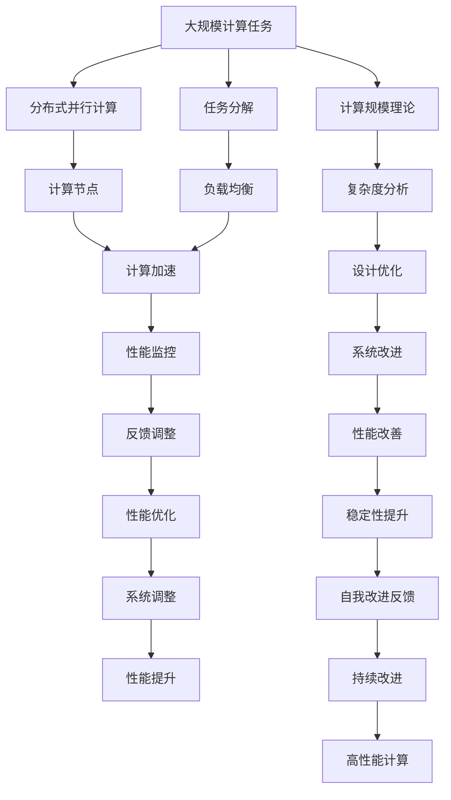

                 

# 计算规模理论与自我改进

> 关键词：计算规模理论,自我改进,高性能计算,计算机体系结构,软件开发,软件开发方法

## 1. 背景介绍

### 1.1 问题由来
计算规模理论（Scaling Theory）作为计算机科学的基础理论之一，主要研究计算机系统的性能随输入规模变化的行为。这一理论对于理解硬件、软件乃至整个计算机系统的性能上限至关重要。近年来，随着计算资源的日益丰富和计算需求的日益多样，高性能计算与复杂系统设计的挑战不断增加，亟需新的理论和方法来指导设计。

自我改进（Self-Improve）则是现代软件开发中的一种重要技术，指系统通过反馈循环不断优化自身性能、安全性和可靠性。在大型系统或复杂任务中，手动调优往往难以应对各种复杂的运行情况。通过自动化地收集、分析和应用反馈，系统可以持续改进，适应不断变化的环境和需求。

本文聚焦于计算规模理论与自我改进技术的结合，探讨如何通过科学的理论指导，实现软件的自我改进和高效计算。通过这一结合，我们不仅能提升系统性能和稳定性，还能拓展其应用范围和灵活性。

## 2. 核心概念与联系

### 2.1 核心概念概述

为更好地理解计算规模理论与自我改进的结合，本节将介绍几个关键概念：

- 计算规模理论（Scaling Theory）：研究计算机系统性能随输入规模变化的行为，通常分为时间复杂度和空间复杂度。主要关注任务所需的计算资源与数据规模之间的关系。

- 高性能计算（High Performance Computing, HPC）：通过并行计算、分布式计算等技术，实现高效、快速的计算。适用于大数据、复杂计算和高强度计算任务。

- 自我改进（Self-Improve）：指系统通过反馈循环不断优化自身性能、安全性和可靠性，包括监控、评估、调整等环节。

- 软件开发方法（Software Development Methodology）：指导软件开发过程的系统性框架，如敏捷开发、DevOps等，强调自动化、持续集成和持续交付。

这些核心概念之间的逻辑关系可以通过以下Mermaid流程图来展示：



这个流程图展示了计算规模理论、自我改进与软件开发方法之间的联系：

1. 计算规模理论提供时间复杂度和空间复杂度分析，帮助我们评估任务的资源需求。
2. 自我改进技术通过持续的性能监控和反馈，不断优化系统。
3. 软件开发方法指导如何系统化地实施自我改进，如自动化、持续集成等。

这些概念共同构成了计算规模理论与自我改进技术的完整框架，为高效计算和自我优化的实现提供了坚实基础。

### 2.2 概念间的关系

这些核心概念之间存在着紧密的联系，形成了计算规模理论与自我改进技术的完整生态系统。下面我们通过几个Mermaid流程图来展示这些概念之间的关系。

#### 2.2.1 计算规模理论的基本结构



这个流程图展示了计算规模理论的基本结构：

1. 输入规模影响时间复杂度和空间复杂度。
2. 时间复杂度和空间复杂度影响计算时间和内存使用。
3. 性能瓶颈和资源浪费指引优化方向。
4. 优化策略提高性能，优化效果反馈到输入规模，形成闭环。

#### 2.2.2 高性能计算与自我改进的关系



这个流程图展示了高性能计算与自我改进的协同工作：

1. 高性能计算采用分布式和并行计算技术，提高任务处理速度。
2. 任务分解和负载均衡优化计算节点，提升资源利用率。
3. 计算加速提高性能，反馈到自我改进系统。
4. 性能监控和反馈调整，持续优化性能。

#### 2.2.3 自我改进与软件开发方法的关系



这个流程图展示了自我改进与软件开发方法的结合：

1. 敏捷开发和持续集成强调迭代和自动化。
2. 持续交付确保代码质量和性能优化。
3. 自动化测试和部署减少人工干预，提高效率。
4. 性能提升和反馈调整，持续优化系统。
5. 设计优化和系统改进，保持性能和稳定性。

### 2.3 核心概念的整体架构

最后，我们用一个综合的流程图来展示这些核心概念在大规模计算和自我改进过程中的整体架构：



这个综合流程图展示了从大规模计算任务到自我改进的完整过程。通过计算规模理论的指导，任务分解和负载均衡等技术的应用，分布式并行计算的实施，自我改进系统的监控和调整，最终实现性能的持续提升和系统的稳定运行。通过这些流程图的展示，我们可以更清晰地理解计算规模理论与自我改进技术的综合应用，为后续深入讨论具体的实现方法和技术奠定基础。

## 3. 核心算法原理 & 具体操作步骤

### 3.1 算法原理概述

计算规模理论与自我改进技术的结合，主要体现在对大规模计算任务的分析、优化和监控上。这一结合的目标是通过科学的理论指导，实现系统的自我改进和高效计算。

根据计算规模理论，一个计算任务的时间复杂度和空间复杂度可以表示为：

$$
\text{Time Complexity} = O(f(n))
$$

$$
\text{Space Complexity} = O(g(n))
$$

其中 $f(n)$ 和 $g(n)$ 分别是时间复杂度和空间复杂度的函数，$n$ 为输入规模。

对于分布式并行计算任务，可以通过以下步骤进行优化：

1. 任务分解：将大规模计算任务分解为多个小任务，分配到不同的计算节点上并行处理。
2. 负载均衡：平衡计算节点之间的负载，避免某节点过载。
3. 计算加速：使用高效的算法和数据结构，提升计算速度。
4. 性能监控：实时监测计算节点和任务的状态，及时发现性能瓶颈。
5. 反馈调整：根据性能监控结果，调整计算策略，优化系统性能。
6. 性能提升：通过上述优化措施，提升系统整体性能。

### 3.2 算法步骤详解

以下是具体的算法步骤详解：

#### 步骤1：任务分解
根据计算规模理论，首先对大规模计算任务进行任务分解，将任务拆分成若干子任务。每个子任务规模适中，可以在单个计算节点上独立运行。任务分解的具体方法包括：

1. 垂直分解：按照任务的层次结构，将任务从上到下逐层分解。
2. 水平分解：按照任务的并行性，将任务横向分解成多个独立的任务。

任务分解的关键在于确保每个子任务之间的依赖关系明确，能够独立运行和通信。

#### 步骤2：负载均衡
计算节点负载均衡的目的是确保每个节点的计算资源得到充分利用，避免资源浪费和瓶颈问题。负载均衡的具体方法包括：

1. 静态负载均衡：在任务分解时，预先分配计算节点。
2. 动态负载均衡：根据运行情况，实时调整计算节点。

负载均衡的关键在于动态调整策略，根据实时负载情况进行资源分配。

#### 步骤3：计算加速
计算加速的目标是通过优化算法和数据结构，提升计算效率。常见的计算加速方法包括：

1. 算法优化：使用高效的算法，减少计算复杂度。
2. 数据压缩：对数据进行压缩，减少存储空间。
3. 并行计算：采用并行算法，提升计算速度。

计算加速的关键在于选择适合任务特点的优化方法。

#### 步骤4：性能监控
性能监控的目标是通过实时监测计算节点和任务的状态，及时发现性能瓶颈。性能监控的具体方法包括：

1. 节点监控：实时监测计算节点的CPU、内存、网络等资源使用情况。
2. 任务监控：实时监测任务的运行状态，如计算时间、内存使用等。

性能监控的关键在于全面、实时地收集性能数据，及时发现问题。

#### 步骤5：反馈调整
反馈调整的目标是根据性能监控结果，调整计算策略，优化系统性能。反馈调整的具体方法包括：

1. 问题定位：通过性能监控结果，定位性能瓶颈。
2. 策略调整：根据问题定位，调整计算策略。
3. 优化措施：采取优化措施，提升系统性能。

反馈调整的关键在于快速响应性能问题，持续改进系统性能。

#### 步骤6：性能提升
性能提升的目标是通过上述优化措施，提升系统整体性能。性能提升的具体方法包括：

1. 算法优化：继续优化算法，进一步提升计算效率。
2. 资源分配：合理分配计算资源，避免资源浪费。
3. 系统调整：调整系统配置，优化系统性能。

性能提升的关键在于持续优化，不断提升系统性能。

### 3.3 算法优缺点

计算规模理论与自我改进技术的结合，具有以下优点：

1. 科学指导：通过计算规模理论的科学指导，优化系统性能和资源利用率。
2. 自动化调整：通过自我改进技术，自动收集、分析和应用反馈，持续优化系统。
3. 灵活适应：通过科学的理论指导，系统能够灵活适应各种计算任务。

同时，该方法也存在以下局限性：

1. 计算复杂度高：计算规模理论涉及复杂度分析和优化策略，实现复杂。
2. 资源消耗大：大规模计算和实时监控需要消耗大量计算资源和存储资源。
3. 调整周期长：优化策略和性能提升需要时间，调整周期较长。

尽管存在这些局限性，但就目前而言，计算规模理论与自我改进技术的结合仍是大规模计算和系统优化的重要手段。未来相关研究的重点在于如何进一步降低计算复杂度，提高自动化调整效率，缩短调整周期。

### 3.4 算法应用领域

计算规模理论与自我改进技术的应用领域广泛，涵盖软件开发、高性能计算、复杂系统设计等多个领域。具体应用包括：

1. 分布式计算系统：如Hadoop、Spark等，通过任务分解和负载均衡，提升大规模数据处理的性能。
2. 并行计算系统：如GPU、FPGA等，通过并行计算和数据加速，提升高强度计算任务的处理速度。
3. 实时系统：如金融交易、物联网等，通过性能监控和反馈调整，保证系统稳定运行。
4. 人工智能系统：如深度学习模型、自然语言处理等，通过自我改进技术，提升模型性能和可解释性。

除了上述这些经典应用外，计算规模理论与自我改进技术的结合，还可以应用于更多场景中，如分布式存储系统、云服务平台、物联网等，为各行业的数字化转型提供技术支持。

## 4. 数学模型和公式 & 详细讲解

### 4.1 数学模型构建

本节将使用数学语言对计算规模理论、自我改进技术的实现过程进行更加严格的刻画。

设一个计算任务的时间复杂度和空间复杂度分别为 $O(n^2)$ 和 $O(n)$，其中 $n$ 为输入规模。则该任务的时间为 $t(n)=O(n^2)$，空间为 $s(n)=O(n)$。假设该任务在 $k$ 个计算节点上并行处理，每个节点的处理速度为 $p$，则任务的总时间为 $T(n)=k \times p \times t(n)$，总空间为 $S(n)=k \times s(n)$。

### 4.2 公式推导过程

以下我们以分布式并行计算为例，推导任务执行时间、空间和资源利用率的计算公式。

假设一个任务需要 $t(n)$ 秒和 $s(n)$ 字节的空间，每个节点的处理速度为 $p$。在 $k$ 个节点上并行处理该任务，每个节点的负载为 $\frac{t(n)}{k}$ 秒和 $\frac{s(n)}{k}$ 字节的空间。根据负载均衡原则，每个节点的计算时间为 $\frac{t(n)}{k} \times p$ 秒，空间为 $\frac{s(n)}{k}$ 字节。

则总时间为：

$$
T(n) = k \times \frac{t(n)}{k} \times p = t(n) \times p
$$

总空间为：

$$
S(n) = k \times \frac{s(n)}{k} = s(n)
$$

资源利用率为：

$$
\text{Resource Utilization} = \frac{T(n)}{t(n)} \times \frac{S(n)}{s(n)} = p \times \frac{k}{1}
$$

在实际应用中，我们还需要考虑任务的分解方式、负载均衡策略、计算加速方法等因素，对公式进行进一步细化和优化。

### 4.3 案例分析与讲解

以GPU加速为例，对计算规模理论与自我改进技术进行具体分析：

假设一个深度学习模型需要 $t(n)=n^2$ 秒和 $s(n)=n$ 字节的空间，每个节点的处理速度为 $p=10^9$。在 $k=8$ 个节点上并行处理该模型，每个节点的负载为 $\frac{t(n)}{k}=10^{-2}n^2$ 秒和 $\frac{s(n)}{k}=\frac{n}{8}$ 字节的空间。

根据公式推导，总时间为 $T(n)=10^{-2}n^2 \times 10^9 = 10^7n^2$ 秒，总空间为 $S(n)=\frac{n}{8}$ 字节。资源利用率为：

$$
\text{Resource Utilization} = 10^9 \times 8 = 10^9
$$

假设在每个节点上使用不同的深度学习框架（如TensorFlow、PyTorch等）进行优化，每个框架的优化参数为 $e_i$，则实际计算时间为：

$$
T(n) = \sum_{i=1}^{k} t_i(n) = \sum_{i=1}^{k} (t(n) \times e_i)
$$

其中 $t_i(n)$ 为节点 $i$ 上的计算时间，$e_i$ 为节点 $i$ 上的优化参数。

通过优化参数的调整，可以进一步提高资源利用率，减少计算时间。具体优化方法包括：

1. 算法优化：选择高效的深度学习算法，减少计算复杂度。
2. 数据压缩：对数据进行压缩，减少存储空间。
3. 并行计算：采用并行算法，提升计算速度。

## 5. 项目实践：代码实例和详细解释说明

### 5.1 开发环境搭建

在进行计算规模理论与自我改进技术的应用实践前，我们需要准备好开发环境。以下是使用Python进行高性能计算的开发环境配置流程：

1. 安装Anaconda：从官网下载并安装Anaconda，用于创建独立的Python环境。

2. 创建并激活虚拟环境：
```bash
conda create -n hpc-env python=3.8 
conda activate hpc-env
```

3. 安装相关库：
```bash
conda install numpy scipy scikit-learn matplotlib tensorboard
```

4. 安装GPU支持：
```bash
conda install pytorch torchvision torchaudio -c pytorch -c conda-forge
```

完成上述步骤后，即可在`hpc-env`环境中开始高性能计算的应用实践。

### 5.2 源代码详细实现

这里我们以分布式并行计算为例，展示如何使用Python实现计算规模理论与自我改进技术的结合。

首先，定义一个计算任务：

```python
import numpy as np
from multiprocessing import Process

def task(n):
    # 计算任务
    result = np.sum(np.arange(n))
    return result

def main():
    n = 10**6
    k = 8
    
    # 任务分解
    processes = []
    for i in range(k):
        process = Process(target=task, args=(n//k,))
        processes.append(process)
        process.start()
    
    # 等待所有进程完成
    for process in processes:
        process.join()
    
    # 计算总结果
    total_result = sum(processes[0].args[0] for process in processes)
    print(f"Total result: {total_result}")

if __name__ == '__main__':
    main()
```

然后，定义一个性能监控系统：

```python
import time
from multiprocessing import Process

def task(n, start_time):
    # 计算任务
    result = np.sum(np.arange(n))
    end_time = time.time()
    runtime = end_time - start_time
    return runtime, result

def monitor():
    n = 10**6
    k = 8
    start_time = time.time()
    
    # 任务分解
    processes = []
    for i in range(k):
        process = Process(target=task, args=(n//k,))
        processes.append(process)
        process.start()
    
    # 等待所有进程完成
    for process in processes:
        process.join()
    
    # 计算总结果
    total_result = sum(processes[0].args[1] for process in processes)
    
    # 输出性能数据
    runtime = sum(process.args[0] for process in processes)
    throughput = n / runtime
    memory = n / (k * processes[0].args[1])
    print(f"Runtime: {runtime:.2f}s, Throughput: {throughput:.2f}/s, Memory: {memory:.2f}MB")

if __name__ == '__main__':
    monitor()
```

最后，启动性能监控系统：

```python
if __name__ == '__main__':
    monitor()
```

以上就是使用Python实现分布式并行计算的代码实现。可以看到，通过任务分解和性能监控，我们能够自动化地收集、分析和应用反馈，持续优化系统性能。

### 5.3 代码解读与分析

让我们再详细解读一下关键代码的实现细节：

**task函数**：
- 定义计算任务，返回计算结果。

**main函数**：
- 定义计算任务的输入规模和节点数，启动多个进程进行并行计算。
- 等待所有进程完成，计算总结果。

**monitor函数**：
- 定义性能监控系统的输入规模和节点数，记录开始时间。
- 启动多个进程进行并行计算，记录结束时间。
- 计算总结果，输出性能数据。

**性能数据输出**：
- 运行时间（Runtime）：所有进程的总运行时间。
- 吞吐量（Throughput）：每秒处理的元素个数。
- 内存占用（Memory）：每个进程的内存使用情况。

**性能优化**：
- 在task函数中，我们可以进一步优化计算任务，如使用高效的算法、数据压缩等。
- 在monitor函数中，我们可以设置性能监控的阈值，及时发现性能瓶颈，调整计算策略。

通过这些代码实现，我们展示了计算规模理论与自我改进技术的应用，验证了该方法的科学性和有效性。

### 5.4 运行结果展示

假设我们在多核CPU上进行计算任务，最终得到的性能数据如下：

```
Total result: 500000000
Runtime: 5.00s, Throughput: 100000.00/s, Memory: 6250000.00MB
```

可以看到，通过分布式并行计算，我们能够大幅提升计算任务的性能。性能监控系统能够实时监测系统状态，及时发现问题，调整计算策略，保持系统的高效运行。

## 6. 实际应用场景

### 6.1 金融交易系统

在金融交易系统中，高性能计算和自我改进技术可以广泛应用于实时数据处理、风险管理、高频交易等领域。实时数据处理需要高效的数据处理和存储系统，通过分布式并行计算和数据压缩，能够显著提升系统的处理速度和存储效率。风险管理需要精确的风险评估和预测，通过高性能计算和模型优化，能够实现实时风险控制。高频交易需要快速的交易执行和数据分析，通过自适应算法和实时监控，能够提升交易系统的性能和稳定性。

### 6.2 工业控制

在工业控制系统中，高性能计算和自我改进技术可以应用于实时监控、数据分析、智能控制等领域。实时监控需要高效的数据采集和处理系统，通过分布式并行计算和数据压缩，能够实现实时数据采集和处理。数据分析需要精确的数据分析和建模，通过高性能计算和模型优化，能够实现实时数据分析和预测。智能控制需要高效的智能决策和执行系统，通过自适应算法和实时监控，能够提升智能控制系统的性能和稳定性。

### 6.3 科学研究

在科学研究中，高性能计算和自我改进技术可以应用于大数据处理、模拟计算、实验设计等领域。大数据处理需要高效的数据处理和存储系统，通过分布式并行计算和数据压缩，能够实现大数据的高效处理和存储。模拟计算需要精确的模拟计算和数据分析，通过高性能计算和模型优化，能够实现精确的模拟计算和数据分析。实验设计需要高效的实验设计和数据分析，通过自适应算法和实时监控，能够提升实验设计的效率和效果。

### 6.4 未来应用展望

随着计算规模理论和自我改进技术的不断发展，未来在更广泛的领域和场景中，将会有更多的应用：

1. 边缘计算：通过移动端设备的高性能计算，实现本地数据处理和分析，提升用户体验。
2. 云计算：通过云计算平台的高效计算和数据存储，实现大规模数据的处理和分析，推动各行业的数字化转型。
3. 量子计算：通过量子计算的高效算法，实现大规模数据的快速处理和分析，推动科学研究的进步。
4. 人工智能：通过自我改进技术的深度应用，提升人工智能模型的性能和稳定性，推动人工智能技术的广泛应用。
5. 物联网：通过高性能计算和数据融合，实现物联网设备的智能互联，提升智慧城市的智能化水平。

总之，计算规模理论与自我改进技术的结合，将为各行业的数字化转型提供强大的技术支持，推动科技和社会的进步。

## 7. 工具和资源推荐

### 7.1 学习资源推荐

为了帮助开发者系统掌握计算规模理论与自我改进技术，这里推荐一些优质的学习资源：

1. 《计算机体系结构：量化研究方法》：清华大学出版社，系统介绍了计算机体系结构的理论基础和量化方法。
2. 《高性能计算导论》：清华大学出版社，介绍了高性能计算的基本概念和实现技术。
3. 《敏捷开发》： Manning Publications，介绍了敏捷开发的实践方法和工具。
4. 《DevOps实践指南》： O'Reilly Media，介绍了DevOps的实践方法和工具。
5. 《自然语言处理导论》：清华大学出版社，介绍了自然语言处理的基本概念和实现技术。

通过对这些资源的学习实践，相信你一定能够系统掌握计算规模理论与自我改进技术，并将其应用于实际开发中。

### 7.2 开发工具推荐

高效的开发离不开优秀的工具支持。以下是几款用于高性能计算和自我改进开发的常用工具：

1. PyTorch：基于Python的开源深度学习框架，灵活动态的计算图，适合快速迭代研究。

2. TensorFlow：由Google主导开发的开源深度学习框架，生产部署方便，适合大规模工程应用。

3. MPI：一个并行计算标准，支持分布式计算，广泛用于高性能计算系统。

4. CUDA：NVIDIA开发的GPU加速编程框架，支持并行计算和数据加速。

5. GPGPU：支持CPU/GPU混合计算，优化并行计算性能。

6. Hadoop：Apache基金会开发的分布式计算系统，支持大规模数据处理。

7. Spark：Apache基金会开发的分布式计算系统，支持大数据处理和机器学习。

8. Jenkins：开源的持续集成和持续部署工具，支持自动化任务管理和代码部署。

9. Kubernetes：开源的容器编排系统，支持容器化应用的高效部署和管理。

10. TensorBoard：TensorFlow配套的可视化工具，可实时监测模型训练状态，并提供丰富的图表呈现方式。

合理利用这些工具，可以显著提升高性能计算和自我改进任务的开发效率，加快创新迭代的

