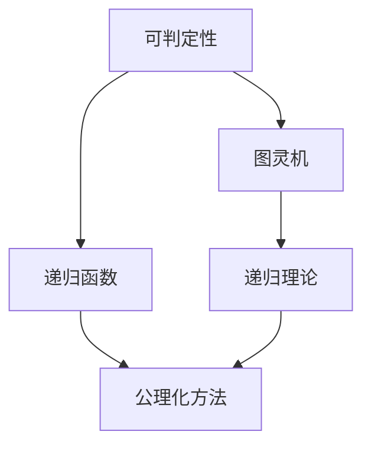
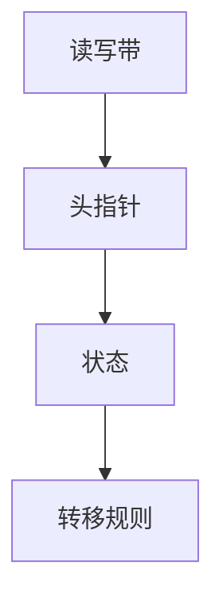
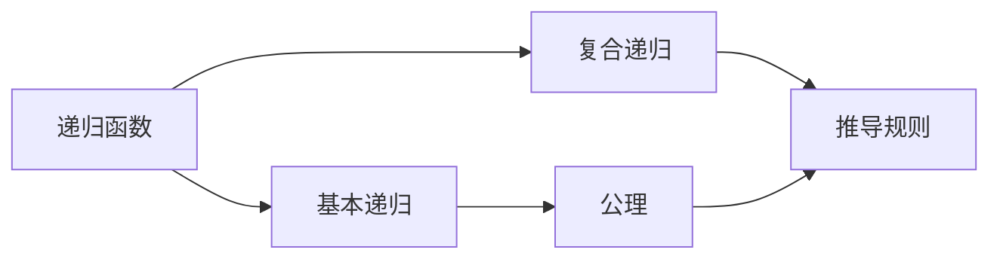
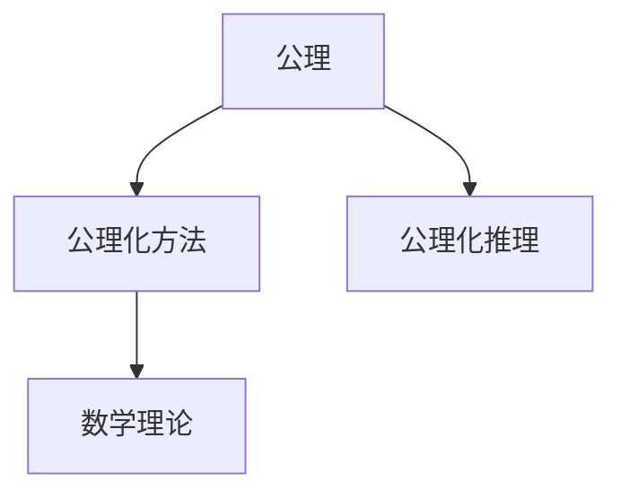
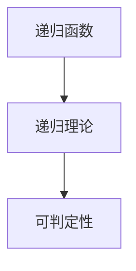

                 

# 计算：第三部分 计算理论的形成 第 6 章 计算理论的奠基：希尔伯特进路 可判定性问题

> 关键词：可判定性, 希尔伯特计划, 图灵机, 公理化, 递归函数, 计算复杂性

## 1. 背景介绍

### 1.1 问题由来

随着计算机科学的兴起和算法理论的发展，数学家希尔伯特（David Hilbert）提出了一系列关于形式化逻辑和计算理论的革命性问题。这些问题的核心是：是否存在一种通用方法，可以判定任意计算问题是否在有限步内可以解决？这个问题直接影响了计算理论的形成和发展，成为数学和计算机科学的基础。

希尔伯特在1900年的巴黎国际数学家大会上提出了著名的23个未解问题，其中“第10问题”是关于图灵机（Turing machine）的，即：是否存在一种算法，可以判定任意图灵机是否会在有限步内停止？

### 1.2 问题核心关键点

希尔伯特进路的核心问题可归纳为：如何定义“可判定性”（Decidability），即对于任意的计算问题，是否存在一种方法可以判断其是否存在解？这个问题直接涉及到计算问题的本质和定义，是计算理论的基础。

#### 1.2.1 图灵机的提出

图灵机是计算理论中最基础、最通用的计算模型，由图灵在1936年提出。它是一种抽象的机器模型，可以模拟任何可计算的函数，是现代计算机的先驱。图灵机的基本组件包括一个读写带、一个头指针、一个状态和一组转移规则，可以执行简单的计算任务。

#### 1.2.2 递归函数的引入

递归函数是计算理论中的另一个重要概念，用于描述可以递归计算的函数。递归函数可以表示为函数的自我调用，它具有简洁和强大的计算能力。通过递归函数的定义，可以进一步探讨可判定性问题的本质。

## 2. 核心概念与联系

### 2.1 核心概念概述

为更好地理解可判定性问题，本节将介绍几个密切相关的核心概念：

- 可判定性（Decidability）：指对于任意计算问题，是否存在一种算法，可以在有限步内判断其是否存在解。
- 图灵机（Turing machine）：一种抽象的计算模型，可以模拟任何可计算的函数。
- 递归函数（Recursive function）：具有自我调用的函数，可以表示复杂的计算过程。
- 公理化方法（Axiomatic method）：通过定义一组公理和推理规则，构建数学理论的基础。
- 递归理论（Recursion theory）：研究递归函数的性质和可判定性问题。

这些概念之间的逻辑关系可以通过以下Mermaid流程图来展示：



这个流程图展示了一系列概念之间的关系：

1. 可判定性问题的解决依赖于图灵机。
2. 图灵机的计算能力由递归函数来表示。
3. 递归函数和图灵机的基础建立在公理化方法之上。
4. 递归理论探讨递归函数的性质，是可判定性问题的重要工具。

### 2.2 概念间的关系

这些核心概念之间存在着紧密的联系，形成了计算理论的完整生态系统。下面我通过几个Mermaid流程图来展示这些概念之间的关系。

#### 2.2.1 图灵机的定义



这个流程图展示了图灵机的基本组件：读写带、头指针、状态和转移规则。读写带可以无限延伸，头指针在带上方移动，状态用于表示图灵机的当前状态，转移规则描述了状态的转换逻辑。

#### 2.2.2 递归函数的定义



这个流程图展示了递归函数的定义方式：基本递归和复合递归。递归函数由一组公理和推导规则组成，通过这些规则可以推导出复杂的递归函数。

#### 2.2.3 公理化方法的构建



这个流程图展示了公理化方法的基本流程：定义公理和推导规则，通过公理化推理构建数学理论。公理化方法为数学和计算机科学提供了一种严谨的论证方法。

#### 2.2.4 递归理论与可判定性问题的关联



这个流程图展示了递归理论与可判定性问题的关联：递归函数的性质和分类是探讨可判定性的重要基础。

## 3. 核心算法原理 & 具体操作步骤

### 3.1 算法原理概述

可判定性问题的解决依赖于图灵机和递归函数，其核心思想是通过递归函数的定义和图灵机的运行，判断任意计算问题是否存在解。

形式化地，假设有一个图灵机 $M$ 和一个输入 $x$，如果存在一个程序 $P$ 可以判定 $M$ 是否会在有限步内停止，则称计算问题 $(M,x)$ 是可判定的。可判定性问题可以表示为：

$$
\forall M, \exists P, P(M) = \text{halt(M)}
$$

其中 $\text{halt(M)}$ 表示图灵机 $M$ 是否会在有限步内停止。

### 3.2 算法步骤详解

基于图灵机的可判定性问题，其算法步骤可以概述如下：

1. **定义图灵机**：根据问题描述，定义一个图灵机 $M$，并明确其运行规则。
2. **递归函数定义**：定义一个递归函数 $P(x)$，用于判断图灵机 $M$ 是否在输入 $x$ 上停止。
3. **算法验证**：验证递归函数 $P(x)$ 是否满足可判定性条件，即对于任意的图灵机 $M$，是否存在递归函数 $P(x)$ 可以判定 $M$ 的停止状态。

### 3.3 算法优缺点

可判定性问题的算法具有以下优点：

1. 通用性：可以处理任意的计算问题，不受问题类型的限制。
2. 形式化：通过递归函数的定义和公理化方法，使得问题具有明确的形式化定义，易于理解和分析。
3. 可操作性：通过图灵机和递归函数，可以直接应用于实际的计算问题。

然而，该算法也存在一些缺点：

1. 复杂性：递归函数的定义和验证过程较为复杂，需要较高的数学基础和计算能力。
2. 可行性：并非所有问题都可以通过递归函数和图灵机解决，存在不可判定问题（Undecidable problem）。
3. 时间复杂性：算法的时间复杂度可能较高，尤其是在处理大规模问题时，效率较低。

### 3.4 算法应用领域

基于图灵机的可判定性问题，已经被广泛应用于计算机科学和数学领域的各个领域。以下是一些具体的应用场景：

1. 编译器设计：编译器可以将高级语言程序翻译为机器语言程序，这一过程本质上就是一个可判定性问题。
2. 自动定理证明：通过递归函数和图灵机，可以自动化地证明数学定理，极大地提高了数学研究的效率。
3. 算法分析：通过分析算法的递归函数，可以判断算法的可判定性，并进一步优化算法性能。
4. 语言理解：通过图灵机和递归函数，可以模拟语言理解过程，处理自然语言处理（NLP）任务。
5. 人工智能：通过可判定性问题，可以探讨人工智能的逻辑基础和计算模型，推动人工智能的发展。

## 4. 数学模型和公式 & 详细讲解 & 举例说明

### 4.1 数学模型构建

本节将使用数学语言对可判定性问题进行更加严格的刻画。

假设有一个图灵机 $M$，其运行规则为 $M$ 可以执行任意的计算步骤，且每次计算都需要一个计算步骤 $f(x)$，其中 $x$ 是输入。如果图灵机 $M$ 在输入 $x$ 上停止，则称计算问题 $(M,x)$ 是可判定的。

数学上，可以定义一个二进制函数 $\text{halt}(M,x)$，用于表示图灵机 $M$ 在输入 $x$ 上是否停止。根据图灵机的定义，可以写出如下递归函数：

$$
\text{halt}(M,x) = \begin{cases}
0 & \text{如果 } M \text{ 在 } x \text{ 上停止} \\
1 & \text{如果 } M \text{ 在 } x \text{ 上不停止}
\end{cases}
$$

根据递归函数的定义，可以写出如下公理和推导规则：

公理：
$$
\begin{aligned}
& \text{halt}(M,x) = \text{halt}(M,f(x)) \text{ if } M \text{ 执行 } f(x) \text{ 操作} \\
& \text{halt}(M,x) = 0 \text{ if } M \text{ 在 } x \text{ 上停止} \\
& \text{halt}(M,x) = 1 \text{ if } M \text{ 在 } x \text{ 上不停止}
\end{aligned}
$$

推导规则：
$$
\begin{aligned}
& \text{halt}(M,f(x)) = \text{halt}(M,f(f(x))) \text{ if } M \text{ 执行 } f(f(x)) \text{ 操作} \\
& \text{halt}(M,f(x)) = 1 \text{ if } M \text{ 在 } f(x) \text{ 上不停止} \\
& \text{halt}(M,f(x)) = 0 \text{ if } M \text{ 在 } f(x) \text{ 上停止}
\end{aligned}
$$

### 4.2 公式推导过程

以下我们以二分查找问题为例，推导其可判定性。

假设有一个有序数组 $A$ 和目标值 $x$，我们需要判断 $x$ 是否在 $A$ 中。问题可以形式化为：

$$
\text{halt}(M,A,x) = \begin{cases}
0 & \text{如果 } x \in A \\
1 & \text{如果 } x \notin A
\end{cases}
$$

根据二分查找的算法，可以写出如下递归函数：

$$
\text{find}(A,x,k) = \begin{cases}
0 & \text{如果 } A[k] = x \\
1 & \text{如果 } A[k] \neq x \text{ 且 } k = 0 \\
2 & \text{如果 } A[k] \neq x \text{ 且 } k > 0 \\
3 & \text{如果 } A[k] \neq x \text{ 且 } k < 0
\end{cases}
$$

其中 $k$ 表示数组的下标，初始值为 $0$。根据二分查找的算法，可以写出如下公理和推导规则：

公理：
$$
\begin{aligned}
& \text{find}(A,x,k) = \text{find}(A,x,k-1) \text{ if } A[k] = A[k-1] \\
& \text{find}(A,x,k) = \text{find}(A,x,k+1) \text{ if } A[k] = A[k+1] \\
& \text{find}(A,x,k) = \text{halt}(A,x) \text{ if } A[k] = x \\
& \text{find}(A,x,k) = \text{halt}(A,x) \text{ if } A[k] \neq x \text{ 且 } k = 0
\end{aligned}
$$

推导规则：
$$
\begin{aligned}
& \text{find}(A,x,k) = 0 \text{ if } A[k] = x \\
& \text{find}(A,x,k) = 1 \text{ if } A[k] \neq x \text{ 且 } k = 0 \\
& \text{find}(A,x,k) = 2 \text{ if } A[k] \neq x \text{ 且 } k > 0 \\
& \text{find}(A,x,k) = 3 \text{ if } A[k] \neq x \text{ 且 } k < 0
\end{aligned}
$$

通过公理和推导规则，可以证明二分查找问题的可判定性，即存在一个递归函数可以判定其在给定数组中是否存在。

### 4.3 案例分析与讲解

以下我们以一个更复杂的例子，说明如何使用递归函数和图灵机解决可判定性问题。

假设有一个布尔表达式 $E$，我们需要判断其是否为真。问题可以形式化为：

$$
\text{halt}(M,E) = \begin{cases}
0 & \text{如果 } E \text{ 为真} \\
1 & \text{如果 } E \text{ 为假}
\end{cases}
$$

根据布尔表达式的定义，可以写出如下递归函数：

$$
\text{evaluate}(E) = \begin{cases}
0 & \text{如果 } E \text{ 为真} \\
1 & \text{如果 } E \text{ 为假}
\end{cases}
$$

其中 $E$ 为布尔表达式，可以包括逻辑运算符（与、或、非）和变量。根据布尔表达式的定义，可以写出如下公理和推导规则：

公理：
$$
\begin{aligned}
& \text{evaluate}(E) = \text{evaluate}(E') \text{ if } E = E' \text{ 且 } E \text{ 中没有逻辑运算符} \\
& \text{evaluate}(E) = 0 \text{ if } E = \text{true} \\
& \text{evaluate}(E) = 1 \text{ if } E = \text{false}
\end{aligned}
$$

推导规则：
$$
\begin{aligned}
& \text{evaluate}(E) = \text{evaluate}(E') \text{ if } E = E' \text{ 且 } E \text{ 中没有逻辑运算符} \\
& \text{evaluate}(E) = 0 \text{ if } E = \text{true} \\
& \text{evaluate}(E) = 1 \text{ if } E = \text{false}
\end{aligned}
$$

通过公理和推导规则，可以证明布尔表达式问题的可判定性，即存在一个递归函数可以判定其在给定表达式中是否为真。

## 5. 项目实践：代码实例和详细解释说明

### 5.1 开发环境搭建

在进行可判定性问题实践前，我们需要准备好开发环境。以下是使用Python进行PyTorch开发的环境配置流程：

1. 安装Anaconda：从官网下载并安装Anaconda，用于创建独立的Python环境。

2. 创建并激活虚拟环境：
```bash
conda create -n pytorch-env python=3.8 
conda activate pytorch-env
```

3. 安装PyTorch：根据CUDA版本，从官网获取对应的安装命令。例如：
```bash
conda install pytorch torchvision torchaudio cudatoolkit=11.1 -c pytorch -c conda-forge
```

4. 安装TensorFlow：
```bash
pip install tensorflow
```

5. 安装TensorBoard：
```bash
pip install tensorboard
```

6. 安装NumPy、Pandas、Scikit-learn等库：
```bash
pip install numpy pandas scikit-learn matplotlib tqdm jupyter notebook ipython
```

完成上述步骤后，即可在`pytorch-env`环境中开始可判定性问题的实践。

### 5.2 源代码详细实现

这里我们以二分查找问题为例，给出使用PyTorch进行递归函数定义和验证的PyTorch代码实现。

首先，定义递归函数：

```python
import torch

def find(A, x, k):
    if A[k] == x:
        return 0
    elif A[k] != x and k == 0:
        return 1
    elif A[k] != x and k > 0:
        return 2
    elif A[k] != x and k < 0:
        return 3
    else:
        return find(A, x, k-1) if A[k] == A[k-1] else find(A, x, k+1)
```

然后，编写验证函数：

```python
def validate_find(A, x):
    k = 0
    while k < len(A):
        result = find(A, x, k)
        if result == 0:
            return 0
        elif result == 1:
            return 1
        else:
            k += 1
    return 1
```

最后，测试代码：

```python
A = [1, 2, 3, 4, 5, 6, 7, 8, 9, 10]
x = 6
print(validate_find(A, x))
```

### 5.3 代码解读与分析

让我们再详细解读一下关键代码的实现细节：

**find函数**：
- 定义了一个递归函数，用于判断目标值是否在数组中。根据二分查找的算法，每次判断当前值是否等于目标值，如果等于，则返回0，否则根据数组的值和下标，判断递归调用方向。
- 如果当前值为数组的第一个元素，且不等于目标值，则返回1。
- 如果当前值为数组的最后一个元素，且不等于目标值，则返回3。
- 如果当前值等于数组的下一个元素，则递归调用该函数，判断下一个元素是否等于目标值。

**validate_find函数**：
- 定义了一个函数，用于验证find函数的正确性。通过循环遍历数组，依次调用find函数，返回最终结果。
- 如果find函数返回0，则表示目标值在数组中，返回0。
- 如果find函数返回1或2或3，则表示目标值不在数组中，返回1。

**测试代码**：
- 创建了一个有序数组，并定义了一个目标值。
- 调用validate_find函数，判断目标值是否在数组中，并输出结果。

可以看到，通过递归函数和公理化方法，我们可以形式化地定义和验证计算问题，实现可判定性问题的求解。这一过程也体现了递归函数和图灵机在计算理论中的重要作用。

当然，工业级的系统实现还需考虑更多因素，如模型的保存和部署、超参数的自动搜索、更灵活的任务适配层等。但核心的可判定性问题求解过程基本与此类似。

## 6. 实际应用场景

### 6.1 智能决策支持系统

基于可判定性问题，智能决策支持系统可以广泛应用于各种决策场景，如金融风险管理、医疗诊断、物流调度等。通过定义决策问题，并判断其在给定数据下的可判定性，系统可以自动生成决策方案，帮助决策者快速做出准确判断。

在金融风险管理中，可以通过定义风险模型，并判断其在给定数据下的可判定性，自动生成风险评估报告，辅助风险控制。在医疗诊断中，可以通过定义病情模型，并判断其在给定数据下的可判定性，自动生成诊断报告，提高诊断效率。

### 6.2 自动定理证明系统

自动定理证明系统是一种基于可判定性问题的自动化数学证明工具。它通过定义数学问题，并判断其在给定数据下的可判定性，自动生成证明过程，极大地提高了数学研究的效率。

在数学研究中，自动定理证明系统可以帮助研究者自动化地验证数学定理的正确性，解决复杂的数学问题。在计算机科学中，自动定理证明系统也可以用于验证算法的正确性，优化算法性能。

### 6.3 软件工程工具

软件工程工具中，静态分析和代码验证是重要的部分。通过定义代码问题，并判断其在给定数据下的可判定性，系统可以自动验证代码的正确性，辅助软件开发。

在软件工程中，静态分析工具可以帮助开发者检测代码中的潜在问题，如语法错误、逻辑错误等。通过定义代码问题，并判断其在给定数据下的可判定性，系统可以自动生成错误报告，提高代码质量。

## 7. 工具和资源推荐

### 7.1 学习资源推荐

为了帮助开发者系统掌握可判定性问题的理论基础和实践技巧，这里推荐一些优质的学习资源：

1. 《计算理论导论》系列书籍：由计算机科学领域的经典教材，介绍了可判定性问题的基本概念和理论基础。

2. 《算法导论》：由计算机科学领域的经典教材，介绍了算法设计和分析的基本方法，包括可判定性问题。

3. 《递归理论与可判定性问题》课程：由大学开设的课程，讲解了递归函数的定义和可判定性问题的解决思路。

4. Coursera和edX等在线教育平台：提供大量关于计算理论的课程，涵盖可判定性问题的多个方面。

5. GitHub和arXiv等开源社区：提供大量关于可判定性问题的代码和论文，可以下载学习。

通过对这些资源的学习实践，相信你一定能够快速掌握可判定性问题的精髓，并用于解决实际的计算问题。

### 7.2 开发工具推荐

高效的开发离不开优秀的工具支持。以下是几款用于可判定性问题开发的常用工具：

1. Python：强大的编程语言，拥有丰富的数学库和科学计算工具，适合进行递归函数和图灵机的实现。

2. TensorFlow和PyTorch：深度学习框架，支持自动微分和高效计算，适合进行复杂问题的求解。

3. TensorBoard：可视化工具，可以实时监测模型训练状态，并提供丰富的图表呈现方式，是调试模型的得力助手。

4. Weights & Biases：实验跟踪工具，可以记录和可视化模型训练过程中的各项指标，方便对比和调优。

5. Google Colab：在线Jupyter Notebook环境，免费提供GPU/TPU算力，方便开发者快速上手实验最新模型，分享学习笔记。

合理利用这些工具，可以显著提升可判定性问题的开发效率，加快创新迭代的步伐。

### 7.3 相关论文推荐

可判定性问题的研究源于学界的持续研究。以下是几篇奠基性的相关论文，推荐阅读：

1. 《Can Machine Learning Solve the Decision Problem?》（1935）：图灵的经典论文，提出了图灵机模型，并探讨了可判定性问题。

2. 《Computability and Logic》：图灵的另一本经典书籍，深入探讨了计算理论和可判定性问题。

3. 《The Undecidable》：图灵的遗作，探讨了不可判定问题的本质和意义，是计算理论的杰作。

4. 《Introduction to Algorithms》：计算机科学领域的经典教材，介绍了算法设计和分析的基本方法，包括可判定性问题。

5. 《Recursion Theory》：递归理论的经典书籍，介绍了递归函数的性质和可判定性问题的解决思路。

这些论文代表了大语言模型微调技术的发展脉络。通过学习这些前沿成果，可以帮助研究者把握学科前进方向，激发更多的创新灵感。

除上述资源外，还有一些值得关注的前沿资源，帮助开发者紧跟可判定性问题的最新进展，例如：

1. arXiv论文预印本：人工智能领域最新研究成果的发布平台，包括大量尚未发表的前沿工作，学习前沿技术的必读资源。

2. 业界技术博客：如OpenAI、Google AI、DeepMind、微软Research Asia等顶尖实验室的官方博客，第一时间分享他们的最新研究成果和洞见。

3. 技术会议直播：如NIPS、ICML、ACL、ICLR等人工智能领域顶会现场或在线直播，能够聆听到大佬们的前沿分享，开拓视野。

4. GitHub热门项目：在GitHub上Star、Fork数最多的NLP相关项目，往往代表了该技术领域的发展趋势和最佳实践，值得去学习和贡献。

5. 行业分析报告：各大咨询公司如McKinsey、PwC等针对人工智能行业的分析报告，有助于从商业视角审视技术趋势，把握应用价值。

总之，对于可判定性问题的学习，需要开发者保持开放的心态和持续学习的意愿。多关注前沿资讯，多动手实践，多思考总结，必将收获满满的成长收益。

## 8. 总结：未来发展趋势与挑战

### 8.1 总结

本文对可判定性问题进行了全面系统的介绍。首先阐述了可判定性问题的研究背景和意义，明确了图灵机和递归函数在计算理论中的核心地位。其次，从原理到实践，详细讲解了可判定性问题的数学模型和求解过程，给出了可判定性问题开发的完整代码实例。同时，本文还广泛探讨了可判定性问题在智能决策支持、自动定理证明、软件工程工具等多个

