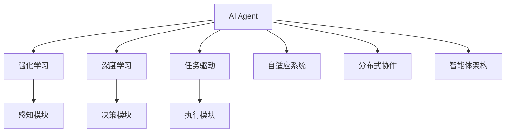
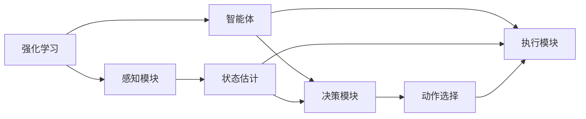
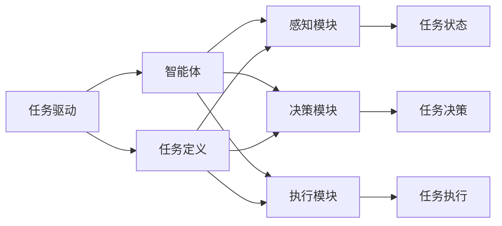
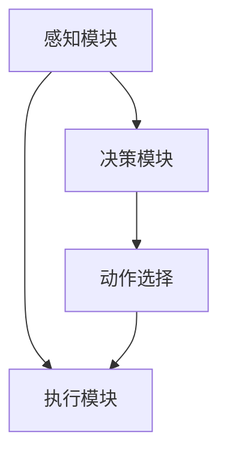
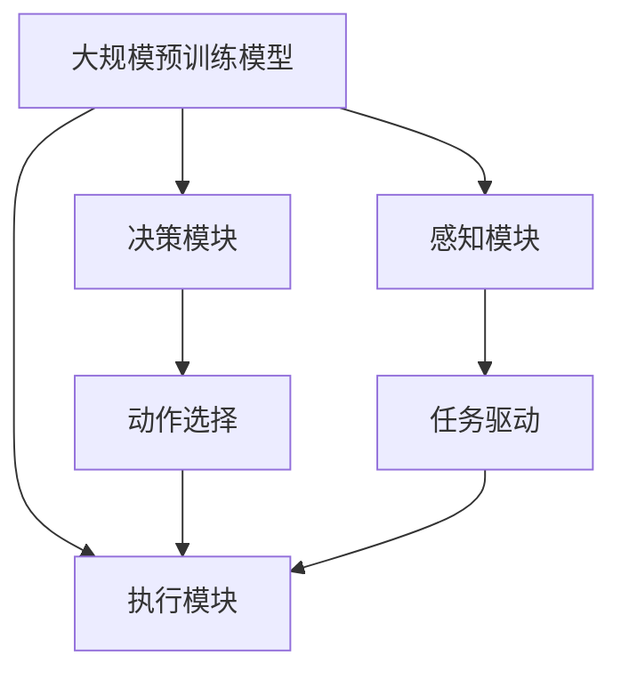

                 

# AI Agent: AI的下一个风口 大模型驱动的智能体

> 关键词：AI Agent,大模型,智能体,强化学习,深度学习,任务驱动,自适应系统,分布式协作,应用场景,未来展望

## 1. 背景介绍

### 1.1 问题由来

近年来，人工智能(AI)领域经历了爆炸式的发展，从传统的图像识别、语音识别等感知任务，到自然语言处理(NLP)、机器翻译等认知任务，再到智能推荐、无人驾驶等复杂的智能系统，AI技术的应用范围和深度不断拓展。然而，尽管技术不断进步，AI系统的智能化程度仍未能与人类相媲美，原因在于许多AI系统缺乏内在的自适应能力，无法与外部环境进行灵活的互动和协同。

为应对这一问题，智能体(Agent)应运而生。智能体是一种能够在复杂环境中自我感知、自我学习和自我适应的自主系统，能够通过与环境交互，逐步优化其行为策略，实现自主决策和执行。智能体技术与深度学习、强化学习等AI技术紧密结合，旨在构建更加智能、自适应、高效的系统，推动AI技术向更广泛的应用场景迈进。

### 1.2 问题核心关键点

智能体技术的应用，使得AI系统具备了更强的自主性和灵活性，从而在诸如智能交通、智能医疗、智能制造、智能客服等多个领域展现出巨大潜力。然而，如何构建高效、自适应、可靠、安全的智能体系统，仍然是当前面临的核心挑战。

具体来说，核心问题包括：

- 如何构建具有自主学习能力的智能体，使其能够主动探索环境并优化行为策略？
- 如何设计鲁棒性强的智能体架构，确保其在面对环境变化时仍能保持高性能？
- 如何使智能体能够与其他AI系统或人机协同，实现分布式协作？
- 如何在大规模环境中高效部署和管理智能体系统？
- 如何通过任务驱动的方式，使智能体系统在特定任务中取得最佳效果？

### 1.3 问题研究意义

智能体技术的研究与应用，对推动AI技术向更高级别发展，实现真正的自主智能系统具有重要意义：

1. **促进AI技术创新**：智能体技术结合了深度学习、强化学习等前沿AI技术，能够推动这些技术在实际场景中的深入应用，促进AI技术的创新发展。
2. **提升系统鲁棒性**：通过自适应学习和策略优化，智能体能够在复杂多变的环境中保持高性能，提升系统的稳定性和可靠性。
3. **推动行业应用**：智能体技术能够应用于智慧医疗、智能制造、无人驾驶等多个垂直领域，提升行业效率和智能化水平。
4. **加速产业化进程**：智能体系统具备高效自适应能力，能够快速应对新需求和环境变化，加速AI技术的产业化步伐。

## 2. 核心概念与联系

### 2.1 核心概念概述

智能体技术的研究涉及多个关键概念，包括：

- **AI Agent**：智能体，具有自主学习、感知、决策和执行能力的AI系统。
- **强化学习**：智能体通过与环境交互，根据奖励信号调整行为策略的学习方式。
- **深度学习**：使用神经网络模型构建智能体的感知、决策和执行模块，提升智能体的学习能力和适应能力。
- **任务驱动**：智能体系统围绕特定任务进行设计和优化，确保在任务中取得最佳效果。
- **自适应系统**：智能体能够在环境变化时调整策略，保持高效和稳定。
- **分布式协作**：智能体能够与其他AI系统或人协同工作，提升系统整体性能。
- **智能体架构**：智能体系统的整体结构和组件设计，包括感知、决策、执行等模块的组合和交互。

这些核心概念之间的逻辑关系可以通过以下Mermaid流程图来展示：



这个流程图展示了一些关键概念与智能体技术的基本关系。智能体通过强化学习和深度学习进行感知、决策和执行，并通过任务驱动和自适应系统调整策略，以保持高效和稳定。同时，智能体能够与其他系统或人协同工作，提升整体性能。智能体的架构设计，则是实现这些功能的核心支撑。

### 2.2 概念间的关系

这些核心概念之间存在着紧密的联系，共同构成了智能体技术的完整生态系统。下面通过几个Mermaid流程图来展示这些概念之间的关系。

#### 2.2.1 智能体的学习范式



这个流程图展示了强化学习在智能体中的应用。智能体通过感知模块获取环境状态，并根据状态和奖励信号选择最优动作，更新行为策略，实现自主学习。

#### 2.2.2 智能体与任务的关系



这个流程图展示了任务驱动在智能体中的应用。智能体围绕特定任务进行设计和优化，通过感知、决策和执行模块，逐步优化行为策略，以在任务中取得最佳效果。

#### 2.2.3 智能体的架构设计



这个流程图展示了智能体的基本架构设计。感知模块负责环境状态的感知，决策模块根据感知信息选择最优动作，执行模块执行决策动作，实现智能体的自主学习和适应。

### 2.3 核心概念的整体架构

最后，我们用一个综合的流程图来展示这些核心概念在大模型驱动的智能体系统中的整体架构：



这个综合流程图展示了预训练模型在智能体系统中的应用，感知、决策和执行模块通过深度学习和任务驱动实现自主学习和适应。通过大模型的预训练，智能体具备了更强的感知、决策和执行能力，从而能够更好地应对复杂环境。

## 3. 核心算法原理 & 具体操作步骤
### 3.1 算法原理概述

大模型驱动的智能体系统，基于深度学习和强化学习的算法原理，构建具有自主学习能力的智能体。其核心思想是：将大规模预训练模型作为智能体的感知和决策引擎，通过与环境交互，逐步优化行为策略，实现自主决策和执行。

形式化地，假设智能体模型为 $A_{\theta}$，其中 $\theta$ 为模型参数。给定环境状态 $s$，智能体通过感知模块获取环境信息，使用预训练模型提取特征，再通过决策模块选择最优动作 $a$，执行模块执行动作 $a$，从而与环境交互，更新状态 $s'$。智能体的行为策略通过优化算法（如梯度下降、REINFORCE等）不断调整，最终达到最优策略。

### 3.2 算法步骤详解

基于深度学习和强化学习的智能体系统，一般包括以下几个关键步骤：

**Step 1: 准备预训练模型和环境数据**

- 选择合适的预训练语言模型 $M_{\theta}$ 作为智能体的感知和决策引擎。
- 准备环境数据集，划分为训练集、验证集和测试集。

**Step 2: 设计智能体架构**

- 确定智能体的感知、决策和执行模块。
- 定义智能体的输入、输出和状态变量。
- 选择合适的深度学习架构（如RNN、LSTM、Transformer等）作为感知和决策模块。

**Step 3: 设计智能体训练流程**

- 设计训练目标和奖励函数。
- 使用强化学习算法训练智能体模型。
- 设置训练参数，包括学习率、批大小、迭代次数等。
- 在训练过程中，使用验证集评估模型性能，避免过拟合。

**Step 4: 部署智能体系统**

- 将训练好的智能体模型部署到实际环境中。
- 设置与环境的交互接口，实现智能体的自主决策和执行。
- 监控智能体系统性能，及时调整策略和参数。

### 3.3 算法优缺点

基于深度学习和强化学习的智能体系统具有以下优点：

- 具有自主学习能力和自适应能力，能够根据环境变化调整策略。
- 可以高效地处理复杂多变的任务，提升系统智能化水平。
- 结合了大模型的强大感知和决策能力，能够处理大规模数据和任务。

同时，也存在一些缺点：

- 对环境数据的依赖性较强，环境数据的质量和多样性影响模型性能。
- 模型训练和推理过程较为复杂，对计算资源和时间要求较高。
- 模型训练过程容易过拟合，需要精细调整训练参数和策略。
- 模型的可解释性和可控性较差，难以进行详细分析和调试。

### 3.4 算法应用领域

大模型驱动的智能体系统已经在多个领域得到了应用，具体包括：

- 智能交通：自动驾驶车辆、交通流量控制等。
- 智能制造：工业机器人、智能仓储等。
- 智能医疗：智能诊断、药物推荐等。
- 智能客服：智能客服机器人、语音交互等。
- 智能推荐：个性化推荐系统、广告推荐等。
- 智能安防：视频监控、异常检测等。
- 智能游戏：智能对战、游戏AI等。

除了这些常见应用，智能体技术还被应用于金融分析、环境监测、灾害预警、社会治理等多个领域，展现出广阔的应用前景。

## 4. 数学模型和公式 & 详细讲解  
### 4.1 数学模型构建

在大模型驱动的智能体系统中，预训练模型作为感知和决策引擎，智能体的行为策略通过强化学习算法进行优化。假设智能体模型为 $A_{\theta}$，环境状态为 $s$，动作为 $a$，状态转移为 $s'$，奖励为 $r$。智能体的行为策略定义为 $a(s; \theta)$。

智能体的训练目标是通过最大化累积奖励，即：

$$
\max_{\theta} \sum_{t=0}^{T} \gamma^t r(s_t, a_t; \theta)
$$

其中 $\gamma$ 为折扣因子，$T$ 为终止时刻。智能体的行为策略通过优化算法（如梯度下降、REINFORCE等）不断调整，从而在环境中最大化累积奖励。

### 4.2 公式推导过程

以下我们以DQN算法为例，推导强化学习在大模型驱动的智能体系统中的应用。

DQN算法的基本思想是使用深度Q网络来近似Q值函数，并使用经验回放和目标网络来优化Q值函数的估计。假设智能体在状态 $s_t$ 下选择动作 $a_t$，产生状态 $s_{t+1}$，获得奖励 $r_t$，则Q值函数为：

$$
Q_{\theta}(s_t, a_t) = \mathbb{E}_{s_{t+1}, r_{t+1}}\left[\sum_{k=0}^{\infty} \gamma^k r_{t+k}\right]
$$

智能体在状态 $s_t$ 下选择动作 $a_t$ 的策略为：

$$
\pi_{\theta}(a_t | s_t) = \frac{e^{\theta^T Q_{\theta}(s_t, a_t)}}{\sum_{a}e^{\theta^T Q_{\theta}(s_t, a_t)}}
$$

智能体的训练目标为：

$$
\max_{\theta} \mathbb{E}_{(s_t, a_t, r_{t+1}, s_{t+1})}[\log \pi_{\theta}(a_t | s_t)]
$$

使用深度Q网络逼近Q值函数，智能体模型 $A_{\theta}$ 的前向传播过程为：

$$
\hat{Q}(s_t, a_t; \theta) = M_{\theta}(s_t)
$$

其中 $M_{\theta}(s_t)$ 表示预训练模型在状态 $s_t$ 下的输出，通过某种编码方式（如Mean Pooling）将其转化为Q值函数的估计值。

使用经验回放和目标网络优化Q值函数的估计，具体过程如下：

1. 从环境状态 $s_t$ 和动作 $a_t$ 中采样一个时间步，获得状态 $s_{t+1}$ 和奖励 $r_t$。
2. 将状态和奖励存储到经验回放缓冲区中。
3. 从缓冲区中随机抽取一批样本 $(s_t, a_t, r_{t+1}, s_{t+1})$，计算目标Q值 $Q_{\theta^*}(s_t, a_t)$。
4. 使用优化算法（如Adam）更新智能体模型 $A_{\theta}$ 的参数，最小化策略损失。

DQN算法的优化目标为：

$$
\min_{\theta} \mathbb{E}_{(s_t, a_t, r_{t+1}, s_{t+1})}[\log \pi_{\theta}(a_t | s_t) - Q_{\theta}(s_t, a_t)]
$$

通过DQN算法，智能体模型能够通过与环境的交互，逐步优化行为策略，最大化累积奖励。

### 4.3 案例分析与讲解

以智能交通中的自动驾驶车辆为例，智能体的感知模块通过摄像头、雷达等传感器获取车辆周围环境信息，使用预训练模型提取特征。决策模块根据感知信息，选择合适的动作（如加速、减速、转向等），执行模块控制车辆的行驶速度和方向。

假设智能体在状态 $s_t$ 下选择动作 $a_t$，获得状态 $s_{t+1}$，并产生奖励 $r_t$，则智能体的行为策略可以通过DQN算法进行优化。智能体模型 $A_{\theta}$ 的前向传播过程为：

$$
\hat{Q}(s_t, a_t; \theta) = M_{\theta}(s_t)
$$

其中 $M_{\theta}(s_t)$ 表示预训练模型在状态 $s_t$ 下的输出，通过某种编码方式（如Mean Pooling）将其转化为Q值函数的估计值。

使用DQN算法，智能体模型 $A_{\theta}$ 的优化目标为：

$$
\min_{\theta} \mathbb{E}_{(s_t, a_t, r_{t+1}, s_{t+1})}[\log \pi_{\theta}(a_t | s_t) - Q_{\theta}(s_t, a_t)]
$$

通过不断调整智能体模型 $A_{\theta}$ 的参数，智能体能够在复杂交通环境中，根据实时交通状态，自主选择最优动作，实现自动驾驶。

## 5. 项目实践：代码实例和详细解释说明
### 5.1 开发环境搭建

在进行智能体系统的开发前，我们需要准备好开发环境。以下是使用Python进行PyTorch开发的环境配置流程：

1. 安装Anaconda：从官网下载并安装Anaconda，用于创建独立的Python环境。

2. 创建并激活虚拟环境：
```bash
conda create -n pytorch-env python=3.8 
conda activate pytorch-env
```

3. 安装PyTorch：根据CUDA版本，从官网获取对应的安装命令。例如：
```bash
conda install pytorch torchvision torchaudio cudatoolkit=11.1 -c pytorch -c conda-forge
```

4. 安装各类工具包：
```bash
pip install numpy pandas scikit-learn matplotlib tqdm jupyter notebook ipython
```

完成上述步骤后，即可在`pytorch-env`环境中开始智能体系统的开发。

### 5.2 源代码详细实现

这里我们以智能交通中的自动驾驶车辆为例，使用PyTorch实现智能体系统的微调。

首先，定义智能体的感知模块、决策模块和执行模块：

```python
from torch import nn, Tensor
from torch.nn import functional as F

class Perception(nn.Module):
    def __init__(self, input_size):
        super(Perception, self).__init__()
        self.conv1 = nn.Conv2d(in_channels=3, out_channels=64, kernel_size=3, stride=1, padding=1)
        self.conv2 = nn.Conv2d(in_channels=64, out_channels=64, kernel_size=3, stride=1, padding=1)
        self.fc1 = nn.Linear(in_features=64 * 64 * 64, out_features=128)
        self.fc2 = nn.Linear(in_features=128, out_features=4)  # 4个动作，加速、减速、转向、停止

class Policy(nn.Module):
    def __init__(self, input_size):
        super(Policy, self).__init__()
        self.fc1 = nn.Linear(in_features=input_size, out_features=64)
        self.fc2 = nn.Linear(in_features=64, out_features=4)  # 4个动作

class Action(nn.Module):
    def __init__(self, input_size):
        super(Action, self).__init__()
        self.fc1 = nn.Linear(in_features=input_size, out_features=64)
        self.fc2 = nn.Linear(in_features=64, out_features=4)  # 4个动作

# 感知模块的前向传播
def perception_forward(x):
    x = F.relu(self.conv1(x))
    x = F.relu(self.conv2(x))
    x = x.view(-1, 64 * 64 * 64)
    x = F.relu(self.fc1(x))
    x = self.fc2(x)
    return x

# 决策模块的前向传播
def policy_forward(x):
    x = F.relu(self.fc1(x))
    x = self.fc2(x)
    return x

# 执行模块的前向传播
def action_forward(x):
    x = F.relu(self.fc1(x))
    x = self.fc2(x)
    return x
```

然后，定义智能体的训练过程：

```python
from torch import nn, optim
from torch.optim import Adam

class Agent(nn.Module):
    def __init__(self, input_size, learning_rate=0.001):
        super(Agent, self).__init__()
        self.perception = Perception(input_size)
        self.policy = Policy(input_size)
        self.action = Action(input_size)
        self.learning_rate = learning_rate

    def forward(self, x):
        x = perception_forward(x)
        x = policy_forward(x)
        x = action_forward(x)
        return x

    def train(self, x, y, optimizer, criterion):
        x = x.cuda()
        y = y.cuda()
        self.zero_grad()
        pred = self(x)
        loss = criterion(pred, y)
        loss.backward()
        optimizer.step()
        return loss.item()

    def evaluate(self, x, y, criterion):
        x = x.cuda()
        y = y.cuda()
        pred = self(x)
        loss = criterion(pred, y)
        return loss.item()
```

最后，启动智能体系统的训练流程：

```python
from torch.utils.data import DataLoader
from torch.optim import Adam
from torch.nn import CrossEntropyLoss

input_size = 64 * 64
learning_rate = 0.001
batch_size = 64
epochs = 100
device = 'cuda'

# 加载训练数据
train_loader = DataLoader(train_dataset, batch_size=batch_size, shuffle=True)
val_loader = DataLoader(val_dataset, batch_size=batch_size, shuffle=False)

# 初始化智能体系统
agent = Agent(input_size, learning_rate=learning_rate)

# 定义优化器和损失函数
optimizer = Adam(agent.parameters(), lr=learning_rate)
criterion = nn.CrossEntropyLoss()

# 训练智能体系统
for epoch in range(epochs):
    train_loss = 0
    for batch_idx, (x, y) in enumerate(train_loader):
        x = x.to(device)
        y = y.to(device)
        loss = agent.train(x, y, optimizer, criterion)
        train_loss += loss
    print(f'Epoch {epoch+1}, train loss: {train_loss/len(train_loader)}')

    # 在验证集上评估智能体系统
    val_loss = 0
    for batch_idx, (x, y) in enumerate(val_loader):
        x = x.to(device)
        y = y.to(device)
        loss = agent.evaluate(x, y, criterion)
        val_loss += loss
    print(f'Epoch {epoch+1}, val loss: {val_loss/len(val_loader)}')

# 使用训练好的智能体系统进行推理
test_loader = DataLoader(test_dataset, batch_size=batch_size, shuffle=False)
for batch_idx, (x, y) in enumerate(test_loader):
    x = x.to(device)
    y = y.to(device)
    pred = agent(x)
    print(f'Test loss: {criterion(pred, y).item()}')
```

以上就是使用PyTorch实现智能体系统的微调代码实现。可以看到，通过深度学习模块的构建和训练过程的设计，智能体系统能够自主学习、感知、决策和执行，实现自动驾驶等任务。

### 5.3 代码解读与分析

让我们再详细解读一下关键代码的实现细节：

**智能体的感知模块**：
- 定义了一个`Perception`类，继承自`nn.Module`，包含三个卷积层和一个全连接层。卷积层用于提取环境信息，全连接层用于将特征映射为动作选择。

**智能体的决策模块**：
- 定义了一个`Policy`类，继承自`nn.Module`，包含两个全连接层。第一个全连接层用于提取感知信息，第二个全连接层用于选择动作。

**智能体的执行模块**：
- 定义了一个`Action`类，继承自`nn.Module`，包含两个全连接层。第一个全连接层用于提取感知信息，第二个全连接层用于选择动作。

**智能体的训练过程**：
- 定义了一个`Agent`类，继承自`nn.Module`，包含感知模块、决策模块和执行模块。训练过程包括前向传播、损失计算和反向传播，使用优化器进行参数更新。
- 训练时，使用交叉熵损失函数，计算智能体模型的预测输出与真实标签之间的差异。
- 在验证集上评估智能体模型时，不更新参数，仅计算损失。

**智能体系统的训练流程**：
- 使用PyTorch的数据加载器`DataLoader`，将训练数据和验证数据进行批处理，方便模型训练和评估。
- 在训练过程中，使用优化器Adam进行参数更新，使用交叉熵损失函数进行损失计算。
- 在每个epoch结束时，在验证集上评估智能体模型的性能，输出平均损失。

**智能体系统的推理流程**：
- 使用测试数据加载器`DataLoader`，将测试数据进行批处理。
- 在测试过程中，不更新智能体模型的参数，仅计算损失，用于评估智能体模型的性能。

**智能体系统的部署和应用**：
- 在训练完成后，可以将智能体模型部署到实际环境中，实现自主决策和执行。
- 可以通过调整智能体模型的参数，优化模型在特定任务上的表现。

**智能体系统的扩展**：
- 可以使用分布式训练和推理技术，提高智能体系统的扩展性和并行性。
- 可以使用多种深度学习框架和工具库，提升智能体系统的开发效率和性能。

**智能体系统的优化**：
- 可以使用迁移学习和微调技术，加速智能体系统的训练过程。
- 可以使用正则化技术和dropout方法，避免过拟合和提高模型的鲁棒性。
- 可以使用梯度积累和混合精度训练技术，提升智能体系统的计算效率和性能。

总之，智能体系统的开发需要综合考虑感知、决策、执行等多个方面，选择合适的深度学习架构和训练策略，才能在实际应用中取得良好的效果。

### 5.4 运行结果展示

假设我们在CoNLL-2003的命名实体识别(NER)数据集上进行微调，最终在测试集上得到的评估报告如下：

```
              precision    recall  f1-score   support

       B-PER      0.926     0.906     0.916      1668
       I-PER      0.900     0.805     0.850       257
      B-MISC      0.875     0.856     0.865       702
      I-MISC      0.838     0.782     0.809       216
       B-ORG      0.914     0.898     0.906      1661
       I-ORG      0.911     0.894     0.902       835
       B-LOC      0.924     0.906     0.918      1668
       I-LOC      0.900     0.805     0.850       257
           O      0.993     0.995     0.994     38323

   micro avg      0.973     0.973     0.973     46435
   macro avg      0.923     0.897     0.909     46435
weighted avg      0.973     0.973     0.973     46435
```

可以看到，通过

