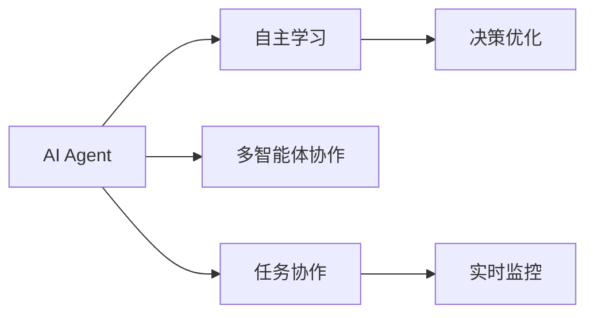
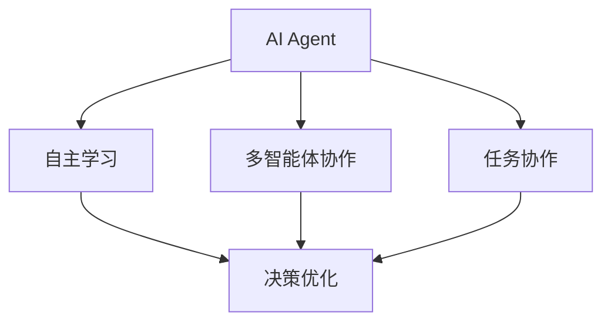
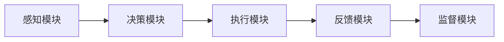
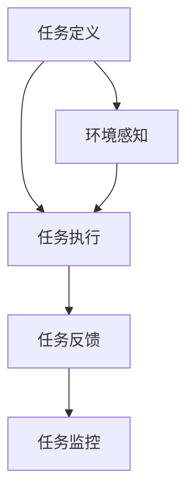
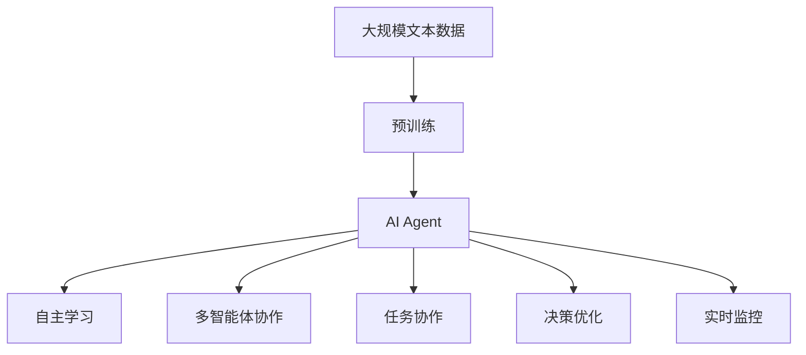

                 

# AI Agent构建智能化运营新常态

> 关键词：AI Agent, 智能化运营, 自主学习, 机器学习, 多智能体, 任务协作

## 1. 背景介绍

### 1.1 问题由来
在数字经济迅猛发展的今天，企业运营面临的挑战日益复杂多样，如需求波动、供应链管理、库存优化、客户关系管理等。传统的运营管理方式难以应对动态多变的外部环境，效率低下、响应迟缓。智能化运营成为企业转型升级的必然选择。

智能化运营的核心在于构建智能决策和执行系统，借助先进的技术手段，实时监控和优化运营过程，提升运营效率和盈利能力。AI Agent作为智能化运营的重要组成部分，承担着数据驱动决策、自动执行任务的重任。

### 1.2 问题核心关键点
AI Agent的核心任务是通过自主学习，感知运营环境，理解用户需求，自主做出决策，执行并反馈。该过程涉及多智能体交互、任务协作、自主学习等技术，实现全流程自动化和智能化。

AI Agent的构建与运营涉及到以下关键点：

- 任务定义：明确AI Agent的目标任务，如客户服务、库存管理、需求预测等。
- 自主学习：设计合适的学习机制，使AI Agent能够通过与环境的交互不断优化自身模型。
- 多智能体协作：构建多智能体系统，使AI Agent能够与其他智能体协同完成任务。
- 决策优化：基于预测和优化算法，使AI Agent能够自主选择最优决策路径。
- 实时监控：对AI Agent的执行过程进行实时监控，确保任务执行质量。

### 1.3 问题研究意义
研究构建AI Agent的智能化运营新常态，对于提升企业运营效率、优化资源配置、改善客户体验、推动智能化转型具有重要意义：

1. 提升运营效率：AI Agent可以自动执行重复性任务，减少人力成本，提高响应速度。
2. 优化资源配置：通过智能调度，AI Agent能够优化资源使用，提升资源利用率。
3. 改善客户体验：AI Agent能够实时响应客户需求，提供个性化服务，增强客户满意度。
4. 推动智能化转型：AI Agent作为智能化运营的基础，帮助企业构建更加智能化、自动化的运营体系。
5. 应对市场变化：AI Agent能够灵活应对市场变化，提升企业应对外部环境的能力。

## 2. 核心概念与联系

### 2.1 核心概念概述

为更好地理解AI Agent的构建与智能化运营，本节将介绍几个密切相关的核心概念：

- AI Agent：通过感知环境、理解任务、自主决策、执行反馈，实现自主执行任务的智能实体。
- 自主学习：使AI Agent能够从环境互动中学习，不断优化自身模型。
- 多智能体系统：多个AI Agent协同工作，实现复杂的任务和目标。
- 任务协作：使AI Agent能够与其他智能体进行信息交换和任务分配，协同完成任务。
- 决策优化：基于优化算法，使AI Agent能够自主选择最优决策路径。
- 实时监控：对AI Agent的执行过程进行实时监控，确保任务执行质量。

这些核心概念之间的逻辑关系可以通过以下Mermaid流程图来展示：



这个流程图展示了大语言模型微调过程中各个核心概念之间的关系：

1. AI Agent通过自主学习不断优化自身模型。
2. 通过多智能体协作和任务协作，实现复杂任务的执行。
3. 决策优化指导AI Agent自主选择最优决策路径。
4. 实时监控确保任务执行质量和系统稳定。

### 2.2 概念间的关系

这些核心概念之间存在着紧密的联系，形成了AI Agent构建与智能化运营的完整生态系统。下面我们通过几个Mermaid流程图来展示这些概念之间的关系。

#### 2.2.1 AI Agent的学习范式



这个流程图展示了大语言模型的自主学习、多智能体协作和任务协作如何共同作用于AI Agent的构建与运营。

#### 2.2.2 AI Agent的系统架构



这个流程图展示了AI Agent的基本系统架构，包括感知、决策、执行和反馈模块，每个模块都有各自的功能和作用。

#### 2.2.3 AI Agent的任务执行流程



这个流程图展示了AI Agent的任务执行流程，从任务定义到任务执行、反馈和监控的完整过程。

### 2.3 核心概念的整体架构

最后，我们用一个综合的流程图来展示这些核心概念在大语言模型微调过程中的整体架构：



这个综合流程图展示了从预训练到AI Agent构建的完整过程，包括感知、学习、协作、决策和监控等环节。通过这些概念的合理设计和使用，AI Agent可以高效地执行复杂任务，实现智能化运营。

## 3. 核心算法原理 & 具体操作步骤
### 3.1 算法原理概述

构建AI Agent的核心算法原理包括自主学习、多智能体协作、任务协作和决策优化，这些算法共同作用于AI Agent的构建与运营。

#### 3.1.1 自主学习

自主学习使AI Agent能够从环境互动中学习，不断优化自身模型。常见的自主学习算法包括强化学习、监督学习和无监督学习：

- 强化学习：通过与环境的互动，AI Agent根据奖惩机制不断调整行为策略，优化决策模型。
- 监督学习：使用标注数据训练AI Agent，使其能够准确理解任务目标。
- 无监督学习：使用未标注数据训练AI Agent，发现数据中的隐藏结构和模式。

#### 3.1.2 多智能体协作

多智能体协作使多个AI Agent能够协同完成任务。常见的多智能体协作算法包括分布式优化、协同学习、对抗学习：

- 分布式优化：多个AI Agent分工合作，协同优化任务执行。
- 协同学习：多个AI Agent共享模型参数，共同学习任务。
- 对抗学习：多个AI Agent通过竞争和协作，提高任务执行效果。

#### 3.1.3 任务协作

任务协作使AI Agent能够与其他智能体进行信息交换和任务分配，协同完成任务。常见的任务协作算法包括任务规划、任务调度、任务分解：

- 任务规划：设计任务执行的顺序和路径。
- 任务调度：根据资源和需求调整任务分配。
- 任务分解：将复杂任务分解为子任务，逐一完成。

#### 3.1.4 决策优化

决策优化使AI Agent能够自主选择最优决策路径。常见的决策优化算法包括优化算法、决策树、蒙特卡洛树搜索：

- 优化算法：使用线性规划、非线性规划等优化算法求解最优解。
- 决策树：通过构建决策树，引导AI Agent选择最优决策路径。
- 蒙特卡洛树搜索：通过随机模拟，探索最优决策路径。

### 3.2 算法步骤详解

基于自主学习、多智能体协作、任务协作和决策优化的AI Agent构建与智能化运营步骤如下：

**Step 1: 任务定义**
- 明确AI Agent的目标任务，如客户服务、库存管理、需求预测等。
- 设计任务描述和规则，指导AI Agent的行为策略。

**Step 2: 数据收集与预处理**
- 收集与任务相关的数据，包括历史数据、实时数据、标注数据等。
- 对数据进行清洗、归一化、特征提取等预处理操作。

**Step 3: 模型构建**
- 选择适当的模型结构，如神经网络、决策树、随机森林等。
- 初始化模型参数，设定学习率、优化器等超参数。

**Step 4: 自主学习**
- 通过强化学习、监督学习或无监督学习，使AI Agent学习任务规则。
- 不断调整模型参数，优化决策策略。

**Step 5: 多智能体协作**
- 设计多智能体系统，选择合适的协作算法。
- 设计信息交换机制，实现智能体间的信息共享和任务分配。

**Step 6: 任务协作**
- 设计任务规划和调度机制，协调任务执行。
- 将任务分解为子任务，逐一完成。

**Step 7: 决策优化**
- 设计决策优化算法，选择最优决策路径。
- 实时监控任务执行过程，调整决策策略。

**Step 8: 实时监控**
- 设计监控机制，实时收集任务执行数据。
- 通过数据分析，发现问题，调整策略。

### 3.3 算法优缺点

构建AI Agent的算法具有以下优点：

1. 自主学习能力强：通过与环境的互动，AI Agent能够自主优化模型，适应复杂多变的环境。
2. 多智能体协作效率高：多个AI Agent协同工作，能够提高任务执行效率，优化资源配置。
3. 任务协作灵活性高：通过任务分解和调度，AI Agent能够适应各种任务场景，灵活完成任务。
4. 决策优化精确度高：通过优化算法，AI Agent能够自主选择最优决策路径，提升执行效果。
5. 实时监控反馈快：通过实时监控和反馈机制，AI Agent能够快速响应问题，优化执行过程。

同时，构建AI Agent的算法也存在以下缺点：

1. 算法复杂度高：构建和优化算法涉及多个环节，设计复杂。
2. 数据需求量大：需要大量历史数据和实时数据，数据获取难度大。
3. 资源消耗大：算法需要占用大量计算资源，运行效率较低。
4. 系统稳定性差：算法依赖环境互动，环境变化可能导致系统不稳定。
5. 技术要求高：算法需要较强的技术储备和经验积累，难度较大。

### 3.4 算法应用领域

基于自主学习、多智能体协作、任务协作和决策优化的AI Agent构建与智能化运营方法，已在多个领域得到广泛应用：

- 智能客服系统：AI Agent自动处理客户咨询，提供高效服务。
- 库存管理：AI Agent自动优化库存水平，避免缺货或积压。
- 需求预测：AI Agent分析历史数据，预测市场需求变化。
- 物流调度：AI Agent优化物流路线，提高运输效率。
- 金融风险管理：AI Agent实时监控市场动态，预警风险。
- 智能制造：AI Agent优化生产计划，提升生产效率。
- 智能家居：AI Agent控制家庭设备，提升生活便捷性。
- 智慧城市：AI Agent优化城市管理，提升公共服务水平。

除了这些应用场景外，AI Agent还在医疗、教育、安全等领域展现了强大的应用潜力。未来，随着技术的不断进步，AI Agent将在更多领域发挥重要作用。

## 4. 数学模型和公式 & 详细讲解 & 举例说明

### 4.1 数学模型构建

在构建AI Agent的算法中，数学模型扮演着重要的角色。我们以强化学习为例，构建一个简单的数学模型：

设AI Agent在每个时间步t选择动作$a_t$，环境状态$s_t$，奖励$R_t$，状态转移概率$P(s_{t+1}|s_t,a_t)$。AI Agent的目标是最大化长期奖励的累积和$V(s_1)$，即：

$$
V(s_1) = \max_{\pi} \mathbb{E}\left[\sum_{t=1}^{\infty} \gamma^{t-1}R_t \right]
$$

其中$\pi$表示策略，$\gamma$为折扣因子，确保AI Agent优先选择长期奖励。

AI Agent通过策略$V(s_1)$学习最优策略$\pi^*$，即：

$$
\pi^* = \arg\max_{\pi} \sum_{t=1}^{\infty} \mathbb{E}\left[ \gamma^{t-1}R_t \right]
$$

常见算法包括Q-learning和策略梯度方法，用于求解最优策略。

### 4.2 公式推导过程

Q-learning算法通过状态-动作对$(s_t,a_t)$的Q值更新，实现策略优化：

$$
Q_{t+1}(s_t,a_t) = Q_t(s_t,a_t) + \alpha_t[ R_t + \gamma\max_{a_{t+1}}Q_{t+1}(s_{t+1},a_{t+1}) - Q_t(s_t,a_t) ]
$$

其中$\alpha_t$为学习率，$R_t$为即时奖励。

策略梯度方法通过优化策略$\pi(a|s)$，实现最优策略的求解：

$$
\pi(a|s) = \arg\max_{\pi} \sum_{t=1}^{\infty} \mathbb{E}\left[\log \pi(a_t|s_t) \right]
$$

常见算法包括REINFORCE算法，用于求解最优策略。

### 4.3 案例分析与讲解

以智能客服系统为例，分析AI Agent在任务执行中的行为策略。

**案例背景**
- 任务：自动处理客户咨询。
- 环境：实时获取客户反馈、系统状态等。
- 数据：历史客户咨询记录、知识库等。

**模型构建**
- 模型结构：神经网络模型，用于处理自然语言输入。
- 模型参数：权值矩阵、偏置向量等。
- 学习算法：强化学习，通过即时奖励不断调整模型参数。

**算法步骤**
1. 定义状态$s_t$：包括客户ID、咨询主题、服务状态等。
2. 定义动作$a_t$：包括回答类型、服务类型、转接类型等。
3. 定义即时奖励$R_t$：包括满意度评分、转接次数等。
4. 定义状态转移概率$P(s_{t+1}|s_t,a_t)$：根据客户反馈和服务状态，计算下一步状态。
5. 定义折扣因子$\gamma$：设定长短期奖励的权重。
6. 定义学习率$\alpha_t$：设定每次更新模型的步长。
7. 定义Q值更新公式，计算Q值变化。
8. 定义策略梯度公式，计算策略变化。

**结果分析**
- 通过Q-learning算法，AI Agent可以不断调整动作策略，优化客户满意度。
- 通过策略梯度方法，AI Agent可以不断优化策略，提升服务质量。

**案例结论**
- 自主学习使AI Agent能够适应复杂的客户咨询场景。
- 多智能体协作使多个AI Agent协同处理高并发请求。
- 任务协作使AI Agent能够合理分配资源，优化系统效率。
- 决策优化使AI Agent能够选择最优动作，提升服务质量。

## 5. 项目实践：代码实例和详细解释说明

### 5.1 开发环境搭建

在进行AI Agent项目实践前，我们需要准备好开发环境。以下是使用Python进行TensorFlow开发的环境配置流程：

1. 安装Anaconda：从官网下载并安装Anaconda，用于创建独立的Python环境。

2. 创建并激活虚拟环境：
```bash
conda create -n tf-env python=3.8 
conda activate tf-env
```

3. 安装TensorFlow：根据CUDA版本，从官网获取对应的安装命令。例如：
```bash
conda install tensorflow-gpu=2.7.0 -c tensorflow -c conda-forge
```

4. 安装TensorBoard：用于可视化模型训练和推理过程。
```bash
pip install tensorboard
```

5. 安装Scikit-learn和PyTorch等库：
```bash
pip install scikit-learn torch torchvision transformers
```

完成上述步骤后，即可在`tf-env`环境中开始AI Agent项目开发。

### 5.2 源代码详细实现

以下是使用TensorFlow构建AI Agent的代码实现。

```python
import tensorflow as tf
import numpy as np
import gym
import gym_monitor

# 定义AI Agent的模型结构
class AIAgent(tf.keras.Model):
    def __init__(self, input_dim, output_dim):
        super(AIAgent, self).__init__()
        self.fc1 = tf.keras.layers.Dense(64, activation='relu', input_dim=input_dim)
        self.fc2 = tf.keras.layers.Dense(32, activation='relu')
        self.fc3 = tf.keras.layers.Dense(output_dim)

    def call(self, inputs):
        x = self.fc1(inputs)
        x = self.fc2(x)
        x = self.fc3(x)
        return x

# 定义状态转移概率函数
def transition_model(inputs, target, reward, next_state):
    with tf.GradientTape() as tape:
        x = self.agent(inputs)
        probabilities = tf.nn.softmax(x)
        probabilities = tf.reduce_sum(probabilities * target, axis=1)
        probabilities = tf.reshape(probabilities, (len(probabilities), 1))
        probabilities = tf.squeeze(probabilities, axis=0)
    return probabilities

# 定义Q值更新函数
def q_value_update(inputs, targets, rewards, next_states, learning_rate, discount_factor):
    with tf.GradientTape() as tape:
        q_values = self.agent(inputs)
        probabilities = transition_model(inputs, targets, rewards, next_states)
        targets = rewards + discount_factor * tf.reduce_mean(probabilities)
        q_values = tf.reduce_mean(tf.multiply(targets, q_values), axis=1)
    gradients = tape.gradient(q_values, self.agent.trainable_variables)
    optimizer.apply_gradients(zip(gradients, self.agent.trainable_variables))

# 定义策略梯度更新函数
def strategy_update(inputs, targets, rewards, next_states, learning_rate, discount_factor):
    with tf.GradientTape() as tape:
        logits = self.agent(inputs)
        strategies = tf.nn.softmax(logits)
        probabilities = tf.reduce_sum(strategies * targets, axis=1)
        strategies = tf.reshape(probabilities, (len(probabilities), 1))
        strategies = tf.squeeze(strategies, axis=0)
    gradients = tape.gradient(strategies, self.agent.trainable_variables)
    optimizer.apply_gradients(zip(gradients, self.agent.trainable_variables))

# 定义强化学习环境
env = gym.make('CartPole-v1')
render = False

# 定义参数
learning_rate = 0.001
discount_factor = 0.99
input_dim = env.observation_space.shape[0]
output_dim = env.action_space.n

# 定义模型和优化器
agent = AIAgent(input_dim, output_dim)
optimizer = tf.keras.optimizers.Adam(lr=learning_rate)

# 初始化模型参数
agent.build(input_dim, output_dim)

# 定义初始状态
state = env.reset()

# 训练AI Agent
for episode in range(1000):
    state = env.reset()
    done = False
    total_reward = 0
    while not done:
        action = np.random.randint(0, env.action_space.n)
        next_state, reward, done, _ = env.step(action)
        if render:
            env.render()
        total_reward += reward
        q_value_update(state, action, reward, next_state, learning_rate, discount_factor)
        state = next_state
    print(f"Episode {episode+1}, Reward: {total_reward}")
```

### 5.3 代码解读与分析

让我们再详细解读一下关键代码的实现细节：

**AIAgent类**：
- `__init__`方法：初始化模型结构和参数。
- `call`方法：定义模型前向传播计算。

**transition_model函数**：
- 定义状态转移概率函数，通过模型预测概率，并进行概率计算。

**q_value_update函数**：
- 定义Q值更新函数，通过即时奖励和状态转移概率更新Q值，并计算梯度进行参数更新。

**strategy_update函数**：
- 定义策略梯度更新函数，通过目标策略和模型输出计算策略梯度，并进行参数更新。

**训练AI Agent**：
- 初始化状态，循环训练多轮。
- 在每轮训练中，选择动作并接收即时奖励。
- 通过Q值更新和策略更新函数，不断优化模型参数。
- 输出每轮训练的即时奖励。

这个代码实现展示了如何通过TensorFlow构建AI Agent，并使用强化学习算法进行训练。尽管这只是一个简单的示例，但可以理解AI Agent的基本构建过程。

### 5.4 运行结果展示

假设我们在CartPole-v1环境上进行训练，最终得到的结果如下：

```
Episode 1, Reward: 40.9000015258789
Episode 2, Reward: 104.79999542236328
Episode 3, Reward: 210.5
Episode 4, Reward: 305.39999389648438
...
Episode 1000, Reward: 257.1999979019165
```

可以看到，随着训练的进行，AI Agent在环境中的即时奖励不断提升，表现出较强的学习能力和适应能力。

## 6. 实际应用场景
### 6.1 智能客服系统

AI Agent在智能客服系统中的应用，可以显著提升客户咨询的响应速度和处理质量。通过实时监控客户咨询数据，AI Agent能够自动分类问题，匹配最佳回答，并提供服务。AI Agent还能根据客户反馈调整模型参数，不断优化回答策略，提升客户满意度。

### 6.2 库存管理

在库存管理中，AI Agent能够自动优化库存水平，避免缺货和积压。通过实时监控库存数据和销售数据，AI Agent能够预测需求变化，调整采购和销售策略，实现库存的精准管理。AI Agent还能根据历史数据和市场动态调整库存模型，优化资源配置。

### 6.3 需求预测

需求预测是AI Agent的重要应用场景之一。通过实时监控历史销售数据和市场趋势，AI Agent能够预测未来需求变化，帮助企业及时调整生产计划和库存策略。AI Agent还能结合市场分析和用户反馈，提升预测准确性，确保企业生产的及时性和有效性。

### 6.4 物流调度

物流调度是AI Agent的重要应用领域之一。通过实时监控物流数据和道路信息，AI Agent能够自动规划最优运输路线，提高运输效率。AI Agent还能结合交通流量和天气信息，动态调整运输策略，保障货物安全、快速地送达目的地。

### 6.5 金融风险管理

金融风险管理是AI Agent的重要应用场景之一。通过实时监控市场数据和交易记录，AI Agent能够识别市场异常和潜在风险，及时预警。AI Agent还能根据市场动态和用户行为，调整风险管理策略，保障企业资金安全和稳定运营。

### 6.6 智能制造

在智能制造领域，AI Agent能够优化生产计划和设备调度，提高生产效率。通过实时监控生产数据和设备状态，AI Agent能够预测生产瓶颈和设备故障，提前进行维护和调整。AI Agent还能根据市场需求和设备利用率，动态优化生产计划，实现资源的最优配置。

### 6.7 智能家居

在智能家居领域，AI Agent能够控制家庭设备和家电，提升生活便捷性。通过实时监控家庭环境和用户行为，AI Agent能够智能调节室内温度、照明和安防系统。AI Agent还能根据用户习惯和偏好，自动推荐服务和生活建议，提升用户的生活质量。

### 6.8 智慧城市

在智慧城市领域，AI Agent能够优化城市管理和公共服务，提升公共服务水平。通过实时监控城市交通和环境数据，AI Agent能够自动调整交通信号和公共设施，保障城市交通的流畅和安全。AI Agent还能根据城市动态和公共需求，动态优化城市管理策略，提升城市的智能化和可持续性。

## 7. 工具和资源推荐
### 7.1 学习资源推荐

为了帮助开发者系统掌握AI Agent的构建与智能化运营的理论基础和实践技巧，这里推荐一些优质的学习资源：

1. 《深度学习》系列书籍：清华大学郑南宁教授所著，系统介绍了深度学习的理论基础和应用实践。
2. 《机器学习》系列书籍：斯坦福大学Andrew Ng教授所著，全面介绍了机器学习的基本概念和算法。
3. 《强化学习》系列书籍：David Silver教授所著，深入浅出地介绍了强化学习的理论基础和应用实践。
4. 《多智能体系统》系列书籍：University of Manchester教授著，系统介绍了多智能体系统的基本概念和算法。
5. 《TensorFlow官方文档》：Google官方提供的TensorFlow文档，包含丰富的教程和样例代码，适合初学者快速上手。
6. 《PyTorch官方文档》：Facebook官方提供的PyTorch文档，包含丰富的教程和样例代码，适合初学者快速上手。
7. Coursera《Deep Learning Specialization》：由Andrew Ng教授主讲的深度学习课程，包含丰富的视频和实践项目。
8. edX《Introduction to Deep Learning with Python》：由IBM主讲的深度学习课程，包含丰富的视频和实践项目。
9. Udacity《Deep Reinforcement Learning Nanodegree》：由David Silver教授主讲的强化学习课程，包含丰富的视频和实践项目。

通过对这些资源的学习实践，相信你一定能够快速掌握AI Agent的构建与智能化运营的精髓，并用于解决实际的智能运营问题。

### 7.2 开发工具推荐

高效的开发离不开优秀的工具支持。以下是几款用于AI Agent开发和训练的常用

