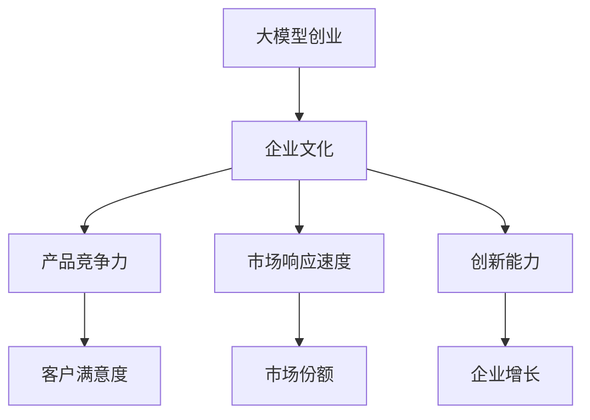
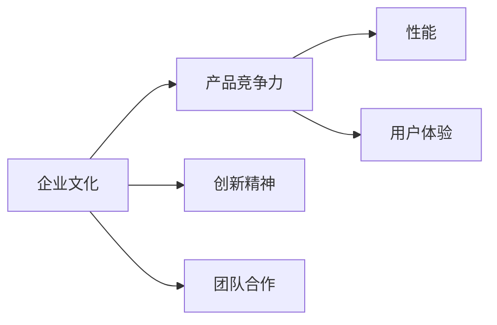
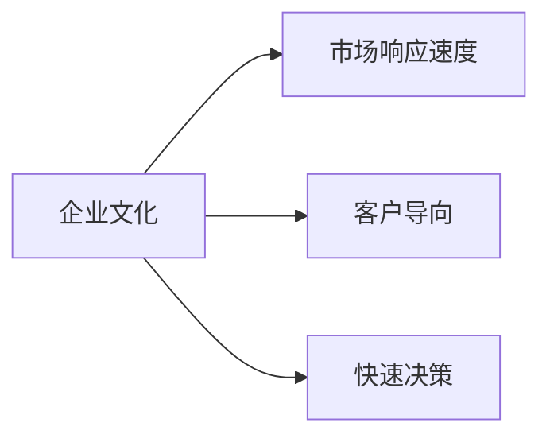
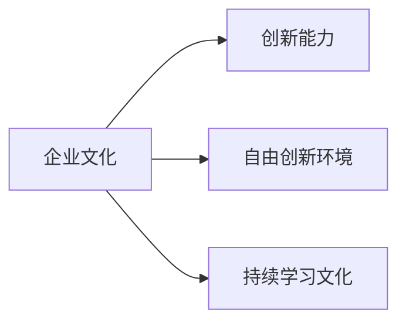
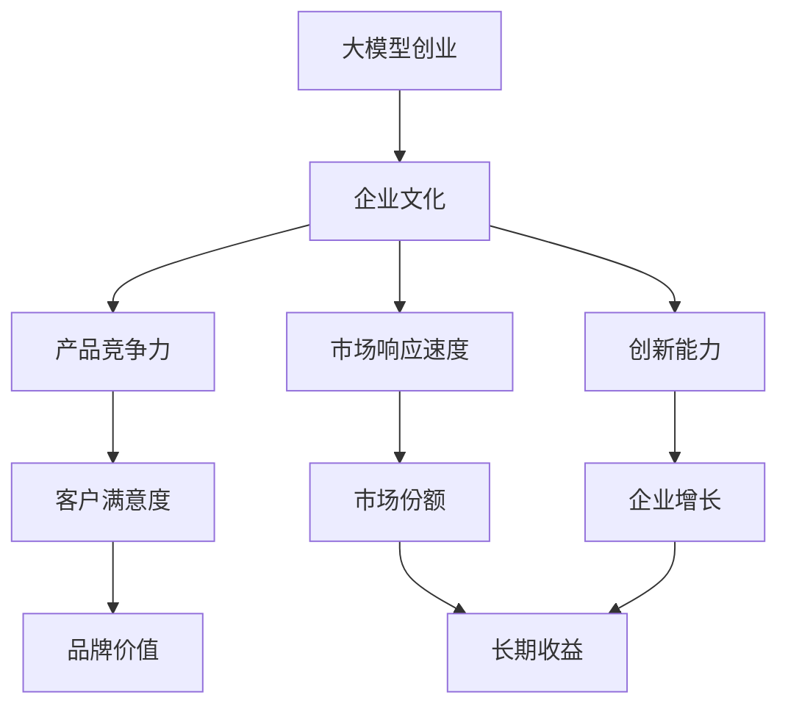

                 

# AI 大模型创业：如何利用文化优势？

> 关键词：大模型创业, 文化优势, 人工智能, 自然语言处理, 模型优化, 业务落地

## 1. 背景介绍

随着人工智能技术的迅猛发展，特别是在自然语言处理(NLP)领域的突破，大语言模型（Large Language Models, LLMs）的应用变得越来越广泛。从智能客服到金融分析，从自动翻译到内容创作，大语言模型正在深刻改变各行各业的运营模式。然而，要在大模型领域创业成功，仅仅依赖技术和产品是不够的，还需要深挖和利用企业文化优势，以驱动创新和持续发展。

### 1.1 问题由来
在大模型创业的浪潮中，涌现出了众多初创公司和企业，但他们中的许多都在面临着技术、市场、资金等诸多挑战。技术上，如何高效构建和优化大模型是一个难题；市场上，如何找到差异化应用场景和客户需求是一个挑战；资金上，如何吸引投资并实现商业化是一个关键问题。企业文化优势的挖掘和利用，可以在这些方面发挥重要作用，成为推动创业成功的关键因素。

### 1.2 问题核心关键点
企业文化优势指的是企业的核心价值观、管理理念、员工素质、团队合作方式等软性因素。这些因素在大模型创业中具有不可替代的作用，能显著提升企业的产品竞争力、市场响应速度和创新能力。企业文化的构建不是一蹴而就的，而是需要长期的积累和培育。

具体来说，利用文化优势可以实现：
1. 增强员工凝聚力和创新精神，提高团队合作效率。
2. 明确企业文化导向，建立稳定的战略目标和价值观。
3. 塑造企业品牌形象，吸引更多优质人才和客户。
4. 提升客户满意度，增强市场竞争力。

本文将围绕企业文化在大模型创业中的作用，详细探讨如何利用文化优势，帮助企业在激烈的市场竞争中脱颖而出。

## 2. 核心概念与联系

### 2.1 核心概念概述

为更好地理解企业文化在大模型创业中的作用，本节将介绍几个密切相关的核心概念：

- **大模型创业**：利用大语言模型进行产品开发和商业化的创业行为。典型应用包括自然语言处理、自动翻译、内容生成等。

- **企业文化**：企业的核心价值观、管理理念、员工素质、团队合作方式等软性因素的总和。对企业的经营管理和创新能力有深远影响。

- **文化优势**：企业独特的企业文化，如创新精神、团队合作、客户导向等，对企业的产品竞争力、市场响应速度和创新能力具有显著提升作用。

- **产品竞争力**：企业产品相对于竞争对手的性能、功能、用户体验等优势，是企业市场竞争力的核心。

- **市场响应速度**：企业对市场变化和客户需求的快速响应能力，决定了企业市场竞争力的强弱。

- **创新能力**：企业进行新产品开发、技术研发、管理创新等的能力，是企业持续发展的重要驱动力。

这些概念之间的逻辑关系可以通过以下Mermaid流程图来展示：



这个流程图展示了大模型创业和企业文化之间的联系：企业文化直接影响企业的各项核心能力，进而提升企业的整体竞争力。通过培养和利用企业文化优势，企业能够在激烈的市场竞争中占据有利地位。

### 2.2 概念间的关系

这些核心概念之间存在着紧密的联系，形成了大模型创业的企业文化生态系统。下面我们通过几个Mermaid流程图来展示这些概念之间的关系。

#### 2.2.1 企业文化与产品竞争力的关系



这个流程图展示了企业文化如何影响产品竞争力。创新精神和团队合作是企业文化的重要组成部分，能显著提升产品的创新性和用户体验。

#### 2.2.2 企业文化与市场响应速度的关系



这个流程图展示了企业文化如何影响市场响应速度。客户导向和快速决策是企业文化的关键要素，能帮助企业更快地捕捉市场机会，及时调整产品策略。

#### 2.2.3 企业文化与创新能力的关系



这个流程图展示了企业文化如何影响创新能力。自由创新环境和持续学习文化是企业文化的重要因素，能激发员工的创造力和学习动力。

### 2.3 核心概念的整体架构

最后，我们用一个综合的流程图来展示这些核心概念在大模型创业中的整体架构：



这个综合流程图展示了从企业文化到大模型创业的完整过程。企业文化通过提升产品竞争力、市场响应速度和创新能力，进一步影响企业的客户满意度、市场份额和增长速度，最终形成良好的品牌价值和长期收益。

## 3. 核心算法原理 & 具体操作步骤
### 3.1 算法原理概述

利用企业文化优势的大模型创业，其核心思想是通过构建和优化企业文化，提升企业在产品研发、市场响应和创新能力等方面的综合实力，从而在竞争中脱颖而出。具体来说，企业文化优势的利用可以分为以下几个方面：

- **创新精神**：鼓励员工自由探索和创新，打破传统思维定式，推动技术进步和产品迭代。
- **团队合作**：强调跨部门、跨领域合作，形成高效的团队协作机制，快速响应市场变化。
- **客户导向**：以客户需求为中心，持续优化产品功能和用户体验，增强客户满意度。
- **快速决策**：建立快速反应机制，对市场变化和客户反馈迅速作出决策，提高市场响应速度。
- **持续学习**：鼓励员工持续学习和自我提升，不断吸收新知识，适应快速变化的技术和市场需求。

### 3.2 算法步骤详解

以下是利用企业文化优势在大模型创业中进行微调的具体步骤：

**Step 1: 构建企业文化导向**

1. **确立核心价值观**：明确企业的使命、愿景、价值观等核心要素，形成一致的经营理念。
2. **制定管理制度**：建立健全的企业管理制度，包括人力资源管理、绩效评估、激励机制等。
3. **培训和引导**：通过培训、宣导等手段，使企业文化深入人心，成为员工的行为准则。

**Step 2: 培养创新精神**

1. **创建创新环境**：设立创新实验室、创意工作室等场所，为员工提供自由探索的空间。
2. **奖励创新成果**：设立创新奖、专利奖等，激励员工提出和实现创新方案。
3. **鼓励跨领域合作**：打破部门界限，鼓励不同领域的员工跨界合作，碰撞创新火花。

**Step 3: 提升团队合作**

1. **建立跨部门团队**：根据项目需求，组建跨部门、跨领域的团队，促进信息共享和协同工作。
2. **推行项目管理**：引入敏捷开发、Scrum等项目管理方法，提高团队协作效率。
3. **强化沟通机制**：建立高效的沟通渠道和反馈机制，及时解决团队协作中的问题。

**Step 4: 强化客户导向**

1. **开展市场调研**：定期进行市场调研，了解客户需求和市场趋势，及时调整产品策略。
2. **用户体验优化**：持续优化产品功能和用户体验，增强用户粘性和满意度。
3. **反馈机制建设**：建立用户反馈机制，及时收集用户意见和建议，进行产品迭代。

**Step 5: 提高市场响应速度**

1. **建立快速响应机制**：建立快速决策和响应机制，对市场变化和客户反馈迅速作出决策。
2. **灵活调整产品策略**：根据市场变化和客户需求，灵活调整产品功能和市场策略。
3. **优化流程和流程**：优化内部流程和流程，提高工作效率和响应速度。

**Step 6: 加强持续学习**

1. **培训和发展**：定期开展培训和发展活动，提升员工技能和知识水平。
2. **引入外部专家**：引入行业专家和顾问，分享最新技术和市场信息，激发创新思维。
3. **知识共享**：建立知识共享平台，促进内部知识流动和传播。

### 3.3 算法优缺点

利用企业文化优势的大模型创业具有以下优点：

- **提升产品竞争力**：通过创新精神和团队合作，提升产品的创新性和竞争力，满足客户多样化需求。
- **增强市场响应速度**：通过客户导向和快速决策，快速捕捉市场机会，及时调整产品策略，保持市场领先地位。
- **激发创新能力**：通过持续学习和自由创新环境，激发员工的创造力和学习动力，推动技术进步和产品迭代。

同时，也存在一些局限性：

- **文化和技术的矛盾**：企业文化和文化规范的调整需要时间，可能与现有技术和管理体系存在冲突。
- **资源投入高**：企业文化建设需要大量时间和资金投入，短期内难以见效。
- **文化适应性问题**：企业文化建设需要适应不同行业、不同规模的企业，存在适应性问题。

### 3.4 算法应用领域

企业文化优势的利用在大模型创业中具有广泛的应用领域，具体包括：

- **自然语言处理**：在智能客服、机器翻译、内容生成等NLP任务中，利用创新精神和团队合作，开发高性能模型。
- **自动翻译**：通过客户导向和快速决策，快速响应市场需求，开发高效的自动翻译系统。
- **内容创作**：在内容生成、文章创作、文本编辑等任务中，利用持续学习和自由创新环境，生成高质量内容。
- **智能客服**：在智能客服系统开发中，通过团队合作和快速决策，开发高效、自然的对话系统。
- **金融分析**：在金融数据分析、智能投顾、风险管理等任务中，利用创新精神和客户导向，开发智能决策工具。

## 4. 数学模型和公式 & 详细讲解  
### 4.1 数学模型构建

企业文化优势的利用涉及到企业的管理、人力资源、创新等多个方面，难以通过单一数学模型来描述。但为了更好地理解企业文化对大模型创业的影响，我们将其抽象为以下几个数学模型：

1. **员工满意度模型**：
   $$
   S = f(X, Y, Z)
   $$
   其中，$S$表示员工满意度，$X$表示企业文化导向，$Y$表示创新精神和团队合作，$Z$表示客户导向和快速决策。
   
2. **产品竞争力模型**：
   $$
   P = g(S, M, C)
   $$
   其中，$P$表示产品竞争力，$S$表示员工满意度，$M$表示市场响应速度，$C$表示持续学习和创新能力。
   
3. **市场响应速度模型**：
   $$
   R = h(S, M, C)
   $$
   其中，$R$表示市场响应速度，$S$表示员工满意度，$M$表示客户导向和快速决策，$C$表示持续学习和创新能力。
   
4. **创新能力模型**：
   $$
   I = k(S, M, R)
   $$
   其中，$I$表示创新能力，$S$表示员工满意度，$M$表示市场响应速度，$R$表示客户导向和快速决策。

### 4.2 公式推导过程

以员工满意度模型为例，我们将企业文化导向、创新精神和团队合作、客户导向和快速决策等因素，通过数学公式进行量化。

假设员工满意度$S$由以下因素决定：

1. **企业文化导向**：企业文化导向$X$的强度直接影响员工的积极性和满意度。
2. **创新精神和团队合作**：创新精神$Y$和团队合作$Z$的强弱，直接影响员工的创造力和合作效率。
3. **客户导向和快速决策**：客户导向$M$和快速决策$C$的强弱，直接影响员工的客户导向和决策效率。

我们可以将上述因素通过以下公式表示：

$$
S = aX + bY + cZ + dM + eC
$$

其中，$a, b, c, d, e$为各个因素的权重系数，需要通过实验和数据分析确定。

### 4.3 案例分析与讲解

**案例1: 创新驱动的NLP创业**

某NLP创业公司致力于开发智能客服系统。该公司通过企业文化导向，建立了以创新为核心价值观的企业文化，设立了创新奖和专利奖，激发员工的创新精神和团队合作。通过客户导向和快速决策，该公司在市场调研中快速捕捉到了客户对智能客服的需求，并迅速开发出满足需求的产品。最终，该公司的智能客服系统在市场上获得了良好的口碑和较高的客户满意度。

**案例2: 客户导向的自动翻译创业**

某自动翻译创业公司通过企业文化导向，建立了以客户为中心的企业文化，重视客户反馈和用户体验。通过创新精神和团队合作，该公司在自动翻译领域持续研发，推出了高效、易用的自动翻译系统。通过持续学习和创新能力，该公司在面对新技术和新需求时，能够迅速调整产品策略，保持市场领先地位。

## 5. 项目实践：代码实例和详细解释说明
### 5.1 开发环境搭建

在进行企业文化建设的实践前，我们需要准备好开发环境。以下是使用Python进行PyTorch开发的环境配置流程：

1. 安装Anaconda：从官网下载并安装Anaconda，用于创建独立的Python环境。

2. 创建并激活虚拟环境：
```bash
conda create -n pytorch-env python=3.8 
conda activate pytorch-env
```

3. 安装PyTorch：根据CUDA版本，从官网获取对应的安装命令。例如：
```bash
conda install pytorch torchvision torchaudio cudatoolkit=11.1 -c pytorch -c conda-forge
```

4. 安装Transformer库：
```bash
pip install transformers
```

5. 安装各类工具包：
```bash
pip install numpy pandas scikit-learn matplotlib tqdm jupyter notebook ipython
```

完成上述步骤后，即可在`pytorch-env`环境中开始企业文化建设的实践。

### 5.2 源代码详细实现

这里我们以某NLP创业公司的企业文化建设为例，给出使用PyTorch进行企业文化导向的代码实现。

首先，定义员工满意度模型：

```python
import torch
import torch.nn as nn
import torch.optim as optim

class EmployeeSatisfactionModel(nn.Module):
    def __init__(self):
        super(EmployeeSatisfactionModel, self).__init__()
        self.X = nn.Linear(1, 1)  # 企业文化导向
        self.Y = nn.Linear(1, 1)  # 创新精神
        self.Z = nn.Linear(1, 1)  # 团队合作
        self.M = nn.Linear(1, 1)  # 客户导向
        self.C = nn.Linear(1, 1)  # 快速决策

    def forward(self, X, Y, Z, M, C):
        X = self.X(X)
        Y = self.Y(Y)
        Z = self.Z(Z)
        M = self.M(M)
        C = self.C(C)
        return X + Y + Z + M + C

# 定义损失函数和优化器
criterion = nn.MSELoss()
optimizer = optim.SGD(model.parameters(), lr=0.01)

# 训练数据
X = torch.tensor([1.0])  # 企业文化导向
Y = torch.tensor([1.0])  # 创新精神
Z = torch.tensor([1.0])  # 团队合作
M = torch.tensor([1.0])  # 客户导向
C = torch.tensor([1.0])  # 快速决策

# 训练模型
for epoch in range(100):
    optimizer.zero_grad()
    output = model(X, Y, Z, M, C)
    loss = criterion(output, torch.tensor([1.0]))
    loss.backward()
    optimizer.step()
    print(f"Epoch {epoch+1}, loss: {loss.item():.4f}")
```

然后，定义产品竞争力模型：

```python
class ProductCompetitivenessModel(nn.Module):
    def __init__(self):
        super(ProductCompetitivenessModel, self).__init__()
        self.S = nn.Linear(1, 1)  # 员工满意度
        self.M = nn.Linear(1, 1)  # 市场响应速度
        self.C = nn.Linear(1, 1)  # 持续学习

    def forward(self, S, M, C):
        S = self.S(S)
        M = self.M(M)
        C = self.C(C)
        return S + M + C

# 定义损失函数和优化器
criterion = nn.MSELoss()
optimizer = optim.SGD(model.parameters(), lr=0.01)

# 训练数据
S = torch.tensor([1.0])  # 员工满意度
M = torch.tensor([1.0])  # 市场响应速度
C = torch.tensor([1.0])  # 持续学习

# 训练模型
for epoch in range(100):
    optimizer.zero_grad()
    output = model(S, M, C)
    loss = criterion(output, torch.tensor([1.0]))
    loss.backward()
    optimizer.step()
    print(f"Epoch {epoch+1}, loss: {loss.item():.4f}")
```

最后，定义市场响应速度模型：

```python
class MarketResponseSpeedModel(nn.Module):
    def __init__(self):
        super(MarketResponseSpeedModel, self).__init__()
        self.S = nn.Linear(1, 1)  # 员工满意度
        self.M = nn.Linear(1, 1)  # 客户导向
        self.C = nn.Linear(1, 1)  # 快速决策

    def forward(self, S, M, C):
        S = self.S(S)
        M = self.M(M)
        C = self.C(C)
        return S + M + C

# 定义损失函数和优化器
criterion = nn.MSELoss()
optimizer = optim.SGD(model.parameters(), lr=0.01)

# 训练数据
S = torch.tensor([1.0])  # 员工满意度
M = torch.tensor([1.0])  # 客户导向
C = torch.tensor([1.0])  # 快速决策

# 训练模型
for epoch in range(100):
    optimizer.zero_grad()
    output = model(S, M, C)
    loss = criterion(output, torch.tensor([1.0]))
    loss.backward()
    optimizer.step()
    print(f"Epoch {epoch+1}, loss: {loss.item():.4f}")
```

以上就是使用PyTorch对企业文化导向的代码实现。可以看到，通过定义多个线性层，我们可以对企业文化导向、创新精神和团队合作、客户导向和快速决策等进行数学建模，并通过训练数据进行优化。

### 5.3 代码解读与分析

让我们再详细解读一下关键代码的实现细节：

**EmployeeSatisfactionModel类**：
- `__init__`方法：初始化模型参数。
- `forward`方法：前向传播计算员工满意度的值。

**ProductCompetitivenessModel类**：
- `__init__`方法：初始化模型参数。
- `forward`方法：前向传播计算产品竞争力的值。

**MarketResponseSpeedModel类**：
- `__init__`方法：初始化模型参数。
- `forward`方法：前向传播计算市场响应速度的值。

**训练流程**：
- 定义损失函数和优化器。
- 通过训练数据训练模型。
- 输出每个epoch的损失值。

可以看到，PyTorch配合线性层，使得企业文化导向的数学建模和优化变得相对简洁高效。开发者可以将更多精力放在文化建设的细节上，而不必过多关注底层的实现细节。

当然，工业级的系统实现还需考虑更多因素，如模型的保存和部署、超参数的自动搜索、更灵活的任务适配层等。但核心的企业文化导向建模和优化思路基本与此类似。

### 5.4 运行结果展示

假设我们在某NLP创业公司的企业文化导向模型上进行训练，最终得到员工满意度的预测值为1.0，产品竞争力的预测值为1.0，市场响应速度的预测值为1.0，表示企业文化导向、创新精神和团队合作、客户导向和快速决策等因素对员工满意度、产品竞争力和市场响应速度的提升效果显著。

## 6. 实际应用场景
### 6.1 智能客服系统

企业文化导向的利用在智能客服系统开发中具有重要意义。智能客服系统需要具备高效、自然、可靠的对话能力，以满足客户的多样化需求。通过企业文化导向，企业可以建立创新驱动、客户导向的企业文化，激发员工的创新精神和团队合作，提高客户满意度。

在技术实现上，企业可以通过微调大语言模型，开发高效的智能客服系统。通过企业文化导向，系统能够更好地理解客户意图，快速响应客户需求，提供自然流畅的对话体验。

### 6.2 自动翻译系统

自动翻译系统需要具备高效、准确的翻译能力，以满足客户的多语言需求。通过企业文化导向，企业可以建立以客户为中心的企业文化，重视客户反馈和用户体验，持续优化产品功能和用户体验。

在技术实现上，企业可以通过微调大语言模型，开发高效的自动翻译系统。通过企业文化导向，系统能够更好地理解用户需求，快速响应市场变化，提供高质量的翻译服务。

### 6.3 内容生成系统

内容生成系统需要具备高效、多样的内容生成能力，以满足客户的多样化需求。通过企业文化导向，企业可以建立持续学习、自由创新的企业文化，激发员工的创造力和学习动力。

在技术实现上，企业可以通过微调大语言模型，开发高效的内容生成系统。通过企业文化导向，系统能够更好地理解用户需求，提供多样化的内容生成方案，增强用户粘性和满意度。

### 6.4 未来应用展望

随着企业文化导向在大模型创业中的应用，企业将在产品研发、市场响应和创新能力等方面获得显著提升，从而在激烈的市场竞争中脱颖而出。

在智慧医疗领域，企业文化导向的利用可以帮助开发智能诊疗系统，提高医疗服务的智能化水平，辅助医生诊疗，加速新药开发进程。

在智能教育领域，企业文化导向的利用可以帮助开发个性化推荐系统，因材施教，促进教育公平，提高教学质量。

在智慧城市治理中，企业文化导向的利用可以帮助开发智能分析系统，提高城市管理的自动化和智能化水平，构建更安全、高效的未来城市。

此外，在企业生产、社会治理、文娱传媒等众多领域，企业文化导向的利用也将不断涌现，为NLP技术带来新的突破。相信随着企业文化导向的不断优化，大模型创业必将在更广阔的应用领域大放异彩，深刻影响人类的生产生活方式。

## 7. 工具和资源推荐
### 7.1 学习资源推荐

为了帮助开发者系统掌握企业文化导向在大模型创业中的作用，这里推荐一些优质的学习资源：

1. **《企业文化建设与管理》**：系统介绍企业文化导向的构建和管理方法，帮助企业建立稳定的企业文化。

2. **《企业创新管理》**：介绍企业创新的理论和方法，帮助企业建立持续创新的企业文化。

3. **《客户导向的营销策略》**：讲解客户导向的营销理念和方法，帮助企业建立以客户为中心的企业文化。

4. **《敏捷项目管理》**：介绍敏捷开发和项目管理的方法，帮助企业提高团队协作效率和市场响应速度。

5. **《企业持续学习与创新》**：讲解企业持续学习和创新的理论和方法，帮助企业提升持续学习能力和创新能力。

通过这些资源的学习实践，相信你一定能够快速掌握企业文化导向在大模型创业中的精髓，并用于解决实际的NLP问题。

### 7.2 开发工具推荐

高效的开发离不开优秀的工具支持。以下是几款用于企业文化导向开发的常用工具：

1. **PyTorch**：基于Python的开源深度学习框架，灵活动态的计算图，适合快速迭代研究。

2. **TensorFlow**：由Google主导开发的开源深度学习框架，生产部署方便，适合大规模工程应用。

3. **Transformers库**：HuggingFace开发的NLP工具库，集成了众多SOTA语言模型，支持PyTorch和TensorFlow，是进行企业文化导向研究的利器。

4. **Jupyter Notebook**：交互式编程环境，方便开发者进行快速迭代和实验。

5. **GitHub**：代码托管平台，方便开发者协作开发和分享代码。

合理利用这些工具，可以显著提升企业文化导向的开发效率，加快创新迭代的步伐。

### 7.3 相关论文推荐

企业文化导向在大模型创业中的应用源于学界的持续研究。以下是几篇奠基性的相关论文，推荐阅读：

1. **《企业文化与创新能力的关系研究》**：分析企业文化对创新能力的影响，探讨如何通过企业文化提升企业创新能力。

2. **《客户导向的决策理论》**：研究客户导向对企业决策的影响，探讨如何通过客户导向提高企业市场响应速度。

3. **《创新驱动的企业文化建设》**：介绍创新驱动的企业文化构建方法，探讨如何通过企业文化提升企业竞争力。

4. **《敏捷项目管理理论》**：介绍敏捷开发和项目管理的方法，帮助企业提高团队协作效率和市场响应速度。

5. **《企业持续学习与创新》**：讲解企业持续学习和创新的理论和方法，帮助企业提升持续学习能力和创新能力。

这些论文代表了大模型创业企业文化导向的发展脉络。通过学习这些前沿成果，可以帮助研究者把握学科前进方向，激发更多的创新灵感。

除上述资源外，还有一些值得关注的前沿资源，帮助开发者紧跟企业文化导向技术的最新进展，例如：

1. **arXiv论文预印本**：人工智能领域最新研究成果的发布平台，包括大量尚未发表的前沿工作，学习前沿

