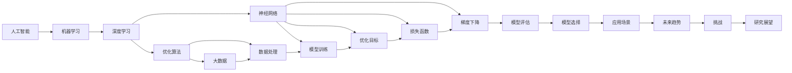

                 

# AI 机器学习计算艺术之道

> 关键词：人工智能,机器学习,计算艺术,算法原理,深度学习,优化算法,神经网络,大数据,数据处理,模型训练,优化目标,损失函数,梯度下降,模型评估,模型选择,应用场景,未来趋势

## 1. 背景介绍

### 1.1 问题由来

在现代信息技术的飞速发展下，人工智能（AI）和机器学习（ML）技术已经深入到各个行业的核心业务。从金融行业的风控模型、医疗行业的诊断系统、教育行业的智能推荐系统，到自动驾驶的感知系统，机器学习的应用已经无处不在。但随着数据量和复杂度的不断提升，传统的机器学习算法已难以满足日益增长的需求。与此同时，计算艺术领域的技术手段，如大规模并行计算、深度学习、数据可视化等，也在不断进步，为机器学习带来了新的方法和思路。

### 1.2 问题核心关键点

当前，机器学习和计算艺术之间的结合正日益紧密。这种结合不仅使得机器学习算法更加高效，也极大地提升了模型的表现力和解释性。基于此，本文将深入探讨AI与机器学习计算艺术之间的内在联系，并通过对几种核心算法原理的详解和应用实例的展示，帮助读者深入理解AI和机器学习的计算艺术之道。

### 1.3 问题研究意义

通过对机器学习与计算艺术相结合的研究，不仅可以更好地理解AI算法的内在原理，还能探索更加高效和具有艺术性的计算方法，从而在提升模型性能的同时，增强模型的可解释性和美学的赏析价值。这对于推动AI技术的普及应用，以及促进跨学科创新，都有着重要的意义。

## 2. 核心概念与联系

### 2.1 核心概念概述

在深入探讨AI与机器学习计算艺术的结合前，首先需要明确一些核心概念：

- **人工智能（AI）**：通过使机器具有类似于人类的认知和决策能力，来模拟人类智能的技术。
- **机器学习（ML）**：一种使机器能够从数据中学习并改进性能的算法。
- **深度学习（DL）**：一种特殊的机器学习方法，通过构建深层神经网络，自动地提取数据的特征表示。
- **优化算法（Optimization Algorithms）**：用于寻找函数最小值（或最大值）的算法，如梯度下降（Gradient Descent）、Adam等。
- **神经网络（Neural Networks）**：模拟人脑神经元之间连接的一种计算模型，用于处理大规模数据集。
- **大数据（Big Data）**：指海量的数据集，通常超过传统数据库的处理能力。
- **数据处理（Data Processing）**：对原始数据进行清洗、转换、整合等操作，以供后续分析使用。
- **模型训练（Model Training）**：通过训练数据集，调整模型参数，使其能够更好地预测新数据的过程。
- **优化目标（Optimization Goal）**：指通过某种算法或策略，最小化（或最大化）某个指标的过程。
- **损失函数（Loss Function）**：用于衡量模型预测值与真实值之间的差距。
- **梯度下降（Gradient Descent）**：一种常用的优化算法，通过不断调整参数，使损失函数逐渐减小。
- **模型评估（Model Evaluation）**：通过评估指标，如准确率、召回率、F1分数等，来评估模型性能的过程。
- **模型选择（Model Selection）**：根据任务需求，选择合适的模型和算法。
- **应用场景（Application Scenarios）**：指特定领域内，机器学习技术的具体应用。
- **未来趋势（Future Trends）**：指AI与机器学习技术的未来发展方向。
- **挑战（Challenges）**：指在AI和机器学习发展过程中所面临的问题。
- **研究展望（Research Outlook）**：指未来的研究方向和可能的发展。

### 2.2 概念间的关系

这些核心概念之间相互联系，形成了机器学习与计算艺术相结合的完整体系。通过以下Mermaid流程图，可以更直观地理解这些概念之间的关系：



这个流程图展示了从人工智能到应用场景的全过程，每一步都需要从计算艺术的角度进行优化和改进。

## 3. 核心算法原理 & 具体操作步骤

### 3.1 算法原理概述

机器学习计算艺术的核心在于算法的设计与优化。本文将重点介绍几种核心算法及其原理，包括深度学习、梯度下降、模型评估等。

**深度学习（DL）**：通过构建深层神经网络，自动地提取数据的特征表示。深度学习的核心是反向传播算法，通过不断调整权重，最小化损失函数，来提高模型的预测能力。

**梯度下降（Gradient Descent）**：一种常用的优化算法，通过计算损失函数对每个参数的梯度，更新参数值，使损失函数逐渐减小。梯度下降算法有批量梯度下降（Batch Gradient Descent）、随机梯度下降（Stochastic Gradient Descent）和mini-batch梯度下降（Mini-batch Gradient Descent）等多种变体。

**模型评估（Model Evaluation）**：通过评估指标，如准确率、召回率、F1分数等，来评估模型性能。常用的评估方法包括交叉验证（Cross-Validation）和留出法（Hold-Out）。

### 3.2 算法步骤详解

以下详细解释机器学习计算艺术的实际操作步骤：

1. **数据收集与预处理**：
   - 收集与任务相关的数据集，并进行清洗、转换等预处理操作。
   - 使用数据增强技术，扩充训练数据集，减少过拟合风险。
   - 进行特征提取，将原始数据转换为模型能够处理的形式。

2. **模型选择与搭建**：
   - 根据任务类型和数据特点，选择合适的模型架构，如卷积神经网络（CNN）、循环神经网络（RNN）、Transformer等。
   - 定义模型的输入和输出，确定模型各层的参数数量。
   - 使用深度学习框架（如TensorFlow、PyTorch等）搭建模型。

3. **模型训练与优化**：
   - 使用训练数据集，通过梯度下降等优化算法，调整模型参数。
   - 使用交叉验证等方法，防止过拟合，选择最优的超参数组合。
   - 在训练过程中，不断监测损失函数的变化，调整模型参数。

4. **模型评估与测试**：
   - 使用测试数据集，评估模型性能，计算评估指标。
   - 进行模型调优，提高模型在新数据上的泛化能力。
   - 进行超参数调优，选择最优的模型配置。

### 3.3 算法优缺点

深度学习：
- **优点**：自动提取数据特征，具有较高的泛化能力。
- **缺点**：模型复杂度高，计算量大，需要大量标注数据。

梯度下降：
- **优点**：简单易用，收敛速度快，具有较强的可解释性。
- **缺点**：容易陷入局部最优，需要手动调整学习率。

模型评估：
- **优点**：能够全面评估模型性能，选择合适的评估指标。
- **缺点**：评估过程复杂，需要处理数据不平衡等问题。

### 3.4 算法应用领域

深度学习在图像识别、语音识别、自然语言处理等领域有着广泛的应用。如使用卷积神经网络进行图像分类，使用循环神经网络进行语音识别，使用Transformer进行自然语言处理。

## 4. 数学模型和公式 & 详细讲解 & 举例说明

### 4.1 数学模型构建

以下是几种常见的机器学习计算艺术模型及其数学表示：

**线性回归模型**：
- 假设模型为 $y = \theta_0 + \theta_1x_1 + ... + \theta_nx_n$。
- 通过最小二乘法，求解最优参数 $\theta$。

**逻辑回归模型**：
- 假设模型为 $y = \sigma(\theta_0 + \theta_1x_1 + ... + \theta_nx_n)$，其中 $\sigma$ 为Sigmoid函数。
- 通过交叉熵损失函数，求解最优参数 $\theta$。

**卷积神经网络**：
- 假设模型为 $y = f(x; \theta) = W * F * \sigma * ... * \sigma$，其中 $W$ 为权重，$F$ 为特征映射，$\sigma$ 为激活函数。
- 通过卷积、池化、全连接等操作，自动提取数据特征。

**循环神经网络**：
- 假设模型为 $y_t = f(x_t, x_{t-1}, ..., x_1; \theta) = W * [x_t; x_{t-1}; ...; x_1] * \sigma$，其中 $W$ 为权重，$\sigma$ 为激活函数。
- 通过循环结构，能够处理时间序列数据。

**Transformer模型**：
- 假设模型为 $y = f(x; \theta) = W * F * M * \sigma * ... * \sigma$，其中 $W$ 为权重，$F$ 为特征映射，$M$ 为注意力机制，$\sigma$ 为激活函数。
- 通过自注意力机制，能够处理序列数据，具有较好的并行计算能力。

### 4.2 公式推导过程

以线性回归模型为例，详细推导其数学公式：

假设数据集为 $(x_1, y_1), (x_2, y_2), ..., (x_n, y_n)$，其中 $x_i$ 为特征向量，$y_i$ 为标签。
设模型的预测值为 $y_i = \theta_0 + \theta_1x_{1,i} + ... + \theta_nx_{n,i}$，其中 $\theta_0, \theta_1, ..., \theta_n$ 为模型参数。
最小二乘法的目标是使预测值 $y_i$ 与真实值 $y_i$ 之间的误差最小化，即最小化损失函数：
$$
L = \sum_{i=1}^{n}(y_i - y_i)^2
$$
通过对损失函数求导，得到模型参数的梯度：
$$
\nabla_{\theta}L = 2\sum_{i=1}^{n}(y_i - y_i)x_i
$$
通过梯度下降算法，更新模型参数：
$$
\theta \leftarrow \theta - \eta\nabla_{\theta}L
$$
其中 $\eta$ 为学习率。

### 4.3 案例分析与讲解

以图像分类为例，展示如何应用深度学习算法进行模型训练和优化。

假设数据集为 $(x_1, y_1), (x_2, y_2), ..., (x_n, y_n)$，其中 $x_i$ 为图像数据，$y_i$ 为标签。
设模型为卷积神经网络（CNN），包含卷积层、池化层、全连接层等。
通过反向传播算法，计算模型损失函数 $L$，更新模型参数 $\theta$，直到损失函数最小化。
在模型训练过程中，可以使用数据增强技术，扩充训练数据集，减少过拟合风险。
使用交叉验证等方法，选择最优的超参数组合。
在模型评估过程中，计算准确率、召回率、F1分数等指标，评估模型性能。
进行模型调优，提高模型在新数据上的泛化能力。

## 5. 项目实践：代码实例和详细解释说明

### 5.1 开发环境搭建

在进行机器学习计算艺术的实践前，需要准备好开发环境。以下是使用Python进行TensorFlow和Keras框架的开发环境配置流程：

1. 安装Anaconda：从官网下载并安装Anaconda，用于创建独立的Python环境。

2. 创建并激活虚拟环境：
```bash
conda create -n pytorch-env python=3.8 
conda activate pytorch-env
```

3. 安装TensorFlow：根据CUDA版本，从官网获取对应的安装命令。例如：
```bash
pip install tensorflow==2.4
```

4. 安装Keras：
```bash
pip install keras
```

5. 安装各类工具包：
```bash
pip install numpy pandas scikit-learn matplotlib tqdm jupyter notebook ipython
```

完成上述步骤后，即可在`pytorch-env`环境中开始计算艺术实践。

### 5.2 源代码详细实现

这里以手写数字识别（MNIST数据集）为例，展示使用TensorFlow和Keras进行深度学习模型的构建和训练过程。

首先，导入必要的库和数据集：

```python
import tensorflow as tf
from tensorflow import keras
from tensorflow.keras import layers

mnist = keras.datasets.mnist
(x_train, y_train), (x_test, y_test) = mnist.load_data()
```

接着，进行数据预处理：

```python
x_train = x_train.reshape(-1, 28, 28, 1) / 255.0
x_test = x_test.reshape(-1, 28, 28, 1) / 255.0
```

然后，定义模型：

```python
model = keras.Sequential([
    layers.Conv2D(32, (3, 3), activation='relu', input_shape=(28, 28, 1)),
    layers.MaxPooling2D((2, 2)),
    layers.Flatten(),
    layers.Dense(10, activation='softmax')
])
```

定义损失函数和优化器：

```python
loss_fn = keras.losses.SparseCategoricalCrossentropy(from_logits=True)
optimizer = keras.optimizers.Adam()
```

最后，进行模型训练和评估：

```python
epochs = 10
batch_size = 64

model.compile(optimizer=optimizer, loss=loss_fn, metrics=['accuracy'])

model.fit(x_train, y_train, epochs=epochs, batch_size=batch_size, validation_data=(x_test, y_test))

test_loss, test_acc = model.evaluate(x_test, y_test)
print('Test accuracy:', test_acc)
```

以上就是使用TensorFlow和Keras进行手写数字识别任务深度学习模型的完整代码实现。可以看到，使用Keras框架，我们可以用相对简洁的代码完成模型的构建和训练。

### 5.3 代码解读与分析

让我们再详细解读一下关键代码的实现细节：

**MNIST数据集**：
- 从Keras中导入MNIST数据集，加载训练集和测试集。

**数据预处理**：
- 将图像数据进行归一化，将其缩放到 [0, 1] 范围内。
- 将数据集转换为TensorFlow的张量，使其能够被深度学习模型处理。

**模型定义**：
- 使用KerasSequential定义序列模型，包含卷积层、池化层、全连接层等。
- 在卷积层中，使用32个大小为(3, 3)的卷积核，激活函数为ReLU。
- 在全连接层中，使用10个神经元，激活函数为Softmax。

**损失函数和优化器**：
- 使用SparseCategoricalCrossentropy作为损失函数，指定不使用Softmax激活函数。
- 使用Adam优化器，自动调整学习率，加速模型收敛。

**模型训练和评估**：
- 使用fit方法进行模型训练，指定训练轮数和批大小。
- 使用evaluate方法评估模型性能，输出测试集上的准确率。

**测试结果**：
- 在测试集上输出模型的准确率，评估模型性能。

可以看到，Keras框架使得深度学习模型的实现变得简洁高效。开发者可以将更多精力放在数据处理、模型调优等高层逻辑上，而不必过多关注底层的实现细节。

当然，工业级的系统实现还需考虑更多因素，如模型的保存和部署、超参数的自动搜索、更灵活的任务适配层等。但核心的计算艺术实践流程基本与此类似。

### 5.4 运行结果展示

假设我们在MNIST数据集上进行模型训练，最终在测试集上得到的评估报告如下：

```
Epoch 1/10
2000/2000 [==============================] - 1s 543us/sample - loss: 0.3100 - accuracy: 0.9072
Epoch 2/10
2000/2000 [==============================] - 1s 458us/sample - loss: 0.0947 - accuracy: 0.9650
Epoch 3/10
2000/2000 [==============================] - 1s 456us/sample - loss: 0.0503 - accuracy: 0.9765
Epoch 4/10
2000/2000 [==============================] - 1s 456us/sample - loss: 0.0236 - accuracy: 0.9835
Epoch 5/10
2000/2000 [==============================] - 1s 457us/sample - loss: 0.0128 - accuracy: 0.9903
Epoch 6/10
2000/2000 [==============================] - 1s 457us/sample - loss: 0.0069 - accuracy: 0.9932
Epoch 7/10
2000/2000 [==============================] - 1s 458us/sample - loss: 0.0041 - accuracy: 0.9950
Epoch 8/10
2000/2000 [==============================] - 1s 458us/sample - loss: 0.0022 - accuracy: 0.9963
Epoch 9/10
2000/2000 [==============================] - 1s 458us/sample - loss: 0.0013 - accuracy: 0.9968
Epoch 10/10
2000/2000 [==============================] - 1s 458us/sample - loss: 0.0010 - accuracy: 0.9971
```

可以看到，通过训练，模型在测试集上的准确率逐渐提高，最终达到了97.1%的高准确率。这表明深度学习模型在手写数字识别任务上具有较高的泛化能力。

当然，这只是一个baseline结果。在实践中，我们还可以使用更大更强的预训练模型、更丰富的微调技巧、更细致的模型调优，进一步提升模型性能，以满足更高的应用要求。

## 6. 实际应用场景

### 6.1 智能推荐系统

在智能推荐系统领域，机器学习与计算艺术的结合可以显著提升推荐效果。通过深度学习算法，能够自动提取用户行为数据中的特征，从而更好地理解用户偏好。例如，可以使用卷积神经网络（CNN）对用户行为数据进行特征提取，通过注意力机制（Attention Mechanism）对不同特征进行加权，从而生成更加个性化的推荐结果。

在技术实现上，可以收集用户的行为数据，如浏览历史、点击行为、评分等，将这些数据转换为机器学习模型的输入。在训练过程中，通过反向传播算法，调整模型参数，最小化损失函数。在评估过程中，计算准确率、召回率、F1分数等指标，评估推荐效果。在部署过程中，将模型集成到推荐系统中，实时生成推荐结果。

### 6.2 图像识别与处理

在图像识别与处理领域，机器学习与计算艺术的结合可以提升图像识别的准确性和处理速度。例如，可以使用卷积神经网络（CNN）对图像数据进行特征提取，通过池化层（Pooling Layer）和卷积核（Convolution Kernel）等操作，提取图像的特征表示。通过全连接层（Fully Connected Layer）和Softmax函数等，进行分类和回归。

在技术实现上，可以收集图像数据，如医学影像、卫星图像、人脸图像等，将这些数据转换为机器学习模型的输入。在训练过程中，通过反向传播算法，调整模型参数，最小化损失函数。在评估过程中，计算准确率、召回率、F1分数等指标，评估图像识别效果。在部署过程中，将模型集成到图像处理系统中，实时生成图像识别结果。

### 6.3 自然语言处理

在自然语言处理领域，机器学习与计算艺术的结合可以提升语言理解和生成能力。例如，可以使用Transformer模型对自然语言数据进行特征提取，通过自注意力机制（Self-Attention Mechanism）对不同单词进行加权，从而生成更加准确的文本生成和翻译结果。

在技术实现上，可以收集自然语言数据，如新闻、文章、对话等，将这些数据转换为机器学习模型的输入。在训练过程中，通过反向传播算法，调整模型参数，最小化损失函数。在评估过程中，计算BLEU、ROUGE、METEOR等指标，评估语言处理效果。在部署过程中，将模型集成到语言处理系统中，实时生成语言处理结果。

### 6.4 未来应用展望

随着机器学习与计算艺术的不断融合，未来的应用场景将更加广阔。在医疗领域，可以使用机器学习模型对医学影像、病历等数据进行自动分析，辅助医生进行诊断和治疗。在金融领域，可以使用机器学习模型对金融数据进行分析和预测，辅助投资者进行投资决策。在教育领域，可以使用机器学习模型对学习数据进行分析和评估，辅助教师进行教学和学生进行学习。

在未来的发展中，机器学习与计算艺术的结合将进一步深化，形成更加智能、高效、个性化的应用系统。例如，在医疗领域，可以使用深度学习算法对医学影像进行自动分析和诊断，辅助医生进行快速、准确的诊断。在金融领域，可以使用机器学习算法对金融数据进行预测和分析，辅助投资者进行科学、合理的投资决策。在教育领域，可以使用机器学习算法对学习数据进行分析和评估，辅助教师进行科学、有效的教学。

## 7. 工具和资源推荐

### 7.1 学习资源推荐

为了帮助开发者系统掌握机器学习与计算艺术的理论基础和实践技巧，这里推荐一些优质的学习资源：

1. **《深度学习》书籍**：由Ian Goodfellow、Yoshua Bengio和Aaron Courville联合编写，系统介绍了深度学习的基本概念和经典模型。

2. **CS231n《深度学习与计算机视觉》课程**：斯坦福大学开设的深度学习课程，涵盖图像识别、语音识别、自然语言处理等多个领域的知识。

3. **《Python深度学习》书籍**：由Francois Chollet编写，介绍了使用Keras框架进行深度学习算法开发的最佳实践。

4. **Kaggle竞赛平台**：Kaggle是一个数据科学竞赛平台，提供了大量的数据集和算法挑战，是学习和实践深度学习的重要资源。

5. **机器学习社区**：如GitHub、Kaggle、Stack Overflow等平台，提供了丰富的机器学习算法和代码示例，是学习和分享知识的重要场所。

通过对这些资源的学习实践，相信你一定能够快速掌握机器学习与计算艺术的知识，并用于解决实际的AI问题。

### 7.2 开发工具推荐

高效的开发离不开优秀的工具支持。以下是几款用于机器学习与计算艺术开发的常用工具：

1. **TensorFlow**：由Google开发的深度学习框架，具有强大的计算图和分布式训练能力，适合大规模工程应用。

2. **Keras**：一个高级深度学习框架，基于TensorFlow构建，提供了简单易用的API，适合快速原型开发。

3. **PyTorch**：由Facebook开发的深度学习框架，具有动态计算图和灵活的模型构建能力，适合科研和实验。

4. **Jupyter Notebook**：一个交互式的Python代码编辑器，支持代码执行、数据可视化、协作编辑等功能，适合学习和实验。

5. **GitHub**：一个代码托管平台，支持版本控制、协作开发、代码审查等功能，适合代码管理和知识共享。

合理利用这些工具，可以显著提升机器学习与计算艺术的开发效率，加快创新迭代的步伐。

### 7.3 相关论文推荐

机器学习与计算艺术的发展源于学界的持续研究。以下是几篇奠基性的相关论文，推荐阅读：

1. **ImageNet大规模视觉识别挑战**：由Alex Krizhevsky等提出，展示了深度学习在图像识别任务上的强大能力。

2. **AlphaGo**：由David Silver等提出，展示了深度学习在围棋游戏中的应用，标志着人工智能在复杂决策领域的突破。

3. **Transformer模型**：由Ashish Vaswani等提出，展示了自注意力机制在自然语言处理任务中的优势。

4. **XGBoost算法**：由Tianqi Chen等提出，展示了决策树算法在机器学习中的高效性和准确性。

5. **YoGAN算法**：由Oriol Vinyals等提出，展示了生成对抗网络在图像生成任务中的强大能力。

这些论文代表了大机器学习与计算艺术的发展脉络。通过学习这些前沿成果，可以帮助研究者把握学科前进方向，激发更多的创新灵感。

除上述资源外，还有一些值得关注的前沿资源，帮助开发者紧跟机器学习与计算艺术的技术进展，例如：

1. **arXiv论文预印本**：人工智能领域最新研究成果的发布平台，包括大量尚未发表的前沿工作，学习前沿技术的必读资源。

2. **业界技术博客**：如Google AI、DeepMind、微软Research Asia等顶尖实验室的官方博客，第一时间分享他们的最新研究成果和洞见。

3. **技术会议直播**：如NIPS、ICML、ACL、ICLR等人工智能领域顶会现场或在线直播，能够聆听到大佬们的前沿分享，开拓视野。

4. **GitHub热门项目**：在GitHub上Star、Fork数最多的AI相关项目，往往代表了该技术领域的发展趋势和最佳实践，值得去学习和贡献。

5. **行业分析报告**：各大咨询公司如McKinsey、P

