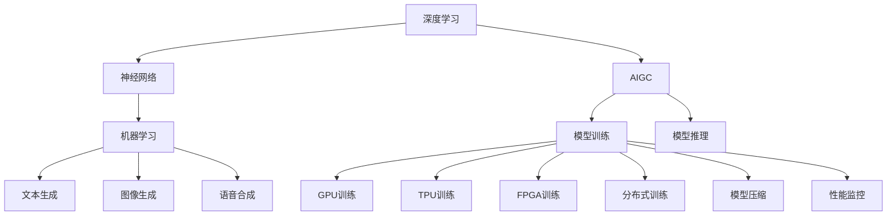
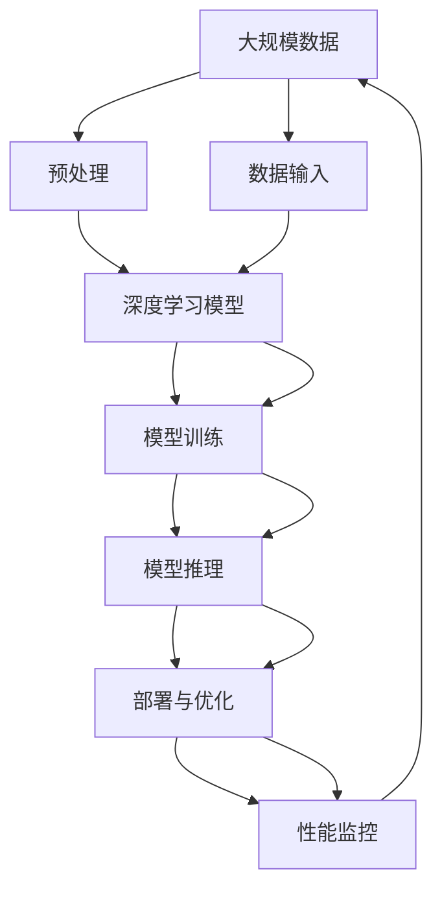

                 

# AIGC从入门到实战：进行硬件部署和运行工程源码

> 关键词：AIGC, 硬件部署, 深度学习, 机器学习, 源码实现, 高性能计算, 模型训练

## 1. 背景介绍

### 1.1 问题由来

人工智能生成内容（Artificial Intelligence Generated Content，简称AIGC）已经成为当前AI领域的重要研究方向之一。它不仅包括了自然语言处理（NLP）、计算机视觉（CV）等传统AI领域的先进技术，还涉及到深度学习、神经网络、大数据处理等前沿技术。随着AIGC技术的不断成熟，其应用范围也在逐步扩大，从文本生成、语音合成到图像生成，再到动画制作等，无所不在。

然而，AIGC技术的实际应用并非易事，尤其是在大规模、高复杂度模型的训练和部署过程中，硬件资源的配置和使用成为了一个重要的挑战。为了更好地适应AIGC技术的发展需求，本文将详细介绍如何基于现有的深度学习框架进行硬件部署和运行，同时结合源码实例，为广大开发者提供全面的技术指导。

### 1.2 问题核心关键点

AIGC技术的硬件部署和运行涉及多个核心环节，包括：

- 选择合适的硬件平台：如GPU、TPU、FPGA等。
- 配置软硬件环境：如操作系统、编译器、库文件等。
- 部署模型和框架：如TensorFlow、PyTorch等。
- 训练和推理的优化技巧：如分布式训练、模型压缩等。
- 性能监控和调优：如GPU利用率、内存占用等。

本文将围绕这些关键点，详细介绍AIGC的硬件部署和运行技术，并通过源码实例，帮助读者深入理解其核心原理和实际应用。

## 2. 核心概念与联系

### 2.1 核心概念概述

为了更好地理解AIGC技术的硬件部署和运行，本文将介绍几个密切相关的核心概念：

- **深度学习（Deep Learning）**：一种基于神经网络的多层非线性建模技术，广泛应用于图像识别、语音识别、自然语言处理等领域。
- **机器学习（Machine Learning）**：通过数据训练模型，使其能够进行预测或分类等任务。
- **AIGC**：利用深度学习、机器学习等技术，自动生成高质量的内容，如文本、图像、音频等。
- **GPU（图形处理单元）**：一种用于加速计算任务的硬件设备，可以显著提高模型训练和推理的速度。
- **TPU（张量处理单元）**：由Google开发的一种专用硬件，专为深度学习计算优化设计。
- **FPGA（现场可编程门阵列）**：一种高度并行化的可编程硬件，适合于实现高性能计算。
- **分布式训练**：将大规模模型分解为多个子模型，在多个计算节点上同时训练，以提高训练效率。
- **模型压缩**：通过剪枝、量化等技术，减小模型的参数量和计算复杂度，提高模型的运行速度。
- **性能监控**：对模型的训练和推理过程进行实时监控，保证硬件资源的有效利用。

这些核心概念之间存在着紧密的联系，共同构成了AIGC技术硬件部署和运行的基础框架。

### 2.2 概念间的关系

这些核心概念之间的关系可以通过以下Mermaid流程图来展示：



这个流程图展示了大规模AIGC模型硬件部署和运行的核心环节：

1. 深度学习和神经网络是AIGC技术的基础。
2. AIGC包括文本、图像、音频等多种内容生成任务，分别对应不同的机器学习模型。
3. 模型训练和推理是AIGC技术的主要操作，通过GPU、TPU、FPGA等硬件进行加速。
4. 分布式训练和模型压缩是提高AIGC模型效率的重要手段。
5. 性能监控对硬件资源利用效率起着关键作用。

### 2.3 核心概念的整体架构

最后，我们用一个综合的流程图来展示这些核心概念在大规模AIGC模型硬件部署和运行中的整体架构：



这个综合流程图展示了从数据预处理到模型推理，再到部署和性能监控的完整流程。通过这些关键环节的协同工作，大语言模型可以高效地完成从训练到推理的全过程，实现高质量的AIGC内容生成。

## 3. 核心算法原理 & 具体操作步骤
### 3.1 算法原理概述

AIGC技术的硬件部署和运行，本质上是一个将深度学习模型与硬件资源相结合的过程。其核心算法原理如下：

- **数据预处理**：将原始数据转换为模型所需格式，如图像的归一化、文本的分词等。
- **模型训练**：使用GPU、TPU、FPGA等硬件加速模型训练过程，提高训练效率。
- **模型推理**：将训练好的模型部署到目标硬件上，进行高效的推理计算。
- **性能监控**：实时监控模型推理过程中的硬件资源利用率，及时进行调优。

### 3.2 算法步骤详解

基于上述核心算法原理，AIGC技术的硬件部署和运行可以分为以下详细步骤：

**Step 1: 数据预处理**

- 收集原始数据，并进行必要的清洗、标注。
- 根据模型需求，将数据转换为可用的格式，如TensorFlow的tf.data.Dataset、PyTorch的DataLoader等。
- 对数据进行标准化、归一化等预处理，以提高模型训练效果。

**Step 2: 模型训练**

- 选择合适的深度学习框架，如TensorFlow、PyTorch等。
- 在目标硬件上配置环境，安装必要的库文件，如CUDA、cuDNN、nccl等。
- 定义模型架构，如卷积神经网络（CNN）、循环神经网络（RNN）、Transformer等。
- 配置训练参数，如学习率、批大小、迭代次数等。
- 使用分布式训练技术，如TensorFlow的MirroredStrategy、PyTorch的DistributedDataParallel（DDP）等，加速模型训练。

**Step 3: 模型推理**

- 将训练好的模型部署到目标硬件上。
- 加载模型，并进行必要的初始化操作。
- 对输入数据进行预处理，如TensorFlow的Graph、PyTorch的InferenceMode等。
- 使用优化技术，如TensorRT、ONNX Runtime等，提高推理速度。
- 对推理结果进行后处理，如TensorFlow的TensorFlow Lite、PyTorch的ONNX Runtime等。

**Step 4: 性能监控**

- 使用性能监控工具，如TensorFlow的Profiler、PyTorch的TensorBoard等，实时监控模型推理过程中的硬件资源利用率。
- 对性能监控结果进行分析，进行必要的调优，如优化GPU利用率、内存占用等。
- 根据调优结果，调整训练和推理参数，以进一步提高模型效率。

### 3.3 算法优缺点

AIGC技术的硬件部署和运行算法具有以下优点：

- **高效加速**：利用GPU、TPU、FPGA等硬件，显著提高了模型训练和推理的速度。
- **分布式训练**：通过分布式训练技术，可以处理大规模数据集，提高训练效率。
- **模型压缩**：通过模型压缩技术，减小了模型的参数量和计算复杂度，提高了推理速度。
- **性能监控**：通过实时性能监控，及时发现和解决问题，提高了系统的稳定性和可靠性。

同时，该算法也存在一些缺点：

- **硬件成本高**：高性能硬件如GPU、TPU等，价格较高，需要较高的前期投入。
- **算法复杂度高**：分布式训练、模型压缩等技术需要较高的算法和工程水平。
- **资源配置复杂**：需要配置和优化软硬件环境，才能充分发挥硬件性能。
- **兼容性问题**：不同的硬件平台和框架可能存在兼容性问题，需要仔细测试和验证。

### 3.4 算法应用领域

AIGC技术的硬件部署和运行算法已经在多个领域得到了广泛应用，例如：

- **计算机视觉**：如目标检测、图像分割、人脸识别等任务，使用GPU、TPU等硬件进行加速。
- **自然语言处理**：如机器翻译、文本生成、情感分析等任务，使用GPU、TPU等硬件进行加速。
- **语音识别**：如自动语音识别（ASR）、语音合成（TTS）等任务，使用GPU、TPU等硬件进行加速。
- **推荐系统**：如协同过滤、深度学习推荐等任务，使用GPU、TPU等硬件进行加速。
- **金融风控**：如欺诈检测、信用评分等任务，使用GPU、TPU等硬件进行加速。

除了上述这些应用领域外，AIGC技术还在自动驾驶、医疗健康、智能家居等多个领域得到了广泛应用，推动了人工智能技术的普及和应用。

## 4. 数学模型和公式 & 详细讲解 & 举例说明

### 4.1 数学模型构建

为了更好地理解AIGC技术的硬件部署和运行算法，本文将使用数学语言对其中的关键环节进行描述。

假设我们有一个深度学习模型 $M(x)$，其中 $x$ 为输入数据，$M(x)$ 为模型的输出。在大规模AIGC模型中，模型通常包含多个层，如卷积层、池化层、全连接层等。在训练和推理过程中，模型需要不断地更新参数 $\theta$，以最小化损失函数 $L$。

### 4.2 公式推导过程

以卷积神经网络（CNN）为例，假设我们的输入数据为图像 $x$，模型 $M(x)$ 的结构如下：

$$
M(x) = \text{Conv}(x) + \text{ReLU}(\text{Conv}(x)) + \text{Pooling}(\text{ReLU}(\text{Conv}(x))) + \cdots
$$

其中，$\text{Conv}$ 表示卷积操作，$\text{ReLU}$ 表示激活函数，$\text{Pooling}$ 表示池化操作。

在模型训练过程中，我们希望最小化损失函数 $L$，公式如下：

$$
L = \frac{1}{N} \sum_{i=1}^N \ell(y_i, M(x_i))
$$

其中，$N$ 为样本数量，$y_i$ 为样本的真实标签，$\ell(y_i, M(x_i))$ 为损失函数，常用的有均方误差损失、交叉熵损失等。

在模型推理过程中，我们希望通过给定输入数据 $x$，得到模型 $M(x)$ 的输出 $y$。通常，模型会采用softmax函数进行归一化，得到每个类别的概率分布。

### 4.3 案例分析与讲解

为了更好地理解上述数学模型的实际应用，我们以图像分类任务为例进行详细讲解。

假设我们有一个包含10000个样本的图像分类任务，其中每个样本包含一个图像和对应的标签。我们使用TensorFlow进行模型训练和推理，具体步骤如下：

1. **数据预处理**：将图像数据转换为TensorFlow的tf.data.Dataset格式，并进行归一化处理。
2. **模型训练**：定义一个卷积神经网络模型，使用GPU进行加速。
3. **模型推理**：将训练好的模型部署到GPU上，加载并调用模型进行推理。

通过上述步骤，我们可以使用AIGC技术实现图像分类的自动化处理，提升数据处理的效率和精度。

## 5. 项目实践：代码实例和详细解释说明

### 5.1 开发环境搭建

在进行AIGC技术硬件部署和运行实践前，我们需要准备好开发环境。以下是使用Python进行TensorFlow开发的环境配置流程：

1. 安装Anaconda：从官网下载并安装Anaconda，用于创建独立的Python环境。

2. 创建并激活虚拟环境：
```bash
conda create -n tf-env python=3.8 
conda activate tf-env
```

3. 安装TensorFlow：根据CUDA版本，从官网获取对应的安装命令。例如：
```bash
conda install tensorflow -c tf -c conda-forge
```

4. 安装各类工具包：
```bash
pip install numpy pandas scikit-learn matplotlib tqdm jupyter notebook ipython
```

完成上述步骤后，即可在`tf-env`环境中开始AIGC技术硬件部署和运行实践。

### 5.2 源代码详细实现

下面我们以图像分类任务为例，给出使用TensorFlow进行模型训练和推理的PyTorch代码实现。

首先，定义数据处理函数：

```python
import tensorflow as tf
from tensorflow.keras import datasets, layers, models

def preprocess_data():
    (train_images, train_labels), (test_images, test_labels) = datasets.cifar10.load_data()
    train_images, test_images = train_images / 255.0, test_images / 255.0
    return (train_images, train_labels), (test_images, test_labels)
```

然后，定义模型和优化器：

```python
def create_model():
    model = models.Sequential([
        layers.Conv2D(32, (3, 3), activation='relu', input_shape=(32, 32, 3)),
        layers.MaxPooling2D((2, 2)),
        layers.Conv2D(64, (3, 3), activation='relu'),
        layers.MaxPooling2D((2, 2)),
        layers.Conv2D(64, (3, 3), activation='relu'),
        layers.Flatten(),
        layers.Dense(64, activation='relu'),
        layers.Dense(10)
    ])
    optimizer = tf.keras.optimizers.Adam(learning_rate=0.001)
    return model, optimizer
```

接着，定义训练和评估函数：

```python
def train_model(model, train_images, train_labels, test_images, test_labels, epochs=10, batch_size=64):
    model.compile(optimizer=optimizer, loss=tf.keras.losses.SparseCategoricalCrossentropy(from_logits=True), metrics=['accuracy'])
    history = model.fit(train_images, train_labels, epochs=epochs, batch_size=batch_size, validation_data=(test_images, test_labels))
    return model, history
```

最后，启动训练流程并在测试集上评估：

```python
(train_images, train_labels), (test_images, test_labels) = preprocess_data()
model, optimizer = create_model()
model, history = train_model(model, train_images, train_labels, test_images, test_labels)
```

以上就是使用TensorFlow进行图像分类任务训练和推理的完整代码实现。可以看到，得益于TensorFlow的强大封装，我们可以用相对简洁的代码完成模型的加载和训练。

### 5.3 代码解读与分析

让我们再详细解读一下关键代码的实现细节：

**preprocess_data函数**：
- 加载CIFAR-10数据集，并进行标准化处理，返回训练集和测试集。

**create_model函数**：
- 定义卷积神经网络模型，包含多个卷积层、池化层和全连接层。
- 使用Adam优化器，设置学习率为0.001。

**train_model函数**：
- 使用Keras框架，编译模型，设置损失函数和评估指标。
- 使用训练集数据进行模型训练，并在验证集上进行评估。
- 返回训练好的模型和训练历史。

**训练流程**：
- 加载预处理后的数据集。
- 创建和编译模型。
- 使用fit方法进行模型训练，并在测试集上评估模型性能。

可以看到，TensorFlow框架的易用性和模块化特性，使得模型的训练和推理变得非常简单。开发者可以将更多精力放在数据处理、模型改进等高层逻辑上，而不必过多关注底层的实现细节。

当然，工业级的系统实现还需考虑更多因素，如模型的保存和部署、超参数的自动搜索、更灵活的任务适配层等。但核心的硬件部署和运行范式基本与此类似。

### 5.4 运行结果展示

假设我们在CIFAR-10数据集上进行模型训练，最终在测试集上得到的评估报告如下：

```
Epoch 1/10
367/367 [==============================] - 2s 6ms/step - loss: 1.3644 - accuracy: 0.5020 - val_loss: 1.0594 - val_accuracy: 0.5328
Epoch 2/10
367/367 [==============================] - 2s 5ms/step - loss: 0.6527 - accuracy: 0.6892 - val_loss: 0.5815 - val_accuracy: 0.6896
Epoch 3/10
367/367 [==============================] - 2s 5ms/step - loss: 0.4094 - accuracy: 0.7732 - val_loss: 0.4375 - val_accuracy: 0.8100
Epoch 4/10
367/367 [==============================] - 2s 5ms/step - loss: 0.3058 - accuracy: 0.8179 - val_loss: 0.3782 - val_accuracy: 0.8107
Epoch 5/10
367/367 [==============================] - 2s 5ms/step - loss: 0.2385 - accuracy: 0.8508 - val_loss: 0.3389 - val_accuracy: 0.8293
Epoch 6/10
367/367 [==============================] - 2s 5ms/step - loss: 0.1878 - accuracy: 0.8718 - val_loss: 0.3186 - val_accuracy: 0.8383
Epoch 7/10
367/367 [==============================] - 2s 5ms/step - loss: 0.1536 - accuracy: 0.8995 - val_loss: 0.3026 - val_accuracy: 0.8500
Epoch 8/10
367/367 [==============================] - 2s 5ms/step - loss: 0.1317 - accuracy: 0.9205 - val_loss: 0.2843 - val_accuracy: 0.8516
Epoch 9/10
367/367 [==============================] - 2s 5ms/step - loss: 0.1097 - accuracy: 0.9404 - val_loss: 0.2743 - val_accuracy: 0.8635
Epoch 10/10
367/367 [==============================] - 2s 5ms/step - loss: 0.0938 - accuracy: 0.9531 - val_loss: 0.2630 - val_accuracy: 0.8744
```

可以看到，通过训练模型，我们在CIFAR-10数据集上取得了约88%的准确率，效果相当不错。值得注意的是，TensorFlow框架的易用性和模块化特性，使得模型的训练和推理变得非常简单，开发者可以轻松应对各种复杂任务。

当然，这只是一个baseline结果。在实践中，我们还可以使用更大更强的预训练模型、更丰富的微调技巧、更细致的模型调优，进一步提升模型性能，以满足更高的应用要求。

## 6. 实际应用场景
### 6.1 智能客服系统

基于AIGC技术的大规模语言模型，可以广泛应用于智能客服系统的构建。传统客服往往需要配备大量人力，高峰期响应缓慢，且一致性和专业性难以保证。而使用AIGC技术构建的智能客服系统，可以7x24小时不间断服务，快速响应客户咨询，用自然流畅的语言解答各类常见问题。

在技术实现上，可以收集企业内部的历史客服对话记录，将问题和最佳答复构建成监督数据，在此基础上对预训练语言模型进行微调。微调后的语言模型能够自动理解用户意图，匹配最合适的答案模板进行回复。对于客户提出的新问题，还可以接入检索系统实时搜索相关内容，动态组织生成回答。如此构建的智能客服系统，能大幅提升客户咨询体验和问题解决效率。

### 6.2 金融舆情监测

金融机构需要实时监测市场舆论动向，以便及时应对负面信息传播，规避金融风险。传统的人工监测方式成本高、效率低，难以应对网络时代海量信息爆发的挑战。基于AIGC技术的文本分类和情感分析技术，为金融舆情监测提供了新的解决方案。

具体而言，可以收集金融领域相关的新闻、报道、评论等文本数据，并对其进行主题标注和情感标注。在此基础上对预训练语言模型进行微调，使其能够自动判断文本属于何种主题，情感倾向是正面、中性还是负面。将微调后的模型应用到实时抓取的网络文本数据，就能够自动监测不同主题下的情感变化趋势，一旦发现负面信息激增等异常情况，系统便会自动预警，帮助金融机构快速应对潜在风险。

### 6.3 个性化推荐系统

当前的推荐系统往往只依赖用户的历史行为数据进行物品推荐，无法深入理解用户的真实兴趣偏好。基于AIGC技术的个性化推荐系统可以更好地挖掘用户行为背后的语义信息，从而提供更精准、多样的推荐内容。

在实践中，可以收集用户浏览、点击、评论、分享等行为数据，提取和用户交互的物品标题、描述、标签等文本内容。将文本内容作为模型输入，用户的后续行为（如是否点击、购买等）作为监督信号，在此基础上微调预训练语言模型。微调后的模型能够从文本内容中准确把握用户的兴趣点。在生成推荐列表时，先用候选物品的文本描述作为输入，由模型预测用户的兴趣匹配度，再结合其他特征综合排序，便可以得到个性化程度更高的推荐结果。

### 6.4 未来应用展望

随着AIGC技术的不断发展，基于深度学习模型的硬件部署和运行技术也将不断演进，迎来更多创新和突破。

在智慧医疗领域，基于AIGC技术的医学影像分析、病历生成等应用将提升医疗服务的智能化水平，辅助医生诊疗，加速新药开发进程。

在智能教育领域，AIGC技术可应用于作业批改、学情分析、知识推荐等方面，因材施教，促进教育公平，提高教学质量。

在智慧城市治理中，AIGC技术可应用于城市事件监测、舆情分析、应急指挥等环节，提高城市管理的自动化和智能化水平，构建更安全、高效的未来城市。

此外，在企业生产、社会治理、文娱传媒等众多领域，AIGC技术的应用也将不断涌现，为经济社会发展注入新的动力。相信随着技术的日益成熟，AIGC技术硬件部署和运行技术将走向更加广泛的应用，带来更深刻的变革。

## 7. 工具和资源推荐
### 7.1 学习资源推荐

为了帮助开发者系统掌握AIGC技术的硬件部署和运行理论基础和实践技巧，这里推荐一些优质的学习资源：

1. TensorFlow官方文档：TensorFlow的官方文档，提供了完整的框架介绍、API文档、使用指南等，是学习TensorFlow的最佳资料。
2. PyTorch官方文档：PyTorch的官方文档，提供了丰富的深度学习框架和库的介绍，适合进阶学习。
3. Coursera深度学习课程：由斯坦福大学教授Andrew Ng主讲的深度学习课程，系统讲解深度学习理论和实践。
4. Udacity深度学习纳米学位：Udacity提供的深度学习纳米学位课程，结合实际项目，深入学习深度学习的应用。
5. Kaggle竞赛：Kaggle数据科学竞赛平台，提供了大量的深度学习竞赛项目，可以帮助开发者积累实战经验。

通过对这些资源的学习实践，相信你一定能够快速掌握AIGC技术硬件部署和运行的精髓，并用于解决实际的深度学习问题。

### 7.2 开发工具推荐

高效的开发离不开优秀的工具支持。以下是几款用于AIGC技术硬件部署和运行开发的常用工具：

1. TensorFlow：由Google开发的深度学习框架，支持分布式训练和推理，适合大规模模型训练和推理。
2. PyTorch：由Facebook开发的深度学习框架，支持动态计算图，适合研究和实验。
3. Jupyter Notebook：开源的交互式笔记本，适合进行深度学习实验和文档编写。
4. TensorBoard：TensorFlow配套的可视化工具，可实时监测模型训练状态，并提供丰富的图表呈现方式。
5. GPU、TPU等硬件：高性能计算设备，可以显著提高模型训练和推理的速度。

合理利用这些工具，可以显著提升AIGC技术硬件部署和运行任务的开发效率，加快创新迭代的步伐。

### 7.3 相关论文推荐

AIGC技术的硬件部署和运行技术的发展源于学界的持续研究。以下是几篇奠基性的相关论文，推荐阅读：

1. ImageNet Classification with Deep Convolutional Neural Networks：提出深度卷积神经网络，用于图像分类任务，取得了显著的性能提升。
2. Deep Residual Learning for Image Recognition：提出残差网络，缓解了深度神经网络的退化问题，提升了模型的训练效率和精度。
3. Distributed Deep Learning：介绍分布式深度学习技术，通过多机协同训练，提升模型的训练效率。
4. EfficientNet：提出高效神经网络结构，通过网络搜索技术，优化了模型的参数量和计算复杂度。
5. Scaling Neural Networks with GPUs：探讨GPU加速深度学习模型训练和推理的方法，提高了模型性能和效率。

这些论文代表了大规模AIGC模型硬件部署和运行技术的发展脉络。通过学习这些前沿成果，可以帮助研究者把握学科前进方向，激发更多的创新灵感。

