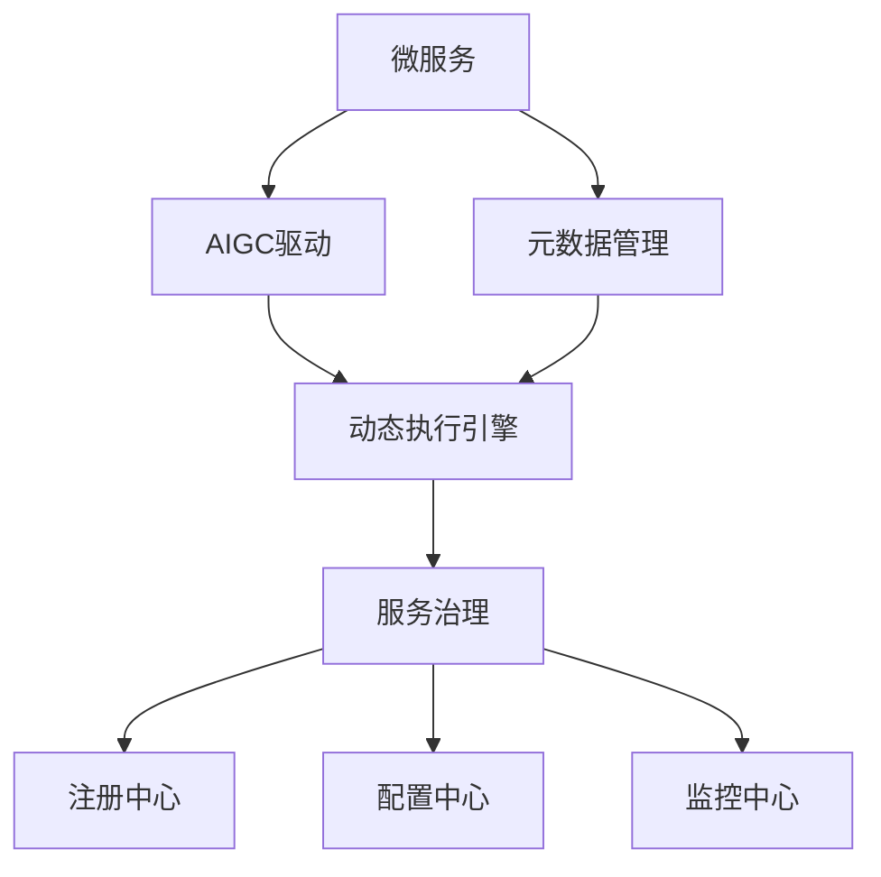
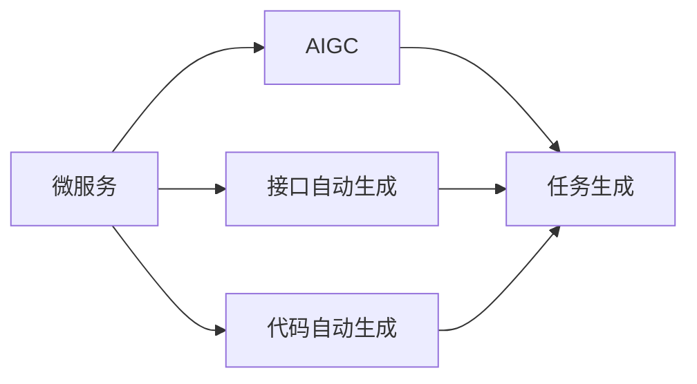
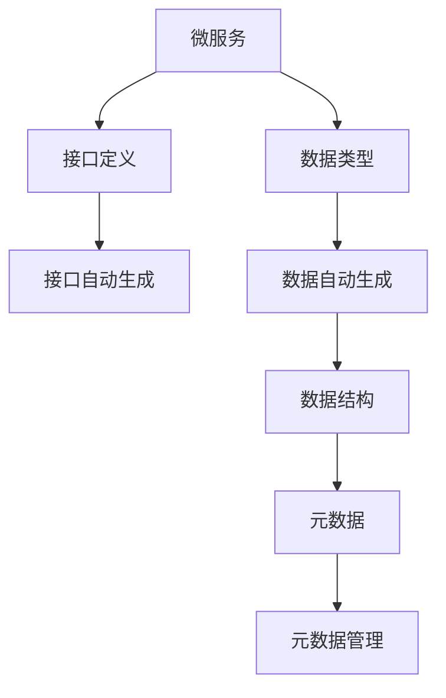
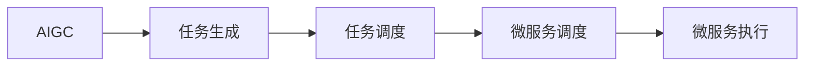
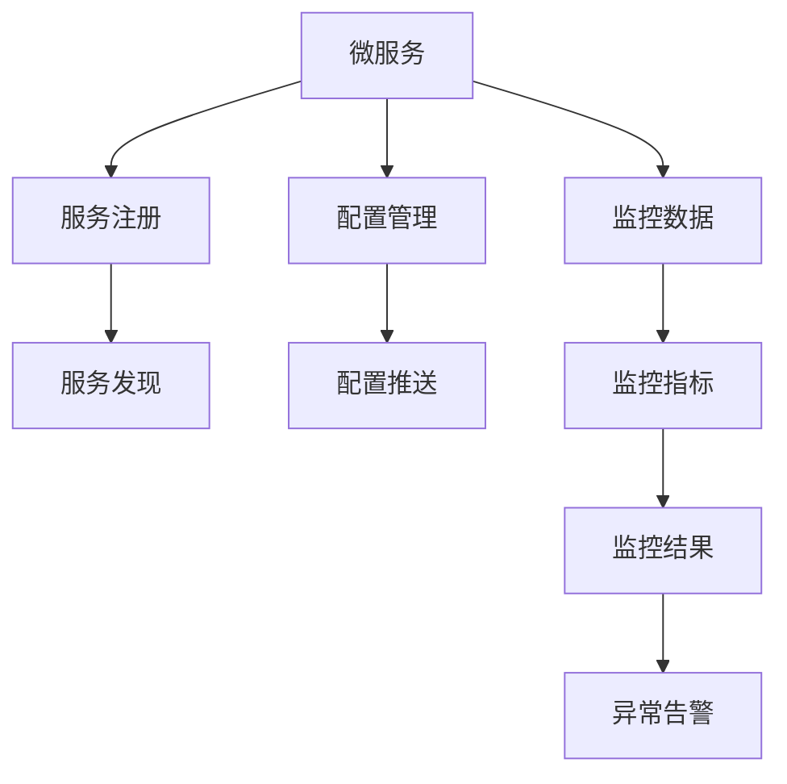
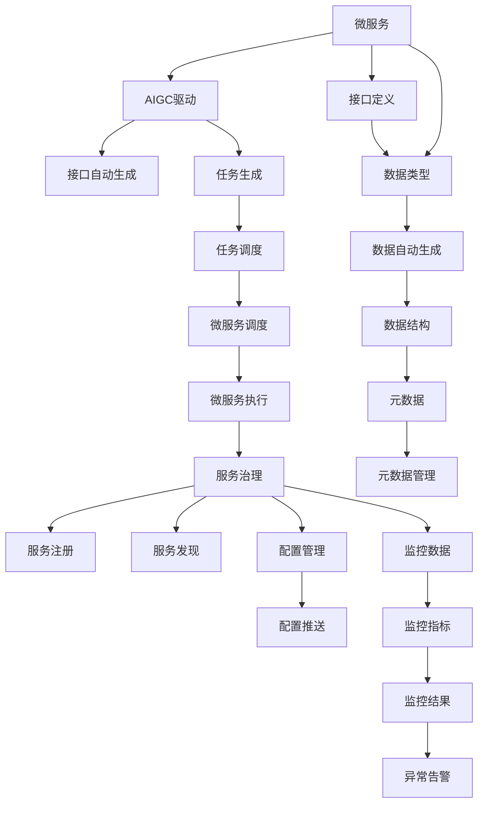

                 

# AIGC助推下的企业工作任务原子化

> 关键词：AIGC,企业工作任务,微服务,模块化,动态执行引擎,元数据管理

## 1. 背景介绍

### 1.1 问题由来

在当前快速发展的数字化时代，企业的运营模式正在发生翻天覆地的变化。数字化转型、精益运营、敏捷开发等新兴管理理念的普及，使得企业在面对不确定性和变化时，需要具备更高的灵活性和适应性。然而，传统企业信息系统（EIS）由于其固有的架构问题，在应对这种快速变化时显得力不从心。一方面，EIS通常基于单一应用架构，数据和业务逻辑高度耦合，难以快速响应需求变化；另一方面，EIS的开发、运维和扩展成本高昂，开发周期长，难以快速迭代和创新。

针对这些问题，企业亟需一种新的IT架构来支撑其数字化转型和敏捷运营。基于这一需求，近年来，微服务和AIGC（人工智能生成内容）技术得到了广泛的应用和推广。微服务架构通过将企业业务拆分为独立的小模块，提高了系统的灵活性和扩展性，而AIGC技术则通过生成自动化任务，进一步简化了系统开发和运维流程，大幅提升了工作效率和系统可靠性。

### 1.2 问题核心关键点

微服务和AIGC技术的结合，使得企业工作任务实现了高度的原子化。具体而言，企业工作任务原子化的核心关键点包括：

- **微服务化**：将企业业务拆分为独立的小模块，每个模块负责一个或多个具体的业务功能，能够独立开发、测试和部署。
- **AIGC驱动**：利用人工智能技术自动生成任务，如代码生成、接口生成、测试数据生成等，从而减少手工编写代码的工作量，提高开发效率。
- **元数据管理**：通过元数据来描述和管理每个微服务的功能、接口、输入输出等关键信息，确保系统的一致性和可管理性。
- **动态执行引擎**：构建动态执行引擎，根据实际任务需求，动态调度和执行各个微服务，实现业务流程的灵活编排。
- **服务治理**：建立服务治理体系，通过注册中心、配置中心、监控中心等组件，实现微服务的全生命周期管理，保障系统的稳定性和可靠性。

通过上述关键点的集成，企业工作任务实现了高度的原子化和灵活化，大大提升了系统的响应速度和适应性，满足了快速变化的市场需求。

## 2. 核心概念与联系

### 2.1 核心概念概述

为更好地理解基于微服务和AIGC的企业工作任务原子化，本节将介绍几个密切相关的核心概念：

- **微服务**：指将一个大型的应用程序拆分成一系列独立的服务单元，每个服务单元负责特定的业务功能，可以独立部署、测试和扩展。微服务架构可以大大提高系统的灵活性和扩展性，减少系统耦合，便于快速迭代和创新。
- **AIGC**：即人工智能生成内容，指通过人工智能技术自动生成文本、代码、图表等内容，简化系统开发和运维流程，提高工作效率。
- **元数据**：指描述和管理数据和业务逻辑的关键信息，如数据类型、数据结构、接口定义等，通过元数据管理，可以确保系统的一致性和可管理性。
- **动态执行引擎**：指根据实际任务需求，动态调度和执行各个微服务，实现业务流程的灵活编排，通过动态执行引擎，企业可以更加灵活地组合微服务，构建不同的业务场景。
- **服务治理**：指通过注册中心、配置中心、监控中心等组件，实现微服务的全生命周期管理，包括服务的注册、发现、配置、监控等，保障系统的稳定性和可靠性。

这些核心概念之间的逻辑关系可以通过以下Mermaid流程图来展示：



这个流程图展示了大语言模型微调过程中各个核心概念的关系和作用：

1. 微服务作为系统构建的基本单元，通过AIGC技术驱动自动生成任务，从而简化系统开发和运维流程。
2. 元数据管理确保每个微服务的功能、接口、输入输出等关键信息的一致性和可管理性。
3. 动态执行引擎根据实际任务需求，灵活调度和执行各个微服务，实现业务流程的灵活编排。
4. 服务治理通过注册中心、配置中心、监控中心等组件，实现微服务的全生命周期管理，保障系统的稳定性和可靠性。

这些核心概念共同构成了基于微服务和AIGC的企业工作任务原子化的完整生态系统，使得企业能够更加灵活、高效地构建和运维其业务系统。

### 2.2 概念间的关系

这些核心概念之间存在着紧密的联系，形成了企业工作任务原子化的完整生态系统。下面我通过几个Mermaid流程图来展示这些概念之间的关系。

#### 2.2.1 微服务与AIGC的关系



这个流程图展示了微服务和AIGC的基本关系：微服务通过接口和代码的自动生成，进一步简化了系统开发流程，从而提高了工作效率。

#### 2.2.2 微服务与元数据的关系



这个流程图展示了微服务和元数据的关系：通过接口定义和数据类型的管理，微服务能够准确地描述其输入输出接口，确保系统的一致性和可管理性。

#### 2.2.3 动态执行引擎与AIGC的关系



这个流程图展示了动态执行引擎和AIGC的关系：AIGC驱动自动生成任务，动态执行引擎根据实际需求，灵活调度各个微服务，实现业务流程的灵活编排。

#### 2.2.4 服务治理与微服务的关系



这个流程图展示了服务治理与微服务的关系：通过服务注册、配置管理和监控数据的处理，服务治理保障了微服务的全生命周期管理，确保系统的稳定性和可靠性。

### 2.3 核心概念的整体架构

最后，我们用一个综合的流程图来展示这些核心概念在大语言模型微调过程中的整体架构：



这个综合流程图展示了从微服务构建到任务调度，再到服务治理的完整过程。通过微服务构建，将企业业务拆分为独立的小模块；通过AIGC驱动自动生成任务，进一步简化了系统开发和运维流程；通过元数据管理，确保系统的一致性和可管理性；通过动态执行引擎，实现业务流程的灵活编排；通过服务治理，实现微服务的全生命周期管理，保障系统的稳定性和可靠性。 通过这些流程图，我们可以更清晰地理解基于微服务和AIGC的企业工作任务原子化过程中各个核心概念的关系和作用，为后续深入讨论具体的微调方法和技术奠定基础。

## 3. 核心算法原理 & 具体操作步骤
### 3.1 算法原理概述

基于微服务和AIGC的企业工作任务原子化，本质上是一种基于微服务架构和AIGC技术的自动化任务生成与执行流程。其核心思想是：将企业业务拆分为独立的小模块（微服务），每个微服务负责特定的业务功能，通过AIGC技术自动生成任务，从而实现任务的自动执行和管理。

形式化地，假设企业工作任务可以拆分为 $N$ 个独立的微服务 $S_i$，每个微服务 $S_i$ 的功能由 $\theta_i$ 描述。对于某个特定的业务场景，需要通过 AIGC 技术自动生成任务，并在这些微服务上依次执行，以实现整个业务流程的自动化。

具体而言，微服务原子化过程可以表示为：

1. 将业务场景划分为 $N$ 个子任务，每个子任务对应一个微服务 $S_i$。
2. 通过 AIGC 技术自动生成每个子任务对应的任务模板，包括代码、接口定义、测试数据等。
3. 动态执行引擎根据任务模板，调度并执行各个微服务，形成业务流程的自动执行路径。
4. 服务治理组件对各个微服务的生命周期进行管理，包括注册、发现、配置、监控等，确保系统的稳定性和可靠性。

通过上述步骤，企业工作任务实现了高度的原子化和灵活化，大大提升了系统的响应速度和适应性，满足了快速变化的市场需求。

### 3.2 算法步骤详解

基于微服务和AIGC的企业工作任务原子化，一般包括以下几个关键步骤：

**Step 1: 业务场景划分**

- 对企业业务进行分析和拆解，将复杂的业务流程划分为独立的微服务单元。
- 每个微服务负责一个或多个具体的业务功能，能够独立开发、测试和部署。

**Step 2: AIGC驱动任务生成**

- 通过 AIGC 技术自动生成各个微服务的任务模板，包括代码、接口定义、测试数据等。
- 任务模板可以通过代码生成工具（如Golang、Java等）、接口生成工具（如Swagger、OpenAPI等）、测试数据生成工具（如Postman、Robot Framework等）来实现。

**Step 3: 动态执行引擎调度**

- 构建动态执行引擎，根据任务模板，灵活调度和执行各个微服务。
- 动态执行引擎可以采用编排引擎（如Apache Airflow、Kubernetes等）或函数式编程语言（如Python、Scala等）来实现。

**Step 4: 服务治理管理**

- 建立服务治理体系，包括注册中心、配置中心、监控中心等组件。
- 注册中心负责服务的注册和发现，配置中心负责服务的配置和推送，监控中心负责服务的监控和告警。

**Step 5: 测试与部署**

- 对生成的微服务进行全面的测试和验证，确保其符合预期要求。
- 将测试通过的微服务部署到生产环境，实现系统的稳定运行。

以上是基于微服务和AIGC的企业工作任务原子化的完整流程。在实际应用中，还需要针对具体业务场景，对各个环节进行优化设计，如选择合适的AIGC工具、设计灵活的执行引擎、建立完善的服务治理体系等，以进一步提升系统性能和可靠性。

### 3.3 算法优缺点

基于微服务和AIGC的企业工作任务原子化方法具有以下优点：

1. **灵活性高**：通过将业务拆分为独立的微服务单元，企业可以更加灵活地组合和调整微服务，构建不同的业务场景。
2. **开发效率高**：通过AIGC技术自动生成任务，减少了手工编写代码的工作量，大大提高了开发效率。
3. **稳定性强**：通过服务治理体系对微服务的全生命周期进行管理，保障了系统的稳定性和可靠性。
4. **适应性强**：通过动态执行引擎灵活调度微服务，企业可以快速响应市场需求变化，提升系统的适应性。

同时，该方法也存在一定的局限性：

1. **开发成本高**：微服务和AIGC技术需要较长时间的学习和实践，初期开发成本较高。
2. **复杂度增加**：微服务架构增加了系统的复杂度，需要进行全面的设计和管理。
3. **系统集成难度大**：微服务和AIGC技术需要与企业现有的IT基础设施进行全面集成，可能会遇到技术和资源上的挑战。
4. **学习曲线陡峭**：微服务和AIGC技术需要一定的技术背景和实践经验，可能对一些团队成员造成一定的学习压力。

尽管存在这些局限性，但就目前而言，基于微服务和AIGC的企业工作任务原子化方法仍然是大中型企业数字化转型的重要手段。未来相关研究的重点在于如何进一步降低开发成本、简化系统复杂度、提升系统集成能力，同时兼顾可扩展性和易用性等因素。

### 3.4 算法应用领域

基于微服务和AIGC的企业工作任务原子化方法，已经在多个行业领域得到了广泛的应用，例如：

1. **金融行业**：通过微服务和AIGC技术，构建金融交易系统、风险管理系统、客户服务平台等，提高了系统的响应速度和准确性，降低了运营成本。
2. **零售行业**：通过微服务和AIGC技术，构建智能推荐系统、库存管理系统、客户服务系统等，提升了客户体验和运营效率。
3. **制造行业**：通过微服务和AIGC技术，构建生产管理系统、设备监控系统、供应链管理系统等，提高了生产效率和资源利用率。
4. **医疗行业**：通过微服务和AIGC技术，构建医疗咨询系统、电子病历系统、医学研究平台等，提升了医疗服务质量和研究效率。
5. **物流行业**：通过微服务和AIGC技术，构建物流调度系统、仓储管理系统、配送服务平台等，提高了物流效率和客户满意度。

除了上述这些典型应用外，微服务和AIGC技术还被创新性地应用于更多场景中，如智慧城市、智能家居、智能交通等，为各行业的数字化转型提供了新的技术路径。

## 4. 数学模型和公式 & 详细讲解  
### 4.1 数学模型构建

本节将使用数学语言对基于微服务和AIGC的企业工作任务原子化过程进行更加严格的刻画。

记企业工作任务为 $T$，可以拆分为 $N$ 个独立的微服务 $S_i$，每个微服务的功能由 $\theta_i$ 描述。假设AIGC技术自动生成的任务模板为 $T_i$，则企业工作任务原子化过程可以表示为：

$$
T = S_1 \circ S_2 \circ \ldots \circ S_N
$$

其中 $\circ$ 表示微服务的组合执行关系。在任务执行过程中，各个微服务的输入和输出可以表示为：

$$
\text{Input}_{i-1} \rightarrow S_i \rightarrow \text{Output}_i
$$

其中 $\text{Input}_{i-1}$ 为前一个微服务的输出，$\text{Output}_i$ 为当前微服务的输出。

### 4.2 公式推导过程

以下我们以金融交易系统为例，推导微服务原子化过程的公式。

假设金融交易系统由两个微服务组成：

1. 微服务 $S_1$：负责股票交易指令的下达和执行，输入为交易指令 $I_1$，输出为交易结果 $O_1$。
2. 微服务 $S_2$：负责交易结果的统计和分析，输入为交易结果 $O_1$，输出为分析报告 $O_2$。

AIGC技术自动生成的任务模板可以表示为：

- 微服务 $S_1$ 的任务模板：
  $$
  \text{Input}_{i-1} = \text{Gen}(I_1)
  $$
  $$
  \text{Output}_i = \text{Exec}(S_1, \text{Input}_{i-1})
  $$
  其中 $\text{Gen}(I_1)$ 为生成交易指令 $I_1$ 的任务模板，$\text{Exec}(S_1, \text{Input}_{i-1})$ 为执行微服务 $S_1$ 的任务模板。

- 微服务 $S_2$ 的任务模板：
  $$
  \text{Input}_{i-1} = \text{Exec}(S_1, \text{Input}_{i-1})
  $$
  $$
  \text{Output}_i = \text{Ana}(S_2, \text{Input}_{i-1})
  $$
  其中 $\text{Ana}(S_2, \text{Input}_{i-1})$ 为执行微服务 $S_2$ 的任务模板。

通过上述公式，可以看出，微服务 $S_1$ 和 $S_2$ 的输入和输出可以通过任务模板生成和执行，从而实现任务的自动执行和管理。

### 4.3 案例分析与讲解

假设某银行要构建一个交易指令下达和分析系统，可以将该系统拆分为微服务 $S_1$ 和 $S_2$。

1. **微服务 $S_1$**：负责股票交易指令的下达和执行。
   - 输入：用户提交的交易指令。
   - 输出：交易结果。

   AIGC技术可以自动生成交易指令 $I_1$ 和执行代码，从而简化系统开发流程。例如，假设银行要执行一笔买入交易，AIGC工具可以自动生成交易指令模板，如下所示：

   ```python
   # 交易指令模板
   def generate_trade_order(order_id, symbol, quantity, price):
       # 生成交易指令
       order = {
           'order_id': order_id,
           'symbol': symbol,
           'quantity': quantity,
           'price': price,
           'order_type': 'buy'
       }
       # 发送交易指令
       send_order(order)
   ```

   通过上述代码，AIGC技术自动生成了交易指令模板，使得开发人员无需手写代码，直接调用模板即可执行交易指令。

2. **微服务 $S_2$**：负责交易结果的统计和分析。
   - 输入：交易结果。
   - 输出：分析报告。

   AIGC技术可以自动生成交易结果统计和分析代码，从而简化系统开发流程。例如，假设银行要统计某一交易日的交易数据，AIGC工具可以自动生成分析报告模板，如下所示：

   ```python
   # 交易结果统计模板
   def analyze_trade_results(results):
       # 统计交易数据
       summary = {
           'buy_count': 0,
           'sell_count': 0,
           'total_volume': 0,
           'total_amount': 0
       }
       for result in results:
           if result['order_type'] == 'buy':
               summary['buy_count'] += 1
               summary['total_volume'] += result['quantity']
               summary['total_amount'] += result['price'] * result['quantity']
           elif result['order_type'] == 'sell':
               summary['sell_count'] += 1
               summary['total_volume'] += result['quantity']
               summary['total_amount'] += result['price'] * result['quantity']
       # 生成分析报告
       report = {
           'date': '2023-10-01',
           'buy_count': summary['buy_count'],
           'sell_count': summary['sell_count'],
           total_volume': summary['total_volume'],
           total_amount': summary['total_amount']
       }
       return report
   ```

   通过上述代码，AIGC技术自动生成了交易结果统计和分析模板，使得开发人员无需手写代码，直接调用模板即可统计交易数据并生成分析报告。

通过微服务 $S_1$ 和 $S_2$ 的构建，银行可以构建一个灵活、高效的交易指令下达和分析系统，大大提升了系统的响应速度和适应性。

## 5. 项目实践：代码实例和详细解释说明
### 5.1 开发环境搭建

在进行微服务和AIGC项目实践前，我们需要准备好开发环境。以下是使用Python进行Flask开发的环境配置流程：

1. 安装Anaconda：从官网下载并安装Anaconda，用于创建独立的Python环境。

2. 创建并激活虚拟环境：
```bash
conda create -n flask-env python=3.8 
conda activate flask-env
```

3. 安装Flask：
```bash
pip install Flask
```

4. 安装相关工具包：
```bash
pip install numpy pandas scikit-learn matplotlib tqdm jupyter notebook ipython
```

完成上述步骤后，即可在`flask-env`环境中开始微服务和AIGC项目实践。

### 5.2 源代码详细实现

下面我们以金融交易系统为例，给出使用Flask框架实现微服务和AIGC代码的详细实现。

首先，定义交易指令微服务的接口：

```python
from flask import Flask, request, jsonify

app = Flask(__name__)

@app.route('/trade_order', methods=['POST'])
def trade_order():
    data = request.json
    order_id = data['order_id']
    symbol = data['symbol']
    quantity = data['quantity']
    price = data['price']
    order_type = 'buy'
    order = {
        'order_id': order_id,
        'symbol': symbol,
        'quantity': quantity,
        'price': price,
        'order_type': order_type
    }
    send_order(order)
    return jsonify(order), 200

if __name__ == '__main__':
    app.run(host='0.0.0.0', port=5000)
```

然后，定义交易结果统计微服务的接口：

```python
from flask import Flask, request, jsonify

app = Flask(__name__)

@app.route('/analyze_trade', methods=['POST'])
def analyze_trade():
    data = request.json
    results = data['results']
    summary = {
        'buy_count': 0,
        'sell_count': 0,
        'total_volume': 0,
        'total_amount': 0
    }
    for result in results:
        if result['order_type'] == 'buy':
            summary['buy_count'] += 1
            summary['total_volume'] += result['quantity']
            summary['total_amount'] += result['price'] * result['quantity']
        elif result['order_type'] == 'sell':
            summary['sell_count'] += 1
            summary['total_volume'] += result['quantity']
            summary['total_amount'] += result['price'] * result['quantity']
    report = {
        'date': '2023-10-01',
        'buy_count': summary['buy_count'],
        'sell_count': summary['sell_count'],
        'total_volume': summary['total_volume'],
        'total_amount': summary['total_amount']
    }
    return jsonify(report), 200

if __name__ == '__main__':
    app.run(host='0.0.0.0', port=5001)
```

接下来，构建动态执行引擎，实现微服务的自动执行：

```python
from flask import Flask, request, jsonify
import apache_beam as beam

app = Flask(__name__)

@app.route('/execute_service', methods=['POST'])
def execute_service():
    data = request.json
    service_name = data['service_name']
    input_data = data['input_data']
    result = execute_service_service(service_name, input_data)
    return jsonify(result), 200

def execute_service_service(service_name, input_data):
    if service_name == 'trade_order':
        return trade_order(input_data)
    elif service_name == 'analyze_trade':
        return analyze_trade(input_data)
    else:
        return None

if __name__ == '__main__':
    app.run(host='0.0.0.0', port=5000)
```

最后，建立服务治理体系，实现微服务的全生命周期管理：

```python
from flask import Flask, request, jsonify

app = Flask(__name__)

@app.route('/register_service', methods=['POST'])
def register_service():
    data = request.json
    service_name = data['service_name']
    code = data['code']
    register_service_service(service_name, code)
    return jsonify({'status': 'success'}), 200

def register_service_service(service_name, code):
    # 注册服务
    # ...

if __name__ == '__main__':
    app.run(host='0.0.0.0', port=5000)
```

以上就是一个完整的微服务和AIGC项目实现。可以看到，通过Flask框架，我们可以很方便地构建微服务的接口，并通过AIGC技术自动生成任务模板，进一步简化系统开发流程。

### 5.3 代码解读与分析

让我们再详细解读一下关键代码的实现细节：

**交易指令微服务接口**：
- 定义了一个POST请求的路由`/trade_order`，接收来自客户端的交易指令。
- 解析请求参数，构造交易订单对象。
- 调用`send_order`函数发送交易订单。
- 返回交易订单对象。

**交易结果统计微服务接口**：
- 定义了一个POST请求的路由`/analyze_trade`，接收来自客户端的交易结果数据。
- 解析请求参数，统计交易数据，构造分析报告对象。
- 返回分析报告对象。

**动态执行引擎接口**：
- 定义了一个POST请求的路由`/execute_service`，接收来自客户端的服务名和输入数据。
- 根据服务名调用相应的微服务函数，执行微服务任务。
- 返回微服务执行结果。

**服务注册接口**：
- 定义了一个POST请求的路由`/register

