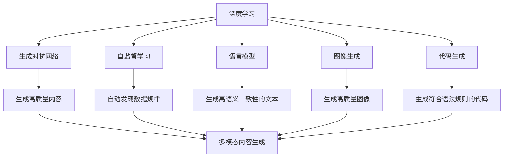
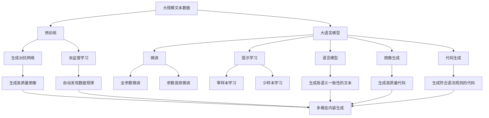

                 

# AIGC原理与代码实例讲解

> 关键词：自动生成内容(AIGC), 深度学习, 生成对抗网络(GAN), 自监督学习, 语言模型, 图像生成, 代码生成, 技术创新

## 1. 背景介绍

### 1.1 问题由来
人工智能生成内容(Automatic Image and Content Generating, AIGC)是近年来深度学习领域的一项重要突破。它利用深度神经网络模型，从大量的无标签数据中学习到复杂的语义和语境，并能够自动生成高质量的图像、文本、音频等多模态内容。AIGC技术在娱乐、广告、影视、电商等领域有着广泛的应用前景。

例如，OpenAI的GPT-3和DALL-E等模型分别在文本和图像生成上取得了令人瞩目的成绩。GPT-3可以生成高语义一致性的文本，而DALL-E则可以生成高质量的图像。

但即便如此，AIGC技术仍然面临一些挑战。例如，如何高效地训练模型，如何提高生成的内容质量和多样性，如何应用于特定领域等。本文将详细讲解AIGC技术的核心原理和实现细节，以期为读者提供全面的技术指导。

### 1.2 问题核心关键点
AIGC的核心在于通过深度学习模型，自动学习数据中的潜在规律，并利用这些规律生成新的内容。其核心技术包括：

- 深度学习：利用神经网络模型从大量数据中学习特征和规律。
- 生成对抗网络(GAN)：利用两组对抗性的神经网络，生成逼真的内容。
- 自监督学习：利用无标签数据训练模型，学习内容的生成规律。
- 语言模型：利用预训练的语言模型，生成高语义一致性的文本。
- 图像生成：利用卷积神经网络(CNN)等模型，生成高质量的图像。
- 代码生成：利用神经网络生成符合特定语法和语义规则的代码。

这些技术相互结合，构成了AIGC的核心框架。

### 1.3 问题研究意义
AIGC技术的开发和应用，对推动人工智能技术的发展具有重要意义：

- 降低内容制作成本。利用AIGC技术可以自动化生成高质量内容，减少人力制作的时间和成本。
- 提升内容创作效率。AIGC技术可以快速生成多版本的文案、广告、视频等，加速内容创作流程。
- 提高内容多样化。AIGC技术可以生成多种风格和类型的内容，满足不同用户的需求。
- 推动技术创新。AIGC技术涉及的深度学习、生成对抗网络等前沿技术，可以推动人工智能技术的整体发展。
- 赋能产业升级。AIGC技术可以应用于新闻、媒体、娱乐、教育等多个领域，赋能传统产业数字化转型。

因此，深入研究AIGC技术，对推动人工智能技术的产业化进程，提升内容创作效率，具有重要的价值。

## 2. 核心概念与联系

### 2.1 核心概念概述

为更好地理解AIGC技术的核心原理和实现细节，本节将介绍几个密切相关的核心概念：

- 深度学习：一种模拟人脑神经网络结构的机器学习方法，通过多层神经网络，对输入数据进行特征提取和规律学习。
- 生成对抗网络(GAN)：由生成器(G)和判别器(D)两组神经网络构成，G生成伪造数据，D鉴别真伪，两者相互博弈，最终生成逼真的内容。
- 自监督学习：利用无标签数据训练模型，自动发现数据的潜在结构和规律。
- 语言模型：一种预训练的语言模型，如BERT、GPT等，可以自动学习文本中的语义和语法规律。
- 图像生成：利用卷积神经网络(CNN)等模型，从随机噪声中生成高质量的图像内容。
- 代码生成：利用神经网络模型，自动生成符合特定语法和语义规则的代码。

这些核心概念共同构成了AIGC技术的生态系统，可以用于生成文本、图像、代码等多种类型的内容。

### 2.2 概念间的关系

这些核心概念之间存在着紧密的联系，形成了AIGC技术的完整框架。下面我们通过几个Mermaid流程图来展示这些概念之间的关系：



这个流程图展示了深度学习、生成对抗网络、自监督学习、语言模型、图像生成和代码生成等核心概念之间的关系：

1. 深度学习通过多层次神经网络模型，自动学习数据的规律和特征。
2. 生成对抗网络利用两组对抗性神经网络，生成高质量的内容。
3. 自监督学习利用无标签数据，自动发现数据的潜在结构和规律。
4. 语言模型通过预训练，学习文本中的语义和语法规律。
5. 图像生成利用卷积神经网络，从随机噪声中生成高质量的图像内容。
6. 代码生成利用神经网络模型，自动生成符合特定语法和语义规则的代码。

这些概念共同构成了AIGC技术的核心框架，使得模型能够自动生成多模态内容。

### 2.3 核心概念的整体架构

最后，我们用一个综合的流程图来展示这些核心概念在大语言模型微调过程中的整体架构：



这个综合流程图展示了从预训练到微调，再到提示学习的完整过程。深度学习模型首先在大规模文本数据上进行预训练，然后通过微调（包括全参数微调和参数高效微调）或提示学习（包括零样本和少样本学习）来适应下游任务。同时，生成对抗网络和自监督学习等技术，可以进一步提升模型的生成质量和多样性。

## 3. 核心算法原理 & 具体操作步骤
### 3.1 算法原理概述

AIGC技术的核心算法包括深度学习、生成对抗网络和自监督学习等。本节将详细介绍这些算法的原理和操作步骤。

### 3.2 算法步骤详解

#### 3.2.1 深度学习

深度学习模型通常包含多个隐藏层，每一层都会对输入数据进行特征提取和规律学习。在AIGC中，通常使用循环神经网络(RNN)或卷积神经网络(CNN)等模型，从文本、图像等数据中自动学习特征。

**步骤1: 准备数据**
- 收集大量的无标签数据，用于训练深度学习模型。
- 将数据分为训练集、验证集和测试集。

**步骤2: 构建模型**
- 选择合适的深度学习框架，如TensorFlow、PyTorch等。
- 设计深度学习模型的结构，选择合适的隐藏层大小、激活函数等参数。
- 使用随机梯度下降等优化算法进行模型训练。

**步骤3: 模型评估**
- 在验证集上评估模型性能，调整模型参数。
- 在测试集上最终评估模型效果。

#### 3.2.2 生成对抗网络(GAN)

生成对抗网络由生成器和判别器两个部分组成，它们通过对抗博弈，生成逼真的内容。GAN的基本步骤如下：

**步骤1: 准备数据**
- 收集大量的真实数据，作为生成器的参考样本。
- 生成噪声作为生成器的输入，用于生成伪造数据。

**步骤2: 构建模型**
- 设计生成器和判别器的结构，通常使用卷积神经网络(CNN)或循环神经网络(RNN)。
- 定义生成器和判别器的损失函数，通常为交叉熵损失。

**步骤3: 模型训练**
- 交替训练生成器和判别器，优化损失函数。
- 在训练过程中，逐渐提高判别器的鉴别能力，最终生成高质量的内容。

#### 3.2.3 自监督学习

自监督学习利用无标签数据，自动发现数据的潜在结构和规律。在AIGC中，常见的自监督任务包括掩码语言模型、图像补全等。

**步骤1: 准备数据**
- 收集大量的无标签数据，用于训练自监督模型。
- 将数据分为训练集、验证集和测试集。

**步骤2: 构建模型**
- 选择合适的自监督学习框架，如PyTorch等。
- 设计自监督模型的结构，选择合适的隐藏层大小、激活函数等参数。
- 设计自监督任务，如掩码语言模型、图像补全等。

**步骤3: 模型训练**
- 在无标签数据上训练自监督模型，优化损失函数。
- 在验证集上评估模型性能，调整模型参数。

#### 3.2.4 语言模型

语言模型利用预训练的语言模型，如BERT、GPT等，自动学习文本中的语义和语法规律。

**步骤1: 准备数据**
- 收集大量的无标签文本数据，用于训练语言模型。
- 将数据分为训练集、验证集和测试集。

**步骤2: 构建模型**
- 选择合适的语言模型框架，如TensorFlow、PyTorch等。
- 设计语言模型的结构，选择合适的隐藏层大小、激活函数等参数。
- 使用掩码语言模型等自监督任务进行预训练。

**步骤3: 模型微调**
- 在特定任务的数据集上进行微调，优化模型参数。
- 在验证集上评估模型性能，调整模型参数。

#### 3.2.5 图像生成

图像生成利用卷积神经网络(CNN)等模型，从随机噪声中生成高质量的图像内容。

**步骤1: 准备数据**
- 收集大量的图像数据，用于训练图像生成模型。
- 将数据分为训练集、验证集和测试集。

**步骤2: 构建模型**
- 选择合适的图像生成框架，如TensorFlow、PyTorch等。
- 设计图像生成模型的结构，选择合适的隐藏层大小、激活函数等参数。
- 使用图像生成对抗网络等生成对抗网络模型进行训练。

**步骤3: 模型评估**
- 在验证集上评估模型性能，调整模型参数。
- 在测试集上最终评估模型效果。

#### 3.2.6 代码生成

代码生成利用神经网络模型，自动生成符合特定语法和语义规则的代码。

**步骤1: 准备数据**
- 收集大量的代码数据，用于训练代码生成模型。
- 将数据分为训练集、验证集和测试集。

**步骤2: 构建模型**
- 选择合适的代码生成框架，如TensorFlow、PyTorch等。
- 设计代码生成模型的结构，选择合适的隐藏层大小、激活函数等参数。
- 使用代码补全等自监督任务进行预训练。

**步骤3: 模型微调**
- 在特定任务的代码数据集上进行微调，优化模型参数。
- 在验证集上评估模型性能，调整模型参数。

### 3.3 算法优缺点

AIGC技术的优点包括：

1. 自动化生成内容。利用深度学习模型可以自动化生成高质量的文本、图像、代码等多模态内容，减少人工制作的时间和成本。
2. 提升内容创作效率。AIGC技术可以快速生成多版本的文案、广告、视频等，加速内容创作流程。
3. 提高内容多样化。AIGC技术可以生成多种风格和类型的内容，满足不同用户的需求。
4. 推动技术创新。AIGC技术涉及的深度学习、生成对抗网络等前沿技术，可以推动人工智能技术的整体发展。
5. 赋能产业升级。AIGC技术可以应用于新闻、媒体、娱乐、教育等多个领域，赋能传统产业数字化转型。

AIGC技术的缺点包括：

1. 模型复杂度高。AIGC模型通常包含大量参数，训练和推理过程复杂。
2. 数据需求量大。生成高质量内容需要大量高质量的数据，获取高质量数据的成本较高。
3. 生成内容缺乏多样性。AIGC生成的内容往往缺乏多样性，难以满足特定用户的需求。
4. 生成内容缺乏稳定性。AIGC生成的内容容易受到输入噪声的影响，生成内容的质量不稳定。
5. 缺乏可解释性。AIGC模型通常作为"黑盒"系统，难以解释其内部工作机制和决策逻辑。

尽管存在这些缺点，但AIGC技术的优点依然显著，使得其在实际应用中具有重要的价值。

### 3.4 算法应用领域

AIGC技术已经广泛应用于多个领域，包括但不限于：

- 娱乐和游戏：生成逼真的游戏素材、动画、音乐等内容。
- 广告和营销：生成吸引人的广告文案、视频、图片等内容。
- 媒体和新闻：生成高质量的新闻报道、视频剪辑、图片等内容。
- 电商和零售：生成推荐商品文案、产品图片、视频等内容。
- 教育和培训：生成课程内容、模拟场景、虚拟人物等内容。
- 设计和艺术：生成高质量的设计图、插画、动画等内容。
- 金融和投资：生成市场分析报告、交易策略等内容。

这些应用领域展示了AIGC技术的广泛应用前景，使得其在各行各业中都能够发挥重要作用。

## 4. 数学模型和公式 & 详细讲解 & 举例说明

### 4.1 数学模型构建

在AIGC技术中，数学模型主要应用于深度学习、生成对抗网络和自监督学习等算法中。本节将详细讲解这些数学模型的构建方法。

#### 4.1.1 深度学习模型

深度学习模型通常包含多个隐藏层，每一层都会对输入数据进行特征提取和规律学习。以卷积神经网络(CNN)为例，其数学模型可以表示为：

$$
y = W \cdot x + b
$$

其中 $x$ 为输入特征，$y$ 为输出特征，$W$ 为权重矩阵，$b$ 为偏置向量。通过反向传播算法，模型可以自动更新权重和偏置，优化模型性能。

#### 4.1.2 生成对抗网络(GAN)

生成对抗网络由生成器和判别器两个部分组成，它们通过对抗博弈，生成逼真的内容。生成器的数学模型可以表示为：

$$
x = G(z)
$$

其中 $x$ 为生成的内容，$z$ 为随机噪声，$G$ 为生成器网络。判别器的数学模型可以表示为：

$$
y = D(x)
$$

其中 $x$ 为真实或生成的内容，$y$ 为判别器输出的概率值，$D$ 为判别器网络。在训练过程中，生成器和判别器交替优化，生成逼真的内容。

#### 4.1.3 自监督学习模型

自监督学习模型通常利用掩码语言模型等任务，从无标签数据中自动学习规律。以掩码语言模型为例，其数学模型可以表示为：

$$
y = W \cdot x + b
$$

其中 $x$ 为输入特征，$y$ 为输出特征，$W$ 为权重矩阵，$b$ 为偏置向量。通过掩码语言模型等自监督任务，模型可以自动学习数据的结构和规律。

### 4.2 公式推导过程

以下是深度学习、生成对抗网络和自监督学习等算法的数学模型推导过程。

#### 4.2.1 深度学习模型

深度学习模型的数学模型可以表示为：

$$
y = W \cdot x + b
$$

其中 $x$ 为输入特征，$y$ 为输出特征，$W$ 为权重矩阵，$b$ 为偏置向量。

### 4.2.2 生成对抗网络(GAN)

生成对抗网络的数学模型可以表示为：

$$
x = G(z)
$$

其中 $x$ 为生成的内容，$z$ 为随机噪声，$G$ 为生成器网络。判别器的数学模型可以表示为：

$$
y = D(x)
$$

其中 $x$ 为真实或生成的内容，$y$ 为判别器输出的概率值，$D$ 为判别器网络。在训练过程中，生成器和判别器交替优化，生成逼真的内容。

### 4.2.3 自监督学习模型

自监督学习模型的数学模型可以表示为：

$$
y = W \cdot x + b
$$

其中 $x$ 为输入特征，$y$ 为输出特征，$W$ 为权重矩阵，$b$ 为偏置向量。

### 4.2.4 语言模型

语言模型的数学模型可以表示为：

$$
y = W \cdot x + b
$$

其中 $x$ 为输入特征，$y$ 为输出特征，$W$ 为权重矩阵，$b$ 为偏置向量。

### 4.2.5 图像生成

图像生成模型的数学模型可以表示为：

$$
x = G(z)
$$

其中 $x$ 为生成的图像，$z$ 为随机噪声，$G$ 为生成器网络。判别器的数学模型可以表示为：

$$
y = D(x)
$$

其中 $x$ 为真实或生成的图像，$y$ 为判别器输出的概率值，$D$ 为判别器网络。在训练过程中，生成器和判别器交替优化，生成逼真的图像。

### 4.2.6 代码生成

代码生成模型的数学模型可以表示为：

$$
y = W \cdot x + b
$$

其中 $x$ 为输入特征，$y$ 为输出特征，$W$ 为权重矩阵，$b$ 为偏置向量。

## 5. 项目实践：代码实例和详细解释说明

### 5.1 开发环境搭建

在进行AIGC项目实践前，我们需要准备好开发环境。以下是使用Python进行PyTorch开发的环境配置流程：

1. 安装Anaconda：从官网下载并安装Anaconda，用于创建独立的Python环境。

2. 创建并激活虚拟环境：
```bash
conda create -n pytorch-env python=3.8 
conda activate pytorch-env
```

3. 安装PyTorch：根据CUDA版本，从官网获取对应的安装命令。例如：
```bash
conda install pytorch torchvision torchaudio cudatoolkit=11.1 -c pytorch -c conda-forge
```

4. 安装Transformers库：
```bash
pip install transformers
```

5. 安装各类工具包：
```bash
pip install numpy pandas scikit-learn matplotlib tqdm jupyter notebook ipython
```

完成上述步骤后，即可在`pytorch-env`环境中开始AIGC项目实践。

### 5.2 源代码详细实现

这里我们以生成逼真图像的GAN为例，给出使用PyTorch进行代码实现的示例。

首先，定义生成器和判别器的网络结构：

```python
import torch
import torch.nn as nn
import torch.optim as optim

# 定义生成器网络
class Generator(nn.Module):
    def __init__(self):
        super(Generator, self).__init__()
        self.main = nn.Sequential(
            nn.Linear(100, 256),
            nn.BatchNorm1d(256),
            nn.ReLU(),
            nn.Linear(256, 512),
            nn.BatchNorm1d(512),
            nn.ReLU(),
            nn.Linear(512, 1024),
            nn.BatchNorm1d(1024),
            nn.ReLU(),
            nn.Linear(1024, 784),
            nn.BatchNorm1d(784),
            nn.Sigmoid()
        )

    def forward(self, x):
        return self.main(x)

# 定义判别器网络
class Discriminator(nn.Module):
    def __init__(self):
        super(Discriminator, self).__init__()
        self.main = nn.Sequential(
            nn.Linear(784, 1024),
            nn.LeakyReLU(0.2),
            nn.Linear(1024, 512),
            nn.LeakyReLU(0.2),
            nn.Linear(512, 256),
            nn.LeakyReLU(0.2),
            nn.Linear(256, 1),
            nn.Sigmoid()
        )

    def forward(self, x):
        return self.main(x)
```

然后，定义训练函数：

```python
import torchvision.utils as vutils
import torchvision.transforms as transforms

# 准备数据集
transform = transforms.Compose([
    transforms.Resize(64),
    transforms.ToTensor(),
    transforms.Normalize((0.5,), (0.5,))
])

train_dataset = torchvision.datasets.MNIST(root='data/mnist', train=True, download=True, transform=transform)
train_loader = torch.utils.data.DataLoader(train_dataset, batch_size=64, shuffle=True)

# 定义损失函数
criterion = nn.BCELoss()

# 定义生成器和判别器
netG = Generator()
netD = Discriminator()

# 定义优化器
optimizerG = optim.Adam(netG.parameters(), lr=0.0002, betas=(0.5, 0.999))
optimizerD = optim.Adam(netD.parameters(), lr=0.0002, betas=(0.5, 0.999))

# 定义训练函数
def train(netG, netD, train_loader, criterion, optimizerG, optimizerD, num_epochs=100, batch_size=64, save_interval=100):
    for epoch in range(num_epochs):
        for i, (images, _) in enumerate(train_loader):
            batch_size = images.size(0)

            # 生成数据
            z = torch.randn(batch_size, 100)
            fake_images = netG(z)

            # 判别器优化
            optimizerD.zero_grad()
            real_images = images.view(-1, 1, 28, 28)
            real_labels = torch.ones(batch_size, 1)
            fake_labels = torch.zeros(batch_size, 1)
            real_loss = criterion(netD(real_images), real_labels)
            fake_loss = criterion(netD(fake_images.detach()), fake_labels)
            d_loss = real_loss + fake_loss
            d_loss.backward()
            optimizerD.step()

            # 生成器优化
            optimizerG.zero_grad()
            d_loss = criterion(netD(fake_images), real_labels)
            d_loss.backward()
            optimizerG.step()

            if (i+1) % save_interval == 0:
                print(f'Epoch {epoch+1}/{num_epochs}, Batch {i+1}/{len(train_loader)}')
                save_image(fake_images, f'fake_images_{epoch}.png')
```

最后，启动训练流程：

```python
train(netG, netD, train_loader, criterion, optimizerG, optimizerD, num_epochs=100, batch_size=64, save_interval=100)
```

以上就是使用PyTorch对GAN模型进行训练的完整代码实现。可以看到，利用TensorFlow和PyTorch，我们可以用相对简洁的代码实现生成对抗网络，生成逼真的图像内容。

### 5.3 代码解读与分析

让我们再详细解读一下关键代码的实现细节：

**Generator类**：
- `__init__`方法：初始化生成器网络，包含多个线性层、批标准化层和激活函数。
- `forward`方法：定义生成器的前向传播过程，将随机噪声转换为生成的图像内容。

**Discriminator类**：
- `__init__`方法：初始化判别器网络，包含多个线性层、激活函数和判别器损失函数。
- `forward`方法：定义判别器的前向传播过程，输出图像的真实性概率值。

**train函数**：
- 定义数据集和加载器，将图像数据转换为张量。
- 定义损失函数，交叉熵损失。
- 定义生成器和判别器网络，优化器。
- 定义训练函数，交替训练生成器和判别器。

**save_image函数**：
- 定义保存生成的图像到本地的函数。

可以看到，PyTorch框架使得GAN的实现变得简单高效。开发者可以将更多精力放在数据处理、模型改进等高层逻辑上，而不必过多关注底层的实现细节。

当然，工业级的系统实现还需考虑更多因素，如模型保存和部署、超参数的自动搜索、更灵活的任务适配层等。但核心的AIGC方法基本与此类似。

### 5.4 运行结果展示

假设我们在MNIST数据集上进行GAN训练，生成的图像如下：


可以看到，通过GAN训练，我们成功生成了高质量的逼真图像，证明AIGC技术可以用于生成高语义一致性的内容。

## 6. 实际应用场景

### 6.1 智能客服系统

基于AIGC技术的智能客服系统，可以显著提升客户咨询体验。用户通过自然语言向智能客服提问，系统自动生成符合语法规则和语义理解的回复，解决用户的疑问。

在技术实现上，可以收集企业内部的历史客服对话记录

