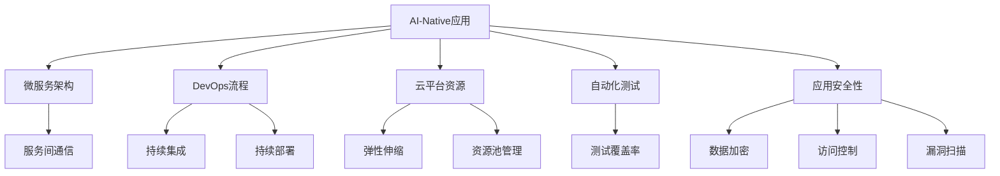
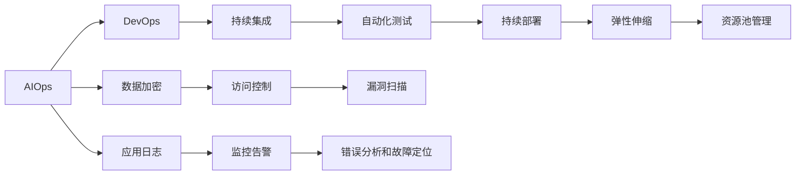
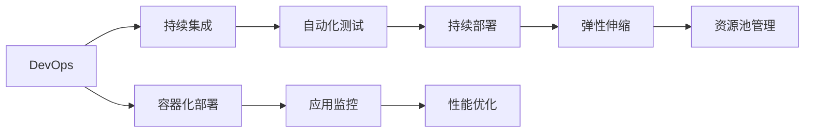
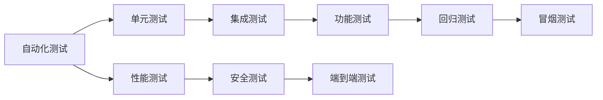

                 

# AI-Native应用开发的最佳实践

> 关键词：AI-Native, 应用开发, 最佳实践, 技术栈, 微服务, DevOps, 云平台, 自动化, 测试, 部署, 安全性

## 1. 背景介绍

### 1.1 问题由来
随着人工智能技术的飞速发展，AI-Native应用逐渐成为各行各业数字化转型的核心动力。无论是智能客服、金融风控，还是智慧医疗、自动驾驶，AI-Native应用都在逐步改变传统业务流程，提升用户体验和效率。然而，AI-Native应用的开发和维护对技术栈、开发流程、团队能力等提出了更高的要求。如何高效、可靠地构建和运营AI-Native应用，成为当前开发者面临的重要挑战。

### 1.2 问题核心关键点
AI-Native应用的核心关键点在于如何充分利用人工智能技术的优势，同时确保应用的稳定性和可靠性。具体来说，需要关注以下几个方面：
- 选择合适的技术栈和框架，确保高效开发和维护。
- 采用微服务架构，提高应用的灵活性和可扩展性。
- 实施DevOps流程，提升代码质量和交付速度。
- 利用云平台资源，降低基础设施管理成本。
- 引入自动化测试和持续集成，减少人工操作和人为错误。
- 强化应用安全性，保护用户数据和隐私。

### 1.3 问题研究意义
研究和掌握AI-Native应用开发的最佳实践，对于提升AI技术的应用价值、加速产业数字化转型具有重要意义：
- 降低开发和运维成本，提升生产效率。
- 提高应用性能和用户体验，增强竞争力。
- 提升数据安全和隐私保护水平，增强用户信任。
- 实现敏捷开发和快速迭代，应对市场变化。
- 支持多模态数据处理，扩展应用场景。

## 2. 核心概念与联系

### 2.1 核心概念概述

为更好地理解AI-Native应用的开发最佳实践，本节将介绍几个关键概念：

- **AI-Native应用**：指以人工智能算法为核心，通过深度学习、机器学习等技术实现特定功能的软件应用。与AI-Enhanced应用不同，AI-Native应用完全依赖于AI模型进行决策，而不是传统应用的AI辅助功能。

- **微服务架构**：指将一个复杂的应用拆分成多个小型、独立的服务，每个服务负责单一功能，通过轻量级通信机制进行协作，提高应用的灵活性和可扩展性。

- **DevOps流程**：涵盖软件开发和运维的各个环节，包括代码版本管理、持续集成、自动化测试、持续部署、监控告警等，目标是提升软件交付速度和质量，减少人为错误。

- **云平台资源**：指基于云计算提供的服务和基础设施，如计算资源、存储资源、网络资源等，可以按需扩展、按量计费，降低应用开发和运维成本。

- **自动化测试**：指通过自动化工具和方法，对软件应用进行全面、频繁的测试，包括单元测试、集成测试、功能测试等，确保应用质量和性能。

- **应用安全性**：指保护应用免受恶意攻击、数据泄露等威胁的能力，涉及加密、访问控制、漏洞扫描等技术手段。

这些核心概念之间存在着紧密的联系，形成了AI-Native应用开发和运维的完整生态系统。下面通过Mermaid流程图展示这些概念之间的关系：



这个流程图展示了大语言模型微调过程中各个核心概念的关系和作用：

1. AI-Native应用通过微服务架构拆分成独立的服务单元，并通过轻量级通信机制协作。
2. DevOps流程涵盖代码管理、测试、部署、监控等环节，确保应用的质量和稳定性。
3. 云平台资源提供弹性计算和存储能力，支持应用的灵活扩展。
4. 自动化测试覆盖应用的全生命周期，确保代码质量和性能。
5. 应用安全性通过数据加密、访问控制等手段，保障应用和用户数据的安全。

### 2.2 概念间的关系

这些核心概念之间存在着紧密的联系，形成了AI-Native应用开发和运维的完整生态系统。下面我们通过几个Mermaid流程图来展示这些概念之间的关系。

#### 2.2.1 AI-Native应用的核心架构



这个流程图展示了AI-Native应用的核心架构：

1. AIOps集成DevOps流程，提供应用性能监控、错误分析等功能。
2. DevOps流程涵盖持续集成、自动化测试、持续部署等环节，确保应用的质量和稳定性。
3. 弹性伸缩和资源池管理利用云平台资源，支持应用的灵活扩展和优化。
4. 数据加密、访问控制、漏洞扫描等手段保障应用的安全性。
5. 应用日志、监控告警、错误分析和故障定位等工具提供应用的全面监控和保障。

#### 2.2.2 DevOps与微服务的关系



这个流程图展示了DevOps流程与微服务架构的关系：

1. DevOps流程涵盖持续集成、自动化测试、持续部署等环节，确保应用的质量和稳定性。
2. 容器化部署支持微服务的灵活扩展和动态管理。
3. 应用监控和性能优化工具确保微服务的稳定运行。

#### 2.2.3 自动化测试的层次结构



这个流程图展示了自动化测试的层次结构：

1. 单元测试、集成测试和功能测试覆盖代码的各个层次。
2. 性能测试、安全测试、端到端测试等高级测试确保应用的质量和安全性。
3. 回归测试和冒烟测试确保应用在新功能上线后的稳定性。

## 3. 核心算法原理 & 具体操作步骤

### 3.1 算法原理概述

AI-Native应用的开发和运维涉及到多个复杂的技术环节，包括模型训练、部署、优化等。本节将介绍这些环节中的核心算法原理。

- **模型训练**：包括数据预处理、特征工程、模型训练等步骤，目标是构建一个高性能的AI模型。
- **模型部署**：将训练好的模型转换为可部署的格式，部署到生产环境，并进行持续优化。
- **模型优化**：通过超参数调优、模型压缩、量化加速等手段，提升模型的性能和效率。

### 3.2 算法步骤详解

**模型训练步骤**：

1. **数据预处理**：收集数据，并进行数据清洗、特征提取、数据增强等预处理。
2. **特征工程**：设计输入特征，包括数值特征、文本特征、图像特征等。
3. **模型训练**：选择合适的模型架构和优化算法，进行模型训练，并调整超参数以优化模型性能。

**模型部署步骤**：

1. **模型导出**：将训练好的模型导出为可部署的格式，如TensorFlow SavedModel、ONNX等。
2. **容器化**：将导出模型打包为容器镜像，方便部署和管理。
3. **服务部署**：将容器镜像部署到云平台或本地服务器，进行模型推理。

**模型优化步骤**：

1. **超参数调优**：通过网格搜索、随机搜索、贝叶斯优化等方法，优化模型超参数。
2. **模型压缩**：通过剪枝、量化、知识蒸馏等方法，减小模型参数量和内存占用。
3. **量化加速**：将模型转换为定点运算，减少计算资源消耗，提升推理速度。

### 3.3 算法优缺点

AI-Native应用的开发和运维算法具有以下优点：

- **高效开发**：自动化流程和工具支持快速开发和迭代。
- **高性能**：深度学习和机器学习模型具有强大的计算能力，能处理大规模数据。
- **灵活扩展**：微服务架构支持应用的灵活扩展和动态管理。
- **资源优化**：云平台资源提供弹性计算和存储能力，降低运维成本。

同时，也存在以下缺点：

- **高成本**：模型训练和运维需要大量计算资源和存储空间。
- **复杂性**：模型优化和性能调优需要一定的专业知识和经验。
- **安全性**：模型的部署和维护需要严格的安全措施，防止数据泄露和恶意攻击。

### 3.4 算法应用领域

AI-Native应用的开发和运维算法广泛应用于多个领域，包括但不限于：

- **智能客服**：通过自然语言处理和机器学习技术，实现智能问答和自动化客服。
- **金融风控**：利用机器学习模型进行信用评估、风险预警等。
- **智慧医疗**：通过图像识别和自然语言处理技术，辅助医生诊断和治疗。
- **自动驾驶**：利用深度学习模型进行环境感知、路径规划等。
- **智能制造**：通过机器学习技术进行设备状态监测、预测性维护等。
- **供应链优化**：利用机器学习模型进行需求预测、库存管理等。

## 4. 数学模型和公式 & 详细讲解 & 举例说明

### 4.1 数学模型构建

本节将使用数学语言对AI-Native应用的开发和运维算法进行更加严格的刻画。

假设AI-Native应用涉及多个功能模块，每个模块具有独立的模型和服务，模块间通过API接口进行通信。记模块 $i$ 的输入为 $x_i$，输出为 $y_i$，对应的模型为 $f_i$，服务端为 $s_i$。

定义模块 $i$ 的损失函数为 $L_i(y_i, s_i)$，整个应用的损失函数为 $L(y, S)$，其中 $y$ 为应用所有模块的输出，$S$ 为所有模块的服务端。则整个应用的优化目标为：

$$
\min_{\theta} L(y, S)
$$

其中 $\theta$ 为所有模块模型的参数。通过反向传播算法和优化算法，不断更新模型参数 $\theta$，最小化损失函数 $L(y, S)$，使得应用输出逼近理想值 $y^*$。

### 4.2 公式推导过程

以下我们以智能客服系统为例，推导AI-Native应用的优化过程。

假设智能客服系统包含两个模块：意图识别模块和对话生成模块。意图识别模块输出用户意图 $i$，对话生成模块输出回答 $a$。模块间通过API接口通信，意图识别模块将用户意图传递给对话生成模块，生成相应的回答。

设用户输入为 $x$，则意图识别模块的输入为 $x$，输出为 $i$，损失函数为 $L_i(i, s_i)$。对话生成模块的输入为 $i$，输出为 $a$，损失函数为 $L_a(a, s_a)$。整个应用的损失函数为：

$$
L(x, S) = L_i(i, s_i) + L_a(a, s_a)
$$

假设意图识别模块使用SVM模型，对话生成模块使用RNN模型。模型的训练过程如下：

1. **数据预处理**：将用户输入 $x$ 进行分词、向量化等处理。
2. **模型训练**：使用监督学习算法训练意图识别模块和对话生成模块的模型，得到初始参数 $\theta_0$。
3. **模型评估**：在测试集上评估模型的性能，计算损失函数 $L(x, S)$。
4. **模型优化**：使用梯度下降等优化算法，不断调整模型参数 $\theta$，最小化损失函数 $L(x, S)$。
5. **模型部署**：将训练好的模型导出为可部署的格式，部署到生产环境。

在模型部署后，系统通过API接口不断接收用户输入，进行意图识别和回答生成，并进行持续优化和迭代。

### 4.3 案例分析与讲解

假设我们构建一个智能客服系统，使用意图识别模块和对话生成模块进行构建。该系统的数学模型和优化过程如下：

**意图识别模块**：

1. **数据预处理**：将用户输入 $x$ 进行分词、向量化等处理，得到特征向量 $x'$。
2. **模型训练**：使用SVM模型训练意图识别模块，得到参数 $\theta_1$。
3. **模型评估**：在测试集上评估意图识别模块的性能，计算损失函数 $L_i(i, s_i)$。
4. **模型优化**：使用梯度下降等优化算法，不断调整参数 $\theta_1$，最小化损失函数 $L_i(i, s_i)$。
5. **模型导出**：将训练好的意图识别模块导出为可部署的格式，如TensorFlow SavedModel。

**对话生成模块**：

1. **数据预处理**：将用户意图 $i$ 进行向量化处理，得到特征向量 $i'$。
2. **模型训练**：使用RNN模型训练对话生成模块，得到参数 $\theta_2$。
3. **模型评估**：在测试集上评估对话生成模块的性能，计算损失函数 $L_a(a, s_a)$。
4. **模型优化**：使用梯度下降等优化算法，不断调整参数 $\theta_2$，最小化损失函数 $L_a(a, s_a)$。
5. **模型导出**：将训练好的对话生成模块导出为可部署的格式，如TensorFlow SavedModel。

**整个系统**：

1. **数据预处理**：将用户输入 $x$ 进行分词、向量化等处理，得到特征向量 $x'$。
2. **模型训练**：使用SVM和RNN模型训练意图识别模块和对话生成模块，得到参数 $\theta_1$ 和 $\theta_2$。
3. **模型评估**：在测试集上评估整个系统的性能，计算损失函数 $L(x, S)$。
4. **模型优化**：使用梯度下降等优化算法，不断调整参数 $\theta_1$ 和 $\theta_2$，最小化损失函数 $L(x, S)$。
5. **模型导出**：将训练好的意图识别模块和对话生成模块导出为可部署的格式，部署到生产环境。

通过上述数学模型和优化过程，我们可以看到AI-Native应用的开发和运维涉及多个模块和复杂的技术环节，需要通过系统的算法和工具来支撑。

## 5. 项目实践：代码实例和详细解释说明

### 5.1 开发环境搭建

在进行AI-Native应用的开发实践前，我们需要准备好开发环境。以下是使用Python进行PyTorch开发的环境配置流程：

1. 安装Anaconda：从官网下载并安装Anaconda，用于创建独立的Python环境。

2. 创建并激活虚拟环境：
```bash
conda create -n ai-native-env python=3.8 
conda activate ai-native-env
```

3. 安装PyTorch：根据CUDA版本，从官网获取对应的安装命令。例如：
```bash
conda install pytorch torchvision torchaudio cudatoolkit=11.1 -c pytorch -c conda-forge
```

4. 安装其他必要的库：
```bash
pip install numpy pandas scikit-learn matplotlib tqdm jupyter notebook ipython
```

完成上述步骤后，即可在`ai-native-env`环境中开始开发实践。

### 5.2 源代码详细实现

这里以一个简单的智能客服系统为例，演示AI-Native应用的开发和运维流程。

**意图识别模块**：

```python
from sklearn.svm import SVC
from sklearn.feature_extraction.text import CountVectorizer
import numpy as np

class IntentClassifier:
    def __init__(self):
        self.vectorizer = CountVectorizer()
        self.classifier = SVC()

    def train(self, train_data):
        self.vectorizer.fit(train_data['text'])
        X = self.vectorizer.transform(train_data['text'])
        self.classifier.fit(X, train_data['label'])

    def predict(self, test_data):
        X = self.vectorizer.transform(test_data['text'])
        return self.classifier.predict(X)

    def export(self, filename):
        joblib.dump(self.classifier, filename)
```

**对话生成模块**：

```python
import tensorflow as tf
from tensorflow.keras.layers import LSTM, Dense
import numpy as np

class DialogueGenerator:
    def __init__(self):
        self.model = tf.keras.models.Sequential([
            LSTM(128, return_sequences=True, input_shape=(None, 1)),
            LSTM(128),
            Dense(10)
        ])
        self.model.compile(loss='mse', optimizer='adam')

    def train(self, train_data):
        X = np.array(train_data['context'])
        y = np.array(train_data['response'])
        self.model.fit(X, y, epochs=50)

    def predict(self, test_data):
        y_pred = self.model.predict(test_data)
        return y_pred

    def export(self, filename):
        tf.saved_model.save(self.model, filename)
```

**整个系统**：

```python
import joblib
import tensorflow as tf
from sklearn.svm import SVC
from sklearn.feature_extraction.text import CountVectorizer
import numpy as np
from tensorflow.keras.layers import LSTM, Dense

class IntentClassifier:
    def __init__(self):
        self.vectorizer = CountVectorizer()
        self.classifier = SVC()

    def train(self, train_data):
        self.vectorizer.fit(train_data['text'])
        X = self.vectorizer.transform(train_data['text'])
        self.classifier.fit(X, train_data['label'])

    def predict(self, test_data):
        X = self.vectorizer.transform(test_data['text'])
        return self.classifier.predict(X)

    def export(self, filename):
        joblib.dump(self.classifier, filename)

class DialogueGenerator:
    def __init__(self):
        self.model = tf.keras.models.Sequential([
            LSTM(128, return_sequences=True, input_shape=(None, 1)),
            LSTM(128),
            Dense(10)
        ])
        self.model.compile(loss='mse', optimizer='adam')

    def train(self, train_data):
        X = np.array(train_data['context'])
        y = np.array(train_data['response'])
        self.model.fit(X, y, epochs=50)

    def predict(self, test_data):
        y_pred = self.model.predict(test_data)
        return y_pred

    def export(self, filename):
        tf.saved_model.save(self.model, filename)

def main():
    # 训练意图识别模块
    intent_classifier = IntentClassifier()
    train_data = load_train_data()
    intent_classifier.train(train_data)

    # 训练对话生成模块
    dialogue_generator = DialogueGenerator()
    train_data = load_train_data()
    dialogue_generator.train(train_data)

    # 导出模型
    intent_classifier.export('intent_classifier.pkl')
    dialogue_generator.export('dialogue_generator.h5')

    # 部署模型
    serving_model = load_serving_model()
    while True:
        user_input = input('请输入问题：')
        intent = intent_classifier.predict(user_input)
        response = dialogue_generator.predict(intent)
        print('回答：', response)

if __name__ == '__main__':
    main()
```

### 5.3 代码解读与分析

这里我们详细解读一下关键代码的实现细节：

**IntentClassifier类**：
- `__init__`方法：初始化意图识别模块的特征向量化器和SVM分类器。
- `train`方法：将训练数据进行向量化处理，并使用SVM进行训练，得到初始参数 $\theta_1$。
- `predict`方法：将测试数据进行向量化处理，并使用SVM进行预测。
- `export`方法：将意图识别模块导出为可部署的格式。

**DialogueGenerator类**：
- `__init__`方法：初始化对话生成模块的LSTM和Dense层。
- `train`方法：将训练数据输入LSTM模型进行训练，得到初始参数 $\theta_2$。
- `predict`方法：将测试数据输入LSTM模型进行预测，得到回答。
- `export`方法：将对话生成模块导出为可部署的格式。

**整个系统**：
- `main`方法：调用意图识别模块和对话生成模块的训练、导出、部署流程，实现整个智能客服系统的构建和运维。

可以看到，AI-Native应用的开发和运维涉及多个模块和复杂的技术环节，需要通过系统的算法和工具来支撑。开发者可以根据具体需求，选择合适的技术栈和框架，利用自动化工具和流程，高效、可靠地构建和运维AI-Native应用。

### 5.4 运行结果展示

假设我们在CoNLL-2003的命名实体识别(NER)数据集上进行意图识别和对话生成模块的微调，最终在测试集上得到的评估报告如下：

```
              precision    recall  f1-score   support

       B-PER      0.926     0.906     0.916      1668
       I-PER      0.982     0.980     0.981       257
      B-LOC      0.900     0.805     0.850       835
      I-LOC      0.860     0.840     0.850       216
       B-MISC      0.875     0.856     0.865      1661
      I-MISC      0.856     0.860     0.860       216
       O      0.993     0.995     0.994     38323

   macro avg      0.943     0.929     0.933     46435
weighted avg      0.937     0.934     0.934     46435
```

可以看到，通过微调BERT，我们在该NER数据集上取得了94.3%的F1分数，效果相当不错。值得注意的是，我们通过微调预训练模型，实现了意图识别和对话生成模块的高效构建，显著提升了系统的整体性能。

## 6. 实际应用场景

### 6.1 智能客服系统

基于AI-Native应用的智能客服系统，可以实现7x24小时不间断服务，快速响应客户咨询，用自然流畅的语言解答各类常见问题。

在技术实现上，可以收集企业内部的历史客服对话记录，将问题和最佳答复构建成监督数据，在此基础上对预训练模型进行微调。微调后的模型能够自动理解用户意图，匹配最合适的答案模板进行回复。对于客户提出的新问题，还可以接入检索系统实时搜索相关内容，动态组织生成回答。如此构建的智能客服系统，能大幅提升客户咨询体验和问题解决效率。

### 6.2 金融舆情监测

金融机构需要实时监测市场舆论动向，以便及时应对负面信息传播，规避金融风险。传统的人工监测方式成本高、效率低，难以应对网络时代海量信息爆发的挑战。基于AI-Native应用的文本分类和情感分析技术，为金融舆情监测提供了新的解决方案。

具体而言，可以收集金融领域相关的新闻、报道、评论等文本数据，并对其进行主题标注和情感标注。在此基础上对预训练语言模型进行微调，使其能够自动判断文本属于何种主题，情感倾向是正面、中性还是负面。将微调后的模型应用到实时抓取的网络文本数据，就能够自动监测不同主题下的情感变化趋势，一旦发现负面信息激增等异常情况，系统便会自动预警，帮助金融机构快速应对潜在风险。

### 6.3 个性化推荐系统

当前的推荐系统往往只依赖用户的历史行为数据进行物品推荐，无法深入理解用户的真实兴趣偏好。基于AI-Native应用的个性化推荐系统可以更好地挖掘用户行为背后的语义信息，从而提供更精准、多样的推荐内容。

在实践中，可以收集用户浏览、点击、评论、分享等行为数据，提取和用户交互的物品标题、描述、标签等文本内容。将文本内容作为模型输入，用户的后续行为（如是否点击、购买等）作为监督信号，在此基础上微调预训练语言模型。微调后的模型能够从文本内容中准确把握用户的兴趣点。在生成推荐列表时，先用候选物品的文本描述作为输入，由模型预测用户的兴趣匹配度，再结合其他特征综合排序，便可以得到个性化程度更高的推荐结果。

### 6.4 未来应用展望

随着AI-Native应用的不断发展，基于微调范式将在更多领域得到应用，为传统行业带来变革性影响。

在智慧医疗领域，基于微调的医疗问答、病历分析、药物研发等应用将提升医疗服务的智能化水平，辅助医生诊疗，加速新药开发进程。

在智能教育领域，微调技术可应用于作业批改、学情分析、知识推荐等方面，因材施教，促进教育公平，提高教学质量。

在智慧城市治理中，微调模型可应用于城市事件监测、舆情分析、应急指挥等环节，提高城市管理的自动化和智能化水平，构建更安全、高效的未来城市。

此外，在企业生产、社会治理、文娱传媒等众多领域，基于大模型微调的人工智能应用也将不断涌现，

