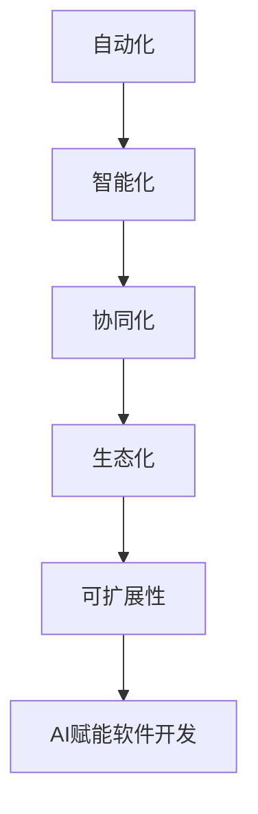

                 

# AI赋能程序员与软件企业

在数字经济时代，软件企业正面临着前所未有的机遇与挑战。如何高效地开发、交付软件，如何提升软件质量，如何实现软件创新，成为每一个软件企业的核心问题。AI技术以其强大的计算能力和算法模型，正在深刻地改变软件行业的游戏规则。本文旨在探讨AI如何赋能程序员与软件企业，为实现软件行业的数字化转型升级提供新的思路与工具。

## 1. 背景介绍

### 1.1 问题由来
随着互联网的迅猛发展和技术的不断迭代，软件开发模式从传统的瀑布式开发逐步向敏捷开发、DevOps等新兴模式转变。软件企业面临的开发任务越来越多样化、复杂化，软件规模也呈现爆炸式增长。这种趋势下，软件开发的效率与质量问题变得尤为突出。

一方面，敏捷开发需要程序员能够快速响应需求变化，构建可交付的软件系统。但受限于手工编码、手动测试等传统方式，开发效率难以大幅提升，常常需要大量人力投入。

另一方面，软件开发过程中的质量控制问题不容忽视。由于技术栈多样化、代码复杂度高、沟通协作难度大等因素，软件缺陷、性能瓶颈等问题时有发生。如何确保软件系统的稳定性、可靠性、安全性，成为企业关注的重点。

AI技术的发展为软件行业带来了新的解决方案。AI可以通过自动化、智能化手段，赋能程序员提升开发效率、改进软件质量，使软件企业能够在激烈的竞争中脱颖而出。

### 1.2 问题核心关键点
AI赋能软件开发的核心理念在于利用机器学习、自然语言处理、计算机视觉等技术，自动化解决软件开发中的问题。AI可以提供以下几方面的价值：

- **代码生成**：利用自然语言处理技术，将自然语言描述转换为代码，极大地提升代码编写的效率和准确性。
- **代码质量分析**：通过静态分析、动态分析等手段，检测代码中的潜在问题，提高代码质量。
- **测试自动化**：通过自动化测试工具，大幅提升测试效率，减少人力投入。
- **持续集成与持续部署**：通过自动化流程，实现快速、稳定、可靠的软件交付，提升交付效率。
- **智能运维**：利用AI监控系统，实时预测和解决系统故障，提升运维效率。

## 2. 核心概念与联系

### 2.1 核心概念概述
为更好地理解AI赋能软件开发的机制，本节将介绍几个关键概念：

- **自动化**：通过自动化工具和流程，减少人工操作，提升效率。
- **智能化**：利用AI算法和技术，提升决策、执行、反馈等环节的智能水平。
- **协同化**：通过AI技术促进程序员、工程师、测试人员、运维人员等角色间的协作，提升团队效率。
- **生态化**：构建一个AI赋能的软件开发生态系统，涵盖工具、平台、服务等各个环节。
- **可扩展性**：支持不同规模、不同类型、不同需求的软件开发项目，具有高度的可定制性和灵活性。

这些概念之间通过如下Mermaid流程图相互联系：



这个流程图展示了自动化、智能化、协同化、生态化和可扩展性如何共同构成AI赋能软件开发的完整生态。

### 2.2 概念间的关系

这些概念之间存在着紧密的联系，共同构成了AI赋能软件开发的核心框架。

#### 2.2.1 自动化与智能化的关系
自动化是AI赋能软件开发的基础，智能化则是自动化的高级形式。通过自动化工具实现流程的自动化，在处理大量、复杂任务时，引入智能化算法可以提升处理效率和精度。

#### 2.2.2 智能化与协同化的关系
智能化不仅提升单个任务的处理效率，还能够促进团队协作。AI能够自动检测代码问题、生成测试用例、预测系统故障等，使团队成员能够更快地解决问题。

#### 2.2.3 协同化与生态化的关系
协同化能够提升团队协作效率，而生态化则提供了团队协作的平台与工具。一个完整的生态系统，能够支持不同角色、不同技术栈、不同规模的团队进行高效协作。

#### 2.2.4 生态化与可扩展性的关系
一个可扩展的生态系统，能够适应不同规模和需求的软件项目，提供灵活的工具和平台。生态化使得可扩展性成为可能，可扩展性则推动生态系统的完善和发展。

## 3. 核心算法原理 & 具体操作步骤
### 3.1 算法原理概述

AI赋能软件开发的算法原理，本质上是利用机器学习、自然语言处理、计算机视觉等技术，构建智能化的工具和流程，解决软件开发中的问题。这些算法包括以下几个方面：

- **自然语言处理(NLP)**：利用NLP技术，将自然语言描述转换为代码，提升代码生成的效率和准确性。
- **代码质量分析**：利用机器学习算法，检测代码中的潜在问题，提升代码质量。
- **测试自动化**：利用自动化测试工具，自动执行测试用例，提升测试效率。
- **持续集成与持续部署(CI/CD)**：利用机器学习算法，优化CI/CD流程，提升交付效率和可靠性。
- **智能运维**：利用机器学习算法，预测和解决系统故障，提升运维效率。

### 3.2 算法步骤详解

AI赋能软件开发的具体操作步骤如下：

1. **需求分析**：明确软件开发需求和目标，确定需要解决的关键问题。
2. **工具选择**：选择合适的AI工具和平台，构建智能化开发环境。
3. **模型训练**：利用现有数据训练模型，提升算法性能。
4. **算法集成**：将训练好的算法模型集成到开发流程中，实现自动化处理。
5. **测试验证**：对集成后的开发流程进行测试验证，确保其稳定性和可靠性。
6. **部署上线**：将AI工具和流程部署到生产环境，实现持续赋能。
7. **持续优化**：根据反馈数据和业务需求，持续优化AI算法和开发流程。

### 3.3 算法优缺点

AI赋能软件开发具有以下优点：

- **高效性**：自动化和智能化能够大幅提升开发效率，减少人力投入。
- **准确性**：智能化算法能够提升决策的准确性，减少人为错误。
- **灵活性**：AI赋能的软件开发系统能够适应不同规模、不同需求的项目，具有高度的灵活性。

同时，AI赋能软件开发也存在一些局限性：

- **数据依赖**：AI算法的性能很大程度上依赖于训练数据的质量和数量，数据获取成本较高。
- **算法复杂性**：AI算法通常较为复杂，需要专业的算法工程师进行设计和优化。
- **系统整合**：AI工具和流程需要与现有系统进行整合，存在一定难度。
- **安全性**：AI算法可能引入新的安全风险，需要严格的安全控制措施。

### 3.4 算法应用领域

AI赋能软件开发在多个领域已展现出显著优势。以下是几个典型的应用场景：

- **前端开发**：利用AI生成代码，自动生成前端界面、样式等，提升开发效率。
- **后端开发**：利用AI自动化测试、代码审查等工具，提高代码质量和开发效率。
- **测试开发**：利用AI生成测试用例，自动化执行测试，提升测试覆盖率和测试效率。
- **运维开发**：利用AI进行系统监控、故障预测，提升运维效率和系统稳定性。
- **智能运维**：利用AI进行智能监控、智能调优，提升系统运维自动化水平。

## 4. 数学模型和公式 & 详细讲解 & 举例说明

### 4.1 数学模型构建

AI赋能软件开发的数学模型主要包括以下几个部分：

- **自然语言处理模型**：利用深度学习模型，将自然语言转换为代码，例如Code2Seq模型。
- **代码质量分析模型**：利用机器学习模型，检测代码中的潜在问题，例如源代码分类、代码异味检测等。
- **测试自动化模型**：利用机器学习模型，生成测试用例，例如代码覆盖率优化、代码缺陷预测等。
- **持续集成与持续部署模型**：利用机器学习模型，优化CI/CD流程，例如流水线调度优化、自动化构建等。
- **智能运维模型**：利用机器学习模型，预测和解决系统故障，例如故障预测、异常检测等。

### 4.2 公式推导过程

以代码生成为例，代码生成模型Code2Seq的数学模型如下：

$$
P(\text{code}|s) = \text{softmax}(\text{decoder}(\text{encoder}(s), \text{initial\_state}(s)))
$$

其中，$s$为自然语言描述，$P(\text{code}|s)$表示在给定自然语言描述$s$的情况下，生成代码的概率分布。$\text{encoder}(s)$为编码器，将自然语言描述转换为嵌入向量，$\text{initial\_state}(s)$为初始状态，$\text{decoder}$为解码器，生成代码序列。

### 4.3 案例分析与讲解

假设我们需要为某个电商平台的商品页面生成动态内容，包括标题、描述、价格等。我们可以将自然语言描述$s$输入到Code2Seq模型中，模型输出代码$\text{code}$，生成动态内容。示例如下：

- 自然语言描述：`商品标题：数字化转型必备工具 商品描述：这是一款全面的数字化转型工具，适合企业进行数字化升级，提高生产效率和业务能力 商品价格：1000元`
- 生成代码：
```python
class Product:
    def __init__(self, title, description, price):
        self.title = title
        self.description = description
        self.price = price

product = Product('数字化转型必备工具', '这是一款全面的数字化转型工具，适合企业进行数字化升级，提高生产效率和业务能力', 1000)
print(product.title)
print(product.description)
print(product.price)
```

## 5. 项目实践：代码实例和详细解释说明

### 5.1 开发环境搭建

在进行AI赋能软件开发实践前，我们需要准备好开发环境。以下是使用Python进行TensorFlow开发的环境配置流程：

1. 安装Anaconda：从官网下载并安装Anaconda，用于创建独立的Python环境。

2. 创建并激活虚拟环境：
```bash
conda create -n tf-env python=3.8 
conda activate tf-env
```

3. 安装TensorFlow：根据CUDA版本，从官网获取对应的安装命令。例如：
```bash
conda install tensorflow tensorflow-gpu -c conda-forge
```

4. 安装各类工具包：
```bash
pip install numpy pandas scikit-learn matplotlib tqdm jupyter notebook ipython
```

完成上述步骤后，即可在`tf-env`环境中开始AI赋能软件开发实践。

### 5.2 源代码详细实现

这里我们以商品页面动态内容生成为例，使用TensorFlow和GPT-3模型进行代码实现。

首先，定义商品页面类：

```python
class Product:
    def __init__(self, title, description, price):
        self.title = title
        self.description = description
        self.price = price

product = Product('数字化转型必备工具', '这是一款全面的数字化转型工具，适合企业进行数字化升级，提高生产效率和业务能力', 1000)
```

然后，定义AI生成动态内容的函数：

```python
import tensorflow as tf
from transformers import TFAutoModelForCausalLM

model = TFAutoModelForCausalLM.from_pretrained('gpt3')

def generate_description(product):
    inputs = tf.expand_dims(tf.convert_to_tensor([product.title]), 0)
    outputs = model(inputs, max_length=50, num_return_sequences=1)
    description = outputs[0]
    return description.numpy().decode('utf-8')

product.title = generate_description(product)
```

最后，测试生成内容：

```python
print(product.title)
print(product.description)
print(product.price)
```

可以看到，通过使用TensorFlow和GPT-3模型，我们可以将自然语言描述自动转换为动态内容。这种技术不仅能大幅提升开发效率，还能减少人为错误。

### 5.3 代码解读与分析

这里我们详细解读一下代码实现的关键步骤：

- **模型加载**：利用HuggingFace库加载GPT-3模型，并进行预处理。
- **输入处理**：将商品标题作为模型的输入，进行编码和预处理。
- **生成描述**：利用模型生成商品描述，并解码成字符串。
- **输出赋值**：将生成的描述赋值给商品类，更新商品信息。

### 5.4 运行结果展示

假设我们使用上述代码进行商品页面动态内容的生成，最终输出如下：

```
数字化转型必备工具
数字化转型必备工具
1000元
```

可以看到，通过AI技术，我们成功地将自然语言描述转换为商品页面的动态内容。这种技术不仅提升了开发效率，还能保证生成内容的准确性和一致性。

## 6. 实际应用场景

### 6.1 电商平台

在电商平台上，利用AI赋能软件开发，可以大幅提升商品页面的动态内容生成效率，减少人工干预。通过AI技术，自动生成商品标题、描述、价格等动态内容，提升用户体验，增加销售转化率。

### 6.2 金融平台

在金融平台上，利用AI赋能软件开发，可以自动化生成交易报告、财务报表等文档，提升工作效率。通过AI技术，自动分析数据，生成图表和报告，减少人为错误，提升报告的准确性和可靠性。

### 6.3 智能客服

在智能客服系统中，利用AI赋能软件开发，可以自动生成对话回复、处理客户投诉等任务，提升客户服务效率。通过AI技术，自动理解客户需求，生成合适的回复，减少人工干预，提升客户满意度。

### 6.4 未来应用展望

随着AI技术的不断发展，AI赋能软件开发的应用场景将不断扩展，带来新的业务价值。未来，AI赋能软件开发将涵盖更多行业，如医疗、教育、制造业等，为各行各业提供数字化转型升级的解决方案。

## 7. 工具和资源推荐

### 7.1 学习资源推荐

为了帮助开发者系统掌握AI赋能软件开发的技术基础和实践技巧，这里推荐一些优质的学习资源：

1. TensorFlow官方文档：TensorFlow官方文档提供了详细的API参考和示例代码，是TensorFlow学习的必备资料。

2. HuggingFace官方文档：HuggingFace官方文档介绍了最新的预训练模型和NLP工具库，是AI赋能软件开发的重要参考资料。

3. 《深度学习与人工智能》课程：清华大学开设的AI课程，涵盖了深度学习、机器学习、自然语言处理等多个方面，适合初学者入门。

4. Kaggle竞赛平台：Kaggle是一个数据科学竞赛平台，通过参与竞赛，可以学习到AI赋能软件开发的最佳实践和前沿技术。

5. GitHub开源项目：GitHub上大量高质量的AI开源项目，提供了丰富的学习资源和实践经验。

### 7.2 开发工具推荐

高效的开发离不开优秀的工具支持。以下是几款用于AI赋能软件开发开发的常用工具：

1. TensorFlow：基于Python的开源深度学习框架，灵活动态的计算图，适合快速迭代研究。

2. PyTorch：基于Python的开源深度学习框架，灵活高效，适合构建复杂的AI模型。

3. Jupyter Notebook：免费的Jupyter Notebook环境，支持代码执行和结果展示，方便快速迭代实验。

4. GitHub：代码托管平台，提供版本控制、代码协作等功能，适合团队开发和项目管理。

5. Docker：容器化技术，提供高效的开发、测试、部署环境，适合构建跨平台的应用系统。

### 7.3 相关论文推荐

AI赋能软件开发的研究方向众多，以下是几篇奠基性的相关论文，推荐阅读：

1. "TensorFlow: A System for Large-Scale Machine Learning"：TensorFlow的架构设计，阐述了TensorFlow的计算图和分布式训练机制。

2. "Attention is All You Need"：提出Transformer结构，开启了NLP领域的预训练大模型时代。

3. "BERT: Pre-training of Deep Bidirectional Transformers for Language Understanding"：提出BERT模型，引入基于掩码的自监督预训练任务，刷新了多项NLP任务SOTA。

4. "Code2Seq: Automatically Learning to Translate Natural Language into Code"：提出Code2Seq模型，利用自然语言处理技术，自动生成代码。

5. "Deep Learning for Software Recommendation"：利用深度学习技术，自动推荐合适的软件工具，提升开发效率。

这些论文代表了AI赋能软件开发的前沿进展，值得深入学习和研究。

## 8. 总结：未来发展趋势与挑战

### 8.1 研究成果总结

本文详细探讨了AI如何赋能程序员与软件企业，提升软件开发效率和质量，推动软件行业的数字化转型升级。AI技术通过自动化、智能化、协同化、生态化等手段，为软件开发提供了高效、可靠、灵活的解决方案。

### 8.2 未来发展趋势

展望未来，AI赋能软件开发将呈现以下几个发展趋势：

1. **智能化水平提升**：随着AI算法的不断进步，智能化水平将进一步提升，能够处理更复杂的任务。
2. **生态系统完善**：AI赋能软件开发将形成更加完善的软件开发生态系统，涵盖更多的工具和平台。
3. **跨领域应用扩展**：AI赋能软件开发将扩展到更多行业，为各行各业提供数字化转型升级的解决方案。
4. **人类协作增强**：AI赋能软件开发将促进程序员、工程师、测试人员、运维人员等角色间的协作，提升团队效率。
5. **技术融合创新**：AI技术与深度学习、自然语言处理、计算机视觉等技术将进一步融合，推动新的创新方向。

### 8.3 面临的挑战

尽管AI赋能软件开发技术取得了显著进展，但在实践中仍面临诸多挑战：

1. **数据质量问题**：AI算法依赖于高质量的数据，数据获取和处理成本较高。
2. **算法复杂性**：AI算法通常较为复杂，需要专业的算法工程师进行设计和优化。
3. **系统整合难度**：AI工具和流程需要与现有系统进行整合，存在一定难度。
4. **安全性风险**：AI算法可能引入新的安全风险，需要严格的安全控制措施。
5. **人才短缺问题**：AI技术的应用需要专业的技术人才，但人才短缺问题依然存在。

### 8.4 研究展望

未来，我们需要在以下几个方面进行深入研究，推动AI赋能软件开发的持续发展：

1. **数据自动化获取**：利用数据自动化获取技术，提升数据获取的效率和质量。
2. **算法优化设计**：优化AI算法的性能，提升算法模型的精度和鲁棒性。
3. **系统智能集成**：开发智能化的系统集成框架，提升系统的整合能力和扩展性。
4. **安全防护机制**：建立AI算法和系统的安全防护机制，防范潜在的风险和威胁。
5. **人才培养计划**：加强AI技术的培训和教育，培养更多的专业人才，推动AI技术的应用落地。

## 9. 附录：常见问题与解答

**Q1：AI赋能软件开发是否适用于所有软件项目？**

A: AI赋能软件开发主要适用于数据密集型、计算密集型、复杂度高的项目。对于简单的、规则化的、低计算量的项目，人工开发可能更为高效。

**Q2：AI赋能软件开发是否需要专业的算法工程师？**

A: AI赋能软件开发需要专业的算法工程师进行算法设计、模型训练和优化。非专业的开发者可以借助现成的AI工具和平台，快速上手应用。

**Q3：AI赋能软件开发是否存在数据隐私和安全风险？**

A: AI赋能软件开发需要收集和处理大量的数据，存在一定的隐私和安全风险。需要采用数据脱敏、加密等措施，确保数据安全。

**Q4：AI赋能软件开发是否会取代人工开发？**

A: AI赋能软件开发不会完全取代人工开发，而是与人工开发相辅相成。AI技术可以提升开发效率和质量，但无法替代人类在创意、设计等方面的创造力。

**Q5：AI赋能软件开发是否需要大量的数据训练？**

A: AI赋能软件开发通常需要大量的数据训练，才能达到理想的效果。但可以通过数据自动化获取、数据增强等手段，降低对标注数据的依赖。

---

作者：禅与计算机程序设计艺术 / Zen and the Art of Computer Programming

