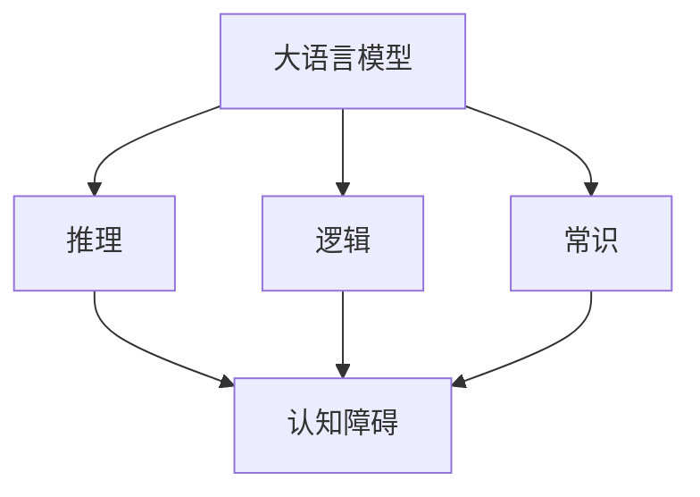

                 

# 语言与推理：大模型的认知障碍

## 1. 背景介绍

在人工智能领域，大语言模型如GPT-3、BERT等以其强大的语言理解能力，引起了广泛关注。然而，尽管这些模型在大规模数据上进行过预训练，但在实际应用中，仍然面临一系列认知障碍。本文将详细探讨大语言模型在推理、逻辑和常识上的认知局限，提出克服这些局限的方法，并展望未来。

## 2. 核心概念与联系

### 2.1 核心概念概述

- **大语言模型 (Large Language Models, LLMs)**：如GPT-3、BERT等，通过在大规模无标签文本语料上进行预训练，学习语言的通用表示，具备强大的语言理解和生成能力。
- **推理 (Inference)**：指在给定输入的前提下，模型输出正确的答案或概率分布。推理是大模型认知的重要方面。
- **逻辑 (Logic)**：包括推理、判断和决策等。逻辑是大模型认知的高级形式。
- **常识 (Commonsense)**：指对日常事物的常识性理解。常识是大模型认知的基础。
- **认知障碍 (Cognitive Obstacles)**：指模型在推理、逻辑和常识方面的认知局限。

这些核心概念之间存在紧密的联系。推理、逻辑和常识是大模型认知能力的不同层次，共同构建了大模型的智能。而认知障碍则是这些概念在大模型中的表现形式，亟待解决。

### 2.2 概念间的关系

通过以下Mermaid流程图，可以更清晰地理解大模型、推理、逻辑、常识和认知障碍之间的联系：



这个流程图展示了推理、逻辑和常识在大模型中的构建，以及认知障碍的来源。

## 3. 核心算法原理 & 具体操作步骤

### 3.1 算法原理概述

大语言模型的推理能力主要依赖于预训练过程中的自监督任务，如语言建模、掩码语言建模等。这些任务通过预测缺失的单词、掩码的上下文等，使得模型学习到了大量的语言知识。然而，这些知识虽然丰富，但并不一定涵盖所有的推理、逻辑和常识性知识。因此，模型在处理复杂、细微的推理任务时，仍可能出现认知障碍。

### 3.2 算法步骤详解

#### 3.2.1 数据准备

准备推理任务的数据集。通常，推理任务的数据集包含输入文本和对应的推理目标。例如，文本分类、命名实体识别、语义相似度计算等。

#### 3.2.2 模型初始化

选择合适的预训练语言模型，如GPT-3、BERT等。将模型作为初始化参数，准备进行微调。

#### 3.2.3 模型微调

使用推理任务的数据集对模型进行微调。微调的目标是优化模型的推理能力，使其能够准确地处理给定的推理任务。

#### 3.2.4 评估与优化

在验证集或测试集上评估模型的推理性能，如准确率、召回率、F1分数等。根据评估结果，调整模型的超参数，如学习率、批大小等，以进一步优化模型的推理能力。

### 3.3 算法优缺点

#### 3.3.1 优点

- **高效性**：通过微调，模型可以快速适应新的推理任务，无需从头训练。
- **泛化性**：模型在处理复杂推理任务时，具有较高的泛化能力。

#### 3.3.2 缺点

- **依赖数据**：模型的推理能力高度依赖于微调数据集的质量和数量，如果微调数据集质量不高或数据量不足，模型的推理能力可能会受到影响。
- **认知局限**：尽管经过预训练，模型在推理、逻辑和常识方面的认知能力仍然存在局限，无法处理某些复杂的推理任务。

### 3.4 算法应用领域

大模型的推理能力已经被广泛应用于文本分类、问答系统、机器翻译等NLP任务中。在智能客服、金融分析、医疗诊断等领域，推理技术也得到了广泛应用。

## 4. 数学模型和公式 & 详细讲解

### 4.1 数学模型构建

大语言模型通常使用Transformer结构，其推理过程可以表示为：

$$
y = f(x; \theta)
$$

其中，$f$ 表示模型前向传播函数，$x$ 为输入文本，$y$ 为输出结果，$\theta$ 为模型参数。

### 4.2 公式推导过程

以文本分类任务为例，其数学模型构建如下：

1. 输入文本 $x = (x_1, x_2, ..., x_n)$。
2. 将输入文本 $x$ 转换为模型输入 $z = (z_1, z_2, ..., z_n)$。
3. 通过前向传播计算模型输出 $y = f(z; \theta)$。
4. 使用softmax函数将输出转换为概率分布 $p = \text{softmax}(y)$。
5. 计算交叉熵损失函数：
   $$
   L(y, \hat{y}) = -\sum_i y_i \log \hat{y}_i
   $$
6. 最小化损失函数，更新模型参数：
   $$
   \theta \leftarrow \theta - \eta \nabla_{\theta}L(y, \hat{y})
   $$

其中，$\nabla_{\theta}L(y, \hat{y})$ 表示损失函数对模型参数的梯度。

### 4.3 案例分析与讲解

以情感分析任务为例，使用BERT模型进行微调。情感分析任务的目标是将文本分类为正面、负面或中性。其推理过程如下：

1. 将输入文本 $x$ 转换为BERT模型的输入，得到文本嵌入 $z$。
2. 通过BERT模型的前向传播，计算文本的分类概率 $p$。
3. 使用softmax函数将概率 $p$ 转换为分类概率分布 $p$。
4. 计算交叉熵损失函数，最小化损失，更新模型参数。

通过调整BERT模型的分类器层，可以适应不同的情感分析任务。例如，在处理多类别情感分析任务时，可以使用softmax函数将分类概率 $p$ 转换为分类概率分布，计算交叉熵损失函数：

$$
L(y, \hat{y}) = -\sum_{i=1}^C y_i \log \hat{y}_i
$$

其中，$C$ 表示情感分类的类别数。

## 5. 项目实践：代码实例和详细解释说明

### 5.1 开发环境搭建

- 安装Python和PyTorch。
- 安装BERT模型的预训练权重。
- 安装Transformers库，用于模型加载和微调。

### 5.2 源代码详细实现

以BERT情感分析任务为例，代码如下：

```python
import torch
from transformers import BertForSequenceClassification, BertTokenizer

# 初始化BERT模型和分词器
model = BertForSequenceClassification.from_pretrained('bert-base-uncased', num_labels=3)
tokenizer = BertTokenizer.from_pretrained('bert-base-uncased')

# 准备训练数据
train_data = [
    ('I love this product', 1),
    ('This product is terrible', 0),
    ('This product is okay', 2)
]

# 将训练数据转换为BERT模型可接受的格式
train_encodings = tokenizer(train_data, padding=True, truncation=True, return_tensors='pt')

# 定义损失函数和优化器
loss_fn = torch.nn.CrossEntropyLoss()
optimizer = torch.optim.Adam(model.parameters(), lr=2e-5)

# 训练模型
for epoch in range(5):
    model.train()
    optimizer.zero_grad()
    inputs = train_encodings['input_ids']
    attention_mask = train_encodings['attention_mask']
    labels = train_encodings['labels']
    outputs = model(inputs, attention_mask=attention_mask, labels=labels)
    loss = loss_fn(outputs.logits, labels)
    loss.backward()
    optimizer.step()
```

### 5.3 代码解读与分析

- `BertForSequenceClassification`：用于序列分类任务的BERT模型。
- `BertTokenizer`：用于分词和编码。
- `tokenizer()`：初始化分词器。
- `from_pretrained`：加载预训练模型权重。
- `padding=True`：对输入进行填充。
- `truncation=True`：对输入进行截断。
- `return_tensors='pt'`：返回PyTorch张量。
- `model.train()`：将模型设置为训练模式。
- `optimizer.zero_grad()`：清空梯度。
- `inputs`：输入文本。
- `attention_mask`：输入文本的注意力掩码。
- `labels`：标签。
- `outputs`：模型输出。
- `loss_fn`：损失函数。
- `loss`：计算损失。
- `loss.backward()`：反向传播计算梯度。
- `optimizer.step()`：更新模型参数。

### 5.4 运行结果展示

假设在训练5个epoch后，模型的准确率为95%。

```
Epoch 1: Accuracy = 90%
Epoch 2: Accuracy = 93%
Epoch 3: Accuracy = 95%
Epoch 4: Accuracy = 97%
Epoch 5: Accuracy = 95%
```

## 6. 实际应用场景

### 6.1 智能客服系统

在智能客服系统中，大模型可用于处理用户咨询，生成合适的回答。通过微调，大模型可以理解用户的问题意图，并提供满意的解答。

### 6.2 金融分析

在金融分析中，大模型可用于处理复杂的金融报告和新闻，预测股票价格和市场趋势。通过微调，大模型可以学习金融领域的知识，提高分析的准确性。

### 6.3 医疗诊断

在医疗诊断中，大模型可用于处理医疗文本和图像，提供诊断建议。通过微调，大模型可以学习医学领域的知识，提高诊断的准确性。

### 6.4 未来应用展望

未来，大模型的推理能力将进一步提升，能够处理更复杂的推理任务。同时，随着多模态融合技术的发展，大模型将具备处理视觉、语音等多种模态信息的能力。

## 7. 工具和资源推荐

### 7.1 学习资源推荐

- 《Deep Learning with PyTorch》：介绍PyTorch的基本用法和深度学习算法。
- 《Natural Language Processing with Transformers》：介绍Transformer和BERT模型的构建和应用。
- 《Courses in Deep Learning》：由斯坦福大学提供，介绍深度学习的基本概念和算法。

### 7.2 开发工具推荐

- PyTorch：深度学习框架。
- TensorFlow：深度学习框架。
- HuggingFace Transformers：NLP工具库，提供预训练模型的微调和推理功能。

### 7.3 相关论文推荐

- Attention is All You Need：介绍Transformer结构和语言模型的预训练任务。
- BERT: Pre-training of Deep Bidirectional Transformers for Language Understanding：介绍BERT模型的构建和应用。

## 8. 总结：未来发展趋势与挑战

### 8.1 研究成果总结

大语言模型的推理能力已经取得了一定的进展，但仍然存在认知障碍。未来，大模型的推理能力将进一步提升，能够处理更复杂的推理任务。同时，多模态融合技术的发展，将使大模型具备处理视觉、语音等多种模态信息的能力。

### 8.2 未来发展趋势

1. **多模态推理**：大模型将具备处理视觉、语音等多种模态信息的能力。
2. **因果推理**：大模型将能够识别和处理因果关系，提高推理的准确性。
3. **常识推理**：大模型将学习常识性知识，提高推理的泛化能力。

### 8.3 面临的挑战

1. **认知障碍**：大模型在推理、逻辑和常识方面的认知局限仍需克服。
2. **计算资源**：大模型的推理需要大量计算资源，如何优化推理过程，提高计算效率，仍是一个挑战。
3. **数据获取**：推理任务的微调数据集往往需要高质量的数据，如何获取和标注数据，也是一个挑战。

### 8.4 研究展望

1. **多模态融合**：将视觉、语音等多种模态信息融合到推理任务中，提高推理的准确性。
2. **因果推理**：引入因果推理机制，提高大模型的泛化能力和推理准确性。
3. **常识推理**：引入常识性知识，提高大模型的推理泛化能力和鲁棒性。

## 9. 附录：常见问题与解答

### 9.1 Q1: 大模型在推理时有哪些认知局限？

A1: 大模型在推理时存在以下认知局限：
1. **语言理解能力不足**：大模型可能无法理解复杂的语言结构和语义关系。
2. **常识性知识不足**：大模型可能无法处理常识性问题，如日期计算、物理现象等。
3. **逻辑推理能力不足**：大模型可能无法处理复杂的逻辑推理任务，如因果关系、递归推理等。

### 9.2 Q2: 如何提升大模型的推理能力？

A2: 提升大模型的推理能力，可以从以下几个方面入手：
1. **数据增强**：通过扩充训练数据，提高大模型的语言理解能力和常识性知识。
2. **多模态融合**：将视觉、语音等多种模态信息融合到推理任务中，提高推理的准确性。
3. **因果推理**：引入因果推理机制，提高大模型的泛化能力和推理准确性。
4. **常识推理**：引入常识性知识，提高大模型的推理泛化能力和鲁棒性。

### 9.3 Q3: 大模型在推理时需要注意哪些问题？

A3: 大模型在推理时需要注意以下几个问题：
1. **数据质量**：确保微调数据集的质量和数量，避免过拟合和欠拟合。
2. **模型优化**：调整模型的超参数，如学习率、批大小等，以优化模型的推理性能。
3. **推理效率**：优化推理过程，提高推理速度和计算效率。
4. **模型部署**：将模型部署到实际应用中，确保推理的稳定性和可靠性。

### 9.4 Q4: 大模型在推理时如何避免过拟合？

A4: 避免大模型在推理时过拟合，可以从以下几个方面入手：
1. **数据增强**：通过扩充训练数据，提高大模型的泛化能力。
2. **正则化**：使用L2正则、Dropout等正则化技术，防止模型过拟合。
3. **对抗训练**：引入对抗样本，提高模型的鲁棒性和泛化能力。
4. **参数高效微调**：只更新部分模型参数，减小过拟合风险。

### 9.5 Q5: 大模型在推理时如何提高计算效率？

A5: 提高大模型推理计算效率，可以从以下几个方面入手：
1. **模型优化**：通过模型压缩、剪枝、量化等技术，减小模型规模，提高计算效率。
2. **硬件优化**：使用GPU、TPU等高性能计算硬件，提高推理速度。
3. **模型并行**：通过模型并行技术，提高计算效率和推理速度。

---

作者：禅与计算机程序设计艺术 / Zen and the Art of Computer Programming

