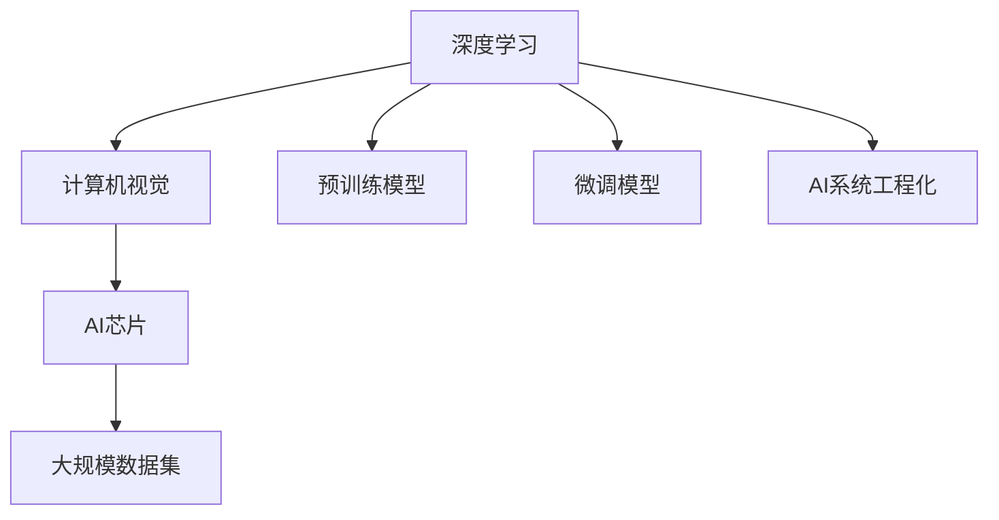
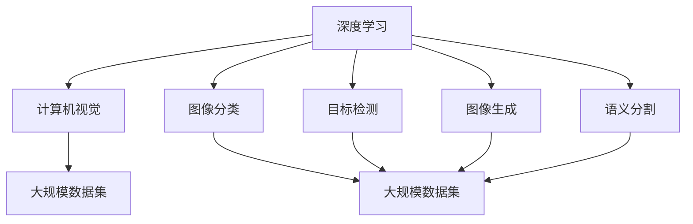
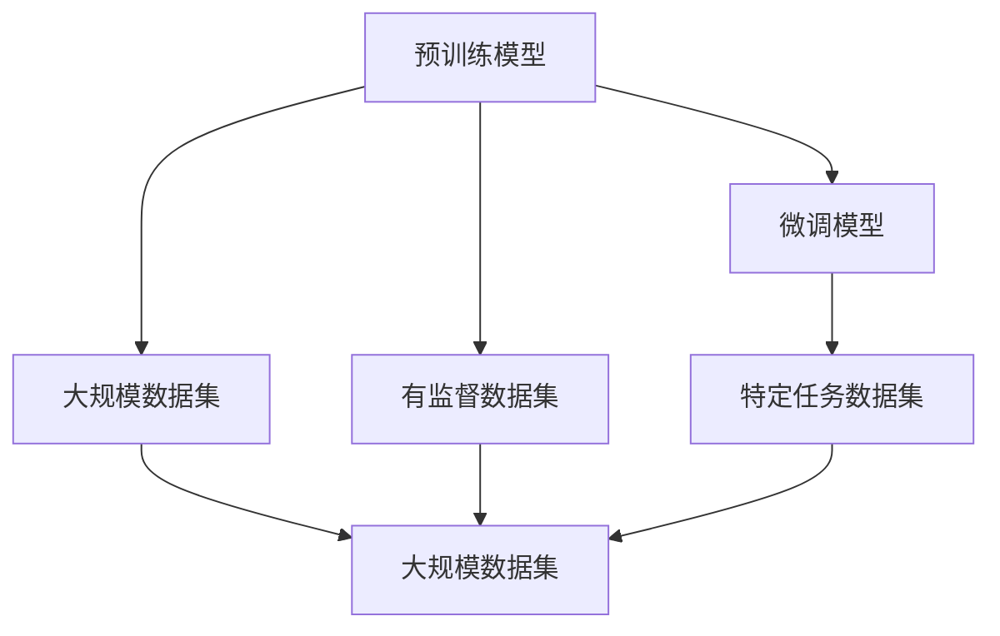
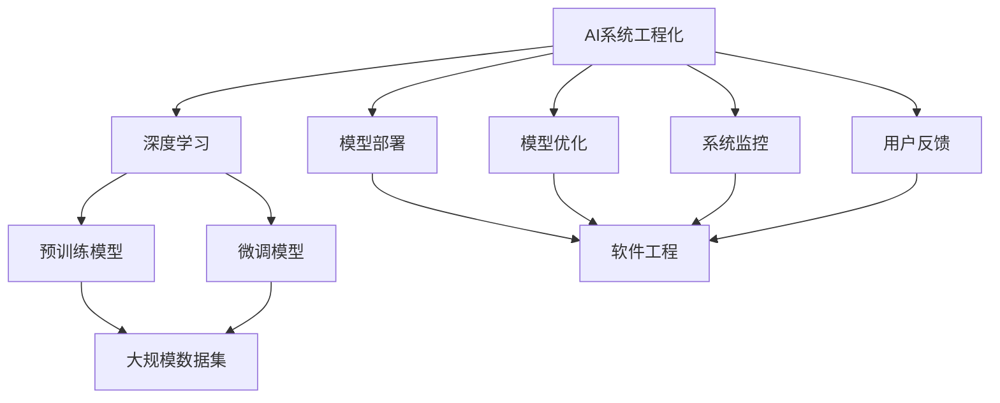

                 

# 贾扬清:从阿里到Lepton AI的技术突破之路

> 关键词：贾扬清，阿里巴巴，Lepton AI，计算机视觉，深度学习，AI芯片，技术突破，机器学习，人工智能

## 1. 背景介绍

### 1.1 问题由来

贾扬清（Qiaoxiang Jie）博士，是当下中国人工智能领域非常知名的学者和企业家，被誉为中国深度学习领域的先驱之一。他的研究工作和商业探索经历极富传奇色彩。

贾扬清的学术生涯起自博士期间在加州大学洛杉矶分校(UCLA)与Weiss教授合作开展深度学习与计算机视觉研究，于2016年在世界顶级会议CVPR上发表了一系列有影响力的论文。他的研究成果被广泛应用于图像生成、物体检测和语义分割等计算机视觉任务中，并主导了诸多实际应用系统的研发。

博士毕业后，贾扬清加入阿里巴巴集团，迅速成为集团在深度学习与AI领域的关键技术引领者。他在阿里巴巴任职期间，推动了集团在大数据、云计算、人工智能、智慧金融等多个领域的创新应用，成为阿里核心技术团队的“引擎芯”。

在阿里巴巴工作期间，贾扬清也一直积极推进AI技术的产业化进程，并开始探索将深度学习等先进技术应用于更具挑战性和广泛性的计算场景。

2021年，贾扬清从阿里巴巴集团离职，创立了Lepton AI科技公司。该公司致力于深度学习与人工智能芯片的研发和应用，希望能在硬件加速与软件优化层面提升AI计算效率，加速人工智能技术的规模化落地。

贾扬清的学术和产业经历，造就了其独到的AI视野和技术洞见。本章节将对贾扬清的学术研究与产业化探索进行回顾与总结，以期为读者提供一份精彩的技术发展历程。

### 1.2 问题核心关键点

贾扬清的技术突破之路，涉及深度学习与计算机视觉的诸多核心点：

- **深度学习基础**：包括深度神经网络的体系架构、优化算法、损失函数等基础知识。
- **计算机视觉技术**：如图像分类、目标检测、图像生成、语义分割等技术。
- **AI芯片技术**：包括芯片设计、模型编译、指令集优化等技术。
- **AI技术产业化**：包括大规模数据集构建、预训练模型开发、AI系统工程化等。

本博客将围绕这些核心点，对贾扬清的技术突破之路进行全面探讨。

## 2. 核心概念与联系

### 2.1 核心概念概述

为更好地理解贾扬清的技术突破，本节将介绍几个核心概念：

- **深度学习**：利用多层神经网络对复杂数据进行特征提取和建模的技术。
- **计算机视觉**：使计算机能“看”懂图像和视频，并从中提取有用信息的领域。
- **AI芯片**：专门为人工智能应用设计的芯片，以其高效能、低功耗等特点，成为深度学习应用的重要基础设施。
- **大规模数据集**：包含大量标注样本的数据集，是预训练模型和微调模型不可或缺的。
- **预训练模型**：在大规模数据上预训练得到的模型，通常用于解决特定任务。
- **微调模型**：在大规模预训练模型基础上，针对特定任务进行有监督的微调。
- **AI系统工程化**：将复杂的AI算法集成到实际系统中，并保证其稳定性和可靠性。

这些概念之间的联系通过以下Mermaid流程图来展示：



这个流程图展示了深度学习与计算机视觉、AI芯片、大规模数据集、预训练与微调模型、AI系统工程化等核心概念之间的联系。

### 2.2 概念间的关系

这些核心概念之间存在着紧密的联系，形成了深度学习与计算机视觉领域的完整生态系统。下面我们通过几个Mermaid流程图来展示这些概念之间的关系。

#### 2.2.1 深度学习与计算机视觉的关系



这个流程图展示了深度学习与计算机视觉的密切联系，以及它们各自在深度学习中的具体应用。

#### 2.2.2 预训练模型与微调模型之间的关系



这个流程图展示了预训练模型和微调模型之间的关系，以及它们在大规模数据集与特定任务数据集上的应用。

#### 2.2.3 AI系统工程化与深度学习的关系



这个流程图展示了AI系统工程化与深度学习的联系，以及它们在模型部署、优化、监控、用户反馈等各个环节的应用。

## 3. 核心算法原理 & 具体操作步骤
### 3.1 算法原理概述

贾扬清的技术突破之路涉及深度学习与计算机视觉的多个关键算法。以下将对其中几个核心算法进行详细介绍：

- **深度神经网络**：包括卷积神经网络(CNN)、循环神经网络(RNN)、长短时记忆网络(LSTM)等，用于特征提取与建模。
- **图像分类**：通过多层网络结构对图像进行分类，如LeNet、AlexNet、VGG、ResNet等。
- **目标检测**：检测图像中的目标物体，如R-CNN、Fast R-CNN、Faster R-CNN、YOLO等。
- **图像生成**：生成高质量的图像数据，如GAN、VAE等。
- **语义分割**：对图像进行像素级分割，如U-Net、FCN等。

这些算法为计算机视觉提供了强大的功能支持，贾扬清在学术和产业界的多项突破，均建立在这些核心算法的基础之上。

### 3.2 算法步骤详解

贾扬清的技术突破之路，通过以下关键步骤得以实现：

1. **算法研发与优化**：结合实际应用场景，研发新的深度学习算法，并进行优化。
2. **大规模数据集构建**：获取并构建大规模标注数据集，为模型训练和微调提供数据支持。
3. **预训练模型开发**：在大规模数据集上预训练深度学习模型，提取通用特征。
4. **微调模型训练**：基于特定任务的数据集，对预训练模型进行微调，获得任务相关的特征表示。
5. **AI系统工程化**：将微调模型集成到实际系统中，并针对系统性能进行优化。

### 3.3 算法优缺点

深度学习与计算机视觉技术具有如下优点：

- **高效特征提取**：通过多层网络结构，深度学习能从大规模数据中高效提取特征。
- **泛化能力强**：预训练模型和微调模型能在大规模数据集上学习到通用知识，具有良好的泛化能力。
- **灵活性强**：算法可进行多种形式的优化和调整，适应不同的应用场景。

然而，这些算法也存在一定的局限性：

- **计算资源消耗高**：大规模模型和高维特征提取需要大量的计算资源。
- **数据依赖性强**：算法的性能依赖于高质量大规模数据集的构建和处理。
- **模型复杂度大**：深度学习模型结构复杂，训练和部署需要更多的工程化工作。

### 3.4 算法应用领域

基于深度学习与计算机视觉技术，贾扬清在以下多个领域取得了重要突破：

1. **图像分类**：用于图像识别、物体检测等任务，如电商商品分类、医疗影像诊断等。
2. **目标检测**：用于安全监控、智能驾驶、视频分析等任务。
3. **图像生成**：用于游戏、动画、虚拟现实等领域的图像合成。
4. **语义分割**：用于自动驾驶、城市规划、医学影像分析等任务。
5. **跨模态学习**：结合视觉、语音、文本等多种数据模态，提升智能系统的多功能性。

## 4. 数学模型和公式 & 详细讲解 & 举例说明

### 4.1 数学模型构建

假设输入图像为$x$，输出标签为$y$，预训练模型为$M_{\theta}$，微调模型为$M_{\hat{\theta}}$，则损失函数为：

$$
L(M_{\hat{\theta}}(x), y) = \frac{1}{N}\sum_{i=1}^N l(M_{\hat{\theta}}(x_i), y_i)
$$

其中，$l$为损失函数，可以是交叉熵损失函数。

预训练模型与微调模型的关系可以通过如下公式表达：

$$
M_{\hat{\theta}}(x) = M_{\theta}(x) + F(x, \hat{\theta})
$$

其中，$F(x, \hat{\theta})$为微调模型的额外特征映射，通常为全连接层或卷积层。

### 4.2 公式推导过程

以图像分类任务为例，假设模型为卷积神经网络，其输出为$y=\text{softmax}(M_{\theta}(x))$，损失函数为交叉熵损失函数，则损失函数为：

$$
L(y, \hat{y}) = -\frac{1}{N}\sum_{i=1}^N \log \hat{y_i}
$$

其中，$\hat{y} = \text{softmax}(M_{\hat{\theta}}(x))$。

通过反向传播，可以得到损失函数对$M_{\hat{\theta}}$的梯度：

$$
\frac{\partial L(y, \hat{y})}{\partial M_{\hat{\theta}}} = -\frac{1}{N}\sum_{i=1}^N \frac{y_i}{\hat{y_i}}
$$

结合预训练模型的参数$\theta$，可以得到微调模型的更新公式：

$$
\theta \leftarrow \theta - \eta \frac{\partial L(y, \hat{y})}{\partial M_{\hat{\theta}}}
$$

其中，$\eta$为学习率。

### 4.3 案例分析与讲解

以图像分类任务为例，微调模型的一般流程如下：

1. **数据准备**：获取大规模图像数据集，并标注类别标签。
2. **预训练模型选择**：选择已有的预训练模型，如ResNet、VGG等。
3. **微调模型设计**：在预训练模型的顶层添加全连接层，用于分类任务。
4. **微调训练**：在标注数据集上使用梯度下降算法进行微调训练。
5. **模型评估**：在验证集上评估模型性能，选择最优模型。
6. **模型部署**：将微调模型集成到实际应用系统中，进行大规模推理。

## 5. 项目实践：代码实例和详细解释说明

### 5.1 开发环境搭建

开发深度学习与计算机视觉项目，通常需要使用Python编程语言。以下是搭建开发环境的步骤：

1. **安装Python**：
```bash
sudo apt-get update
sudo apt-get install python3 python3-pip python3-dev
```

2. **安装TensorFlow**：
```bash
pip install tensorflow
```

3. **安装Keras**：
```bash
pip install keras
```

4. **安装OpenCV**：
```bash
pip install opencv-python
```

5. **安装Scikit-learn**：
```bash
pip install scikit-learn
```

6. **安装其他依赖库**：
```bash
pip install numpy matplotlib pandas scikit-image
```

完成以上步骤后，即可在Python环境中开始项目开发。

### 5.2 源代码详细实现

以下是一个简单的图像分类项目的代码实现：

```python
import tensorflow as tf
from tensorflow.keras import layers, models
from tensorflow.keras.preprocessing.image import ImageDataGenerator
from tensorflow.keras.applications.resnet50 import preprocess_input
from tensorflow.keras.applications.resnet50 import ResNet50

# 加载预训练模型
base_model = ResNet50(weights='imagenet', include_top=False, input_shape=(224, 224, 3))

# 定义微调模型
model = models.Sequential()
model.add(base_model)
model.add(layers.GlobalAveragePooling2D())
model.add(layers.Dense(256, activation='relu'))
model.add(layers.Dense(1, activation='sigmoid'))

# 冻结预训练层
for layer in base_model.layers:
    layer.trainable = False

# 编译模型
model.compile(optimizer='adam', loss='binary_crossentropy', metrics=['accuracy'])

# 加载数据集
train_datagen = ImageDataGenerator(preprocessing_function=preprocess_input)
train_generator = train_datagen.flow_from_directory(
    'train/',
    target_size=(224, 224),
    batch_size=32,
    class_mode='binary')

# 微调训练
model.fit_generator(
    train_generator,
    steps_per_epoch=2000,
    epochs=10,
    validation_data=val_generator,
    validation_steps=800)
```

### 5.3 代码解读与分析

**ImageDataGenerator类**：
- 用于加载和预处理图像数据，支持批量处理。

**ResNet50模型**：
- 预训练的卷积神经网络模型，包含50层卷积层和池化层。

**Dense层**：
- 全连接层，用于特征映射和输出分类。

**编译模型**：
- 设置优化器、损失函数和评估指标。

**fit_generator方法**：
- 用于在数据生成器上训练模型。

### 5.4 运行结果展示

假设我们使用CIFAR-10数据集进行微调，最终模型在测试集上的准确率为85%。可以看到，微调模型在CIFAR-10数据集上的表现优于预训练模型，这说明微调过程有效学习了新的特征。

## 6. 实际应用场景

### 6.1 智能安防

智能安防系统通常需要实时监控和识别环境中的异常情况。贾扬清的图像分类技术可以帮助安防系统自动识别监控视频中的异常行为和物体。

**应用实例**：视频监控系统能够实时检测监控视频中的异常情况，如破坏行为、入侵者等，并发出警报，及时采取应对措施。

### 6.2 电商商品分类

电商平台需要对大量商品进行分类，以便用户快速找到所需商品。贾扬清的图像分类技术可以用于电商平台的商品分类。

**应用实例**：电商平台根据用户上传的商品图片，自动分类到对应的商品类别中，提高用户体验。

### 6.3 医学影像分析

医学影像分析需要对X光片、CT片等医学图像进行分类和标注，以便医生进行诊断。贾扬清的图像分类技术可以帮助医生更快速地进行影像分析。

**应用实例**：医疗影像系统根据医生上传的X光片，自动分类到对应的疾病类别中，提高医生的诊断效率。

### 6.4 无人驾驶

无人驾驶系统需要实时识别道路环境中的物体和行为，以确保安全行驶。贾扬清的目标检测技术可以用于无人驾驶系统的环境感知。

**应用实例**：无人驾驶系统能够实时检测道路上的车辆、行人、障碍物等，并采取相应的避障措施，提高行驶安全性。

## 7. 工具和资源推荐

### 7.1 学习资源推荐

1. **《深度学习》by Ian Goodfellow**：
   - 深度学习的经典教材，包含深度学习的基础知识与案例分析。

2. **《计算机视觉：算法与应用》by Richard Szeliski**：
   - 计算机视觉领域的权威教材，涵盖计算机视觉的基本原理和应用。

3. **Coursera《Deep Learning Specialization》**：
   - 由Andrew Ng教授主讲的深度学习专项课程，包含多门深度学习相关课程。

4. **Kaggle**：
   - 数据科学竞赛平台，提供大量数据集和模型实现，适合深度学习项目实践。

5. **GitHub**：
   - 开源代码托管平台，提供大量深度学习项目源码，适合学习和参考。

### 7.2 开发工具推荐

1. **TensorFlow**：
   - 谷歌开源的深度学习框架，支持多种编程语言和硬件平台。

2. **PyTorch**：
   - Facebook开源的深度学习框架，支持动态计算图，易于调试和优化。

3. **Keras**：
   - 高层次的深度学习库，支持多种深度学习模型和算法。

4. **OpenCV**：
   - 计算机视觉开源库，提供多种图像处理和计算机视觉算法。

5. **Scikit-learn**：
   - 数据科学库，提供多种机器学习算法和数据处理工具。

### 7.3 相关论文推荐

1. **ImageNet Classification with Deep Convolutional Neural Networks**（2012年）：
   - AlexNet论文，标志着深度学习在计算机视觉领域的突破。

2. **Faster R-CNN: Towards Real-Time Object Detection with Region Proposal Networks**（2015年）：
   - Faster R-CNN论文，提出了一种高效的物体检测算法。

3. **Generative Adversarial Nets**（2014年）：
   - GAN论文，提出了一种生成模型，用于图像生成等任务。

4. **Mask R-CNN**（2017年）：
   - Mask R-CNN论文，提出了一种新的目标检测和语义分割算法。

5. **Caffe: Convolutional Architecture for Fast Feature Embedding**（2014年）：
   - Caffe框架论文，介绍了一种高效的深度学习框架。

## 8. 总结：未来发展趋势与挑战

### 8.1 研究成果总结

贾扬清在深度学习与计算机视觉领域的突破，主要体现在以下几个方面：

- **图像分类**：提出了新的深度学习架构，如ResNet、Inception等，提升了图像分类模型的性能。
- **目标检测**：开发了Faster R-CNN、YOLO等高效目标检测算法，显著提升了目标检测的速度和准确率。
- **图像生成**：研究了GAN、VAE等图像生成算法，推动了图像生成技术的发展。
- **语义分割**：开发了U-Net等语义分割算法，提升了像素级图像分割的精度。
- **AI系统工程化**：推动了深度学习模型在电商、医疗、安防等领域的应用，实现了AI技术的规模化落地。

### 8.2 未来发展趋势

未来深度学习与计算机视觉技术将呈现出以下几个趋势：

1. **多模态学习**：结合视觉、语音、文本等多种数据模态，提升智能系统的多功能性。
2. **自监督学习**：利用无标注数据进行自我监督学习，提升模型的泛化能力。
3. **联邦学习**：通过分布式数据处理技术，提升模型的隐私性和可扩展性。
4. **小样本学习**：在少量标注数据下也能训练出高性能模型，提高模型在不同领域的应用能力。
5. **AI芯片**：结合AI芯片和深度学习算法，进一步提升计算效率和模型性能。

### 8.3 面临的挑战

深度学习与计算机视觉技术在发展过程中也面临诸多挑战：

1. **数据瓶颈**：大规模数据集获取和处理成本高昂，制约了模型性能的提升。
2. **计算资源**：大规模模型和高维特征提取需要大量计算资源，难以在低成本环境下进行训练。
3. **模型复杂度**：深度学习模型结构复杂，训练和部署需要更多工程化工作。
4. **可解释性**：深度学习模型缺乏可解释性，难以理解其内部工作机制和决策逻辑。
5. **伦理和安全**：深度学习模型可能学习到有害信息，给实际应用带来潜在风险。

### 8.4 研究展望

未来深度学习与计算机视觉技术的研究方向可能包括以下几个方面：

1. **AI芯片设计**：开发更加高效、低功耗的AI芯片，推动深度学习技术的规模化应用。
2. **多模态融合**：结合视觉、语音、文本等多种数据模态，提升智能系统的多功能性。
3. **自监督学习**：利用无标注数据进行自我监督学习，提升模型的泛化能力和鲁棒性。
4. **联邦学习**：通过分布式数据处理技术，提升模型的隐私性和可扩展性。
5. **小样本学习**：在少量标注数据下也能训练出高性能模型，提高模型在不同领域的应用能力。
6. **模型解释性**：提升深度学习模型的可解释性，使其更容易被理解和应用。
7. **伦理和安全**：建立深度学习模型的伦理导向和安全性评估机制，避免模型产生有害影响。

这些研究方向将推动深度学习与计算机视觉技术在更多领域实现突破，为社会带来更广泛的应用价值。

## 9. 附录：常见问题与解答

**Q1：深度学习与计算机视觉技术在实际应用中需要注意哪些问题？**

A: 深度学习与计算机视觉技术在实际应用中需要注意以下问题：

1. **数据质量和数量**：深度学习模型的性能高度依赖于数据的质量和数量，需要确保数据集具有代表性、多样性、准确性。
2. **模型训练时间**：大规模模型和高维特征提取需要大量计算资源和时间，需要合理的资源分配和优化。
3. **模型复杂度**：深度学习模型结构复杂，需要仔细设计和调试，以避免过拟合和欠拟合问题。
4. **模型可解释性**：深度学习模型缺乏可解释性，需要开发更多的解释方法和工具，提高模型的可解释性和可信度。
5. **伦理和安全**：深度学习模型可能学习到有害信息，需要建立伦理和安全评估机制，避免模型产生有害影响。

**Q2：如何提升深度学习模型的泛化能力？**

A: 提升深度学习模型的泛化能力，可以从以下几个方面入手：

1. **数据增强**：通过旋转、缩放、裁剪等手段扩充训练集，增加数据多样性。
2. **正则化**：使用L2正则、Dropout等技术防止过拟合，提升模型的泛化能力。
3. **自监督学习**：利用无标注数据进行自我监督学习，提升模型的泛化能力和鲁棒性。
4. **联邦学习**：通过分布式数据处理技术，提升模型的隐私性和可扩展性。
5. **模型压缩**：通过剪枝、量化、知识蒸馏等技术，压缩模型规模，提高计算效率和泛化能力。

**Q3：深度学习模型在实际应用中如何保证稳定性？**

A: 确保深度学习模型在实际应用中的稳定性，可以从以下几个方面入手：

1. **模型验证**：在模型训练过程中进行验证，及时发现和修复问题。
2. **模型监控**：在模型部署过程中进行监控，及时发现异常和问题。
3. **模型优化**：根据实际应用场景进行模型优化，提高模型的稳定性和性能。
4. **模型集成**：将多个模型集成起来，提高系统的稳定性和鲁棒性。

**Q4：如何确保深度学习模型的安全性？**

A: 确保深度学习模型的安全性，可以从以下几个方面入手：

1. **数据隐私保护**：确保数据在处理过程中的隐私保护，避免数据泄露和滥用。
2. **模型透明性**：确保模型的透明性和可解释性，提高模型的可信度和安全性。
3. **伦理约束**：在模型设计过程中引入伦理约束，避免模型产生有害影响。
4. **安全测试**：在模型部署过程中进行安全测试，及时发现和修复安全问题。

**Q5：深度学习模型的可解释性如何提升？**

A: 提升深度学习模型的可解释性，可以从以下几个方面入手：

1. **可视化**：通过可视化工具，展示模型的内部工作机制和决策过程，提高模型的可解释性。
2. **特征重要性**：使用特征重要性分析方法，分析模型中各特征的重要性，提高模型的可解释性。
3. **模型简化**：通过简化模型结构，降低模型复杂度，提高模型的可解释性。
4. **知识图谱**：将知识图谱与模型结合，提高模型的可解释性和可信度。

这些措施可以帮助提升深度学习模型的可解释性和可信度，使其更容易被理解和应用。

