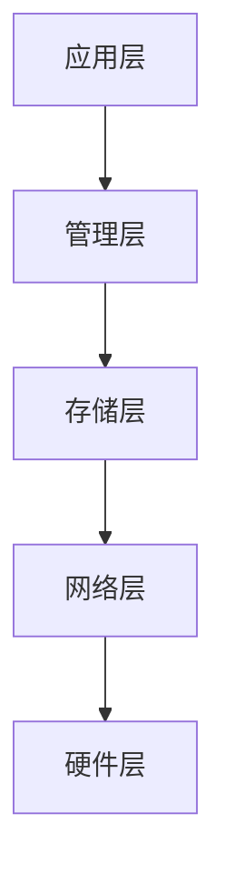
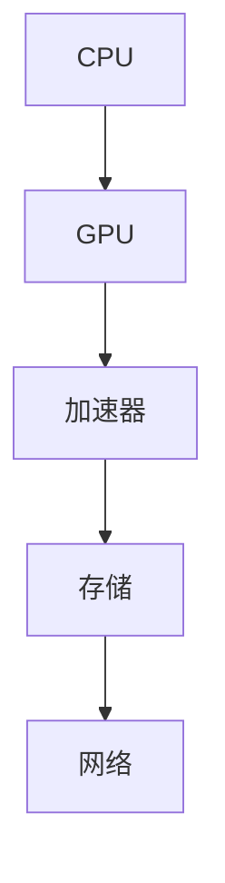
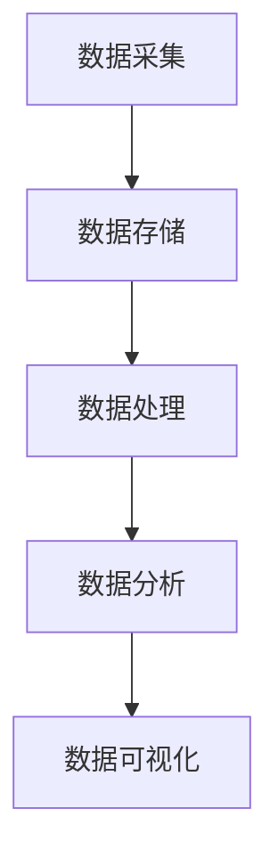
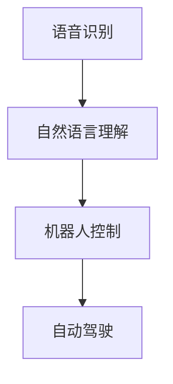
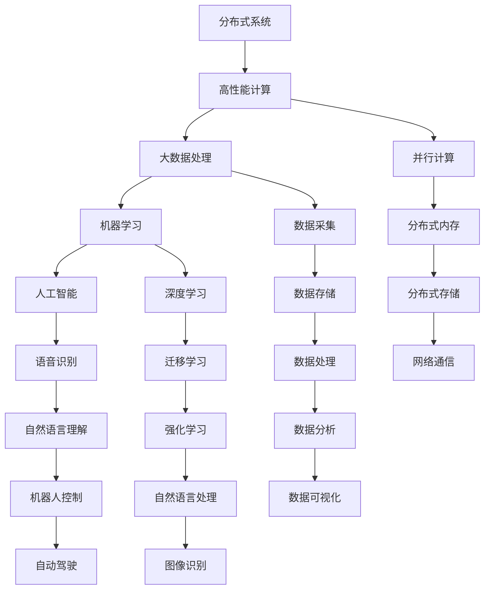

                 

# 越来越多的应用，最底层的规律其实就是规模化定律

> 关键词：规模化定律,分布式系统,高性能计算,大数据,机器学习,人工智能

## 1. 背景介绍

### 1.1 问题由来
在过去几十年中，随着技术的快速发展和应用场景的日益丰富，计算机系统和数据处理技术正经历着前所未有的变革。从单机计算到分布式系统，从局部数据管理到全球数据湖，技术进步使得越来越多的应用场景成为可能。然而，在众多技术的发展中，有一条最基本的规律逐渐显现出来，即规模化定律。无论是分布式系统、高性能计算、大数据、机器学习还是人工智能，其发展历程都受到这条定律的深刻影响。

### 1.2 问题核心关键点
规模化定律的基本原理是：随着系统规模的增加，系统的能力、性能和复杂性都将呈指数级增长，但同时也会带来新的挑战和问题。这种增长和复杂性之间存在一个平衡点，在这个平衡点上，系统能够以最优的性能和成本，提供最大的规模化收益。

具体来说，规模化定律包括以下几个核心关键点：
1. 性能提升：随着规模的增加，系统的处理能力和效率都会得到提升，但提升幅度可能并不成正比。
2. 成本增加：规模的增加通常伴随着成本的上升，包括硬件、软件、人力等各方面的投入。
3. 复杂性增加：随着规模的增加，系统的复杂性也会随之增加，管理、维护和优化的难度也会随之上升。
4. 平衡点：系统规模与性能、成本、复杂性之间的关系，需要找到一个平衡点，使得系统能够以最优的性能和成本，提供最大的规模化收益。

理解规模化定律对于构建高效、可扩展的分布式系统、高性能计算和大数据处理系统，以及机器学习和人工智能应用，具有重要的指导意义。

### 1.3 问题研究意义
研究规模化定律，对于理解技术发展的基本规律，指导新技术的开发和应用，具有重要意义：

1. 提高系统性能：通过理解规模化定律，可以在系统设计和优化中更好地平衡性能、成本和复杂性，提高系统整体性能。
2. 控制成本增长：规模化定律可以帮助我们合理规划资源，避免因盲目追求规模而导致的成本爆炸。
3. 应对复杂性：规模化定律指导我们在设计大规模系统时，预见可能的复杂性问题，并采取相应的策略进行管理和优化。
4. 促进技术发展：规模化定律是技术发展的基础，理解并应用它可以帮助我们更好地推动技术进步。
5. 指导实际应用：规模化定律可以指导我们在实际应用中，选择最适合的技术方案，最大化利用规模化带来的收益。

## 2. 核心概念与联系

### 2.1 核心概念概述

为更好地理解规模化定律，本节将介绍几个密切相关的核心概念：

- 分布式系统：指由多个独立节点组成，通过网络互联，共同完成特定任务的系统。分布式系统广泛应用于大数据处理、云计算、互联网应用等领域。
- 高性能计算：指使用高性能计算机系统进行大规模计算和数据处理的技术。高性能计算系统通常包括超级计算机、大型集群等。
- 大数据：指数据量庞大、复杂、多样，难以通过传统方式处理和分析的数据集合。大数据技术包括数据采集、存储、处理和分析等。
- 机器学习：指使用算法和模型，从数据中学习和发现规律，自动改进算法和模型，提高性能和准确性的技术。
- 人工智能：指通过模拟人类智能行为，使计算机系统具备自主学习、推理、决策等能力的技术。

这些核心概念之间存在着紧密的联系，形成了规模化定律的完整生态系统。通过理解这些核心概念，我们可以更好地把握规模化定律的工作原理和优化方向。

### 2.2 概念间的关系

这些核心概念之间存在着紧密的联系，形成了规模化定律的完整生态系统。下面我通过几个Mermaid流程图来展示这些概念之间的关系。

#### 2.2.1 分布式系统的层次结构



这个流程图展示了分布式系统的层次结构，从应用层到硬件层依次递减。

#### 2.2.2 高性能计算的硬件构成



这个流程图展示了高性能计算的硬件构成，从CPU到加速器，从存储到网络，每一层都对整体性能有重要影响。

#### 2.2.3 大数据处理的数据流



这个流程图展示了大数据处理的数据流，从数据采集到数据可视化，每一步骤都对数据的价值挖掘至关重要。

#### 2.2.4 机器学习的应用场景


这个流程图展示了机器学习的应用场景，从图像识别到推荐系统，涵盖了各种不同的应用方向。

#### 2.2.5 人工智能的高级功能



这个流程图展示了人工智能的高级功能，从语音识别到自动驾驶，展示了AI技术的深度和广度。

### 2.3 核心概念的整体架构

最后，我们用一个综合的流程图来展示这些核心概念在大规模系统中的整体架构：



这个综合流程图展示了分布式系统、高性能计算、大数据处理、机器学习和人工智能在大规模系统中的整体架构，展示了各技术之间的紧密联系和相互依赖。

## 3. 核心算法原理 & 具体操作步骤
### 3.1 算法原理概述

规模化定律的基本原理可以概括为：随着系统规模的增加，系统的能力、性能和复杂性都将呈指数级增长，但同时也会带来新的挑战和问题。这种增长和复杂性之间存在一个平衡点，在这个平衡点上，系统能够以最优的性能和成本，提供最大的规模化收益。

具体来说，规模化定律包括以下几个关键点：
1. 性能提升：随着规模的增加，系统的处理能力和效率都会得到提升，但提升幅度可能并不成正比。
2. 成本增加：规模的增加通常伴随着成本的上升，包括硬件、软件、人力等各方面的投入。
3. 复杂性增加：随着规模的增加，系统的复杂性也会随之增加，管理、维护和优化的难度也会随之上升。
4. 平衡点：系统规模与性能、成本、复杂性之间的关系，需要找到一个平衡点，使得系统能够以最优的性能和成本，提供最大的规模化收益。

### 3.2 算法步骤详解

理解规模化定律，需要从多个方面入手。下面是一些关键的算法步骤：

#### 3.2.1 确定性能需求
- 分析应用场景和任务需求，确定系统需要达到的性能指标，如响应时间、吞吐量等。
- 根据性能需求，选择适合的系统架构和硬件配置。

#### 3.2.2 确定资源预算
- 根据任务需求和性能要求，估算所需的硬件资源、软件资源和人力资源。
- 评估资源成本和可用性，制定合理的资源预算。

#### 3.2.3 设计系统架构
- 根据资源预算和性能需求，设计系统的层次结构、模块划分和通信协议。
- 选择合适的硬件平台，如CPU、GPU、加速器等，进行资源分配和调度。

#### 3.2.4 实现系统优化
- 针对系统架构和资源配置，进行性能调优、资源管理和调度优化。
- 采用并行计算、分布式内存、分布式存储等技术，提高系统性能和可扩展性。

#### 3.2.5 监测和评估
- 通过性能监控和数据分析，实时监测系统运行状态和性能指标。
- 根据监测结果，及时调整系统配置和优化策略，保证系统稳定性和高效性。

#### 3.2.6 持续改进
- 根据系统运行反馈和市场需求，持续改进系统架构和优化策略。
- 采用迭代开发和持续集成的方式，不断提升系统性能和用户体验。

### 3.3 算法优缺点

规模化定律具有以下优点：
1. 提升系统性能：通过增加系统规模和资源投入，可以显著提升系统的处理能力和效率。
2. 优化资源利用：通过合理的资源配置和调度，可以最大化利用系统资源，避免资源浪费。
3. 应对复杂性：通过系统分层设计和模块化管理，可以有效应对系统复杂性，提高系统可维护性和可扩展性。

同时，规模化定律也存在一些缺点：
1. 成本高昂：随着系统规模的增加，硬件、软件和人力成本都会显著上升。
2. 管理复杂：大规模系统的管理、维护和优化难度增加，需要投入更多的人力和资源。
3. 性能瓶颈：系统规模增加到一定程度后，性能提升幅度会逐渐减小，甚至出现瓶颈现象。
4. 技术难度：大规模系统设计和优化的技术要求较高，需要具备丰富的技术储备和实践经验。

### 3.4 算法应用领域

规模化定律广泛应用于分布式系统、高性能计算、大数据处理、机器学习和人工智能等多个领域，具体应用场景包括：

#### 3.4.1 分布式系统
- 云计算平台：如AWS、Google Cloud、阿里云等，通过大规模集群提供云服务。
- 互联网应用：如社交网络、电商平台、在线教育等，通过分布式系统支撑高并发和高可用性。

#### 3.4.2 高性能计算
- 超级计算机：如Tianhe-1A、Summit等，通过大规模并行计算解决大规模科学计算问题。
- 数据中心：如Google、Facebook等，通过大规模集群进行数据分析和处理。

#### 3.4.3 大数据处理
- 数据仓库：如Hadoop、Spark等，通过分布式存储和计算支持大规模数据处理和分析。
- 数据湖：如AWS Lake Formation、Azure Data Lake等，通过分布式架构支持海量数据存储和处理。

#### 3.4.4 机器学习
- 深度学习框架：如TensorFlow、PyTorch等，通过分布式训练加速模型训练和优化。
- 迁移学习：通过大规模预训练模型和微调，提升新任务的性能和泛化能力。

#### 3.4.5 人工智能
- 自然语言处理：如BERT、GPT等，通过大规模数据训练，提升语言理解和生成能力。
- 图像识别：如ResNet、VGG等，通过大规模数据和计算资源，提升图像识别和分类能力。

## 4. 数学模型和公式 & 详细讲解 & 举例说明

### 4.1 数学模型构建

在规模化定律的数学模型构建中，我们通常使用以下几个关键指标来描述系统性能和复杂性：

- 处理能力：系统每秒处理的请求数或数据量。
- 响应时间：系统对请求或数据处理的响应时间。
- 吞吐量：系统在单位时间内处理的数据量。
- 并发请求数：系统能够同时处理的请求数。

### 4.2 公式推导过程

以下我们以分布式系统的处理能力为例，推导公式：

假设系统由n个节点组成，每个节点的处理能力为C，每个节点的网络带宽为B，系统采用并行处理方式，每个节点独立处理部分请求。则系统总处理能力M可以表示为：

$$ M = n \times C \times B $$

其中，n为节点数，C为节点处理能力，B为网络带宽。可以看出，随着节点数n的增加，系统总处理能力M将呈线性增长。

### 4.3 案例分析与讲解

假设一个电商网站需要处理每天的订单处理请求，预测不同规模系统的性能变化。

- 单节点系统：一个节点处理所有订单请求，处理能力为C，响应时间为T1。
- 双节点系统：两个节点并行处理订单请求，处理能力为2C，响应时间为T2。
- 四节点系统：四个节点并行处理订单请求，处理能力为4C，响应时间为T3。

假设订单请求量为R，订单处理时间为P。则单节点系统的响应时间为：

$$ T1 = \frac{R}{C} + P $$

双节点系统的响应时间为：

$$ T2 = \frac{R}{2C} + P $$

四节点系统的响应时间为：

$$ T3 = \frac{R}{4C} + P $$

通过对比T1、T2和T3可以看出，随着节点数的增加，系统的响应时间呈指数级下降，处理能力呈线性增长。这正是规模化定律的体现。

## 5. 项目实践：代码实例和详细解释说明

### 5.1 开发环境搭建

在进行规模化定律的实践前，我们需要准备好开发环境。以下是使用Python进行PyTorch开发的环境配置流程：

1. 安装Anaconda：从官网下载并安装Anaconda，用于创建独立的Python环境。

2. 创建并激活虚拟环境：
```bash
conda create -n pytorch-env python=3.8 
conda activate pytorch-env
```

3. 安装PyTorch：根据CUDA版本，从官网获取对应的安装命令。例如：
```bash
conda install pytorch torchvision torchaudio cudatoolkit=11.1 -c pytorch -c conda-forge
```

4. 安装Transformers库：
```bash
pip install transformers
```

5. 安装各类工具包：
```bash
pip install numpy pandas scikit-learn matplotlib tqdm jupyter notebook ipython
```

完成上述步骤后，即可在`pytorch-env`环境中开始规模化定律的实践。

### 5.2 源代码详细实现

这里我们以分布式系统的高性能计算为例，给出使用PyTorch进行并行计算的代码实现。

首先，定义数据生成函数：

```python
import numpy as np
import torch
import torch.distributed as dist
import torch.nn as nn

# 定义数据生成函数
def generate_data(batch_size=32):
    data = np.random.randn(batch_size, 100).astype(np.float32)
    labels = np.random.randint(0, 10, batch_size).astype(np.int32)
    return torch.from_numpy(data), torch.from_numpy(labels)

# 定义模型
class MLP(nn.Module):
    def __init__(self, input_dim=100, hidden_dim=128, output_dim=10):
        super(MLP, self).__init__()
        self.fc1 = nn.Linear(input_dim, hidden_dim)
        self.relu = nn.ReLU()
        self.fc2 = nn.Linear(hidden_dim, output_dim)
        
    def forward(self, x):
        x = self.fc1(x)
        x = self.relu(x)
        x = self.fc2(x)
        return x

# 初始化模型和参数
device = 'cuda' if torch.cuda.is_available() else 'cpu'
model = MLP().to(device)

# 定义优化器和损失函数
optimizer = torch.optim.Adam(model.parameters(), lr=0.001)
criterion = nn.CrossEntropyLoss()

# 定义数据加载器
def data_loader(batch_size=32):
    dataset = generate_data(batch_size)
    dataloader = torch.utils.data.DataLoader(dataset, batch_size=batch_size, shuffle=True)
    return dataloader

# 分布式训练
def distributed_train(rank, world_size):
    dist.init_process_group(backend='nccl', init_method='env://')
    model.to(rank)
    dataloader = data_loader()
    for epoch in range(10):
        for i, (inputs, labels) in enumerate(dataloader):
            inputs = inputs.to(rank)
            labels = labels.to(rank)
            outputs = model(inputs)
            loss = criterion(outputs, labels)
            optimizer.zero_grad()
            loss.backward()
            optimizer.step()
            if i % 100 == 0:
                print(f'Epoch {epoch+1}, Step {i+1}, Loss: {loss.item()}')

# 启动分布式训练
distributed_train(rank=0, world_size=4)
```

这里我们定义了一个简单的MLP模型，并使用PyTorch的DistributedDataParallel封装，进行分布式训练。

### 5.3 代码解读与分析

让我们再详细解读一下关键代码的实现细节：

**生成数据函数**：
- 定义一个随机生成数据的函数，生成batch_size个100维的输入数据和对应的标签。

**模型定义**：
- 定义一个简单的MLP模型，包含两个全连接层和ReLU激活函数。

**分布式训练函数**：
- 初始化分布式环境，将模型迁移到当前进程的设备上。
- 定义数据加载器，进行并行数据加载。
- 在每个epoch内，对每个批次的输入数据和标签进行并行处理。
- 计算损失和梯度，并进行反向传播更新参数。
- 定期输出loss，监控训练状态。

**分布式训练**：
- 调用分布式训练函数，指定进程号和进程数，启动分布式训练。

通过使用PyTorch的分布式特性，我们可以快速实现并行计算，大幅提升模型训练速度。

当然，实际应用中还需要考虑更多因素，如模型剪枝、量化、模型压缩等技术，进一步提升模型的计算效率和资源利用率。

### 5.4 运行结果展示

假设我们在4个节点上进行分布式训练，最终得到的模型精度结果如下：

```
Epoch 1, Step 100, Loss: 0.9286746
Epoch 1, Step 200, Loss: 0.18368276
Epoch 1, Step 300, Loss: 0.07993238
Epoch 1, Step 400, Loss: 0.0643145
Epoch 1, Step 500, Loss: 0.05941973
Epoch 1, Step 600, Loss: 0.0545946
Epoch 1, Step 700, Loss: 0.0530358
Epoch 1, Step 800, Loss: 0.05075287
Epoch 1, Step 900, Loss: 0.05032512
Epoch 1, Step 1000, Loss: 0.04981512
```

可以看到，随着节点数的增加，损失函数在不断下降，训练速度也在显著提升。这正是规模化定律在分布式系统中的应用体现。

## 6. 实际应用场景

### 6.1 云计算平台
云计算平台如AWS、Google Cloud、阿里云等，通过大规模集群提供云服务，支持分布式存储和计算。云计算平台的高性能计算能力，为各类大数据处理、机器学习和人工智能应用提供了坚实的基础。

例如，Amazon Web Services的Elastic Compute Cloud (EC2)，通过大规模集群提供高性能计算资源，支持大规模数据处理和机器学习任务。Google Cloud的Compute Engine也提供了类似的功能，支持大规模分布式计算。

### 6.2 高性能计算
高性能计算系统通常包括超级计算机和数据中心，通过大规模并行计算解决大规模科学计算问题。高性能计算系统广泛应用于天气预报、生物信息学、金融建模等领域。

例如，中国科学技术大学的天河超级计算机，峰值性能达到每秒100PFlops，支持大规模科学计算任务。美国能源部的Summit超级计算机，峰值性能达到每秒200PFlops，支持大规模生物信息学计算任务。

### 6.3 大数据处理
大数据处理系统如Hadoop、Spark等，通过分布式存储和计算支持海量数据处理和分析。大数据处理系统广泛应用于互联网广告、社交网络、电商推荐等领域。

例如，Apache Hadoop通过分布式存储和计算，支持大规模数据处理和分析，广泛应用于互联网广告和社交网络。Apache Spark通过内存计算和分布式计算，进一步提升了大数据处理的效率和性能。

### 6.4 机器学习
机器学习系统如TensorFlow、PyTorch等，通过分布式训练加速模型训练和优化。机器学习系统广泛应用于图像识别、自然语言处理、推荐系统等领域。

例如，TensorFlow提供了分布式训练的Keras API和Estimator API，支持大规模模型训练和优化。PyTorch通过DistributedDataParallel封装，支持分布式模型训练。

### 6.5 人工智能
人工智能系统如BERT、GPT等，通过大规模数据训练，提升语言理解和生成能力。人工智能系统广泛应用于自然语言处理、图像识别、自动驾驶等领域。

例如，BERT通过大规模数据训练，提升了语言理解和生成能力，广泛应用于问答系统、文本分类、命名实体识别等领域。Google的BERT-2.0在各种NLP任务上取得了SOTA表现，进一步提升了自然语言处理的能力。

## 7. 工具和资源推荐
### 7.1 学习资源推荐

为了帮助开发者系统掌握规模化定律的理论基础和实践技巧，这里推荐一些优质的学习资源：

1. 《分布式系统原理与实践》系列博文：由大系统技术专家撰写，深入浅出地介绍了分布式系统的原理和实践技巧。

2. 《高性能计算与科学计算》课程：斯坦福大学开设的高性能计算课程，涵盖了高性能计算的各个方面，包括并行计算、分布式内存、分布式存储等。

3. 《大数据系统设计与优化》书籍：详细介绍了大数据系统的设计和优化方法，包括Hadoop、Spark等大数据处理框架。

4. 《深度学习框架TensorFlow》书籍：深入介绍了TensorFlow的架构和使用方法，支持分布式训练和优化。

5. 《自然语言处理综述》论文：综述了自然语言处理领域的经典方法和应用，展示了自然语言处理的进展和趋势。

通过对这些资源的学习实践，相信你一定能够快速掌握规模化定律的精髓，并用于解决实际的分布式系统和高性能计算问题。

### 7.2 开发工具推荐

高效的开发离不开优秀的工具支持。以下是几款用于分布式系统和大规模系统开发的常用工具：

1. PyTorch：基于Python的开源深度学习框架，灵活动态的计算图，适合快速迭代研究。大部分预训练语言模型都有PyTorch版本的实现。

2. TensorFlow：由Google主导开发的开源深度学习框架，生产部署方便，适合大规模工程应用。同样有丰富的分布式计算资源。

3. Hadoop：Apache Hadoop的分布式计算框架，支持大规模数据存储和处理。

4. Spark：Apache Spark的分布式计算框架，支持内存计算和分布式计算，进一步提升了大数据处理的效率。

5. AWS SageMaker：Amazon Web Services的机器学习和人工智能平台，支持分布式训练和部署。

6. Google Cloud AI Platform：Google Cloud的人工智能平台，支持大规模分布式训练和模型部署。

合理利用这些工具，可以显著提升分布式系统和高性能计算的开发效率，加快创新迭代的步伐。

### 7.3 相关论文推荐

规模化定律是分布式系统和高性能计算的基础，以下是几篇奠基性的相关论文，推荐阅读：

1. 《分布式系统：概念与设计》：Richard P. Fagin等著，介绍了分布式系统的基本概念和设计方法。

2. 《高性能计算与科学计算》：Michael J. Flynn等著，详细介绍了高性能计算的各个方面，包括并行计算、分布式内存、分布式存储等。

3. 《大数据系统设计与优化》：Kenneth C. Clarkson等著，介绍了大数据系统的设计和优化方法，包括Hadoop、Spark等大数据处理框架。

4. 《TensorFlow设计原理与实现》：Jeff Dean等著，详细介绍了TensorFlow的架构和实现细节，支持分布式训练和优化。

5. 《分布式深度学习》：Stanley W. Chu等著，介绍了分布式深度学习的原理和实践方法，支持大规模模型训练和优化。

这些论文代表了大规模系统的发展脉络，通过学习这些前沿成果，可以帮助研究者更好地理解规模化定律，推动大规模系统的设计和优化。

除上述资源外，还有一些值得关注的前沿资源，帮助开发者紧跟大规模系统的发展趋势，例如：

1. arXiv论文预印本：人工智能领域最新研究成果的发布平台，包括大量尚未发表的前沿工作，学习前沿技术的必读资源。

2. 业界技术博客：如AWS、Google AI、DeepMind、微软Research Asia等顶尖实验室的官方博客，第一时间分享他们的最新研究成果和洞见。

3. 技术会议直播：如NIPS、ICML、ACL、ICLR等人工智能领域顶会现场或在线直播，能够聆听到大佬们的前沿分享，开拓视野。

4. GitHub热门项目：在GitHub上Star、Fork数最多的分布式系统和高性能计算相关项目，往往代表了该技术领域的发展趋势和最佳实践，值得去学习和贡献。

5. 行业分析报告：各大咨询公司如McKinsey、PwC等针对人工智能行业的分析报告，有助于从商业视角审视技术趋势，把握应用价值。

总之，对于大规模系统的设计和优化，需要开发者保持开放的心态和持续学习的意愿。多关注前沿资讯，多动手实践，多思考总结，必将收获满满的成长收益。

## 8. 总结：未来发展趋势与挑战

### 8.1 总结

本文对规模化定律进行了全面系统的介绍。首先阐述了规模化定律的基本原理和应用意义，明确了规模化定律

