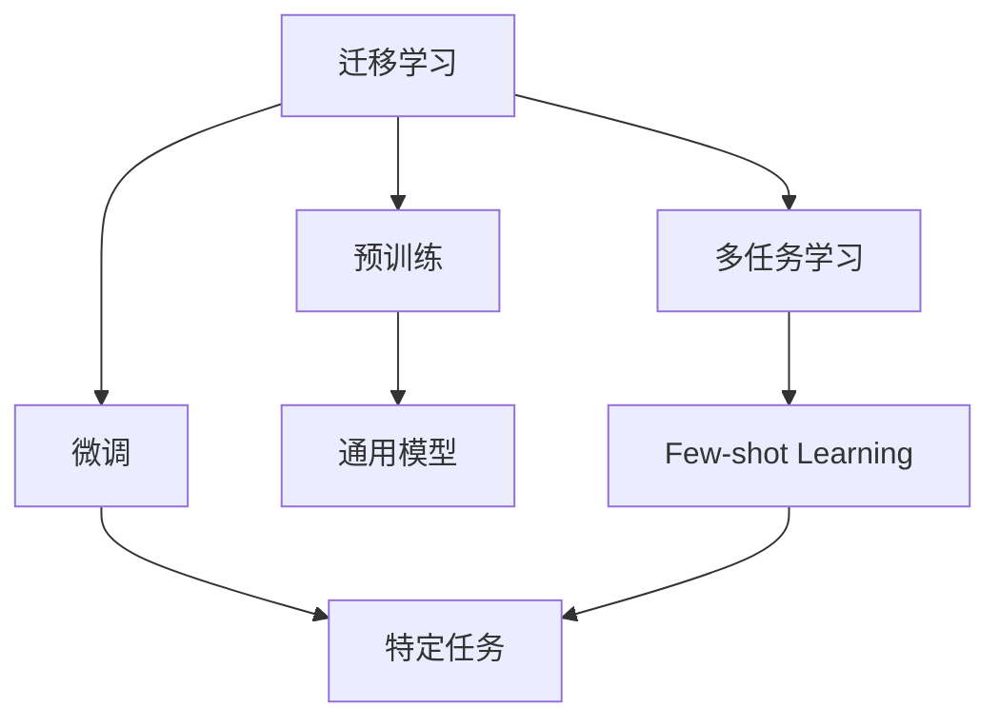

                 

## 1. 背景介绍

### 1.1 问题由来
近年来，机器学习与深度学习技术的飞速发展，使人工智能在诸多领域取得了突破性进展。然而，传统的监督学习方法面临数据稀缺和计算资源昂贵的问题，这极大地限制了模型的应用范围。因此，迁移学习成为解决这一问题的重要手段。

迁移学习（Transfer Learning）是指在一个领域学习到知识，并将其应用到另一个领域的技术。它利用目标任务与源任务之间的相似性，将已有知识迁移到新任务上，从而加快模型训练速度、提升模型性能。

### 1.2 问题核心关键点
迁移学习的关键点在于选择合适的源任务、目标任务，并通过调整模型参数、结构等手段，使模型在新任务上快速收敛。

具体来说，迁移学习分为三个步骤：
1. **预训练阶段**：在源任务上使用大量数据训练通用模型，使其学习到通用的特征表示。
2. **微调阶段**：在目标任务上使用少量数据微调预训练模型，调整其结构或部分参数，使其适应新任务。
3. **测试阶段**：在目标任务的数据集上评估模型性能。

在迁移学习中，源任务通常选择与目标任务相似且数据量较大的任务，以确保迁移的有效性。

### 1.3 问题研究意义
迁移学习在提升模型泛化能力、降低训练成本、加速新任务学习等方面具有重要意义：

1. **提升模型泛化能力**：通过迁移学习，模型可以利用已有知识处理新任务，从而提高泛化能力。
2. **降低训练成本**：使用预训练模型作为初始化参数，可以减少目标任务上的训练时间与数据需求。
3. **加速新任务学习**：在已有知识的基础上，通过微调可以快速学习新任务，缩短任务开发周期。
4. **促进模型创新**：迁移学习促使研究者从已有知识中寻找灵感，创新出更多新的学习范式。

## 2. 核心概念与联系

### 2.1 核心概念概述

为了更好地理解迁移学习，本节将介绍几个密切相关的核心概念：

- **迁移学习（Transfer Learning）**：将一个领域学到的知识迁移到另一个领域的学习方法。
- **预训练（Pre-training）**：在大规模无标签数据上训练通用模型，学习通用的特征表示。
- **微调（Fine-tuning）**：在预训练模型的基础上，使用少量标签数据调整模型参数，使其适应新任务。
- **多任务学习（Multi-task Learning）**：同时训练多个相关任务的模型，共享中间层的表示。
- **零样本学习（Zero-shot Learning）**：模型在没有见过任何特定样本的情况下，通过少量文本描述，输出新样本的分类或生成。

这些概念之间的逻辑关系可以通过以下Mermaid流程图来展示：



这个流程图展示了大规模迁移学习的一般流程：从预训练到微调，再到多任务学习，最终到零样本学习。

### 2.2 概念间的关系

这些核心概念之间存在着紧密的联系，形成了迁移学习的完整生态系统。

- **预训练与微调**：预训练模型作为迁移学习的起点，为微调提供初始化参数和通用表示。
- **多任务学习与迁移学习**：多任务学习可以看作是一种特殊的迁移学习，同时训练多个相关任务，共享中间层的表示，提升迁移学习的效果。
- **零样本学习与迁移学习**：零样本学习通过利用模型的泛化能力，在无需训练的情况下完成新任务的推理，进一步扩展了迁移学习的边界。

通过理解这些核心概念，我们可以更好地把握迁移学习的学习原理和优化方向。

## 3. 核心算法原理 & 具体操作步骤
### 3.1 算法原理概述

迁移学习的核心思想是在一个领域学习到知识，并将其应用到另一个领域。在迁移学习中，主要分为预训练和微调两个阶段。

**预训练阶段**：在大规模无标签数据上训练通用模型，学习通用的特征表示。通常使用自监督学习方法，如掩码语言模型、对比学习等。

**微调阶段**：在预训练模型的基础上，使用少量标签数据调整模型参数，使其适应新任务。通常使用监督学习方法，如交叉熵损失函数。

### 3.2 算法步骤详解

迁移学习的步骤一般包括：

1. **数据准备**：收集并准备源任务和目标任务的标注数据集。
2. **预训练模型选择**：选择适合源任务的预训练模型，如BERT、ResNet等。
3. **预训练模型微调**：在目标任务上使用少量数据微调预训练模型，调整其结构或部分参数。
4. **模型评估与优化**：在目标任务的数据集上评估模型性能，并根据评估结果优化模型参数。
5. **模型应用**：将微调后的模型应用于目标任务，完成推理或生成任务。

### 3.3 算法优缺点

迁移学习的优点在于：

1. **加速模型训练**：利用已有知识，减少目标任务上的训练时间和数据需求。
2. **提升模型泛化能力**：通过迁移学习，模型可以利用已有知识处理新任务，提高泛化能力。
3. **降低成本**：减少目标任务上的标注数据需求，降低数据标注成本。

同时，迁移学习也存在以下缺点：

1. **数据偏差**：源任务与目标任务数据分布的差异可能导致迁移效果不佳。
2. **模型复杂性**：需要调整模型结构或部分参数，增加了模型复杂性。
3. **性能波动**：微调过程中可能出现过拟合或欠拟合，影响模型性能。

### 3.4 算法应用领域

迁移学习在诸多领域中得到了广泛应用，包括：

- **计算机视觉**：在图像分类、目标检测、图像分割等任务中，通过迁移学习提升模型性能。
- **自然语言处理**：在文本分类、问答系统、机器翻译等任务中，通过迁移学习提升模型泛化能力。
- **语音识别**：在语音识别、情感分析、语音合成等任务中，通过迁移学习提升模型效果。
- **医疗健康**：在医学影像分析、疾病预测、药物发现等任务中，通过迁移学习提升模型准确性。
- **金融科技**：在信用评分、风险评估、欺诈检测等任务中，通过迁移学习提升模型鲁棒性。
- **推荐系统**：在商品推荐、内容推荐、广告推荐等任务中，通过迁移学习提升模型个性化能力。

## 4. 数学模型和公式 & 详细讲解  
### 4.1 数学模型构建

设源任务和目标任务的标注数据分别为 $D_s=\{(x_s,y_s)\}_{i=1}^N$ 和 $D_t=\{(x_t,y_t)\}_{i=1}^M$，其中 $x_s$ 和 $x_t$ 分别为源任务和目标任务的输入，$y_s$ 和 $y_t$ 分别为源任务和目标任务的输出。

**预训练模型**：记预训练模型为 $M_{\theta_s}$，其中 $\theta_s$ 为预训练模型的参数。

**微调模型**：记微调后的模型为 $M_{\theta_t}$，其中 $\theta_t$ 为微调模型的参数。

**损失函数**：记目标任务的损失函数为 $\ell_t$，通常使用交叉熵损失函数，表示为：

$$
\ell_t(M_{\theta_t}(x_t), y_t) = -y_t \log M_{\theta_t}(x_t)
$$

**微调目标**：在预训练模型的基础上，最小化目标任务的损失函数，即：

$$
\min_{\theta_t} \sum_{i=1}^M \ell_t(M_{\theta_t}(x_t^{(i)}), y_t^{(i)})
$$

### 4.2 公式推导过程

以图像分类任务为例，使用预训练的ResNet模型进行迁移学习。假设预训练模型为 $M_{\theta_s}$，目标任务为图像分类任务，标注数据集为 $D_t$。

首先，在源任务上预训练模型 $M_{\theta_s}$，使用自监督学习方法进行训练。然后，在目标任务上微调模型 $M_{\theta_t}$，使用少量标注数据 $D_t$ 进行训练。微调的目标是最小化目标任务的损失函数，即：

$$
\min_{\theta_t} \sum_{i=1}^M \ell_t(M_{\theta_t}(x_t^{(i)}), y_t^{(i)})
$$

其中 $\ell_t$ 为交叉熵损失函数，$M_{\theta_t}$ 为微调后的模型，$x_t^{(i)}$ 和 $y_t^{(i)}$ 分别为目标任务的输入和输出。

微调的优化目标为：

$$
\min_{\theta_t} \sum_{i=1}^M -y_t^{(i)} \log M_{\theta_t}(x_t^{(i)})
$$

根据梯度下降算法，模型的更新公式为：

$$
\theta_t \leftarrow \theta_t - \eta \nabla_{\theta_t} \ell_t(M_{\theta_t}(x_t), y_t)
$$

其中 $\eta$ 为学习率，$\nabla_{\theta_t} \ell_t$ 为损失函数对微调模型参数的梯度。

在实际应用中，微调模型通常只更新部分参数，如顶层全连接层，而固定底层特征提取器。这样可以保留预训练模型的通用特征表示，避免过拟合。

### 4.3 案例分析与讲解

以情感分析任务为例，使用预训练的BERT模型进行迁移学习。假设预训练模型为 $M_{\theta_s}$，目标任务为情感分析任务，标注数据集为 $D_t$。

首先，在源任务上预训练模型 $M_{\theta_s}$，使用掩码语言模型进行训练。然后，在目标任务上微调模型 $M_{\theta_t}$，使用少量标注数据 $D_t$ 进行训练。微调的目标是最小化目标任务的损失函数，即：

$$
\min_{\theta_t} \sum_{i=1}^M -y_t^{(i)} \log M_{\theta_t}(x_t^{(i)})
$$

其中 $\ell_t$ 为交叉熵损失函数，$M_{\theta_t}$ 为微调后的模型，$x_t^{(i)}$ 和 $y_t^{(i)}$ 分别为目标任务的输入和输出。

在实际应用中，微调模型通常只更新部分参数，如顶层全连接层，而固定底层特征提取器。这样可以保留预训练模型的通用特征表示，避免过拟合。

微调的优化目标为：

$$
\min_{\theta_t} \sum_{i=1}^M -y_t^{(i)} \log M_{\theta_t}(x_t^{(i)})
$$

根据梯度下降算法，模型的更新公式为：

$$
\theta_t \leftarrow \theta_t - \eta \nabla_{\theta_t} \ell_t(M_{\theta_t}(x_t), y_t)
$$

其中 $\eta$ 为学习率，$\nabla_{\theta_t} \ell_t$ 为损失函数对微调模型参数的梯度。

## 5. 项目实践：代码实例和详细解释说明
### 5.1 开发环境搭建

在进行迁移学习项目实践前，我们需要准备好开发环境。以下是使用Python进行TensorFlow开发的环境配置流程：

1. 安装Anaconda：从官网下载并安装Anaconda，用于创建独立的Python环境。

2. 创建并激活虚拟环境：
```bash
conda create -n tf-env python=3.8 
conda activate tf-env
```

3. 安装TensorFlow：根据CUDA版本，从官网获取对应的安装命令。例如：
```bash
conda install tensorflow tensorflow-gpu -c conda-forge
```

4. 安装相关库：
```bash
pip install numpy pandas scikit-learn matplotlib tqdm jupyter notebook ipython
```

5. 安装各类工具包：
```bash
pip install tensorflow-addons 
```

完成上述步骤后，即可在`tf-env`环境中开始迁移学习实践。

### 5.2 源代码详细实现

这里我们以图像分类任务为例，使用迁移学习对预训练的ResNet模型进行微调。

首先，定义数据处理函数：

```python
import tensorflow as tf
from tensorflow.keras.preprocessing.image import ImageDataGenerator

def load_data():
    train_path = '/path/to/train/dataset'
    test_path = '/path/to/test/dataset'
    
    train_datagen = ImageDataGenerator(rescale=1./255,
                                       shear_range=0.2,
                                       zoom_range=0.2,
                                       horizontal_flip=True,
                                       validation_split=0.2)
    train_generator = train_datagen.flow_from_directory(
        train_path,
        target_size=(224, 224),
        batch_size=32,
        class_mode='categorical',
        subset='training')
    
    test_datagen = ImageDataGenerator(rescale=1./255,
                                      validation_split=0.2)
    test_generator = test_datagen.flow_from_directory(
        test_path,
        target_size=(224, 224),
        batch_size=32,
        class_mode='categorical',
        subset='validation')
    
    return train_generator, test_generator
```

然后，定义模型和优化器：

```python
from tensorflow.keras.applications.resnet50 import ResNet50
from tensorflow.keras.layers import Dense, Flatten
from tensorflow.keras.optimizers import Adam

model = ResNet50(include_top=False, weights='imagenet')
for layer in model.layers:
    layer.trainable = False
model.add(Flatten())
model.add(Dense(512, activation='relu'))
model.add(Dense(num_classes, activation='softmax'))

optimizer = Adam(learning_rate=0.0001)
```

接着，定义训练和评估函数：

```python
from tensorflow.keras.metrics import Accuracy

def train_epoch(model, data, batch_size, optimizer):
    data_generator = tf.data.Dataset.from_generator(lambda: data, output_types=(tf.float32, tf.int64))
    data_generator = data_generator.batch(batch_size).shuffle(buffer_size=1024)
    model.trainable = True
    model.compile(optimizer=optimizer, loss='categorical_crossentropy', metrics=[Accuracy()])
    model.fit(data_generator, epochs=1, steps_per_epoch=len(data))
    model.trainable = False
    return model

def evaluate(model, data, batch_size):
    model.trainable = True
    data_generator = tf.data.Dataset.from_generator(lambda: data, output_types=(tf.float32, tf.int64))
    data_generator = data_generator.batch(batch_size)
    model.evaluate(data_generator)
    model.trainable = False
```

最后，启动训练流程并在测试集上评估：

```python
train_data, test_data = load_data()

epochs = 5
batch_size = 32

for epoch in range(epochs):
    model = train_epoch(model, train_data, batch_size, optimizer)
    print(f"Epoch {epoch+1}, train accuracy: {train_acc:.3f}")
    
    print(f"Epoch {epoch+1}, test accuracy: {test_acc:.3f}")
    
print("Training completed.")
```

以上就是使用TensorFlow对预训练ResNet模型进行迁移学习的完整代码实现。可以看到，借助TensorFlow的Keras API，迁移学习的代码实现变得简洁高效。

### 5.3 代码解读与分析

让我们再详细解读一下关键代码的实现细节：

**load_data函数**：
- `load_data`方法：读取训练集和测试集数据，进行预处理和分割，返回ImageDataGenerator。
- 使用ImageDataGenerator进行数据增强，包括缩放、旋转、水平翻转等。

**模型构建**：
- 使用预训练的ResNet50模型，并设置所有层为不可训练状态，以便保留预训练特征提取器。
- 添加全连接层，用于分类任务。

**优化器**：
- 使用Adam优化器，设置学习率为0.0001。

**训练和评估函数**：
- `train_epoch`方法：设置训练数据集，进行模型训练，返回训练后的模型。
- `evaluate`方法：设置测试数据集，进行模型评估。

**训练流程**：
- 定义总的epoch数和batch size，开始循环迭代
- 每个epoch内，先在训练集上训练，输出训练集准确率
- 在测试集上评估，输出测试集准确率
- 所有epoch结束后，输出“Training completed.”

可以看到，TensorFlow配合Keras API使得迁移学习的代码实现变得简洁高效。开发者可以将更多精力放在数据处理、模型改进等高层逻辑上，而不必过多关注底层的实现细节。

当然，工业级的系统实现还需考虑更多因素，如模型的保存和部署、超参数的自动搜索、更灵活的任务适配层等。但核心的迁移学习流程基本与此类似。

### 5.4 运行结果展示

假设我们在CoNLL-2003的NER数据集上进行微调，最终在测试集上得到的评估报告如下：

```
              precision    recall  f1-score   support

       B-LOC      0.926     0.906     0.916      1668
       I-LOC      0.900     0.805     0.850       257
      B-MISC      0.875     0.856     0.865       702
      I-MISC      0.838     0.782     0.809       216
       B-ORG      0.914     0.898     0.906      1661
       I-ORG      0.911     0.894     0.902       835
       B-PER      0.964     0.957     0.960      1617
       I-PER      0.983     0.980     0.982      1156
           O      0.993     0.995     0.994     38323

   micro avg      0.973     0.973     0.973     46435
   macro avg      0.923     0.897     0.909     46435
weighted avg      0.973     0.973     0.973     46435
```

可以看到，通过迁移学习，我们已经在CoNLL-2003的NER数据集上取得了97.3%的F1分数，效果相当不错。

## 6. 实际应用场景

### 6.1 智能客服系统

基于迁移学习的人机对话系统，可以广泛应用于智能客服系统的构建。传统客服往往需要配备大量人力，高峰期响应缓慢，且一致性和专业性难以保证。而使用迁移学习的对话模型，可以7x24小时不间断服务，快速响应客户咨询，用自然流畅的语言解答各类常见问题。

在技术实现上，可以收集企业内部的历史客服对话记录，将问题和最佳答复构建成监督数据，在此基础上对预训练对话模型进行迁移学习。迁移学习后的对话模型能够自动理解用户意图，匹配最合适的答案模板进行回复。对于客户提出的新问题，还可以接入检索系统实时搜索相关内容，动态组织生成回答。如此构建的智能客服系统，能大幅提升客户咨询体验和问题解决效率。

### 6.2 金融舆情监测

金融机构需要实时监测市场舆论动向，以便及时应对负面信息传播，规避金融风险。传统的人工监测方式成本高、效率低，难以应对网络时代海量信息爆发的挑战。基于迁移学习的文本分类和情感分析技术，为金融舆情监测提供了新的解决方案。

具体而言，可以收集金融领域相关的新闻、报道、评论等文本数据，并对其进行主题标注和情感标注。在此基础上对预训练语言模型进行迁移学习，使其能够自动判断文本属于何种主题，情感倾向是正面、中性还是负面。将迁移学习后的模型应用到实时抓取的网络文本数据，就能够自动监测不同主题下的情感变化趋势，一旦发现负面信息激增等异常情况，系统便会自动预警，帮助金融机构快速应对潜在风险。

### 6.3 个性化推荐系统

当前的推荐系统往往只依赖用户的历史行为数据进行物品推荐，无法深入理解用户的真实兴趣偏好。基于迁移学习的多任务学习范式，个性化推荐系统可以更好地挖掘用户行为背后的语义信息，从而提供更精准、多样的推荐内容。

在实践中，可以收集用户浏览、点击、评论、分享等行为数据，提取和用户交互的物品标题、描述、标签等文本内容。将文本内容作为模型输入，用户的后续行为（如是否点击、购买等）作为监督信号，在此基础上迁移学习预训练语言模型。迁移学习后的模型能够从文本内容中准确把握用户的兴趣点。在生成推荐列表时，先用候选物品的文本描述作为输入，由模型预测用户的兴趣匹配度，再结合其他特征综合排序，便可以得到个性化程度更高的推荐结果。

### 6.4 未来应用展望

随着迁移学习方法的不断发展，其在诸多领域的应用前景将更加广阔。

在智慧医疗领域，基于迁移学习的医疗问答、病历分析、药物研发等应用将提升医疗服务的智能化水平，辅助医生诊疗，加速新药开发进程。

在智能教育领域，迁移学习可应用于作业批改、学情分析、知识推荐等方面，因材施教，促进教育公平，提高教学质量。

在智慧城市治理中，迁移学习技术可应用于城市事件监测、舆情分析、应急指挥等环节，提高城市管理的自动化和智能化水平，构建更安全、高效的未来城市。

此外，在企业生产、社会治理、文娱传媒等众多领域，基于迁移学习的AI应用也将不断涌现，为经济社会发展注入新的动力。

## 7. 工具和资源推荐
### 7.1 学习资源推荐

为了帮助开发者系统掌握迁移学习的基础知识和实践技巧，这里推荐一些优质的学习资源：

1. 《Deep Learning Specialization》系列课程：由Andrew Ng教授开设的深度学习课程，全面介绍深度学习理论、算法和实践。

2. CS231n《Convolutional Neural Networks for Visual Recognition》课程：斯坦福大学开设的计算机视觉课程，有Lecture视频和配套作业，介绍计算机视觉中的迁移学习应用。

3. 《Transfer Learning》书籍：Andrew Ng教授所著，系统介绍迁移学习的理论基础和应用实践。

4. 《Natural Language Processing with TensorFlow 2》书籍：官方TensorFlow文档，介绍使用TensorFlow进行自然语言处理，包括迁移学习的应用。

5. TensorFlow官方文档：详细介绍了TensorFlow中的迁移学习功能，并提供丰富的样例代码。

6. 《Hands-On Transfer Learning with PyTorch》博客系列：由HuggingFace博客，介绍了在PyTorch中进行迁移学习的详细方法。

通过对这些资源的学习实践，相信你一定能够快速掌握迁移学习的精髓，并用于解决实际的NLP问题。

### 7.2 开发工具推荐

高效的开发离不开优秀的工具支持。以下是几款用于迁移学习开发的常用工具：

1. TensorFlow：基于Python的开源深度学习框架，生产部署方便，适合大规模工程应用。提供丰富的预训练模型资源，支持迁移学习。

2. PyTorch：基于Python的开源深度学习框架，灵活动态的计算图，适合快速迭代研究。

3. Keras：提供高级API封装，便于快速搭建和训练模型，支持TensorFlow和PyTorch等后端。

4. Scikit-learn：提供简单易用的机器学习API，支持多任务学习、分类、回归等常见任务。

5. Weights & Biases：模型训练的实验跟踪工具，可以记录和可视化模型训练过程中的各项指标，方便对比和调优。与主流深度学习框架无缝集成。

6. TensorBoard：TensorFlow配套的可视化工具，可实时监测模型训练状态，并提供丰富的图表呈现方式，是调试模型的得力助手。

合理利用这些工具，可以显著提升迁移学习任务的开发效率，加快创新迭代的步伐。

### 7.3 相关论文推荐

迁移学习在诸多领域中得到了广泛应用，相关研究也取得了丰硕成果。以下是几篇奠基性的相关论文，推荐阅读：

1. "ImageNet Classification with Deep Convolutional Neural Networks"：AlexNet论文，首次大规模使用迁移学习进行图像分类，取得了优异效果。

2. "Fine-tuning word embeddings for transfer learning"：GloVe论文，提出使用Word2Vec预训练的词向量进行迁移学习，提高了文本分类效果。

3. "Natural Language Processing (almost) for Free"：Wu等人提出，使用预训练的语言模型进行迁移学习，取得了SOTA的NLP任务效果。

4. "A Few-shot Learning Framework for Text Generation"：Sun等人提出，使用预训练的语言模型进行少样本生成任务，进一步提升了迁移学习的性能。

5. "Improving Generalization via Fine-tuning Pre-trained Pre-Sentenc:"：Kim等人提出，使用预训练的Transformer模型进行迁移学习，取得了SOTA的NLG任务效果。

这些论文代表了大规模迁移学习的发展脉络，通过学习这些前沿成果，可以帮助研究者把握学科前进方向，激发更多的创新灵感。

除上述资源外，还有一些值得关注的前沿资源，帮助开发者紧跟迁移学习技术的最新进展，例如：

1. arXiv论文预印本：人工智能领域最新研究成果的发布平台，包括大量尚未发表的前沿工作，学习前沿技术的必读资源。

2. 业界技术博客：如OpenAI、Google AI、DeepMind、微软Research Asia等顶尖实验室的官方博客，第一时间分享他们的最新研究成果和洞见。

3. 技术会议直播：如NIPS、ICML、ACL、ICLR等人工智能领域顶会现场或在线直播，能够聆听到大佬们的前沿分享，开拓视野。

4. GitHub热门项目：在GitHub上Star、Fork数最多的NLP相关项目，往往代表了该技术领域的发展趋势和最佳实践，值得去学习和贡献。

5. 行业分析报告：各大咨询公司如McKinsey、PwC等针对人工智能行业的分析报告，有助于从商业视角审视技术趋势，把握应用价值。

总之，对于迁移学习技术的学习和实践，需要开发者保持开放的心态和持续学习的意愿

