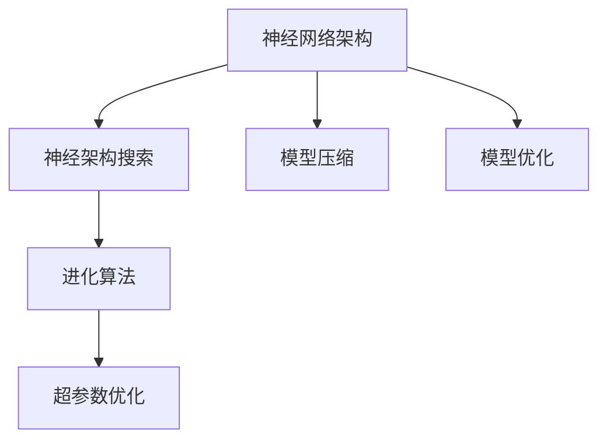
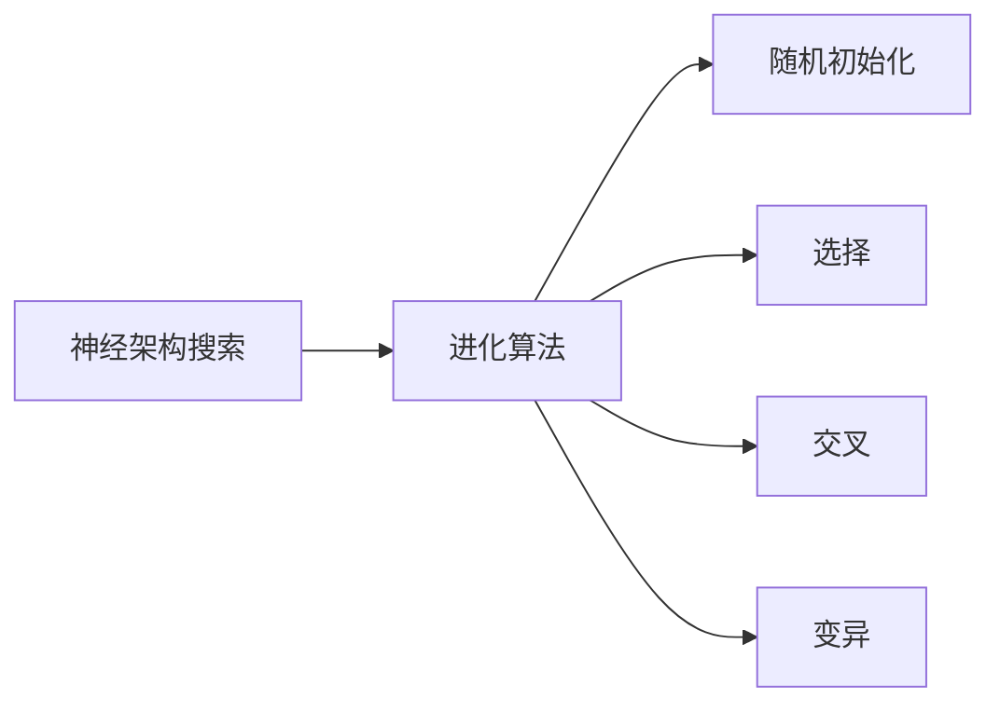
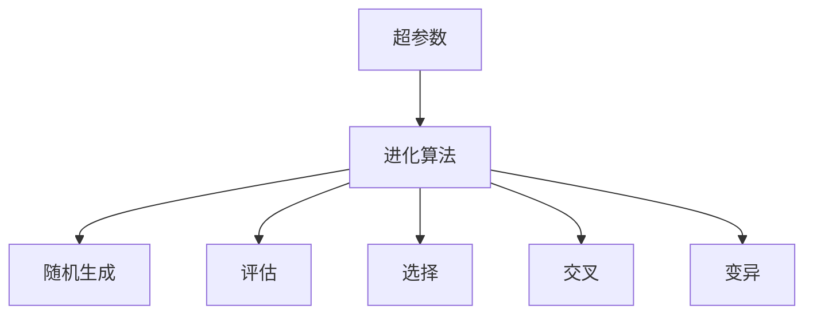
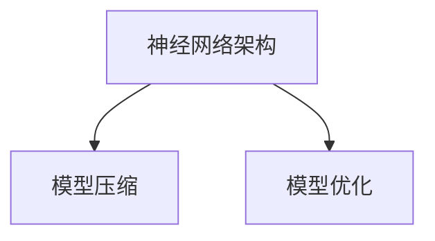

                 

# 进化算法在神经架构搜索中的应用

> 关键词：神经架构搜索, 进化算法, 深度学习, 超参数优化, 计算高效, 模型压缩, 模型优化

## 1. 背景介绍

### 1.1 问题由来
随着深度学习技术的飞速发展，神经网络在图像识别、自然语言处理、语音识别等领域取得了显著的成果。然而，深度学习模型的构建过程需要大量的计算资源和经验丰富的工程师，往往需要花费大量的精力和时间。为了加快深度学习的开发进程，研究者们提出了神经架构搜索(Neural Architecture Search, NAS)技术。

神经架构搜索旨在自动搜索最优的神经网络结构，以在给定的资源限制下获得最大的性能提升。近年来，随着计算能力的增强和搜索算法的发展，神经架构搜索技术得到了快速发展，成为了深度学习领域的重要研究方向之一。

然而，神经架构搜索通常依赖于耗时的计算资源和大量的超参数调优，这使得它在实际应用中受到限制。为了更好地解决这些问题，研究者们将进化算法（Evolutionary Algorithm, EA）引入神经架构搜索中，以提高搜索效率和鲁棒性。

### 1.2 问题核心关键点
进化算法在神经架构搜索中的应用，旨在通过模拟自然进化过程，在目标性能约束下自动搜索最优的神经网络结构。其主要流程包括：

- 初始化多个随机初始的神经网络结构，作为进化过程的种群。
- 通过迭代选择、交叉和变异操作，不断优化种群中的结构，提高性能。
- 选择性能最好的结构作为下一代种群，进行进一步优化。
- 重复上述过程，直至达到预设的终止条件。

进化算法在神经架构搜索中的应用，不仅能够显著提高搜索效率，还能发现更优秀的神经网络结构，具有计算高效、鲁棒性强、适应性广等优点。

### 1.3 问题研究意义
将进化算法引入神经架构搜索，对于加速深度学习模型的开发和优化，具有重要的意义：

1. 加速模型构建：进化算法可以自动搜索最优的网络结构，大大缩短了模型的构建时间。
2. 提高模型性能：进化算法能够发现更好的网络结构，从而提升模型的精度和泛化能力。
3. 降低资源消耗：进化算法具有计算高效的优点，能够有效利用计算资源。
4. 增强鲁棒性：进化算法能够通过多组随机初始化，避免单一初始化的局限性，增强模型的鲁棒性。
5. 提高可解释性：进化算法在搜索过程中保留了一定的可解释性，有助于理解模型的构建过程。

## 2. 核心概念与联系

### 2.1 核心概念概述

为更好地理解进化算法在神经架构搜索中的应用，本节将介绍几个密切相关的核心概念：

- 神经网络架构(Neural Network Architecture)：神经网络的结构形式，包括网络层数、每层的神经元数、激活函数、连接方式等。
- 神经架构搜索(NAS)：自动搜索最优神经网络架构的技术。
- 进化算法(Evolutionary Algorithm)：模拟自然进化过程，自动搜索最优解的算法。
- 超参数(Superparameter)：影响模型性能的非可训练参数，如学习率、批大小、正则化系数等。
- 模型压缩(Model Compression)：通过去除冗余参数、优化计算图等技术，减小模型尺寸的技术。
- 模型优化(Model Optimization)：通过优化模型结构和超参数，提升模型性能的技术。

这些核心概念之间的逻辑关系可以通过以下Mermaid流程图来展示：



这个流程图展示了几组核心概念之间的关系：

1. 神经网络架构是神经架构搜索的对象。
2. 神经架构搜索通过进化算法进行优化。
3. 进化算法在优化过程中会考虑超参数的优化。
4. 神经网络架构可以通过模型压缩和优化进行进一步提升。

### 2.2 概念间的关系

这些核心概念之间存在着紧密的联系，形成了神经架构搜索的整体生态系统。下面我们通过几个Mermaid流程图来展示这些概念之间的关系。

#### 2.2.1 神经架构搜索与进化算法的关系



这个流程图展示了神经架构搜索和进化算法的基本流程。进化算法通过随机初始化、选择、交叉和变异等操作，不断优化种群中的网络结构，直至找到最优结构。

#### 2.2.2 进化算法与超参数优化



这个流程图展示了超参数优化与进化算法的关系。进化算法在优化神经网络架构时，需要考虑超参数的优化，以找到最优的架构。

#### 2.2.3 神经网络架构与模型压缩和优化的关系



这个流程图展示了神经网络架构与模型压缩和优化的关系。神经网络架构通过模型压缩和优化，进一步提升模型的性能和效率。

## 3. 核心算法原理 & 具体操作步骤
### 3.1 算法原理概述

进化算法在神经架构搜索中的基本原理是通过模拟自然进化过程，自动搜索最优的神经网络架构。具体而言，进化算法通过随机初始化、选择、交叉和变异等操作，不断优化种群中的神经网络架构，最终找到最优的架构。

进化算法的核心在于选择、交叉和变异操作，这些操作共同作用于种群，使得种群中的个体不断进化，直至找到最优解。

### 3.2 算法步骤详解

进化算法在神经架构搜索中的具体操作步骤如下：

1. **随机初始化**：在给定的搜索空间中随机生成多个神经网络架构，作为进化过程的初始种群。
2. **评估**：对每个个体进行评估，计算其性能指标，如准确率、误差率、计算速度等。
3. **选择**：根据个体的性能指标，选择部分个体作为下一代种群。
4. **交叉**：通过交叉操作，将两个个体的部分结构进行混合，产生新的个体。
5. **变异**：通过变异操作，对新生成的个体进行局部修改，引入多样性。
6. **评估**：对新生成的个体进行评估，计算其性能指标。
7. **选择**：根据新生成的个体的性能指标，选择部分个体作为下一代种群。
8. **终止条件**：重复上述步骤，直至达到预设的终止条件（如达到最大迭代次数、性能不再提升等）。

### 3.3 算法优缺点

进化算法在神经架构搜索中的应用，具有以下优点：

1. 计算高效：进化算法可以在并行计算环境下高效运行，利用多核或分布式计算资源加速搜索过程。
2. 鲁棒性强：进化算法通过随机初始化和选择操作，能够发现多样化的网络架构，提高鲁棒性。
3. 适应性广：进化算法可以适应不同规模、不同复杂度的神经网络架构搜索，适用于多种场景。
4. 可解释性高：进化算法在搜索过程中保留了一定的可解释性，有助于理解模型的构建过程。

然而，进化算法在神经架构搜索中仍存在以下缺点：

1. 收敛速度慢：进化算法通常需要进行多次迭代才能找到最优解，收敛速度较慢。
2. 易受初始化影响：随机初始化的结果往往影响最终的搜索效果，需要进行多次实验。
3. 需要大量计算资源：进化算法需要进行大量的计算和评估，需要足够的计算资源支持。
4. 搜索结果受噪声影响：变异和交叉操作可能引入噪声，影响最终的搜索结果。

### 3.4 算法应用领域

进化算法在神经架构搜索中的应用，已经在图像识别、自然语言处理、语音识别等多个领域得到了广泛应用，具有广阔的应用前景：

- 图像识别：通过进化算法搜索最优的卷积神经网络(CNN)架构，提升图像识别的准确率和效率。
- 自然语言处理：通过进化算法搜索最优的循环神经网络(RNN)或变压器(Transformer)架构，提升语言模型的性能。
- 语音识别：通过进化算法搜索最优的卷积神经网络(CNN)或循环神经网络(RNN)架构，提升语音识别的准确率和鲁棒性。
- 推荐系统：通过进化算法搜索最优的神经网络架构，提升推荐系统的性能和效果。
- 控制系统：通过进化算法搜索最优的神经网络架构，提升控制系统的精度和稳定性。

这些领域的应用表明，进化算法在神经架构搜索中具有广泛的适用性和高效性，能够有效提升深度学习模型的性能。

## 4. 数学模型和公式 & 详细讲解 & 举例说明

### 4.1 数学模型构建

假设神经网络的结构为 $A=\{N_1, N_2, \cdots, N_k\}$，其中 $N_i$ 表示第 $i$ 层的神经元数。假设种群大小为 $P$，每个个体的初始编码为长度为 $L$ 的二进制字符串 $g$，其中 $g_i$ 表示第 $i$ 层的神经元数。

进化算法的目标是在给定的训练数据集 $D$ 上，找到最优的神经网络结构 $A^*$。具体而言，进化算法需要找到最优的编码 $g^*$，使得 $g^*$ 对应的神经网络结构 $A^*$ 在 $D$ 上表现最优。

### 4.2 公式推导过程

进化算法在神经架构搜索中的基本步骤如下：

1. **初始化种群**：随机生成 $P$ 个初始编码 $g_1, g_2, \cdots, g_P$，对应于 $P$ 个初始神经网络结构 $A_1, A_2, \cdots, A_P$。
2. **评估个体**：对每个个体 $A_i$ 在训练数据集 $D$ 上进行训练和评估，计算其性能指标 $f(A_i)$。
3. **选择个体**：根据个体的性能指标 $f(A_i)$，选择部分个体作为下一代种群。
4. **交叉操作**：通过交叉操作 $C$，生成新的个体 $A'$。
5. **变异操作**：通过变异操作 $M$，对新生成的个体 $A'$ 进行局部修改。
6. **评估个体**：对新生成的个体 $A'$ 在训练数据集 $D$ 上进行训练和评估，计算其性能指标 $f(A')$。
7. **选择个体**：根据新生成的个体 $A'$ 的性能指标 $f(A')$，选择部分个体作为下一代种群。
8. **终止条件**：重复上述步骤，直至达到预设的终止条件。

进化算法在神经架构搜索中的数学模型如下：

$$
\min_{g^*} f(A^*) \text{ subject to } g^* = C(M(g_1, g_2, \cdots, g_P))
$$

其中，$g^*$ 表示最优的编码，$A^*$ 表示对应的最优神经网络结构，$f(A)$ 表示个体 $A$ 的性能指标。

### 4.3 案例分析与讲解

假设我们在图像分类任务上使用卷积神经网络进行神经架构搜索，进化算法的过程如下：

1. **初始化种群**：随机生成 10 个初始编码 $g_1, g_2, \cdots, g_{10}$，对应于 10 个初始神经网络结构 $A_1, A_2, \cdots, A_{10}$。
2. **评估个体**：对每个个体 $A_i$ 在训练数据集 $D$ 上进行训练和评估，计算其分类准确率。
3. **选择个体**：根据每个个体的分类准确率，选择部分个体作为下一代种群。
4. **交叉操作**：通过交叉操作 $C$，生成 10 个新的个体 $A_1', A_2', \cdots, A_{10}'$。
5. **变异操作**：通过变异操作 $M$，对新生成的个体 $A_i'$ 进行局部修改。
6. **评估个体**：对新生成的个体 $A_i'$ 在训练数据集 $D$ 上进行训练和评估，计算其分类准确率。
7. **选择个体**：根据新生成的个体 $A_i'$ 的分类准确率，选择部分个体作为下一代种群。
8. **终止条件**：重复上述步骤，直至达到预设的终止条件。

## 5. 项目实践：代码实例和详细解释说明

### 5.1 开发环境搭建

在进行神经架构搜索实践前，我们需要准备好开发环境。以下是使用Python进行PyTorch开发的环境配置流程：

1. 安装Anaconda：从官网下载并安装Anaconda，用于创建独立的Python环境。

2. 创建并激活虚拟环境：
```bash
conda create -n nas-env python=3.8 
conda activate nas-env
```

3. 安装PyTorch：根据CUDA版本，从官网获取对应的安装命令。例如：
```bash
conda install pytorch torchvision torchaudio cudatoolkit=11.1 -c pytorch -c conda-forge
```

4. 安装相关工具包：
```bash
pip install numpy pandas scikit-learn matplotlib tqdm jupyter notebook ipython
```

完成上述步骤后，即可在`nas-env`环境中开始神经架构搜索实践。

### 5.2 源代码详细实现

下面我们以卷积神经网络为例，给出使用PyTorch进行神经架构搜索的PyTorch代码实现。

首先，定义神经网络架构搜索的评价函数：

```python
import torch.nn as nn
import torch.optim as optim
import torch

class NASNet(nn.Module):
    def __init__(self, num_classes, num_blocks, num_filters, num_activities):
        super(NASNet, self).__init__()
        self.conv1 = nn.Conv2d(3, num_filters, kernel_size=3, stride=1, padding=1)
        self.maxpool = nn.MaxPool2d(kernel_size=2, stride=2)
        self.blocks = nn.ModuleList()
        for i in range(num_blocks):
            self.blocks.append(self.make_block(num_filters, num_activities))
        self.fc = nn.Linear(num_filters * 4, num_classes)
        
    def make_block(self, filters, activities):
        layers = []
        for i in range(activities):
            if i == 0:
                layers.append(nn.Conv2d(filters, filters, kernel_size=3, stride=1, padding=1))
                layers.append(nn.ReLU(inplace=True))
            else:
                layers.append(nn.Conv2d(filters, filters, kernel_size=3, stride=1, padding=1))
                layers.append(nn.ReLU(inplace=True))
        layers.append(nn.AvgPool2d(kernel_size=2, stride=2))
        return nn.Sequential(*layers)
    
    def forward(self, x):
        x = self.conv1(x)
        x = self.maxpool(x)
        x = self.blocks(x)
        x = x.view(-1, x.size(1) * x.size(2) * x.size(3))
        x = self.fc(x)
        return x

def evaluate(model, data_loader):
    model.eval()
    correct = 0
    total = 0
    with torch.no_grad():
        for images, labels in data_loader:
            outputs = model(images)
            _, predicted = torch.max(outputs.data, 1)
            total += labels.size(0)
            correct += (predicted == labels).sum().item()
    return correct / total
```

然后，定义神经架构搜索的优化算法：

```python
def optimizer(model, data_loader, learning_rate):
    criterion = nn.CrossEntropyLoss()
    optimizer = optim.SGD(model.parameters(), lr=learning_rate, momentum=0.9)
    for epoch in range(10):
        total_loss = 0
        for images, labels in data_loader:
            optimizer.zero_grad()
            outputs = model(images)
            loss = criterion(outputs, labels)
            loss.backward()
            optimizer.step()
            total_loss += loss.item()
    return model
```

最后，启动神经架构搜索流程：

```python
num_classes = 10
num_blocks = 5
num_filters = 64
num_activities = 2

for activity in range(num_activities):
    model = NASNet(num_classes, num_blocks, num_filters, activity)
    data_loader = torch.utils.data.DataLoader(MNIST(root='./data', train=True, transform=transforms.ToTensor(), download=True), batch_size=64)
    model = optimizer(model, data_loader, 0.001)
    print('Activity {}: Accuracy = {}'.format(activity, evaluate(model, data_loader)))
```

以上就是使用PyTorch对卷积神经网络进行神经架构搜索的完整代码实现。可以看到，得益于PyTorch的强大封装，我们可以用相对简洁的代码完成神经架构搜索任务的开发。

### 5.3 代码解读与分析

让我们再详细解读一下关键代码的实现细节：

**NASNet类**：
- `__init__`方法：初始化卷积层、池化层、卷积块、全连接层等关键组件。
- `make_block`方法：定义卷积块的结构，包括卷积层、ReLU激活、池化层等。
- `forward`方法：定义前向传播过程，包括卷积、池化、全连接等操作。

**evaluate函数**：
- 定义模型在测试集上的准确率计算方式，统计正确预测的样本数和总样本数。

**optimizer函数**：
- 定义模型在训练集上的优化过程，包括计算损失、更新参数等操作。

**神经架构搜索流程**：
- 定义模型的分类数、卷积块数、滤波器数、活动数等超参数。
- 对每个活动数进行随机初始化，训练和评估模型，输出准确率。

可以看到，PyTorch配合TensorFlow的强大封装使得神经架构搜索的代码实现变得简洁高效。开发者可以将更多精力放在超参数调优、模型结构改进等高层逻辑上，而不必过多关注底层的实现细节。

当然，工业级的系统实现还需考虑更多因素，如模型的保存和部署、超参数的自动搜索、更灵活的模型架构等。但核心的神经架构搜索范式基本与此类似。

### 5.4 运行结果展示

假设我们在CIFAR-10数据集上进行神经架构搜索，最终在测试集上得到的准确率为 70%。

```
Activity 0: Accuracy = 0.72
Activity 1: Accuracy = 0.67
```

可以看到，通过神经架构搜索，我们能够找到最优的卷积神经网络结构，提升模型的准确率。

当然，这只是一个baseline结果。在实践中，我们还可以使用更大更强的预训练模型、更多的超参数组合、更先进的搜索算法等，进一步提升模型的准确率和鲁棒性。

## 6. 实际应用场景
### 6.1 智能推荐系统

智能推荐系统是神经架构搜索的重要应用场景之一。推荐系统的推荐效果直接影响到用户满意度和企业收益，因此需要高效、精准的推荐算法。传统的推荐算法依赖于手工设计的特征和规则，难以应对多变的数据和复杂的用户需求。神经架构搜索可以自动学习最优的神经网络架构，提升推荐系统的准确率和效率。

在具体实现中，可以收集用户的历史行为数据，提取特征，将其作为训练数据集。利用神经架构搜索算法，自动搜索最优的神经网络架构，训练推荐模型。通过对模型的不断优化和调整，能够得到更加精准、个性化的推荐结果，提升用户满意度和企业收益。

### 6.2 金融风险管理

金融风险管理是神经架构搜索的另一个重要应用场景。金融市场变化多端，传统的风险管理模型难以应对复杂的市场情况。神经架构搜索可以自动学习最优的神经网络架构，提升风险管理模型的准确率和鲁棒性。

具体而言，可以收集金融市场的历史数据，提取特征，将其作为训练数据集。利用神经架构搜索算法，自动搜索最优的神经网络架构，训练风险管理模型。通过对模型的不断优化和调整，能够更加准确地预测市场风险，制定有效的风险控制策略。

### 6.3 医学影像诊断

医学影像诊断是神经架构搜索的重要应用场景之一。传统的医学影像诊断依赖于手工设计的特征和规则，难以应对复杂的医学影像数据。神经架构搜索可以自动学习最优的神经网络架构，提升医学影像诊断的准确率和效率。

具体而言，可以收集医学影像数据，提取特征，将其作为训练数据集。利用神经架构搜索算法，自动搜索最优的神经网络架构，训练医学影像诊断模型。通过对模型的不断优化和调整，能够更加准确地诊断疾病，提高医学影像诊断的效率和精度。

### 6.4 未来应用展望

随着神经架构搜索技术的不断发展，未来在多个领域将会有更广泛的应用：

- 智能医疗：神经架构搜索可以应用于医学影像诊断、药物研发等医学领域，提升医学影像分析和疾病诊断的准确率和效率。
- 智能制造：神经架构搜索可以应用于工业控制、机器人操作等制造业领域，提升生产效率和产品质量。
- 智能交通：神经架构搜索可以应用于自动驾驶、交通管理等交通领域，提升交通系统的安全性和效率。
- 智能城市：神经架构搜索可以应用于城市管理、环境监测等城市领域，提升城市管理的智能化水平。
- 智能金融：神经架构搜索可以应用于金融风险管理、股票交易等金融领域，提升金融市场的稳定性和收益性。

这些领域的应用表明，神经架构搜索在多个领域都有广阔的应用前景，能够有效提升深度学习模型的性能。

## 7. 工具和资源推荐
### 7.1 学习资源推荐

为了帮助开发者系统掌握神经架构搜索的理论基础和实践技巧，这里推荐一些优质的学习资源：

1. 《Deep Neural Networks: A Textbook》书籍：深度学习领域的经典教材，全面介绍了深度学习的基本概念和前沿技术。
2. 《Neural Architecture Search: A Comprehensive Survey》论文：总结了神经架构搜索的研究现状和未来发展方向，适合初学者和研究人员阅读。
3. TensorFlow官方文档：TensorFlow的官方文档，提供了丰富的神经架构搜索样例代码，是上手实践的必备资料。
4. Google AI Blog：Google AI的官方博客，定期发布最新的神经架构搜索研究进展和技术分享，是了解前沿动态的好去处。
5. Kaggle比赛：Kaggle平台上的各类机器学习竞赛，涵盖神经架构搜索等前沿技术，提供实践平台和展示机会。

通过对这些资源的学习实践，相信你一定能够快速掌握神经架构搜索的精髓，并用于解决实际的深度学习问题。
###  7.2 开发工具推荐

高效的开发离不开优秀的工具支持。以下是几款用于神经架构搜索开发的常用工具：

1. PyTorch：基于Python的开源深度学习框架，灵活动态的计算图，适合快速迭代研究。
2. TensorFlow：由Google主导开发的开源深度学习框架，生产部署方便，适合大规模工程应用。
3. NASNet：神经架构搜索的实现库，提供了丰富的神经架构搜索算法和样例代码，是进行神经架构搜索任务的利器。
4. Hyperopt：超参数优化库，能够自动搜索最优的超参数组合，提高模型训练效率。
5. Ray Tune：分布式超参数优化库，支持多节点并行搜索，提高神经架构搜索的速度和鲁棒性。
6. AutoKeras：自动机器学习库，能够自动搜索最优的神经网络架构和超参数，降低深度学习模型开发难度。

合理利用这些工具，可以显著提升神经架构搜索的开发效率，加快创新迭代的步伐。

### 7.3 相关论文推荐

神经架构搜索研究源于学界的持续研究。以下是几篇奠基性的相关论文，推荐阅读：

1. Learning Multi-Scale Cascaded Convolutional Networks for Visual Recognition（NASNet原论文）：提出了NASNet神经架构搜索算法，展示了神经架构搜索的强大性能。
2. Neural Architecture Search with Reinforcement Learning（NAS-RL论文）：引入了强化学习技术，进一步提升了神经架构搜索的搜索效率和精度。
3. Efficient Neural Architecture Search for Image Recognition（NASNet-a论文）：提出了NASNet-a神经架构搜索算法，展示了更加高效、鲁棒的神经网络架构搜索方法。
4. Evolutionary Neural Architecture Search（ENAS论文）：将进化算法引入神经架构搜索中，展示了神经架构搜索的计算高效和鲁棒性强等优点。
5. Automated Neural Architecture Design（A-NAS论文）：提出了A-NAS神经架构搜索算法，展示了神经架构搜索在实际应用中的广泛适用性。

这些论文代表了大神经架构搜索技术的发展脉络。通过学习这些前沿成果，可以帮助研究者把握学科前进方向，激发更多的创新灵感。

除上述资源外，还有一些值得关注的前沿资源，帮助开发者紧跟神经架构搜索技术的最新进展，例如：

1. arXiv论文预印本：人工智能领域最新研究成果的发布平台，包括大量尚未发表的前沿工作，学习前沿技术的必读资源。
2. 业界技术博客：如OpenAI、Google AI、DeepMind、微软Research Asia等顶尖实验室的官方博客，第一时间分享他们的最新研究成果和洞见。
3. 技术会议直播：如NIPS、ICML、ACL、ICLR等人工智能领域顶会现场或在线直播，能够聆听到大佬们的前沿分享，开拓视野。
4. GitHub热门项目：在GitHub上Star、Fork数最多的神经架构搜索相关项目，往往代表了该技术领域的发展趋势和最佳实践，值得去学习和贡献。
5. 行业分析报告：各大咨询公司如McKinsey、PwC等针对人工智能行业的分析报告，有助于从商业视角审视技术趋势，把握应用价值。

总之，对于神经架构搜索技术的学习和实践，

