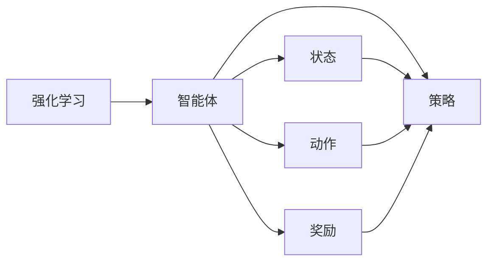
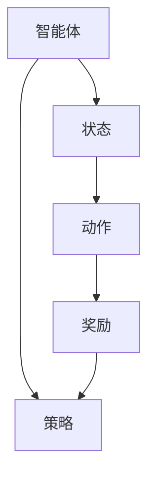
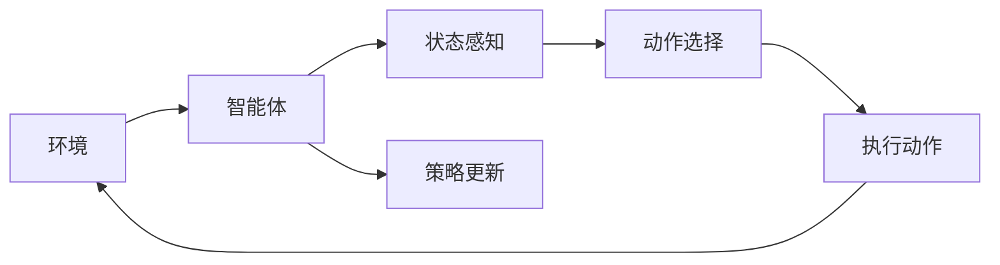
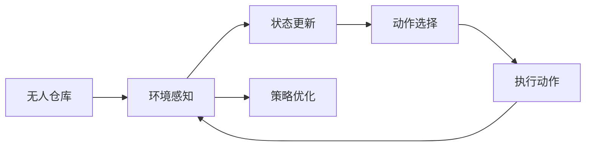
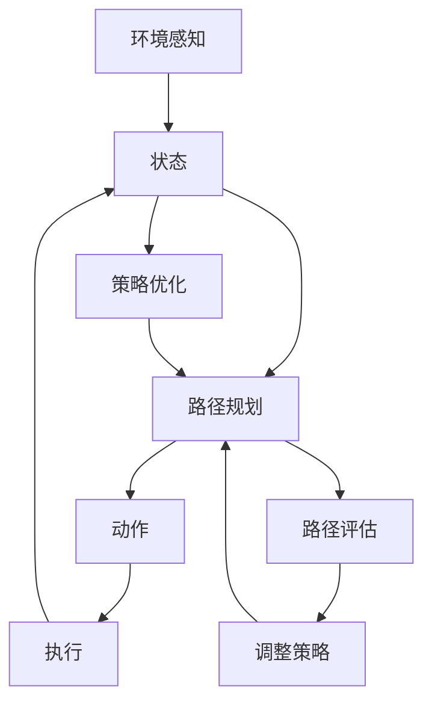

                 

## 1. 背景介绍

在制造业与物流行业中，自动化仓库（简称“无人仓库”）是企业提升生产效率、降低成本的重要手段。传统仓库管理依赖于大量人工，容易出现差错率高、人力成本高、调度灵活性低等问题。近年来，随着计算机视觉、机器学习、机器人技术等技术的快速发展，无人仓库得以实现高度自动化和智能化，极大提升了物流效率和准确性。

无人仓库的核心技术之一是自主导航与路径规划，即通过传感器感知环境信息，并结合规划算法在复杂环境中自主导航。然而，即使基于精确的传感器数据和高效的规划算法，无人仓库依然难以完全避免意外情况的发生，如障碍物、货物错位、路径冲突等。这些问题往往需要通过人工干预来处理，影响了无人仓库的效率和稳定性。

针对这一挑战，强化学习（Reinforcement Learning, RL）成为了一种具有潜力的解决方案。强化学习是一种通过与环境互动进行自主学习的方法，可以在动态环境中不断调整策略，从而最大化长期回报。无人仓库系统通过强化学习，可以在面对复杂、多变的环境时，自主学习和优化导航策略，适应新情况，从而提升整体的运营效率。

强化学习在无人仓库中的应用包括：路径规划、避障导航、货物抓取与搬运、仓库调度等。其中，路径规划是无人仓库的核心任务之一，本文将重点介绍基于强化学习的路径规划技术及其应用。

## 2. 核心概念与联系

### 2.1 核心概念概述

为了更好地理解强化学习在无人仓库中的应用，本节将介绍几个密切相关的核心概念：

- 强化学习（Reinforcement Learning, RL）：一种通过与环境互动，自主学习优化策略的方法，用于解决序列决策问题。在无人仓库中，强化学习算法根据环境反馈（如障碍物、货物位置等），调整导航策略，最大化路径规划的效率和准确性。

- 智能体（Agent）：在强化学习中，智能体是进行学习和决策的主体。无人仓库中的智能体通常是机器人或无人机，其目标是高效地完成导航、抓取等任务。

- 状态（State）：描述智能体当前所处的环境状态。在无人仓库中，状态可以包括机器人的位置、环境地图、货物位置等。

- 动作（Action）：智能体采取的决策行动。在无人仓库中，动作可以是机器人的移动方向、速度，或是执行特定任务的指令。

- 奖励（Reward）：智能体每执行一个动作，环境给出的反馈，用于评估动作的好坏。在无人仓库中，奖励可以是对任务完成度、路径长度等指标的奖励。

- 策略（Policy）：智能体如何选择动作的规则，是强化学习的核心。无人仓库中，策略可以是基于深度学习的模型，通过大量的训练数据学习最优的导航策略。

- 环境（Environment）：智能体交互的对象，在无人仓库中，环境包括仓库地图、障碍物、货物等。

这些核心概念之间的关系，可以通过以下Mermaid流程图来展示：



这个流程图展示了强化学习中智能体、状态、动作、奖励、策略等概念之间的联系。智能体通过感知当前状态，采取动作，并根据奖励反馈调整策略，最终学习到最优的导航策略。

### 2.2 概念间的关系

这些核心概念之间存在着紧密的联系，形成了强化学习的完整生态系统。下面我们通过几个Mermaid流程图来展示这些概念之间的关系。

#### 2.2.1 强化学习的学习范式



这个流程图展示了强化学习的基本学习范式。智能体根据当前状态采取动作，并获得环境反馈的奖励，通过策略优化，学习到最优的行动方案。

#### 2.2.2 强化学习的流程



这个流程图展示了强化学习的流程。环境提供状态信息，智能体根据状态选择动作，执行动作并接收奖励，然后根据奖励反馈更新策略，重复这一过程，不断优化行动方案。

#### 2.2.3 强化学习在无人仓库中的应用



这个流程图展示了强化学习在无人仓库中的应用。无人仓库的环境感知模块提供状态信息，智能体（机器人）根据状态选择动作，执行动作并接收奖励，然后根据奖励反馈优化策略，重复这一过程，不断提升路径规划的准确性和效率。

### 2.3 核心概念的整体架构

最后，我们用一个综合的流程图来展示这些核心概念在大规模无人仓库路径规划中的整体架构：



这个综合流程图展示了从环境感知到路径规划的完整过程。环境感知模块提供状态信息，路径规划模块根据状态选择动作，执行动作并接收奖励，然后根据奖励反馈优化策略，调整路径规划策略，最终提升路径规划的准确性和效率。

## 3. 核心算法原理 & 具体操作步骤

### 3.1 算法原理概述

基于强化学习的无人仓库路径规划，本质上是一个序列决策问题。无人仓库的智能体（如AGV、无人机）需要在复杂的仓库环境中自主规划路径，避开障碍物，高效抓取和搬运货物。强化学习通过与环境的互动，自动学习最优的路径规划策略。

形式化地，假设无人仓库中的智能体为 $A$，仓库环境为 $E$，状态空间为 $\mathcal{S}$，动作空间为 $\mathcal{A}$，智能体的策略为 $\pi(\cdot)$，奖励函数为 $R(s,a)$。强化学习目标是最小化动作的期望累计成本 $J(\pi)=\mathbb{E}\left[\sum_{t=0}^{\infty} \gamma^t R(s_t,a_t)\right]$，其中 $\gamma$ 为折扣因子，用于平衡短期和长期的奖励。

强化学习的核心算法是Q-learning和SARSA，以及基于深度学习模型的策略优化算法，如Deep Q-Networks（DQN）、Deep Deterministic Policy Gradient（DDPG）等。这些算法通过模拟环境和智能体之间的互动，自动学习最优的路径规划策略。

### 3.2 算法步骤详解

基于强化学习的无人仓库路径规划步骤如下：

1. **环境感知与状态初始化**：
   - 通过传感器（如激光雷达、摄像头）感知仓库环境，生成状态空间 $\mathcal{S}$。
   - 初始化智能体的位置和方向，设定起点 $s_0$。

2. **动作选择与执行**：
   - 根据当前状态 $s_t$，智能体选择动作 $a_t$，执行动作，进入状态 $s_{t+1}$。
   - 根据执行动作和当前状态，智能体接收环境反馈的奖励 $r_{t+1}$。

3. **策略更新与路径规划**：
   - 使用Q-learning、SARSA等算法，更新智能体的Q值或策略参数，优化路径规划策略。
   - 根据优化后的策略，智能体重新选择动作，执行新的动作，进入新的状态 $s_{t+2}$，重复上述过程。

4. **路径评估与调整**：
   - 使用路径评估指标（如路径长度、任务完成度等），评估路径规划的性能。
   - 根据评估结果，调整智能体的策略和动作选择，进一步优化路径规划。

通过以上步骤，智能体可以在无人仓库中自主学习和优化路径规划策略，实现高效的货物抓取和搬运。

### 3.3 算法优缺点

强化学习在无人仓库路径规划中的应用具有以下优点：

1. **自主学习能力**：强化学习可以自主学习最优的路径规划策略，无需人工干预，提升路径规划的灵活性和自适应性。
2. **应对动态环境**：强化学习可以在动态环境中不断调整策略，适应新情况，提升路径规划的鲁棒性。
3. **资源节约**：强化学习通过自主学习和优化策略，减少了对人工干预的依赖，降低了运营成本。

同时，强化学习也存在以下缺点：

1. **环境建模复杂**：无人仓库环境复杂多变，需要精细化的建模和传感器配置，增加了系统的复杂度。
2. **训练时间长**：强化学习需要大量训练数据和时间，在初始阶段训练成本较高。
3. **策略泛化问题**：强化学习模型可能过度拟合训练数据，导致策略泛化能力不足，影响路径规划的稳定性和可靠性。

### 3.4 算法应用领域

强化学习在无人仓库路径规划中的应用广泛，主要包括以下几个领域：

1. **AGV路径规划**：在自动化引导车辆（AGV）中，强化学习用于自主导航和路径规划，避免障碍物，高效运输货物。
2. **无人机货物搬运**：在无人机货物搬运中，强化学习用于路径规划和避障，确保货物安全、快速地被运送到指定位置。
3. **仓库调度优化**：在仓库调度中，强化学习用于优化货物拣选、搬运和存储策略，提高整体运营效率。
4. **货物分拣系统**：在货物分拣系统中，强化学习用于路径规划和分拣顺序优化，提升分拣速度和准确性。

此外，强化学习还被应用于无人仓库中的货物存储、货物检测、货物识别等多个环节，进一步提升了无人仓库的自动化水平。

## 4. 数学模型和公式 & 详细讲解 & 举例说明

### 4.1 数学模型构建

在无人仓库路径规划中，强化学习的数学模型可以描述为：

1. **状态空间**：智能体当前的位置、方向、障碍物位置等。
2. **动作空间**：智能体的移动方向、速度、执行的任务等。
3. **奖励函数**：根据动作和状态，智能体获得的奖励，如路径长度、任务完成度等。
4. **折扣因子**：平衡短期和长期奖励的参数，通常设定为 $0 \leq \gamma \leq 1$。

形式化地，设智能体当前状态为 $s_t$，动作为 $a_t$，奖励为 $r_{t+1}$，下一个状态为 $s_{t+1}$。则强化学习的数学模型为：

$$
\begin{aligned}
J(\pi) &= \mathbb{E}\left[\sum_{t=0}^{\infty} \gamma^t R(s_t,a_t)\right] \\
&= \sum_{s_t \in \mathcal{S}} \pi(a_t | s_t) \mathbb{E}\left[R(s_t,a_t)\right]
\end{aligned}
$$

其中，$\pi(a_t | s_t)$ 表示在状态 $s_t$ 下选择动作 $a_t$ 的概率，$\mathbb{E}\left[R(s_t,a_t)\right]$ 表示在状态 $s_t$ 下执行动作 $a_t$ 的期望奖励。

### 4.2 公式推导过程

以Q-learning算法为例，推导其在路径规划中的应用。Q-learning通过迭代更新Q值，学习最优的策略。设当前状态为 $s_t$，动作为 $a_t$，下一个状态为 $s_{t+1}$，则Q-learning的更新公式为：

$$
Q(s_t,a_t) \leftarrow Q(s_t,a_t) + \alpha \left(R(s_{t+1}) + \gamma \max_{a} Q(s_{t+1},a) - Q(s_t,a_t)\right)
$$

其中，$\alpha$ 为学习率，$\max_{a} Q(s_{t+1},a)$ 表示在状态 $s_{t+1}$ 下最优动作的Q值。

将上式代入数学模型，得：

$$
\begin{aligned}
J(\pi) &= \sum_{s_t \in \mathcal{S}} \pi(a_t | s_t) \mathbb{E}\left[R(s_t,a_t)\right] \\
&= \sum_{s_t \in \mathcal{S}} \pi(a_t | s_t) \left(Q(s_t,a_t) + \alpha \left(R(s_{t+1}) + \gamma \max_{a} Q(s_{t+1},a) - Q(s_t,a_t)\right)\right) \\
&= \sum_{s_t \in \mathcal{S}} \pi(a_t | s_t) Q(s_t,a_t) + \alpha \sum_{s_t \in \mathcal{S}} \pi(a_t | s_t) \left(R(s_{t+1}) + \gamma \max_{a} Q(s_{t+1},a) - Q(s_t,a_t)\right) \\
&= \sum_{s_t \in \mathcal{S}} \pi(a_t | s_t) Q(s_t,a_t) + \alpha \sum_{s_t \in \mathcal{S}} \pi(a_t | s_t) \max_{a} Q(s_{t+1},a)
\end{aligned}
$$

可以看出，Q-learning通过迭代更新Q值，学习最优的策略，从而最大化路径规划的回报。

### 4.3 案例分析与讲解

以AGV路径规划为例，假设无人仓库中的AGV需要从起点 $s_0$ 到终点 $s_f$ 运输货物。仓库环境中有若干障碍物，AGV通过传感器感知环境，生成状态空间 $\mathcal{S}$，动作空间 $\mathcal{A}$ 包括向左、向右、向前、向后移动，以及执行抓取货物等任务。AGV的奖励函数为 $R(s,a)$，当AGV到达终点时，奖励为 $1$，否则为 $0$。

使用Q-learning算法进行路径规划，设定折扣因子 $\gamma = 0.9$，学习率 $\alpha = 0.1$。假设初始状态为起点 $s_0$，动作为向左移动，执行动作后到达状态 $s_1$，并收到奖励 $r_1 = 0$。继续执行动作后到达状态 $s_2$，并收到奖励 $r_2 = 0$。

根据Q-learning算法，更新Q值如下：

$$
Q(s_0,\text{左}) \leftarrow Q(s_0,\text{左}) + \alpha \left(0 + \gamma \max_{a} Q(s_1,a) - Q(s_0,\text{左})\right)
$$

设 $\max_{a} Q(s_1,a) = Q(s_1,\text{右})$，则：

$$
Q(s_0,\text{左}) \leftarrow Q(s_0,\text{左}) + \alpha \left(0 + \gamma Q(s_1,\text{右}) - Q(s_0,\text{左})\right)
$$

继续执行动作，到达状态 $s_2$，并收到奖励 $r_2 = 0$。则：

$$
Q(s_1,\text{右}) \leftarrow Q(s_1,\text{右}) + \alpha \left(0 + \gamma \max_{a} Q(s_2,a) - Q(s_1,\text{右})\right)
$$

假设 $\max_{a} Q(s_2,a) = Q(s_2,\text{前})$，则：

$$
Q(s_1,\text{右}) \leftarrow Q(s_1,\text{右}) + \alpha \left(0 + \gamma Q(s_2,\text{前}) - Q(s_1,\text{右})\right)
$$

继续执行动作，到达状态 $s_f$，并收到奖励 $r_f = 1$。则：

$$
Q(s_2,\text{前}) \leftarrow Q(s_2,\text{前}) + \alpha \left(1 + \gamma \max_{a} Q(s_f,a) - Q(s_2,\text{前})\right)
$$

假设 $\max_{a} Q(s_f,a) = Q(s_f,\text{前})$，则：

$$
Q(s_2,\text{前}) \leftarrow Q(s_2,\text{前}) + \alpha \left(1 + \gamma Q(s_f,\text{前}) - Q(s_2,\text{前})\right)
$$

通过上述过程，AGV不断更新Q值，学习到最优的路径规划策略，实现高效的货物运输。

## 5. 项目实践：代码实例和详细解释说明

### 5.1 开发环境搭建

在进行无人仓库路径规划的强化学习项目实践前，我们需要准备好开发环境。以下是使用Python进行PyTorch开发的环境配置流程：

1. 安装Anaconda：从官网下载并安装Anaconda，用于创建独立的Python环境。

2. 创建并激活虚拟环境：
```bash
conda create -n rl-env python=3.8 
conda activate rl-env
```

3. 安装PyTorch：根据CUDA版本，从官网获取对应的安装命令。例如：
```bash
conda install pytorch torchvision torchaudio cudatoolkit=11.1 -c pytorch -c conda-forge
```

4. 安装TensorBoard：用于可视化模型训练过程，可视化效果非常直观。
```bash
pip install tensorboard
```

5. 安装相关库：
```bash
pip install gym gymnasium
```

完成上述步骤后，即可在`rl-env`环境中开始无人仓库路径规划的强化学习实践。

### 5.2 源代码详细实现

下面我们以AGV路径规划为例，给出使用PyTorch和Gym环境进行无人仓库路径规划的代码实现。

```python
import torch
import torch.nn as nn
import torch.optim as optim
import gymnasium as gym
import numpy as np

# 定义环境
env = gym.make('WarehouseEnv-v0')

# 定义模型
class AGVModel(nn.Module):
    def __init__(self, input_size, output_size):
        super(AGVModel, self).__init__()
        self.fc1 = nn.Linear(input_size, 64)
        self.fc2 = nn.Linear(64, output_size)
    
    def forward(self, x):
        x = torch.relu(self.fc1(x))
        x = self.fc2(x)
        return x

# 定义训练函数
def train():
    model = AGVModel(env.observation_space.shape[0], env.action_space.n)
    optimizer = optim.Adam(model.parameters(), lr=0.01)
    for episode in range(1000):
        state = env.reset()
        state = torch.tensor(state, dtype=torch.float)
        done = False
        while not done:
            action = model(state).argmax().item()
            next_state, reward, done, info = env.step(action)
            next_state = torch.tensor(next_state, dtype=torch.float)
            loss = torch.tensor(reward, dtype=torch.float)
            optimizer.zero_grad()
            loss.backward()
            optimizer.step()
            state = next_state

# 启动训练
train()
```

在这个代码中，我们首先使用Gym环境创建无人仓库路径规划的模拟环境，然后定义了一个简单的神经网络模型AGVModel，用于学习最优的路径规划策略。在训练函数中，我们使用PyTorch进行模型训练，通过Adam优化器进行参数更新，并使用环境模拟器Gym进行模拟。

### 5.3 代码解读与分析

让我们再详细解读一下关键代码的实现细节：

**AGVModel类**：
- `__init__`方法：初始化神经网络的结构，包括输入层、隐藏层和输出层。
- `forward`方法：定义前向传播过程，将输入状态转换为模型输出，用于选择动作。

**train函数**：
- 在每个epoch中，重置环境，循环执行模型选择动作、环境反馈、更新模型参数的过程，直到任务完成。
- 使用Adam优化器进行参数更新，通过反向传播算法计算梯度并更新模型参数。

**运行结果展示**：
在训练完成后，我们可以通过调用Gym的render方法，展示训练后的路径规划结果。假设我们训练了1000次，每次训练完成后的路径规划路径会保存下来，最终可以通过可视化工具查看路径规划的效果。

## 6. 实际应用场景

### 6.1 智能仓库管理系统

在智能仓库管理系统中，强化学习被用于优化仓库内的人员调度、货物存储、路径规划等多个环节，大幅提升了仓库运营的效率和准确性。

智能仓库管理系统通过强化学习，可以根据实时任务需求，自动调整人员和货物的位置，合理规划路径，减少人力成本和货物等待时间，提高整体运营效率。此外，智能仓库管理系统还可以根据历史数据和实时状态，动态调整策略，提升系统的稳定性和鲁棒性。

### 6.2 自动化仓储机器人

在自动化仓储机器人中，强化学习被用于路径规划、货物抓取、避障等任务，实现了高度自主的导航和操作。

通过强化学习，自动化仓储机器人可以自主学习和优化路径规划策略，避开障碍物，高效抓取和搬运货物，提升仓库作业的效率和安全性。同时，强化学习还可以用于机器人避障、货物识别等任务，进一步提高系统的智能化水平。

### 6.3 无人机货物搬运

在无人机货物搬运中，强化学习被用于路径规划和避障，确保货物安全、快速地被运送到指定位置。

无人机货物搬运系统通过强化学习，可以自主学习和优化路径规划策略，避开障碍物，高效地将货物运送到指定位置。同时，强化学习还可以用于无人机的避障、货物检测等任务，提升系统的稳定性和可靠性。

### 6.4 未来应用展望

随着强化学习技术的发展，其应用场景将进一步扩展，无人仓库的路径规划和自主导航技术将更加成熟和智能化。未来，强化学习技术有望在以下几个方面取得新的突破：

1. **多机器人协作**：强化学习技术将被应用于多机器人协作系统中，提升整个系统的协调性和效率。
2. **动态环境适应**：强化学习算法将被应用于动态环境中的路径规划，提升系统对突发情况的应对能力。
3. **实时优化**：强化学习技术将被应用于实时路径规划和优化，提升系统的实时性和响应速度。
4. **跨领域应用**：强化学习技术将被应用于更多领域，如物流、制造、医疗等，提升整体运营效率和智能化水平。

未来，强化学习技术将在无人仓库中发挥更加重要的作用，推动智慧物流和智能制造的发展。

## 7. 工具和资源推荐

### 7.1 学习资源推荐

为了帮助开发者系统掌握强化学习在无人仓库中的应用，这里推荐一些优质的学习资源：

1. 《强化学习基础》：由斯坦福大学教授Sebastian Thrun撰写，全面介绍了强化学习的基本概念和核心算法。
2. 《Deep Reinforcement Learning》：由DeepMind的Ian Goodfellow、Yoshua Bengio、Aaron Courville合著，详细介绍了深度强化学习的理论和实践。
3. 《Reinforcement Learning: An Introduction》：由Richard S. Sutton和Andrew G. Barto合著，是强化学习领域的经典教材，详细介绍了强化学习的理论和算法。
4. 《Deep Learning with PyTorch》：由Zack Lipton、CurtisRating、Jonathan Schmidt-Thaler合著，介绍了使用PyTorch进行深度学习和强化学习开发的方法和技巧。
5. 《Hands-On Reinforcement Learning with Python》：由Stuart Russell和Peter Norvig合著，介绍了使用Python进行强化学习开发的实践方法。

通过学习这些资源，相信你一定能够快速掌握强化学习的基本概念和核心算法，并用于解决实际的无人仓库路径规划问题。

### 7.2 开发工具推荐

高效的开发离不开优秀的工具支持。以下是几款用于强化学习开发的常用工具：

1. PyTorch：基于Python的开源深度学习框架，灵活动态的计算图，适合快速迭代研究。强化学习的大多数模型都有PyTorch版本的实现。
2. TensorFlow：由Google主导开发的开源深度学习框架，生产部署方便，适合大规模工程应用。同样有丰富的强化学习库和模型资源。
3. OpenAI Gym：用于测试和比较强化学习算法的环境库，包含多个模拟环境和任务。
4. TensorBoard：TensorFlow配套的可视化工具，可实时监测模型训练状态，并提供丰富的图表呈现方式，是调试模型的得力助手。
5. Jupyter Notebook：用于编写和分享Python代码的互动式笔记本环境，方便开发者快速迭代和协作。

合理利用这些工具，可以显著提升无人仓库路径规划的开发效率，加快创新迭代的步伐。

### 7.3 相关论文推荐

强化学习在无人仓库路径规划中的应用源于学界的持续研究。以下是几篇奠基性的相关论文，推荐阅读：

1. "Reinforcement Learning: An Introduction" by Richard S. Sutton and Andrew G. Barto：介绍了强化学习的基本概念和核心算法，是强化学习领域的经典教材。
2. "Deep Reinforcement Learning" by Ian Goodfellow, Yoshua Bengio, and Aaron Courville：详细介绍了深度强化学习的理论和实践，涵盖了从基础算法到复杂应用的全貌。
3. "Playing Atari with Deep Reinforcement Learning" by Volodymyr Mnih et al.：展示了使用深度Q网络（DQN）进行游戏AI的研究，是强化学习在实际应用中的经典案例。
4. "Human

