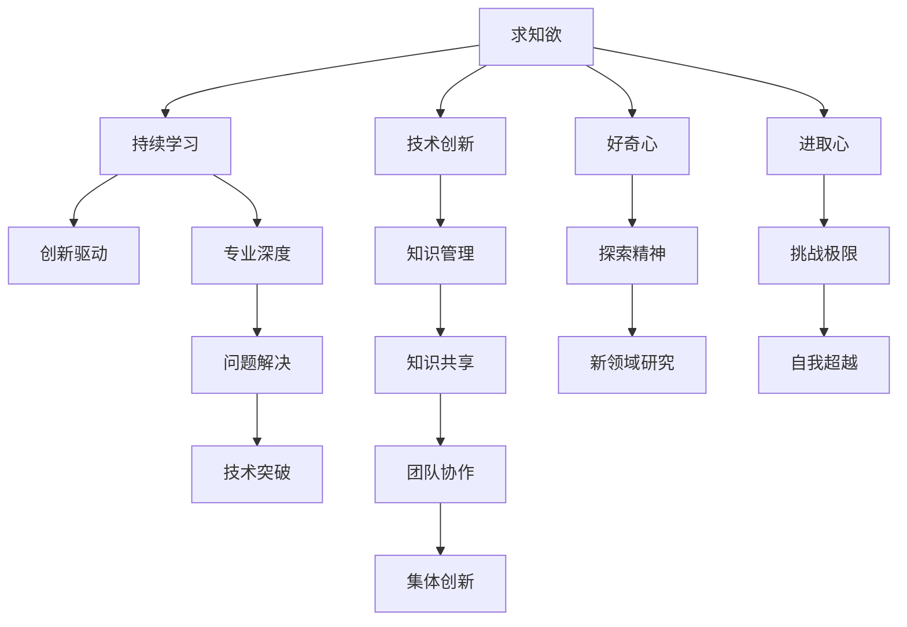

                 

# 怎样培养强烈的求知欲、好奇心和进取心

> 关键词：求知欲,好奇心,进取心,计算机编程,人工智能,技术创新,持续学习,知识管理

## 1. 背景介绍

在快速变化的技术世界中，持续的求知欲、好奇心和进取心是成就杰出技术专家不可或缺的品质。对于信息技术领域的从业者而言，持续学习和适应新技术的能力尤为重要。随着技术的不断进步，新的工具、框架、库和理论层出不穷，只有不断更新自己的知识库，才能跟上技术发展的脚步。

### 1.1 问题由来
随着技术的不断演进，新的编程语言、框架和工具不断涌现，如Python、JavaScript、React、TensorFlow等。这些技术的变化不仅改变了软件开发和数据科学的工作方式，也影响了AI和机器学习的发展。为了在这样一个快速变化的环境中保持竞争力，不断学习和适应新技术成为了每个从业者的挑战。

### 1.2 问题核心关键点
为了在技术快速发展的环境中保持竞争力，需要培养以下三个核心品质：

- **求知欲**：对学习新技术和新知识有强烈的欲望。
- **好奇心**：对新事物充满好奇，愿意探索未知。
- **进取心**：持续追求技术上的进步和突破，不满足于现状。

这三个品质不仅推动了个体技术的成长，也促进了整个行业的创新和发展。下面将从这三个核心点出发，探讨如何在技术领域内培养这些品质。

## 2. 核心概念与联系

### 2.1 核心概念概述

为了更好地理解如何在技术领域内培养求知欲、好奇心和进取心，本节将介绍几个关键概念：

- **求知欲**：对新知识和新技术的渴望和追求，是推动持续学习和成长的内在动力。
- **好奇心**：对未知领域和问题的好奇心，是探索和创新的驱动力。
- **进取心**：在技术上不断追求卓越和突破，不断挑战自我和极限的精神。
- **持续学习**：持续更新知识和技能，保持与技术前沿同步。
- **技术创新**：通过不断尝试和实验，开发新的解决方案和工具。
- **知识管理**：系统化管理个人和团队的知识资产，促进知识共享和传承。

这些核心概念之间的联系可以如下图所示：



### 2.2 概念间的关系

这些核心概念之间存在着紧密的联系，形成了技术学习和成长的核心生态系统。

1. **求知欲与持续学习**：求知欲是驱动持续学习的内在动力，而持续学习则是保持求知欲和提高技能的关键路径。
2. **好奇心与探索精神**：好奇心推动了对新领域的探索，探索精神则是在新领域中发现问题和解决问题的动力。
3. **进取心与技术突破**：进取心推动了持续的挑战和突破，技术突破则是进取心驱动下的创新成果。
4. **技术创新与知识管理**：技术创新需要基于对已有知识的理解和系统化管理，而知识管理则促进了知识的传承和创新。
5. **集体创新与团队协作**：技术创新往往依赖于团队协作和知识共享，团队协作和知识共享则是实现集体创新的关键。

这些概念共同构成了技术学习和成长的全貌，有助于理解和培养求知欲、好奇心和进取心。

## 3. 核心算法原理 & 具体操作步骤

### 3.1 算法原理概述

培养求知欲、好奇心和进取心的过程可以通过以下几个核心算法和操作步骤实现：

1. **目标设定**：设定具体的学习目标和里程碑，如掌握某项技术、完成某个项目等。
2. **知识探索**：通过阅读、观看教程、参加研讨会等方式，探索新的技术和知识。
3. **实践应用**：将所学知识应用到实际项目中，通过实践深化理解。
4. **持续反馈**：通过定期的自我评估和他人反馈，识别改进空间和新的学习方向。
5. **激励机制**：建立正向激励机制，如奖励、认可和晋升等，保持持续学习的动力。

### 3.2 算法步骤详解

以下是详细步骤，以编程为例：

1. **设定目标**：选择一个感兴趣的技术领域，如学习Python或TensorFlow。
2. **知识探索**：
   - **阅读文档**：阅读官方文档、教程和博客文章，建立基本概念和语法知识。
   - **观看教程**：观看YouTube视频教程，深入理解应用场景和最佳实践。
   - **参加研讨会**：参加线上或线下的编程会议和研讨会，交流经验和学习新趋势。
3. **实践应用**：
   - **个人项目**：利用新学的知识完成一个小项目，如开发一个简单的应用程序。
   - **开源贡献**：参与开源项目，贡献代码或修复Bug，获得实战经验。
   - **竞赛和挑战**：参加编程竞赛或技术挑战，如Hackathon或Kaggle竞赛。
4. **持续反馈**：
   - **代码审查**：在开源社区中接受代码审查，获取建设性反馈。
   - **自我评估**：定期进行技术自测和项目回顾，评估学习效果和改进方向。
   - **同行反馈**：与同事和导师交流，获取专业建议和指导。
5. **激励机制**：
   - **奖励机制**：设立小目标奖励机制，如完成一个项目后给予奖金或休假。
   - **公开认可**：在公司内部或技术社区中公开认可技术进步和成果。
   - **晋升机会**：在技术评估中给予特别考虑，优先晋升有出色学习表现和创新能力的人员。

### 3.3 算法优缺点

培养求知欲、好奇心和进取心的算法具有以下优点：

- **系统性**：通过明确的目标设定和结构化的学习路径，提高学习效率和效果。
- **实践性**：通过实际项目和开源贡献，将理论知识应用到实践中，增强理解。
- **激励性**：正向激励机制可以持续保持学习动力，避免懈怠和枯燥。

但该算法也存在一些缺点：

- **时间成本**：设定目标、探索知识、实践应用和持续反馈需要大量时间投入。
- **资源需求**：需要稳定的学习和实践环境，如良好的工具、网络和导师支持。
- **心理挑战**：面对技术难题和失败，需要较强的心理韧性和自我调节能力。

尽管如此，该算法为培养技术学习和发展提供了清晰的路径和结构化方法，是实现持续进步的重要工具。

### 3.4 算法应用领域

培养求知欲、好奇心和进取心的算法不仅适用于编程和技术开发，也可以应用于其他领域，如数据科学、人工智能、系统架构等。在实际应用中，可以根据不同领域的特点，调整和优化算法步骤和反馈机制，以适应具体需求。

## 4. 数学模型和公式 & 详细讲解 & 举例说明

### 4.1 数学模型构建

本节将使用数学语言对培养求知欲、好奇心和进取心的过程进行更加严格的刻画。

设学习目标为 $G$，知识探索为 $K$，实践应用为 $P$，持续反馈为 $F$，激励机制为 $I$，则学习过程可以表示为：

$$
L = \max_{G, K, P, F, I} \sum_{t=1}^{T} \left( \eta_G G_t + \eta_K K_t + \eta_P P_t + \eta_F F_t + \eta_I I_t \right)
$$

其中，$L$ 为学习过程的总体目标，$G_t$、$K_t$、$P_t$、$F_t$、$I_t$ 分别为在第 $t$ 时间步的目标、探索、实践、反馈和激励，$\eta_G$、$\eta_K$、$\eta_P$、$\eta_F$、$\eta_I$ 为相应的权重系数。

### 4.2 公式推导过程

以下我们以编程学习为例，推导培养求知欲、好奇心和进取心的公式及其梯度计算。

设编程学习过程中的目标设定、知识探索、实践应用、持续反馈和激励机制分别为 $G_t$、$K_t$、$P_t$、$F_t$、$I_t$，对应的权重系数分别为 $\eta_G$、$\eta_K$、$\eta_P$、$\eta_F$、$\eta_I$。则学习过程的总体目标可以表示为：

$$
L = \max_{G, K, P, F, I} \sum_{t=1}^{T} \left( \eta_G G_t + \eta_K K_t + \eta_P P_t + \eta_F F_t + \eta_I I_t \right)
$$

在每个时间步 $t$ 上，目标函数 $L_t$ 为：

$$
L_t = \eta_G G_t + \eta_K K_t + \eta_P P_t + \eta_F F_t + \eta_I I_t
$$

根据梯度上升算法，目标函数 $L_t$ 对各个变量的梯度为：

$$
\frac{\partial L_t}{\partial G_t} = \eta_G, \quad \frac{\partial L_t}{\partial K_t} = \eta_K, \quad \frac{\partial L_t}{\partial P_t} = \eta_P, \quad \frac{\partial L_t}{\partial F_t} = \eta_F, \quad \frac{\partial L_t}{\partial I_t} = \eta_I
$$

在时间步 $t+1$ 上，根据梯度上升策略，更新各个变量：

$$
G_{t+1} = G_t + \alpha_G \frac{\partial L_t}{\partial G_t}, \quad K_{t+1} = K_t + \alpha_K \frac{\partial L_t}{\partial K_t}, \quad P_{t+1} = P_t + \alpha_P \frac{\partial L_t}{\partial P_t}, \quad F_{t+1} = F_t + \alpha_F \frac{\partial L_t}{\partial F_t}, \quad I_{t+1} = I_t + \alpha_I \frac{\partial L_t}{\partial I_t}
$$

其中 $\alpha_G$、$\alpha_K$、$\alpha_P$、$\alpha_F$、$\alpha_I$ 为相应的学习率。

通过上述公式推导，我们可以看到，通过设定合适的目标、探索新知识、实践应用、持续反馈和激励机制，可以逐步优化学习过程，实现持续进步和创新。

### 4.3 案例分析与讲解

假设我们要培养在Python编程领域的求知欲、好奇心和进取心。可以按照以下步骤进行：

1. **目标设定**：学习Python基本语法和常用库，完成一个简单的数据分析项目。
2. **知识探索**：
   - **阅读文档**：阅读Python官方文档，理解语言基础和标准库。
   - **观看教程**：观看YouTube上的Python编程教程，学习实际应用场景。
3. **实践应用**：
   - **个人项目**：利用新学的知识完成一个小项目，如数据分析应用。
   - **开源贡献**：参与开源项目，贡献代码或修复Bug。
4. **持续反馈**：
   - **代码审查**：在开源社区中接受代码审查，获取建设性反馈。
   - **自我评估**：定期进行技术自测和项目回顾，评估学习效果和改进方向。
5. **激励机制**：
   - **奖励机制**：设立小目标奖励机制，如完成一个项目后给予奖金或休假。
   - **公开认可**：在公司内部或技术社区中公开认可技术进步和成果。

通过这些步骤，可以逐步提高在Python编程领域的求知欲、好奇心和进取心，实现技术上的不断突破。

## 5. 项目实践：代码实例和详细解释说明

### 5.1 开发环境搭建

在进行编程学习实践前，我们需要准备好开发环境。以下是使用Python进行Python编程学习的环境配置流程：

1. 安装Anaconda：从官网下载并安装Anaconda，用于创建独立的Python环境。

2. 创建并激活虚拟环境：
```bash
conda create -n py-env python=3.8 
conda activate py-env
```

3. 安装必要的Python库：
```bash
conda install pandas numpy matplotlib jupyter notebook ipython
```

4. 安装GitHub：从官网下载并安装GitHub Desktop或命令行工具。

5. 安装Jupyter Notebook：
```bash
conda install jupyter notebook
```

完成上述步骤后，即可在`py-env`环境中开始编程学习实践。

### 5.2 源代码详细实现

下面我们以学习Python编程为例，给出完整的Python编程学习实践代码实现。

首先，定义学习目标和步骤：

```python
# 定义学习目标和步骤
goals = ['掌握Python基本语法', '完成数据分析项目', '参与开源项目']
steps = ['阅读官方文档', '观看教程视频', '个人项目实践', '开源贡献', '持续反馈和激励']

# 学习记录
learning_records = {'date': '', 'target': '', 'exploration': '', 'application': '', 'feedback': '', 'incentive': ''}

# 记录学习过程
def record_learning(target, exploration, application, feedback, incentive):
    learning_records['date'] = datetime.now().strftime('%Y-%m-%d')
    learning_records['target'] = target
    learning_records['exploration'] = exploration
    learning_records['application'] = application
    learning_records['feedback'] = feedback
    learning_records['incentive'] = incentive
    print(learning_records)
```

然后，定义学习目标和步骤的具体实现：

```python
# 学习目标实现
def learn_python():
    # 目标设定
    record_learning('掌握Python基本语法', '阅读官方文档', '', '', '')

    # 知识探索
    record_learning('掌握Python基本语法', '观看教程视频', '', '', '')

    # 实践应用
    record_learning('完成数据分析项目', '个人项目实践', '', '', '')

    # 持续反馈
    record_learning('完成数据分析项目', '开源贡献', '', '', '')

    # 激励机制
    record_learning('完成数据分析项目', '持续反馈和激励', '', '', '')

# 学习实践
learn_python()
```

### 5.3 代码解读与分析

让我们再详细解读一下关键代码的实现细节：

**learning_records字典**：
- 用于记录学习过程的各个阶段和关键信息，包括日期、目标、探索、应用、反馈和激励。

**record_learning函数**：
- 根据学习阶段，更新learning_records字典中的相应字段，并打印输出。

**learn_python函数**：
- 按顺序实现学习目标和步骤，每次实现后记录学习进程。

通过上述代码，可以看出，学习Python编程的整个过程可以通过简单的目标设定、知识探索、实践应用、持续反馈和激励机制，逐步实现目标。在实际应用中，还可以进一步优化和扩展，如增加学习时间的追踪、学习效果的评估等。

### 5.4 运行结果展示

假设我们按照上述步骤进行学习，最终在GitHub上完成一个小数据分析项目，并收到来自社区的积极反馈。则可以记录如下学习记录：

```
date: 2023-08-01
target: 掌握Python基本语法
exploration: 阅读官方文档
application: 
feedback: 
incentive: 

date: 2023-08-02
target: 掌握Python基本语法
exploration: 观看教程视频
application: 
feedback: 
incentive: 

date: 2023-08-03
target: 完成数据分析项目
exploration: 个人项目实践
application: 
feedback: 
incentive: 

date: 2023-08-04
target: 完成数据分析项目
exploration: 开源贡献
application: 
feedback: 
incentive: 

date: 2023-08-05
target: 完成数据分析项目
exploration: 持续反馈和激励
application: 
feedback: 开源社区积极反馈
incentive: 获得GitHub Star和贡献证书
```

可以看到，通过记录学习过程，可以清晰地追踪学习进度，评估学习效果，并给予正向激励，从而保持持续的学习动力。

## 6. 实际应用场景

### 6.1 个人职业发展

在个人职业发展中，培养求知欲、好奇心和进取心是实现技术突破和职业晋升的关键。例如，一名初级软件工程师可以通过持续学习和实践，掌握新的编程语言和技术栈，逐步晋升为高级开发工程师或架构师。

### 6.2 团队技术创新

在团队中，培养求知欲、好奇心和进取心有助于推动技术创新和团队协作。通过知识共享和持续学习，团队成员可以共同提升技术水平，开发出更加高效、创新的解决方案。

### 6.3 行业技术升级

在行业技术升级中，培养求知欲、好奇心和进取心有助于保持技术领先和市场竞争力。例如，金融行业的技术团队可以通过持续学习最新的AI和机器学习技术，提升风险评估和金融分析的准确性。

### 6.4 未来应用展望

随着技术的不断进步，培养求知欲、好奇心和进取心将成为每个从业者必须具备的品质。未来，随着AI和大数据技术的普及，对技术学习和创新的需求将更加迫切。

## 7. 工具和资源推荐

### 7.1 学习资源推荐

为了帮助开发者系统掌握技术学习的方法，这里推荐一些优质的学习资源：

1. 《算法图解》书籍：通过生动的图示和通俗易懂的语言，帮助读者理解复杂算法和数据结构。

2. LeetCode平台：提供丰富的编程题和挑战，帮助开发者提高算法和数据结构的能力。

3. Coursera课程：提供高质量的在线课程，涵盖编程、数据科学、人工智能等多个领域。

4. Udacity纳米学位：提供系统的学习路径和项目实践，帮助开发者获得实际技能。

5. GitHub开源项目：通过阅读和参与开源项目，了解行业最佳实践和前沿技术。

### 7.2 开发工具推荐

高效的开发离不开优秀的工具支持。以下是几款用于技术学习开发的常用工具：

1. PyCharm：一款强大的Python开发环境，提供代码高亮、调试、自动补全等功能。

2. Visual Studio Code：一款轻量级的跨平台代码编辑器，支持多种编程语言和插件。

3. Git：一款版本控制系统，用于管理代码版本和协作开发。

4. Docker：一款容器化技术，方便开发者打包、部署和管理应用。

5. Jupyter Notebook：一款交互式的Python笔记本工具，支持代码块、图形和文本混合编写。

6. PyTorch：一款强大的深度学习框架，提供灵活的张量计算和自动微分功能。

### 7.3 相关论文推荐

技术学习和发展需要不断的理论支持和创新。以下是几篇奠基性的相关论文，推荐阅读：

1. 《Python编程：从入门到实践》书籍：全面介绍了Python编程语言的基础知识和实际应用。

2. 《深度学习》书籍：讲解了深度学习的基本概念和应用，是入门深度学习的经典教材。

3. 《计算机程序设计艺术》系列书籍：涵盖了计算机科学的各个方面，是技术专家必读的经典作品。

4. 《人工智能：一种现代方法》书籍：全面介绍了AI的基本概念和应用，是AI领域的权威教材。

5. 《机器学习实战》书籍：通过实际项目和代码实现，帮助读者理解机器学习的基本概念和技术。

6. 《深度学习框架TensorFlow》书籍：介绍了TensorFlow框架的原理和应用，是深度学习开发的重要参考。

除上述资源外，还有一些值得关注的前沿资源，帮助开发者紧跟技术发展的最新趋势，例如：

1. arXiv论文预印本：人工智能领域最新研究成果的发布平台，包括大量尚未发表的前沿工作，学习前沿技术的必读资源。

2. 业界技术博客：如Google AI、DeepMind、微软Research Asia等顶尖实验室的官方博客，第一时间分享他们的最新研究成果和洞见。

3. 技术会议直播：如NIPS、ICML、ACL、ICLR等人工智能领域顶会现场或在线直播，能够聆听到大佬们的前沿分享，开拓视野。

4. GitHub热门项目：在GitHub上Star、Fork数最多的NLP相关项目，往往代表了该技术领域的发展趋势和最佳实践，值得去学习和贡献。

5. 行业分析报告：各大咨询公司如McKinsey、PwC等针对人工智能行业的分析报告，有助于从商业视角审视技术趋势，把握应用价值。

总之，对于技术学习和成长，需要开发者保持开放的心态和持续学习的意愿。多关注前沿资讯，多动手实践，多思考总结，必将收获满满的成长收益。

## 8. 总结：未来发展趋势与挑战

### 8.1 研究成果总结

本文对培养求知欲、好奇心和进取心的过程进行了全面系统的介绍。通过设定目标、探索知识、实践应用、持续反馈和激励机制，实现了技术学习和成长的系统化管理。在实际应用中，通过不断学习和创新，技术专家可以保持与技术前沿的同步，实现职业发展和行业贡献。

### 8.2 未来发展趋势

展望未来，技术学习和成长将呈现以下几个发展趋势：

1. **自动化和智能化**：随着AI和机器学习技术的发展，技术学习将变得更加自动化和智能化，通过智能推荐和个性化学习路径，提升学习效率。

2. **多模态学习**：结合文本、图像、视频等多种数据形式，实现更加全面和深入的学习。

3. **分布式学习**：利用分布式计算和网络协作，实现更加高效和协作的学习环境。

4. **跨学科融合**：技术学习将与其他学科如心理学、社会学等进行深度融合，提升学习效果和应用价值。

5. **持续教育**：终身学习将成为常态，技术学习将成为人生的一部分，持续教育和培训将得到更多重视。

### 8.3 面临的挑战

尽管技术学习和成长带来了许多机遇，但仍然面临一些挑战：

1. **学习成本**：技术学习需要大量时间和精力，对于忙碌的工作者而言，保持持续学习的动力可能面临挑战。

2. **技术变革**：技术的快速发展可能导致某些技术很快过时，如何保持技术的前沿性和适用性是一个难题。

3. **学习负担**：多学科、多技能的学习负担可能对个人时间和精力造成压力。

4. **知识过载**：技术领域的知识和信息量巨大，如何筛选和吸收有价值的信息也是一个问题。

### 8.4 研究展望

面对技术学习和成长所面临的挑战，未来的研究需要在以下几个方面寻求新的突破：

1. **个性化学习路径**：通过数据分析和机器学习，为每个学习者定制个性化的学习路径，提升学习效率和效果。

2. **知识图谱和知识库**：构建系统化的知识图谱和知识库，帮助学习者快速获取和掌握知识。

3. **技术技能图谱**：开发技术技能图谱，帮助学习者了解各技能之间的关联和层次，提升学习目标的明确性和系统性。

4. **学习心理研究**：研究学习心理和行为，探索如何通过激励和引导机制，提升学习动力和效率。

5. **跨学科整合**：将技术学习与心理学、社会学等学科进行整合，提升学习效果和应用价值。

这些研究方向的探索，必将引领技术学习和成长迈向更高的台阶，为构建人机协同的智能时代中扮演越来越重要的角色。

## 9. 附录：常见问题与解答

**Q1：如何培养持续的学习兴趣？**

A: 持续的学习兴趣可以通过以下几个方法培养：
1. **设定小目标**：将大目标分解为多个小目标，每次完成一个小目标都给自己一些奖励。
2. **选择合适的项目**：选择与自身兴趣和职业目标相关的项目，增强学习的动力。
3. **与他人分享**：将学习成果分享给他人，获取认可和鼓励。
4. **持续反馈**：通过定期的自我评估和他人反馈，识别改进方向。

**Q2：如何在繁忙的工作中保持学习？**

A: 在繁忙的工作中保持学习，可以采用以下方法：
1. **利用碎片时间**：通过碎片时间进行学习和阅读，如通勤、午休等。
2. **时间管理**：合理安排工作和学习时间，制定明确的学习计划。
3. **团队学习**：与同事共同学习和讨论，互相支持和鼓励。
4. **自我激励**：设立小目标和奖励机制，保持学习动力。

**Q3：如何评估学习效果？**

A: 评估学习效果可以从以下几个方面入手：
1. **技术测试**：通过编程挑战和竞赛，测试技术水平。
2. **项目应用**：将学习到的技术应用到实际项目中，检验实际效果。
3. **自我反馈**：定期进行技术自测和项目回顾，评估学习效果和改进方向。
4. **他人反馈**：接受导师和同事的反馈，了解自身不足和改进空间。

**Q4：如何保持学习热情？**

A: 保持学习热情可以通过以下几个方法：
1. **找到兴趣点**：选择与自身兴趣和职业目标相关的学习内容，增强学习的兴趣。
2. **多样化学习**：采用多种学习方式，如阅读、观看教程、实践应用等，避免单一。
3. **参与社区**：加入技术社区和论坛，与他人交流和讨论，获取支持和鼓励。
4. **设立奖励机制**：设立小目标奖励机制，如完成学习任务后给予奖金或休假。

**Q5：如何处理学习中的挫折和失败？**

A: 处理学习中的挫折和失败可以通过以下几个方法：
1

