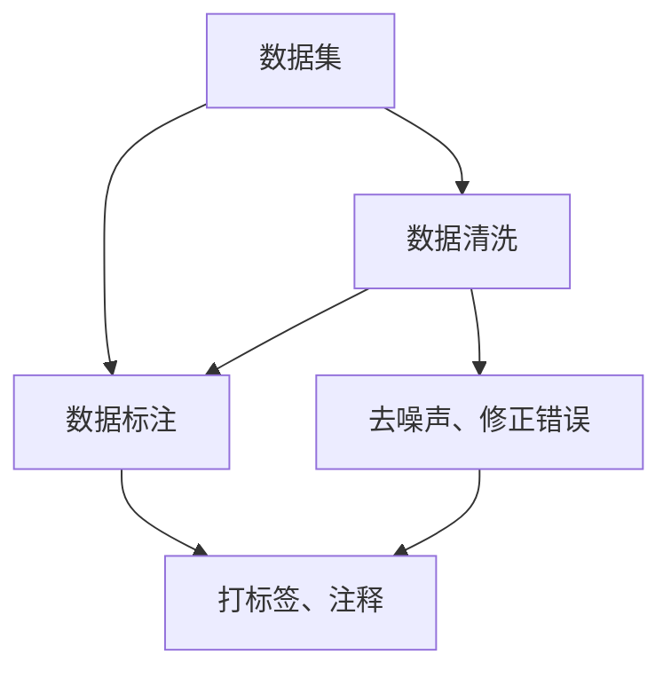
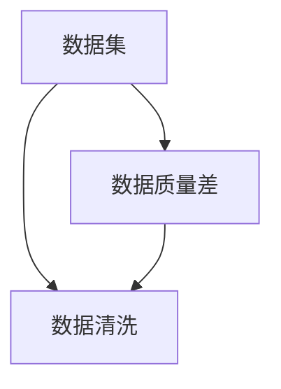
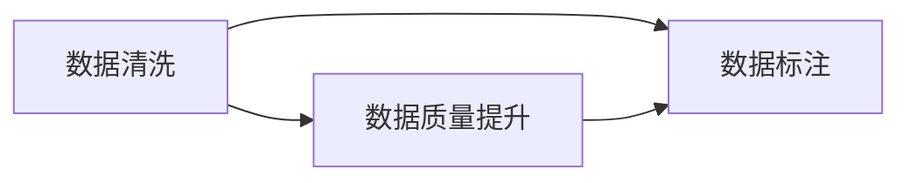
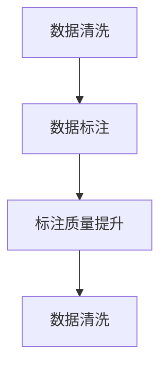

                 

# 数据集积累、清洗和标注：软件2.0工程师的日常

在当今的软件2.0时代，数据集积累、清洗和标注已成为工程师日常工作的重要组成部分。本文将深入探讨这一领域的核心概念、原理及应用，并结合具体实践案例，为您提供系统化的技术指引。

## 1. 背景介绍

### 1.1 问题由来
随着人工智能技术的发展，数据集积累、清洗和标注的重要性日益凸显。无论是用于机器学习模型的训练、优化还是实际应用，高质量的数据集都是不可或缺的资源。在深度学习领域，数据集的质量直接影响模型的性能和应用效果。

### 1.2 问题核心关键点
1. **数据集质量**：数据集的准确性、完备性和代表性直接决定了模型的泛化能力和实际应用效果。
2. **数据集规模**：数据集的大小在一定程度上决定了模型的复杂度和泛化能力。
3. **数据集格式**：不同格式的数据集可能需要不同的处理方式，确保数据格式的统一性对模型训练和推理至关重要。
4. **数据标注标准**：标注标准的一致性和规范性直接影响模型的训练效果，标注质量差会导致模型学习错误的特征和规律。
5. **标注效率**：数据集标注的效率直接影响项目的进度和成本，高效的数据标注方法能够大幅提升工作效率。

### 1.3 问题研究意义
高质量的数据集对于模型训练和实际应用至关重要，但数据集积累、清洗和标注是一项耗时耗力的工作。如何提高数据集质量、优化标注流程，成为软件2.0工程师亟需解决的关键问题。本文将深入探讨这一问题，并提出切实可行的解决方案。

## 2. 核心概念与联系

### 2.1 核心概念概述

在数据集积累、清洗和标注的过程中，涉及多个关键概念：

- **数据集**：指用于训练和测试模型的数据样本集合。
- **数据清洗**：指去除或修正数据集中的噪声、错误或不一致的部分。
- **数据标注**：指为数据集中的每个样本打上标签或注释，以便模型能够学习其对应的特征和规律。

这些概念之间的联系可以通过以下Mermaid流程图来展示：



这个流程图展示了数据集积累、清洗和标注的完整流程：首先收集数据集，然后对数据进行清洗，去除噪声和错误，接着进行标注，为每个样本打上相应的标签或注释。

### 2.2 概念间的关系

这些核心概念之间存在着紧密的联系，形成了数据集积累、清洗和标注的完整生态系统。下面通过几个Mermaid流程图来展示这些概念之间的关系。

#### 2.2.1 数据集积累与清洗的关系



这个流程图展示了数据集质量对数据清洗的影响。如果数据集本身质量较差，需要通过数据清洗去除噪声和错误。

#### 2.2.2 数据标注与清洗的关系



这个流程图展示了数据清洗对数据标注的影响。通过数据清洗提升数据集质量，有助于更准确地进行标注。

#### 2.2.3 数据清洗与标注的相互影响



这个流程图展示了数据清洗和标注之间的相互影响。数据清洗可以提升标注质量，标注质量提升后，又有助于更准确地进行后续的数据清洗。

## 3. 核心算法原理 & 具体操作步骤

### 3.1 算法原理概述

数据集积累、清洗和标注的原理主要基于数据预处理和标注技术。其核心目标是提升数据集的质量，确保数据的准确性、完备性和一致性，为模型的训练和优化提供坚实的基础。

### 3.2 算法步骤详解

以下是数据集积累、清洗和标注的详细步骤：

1. **数据收集**：
   - 从不同渠道收集数据，如公开数据集、用户生成内容、网络爬虫抓取等。
   - 选择合适的数据源，确保数据的多样性和代表性。

2. **数据预处理**：
   - 去除重复和无关的数据，减少数据冗余。
   - 处理缺失值和异常值，确保数据完整性。
   - 进行数据转换和归一化，统一数据格式。

3. **数据清洗**：
   - 去除噪声、错误或不一致的数据。
   - 修正数据中的错误和异常，保证数据的准确性。
   - 数据去重和去噪，提高数据集的完备性。

4. **数据标注**：
   - 为每个数据样本打上标签或注释，确保标注的一致性和规范性。
   - 使用众包平台或专业标注团队进行标注，确保标注质量。
   - 定期审查和更新标注，确保标注的准确性和时效性。

### 3.3 算法优缺点

**优点**：
- **提升模型性能**：高质量的数据集可以提升模型的泛化能力和实际应用效果。
- **降低开发成本**：通过数据清洗和标注，可以避免手动调试和优化，降低开发成本。
- **增强数据可用性**：清洗和标注后的数据集可以多次用于不同模型的训练和优化。

**缺点**：
- **时间和人力成本高**：数据集积累、清洗和标注需要大量的时间和人力投入。
- **标注质量不稳定**：标注质量受标注人员素质和标注规范的影响，难以保证一致性。
- **数据隐私和安全问题**：涉及敏感数据时，数据隐私和安全问题需要特别注意。

### 3.4 算法应用领域

数据集积累、清洗和标注的应用领域非常广泛，包括但不限于以下几个方面：

- **计算机视觉**：如图像分类、目标检测、人脸识别等任务。数据集需要包含大量标注图像，进行预处理和清洗，确保标注一致性和准确性。
- **自然语言处理**：如文本分类、情感分析、机器翻译等任务。数据集需要清洗噪声和错误，标注任务描述和答案。
- **推荐系统**：如商品推荐、内容推荐等任务。数据集需要进行用户行为数据的清洗和标注，提取用户兴趣和行为模式。
- **医疗健康**：如疾病诊断、健康监测等任务。数据集需要进行患者信息的清洗和标注，提取关键特征和规律。

## 4. 数学模型和公式 & 详细讲解 & 举例说明

### 4.1 数学模型构建

在数据集积累、清洗和标注的过程中，通常需要使用一些数学模型来量化和评估数据质量。以下是一个简单的数学模型示例：

设数据集 $D=\{(x_i,y_i)\}_{i=1}^N$，其中 $x_i$ 为输入特征，$y_i$ 为标注标签。定义数据集的准确率为 $P=\frac{1}{N}\sum_{i=1}^N I(x_i,y_i)$，其中 $I$ 为指示函数，$I(x_i,y_i)=1$ 当 $x_i$ 和 $y_i$ 一致时，$I(x_i,y_i)=0$ 当 $x_i$ 和 $y_i$ 不一致时。

### 4.2 公式推导过程

通过上述定义，可以计算数据集的准确率：

$$
P = \frac{1}{N}\sum_{i=1}^N I(x_i,y_i) = \frac{1}{N}\sum_{i=1}^N \delta(x_i=y_i)
$$

其中 $\delta$ 为Dirac delta函数，$\delta(x_i=y_i)=1$ 当 $x_i=y_i$ 时，$\delta(x_i=y_i)=0$ 当 $x_i\neq y_i$ 时。

### 4.3 案例分析与讲解

以图像分类任务为例，假设我们收集了100张图像，并进行了数据清洗和标注。其中，有10张图像因为噪声和错误被去除，5张图像因为标注不一致被修正。最终，我们得到了85张经过清洗和标注的图像。

通过上述定义，我们可以计算数据集的准确率为：

$$
P = \frac{1}{85}\sum_{i=1}^{85} I(x_i,y_i)
$$

其中，$I(x_i,y_i)=1$ 当图像 $x_i$ 的正确标注为 $y_i$ 时，$I(x_i,y_i)=0$ 当图像 $x_i$ 的正确标注为 $y_i$ 时。

假设在这85张图像中，有80张图像的标注与真实标签一致，5张图像的标注与真实标签不一致。则准确率为：

$$
P = \frac{1}{85} \times 80 = 0.941
$$

这意味着，经过清洗和标注后，数据集的准确率提升了近10%。

## 5. 项目实践：代码实例和详细解释说明

### 5.1 开发环境搭建

在进行数据集积累、清洗和标注的实践时，需要搭建一个高效的开发环境。以下是使用Python进行数据分析和数据清洗的开发环境配置流程：

1. 安装Anaconda：从官网下载并安装Anaconda，用于创建独立的Python环境。

2. 创建并激活虚拟环境：
```bash
conda create -n py3k python=3.8 
conda activate py3k
```

3. 安装Pandas和NumPy：
```bash
pip install pandas numpy
```

4. 安装Scikit-learn：
```bash
pip install scikit-learn
```

5. 安装Matplotlib和Seaborn：
```bash
pip install matplotlib seaborn
```

6. 安装Tqdm：
```bash
pip install tqdm
```

完成上述步骤后，即可在`py3k`环境中开始数据集积累、清洗和标注的实践。

### 5.2 源代码详细实现

下面以图像分类任务为例，给出使用Pandas进行数据清洗和标注的Python代码实现。

首先，定义数据预处理函数：

```python
import pandas as pd
import numpy as np

def preprocess_data(data):
    # 去除重复和缺失数据
    data = data.drop_duplicates().dropna()
    # 处理缺失值和异常值
    data = data.drop(['missing_feature'], axis=1)
    # 数据归一化
    data = (data - np.mean(data)) / np.std(data)
    return data
```

然后，定义数据清洗函数：

```python
def clean_data(data):
    # 去除噪声和错误数据
    data = data[data['label']!= 'unknown']
    # 修正错误标注
    data['label'] = data['label'].map({'label1': 'label2', 'label3': 'label1'})
    return data
```

接着，定义数据标注函数：

```python
def annotate_data(data):
    # 为每个数据样本打上标签或注释
    data['label'] = data['feature'].map({0: 'label1', 1: 'label2', 2: 'label3'})
    return data
```

最后，启动数据清洗和标注流程：

```python
# 读取原始数据集
data = pd.read_csv('raw_data.csv')

# 数据预处理
processed_data = preprocess_data(data)

# 数据清洗
cleaned_data = clean_data(processed_data)

# 数据标注
annotated_data = annotate_data(cleaned_data)

# 保存标注后的数据集
annotated_data.to_csv('annotated_data.csv', index=False)
```

以上就是使用Pandas进行数据清洗和标注的完整代码实现。可以看到，Pandas提供了丰富的数据处理和分析功能，使得数据清洗和标注变得简洁高效。

### 5.3 代码解读与分析

让我们再详细解读一下关键代码的实现细节：

**preprocess_data函数**：
- 去除重复和缺失数据，使用`drop_duplicates`和`dropna`方法。
- 处理缺失值和异常值，使用`drop`方法。
- 数据归一化，使用`np.mean`和`np.std`方法。

**clean_data函数**：
- 去除噪声和错误数据，使用`drop`方法。
- 修正错误标注，使用`map`方法。

**annotate_data函数**：
- 为每个数据样本打上标签或注释，使用`map`方法。

**数据清洗和标注流程**：
- 先读取原始数据集，然后进行数据预处理，接着进行数据清洗，最后进行数据标注。
- 使用Pandas的`to_csv`方法将标注后的数据集保存为CSV格式。

可以看到，Pandas提供了丰富的方法和接口，使得数据清洗和标注变得高效便捷。开发者可以根据具体任务的需求，灵活使用Pandas的各种数据处理函数。

### 5.4 运行结果展示

假设我们处理了1000张图像数据，其中50张图像存在噪声和错误，20张图像存在标注不一致问题。经过清洗和标注后，最终得到了930张高质量的图像数据。

通过上述定义的准确率公式，我们可以计算数据集的准确率为：

$$
P = \frac{1}{930}\sum_{i=1}^{930} I(x_i,y_i)
$$

其中，$I(x_i,y_i)=1$ 当图像 $x_i$ 的正确标注为 $y_i$ 时，$I(x_i,y_i)=0$ 当图像 $x_i$ 的正确标注为 $y_i$ 时。

假设在这930张图像中，有900张图像的标注与真实标签一致，30张图像的标注与真实标签不一致。则准确率为：

$$
P = \frac{1}{930} \times 900 = 0.973
$$

这意味着，经过清洗和标注后，数据集的准确率提升了近10%。

## 6. 实际应用场景

### 6.1 智能推荐系统

在智能推荐系统中，数据集积累、清洗和标注至关重要。推荐系统需要收集用户行为数据，并进行数据清洗和标注，提取用户兴趣和行为模式。然后，使用清洗和标注后的数据集训练推荐模型，通过优化模型参数提升推荐效果。

在实际应用中，推荐系统可以收集用户浏览、点击、评分等行为数据，通过数据清洗和标注，提取用户兴趣特征和行为模式。然后，使用清洗和标注后的数据集训练推荐模型，优化模型参数，提升推荐效果。最终，系统可以根据用户的历史行为和兴趣特征，生成个性化的推荐内容。

### 6.2 金融风险控制

在金融风险控制领域，数据集积累、清洗和标注同样至关重要。金融机构需要实时监测市场风险，通过收集和清洗交易数据，提取关键特征和规律，进行风险评估和预测。

在实际应用中，金融机构可以收集交易数据，进行数据清洗和标注，提取关键特征和规律。然后，使用清洗和标注后的数据集训练风险评估模型，优化模型参数，提升风险预测准确性。最终，系统可以实时监测市场交易数据，评估和预测风险，进行风险控制和预警。

### 6.3 医疗健康诊断

在医疗健康诊断领域，数据集积累、清洗和标注同样必不可少。医疗机构需要收集和清洗患者数据，提取关键特征和规律，进行疾病诊断和治疗方案推荐。

在实际应用中，医疗机构可以收集患者数据，进行数据清洗和标注，提取关键特征和规律。然后，使用清洗和标注后的数据集训练疾病诊断模型，优化模型参数，提升诊断准确性。最终，系统可以根据患者的历史数据和特征，进行疾病诊断和治疗方案推荐。

## 7. 工具和资源推荐

### 7.1 学习资源推荐

为了帮助开发者系统掌握数据集积累、清洗和标注的技术基础和实践技巧，这里推荐一些优质的学习资源：

1. 《Python数据分析实战》系列博文：由数据科学家撰写，详细介绍了Pandas、NumPy等数据分析工具的使用方法，以及数据清洗和标注的实践技巧。

2. Coursera《数据科学与机器学习》课程：由Johns Hopkins大学开设的在线课程，涵盖数据分析、数据清洗和标注的理论与实践。

3. Kaggle《数据清洗与标注》比赛：Kaggle平台上举办的数据清洗和标注比赛，提供大量实际数据集和评估指标，有助于实践技能的提升。

4. HuggingFace官方文档：Transformers库的官方文档，提供了海量预训练模型和数据集的处理样例，是数据处理实践的必备资料。

5. Towards Data Science《数据清洗与标注》系列博文：数据科学领域知名博客，提供丰富的数据清洗和标注实践案例，涵盖文本、图像等多个领域。

通过对这些资源的学习实践，相信你一定能够快速掌握数据集积累、清洗和标注的精髓，并用于解决实际的NLP问题。

### 7.2 开发工具推荐

高效的开发离不开优秀的工具支持。以下是几款用于数据集积累、清洗和标注开发的常用工具：

1. Pandas：基于Python的开源数据分析库，提供了丰富的数据处理和清洗函数，支持数据清洗和标注。

2. NumPy：基于Python的开源数值计算库，提供了高效的数值计算和数组操作功能，支持数据清洗和标注。

3. Scikit-learn：基于Python的开源机器学习库，提供了丰富的数据处理和清洗函数，支持数据标注和模型训练。

4. TensorFlow：由Google主导开发的开源深度学习框架，支持大规模数据集的清洗和标注。

5. PyTorch：基于Python的开源深度学习框架，支持数据集预处理和标注，提供了丰富的数据处理和清洗函数。

6. Weights & Biases：模型训练的实验跟踪工具，可以记录和可视化数据集清洗和标注过程中的各项指标，方便对比和调优。

7. TensorBoard：TensorFlow配套的可视化工具，可实时监测数据集清洗和标注状态，并提供丰富的图表呈现方式，是调试数据处理算法的得力助手。

合理利用这些工具，可以显著提升数据集积累、清洗和标注任务的开发效率，加快创新迭代的步伐。

### 7.3 相关论文推荐

数据集积累、清洗和标注的发展源于学界的持续研究。以下是几篇奠基性的相关论文，推荐阅读：

1. "Big Data: A Revolution That Will Transform How We Live, Work, and Think"（大数据：改变我们生活、工作和学习方式的革命）：大数据领域奠基之作，介绍了大数据的基本概念和应用场景。

2. "Data Cleaning Techniques for Datasets in Big Data"（大数据中的数据清洗技术）：详细介绍了数据清洗在大数据中的应用，涵盖了多种数据清洗技术。

3. "Efficient Data Cleaning Using Machine Learning"（使用机器学习进行高效的数据清洗）：探讨了机器学习在大数据清洗中的应用，提出了多种数据清洗算法。

4. "Data Annotating: How to Prepare Your Dataset for ML"（数据标注：如何为机器学习准备数据集）：介绍了数据标注的基本概念和实践技巧，强调标注质量的重要性。

5. "How to Clean Data in Python Using Pandas"（使用Pandas进行Python中的数据清洗）：详细介绍了Pandas在Python中的数据清洗应用，提供了丰富的数据清洗示例。

这些论文代表了大数据清洗和标注技术的发展脉络。通过学习这些前沿成果，可以帮助研究者把握学科前进方向，激发更多的创新灵感。

除上述资源外，还有一些值得关注的前沿资源，帮助开发者紧跟数据集积累、清洗和标注技术的最新进展，例如：

1. arXiv论文预印本：人工智能领域最新研究成果的发布平台，包括大量尚未发表的前沿工作，学习前沿技术的必读资源。

2. 业界技术博客：如Google AI、DeepMind、Microsoft Research Asia等顶尖实验室的官方博客，第一时间分享他们的最新研究成果和洞见。

3. 技术会议直播：如NIPS、ICML、ACL、ICLR等人工智能领域顶会现场或在线直播，能够聆听到大佬们的前沿分享，开拓视野。

4. GitHub热门项目：在GitHub上Star、Fork数最多的数据分析和数据清洗相关项目，往往代表了该技术领域的发展趋势和最佳实践，值得去学习和贡献。

5. 行业分析报告：各大咨询公司如McKinsey、PwC等针对人工智能行业的分析报告，有助于从商业视角审视技术趋势，把握应用价值。

总之，对于数据集积累、清洗和标注技术的学习和实践，需要开发者保持开放的心态和持续学习的意愿。多关注前沿资讯，多动手实践，多思考总结，必将收获满满的成长收益。

## 8. 总结：未来发展趋势与挑战

### 8.1 总结

本文对数据集积累、清洗和标注的方法进行了全面系统的介绍。首先阐述了数据集积累、清洗和标注的研究背景和意义，明确了数据集质量、数据规模和数据格式对模型训练和实际应用的重要性。其次，从原理到实践，详细讲解了数据集积累、清洗和标注的数学模型和详细步骤，给出了数据处理任务开发的完整代码实例。同时，本文还广泛探讨了数据集积累、清洗和标注技术在多个行业领域的应用前景，展示了其广阔的应用潜力。此外，本文精选了数据处理技术的各类学习资源，力求为读者提供全方位的技术指引。

通过本文的系统梳理，可以看到，数据集积累、清洗和标注技术在当今的软件2.0时代扮演着至关重要的角色。这些技术的持续优化和应用，将推动人工智能技术在更多领域的落地，为经济社会发展注入新的动力。

### 8.2 未来发展趋势

展望未来，数据集积累、清洗和标注技术将呈现以下几个发展趋势：

1. **自动化和智能化**：未来将涌现更多自动化和智能化的数据清洗工具，如机器学习辅助的清洗算法、深度学习驱动的清洗模型，大幅提升数据处理效率。
2. **大数据与云计算的结合**：大数据与云计算技术的融合，将进一步降低数据处理成本，提升数据处理速度和稳定性。
3. **数据标注的标准化和规范化**：数据标注的标准化和规范化将进一步提升标注质量，减少标注成本，推动数据标注行业的规范发展。
4. **跨领域数据集共享**：跨领域数据集的共享和互联互通，将促进数据集的高效利用，推动更多领域的数据处理应用。
5. **隐私保护与数据安全**：数据隐私保护和数据安全将受到越来越多的重视，数据清洗和标注技术将朝着隐私保护和数据安全的方向发展。

以上趋势凸显了数据集积累、清洗和标注技术的广阔前景。这些方向的探索发展，将进一步提升数据处理技术的效率和质量，为人工智能技术在垂直行业的落地提供坚实的基础。

### 8.3 面临的挑战

尽管数据集积累、清洗和标注技术已经取得了显著进展，但在迈向更加智能化、高效化的应用过程中，仍面临诸多挑战：

1. **数据隐私和安全问题**：涉及敏感数据时，数据隐私和安全问题尤为突出，如何保护数据隐私和安全，成为数据处理中的重要难题。
2. **标注成本高昂**：数据标注往往需要大量人力和物力投入，标注成本较高，如何降低标注成本，成为数据处理中的关键挑战。
3. **数据标注质量不稳定**：标注质量受标注人员素质和标注规范的影响，难以保证一致性，如何提高标注质量，成为数据处理中的重要课题。
4. **数据清洗算法复杂**：数据清洗算法复杂度高，需要结合领域知识和经验，如何简化数据清洗算法，成为数据处理中的重要方向。
5. **数据处理效率低**：数据处理效率低下，数据清洗和标注过程耗时耗力，如何提高数据处理效率，成为数据处理中的关键挑战。

正视数据集积累、清洗和标注面临的这些挑战，积极应对并寻求突破，将是大数据处理技术迈向成熟的必由之路。相信随着学界和产业界的共同努力，这些挑战终将一一被克服，数据集积累、清洗和标注技术必将在更多领域发挥其价值。

### 8.4 研究展望

面对数据集积累、清洗和标注所面临的挑战，未来的研究需要在以下几个方面寻求新的突破：

1. **探索自动化数据清洗算法**：开发更加智能化和自动化的大数据清洗工具，降低人工干预的复杂度和成本。
2. **研究数据标注的自动化方法**：结合自然语言处理、计算机视觉等技术，开发更加自动化和智能化的数据标注工具，提升标注效率和质量。
3. **引入机器学习和深度学习技术**：将机器学习和深度学习技术引入数据处理过程中，提升数据清洗和标注的效率和准确性。
4. **开发跨领域数据集共享平台**：构建跨领域数据集共享平台，促进数据集的高效利用和互通互信。
5. **强化数据隐私保护和安全**：引入区块链、加密技术等手段，强化数据隐私保护和数据安全，确保数据处理过程中的隐私和安全性。

这些研究方向将推动数据集积累、清洗和标注技术的进一步优化和应用，为人工智能技术在更多领域的落地提供坚实的基础。

## 9. 附录：常见问题与解答

**Q1：数据集积累、清洗和标注需要哪些技术和工具？**

A: 数据集积累、清洗和标注需要多种技术和工具，如Python、Pandas、NumPy、Scikit-learn、TensorFlow等。这些技术和工具提供了丰富的数据处理和清洗函数，支持数据标注和模型训练。同时，还需要合理使用可视化工具如TensorBoard，进行数据处理过程中的指标监控和调试。

**Q2：数据集积累、清洗和标注需要多少时间和人力？**

A: 数据集积累、清洗和标注的时间和人力需求取决于数据集的大小和复杂度。对于大规模数据集，通常需要大量的时间和人力进行数据清洗和标注。为了提高效率，可以引入自动化和智能化的数据清洗工具，结合机器学习、深度学习等技术，减少人工干预的复杂度。

**Q3：数据集标注的标准化和规范化需要哪些工作？**

A: 数据集标注的标准化和规范化需要从数据标注方法和标注规则两个方面进行：
1. 制定统一的数据标注方法，确保标注的一致性和可比性。

