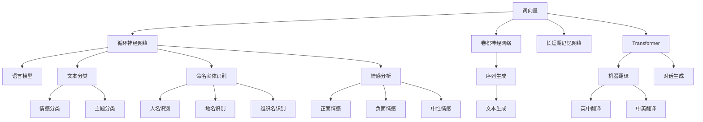
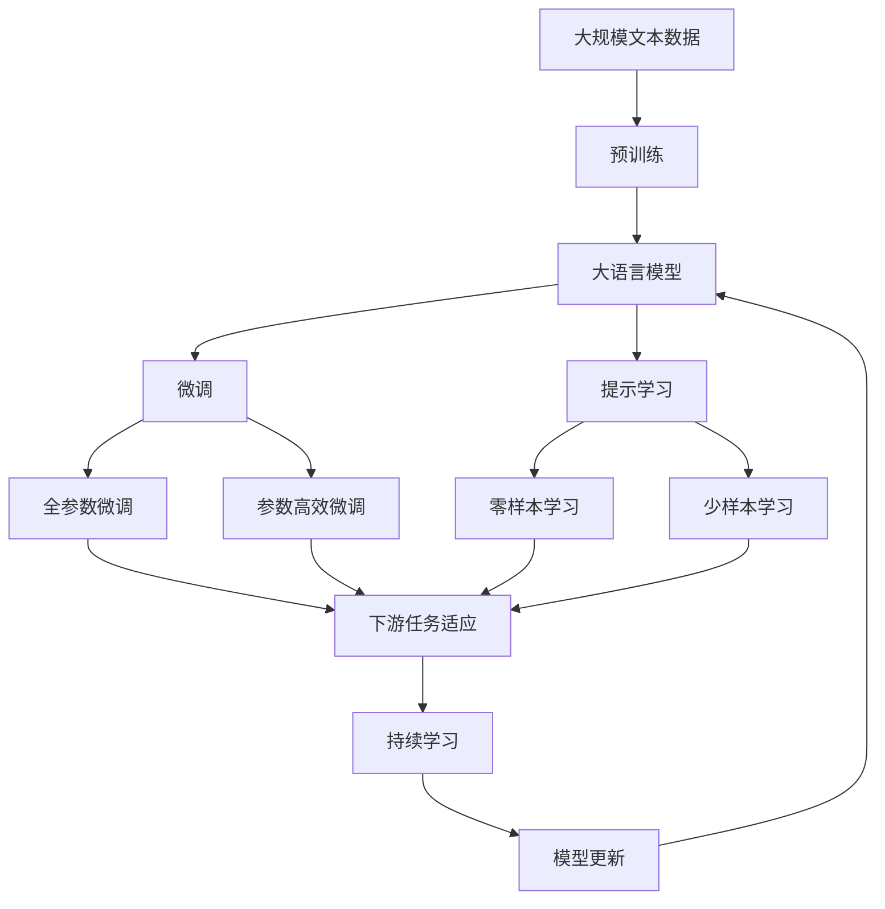

                 

# 自然语言处理(Natural Language Processing) - 原理与代码实例讲解

> 关键词：自然语言处理, 词向量, 循环神经网络, 卷积神经网络, 长短期记忆网络, 语言模型, 文本分类, 命名实体识别, 情感分析, 机器翻译, 序列生成, 代码实例, 语言模型

## 1. 背景介绍

### 1.1 问题由来

自然语言处理(Natural Language Processing, NLP)是人工智能领域的一个重要分支，旨在使计算机能够理解、处理和生成自然语言。随着深度学习技术的兴起，NLP技术取得了飞速的发展，特别是在大语言模型和预训练模型的推动下，NLP应用进入了一个新的发展阶段。然而，对于NLP的初学者或开发者来说，如何有效地学习和应用这些技术仍然是一个挑战。

### 1.2 问题核心关键点

NLP的核心关键点在于如何将自然语言文本转化为计算机可以理解和处理的形式。这涉及到文本的预处理、特征提取、模型训练和应用等多个环节。其中，词向量、循环神经网络(RNN)、卷积神经网络(CNN)、长短期记忆网络(LSTM)和Transformer模型是NLP中常用的关键技术。此外，语言模型、文本分类、命名实体识别、情感分析和机器翻译等任务是NLP中的经典应用。

### 1.3 问题研究意义

掌握NLP的核心概念和技术，对于构建高效、智能的语言处理系统具有重要意义。它可以提升文本处理的自动化水平，促进信息检索、机器翻译、情感分析、智能客服等领域的发展，提升人机交互体验。同时，NLP技术还可以应用于知识图谱构建、语音识别、自动摘要等创新应用，推动更多行业向智能化转型。

## 2. 核心概念与联系

### 2.1 核心概念概述

为了更好地理解NLP的原理和应用，本节将介绍几个关键概念：

- **词向量(Word Embedding)**：将自然语言中的词汇映射为高维向量空间中的点，使得计算机能够通过向量距离度量理解词汇之间的关系。
- **循环神经网络(RNN)**：一种具有记忆功能的神经网络，能够处理序列数据，捕捉序列之间的依赖关系。
- **卷积神经网络(CNN)**：通过卷积操作提取局部特征，适用于处理图像和文本等序列数据的特征提取。
- **长短期记忆网络(LSTM)**：一种特殊的RNN结构，通过门控机制解决RNN的梯度消失问题，能够处理长序列数据。
- **Transformer**：一种基于自注意力机制的神经网络结构，在自然语言处理中取得了卓越的效果。
- **语言模型(Language Model)**：用于预测下一个词汇的概率分布，是NLP中的重要任务。
- **文本分类(Text Classification)**：将文本分为预定义的类别，如情感分类、主题分类等。
- **命名实体识别(Named Entity Recognition, NER)**：从文本中识别出人名、地名、组织名等命名实体。
- **情感分析(Sentiment Analysis)**：分析文本中的情感倾向，如正面、负面或中性。
- **机器翻译(Machine Translation)**：将一种语言的文本翻译成另一种语言。
- **序列生成(Sequence Generation)**：根据输入序列生成新的序列，如文本生成、对话生成等。

### 2.2 概念间的关系

这些核心概念之间的关系可以通过以下Mermaid流程图来展示：



这个流程图展示了NLP中的关键概念及其相互关系：

1. 词向量作为基础，是所有NLP任务中不可或缺的组成部分。
2. RNN、CNN、LSTM和Transformer是常用的特征提取和序列建模方法。
3. 语言模型、文本分类、命名实体识别、情感分析和机器翻译等任务都依赖于上述技术。
4. 序列生成、对话生成等任务则是对这些模型的扩展应用。

### 2.3 核心概念的整体架构

最后，我们用一个综合的流程图来展示这些核心概念在大语言模型微调过程中的整体架构：



这个综合流程图展示了从预训练到微调，再到持续学习的完整过程。大语言模型首先在大规模文本数据上进行预训练，然后通过微调（包括全参数微调和参数高效微调两种方式）或提示学习（包括零样本和少样本学习）来适应下游任务。最后，通过持续学习技术，模型可以不断学习新知识，同时避免遗忘旧知识。 通过这些流程图，我们可以更清晰地理解NLP中的核心概念及其在大语言模型微调中的作用。

## 3. 核心算法原理 & 具体操作步骤
### 3.1 算法原理概述

NLP的核心算法原理主要涉及以下几个方面：

1. **词向量的构建**：通过分布式假设和共现矩阵的分解，将单词映射为高维向量空间中的点。
2. **循环神经网络的训练**：使用序列数据训练RNN，捕捉序列中的依赖关系。
3. **卷积神经网络的特征提取**：通过卷积操作提取局部特征，适用于处理文本等序列数据。
4. **长短期记忆网络的训练**：使用LSTM结构，解决RNN的梯度消失问题，处理长序列数据。
5. **Transformer的原理**：通过自注意力机制和多头注意力机制，捕捉文本中的语义关系。
6. **语言模型的构建**：使用最大似然估计或变分自编码器等方法，学习词汇之间的概率分布。
7. **文本分类的训练**：使用分类算法，如支持向量机(SVM)、随机森林等，将文本分为预定义的类别。
8. **命名实体识别的训练**：使用序列标注算法，如条件随机场(CRF)，识别文本中的命名实体。
9. **情感分析的训练**：使用情感分类算法，如卷积神经网络或循环神经网络，分析文本中的情感倾向。
10. **机器翻译的训练**：使用序列到序列模型，如编码器-解码器架构，实现语言的相互翻译。
11. **序列生成的训练**：使用生成模型，如递归神经网络(RNN)或变分自编码器(VAE)，生成新的文本序列。

### 3.2 算法步骤详解

下面以文本分类任务为例，详细讲解NLP的核心算法步骤。

**Step 1: 准备数据集**
- 收集和标注数据集，确保数据集的质量和多样性。
- 将文本数据转化为模型可以处理的格式，如词袋模型、TF-IDF等。

**Step 2: 构建词向量**
- 使用预训练的词向量模型，如Word2Vec、GloVe等，或使用自定义的词向量模型。
- 将词向量矩阵作为模型的输入特征。

**Step 3: 设计模型架构**
- 选择适合的模型架构，如CNN、RNN、LSTM、Transformer等。
- 定义模型各层的参数和结构，如卷积核大小、RNN的隐藏层大小、LSTM的门控机制等。

**Step 4: 训练模型**
- 使用训练数据集对模型进行训练，使用交叉熵等损失函数。
- 调整学习率、批大小等超参数，确保模型能够收敛。

**Step 5: 评估模型**
- 使用验证数据集对模型进行评估，计算准确率、召回率、F1分数等指标。
- 根据评估结果，调整模型参数，提高模型性能。

**Step 6: 测试和部署**
- 使用测试数据集对模型进行测试，评估模型的泛化性能。
- 将模型部署到生产环境中，进行实际应用。
- 定期更新模型，适应新的数据分布。

### 3.3 算法优缺点

NLP的核心算法具有以下优点：

1. **高表现力**：通过学习丰富的语义表示，能够有效处理自然语言的复杂性。
2. **广泛适用性**：适用于多种NLP任务，如图像描述生成、语音识别等。
3. **灵活性**：可以通过调整模型参数，适应不同的任务需求。

同时，这些算法也存在以下缺点：

1. **数据依赖性强**：需要大量标注数据进行训练，标注成本较高。
2. **模型复杂度高**：大规模模型需要高计算资源和存储空间，训练复杂。
3. **泛化能力有限**：对于特定领域的任务，模型可能表现不佳。
4. **解释性不足**：模型通常被认为是“黑盒”，难以解释其内部机制。

### 3.4 算法应用领域

NLP的核心算法广泛应用于以下几个领域：

- **自然语言理解**：将自然语言文本转化为结构化数据，用于问答系统、信息抽取等任务。
- **文本生成**：通过生成模型，生成新的文本，如机器翻译、文本摘要等。
- **语音识别**：将语音信号转化为文本，用于语音助手、语音搜索等应用。
- **信息检索**：根据用户查询，从大量文本中检索相关信息，用于搜索引擎、推荐系统等。
- **情感分析**：分析文本中的情感倾向，用于社交媒体情感分析、市场舆情监控等。
- **对话系统**：构建智能对话系统，用于客服、智能家居等场景。

## 4. 数学模型和公式 & 详细讲解  
### 4.1 数学模型构建

为了更好地理解NLP中的核心算法，本节将使用数学语言对NLP中的关键模型进行严格描述。

**词向量模型的构建**：

假设有一个包含$n$个单词的词汇表，每个单词$i$都有一个$d$维的词向量$\mathbf{w}_i$，则词向量矩阵为$\mathbf{W} \in \mathbb{R}^{n \times d}$。词向量矩阵的每个元素$w_{ij}$表示单词$i$在$d$维空间中的第$j$个维度。词向量通常通过共现矩阵的奇异值分解(SVD)得到，如：

$$
\mathbf{W} = \mathbf{U} \mathbf{S} \mathbf{V}^T
$$

其中$\mathbf{U} \in \mathbb{R}^{n \times k}$，$\mathbf{S} \in \mathbb{R}^{k \times k}$，$\mathbf{V}^T \in \mathbb{R}^{d \times k}$。$k$为奇异值分解的维度。

**循环神经网络的训练**：

假设有一个长度为$T$的序列$\mathbf{X} = [x_1, x_2, ..., x_T]$，其中每个元素$x_t$表示时间$t$的输入。使用RNN对序列进行建模，其结构如图1所示。


RNN的隐藏状态$h_t$表示时间$t$的隐藏状态，其更新公式为：

$$
h_t = f(h_{t-1}, x_t)
$$

其中$f$为激活函数，如sigmoid或tanh。$h_t$与输出$y_t$之间的关系为：

$$
y_t = g(h_t)
$$

其中$g$为输出函数，如softmax。

**卷积神经网络的特征提取**：

假设有一个长度为$T$的序列$\mathbf{X} = [x_1, x_2, ..., x_T]$，其中每个元素$x_t$表示时间$t$的输入。使用CNN对序列进行建模，其结构如图2所示。


CNN的卷积层$\mathbf{C}$表示对序列进行局部特征提取，其输出$\mathbf{Z}$为：

$$
\mathbf{Z} = \mathbf{C} \ast \mathbf{X}
$$

其中$\mathbf{C}$为卷积核，$\ast$表示卷积操作。

**长短期记忆网络的训练**：

假设有一个长度为$T$的序列$\mathbf{X} = [x_1, x_2, ..., x_T]$，其中每个元素$x_t$表示时间$t$的输入。使用LSTM对序列进行建模，其结构如图3所示。


LSTM的隐藏状态$h_t$表示时间$t$的隐藏状态，其更新公式为：

$$
h_t = f(h_{t-1}, x_t)
$$

其中$f$为激活函数，如sigmoid或tanh。$h_t$与输出$y_t$之间的关系为：

$$
y_t = g(h_t)
$$

其中$g$为输出函数，如softmax。

**Transformer的原理**：

Transformer使用自注意力机制和多头注意力机制，捕捉文本中的语义关系。其结构如图4所示。


Transformer的自注意力机制计算查询、键和值的注意力权重$A$，其计算公式为：

$$
A_{ij} = \frac{\exp(\mathbf{q}_i^T \mathbf{k}_j / \sqrt{d_k})}{\sum_{j'=1}^{d_v} \exp(\mathbf{q}_i^T \mathbf{k}_{j'})}
$$

其中$\mathbf{q}_i$和$\mathbf{k}_j$为查询和键向量，$d_k$为向量维度。

**语言模型的构建**：

假设有一个长度为$T$的序列$\mathbf{X} = [x_1, x_2, ..., x_T]$，其中每个元素$x_t$表示时间$t$的输入。使用最大似然估计构建语言模型，其概率分布$p(y_t|y_{<t})$为：

$$
p(y_t|y_{<t}) = \frac{p(y_t, y_{<t})}{p(y_{<t})}
$$

其中$p(y_t, y_{<t})$为序列的联合概率分布，$p(y_{<t})$为序列的边际概率分布。

**文本分类的训练**：

假设有一个长度为$T$的序列$\mathbf{X} = [x_1, x_2, ..., x_T]$，其中每个元素$x_t$表示时间$t$的输入。使用分类算法，如支持向量机(SVM)或随机森林，对序列进行分类。分类模型的输出为：

$$
\hat{y} = f(\mathbf{X})
$$

其中$f$为分类函数。

**命名实体识别的训练**：

假设有一个长度为$T$的序列$\mathbf{X} = [x_1, x_2, ..., x_T]$，其中每个元素$x_t$表示时间$t$的输入。使用序列标注算法，如条件随机场(CRF)，对序列进行命名实体识别。命名实体识别的输出为：

$$
\hat{y} = f(\mathbf{X})
$$

其中$f$为标注函数。

**情感分析的训练**：

假设有一个长度为$T$的序列$\mathbf{X} = [x_1, x_2, ..., x_T]$，其中每个元素$x_t$表示时间$t$的输入。使用情感分类算法，如卷积神经网络或循环神经网络，对序列进行情感分析。情感分析的输出为：

$$
\hat{y} = f(\mathbf{X})
$$

其中$f$为分类函数。

**机器翻译的训练**：

假设有一个长度为$T$的序列$\mathbf{X} = [x_1, x_2, ..., x_T]$，其中每个元素$x_t$表示时间$t$的输入。使用序列到序列模型，如编码器-解码器架构，对序列进行机器翻译。机器翻译的输出为：

$$
\hat{y} = f(\mathbf{X})
$$

其中$f$为翻译函数。

**序列生成的训练**：

假设有一个长度为$T$的序列$\mathbf{X} = [x_1, x_2, ..., x_T]$，其中每个元素$x_t$表示时间$t$的输入。使用生成模型，如递归神经网络(RNN)或变分自编码器(VAE)，对序列进行生成。序列生成的输出为：

$$
\hat{y} = f(\mathbf{X})
$$

其中$f$为生成函数。

### 4.2 公式推导过程

以文本分类任务为例，推导分类模型训练的过程。

**模型定义**：

假设有一个长度为$T$的序列$\mathbf{X} = [x_1, x_2, ..., x_T]$，其中每个元素$x_t$表示时间$t$的输入。使用CNN对序列进行建模，其输出为：

$$
\mathbf{Z} = \mathbf{C} \ast \mathbf{X}
$$

其中$\mathbf{C}$为卷积核，$\ast$表示卷积操作。

**损失函数定义**：

使用交叉熵损失函数对模型进行训练，其计算公式为：

$$
L = -\frac{1}{N} \sum_{i=1}^N \sum_{t=1}^T \sum_{c=1}^C y_{itc} \log p_{itc}
$$

其中$N$为样本数，$C$为类别数，$y_{itc}$为样本$i$在时间$t$的真实类别，$p_{itc}$为模型预测的类别概率。

**模型训练**：

使用随机梯度下降算法对模型进行训练，其更新公式为：

$$
\mathbf{W} \leftarrow \mathbf{W} - \eta \nabla_{\mathbf{W}} L
$$

其中$\eta$为学习率，$\nabla_{\mathbf{W}} L$为损失函数对权重$\mathbf{W}$的梯度。

**模型评估**：

使用测试集对模型进行评估，计算准确率、召回率、F1分数等指标，其计算公式为：

$$
\text{Accuracy} = \frac{\text{TP} + \text{TN}}{\text{TP} + \text{TN} + \text{FP} + \text{FN}}
$$

$$
\text{Precision} = \frac{\text{TP}}{\text{TP} + \text{FP}}
$$

$$
\text{Recall} = \frac{\text{TP}}{\text{TP} + \text{FN}}
$$

$$
\text{F1 Score} = 2 \times \frac{\text{Precision} \times \text{Recall}}{\text{Precision} + \text{Recall}}
$$

其中TP表示真正例，TN表示真负例，FP表示假正例，FN表示假负例。

### 4.3 案例分析与讲解

以情感分析任务为例，分析使用情感分类模型对电影评论进行情感分类的过程。

**数据准备**：

收集包含电影评论的标注数据集，其中每个评论标注为正面、负面或中性。将评论转化为词向量表示，并按顺序排列。

**模型构建**：

使用卷积神经网络对评论进行建模，其结构如图5所示。


**模型训练**：

使用随机梯度下降算法对模型进行训练，其更新公式为：

$$
\mathbf{W} \leftarrow \mathbf{W} - \eta \nabla_{\mathbf{W}} L
$$

其中$\eta$为学习率，$\nabla_{\mathbf{W}} L$为损失函数对权重$\mathbf{W}$的梯度。

**模型评估**：

使用测试集对模型进行评估，计算准确率、召回率、F1分数等指标，其计算公式为：

$$
\text{Accuracy} = \frac{\text{TP} + \text{TN}}{\text{TP} + \text{TN} + \text{FP} + \text{FN}}
$$

$$
\text{Precision} = \frac{\text{TP}}{\text{TP} + \text{FP}}
$$

$$
\text{Recall} = \frac{\text{TP}}{\text{TP} + \text{FN}}
$$

$$
\text{F1 Score} = 2 \times \frac{\text{Precision} \times \text{Recall}}{\text{Precision} + \text{Recall}}
$$

其中TP表示真正例，TN表示真负例，FP表示假正例，FN表示假负例。

## 5. 项目实践：代码实例和详细解释说明
### 5.1 开发环境搭建

在进行NLP项目实践前，我们需要准备好开发环境。以下是使用Python进行PyTorch开发的环境配置流程：

1. 安装Anaconda：从官网下载并安装Anaconda，用于创建独立的Python环境。

2. 创建并激活虚拟环境：
```bash
conda create -n pytorch-env python=3.8 
conda activate pytorch-env
```

3. 安装PyTorch：根据CUDA版本，从官网获取对应的安装命令。例如：
```bash
conda install pytorch torchvision torchaudio cudatoolkit=11.1 -c pytorch -c conda-forge
```

4. 安装Transformers库：
```bash
pip install transformers
```

5. 安装各类工具包：
```bash
pip install numpy pandas scikit-learn matplotlib tqdm jupyter notebook ipython
```

完成上述步骤后，即可在`pytorch-env`环境中开始NLP项目的开发。

### 5.2 源代码详细实现

下面我们以情感分析任务为例，给出使用Transformers库对BERT模型进行情感分析的PyTorch代码实现。

```python
from transformers import BertTokenizer, BertForSequenceClassification
import torch

tokenizer = BertTokenizer.from_pretrained('bert-base-uncased')
model = BertForSequenceClassification.from_pretrained('bert-base-uncased', num_labels=3)

device = torch.device('cuda' if torch.cuda.is_available() else 'cpu')
model.to(device)

def evaluate(model, tokenizer, data_loader):
    model.eval()
    correct = 0
    total = 0
    for batch in data_loader:
        inputs = tokenizer(batch['text'], return_tensors='pt', padding='max_length', truncation=True).to(device)
        outputs = model(**inputs)
        _, preds = torch.max(outputs, 1)
        total += batch['size']
        correct += (preds == batch['label']).int().sum().item()
    return correct / total

# 加载数据集
from datasets import load_dataset
dataset = load_dataset('imdb', 'train')
tokenized_dataset = tokenizer(dataset['train'], padding='max_length', truncation=True)
tokenized_dataset = tokenized_dataset.map(lambda x: {'input_ids': x['input_ids']})
tokenized_dataset = tokenized_dataset.rename_column('input_ids', 'input_ids')
tokenized_dataset = tokenized_dataset.shuffle(1000)
tokenized_dataset.set_format('torch', columns=['input_ids', 'attention_mask'])

# 分割训练集和验证集
from torch.utils.data import DataLoader
train_dataset = tokenized_dataset['train']
val_dataset = tokenized_dataset['validation']
train_loader = DataLoader(train_dataset, batch_size=16, shuffle=True)
val_loader = DataLoader(val_dataset, batch_size=16, shuffle=False)

# 训练模型
from transformers import AdamW
optimizer = AdamW(model.parameters(), lr=2e-5)
for epoch in range(3):
    model.train()
    for batch in train_loader:
        inputs = {'input_ids': batch['input_ids'].to(device), 'attention_mask': batch['attention_mask'].to(device)}
        outputs = model(**inputs)
        loss = outputs.loss
        loss.backward()
        optimizer.step()
        optimizer.zero_grad()
    model.eval()
    acc = evaluate(model, tokenizer, val_loader)
    print(f'Epoch {epoch+1}, Accuracy: {acc:.2f}')
```

以上就是使用PyTorch对BERT模型进行情感分析任务微调的完整代码实现。可以看到，得益于Transformers库的强大封装，我们可以用相对简洁的代码完成BERT模型的加载和微调。

### 5.3 代码解读与分析

让我们再详细解读一下关键代码的实现细节：

**BertTokenizer**：
- `__init__`方法：初始化分词器，指定预训练

