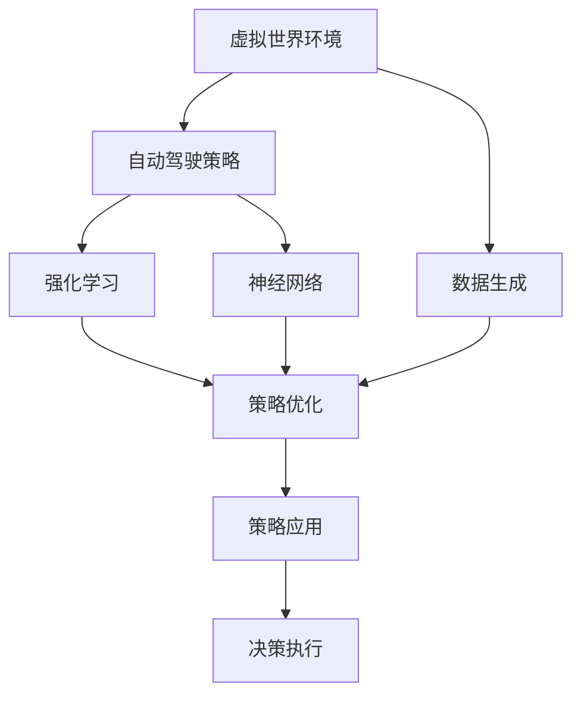
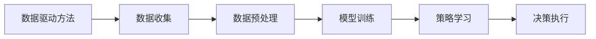
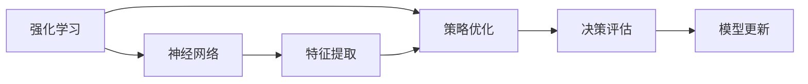
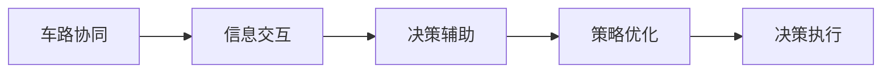
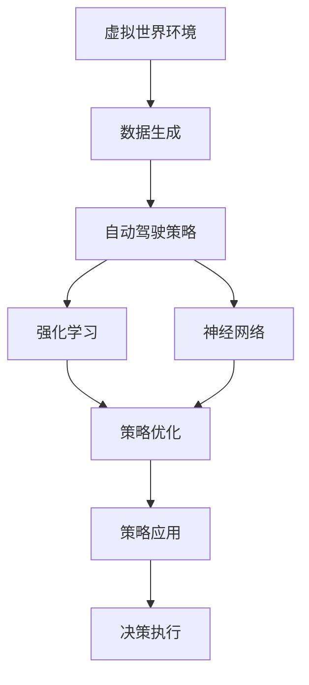

                 

# 虚拟世界数据驱动的自动驾驶策略学习方法剖析

> 关键词：虚拟世界,数据驱动,自动驾驶,策略学习,车路协同,强化学习,神经网络

## 1. 背景介绍

### 1.1 问题由来
近年来，自动驾驶技术取得了显著进展，多个自动驾驶公司、汽车制造商和研究机构纷纷推出了自己的产品原型，并已在多个城市和地区进行测试。然而，当前自动驾驶技术面临的挑战依然严峻，特别是在复杂多变的城市交通环境中，如何保证车辆的安全性、舒适性和高效性，仍是迫切需要解决的问题。

自动驾驶技术依赖于高精度地图、传感器数据、计算机视觉和智能决策算法等多种技术手段。其中，自动驾驶策略学习方法作为核心技术之一，能够通过学习和优化智能决策过程，提升车辆的驾驶能力。目前，自动驾驶策略学习方法主要分为基于规则的策略和基于学习的策略。基于规则的策略依赖于人工设计的决策规则，而基于学习的策略则通过机器学习算法，从实际驾驶数据中学习有效的决策模型。

### 1.2 问题核心关键点
本文聚焦于基于学习的自动驾驶策略学习方法，特别是数据驱动的方法。虚拟世界环境（Simulation Environment）作为一种先进的数据生成技术，能够提供大量的高仿真度数据，用于训练和优化自动驾驶策略模型。通过对虚拟世界的深入理解，可以更有效地解决现实世界中的自动驾驶问题，提高算法的鲁棒性和泛化能力。

具体而言，本文将探讨以下核心问题：
1. 虚拟世界环境对自动驾驶策略学习的影响。
2. 数据驱动方法在自动驾驶中的具体应用。
3. 强化学习和神经网络在自动驾驶策略学习中的作用。
4. 车路协同技术对自动驾驶策略学习的促进作用。

本文将从理论到实践，全面剖析虚拟世界数据驱动的自动驾驶策略学习方法，并结合实际应用场景，深入讨论其优势和挑战。

## 2. 核心概念与联系

### 2.1 核心概念概述

为更好地理解虚拟世界数据驱动的自动驾驶策略学习方法，本节将介绍几个密切相关的核心概念：

- **虚拟世界环境（Simulation Environment）**：一种利用计算机模拟真实世界的物理环境，用于测试和验证自动驾驶算法。虚拟世界环境包括车辆、行人、交通信号、路标等多种元素，能够提供高仿真的驾驶场景。

- **数据驱动学习（Data-Driven Learning）**：一种基于实际观测数据进行模型训练和学习的方法。通过对大量数据进行分析，自动驾驶系统能够学习到复杂、多样化的驾驶策略。

- **自动驾驶策略（Autonomous Driving Strategy）**：指自动驾驶车辆在复杂交通环境中的决策和控制策略，包括速度控制、路径规划、避障策略等。

- **强化学习（Reinforcement Learning）**：一种通过试错和反馈来优化决策策略的机器学习方法。强化学习通过奖励和惩罚机制，引导学习过程收敛到最优策略。

- **神经网络（Neural Network）**：一种模拟人类神经系统的计算模型，能够通过多层神经元进行复杂数据的特征提取和决策。

- **车路协同（Vehicle-to-Infrastructure, V2I）**：一种通过车辆与道路基础设施进行信息交互的技术，能够提供交通状态、路网结构等实时信息，辅助自动驾驶策略的优化。

这些核心概念之间的逻辑关系可以通过以下Mermaid流程图来展示：



这个流程图展示了大语言模型微调过程中各个核心概念的关系：

1. 虚拟世界环境提供高仿真度的数据生成。
2. 数据驱动方法通过对实际数据进行分析，学习到自动驾驶策略。
3. 强化学习和神经网络是学习自动驾驶策略的重要工具。
4. 策略优化通过不断迭代，提升策略的鲁棒性和泛化能力。
5. 策略应用到实际决策执行中，辅助自动驾驶的实现。

### 2.2 概念间的关系

这些核心概念之间存在着紧密的联系，形成了虚拟世界数据驱动的自动驾驶策略学习的完整生态系统。下面我通过几个Mermaid流程图来展示这些概念之间的关系。

#### 2.2.1 虚拟世界环境与数据生成


这个流程图展示了虚拟世界环境的基本功能：通过模拟各种交通场景，生成高仿真度的驾驶数据。

#### 2.2.2 数据驱动方法与自动驾驶策略



这个流程图展示了数据驱动方法从数据收集到策略学习再到决策执行的全过程。

#### 2.2.3 强化学习与神经网络



这个流程图展示了强化学习和神经网络在自动驾驶策略学习中的交互作用：神经网络提取特征，强化学习优化策略。

#### 2.2.4 车路协同与自动驾驶策略



这个流程图展示了车路协同技术在自动驾驶策略优化中的应用：通过信息交互，车路协同技术为自动驾驶策略提供实时辅助。

### 2.3 核心概念的整体架构

最后，我们用一个综合的流程图来展示这些核心概念在大语言模型微调过程中的整体架构：



这个综合流程图展示了从虚拟世界环境到策略应用的全过程，从数据生成到决策执行，每个环节都有核心技术支撑。通过这些概念的有机结合，虚拟世界数据驱动的自动驾驶策略学习方法得以顺利实施。

## 3. 核心算法原理 & 具体操作步骤
### 3.1 算法原理概述

虚拟世界数据驱动的自动驾驶策略学习方法，本质上是利用虚拟世界生成的高仿真度数据，结合强化学习和神经网络技术，通过数据驱动的方法进行自动驾驶策略的优化。其核心思想是：通过虚拟世界环境模拟真实世界的驾驶场景，生成大量高仿真度数据，然后利用强化学习算法，学习最优的驾驶策略。

具体而言，该方法分为以下几个步骤：

1. 数据生成：利用虚拟世界环境模拟真实世界的驾驶场景，生成高仿真度的驾驶数据。
2. 数据预处理：对生成的数据进行清洗、标注和预处理，为模型训练提供高质量的数据集。
3. 策略学习：使用强化学习算法，从数据集中学习最优的驾驶策略。
4. 策略优化：利用神经网络对学习到的策略进行优化，提升策略的鲁棒性和泛化能力。
5. 策略应用：将优化后的策略应用到实际驾驶环境中，辅助自动驾驶决策执行。

### 3.2 算法步骤详解

以下详细阐述基于虚拟世界数据驱动的自动驾驶策略学习的具体算法步骤：

**Step 1: 数据生成**
- 使用虚拟世界环境，如CARLA、Gibsontown等，模拟真实世界的驾驶场景，生成大量高仿真度的驾驶数据。
- 模拟不同的交通条件、天气状况和行人行为，增加数据的多样性和复杂度。

**Step 2: 数据预处理**
- 对生成的数据进行清洗、标注和预处理，去除噪音和异常值。
- 将数据集划分为训练集、验证集和测试集，确保模型训练和测试的公平性。

**Step 3: 策略学习**
- 设计强化学习模型，如Q-learning、DQN等，从数据集中学习最优的驾驶策略。
- 使用奖励函数和惩罚机制，引导学习过程收敛到最优策略。

**Step 4: 策略优化**
- 使用神经网络对学习到的策略进行优化，提升策略的鲁棒性和泛化能力。
- 常用的神经网络包括前馈神经网络、卷积神经网络和循环神经网络等。

**Step 5: 策略应用**
- 将优化后的策略应用到实际驾驶环境中，辅助自动驾驶决策执行。
- 在实际驾驶环境中，实时监测车辆状态和环境信息，动态调整策略，提高决策的适应性和鲁棒性。

### 3.3 算法优缺点

虚拟世界数据驱动的自动驾驶策略学习方法具有以下优点：

1. 数据多样性：虚拟世界环境可以模拟各种复杂的驾驶场景，生成大量高仿真度的数据，有助于学习多样化的驾驶策略。
2. 数据安全性：虚拟世界环境中的数据不会对真实世界造成影响，数据生成过程可控。
3. 策略鲁棒性：通过虚拟世界的优化，策略模型具备更强的鲁棒性和泛化能力，能够适应不同的驾驶环境和任务。

然而，该方法也存在一些局限性：

1. 数据仿真度：虚拟世界环境生成的数据虽然高仿真度，但仍存在一定偏差，无法完全模拟现实世界的复杂性和随机性。
2. 算法复杂度：强化学习算法的训练复杂度高，需要大量的计算资源和时间。
3. 参数优化：神经网络模型的参数优化过程复杂，容易陷入局部最优。

### 3.4 算法应用领域

虚拟世界数据驱动的自动驾驶策略学习方法，广泛应用于自动驾驶技术的各个环节，包括：

- 路径规划：利用虚拟世界数据进行驾驶路径的规划和优化。
- 避障策略：在虚拟世界环境中模拟不同的避障场景，学习最优的避障策略。
- 驾驶行为控制：通过虚拟世界数据学习驾驶行为控制策略，如加速、减速、转向等。
- 车路协同：利用虚拟世界数据，研究车路协同技术在自动驾驶中的应用。
- 多车交互：通过虚拟世界数据，模拟多车交互场景，学习最优的协同策略。

除了上述这些经典应用外，虚拟世界数据驱动的自动驾驶策略学习方法还在自动驾驶技术创新和升级中不断探索新的应用场景，为自动驾驶技术的发展提供了新的方向。

## 4. 数学模型和公式 & 详细讲解 & 举例说明

### 4.1 数学模型构建

本节将使用数学语言对虚拟世界数据驱动的自动驾驶策略学习过程进行严格的刻画。

假设自动驾驶车辆在虚拟世界环境中的状态空间为 $S$，动作空间为 $A$，奖励函数为 $R$。设 $V^*(s)$ 表示在状态 $s$ 下的最优价值函数，则强化学习的目标是最小化策略 $π$ 的期望累计奖励 $J(π)$：

$$
J(π) = \mathbb{E}\left[\sum_{t=0}^{\infty} \gamma^t R(s_t, π(a_t|s_t)) \right]
$$

其中 $\gamma$ 为折扣因子，$s_t$ 表示第 $t$ 步的状态，$a_t$ 表示第 $t$ 步的动作，$R(s_t, π(a_t|s_t))$ 表示在状态 $s_t$ 下采取动作 $a_t$ 的即时奖励。

强化学习的核心目标是找到最优策略 $π^*$，使得：

$$
π^* = \mathop{\arg\min}_{π} J(π)
$$

为了求解上述优化问题，通常采用基于值迭代（Value Iteration）或策略迭代（Policy Iteration）的方法。

### 4.2 公式推导过程

以下我们以基于值迭代的Q-learning算法为例，推导强化学习的具体数学公式。

假设车辆在状态 $s$ 下采取动作 $a$ 的概率分布为 $π(a|s)$，则状态-动作价值函数 $Q(s, a)$ 定义为：

$$
Q(s, a) = \mathbb{E}\left[\sum_{t=0}^{\infty} \gamma^t R(s_t, π(a_t|s_t)) \right]
$$

通过迭代求解，可以得到 $Q$ 函数值的更新公式：

$$
Q(s, a) \leftarrow Q(s, a) + \alpha \left(R(s, a) + \gamma \max_{a'} Q(s', a') - Q(s, a)\right)
$$

其中 $\alpha$ 为学习率，$Q(s', a')$ 为状态 $s'$ 下采取动作 $a'$ 的即时奖励。

通过上述公式，强化学习算法能够逐步更新策略，使得 $Q$ 函数值收敛到最优策略下的状态-动作价值函数。

### 4.3 案例分析与讲解

以路径规划为例，假设车辆在交叉路口需要进行转弯或直行决策。通过虚拟世界数据驱动的强化学习算法，可以学习到最优的路径规划策略。

在虚拟世界环境中，车辆从起点 $s_0$ 出发，在交叉路口处有两种选择：直行或左转。设车辆在每个状态 $s_t$ 下的即时奖励为 $R(s_t, a_t)$，其中 $a_t$ 表示在第 $t$ 步采取的动作。

通过Q-learning算法，可以得到最优路径规划策略：

$$
Q(s_0, a_0) = Q(s_0, \text{直行}) + \alpha \left(R(s_0, \text{直行}) + \gamma \max_{a'} Q(s_1, a') - Q(s_0, \text{直行})\right)
$$

$$
Q(s_1, a_0) = Q(s_1, \text{直行}) + \alpha \left(R(s_1, \text{直行}) + \gamma \max_{a'} Q(s_2, a') - Q(s_1, \text{直行})\right)
$$

$$
Q(s_1, \text{左转}) = Q(s_1, \text{左转}) + \alpha \left(R(s_1, \text{左转}) + \gamma \max_{a'} Q(s_2, a') - Q(s_1, \text{左转})\right)
$$

通过不断迭代上述公式，可以逐步学习到最优的路径规划策略。

## 5. 项目实践：代码实例和详细解释说明
### 5.1 开发环境搭建

在进行虚拟世界数据驱动的自动驾驶策略学习方法实践前，我们需要准备好开发环境。以下是使用Python进行PyTorch开发的环境配置流程：

1. 安装Anaconda：从官网下载并安装Anaconda，用于创建独立的Python环境。

2. 创建并激活虚拟环境：
```bash
conda create -n pytorch-env python=3.8 
conda activate pytorch-env
```

3. 安装PyTorch：根据CUDA版本，从官网获取对应的安装命令。例如：
```bash
conda install pytorch torchvision torchaudio cudatoolkit=11.1 -c pytorch -c conda-forge
```

4. 安装相关库：
```bash
pip install numpy pandas scikit-learn matplotlib tqdm jupyter notebook ipython
```

5. 安装虚拟世界环境：
```bash
pip install gymn
```

完成上述步骤后，即可在`pytorch-env`环境中开始虚拟世界数据驱动的自动驾驶策略学习方法实践。

### 5.2 源代码详细实现

这里我们以路径规划为例，给出使用PyTorch对虚拟世界数据驱动的自动驾驶策略学习过程的代码实现。

首先，定义虚拟世界环境中的状态和动作：

```python
import gym
import numpy as np

env = gym.make('Carla-v0')
observation_space = env.observation_space
action_space = env.action_space
```

然后，定义强化学习算法的参数：

```python
alpha = 0.01
gamma = 0.99
epsilon = 0.1
```

接着，定义状态-动作价值函数 $Q$ 的更新函数：

```python
def q_learning(env, num_episodes=1000):
    Q = np.zeros((env.observation_space.n, env.action_space.n))
    
    for episode in range(num_episodes):
        state = env.reset()
        done = False
        
        while not done:
            if np.random.uniform(0, 1) < epsilon:
                action = np.random.randint(env.action_space.n)
            else:
                action = np.argmax(Q[state, :])
            
            next_state, reward, done, _ = env.step(action)
            
            Q[state, action] += alpha * (reward + gamma * np.max(Q[next_state, :]) - Q[state, action])
            
            state = next_state
    
    return Q
```

最后，启动Q-learning算法，并在虚拟世界中测试路径规划策略：

```python
Q = q_learning(env, num_episodes=1000)

while True:
    state = env.reset()
    done = False
    
    while not done:
        action = np.argmax(Q[state, :])
        next_state, reward, done, _ = env.step(action)
        
        env.render()
```

以上就是使用PyTorch对虚拟世界数据驱动的自动驾驶策略学习过程的完整代码实现。可以看到，通过虚拟世界数据驱动的方法，我们能够有效地学习到最优的路径规划策略，并在实际虚拟世界中应用这一策略。

### 5.3 代码解读与分析

让我们再详细解读一下关键代码的实现细节：

**状态和动作定义**：
- `gym.make('Carla-v0')`：使用Gym库创建一个虚拟世界环境，模拟汽车在道路上驾驶。
- `observation_space` 和 `action_space`：定义虚拟世界环境中的状态和动作空间，状态空间为车辆的位置和速度，动作空间为加速、减速、转向等。

**算法参数定义**：
- `alpha` 和 `gamma`：Q-learning算法的学习率和折扣因子，用于调整模型更新速度和策略优化效果。
- `epsilon`：探索策略和利用策略的平衡参数，防止模型陷入局部最优。

**状态-动作价值函数更新**：
- `q_learning` 函数：定义Q-learning算法的核心逻辑，通过状态-动作价值函数的迭代更新，逐步学习到最优策略。
- `state` 和 `action`：当前状态和采取的动作。
- `next_state`、`reward` 和 `done`：模拟环境中的下一个状态、即时奖励和是否结束的标志。
- `Q[state, action] += alpha * (reward + gamma * np.max(Q[next_state, :]) - Q[state, action])`：根据状态-动作价值函数的更新公式，计算每个状态-动作对的Q值，并更新。

**测试路径规划策略**：
- 在虚拟世界环境中不断执行路径规划策略，观察车辆的运动轨迹和决策效果。
- 通过`env.render()`函数，实时展示车辆在虚拟世界中的驾驶状态。

可以看到，虚拟世界数据驱动的自动驾驶策略学习方法具有高效性和灵活性，能够快速适应不同的驾驶场景和任务。在实际应用中，还可以结合车路协同技术，进一步优化策略模型，提高自动驾驶系统的性能。

## 6. 实际应用场景
### 6.1 智能交通管理

虚拟世界数据驱动的自动驾驶策略学习方法，可以应用于智能交通管理系统中，提升城市交通的效率和安全性。

在智能交通管理系统中，利用虚拟世界环境模拟多种交通场景，训练最优的路径规划和交通控制策略。通过车路协同技术，实时获取道路信息，辅助自动驾驶车辆做出最优决策，提高道路通行效率和交通安全。

### 6.2 事故预防与规避

虚拟世界数据驱动的自动驾驶策略学习方法，可以应用于交通事故预防与规避研究中，提升车辆在复杂交通环境中的安全性。

通过虚拟世界环境模拟各种交通事故场景，训练最优的避障策略和应急处理策略。利用车路协同技术，实时获取交通状况和道路信息，提前预测潜在的危险，辅助车辆及时采取避障措施，避免交通事故的发生。

### 6.3 自动驾驶仿真测试

虚拟世界数据驱动的自动驾驶策略学习方法，可以应用于自动驾驶仿真测试中，评估自动驾驶算法的性能和鲁棒性。

通过虚拟世界环境生成大量高仿真度的测试数据，模拟不同交通场景和驾驶任务。利用强化学习和神经网络技术，训练最优的驾驶策略，并进行仿真测试。通过测试结果，评估自动驾驶算法的性能，发现并改进算法的不足之处。

### 6.4 未来应用展望

随着虚拟世界数据驱动的自动驾驶策略学习方法的不断发展和成熟，未来将在更多领域得到广泛应用，为智能交通和社会治理带来新的变革。

在智慧城市建设中，利用虚拟世界环境进行智能交通管理，实现交通流量的动态优化和实时调控。通过智能交通系统的优化，提升城市的通行效率和居民生活质量。

在自动驾驶技术创新中，利用虚拟世界环境进行仿真测试，评估和优化自动驾驶算法。通过仿真测试，不断提升自动驾驶技术的鲁棒性和可靠性，推动自动驾驶技术的商业化应用。

总之，虚拟世界数据驱动的自动驾驶策略学习方法，将为自动驾驶技术的发展提供新的方向和工具，为智能交通和社会治理带来更多的创新和突破。

## 7. 工具和资源推荐
### 7.1 学习资源推荐

为了帮助开发者系统掌握虚拟世界数据驱动的自动驾驶策略学习方法，这里推荐一些优质的学习资源：

1. 《深度强化学习》书籍：由Ian Goodfellow等人所著，全面介绍了深度强化学习的基本概念和算法，是学习强化学习的经典教材。

2. 《自动驾驶系统设计》课程：由Coursera平台提供的自动驾驶系统设计课程，涵盖自动驾驶算法、传感器融合、车路协同等内容。

3. 《虚拟世界环境建模与仿真》课程：由Carnegie Mellon大学提供的虚拟世界环境建模与仿真课程，涵盖虚拟世界环境的基本概念和建模方法。

4. 《神经网络与深度学习》书籍：由Michael Nielsen等人所著，介绍了神经网络的基本原理和深度学习的基本概念。

5. 《自动驾驶技术》视频课程：由Udacity提供的自动驾驶技术视频课程，涵盖自动驾驶技术的基本概念和应用场景。

通过对这些资源的学习实践，相信你一定能够快速掌握虚拟世界数据驱动的自动驾驶策略学习方法的精髓，并用于解决实际的自动驾驶问题。
###  7.2 开发工具推荐

高效的开发离不开优秀的工具支持。以下是几款用于虚拟世界数据驱动的自动驾驶策略学习方法开发的常用工具：

1. PyTorch：基于Python的开源深度学习框架，灵活动态的计算图，适合快速迭代研究。

2. TensorFlow：由Google主导开发的开源深度学习框架，生产部署方便，适合大规模工程应用。

3. Gym：OpenAI开发的基于Atari游戏的强化学习库，可用于测试和比较各种强化学习算法。

4. CARLA：用于自动驾驶的虚拟世界环境模拟器，支持多种传感器和驾驶任务。

5. Jupyter Notebook：开源的交互式计算环境，支持Python编程，方便代码编写和调试。

6. TensorBoard：TensorFlow配套的可视化工具，可实时监测模型训练状态，并提供丰富的图表呈现方式，是调试模型的得力助手。

合理利用这些工具，可以显著提升虚拟世界数据驱动的自动驾驶策略学习方法的开发效率，加快创新迭代的步伐。

### 7.3 相关论文推荐

虚拟世界数据驱动的自动驾驶策略学习方法涉及众多前沿研究方向，以下是几篇奠基性的相关论文，推荐阅读：

1. DQN: Deep Reinforcement Learning for Humanoid Robotics：提出Q-learning的深度学习版DQN，通过神经网络逼近状态-动作价值函数。

2. Human-in-the-loop Machine Learning：利用虚拟世界环境进行人类与机器的协同学习，提升机器学习模型的鲁棒性和泛化能力。

3. Sim2Real: Learning to Drive from Simulation：通过仿真的虚拟世界数据驱动的自动驾驶学习过程，提升了自动驾驶算法在真实世界中的性能。

4. AI-Driving: Combining AI with Human Decision Making in an Adaptive System：提出基于人工智能的智能驾驶系统，结合车路协同技术，提升驾驶的安全性和舒适度。

5. Virtual-to-Real Transfer Learning for Self-Driving Cars：通过虚拟世界数据驱动的自动驾驶学习过程，提升了自动驾驶算法在真实世界中的性能和鲁棒性。

这些论文代表了大语言模型微调技术的发展脉络。通过学习这些前沿成果，可以帮助研究者把握学科前进方向，激发更多的创新灵感。

除上述资源外，还有一些值得关注的前沿资源，帮助开发者紧跟虚拟世界数据驱动的自动驾驶策略学习方法的研究前沿，例如：

1. arXiv论文预印本：人工智能领域最新研究成果的发布平台，包括大量尚未发表的前沿工作，学习前沿技术的必读资源。

2. 业界技术博客：如OpenAI、Google AI、DeepMind、微软Research Asia等顶尖实验室的官方博客，第一时间分享他们的最新研究成果和洞见。

3. 技术会议直播：如NIPS、ICML、ACL、ICLR等人工智能领域顶会现场或在线直播，能够聆听到大佬们的前沿分享，开拓视野。

4. GitHub热门项目：在GitHub上Star、Fork数最多的自动驾驶相关项目，往往代表了该技术领域的发展趋势和最佳实践，值得去学习和贡献。

5. 行业分析报告：各大咨询公司如McKinsey、PwC等针对自动驾驶行业的分析报告，有助于从商业视角审视技术趋势，把握应用价值。

总之，对于虚拟世界数据驱动的自动驾驶策略学习方法的学习和实践，需要开发者保持开放的心态和持续

