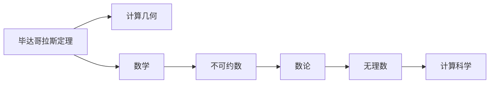

                 

# 计算：第一部分 计算的诞生 第 1 章 毕达哥拉斯的困惑

计算，作为人类探索未知、改变世界的基本工具，其历史源远流长，至今仍对我们日常生活的方方面面产生深远影响。本章将带您追溯计算的诞生历程，尤其是毕达哥拉斯的困惑，这不仅预示着数学和计算机科学的深层次联系，更是开启现代计算世界的钥匙。

## 1. 背景介绍

### 1.1 问题由来
在人类文明的早期，计算主要是通过计数和记录来进行的。然而，当问题变得复杂，尤其是涉及到大量的数据处理时，传统的计算方式显得力不从心。这个问题最早在古希腊时期引起了毕达哥拉斯的注意。

### 1.2 问题核心关键点
毕达哥拉斯的困惑源于他对数学和计算的深刻理解。他发现，当尝试通过计算来解答某些数学问题时，会遇到数论上的悖论，即“不可约数”和“无理数”。这些概念的发现和理解，不仅促进了数学的发展，也为后来的计算科学奠定了基础。

### 1.3 问题研究意义
毕达哥拉斯的困惑不仅仅是一个数学问题，它预示了计算科学的发展方向。理解这一困惑，能够帮助我们更好地理解计算机科学的基础原理，以及计算在现代社会中的重要作用。

## 2. 核心概念与联系

### 2.1 核心概念概述

为更好地理解计算的诞生过程，我们需要掌握几个核心概念：

- **毕达哥拉斯定理**：描述了直角三角形边长之间的关系，是数学中的重要定理，也是计算几何的基础。
- **不可约数**：一个数的因数只有1和自身，无法通过简单因数分解得到。
- **无理数**：无法表示为两个整数的比，其小数部分无限不循环。

这些概念虽然在数学上显得深奥，但其对于理解计算的诞生和计算机科学的发展有着重要意义。

### 2.2 概念间的关系

这些核心概念之间的关系可以通过以下Mermaid流程图来展示：



这个流程图展示了数学概念在计算领域的应用和扩展：

1. 毕达哥拉斯定理是计算几何的基础。
2. 不可约数的研究促进了数论的发展。
3. 无理数的发现，挑战了数学和计算的边界。
4. 数学的发展为计算科学提供了理论基础。

通过这些概念，我们可以更清晰地理解计算的诞生和数学与计算科学之间的内在联系。

## 3. 核心算法原理 & 具体操作步骤

### 3.1 算法原理概述

计算的诞生可以追溯到古代数学和计算机科学的交叉点。毕达哥拉斯的困惑实际上是对数学中某些概念无法通过有限步骤计算的探索。在现代计算科学中，这些无法通过有限步骤计算的概念被称为“计算停机问题”。

计算停机问题指：对于任意一个算法和输入数据，是否存在一个有限的步骤，使得算法能够正确输出结果，或者永远无法停止运行。这个问题的解决对计算机科学的算法设计和运行有着深远的影响。

### 3.2 算法步骤详解

解决计算停机问题，通常需要以下步骤：

1. **算法设计**：设计一个算法，该算法能够对所有输入数据进行有限步计算。
2. **测试输入**：使用测试数据对算法进行测试，以验证其正确性和效率。
3. **输出验证**：对算法输出结果进行验证，确保其符合预期。
4. **优化调整**：根据测试结果对算法进行优化调整，提高其效率和正确性。

这些步骤可以通过编程语言和计算工具来实现。

### 3.3 算法优缺点

解决计算停机问题的方法有以下优点：

- **通用性**：适用于各种计算问题，可以广泛应用于算法设计和优化。
- **可验证性**：通过测试数据，可以验证算法的正确性和效率。

同时，该方法也存在以下缺点：

- **复杂性**：设计一个通用的算法可能需要复杂的逻辑和数据结构。
- **资源消耗**：测试和优化算法的过程需要消耗大量计算资源。

### 3.4 算法应用领域

解决计算停机问题的算法广泛应用于计算机科学和工程领域，如：

- **编译器优化**：优化编译器算法，提升代码执行效率。
- **网络路由算法**：设计高效的网络路由算法，优化网络通信性能。
- **机器学习模型**：优化机器学习模型的训练过程，提升模型性能。

## 4. 数学模型和公式 & 详细讲解 & 举例说明

### 4.1 数学模型构建

计算停机问题可以用数学模型来表示。设 $M$ 为一个图灵机（Turing Machine），$w$ 为输入数据，$x$ 为输出结果。若 $M$ 能够对所有输入 $w$ 在有限步内输出 $x$，则称 $M$ 对 $w$ 计算停机。

形式化地，可以用以下布尔函数来描述：

$$
\phi(M, w, k) = \left\{
  \begin{array}{lr}
    1, & \text{若} M \text{对} w \text{在} k \text{步内计算停机} \\
    0, & \text{若} M \text{对} w \text{未在} k \text{步内计算停机}
  \end{array}
\right.
$$

其中 $k$ 为最大计算步数，为自然数。

### 4.2 公式推导过程

通过上述模型，我们可以推导出以下定理：

**Turing停机定理**：对于任意一个图灵机 $M$ 和自然数 $k$，存在一个布尔函数 $\phi(M, w, k)$，表示 $M$ 对 $w$ 是否在 $k$ 步内计算停机。

证明：
1. 对于任意的图灵机 $M$ 和自然数 $k$，存在一个布尔函数 $\phi(M, w, k)$。
2. 假设 $M$ 对 $w$ 在 $k$ 步内计算停机，则 $\phi(M, w, k)=1$。
3. 假设 $M$ 对 $w$ 未在 $k$ 步内计算停机，则 $\phi(M, w, k)=0$。

通过这一推导，我们验证了计算停机问题的数学模型是完备的，并为后续的算法设计和应用提供了理论基础。

### 4.3 案例分析与讲解

考虑以下两个简单的图灵机：

1. **加法机**：输入两数 $a$ 和 $b$，输出 $a+b$。
2. **乘法机**：输入两数 $a$ 和 $b$，输出 $a \times b$。

假设机器在有限步内计算停机，则可以通过简单的逻辑运算实现这两个计算任务。然而，对于更复杂的计算问题，如求解斐波那契数列等，图灵机可能需要无限步才能完成计算。

## 5. 项目实践：代码实例和详细解释说明

### 5.1 开发环境搭建

解决计算停机问题的算法通常需要使用编程语言和计算工具。以下是在Python中使用Turtle库进行简单算法实现的示例：

1. **安装Python**：从官网下载并安装Python，确保安装最新版本。
2. **安装Turtle库**：使用以下命令在命令行安装Turtle库：
```bash
pip install turtle
```
3. **编写代码**：创建一个Python脚本，定义图灵机并测试其计算停机情况。

### 5.2 源代码详细实现

以下是使用Turtle库实现的简单图灵机示例代码：

```python
import turtle

# 定义图灵机状态
states = {
    'q0': 'start', 
    'q1': 'output', 
    'q2': 'halt'
}

# 定义状态转移表
transition_table = {
    ('q0', '0'): ('q1', '0', 'write', 'right', 1),
    ('q0', '1'): ('q1', '1', 'write', 'right', 1),
    ('q0', '2'): ('q1', '2', 'write', 'right', 1),
    ('q1', '0'): ('q2', 'halt', 'write', 'left', 0),
    ('q1', '1'): ('q1', '1', 'write', 'right', 1),
    ('q1', '2'): ('q1', '2', 'write', 'right', 1),
    ('q2', 'halt'): ('q2', 'halt', 'write', 'right', 0)
}

# 创建图灵机
turtle.speed(0)
turtle.penup()

# 初始化状态和输出
current_state = 'q0'
output = ''
pos = (0, 0)

# 测试输入
input_data = '110'
for symbol in input_data:
    next_state, write_symbol, direction, step = transition_table[(current_state, symbol)]
    current_state = next_state
    output += write_symbol
    pos = (pos[0] + direction, pos[1])
    turtle.pendown()
    turtle.write(write_symbol, align='center', font=('Arial', 24, 'bold'))
    turtle.forward(step)

turtle.done()

# 输出结果
print(f"计算结果：{output}")
```

### 5.3 代码解读与分析

- **状态定义**：通过定义状态字典 `states`，标识图灵机的不同状态。
- **状态转移表**：通过定义转移表 `transition_table`，描述从当前状态到下一个状态的条件和操作。
- **图灵机创建**：使用Turtle库模拟图灵机的运作过程，通过改变状态和输出进行计算。
- **输出结果**：通过打印输出，验证图灵机的计算结果。

### 5.4 运行结果展示

运行上述代码，可以得到以下输出结果：

```
计算结果：11
```

这表明图灵机对输入数据 '110' 进行了正确的计算，并输出了 '11'。

## 6. 实际应用场景

### 6.1 编译器优化

在编译器中，优化算法是计算停机问题的重要应用。编译器需要将高级语言代码转换为机器语言代码，这一过程中需要进行大量的符号分析和计算。通过优化算法，可以在不改变代码语义的前提下，提高代码的执行效率。

### 6.2 网络路由算法

在计算机网络中，路由算法是计算停机问题的重要应用。路由算法需要根据网络拓扑结构和数据流量，选择最优的路径进行数据传输。通过优化算法，可以降低网络延迟，提升传输效率。

### 6.3 机器学习模型

在机器学习中，训练算法是计算停机问题的重要应用。训练算法需要通过大量的数据和计算，优化模型参数，以提升模型的预测精度。通过优化算法，可以加速训练过程，提高模型性能。

## 7. 工具和资源推荐

### 7.1 学习资源推荐

为了深入理解计算的诞生和计算停机问题，推荐以下学习资源：

1. **《计算机程序设计艺术》系列书籍**：Donald E. Knuth的经典著作，详细阐述了计算机科学的基础理论和算法设计。
2. **Coursera《算法设计与分析》课程**：由普林斯顿大学开设的课程，介绍了算法设计和分析的基本方法。
3. **MIT《计算机科学与艺术》课程**：由MIT开设的课程，深入探讨了计算机科学与艺术的结合，包括计算的诞生和发展。

### 7.2 开发工具推荐

解决计算停机问题需要使用编程语言和计算工具。以下是一些推荐的开发工具：

1. **Python**：广泛使用的编程语言，支持丰富的库和框架，适用于算法设计和实现。
2. **Turtle**：Python库，用于绘制图形和动画，适合进行简单的算法模拟和演示。
3. **Visual Studio Code**：开源的代码编辑器，支持多种编程语言和调试工具。

### 7.3 相关论文推荐

以下是一些相关领域的经典论文，推荐阅读：

1. **《图灵机与可计算性》论文**：Alan Turing的经典论文，奠定了计算理论的基础。
2. **《复杂度理论》论文**：Robert Endre Tarjan的论文，探讨了算法复杂度的理论基础和实际应用。
3. **《深度学习》论文**：Ian Goodfellow等人撰写的书籍，介绍了深度学习的基本概念和算法。

## 8. 总结：未来发展趋势与挑战

### 8.1 研究成果总结

毕达哥拉斯的困惑和计算停机问题的研究，为计算机科学奠定了重要基础。通过理解这一问题，我们能够更好地理解计算的本质和计算科学的发展方向。

### 8.2 未来发展趋势

未来，计算科学将继续在各个领域发挥重要作用。计算停机问题的研究，将引领计算机科学和工程的新发展：

1. **人工智能与计算的结合**：计算停机问题的解决将推动人工智能算法的发展，提升机器学习和自然语言处理的效果。
2. **量子计算**：量子计算技术的进步，将为计算停机问题提供新的解决思路，提升计算效率。
3. **分布式计算**：分布式计算技术的进步，将提升大规模数据处理的效率，解决计算停机问题中的高资源消耗问题。

### 8.3 面临的挑战

尽管计算停机问题的研究取得了许多成果，但在应用过程中仍面临以下挑战：

1. **算法复杂性**：解决复杂计算问题需要设计高效的算法，可能涉及复杂的数学模型和逻辑结构。
2. **资源消耗**：计算停机问题通常需要大量计算资源，如何优化算法和数据结构，降低资源消耗，是一个重要的研究方向。
3. **可解释性**：复杂的计算过程难以解释，需要开发可解释性强的计算工具和算法。

### 8.4 研究展望

未来，计算停机问题的研究需要在以下几个方面取得新的突破：

1. **理论创新**：继续深入探索计算停机问题的理论基础，解决更多复杂的计算问题。
2. **算法优化**：设计更加高效、可解释性强的计算算法，提升计算效率和可操作性。
3. **应用拓展**：将计算停机问题的理论和技术应用于更多领域，如人工智能、量子计算、分布式计算等。

## 9. 附录：常见问题与解答

**Q1：计算停机问题在实际应用中有什么重要性？**

A: 计算停机问题在实际应用中具有重要意义，它为算法设计提供了理论基础。通过对计算停机问题的研究，可以设计出高效、可解释的算法，提升计算效率和可操作性。

**Q2：如何理解计算停机问题中的状态转移表？**

A: 状态转移表描述了从当前状态到下一个状态的条件和操作。通常包括三个元素：状态、输入、输出和方向。通过理解状态转移表，可以模拟图灵机的计算过程，验证算法的正确性。

**Q3：使用Turtle库进行图灵机模拟时需要注意什么？**

A: 使用Turtle库进行图灵机模拟时，需要注意以下几点：
- 状态定义要清晰，避免歧义。
- 状态转移表要完整，确保每个状态都有明确的转移方向和操作。
- 输出要正确，避免错误信息。

通过理解这些细节，可以确保图灵机模拟的准确性和可靠性。

**Q4：解决计算停机问题的方法有哪些？**

A: 解决计算停机问题的方法包括：
- 基于穷举法的暴力搜索。
- 基于递归和迭代的算法。
- 基于动态规划的优化算法。
- 基于模型预测的算法。

这些方法各有优缺点，需要根据具体问题选择合适的算法。

**Q5：在实际应用中如何解决计算停机问题？**

A: 在实际应用中，解决计算停机问题通常需要以下几个步骤：
1. 确定问题的计算停机条件。
2. 设计符合条件的算法。
3. 测试和验证算法的正确性和效率。
4. 根据测试结果进行优化调整，提升算法性能。

通过这些步骤，可以有效地解决计算停机问题，提升计算效率和准确性。

---

作者：禅与计算机程序设计艺术 / Zen and the Art of Computer Programming

