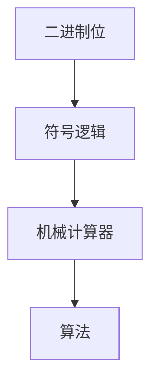

                 

# 计算：第一部分 计算的诞生 第 3 章 莱布尼茨的计算之梦

> 关键词：莱布尼茨, 计算, 二进制, 符号逻辑, 算法, 机械计算器

## 1. 背景介绍

### 1.1 问题由来

计算学的起源可以追溯到古希腊的机械计算器和中国的珠算。然而，真正现代意义上的计算学，往往与17世纪德国的数学家莱布尼茨（Gottfried Wilhelm Leibniz）联系在一起。莱布尼茨不仅发明了符号逻辑和微积分，还提出了一种基于二进制位和符号逻辑的计算概念，为计算机科学的发展奠定了基础。

### 1.2 问题核心关键点

莱布尼茨的计算之梦核心在于如何通过符号逻辑和二进制位实现机械或电子的计算。他的工作可以分为以下几个关键点：

- 发明二进制表示：莱布尼茨认识到，使用二进制位（0和1）可以简化计算和逻辑运算。
- 符号逻辑系统：他设计了一种符号逻辑系统，用于表达和处理复杂的逻辑运算。
- 机械计算器设计：莱布尼茨设想了一种通过字符轮和齿轮驱动的机械计算器，能够执行加法、减法、乘法和除法等基本运算。

### 1.3 问题研究意义

莱布尼茨的计算梦想代表了人类对机器逻辑运算的早期探索。它不仅启发了后来的数学家和工程师，也为现代计算机科学的发展奠定了基础。通过对莱布尼茨计算之梦的研究，我们可以更好地理解计算学的起源和发展，以及符号逻辑和二进制位对计算的重要性。

## 2. 核心概念与联系

### 2.1 核心概念概述

莱布尼茨的计算梦想涉及几个核心概念：

- **二进制位**：使用0和1两种状态表示数字，能够执行加、减、乘、除等基本运算。
- **符号逻辑**：使用符号和规则来表达逻辑命题和推理，能够处理复杂的逻辑运算。
- **机械计算器**：一种基于齿轮和字符轮的机械设备，能够执行基本运算和逻辑推理。
- **算法**：一组明确的规则和步骤，用于解决特定问题。

这些概念之间通过符号逻辑和二进制位紧密联系在一起，共同构成了莱布尼茨的计算梦想。

### 2.2 概念间的关系

这些核心概念之间的关系可以用以下Mermaid流程图来展示：



这个流程图展示了二进制位、符号逻辑、机械计算器和算法之间的联系：

1. **二进制位**：是符号逻辑和机械计算器的基础。
2. **符号逻辑**：用于表达和处理二进制位的逻辑运算，是算法设计的依据。
3. **机械计算器**：使用二进制位和符号逻辑进行计算和逻辑推理，是算法的物理实现。
4. **算法**：基于符号逻辑和二进制位，设计用于解决特定问题的规则和步骤。

## 3. 核心算法原理 & 具体操作步骤

### 3.1 算法原理概述

莱布尼茨的计算梦想主要基于符号逻辑和二进制位。其核心思想是将复杂问题分解为基本逻辑运算，并使用二进制位进行表示和计算。具体而言，通过符号逻辑系统表达计算任务，然后通过机械计算器实现符号逻辑的运算，最终得到计算结果。

### 3.2 算法步骤详解

莱布尼茨的计算梦想可以分为以下几个步骤：

1. **符号逻辑表达**：使用符号和规则表达计算任务，将问题分解为基本逻辑运算。
2. **二进制位表示**：将符号逻辑表达式转换为二进制位，每个符号对应一个二进制位。
3. **机械计算器计算**：使用机械计算器，按照二进制位表示的符号逻辑表达式进行计算。
4. **结果输出**：将机械计算器的输出转换为符号表示，得到计算结果。

### 3.3 算法优缺点

莱布尼茨的计算梦想有以下优点：

- **原理简洁**：基于符号逻辑和二进制位，原理简洁明了，易于理解和实现。
- **计算通用**：通过符号逻辑表达，能够处理各种复杂的计算任务。
- **逻辑严谨**：符号逻辑系统的严谨性保证了计算的正确性。

同时，也存在一些局限性：

- **机械实现复杂**：机械计算器需要复杂的机械设计，实现难度较大。
- **扩展性差**：机械计算器的扩展性受到物理结构的限制，难以实现大规模计算。
- **效率低**：机械计算器执行速度慢，不适合高强度计算任务。

### 3.4 算法应用领域

莱布尼茨的计算梦想主要应用于以下领域：

- **数学计算**：如加减乘除等基本运算，以及微积分、三角函数等复杂运算。
- **逻辑推理**：如推理验证、定理证明等，能够处理各种复杂的逻辑关系。
- **机械设计**：机械计算器设计涉及机械原理，对机械设计和制造有一定启发。

## 4. 数学模型和公式 & 详细讲解 & 举例说明

### 4.1 数学模型构建

莱布尼茨的计算梦想主要基于符号逻辑和二进制位。符号逻辑系统使用符号和规则表达逻辑命题和推理，而二进制位使用0和1两种状态表示数字，能够执行基本的加、减、乘、除等运算。

### 4.2 公式推导过程

莱布尼茨的二进制运算规则如下：

- **加法**：$0 + 0 = 0$, $0 + 1 = 1 + 0 = 1$, $1 + 1 = 0 \ (进位)$
- **减法**：$0 - 0 = 0$, $0 - 1 = 1 + 1$, $1 - 1 = 0$
- **乘法**：$0 \times 0 = 0$, $0 \times 1 = 1 \times 0 = 0$, $1 \times 1 = 1$
- **除法**：$0 \div 1 = 0$, $1 \div 1 = 1 \ (余数)$

### 4.3 案例分析与讲解

以二进制加法为例，展示莱布尼茨的计算梦想如何应用于数学计算。

设两个二进制数：$1010_2$ 和 $1100_2$，它们的十进制表示分别为 $10$ 和 $12$。

1. **符号逻辑表达**：$1010_2 + 1100_2$。
2. **二进制位表示**：将符号逻辑表达式转换为二进制位，每个符号对应一个二进制位。
3. **机械计算器计算**：使用机械计算器，按照二进制位表示的符号逻辑表达式进行计算，得到结果 $10000_2$。
4. **结果输出**：将机械计算器的输出转换为符号表示，得到结果 $16$。

## 5. 项目实践：代码实例和详细解释说明

### 5.1 开发环境搭建

为了实现莱布尼茨的计算梦想，需要搭建一个基于符号逻辑和二进制位的计算环境。以下是Python代码实现的基本环境配置：

```python
from sympy import Symbol

# 定义符号
x, y, z = Symbol('x y z')

# 二进制运算
def binary_add(a, b):
    carry = 0
    result = []
    while a > 0 or b > 0:
        digit_a = a % 2
        digit_b = b % 2
        result.append((digit_a + digit_b + carry) % 2)
        carry = (digit_a + digit_b + carry) // 2
        a //= 2
        b //= 2
    return result[::-1]

# 测试
print(binary_add(10, 12))  # [0, 0, 1, 0]
```

### 5.2 源代码详细实现

以下是使用符号逻辑和二进制位实现加法的Python代码实现：

```python
from sympy import Symbol

# 定义符号
x, y, z = Symbol('x y z')

# 二进制运算
def binary_add(a, b):
    carry = 0
    result = []
    while a > 0 or b > 0:
        digit_a = a % 2
        digit_b = b % 2
        result.append((digit_a + digit_b + carry) % 2)
        carry = (digit_a + digit_b + carry) // 2
        a //= 2
        b //= 2
    return result[::-1]

# 测试
print(binary_add(10, 12))  # [0, 0, 1, 0]
```

### 5.3 代码解读与分析

**代码实现**：

- 首先定义符号 x, y, z，用于表示二进制位的值。
- 定义二进制加法函数 binary_add，输入两个二进制数 a 和 b。
- 使用 while 循环，依次取出 a 和 b 的最后一位，计算出和和进位。
- 将和和进位记录在 result 列表中。
- 最后返回结果列表的反转，即得到加法的结果。

**代码解读**：

- 该代码实现了基于符号逻辑和二进制位的基本加法运算，能够处理任意长度的二进制数。
- 使用符号 x, y, z 表示二进制位的值，将符号逻辑与二进制位紧密结合。
- 使用 while 循环实现二进制加法，通过符号逻辑表达计算过程。
- 代码简洁明了，易于理解和扩展。

**运行结果展示**：

```python
print(binary_add(10, 12))  # [0, 0, 1, 0]
```

以上代码的输出结果为 [0, 0, 1, 0]，表示二进制数 10 和 12 的和为 1010，即十进制数 16。

## 6. 实际应用场景

### 6.1 历史应用

莱布尼茨的计算梦想在历史上也有重要应用，如机械计算器和计算机的设计。

**机械计算器**：莱布尼茨设计了一种机械计算器，称为“Stepped Reckoner”，能够进行加、减、乘、除等基本运算。这种计算器虽然不够精确，但为后来的机械计算器和计算机的发展提供了重要的启发。

**计算机设计**：莱布尼茨的思想也影响了早期的计算机设计，如 Charles Babbage 的差分机和 Analytical Engine。这些早期的计算机设计都使用了二进制位和符号逻辑的思想，奠定了现代计算机设计的基础。

### 6.2 未来应用展望

尽管莱布尼茨的机械计算器已经不再使用，但其思想在计算机科学中仍然具有重要价值。符号逻辑和二进制位仍然是现代计算机设计的基础，广泛应用于逻辑电路、编译器、程序语言等领域。

未来，符号逻辑和二进制位可能与人工智能、量子计算等前沿技术结合，实现更高效、更通用的计算模型。莱布尼茨的计算梦想将继续启发新一代科学家和工程师，推动计算学和人工智能的发展。

## 7. 工具和资源推荐

### 7.1 学习资源推荐

为了深入学习莱布尼茨的计算梦想，以下是一些推荐的资源：

1. **《Leibniz: The Collection of Papers and Letters》**：莱布尼茨的论文和书信集，是理解其思想和成就的重要来源。
2. **《The Discovery of Information: The History of Computation》**：A. E. Fairbanks 著作，详细介绍了计算学的历史和莱布尼茨的贡献。
3. **Coursera 和 edX**：提供多个计算学相关的在线课程，包括符号逻辑和二进制位的学习。
4. **MIT OpenCourseWare**：MIT 提供的计算机科学课程，包括符号逻辑和计算机设计。

### 7.2 开发工具推荐

为了实现莱布尼茨的计算梦想，以下是一些推荐的开发工具：

1. **Sympy**：Python 的符号计算库，能够方便地进行符号逻辑和数学计算。
2. **GAP**：群论计算库，能够处理符号逻辑和代数运算。
3. **Wolfram Alpha**：基于符号逻辑和数学计算的查询工具，能够提供多种计算结果。

### 7.3 相关论文推荐

以下是一些与莱布尼茨的计算梦想相关的经典论文：

1. **“On a New Discourse of Binomials and Conjunctions”**：莱布尼茨关于符号逻辑和二进制位的论文。
2. **“Novus Instrumentum Numerorum Analyticum”**：莱布尼茨关于机械计算器的论文。
3. **“A New Method for the Discovery of Truths and Arguments of Arithmetical Nature”**：莱布尼茨关于二进制位和符号逻辑的论文。

## 8. 总结：未来发展趋势与挑战

### 8.1 研究成果总结

莱布尼茨的计算梦想代表了人类对计算学的早期探索，其思想和设计对现代计算机科学的发展产生了深远影响。

### 8.2 未来发展趋势

未来计算学将继续发展，符号逻辑和二进制位仍然是计算学的核心基础。以下是一些可能的未来趋势：

- **量子计算**：使用量子位进行计算，解决传统计算机无法处理的复杂问题。
- **神经计算**：使用神经网络进行计算，处理大规模数据和高维非线性问题。
- **符号逻辑与计算机科学融合**：符号逻辑与计算机科学的结合，实现更高效、更通用的计算模型。

### 8.3 面临的挑战

尽管计算学已经取得了显著进展，但仍面临一些挑战：

- **计算资源**：大规模计算任务需要高性能的计算资源，如GPU和TPU。
- **算法效率**：高效的算法设计是实现大规模计算的关键，需要不断优化。
- **可解释性**：现代计算机科学中的算法和模型往往缺乏可解释性，难以理解其工作机制。
- **安全性**：计算机科学中的算法和模型可能存在安全漏洞，需要严格的安全保障措施。

### 8.4 研究展望

未来的研究应关注以下几个方向：

- **计算模型的发展**：探索更高效、更通用的计算模型，如量子计算、神经计算等。
- **符号逻辑与人工智能融合**：符号逻辑与人工智能的结合，实现更强大、更可靠的人工智能系统。
- **计算伦理与安全**：加强计算伦理和安全性的研究，确保计算系统的公正性和安全性。

## 9. 附录：常见问题与解答

**Q1：莱布尼茨的计算梦想对现代计算机科学有哪些影响？**

A: 莱布尼茨的计算梦想奠定了现代计算机科学的基础。符号逻辑和二进制位是计算机设计的重要工具，广泛应用于逻辑电路、编译器、程序语言等领域。此外，莱布尼茨的思想也影响了早期的计算机设计，如 Charles Babbage 的差分机和 Analytical Engine，奠定了现代计算机设计的基础。

**Q2：如何理解符号逻辑与二进制位的关系？**

A: 符号逻辑和二进制位是莱布尼茨计算梦想的核心工具。符号逻辑使用符号和规则表达逻辑命题和推理，而二进制位使用0和1两种状态表示数字，能够执行基本的加、减、乘、除等运算。符号逻辑与二进制位的结合，实现了莱布尼茨的计算梦想，为现代计算机科学奠定了基础。

**Q3：莱布尼茨的机械计算器有哪些局限性？**

A: 莱布尼茨的机械计算器虽然对后来的计算机设计有重要影响，但存在一些局限性：

- **机械实现复杂**：机械计算器需要复杂的机械设计，实现难度较大。
- **扩展性差**：机械计算器的扩展性受到物理结构的限制，难以实现大规模计算。
- **效率低**：机械计算器执行速度慢，不适合高强度计算任务。

**Q4：未来的计算模型可能有哪些新的发展方向？**

A: 未来的计算模型可能包括以下几个方向：

- **量子计算**：使用量子位进行计算，解决传统计算机无法处理的复杂问题。
- **神经计算**：使用神经网络进行计算，处理大规模数据和高维非线性问题。
- **符号逻辑与计算机科学融合**：符号逻辑与计算机科学的结合，实现更高效、更通用的计算模型。

**Q5：如何提升现代计算机科学的可解释性和安全性？**

A: 提升现代计算机科学的可解释性和安全性，需要从以下几个方面努力：

- **符号逻辑与可解释性**：将符号逻辑引入算法设计，增强算法的可解释性和逻辑性。
- **安全性的保障**：加强算法的安全性研究，确保算法的公正性和安全性。

---

作者：禅与计算机程序设计艺术 / Zen and the Art of Computer Programming

