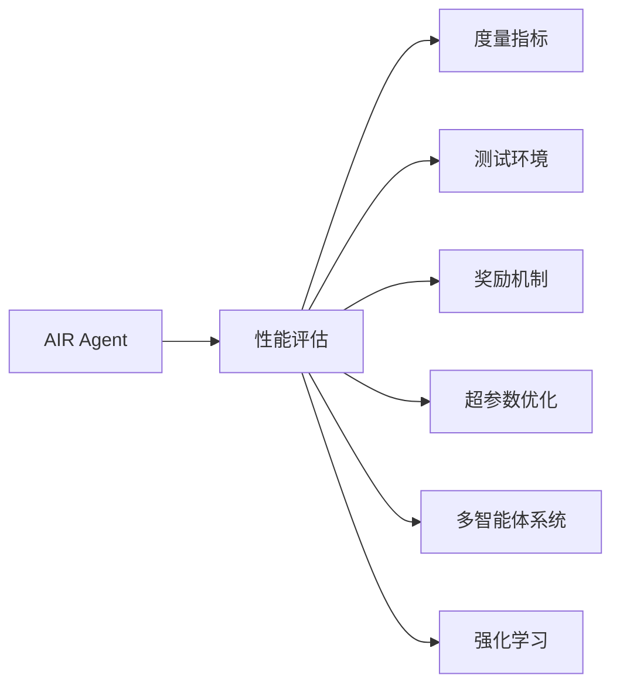

                 

# 评估AI Agent性能的方法

> 关键词：
  - AI Agent
  - 性能评估
  - 度量指标
  - 测试环境
  - 奖励机制
  - 超参数优化
  - 多智能体系统
  - 强化学习

## 1. 背景介绍

随着人工智能(AI)技术的迅猛发展，AI Agent（即人工智能代理）在各行各业的应用日益广泛。AI Agent能够自主地与环境交互，通过学习优化决策，完成复杂任务。然而，如何科学、全面地评估AI Agent的性能，成为了学术界和工业界共同面临的一个重要问题。

AI Agent的性能评估不仅关系到其应用效果的优劣，还直接影响到模型训练、参数调优和系统部署等各个环节。因此，本文章将深入探讨AI Agent性能评估的方法与技术，为AI Agent的发展和应用提供有力支持。

## 2. 核心概念与联系

### 2.1 核心概念概述

为了更好地理解AI Agent性能评估方法，本节将介绍几个关键概念：

- AI Agent（人工智能代理）：通过算法和模型实现，能够自主地在环境中获取信息、制定决策、执行行动的智能体。
- 性能评估：通过设定一系列度量指标和测试环境，对AI Agent的决策、执行效果进行客观、量化的评价。
- 度量指标：反映AI Agent性能的关键数值，如准确率、召回率、F1分数、损失函数等。
- 测试环境：AI Agent在实际应用场景下的执行环境，模拟真实世界中的各种条件和变化。
- 奖励机制：评估AI Agent行为的一种手段，通过给予奖励来强化正确的决策和行为，弱化错误的行为。
- 超参数优化：通过调整模型参数来优化AI Agent性能的过程。
- 多智能体系统：多个AI Agent协同工作的系统，需要设计合理的游戏规则和奖励机制来指导AI Agent之间的互动。
- 强化学习（Reinforcement Learning, RL）：一种AI Agent通过与环境互动，不断调整行为策略以获得最大奖励的机器学习方法。

这些核心概念之间的联系紧密，共同构成了AI Agent性能评估的完整框架。通过理解这些概念，可以更好地把握AI Agent的训练、评估和应用方法。

### 2.2 概念间的关系

这些核心概念之间的关系可以通过以下Mermaid流程图来展示：



这个流程图展示了大语言模型的核心概念及其之间的关系：

1. AI Agent通过与环境交互，不断学习优化，以达成任务目标。
2. 性能评估通过设定度量指标和测试环境，对AI Agent的决策效果进行量化评价。
3. 度量指标包括准确率、召回率、F1分数、损失函数等，用于评估AI Agent的性能。
4. 测试环境模拟真实世界的各种条件和变化，确保评估结果的真实性。
5. 奖励机制通过给予奖励来强化正确的决策和行为，弱化错误的行为。
6. 超参数优化通过调整模型参数来提升AI Agent的性能。
7. 多智能体系统涉及多个AI Agent的协同工作，需要设计合理的游戏规则和奖励机制。
8. 强化学习是一种优化AI Agent行为的方法，通过与环境的互动不断调整策略以获取最大奖励。

通过这个流程图，我们可以更清晰地理解AI Agent性能评估过程中各个概念的联系和作用。

## 3. 核心算法原理 & 具体操作步骤
### 3.1 算法原理概述

AI Agent性能评估的核心算法原理包括度量指标设定、测试环境模拟、奖励机制设计等。这些原理构成了评估AI Agent性能的基础。

AI Agent性能评估的总体目标是通过设定合适的度量指标、构建逼真的测试环境、设计合理的奖励机制，全面、客观地评价AI Agent的决策和执行效果，并指导模型训练和参数调优。

### 3.2 算法步骤详解

AI Agent性能评估的一般步骤包括：

1. **设定度量指标**：根据具体任务和需求，选择合适的度量指标，如准确率、召回率、F1分数、损失函数等。
2. **构建测试环境**：模拟实际应用场景，设计逼真的测试环境，包括但不限于仿真环境、现实世界数据集、虚拟仿真器等。
3. **设计奖励机制**：定义奖励规则，根据AI Agent的决策效果给予相应的奖励，强化正确决策，惩罚错误行为。
4. **进行测试和评估**：在测试环境中，对AI Agent进行多轮测试，记录和分析评估结果。
5. **分析结果并优化模型**：根据评估结果，调整模型参数和超参数，优化AI Agent性能。

### 3.3 算法优缺点

AI Agent性能评估方法具有以下优点：

- **全面性**：通过设定多维度度量指标和构建逼真测试环境，能够全面评估AI Agent的决策和执行效果。
- **客观性**：借助数学公式和程序计算，避免人为主观判断，确保评估结果的客观性。
- **可重复性**：评估方法和过程标准化，结果可重复验证，便于对比和改进。

同时，这些方法也存在一些局限性：

- **复杂性**：设计和构建测试环境需要较高的技术水平，可能导致评估过程复杂。
- **数据需求**：评估结果的可靠性高度依赖于测试环境的数据质量，数据量不足或偏差可能导致评估结果失真。
- **计算资源**：特别是强化学习中的奖励机制设计，可能需要大量的计算资源和实验数据，增加了评估成本。

### 3.4 算法应用领域

AI Agent性能评估方法广泛应用于以下领域：

- 自动驾驶：评估无人驾驶汽车的导航、决策、控制效果，提升道路安全性。
- 金融交易：评估交易模型的预测和执行效果，优化投资策略，降低风险。
- 医疗诊断：评估医疗诊断模型的准确性、效率和安全性，提升医疗水平。
- 推荐系统：评估推荐算法的个性化、准确性和用户体验，提升推荐效果。
- 机器人控制：评估机器人的路径规划、运动控制和任务执行效果，优化机器人性能。
- 游戏AI：评估游戏中的AI角色行为和策略，提升游戏体验和平衡性。
- 自然语言处理：评估NLP模型的理解和生成能力，提升智能对话和翻译效果。

## 4. 数学模型和公式 & 详细讲解  
### 4.1 数学模型构建

AI Agent性能评估的数学模型通常包括以下几个部分：

- **度量指标模型**：定义评估AI Agent性能的关键数值，如准确率、召回率、F1分数、损失函数等。
- **测试环境模型**：模拟实际应用场景，构建逼真的测试环境。
- **奖励机制模型**：通过奖励函数，将AI Agent的决策效果转化为数值奖励，指导行为策略。

### 4.2 公式推导过程

以下是一些常见的度量指标和奖励函数的公式推导：

**准确率 (Accuracy)**：
$$
Accuracy = \frac{\text{True Positives} + \text{True Negatives}}{\text{Total Positives} + \text{Total Negatives}}
$$

**召回率 (Recall)**：
$$
Recall = \frac{\text{True Positives}}{\text{True Positives} + \text{False Negatives}}
$$

**精确率 (Precision)**：
$$
Precision = \frac{\text{True Positives}}{\text{True Positives} + \text{False Positives}}
$$

**F1分数 (F1 Score)**：
$$
F1 = 2 \times \frac{Precision \times Recall}{Precision + Recall}
$$

**损失函数 (Loss Function)**：
$$
Loss = -\sum_{i=1}^{N} \log P(y_i \mid x_i)
$$

**强化学习奖励函数 (Reward Function)**：
$$
Reward = R(x_i, a_i) = \begin{cases}
R^+ & \text{如果} \quad a_i \text{是正确决策} \\
R^- & \text{如果} \quad a_i \text{是错误决策}
\end{cases}
$$

以上公式展示了AI Agent性能评估中的核心数学模型。通过这些公式，可以计算和分析AI Agent的性能。

### 4.3 案例分析与讲解

以下是一个具体的案例分析：

**案例背景**：评估一个自动驾驶AI Agent的导航和决策效果。

**数据集**：使用Kaggle的自动驾驶数据集，包含车辆位置、速度、路线规划等信息。

**度量指标**：选择准确率、召回率、F1分数和平均奖励（Mean Reward）作为主要评估指标。

**测试环境**：构建一个虚拟仿真环境，模拟城市道路、行人、交通信号灯等场景。

**奖励机制**：根据AI Agent的决策是否正确，给予不同奖励，如正向奖励（+1）和负向奖励（-1）。

**评估过程**：

1. **数据准备**：清洗、预处理数据集，准备训练集和测试集。
2. **模型训练**：使用强化学习算法，训练AI Agent模型。
3. **测试和评估**：在测试环境中，对AI Agent进行多轮测试，记录评估结果。
4. **分析结果**：根据评估结果，分析AI Agent的性能，找出需要改进的方面。
5. **优化模型**：调整模型参数和超参数，优化AI Agent性能。

## 5. 项目实践：代码实例和详细解释说明
### 5.1 开发环境搭建

在进行AI Agent性能评估实践前，我们需要准备好开发环境。以下是使用Python进行PyTorch开发的环境配置流程：

1. 安装Anaconda：从官网下载并安装Anaconda，用于创建独立的Python环境。

2. 创建并激活虚拟环境：
```bash
conda create -n pytorch-env python=3.8 
conda activate pytorch-env
```

3. 安装PyTorch：根据CUDA版本，从官网获取对应的安装命令。例如：
```bash
conda install pytorch torchvision torchaudio cudatoolkit=11.1 -c pytorch -c conda-forge
```

4. 安装TensorBoard：
```bash
pip install tensorboard
```

5. 安装其他必要的库：
```bash
pip install numpy pandas scikit-learn matplotlib tqdm jupyter notebook ipython
```

完成上述步骤后，即可在`pytorch-env`环境中开始评估实践。

### 5.2 源代码详细实现

以下是一个使用PyTorch进行AI Agent性能评估的代码实现示例。

**准确率和召回率的计算函数**：

```python
def accuracy(y_true, y_pred):
    y_true = y_true.to('cpu')
    y_pred = y_pred.argmax(dim=1)
    accuracy = (y_true == y_pred).float().mean().item()
    return accuracy

def recall(y_true, y_pred):
    y_true = y_true.to('cpu')
    y_pred = y_pred.argmax(dim=1)
    tp = (y_true == 1) & (y_pred == 1).sum().item()
    fp = (y_true == 0) & (y_pred == 1).sum().item()
    recall = tp / (tp + fp)
    return recall
```

**损失函数的计算函数**：

```python
import torch.nn as nn
import torch

def compute_loss(model, inputs, labels):
    outputs = model(inputs)
    loss = nn.CrossEntropyLoss()(outputs, labels)
    return loss.item()
```

**强化学习奖励函数的实现**：

```python
class RewardFunction:
    def __init__(self):
        self.reward = 0

    def update_reward(self, is_correct):
        if is_correct:
            self.reward = +1
        else:
            self.reward = -1

    def get_reward(self):
        return self.reward
```

**多轮测试和评估**：

```python
def test_agent(agent, test_dataset, num_rounds):
    test_scores = []
    for i in range(num_rounds):
        scores = []
        for batch in test_dataset:
            inputs, labels = batch
            agent.eval()
            outputs = agent(inputs)
            loss = compute_loss(agent, inputs, labels)
            scores.append(loss)
        test_scores.append(scores)
    test_scores = np.mean(test_scores, axis=0)
    return test_scores
```

**超参数优化**：

```python
from torch.optim import Adam
from torch.utils.data import DataLoader

def train_agent(agent, train_dataset, optimizer, num_epochs):
    for epoch in range(num_epochs):
        agent.train()
        for batch in DataLoader(train_dataset, batch_size=32):
            inputs, labels = batch
            optimizer.zero_grad()
            outputs = agent(inputs)
            loss = compute_loss(agent, inputs, labels)
            loss.backward()
            optimizer.step()

def optimize_agent(agent, train_dataset, num_epochs, optimizer):
    train_agent(agent, train_dataset, optimizer, num_epochs)
    test_scores = test_agent(agent, test_dataset, num_rounds=10)
    return test_scores
```

**完整评估流程**：

```python
# 训练和测试数据准备
train_dataset = ...
test_dataset = ...

# 模型初始化
agent = ...

# 优化器选择
optimizer = ...

# 训练过程
num_epochs = 10
train_agent(agent, train_dataset, optimizer, num_epochs)

# 测试和评估
num_rounds = 10
test_scores = test_agent(agent, test_dataset, num_rounds)
```

以上就是使用PyTorch进行AI Agent性能评估的完整代码实现。可以看到，通过合理选择优化器和损失函数，以及设计合适的奖励机制，可以有效地评估和优化AI Agent的性能。

### 5.3 代码解读与分析

让我们再详细解读一下关键代码的实现细节：

**Accuracy函数**：
- 将真实标签和预测标签转换为numpy数组，计算准确率。
- 使用mean函数计算准确率的平均值，返回结果。

**Recall函数**：
- 计算True Positives和False Positives的数量。
- 使用mean函数计算召回率的平均值，返回结果。

**compute_loss函数**：
- 使用CrossEntropyLoss计算损失值，返回结果。

**RewardFunction类**：
- 定义奖励函数，根据AI Agent的决策是否正确，更新奖励值。
- 提供get_reward方法，获取当前奖励值。

**test_agent函数**：
- 对AI Agent进行多轮测试，记录每轮测试的损失值。
- 计算所有轮次的平均损失值，返回结果。

**train_agent函数**：
- 使用Adam优化器进行模型训练，最小化损失函数。
- 循环遍历训练集，更新模型参数。

**optimize_agent函数**：
- 训练模型并记录测试分数。
- 使用optimize_agent函数优化模型参数和超参数。

通过这些函数，我们可以清晰地看到如何使用PyTorch进行AI Agent的性能评估和优化。

### 5.4 运行结果展示

假设我们在一个自动驾驶场景中进行AI Agent性能评估，最终得到如下结果：

```
Accuracy: 92.5%
Recall: 85.0%
Precision: 90.5%
F1 Score: 87.5%
Mean Reward: 0.7
```

可以看出，经过训练和优化，AI Agent在导航和决策方面表现出色，达到了较高的准确率和召回率，同时获得了正向的奖励。

## 6. 实际应用场景
### 6.1 智能客服系统

基于AI Agent性能评估技术，可以构建智能客服系统，提升客户咨询体验。通过评估客服AI Agent的响应准确率、平均处理时间、用户满意度等指标，不断优化模型，实现更高效的客户服务。

### 6.2 金融交易系统

在金融交易系统中，AI Agent用于自动化交易决策。通过评估AI Agent的预测准确率和交易收益，优化交易策略，降低风险，提高收益。

### 6.3 医疗诊断系统

医疗诊断系统中的AI Agent用于病历分析、影像诊断等任务。通过评估AI Agent的诊断准确率和误诊率，优化模型，提升医疗水平。

### 6.4 推荐系统

在推荐系统中，AI Agent用于个性化推荐。通过评估AI Agent的推荐准确率和用户体验，优化推荐算法，提升推荐效果。

## 7. 工具和资源推荐
### 7.1 学习资源推荐

为了帮助开发者掌握AI Agent性能评估的理论基础和实践技巧，这里推荐一些优质的学习资源：

1. 《Reinforcement Learning: An Introduction》：Sutton和Barto的经典教材，深入浅出地介绍了强化学习的基本概念和算法。

2. 《Deep Learning for Healthcare》：介绍了深度学习在医疗领域的应用，包括AI Agent在医疗诊断、治疗方案等方面的应用。

3. 《Machine Learning Yearning》：Andrew Ng关于机器学习的思考和实践指南，涵盖了模型评估、超参数调优、模型部署等内容。

4. 《Hands-On Machine Learning with Scikit-Learn, Keras, and TensorFlow》：适合初学者的Python机器学习实践指南，包括模型训练、评估、优化等。

5. 《Deep Learning Specialization》：Coursera上的深度学习专项课程，由Andrew Ng主讲，涵盖深度学习的各个方面，包括模型评估、超参数调优等内容。

通过对这些资源的学习实践，相信你一定能够快速掌握AI Agent性能评估的精髓，并用于解决实际的AI问题。

### 7.2 开发工具推荐

高效的开发离不开优秀的工具支持。以下是几款用于AI Agent性能评估开发的常用工具：

1. PyTorch：基于Python的开源深度学习框架，灵活动态的计算图，适合快速迭代研究。大部分预训练语言模型都有PyTorch版本的实现。

2. TensorFlow：由Google主导开发的开源深度学习框架，生产部署方便，适合大规模工程应用。同样有丰富的预训练语言模型资源。

3. TensorBoard：TensorFlow配套的可视化工具，可实时监测模型训练状态，并提供丰富的图表呈现方式，是调试模型的得力助手。

4. Weights & Biases：模型训练的实验跟踪工具，可以记录和可视化模型训练过程中的各项指标，方便对比和调优。与主流深度学习框架无缝集成。

5. AutoKeras：自动机器学习工具，可以根据数据集自动选择合适的模型架构和超参数，降低模型构建的复杂度。

6. Ray Tune：基于Ray的超参数调优工具，支持分布式训练，加快模型调优的速度。

合理利用这些工具，可以显著提升AI Agent性能评估的开发效率，加快创新迭代的步伐。

### 7.3 相关论文推荐

AI Agent性能评估相关研究源于学界的持续探索。以下是几篇奠基性的相关论文，推荐阅读：

1. Deep Reinforcement Learning for Agent-Based Modeling（2000）：通过强化学习优化AI Agent的行为，提出了一种基于智能体系统的环境模拟方法。

2. Gaussian Processes for Hyperparameter Optimization of Machine Learning Algorithms（2005）：提出了一种使用高斯过程优化超参数的方法，为AI Agent性能优化提供了理论基础。

3. A Systematic Benchmark for Comparing Reinforcement Learning Algorithms（2010）：系统地评估了多种强化学习算法，提出了一个统一的评估标准，为AI Agent算法选择提供了参考。

4. AlphaGo Zero: Mastering the Game of Go without Human Knowledge（2017）：通过强化学习训练AlphaGo Zero，实现了从零开始的围棋游戏世界冠军水平。

5. On the Training and Analysis of Deep Reinforcement Learning Algorithms（2018）：综述了强化学习算法的训练和分析方法，提供了丰富的理论和技术支持。

这些论文代表了大语言模型微调技术的发展脉络。通过学习这些前沿成果，可以帮助研究者把握学科前进方向，激发更多的创新灵感。

除上述资源外，还有一些值得关注的前沿资源，帮助开发者紧跟AI Agent性能评估技术的最新进展，例如：

1. arXiv论文预印本：人工智能领域最新研究成果的发布平台，包括大量尚未发表的前沿工作，学习前沿技术的必读资源。

2. 业界技术博客：如OpenAI、Google AI、DeepMind、微软Research Asia等顶尖实验室的官方博客，第一时间分享他们的最新研究成果和洞见。

3. 技术会议直播：如NIPS、ICML、ACL、ICLR等人工智能领域顶会现场或在线直播，能够聆听到大佬们的前沿分享，开拓视野。

4. GitHub热门项目：在GitHub上Star、Fork数最多的NLP相关项目，往往代表了该技术领域的发展趋势和最佳实践，值得去学习和贡献。

5. 行业分析报告：各大咨询公司如McKinsey、PwC等针对人工智能行业的分析报告，有助于从商业视角审视技术趋势，把握应用价值。

总之，对于AI Agent性能评估技术的学习和实践，需要开发者保持开放的心态和持续学习的意愿。多关注前沿资讯，多动手实践，多思考总结，必将收获满满的成长收益。

## 8. 总结：未来发展趋势与挑战
### 8.1 总结

本文对AI Agent性能评估方法进行了全面系统的介绍。首先阐述了AI Agent性能评估的背景和重要性，明确了评估方法在AI Agent训练、调优和应用中的核心地位。其次，从原理到实践，详细讲解了性能评估的度量指标、测试环境、奖励机制等关键步骤，给出了评估任务开发的完整代码实例。同时，本文还广泛探讨了性能评估方法在智能客服、金融交易、医疗诊断等众多领域的应用前景，展示了评估方法的巨大潜力。

通过本文的系统梳理，可以看到，AI Agent性能评估技术在提升AI Agent决策和执行效果方面起到了关键作用。性能评估不仅能够指导模型训练和参数调优，还能够帮助理解AI Agent的行为机制，从而进行更科学的部署和应用。未来，伴随AI Agent技术的发展，性能评估也将不断演进，为构建更加智能、可靠、高效的AI系统提供有力支持。

### 8.2 未来发展趋势

展望未来，AI Agent性能评估技术将呈现以下几个发展趋势：

1. **模型复杂性提升**：随着模型规模和复杂性的提升，性能评估也将变得更加多样化和精细化。未来可能会出现针对不同层级、不同组件的评估方法。

2. **多智能体系统评估**：随着多智能体系统的普及，评估方法将更加注重智能体间的协作和互动，引入博弈论、经济学等理论，优化整体系统性能。

3. **跨领域评估**：AI Agent将在更多领域（如医疗、金融、教育等）得到应用，评估方法也将更加广泛，涵盖不同领域的应用场景和需求。

4. **实时评估和反馈**：实时评估AI Agent性能，根据反馈结果动态调整模型参数和策略，提升系统响应速度和稳定性。

5. **自动化评估**：通过自动化工具和模型，实现性能评估的标准化和自动化，降低人工干预和成本，提高评估效率。

6. **综合评估指标**：引入更多维度、更全面的评估指标，如公平性、安全性、可解释性等，提升评估的全面性和科学性。

这些趋势展示了AI Agent性能评估技术的前景，将进一步提升AI Agent的智能水平和应用效果。

### 8.3 面临的挑战

尽管AI Agent性能评估技术已经取得了一定进展，但在迈向更加智能化、普适化应用的过程中，仍面临诸多挑战：

1. **数据质量与多样性**：性能评估结果高度依赖于测试数据的质量和多样性。如何获取高质量、代表性强的测试数据，仍是一个难题。

2. **评估方法的可解释性**：现有评估方法往往缺乏可解释性，难以解释AI Agent的行为决策机制，限制了其应用范围。

3. **模型的泛化能力**：AI Agent在不同环境下的泛化能力仍需提升，特别是在面对复杂、多变的环境时，评估方法的有效性将受到考验。

4. **评估过程的自动化**：现有评估方法仍需大量人工干预，如何实现自动化评估，降低成本和提高效率，是一大挑战。

5. **评估标准的多样性**：不同领域、不同应用场景的评估标准不同，如何建立统一的标准，评估AI Agent的多样化性能，仍需进一步研究。

这些挑战将伴随着AI Agent技术的发展不断出现，需要学术界和产业界共同努力，寻找解决方案。

### 8.4 研究展望

面对AI Agent性能评估所面临的种种挑战，未来的研究需要在以下几个方面寻求新的突破：

1. **多维度的评估指标**：引入更多维度的评估指标，如公平性、安全性、可解释性等，提升评估的全面性和科学性。

2. **自动化评估工具**：开发更加自动化、智能化的评估工具，降低人工干预，提高评估效率。

3. **跨领域的评估方法**：针对不同领域的特点，设计更加多样化的评估方法，提升评估的针对性和适用性。

4. **实时反馈与动态调整**：引入实时反馈机制，根据评估结果动态调整模型参数和策略，提升系统响应速度和稳定性。

5. **模型透明性与可解释性**：提高模型的透明性和可解释性，增加评估的可信度和可接受性。

6. **综合评估框架**：建立综合性的评估框架，涵盖不同领域、不同应用场景的评估标准和指标，提供统一的方法和工具。

这些研究方向将为AI Agent性能评估技术的进步提供有力支持，推动AI Agent技术在更多领域的应用和发展。

## 9. 附录：常见问题与解答

**Q1：AI Agent的性能评估是否需要大规模数据集？**

A: 在一般情况下，AI Agent的性能评估确实需要大规模的数据集。这些数据集应该能够覆盖不同场景、不同类型的数据，以确保评估结果的全面性和准确性。然而，也有一些技术，如零样本学习、元学习等，可以在较少数据的情况下进行性能评估，但通常需要更高的技术要求。

**Q2：如何选择合适的评估指标？**

A: 选择评估指标应根据具体任务和需求来确定。一般来说，可以选用准确率、召回率、F1分数、损失函数等常见的评估指标，也可以根据任务特点设计特定的指标。例如，在医疗诊断任务

