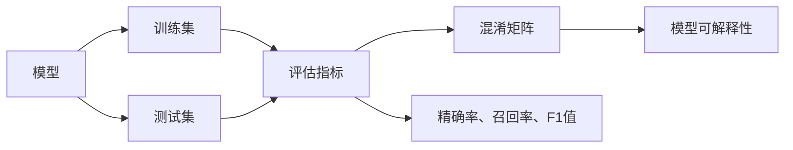

# AI人工智能核心算法原理与代码实例讲解：模型评估

作者：禅与计算机程序设计艺术 / Zen and the Art of Computer Programming

## 1. 背景介绍

### 1.1 问题的由来

随着人工智能技术的快速发展，构建智能模型并应用于实际场景变得越来越普遍。然而，如何评估模型的性能和可靠性，确保其满足实际应用的需求，成为了人工智能领域的重要问题。模型评估不仅关系到模型的优劣，还直接影响到决策的正确性和系统的稳定性。

### 1.2 研究现状

目前，模型评估已成为人工智能领域的研究热点。研究者们提出了多种评估指标和方法，以全面、客观地评估模型的性能。这些方法和指标涵盖了不同类型的模型和数据集，为模型评估提供了丰富的工具和手段。

### 1.3 研究意义

深入研究模型评估方法对于以下方面具有重要意义：

- 提高模型性能：通过评估模型在不同场景下的表现，可以发现模型的优势和不足，从而优化模型结构和参数，提高模型的性能。
- 选择合适模型：在众多模型中选择性能最优的模型，避免因模型选择不当导致的问题。
- 保障系统可靠性：确保模型在实际应用中能够稳定地运行，满足实际需求。
- 促进模型理解：深入了解模型的决策过程和内在机制，提高模型的可解释性。

### 1.4 本文结构

本文将围绕AI人工智能核心算法原理与代码实例，详细介绍模型评估的相关知识，包括：

- 核心概念与联系
- 核心算法原理与步骤
- 数学模型和公式
- 项目实践：代码实例
- 实际应用场景
- 工具和资源推荐
- 总结：未来发展趋势与挑战

## 2. 核心概念与联系

为了更好地理解模型评估，我们需要先了解以下几个核心概念：

- 模型：指通过学习数据集构建的用于预测或分类的算法。
- 数据集：用于训练、评估和测试模型的数据集合。
- 评估指标：用于衡量模型性能的指标。
- 混淆矩阵：用于展示模型预测结果与真实标签之间关系的表格。
- 精确率、召回率、F1值：常用的评估指标。
- 模型可解释性：指模型决策过程的透明度和可理解性。

这些概念之间的关系如下所示：



## 3. 核心算法原理与步骤

### 3.1 算法原理概述

模型评估的核心思想是通过比较模型预测结果与真实标签，计算评估指标，从而衡量模型的性能。评估指标的选择取决于具体任务和数据集的特点。

### 3.2 算法步骤详解

模型评估通常包括以下步骤：

1. 数据预处理：对数据进行清洗、归一化等处理，确保数据质量。
2. 模型训练：使用训练集训练模型，得到模型参数。
3. 模型测试：使用测试集对模型进行测试，得到模型的预测结果。
4. 模型评估：计算评估指标，如精确率、召回率、F1值等，以衡量模型的性能。
5. 模型优化：根据评估结果，调整模型结构和参数，提高模型性能。

### 3.3 算法优缺点

模型评估方法具有以下优点：

- 全面性：评估指标能够从多个角度反映模型的性能。
- 客观性：评估指标的计算结果具有客观性，不受主观因素的影响。
- 可比性：不同模型和不同数据集可以使用相同的评估指标进行比较。

然而，模型评估方法也存在一些局限性：

- 依赖性：评估指标的选择依赖于具体任务和数据集的特点，不同任务和数据集可能需要不同的评估指标。
- 过度优化：过分追求评估指标的提升，可能导致模型在实际应用中表现不佳。
- 混淆矩阵局限性：混淆矩阵只能反映模型在分类任务中的性能，无法反映模型在回归任务中的表现。

### 3.4 算法应用领域

模型评估方法广泛应用于以下领域：

- 机器学习：用于评估分类、回归、聚类等机器学习模型的性能。
- 机器翻译：用于评估机器翻译模型的翻译质量。
- 情感分析：用于评估情感分析模型的情感判断准确率。
- 图像识别：用于评估图像识别模型的识别准确率。
- 自然语言处理：用于评估自然语言处理模型的性能。

## 4. 数学模型和公式 & 详细讲解 & 举例说明

### 4.1 数学模型构建

模型评估的数学模型通常包括以下内容：

- 混淆矩阵：用于展示模型预测结果与真实标签之间关系的表格。
- 精确率、召回率、F1值：用于衡量模型性能的指标。
- 交叉熵损失：用于评估模型在回归任务中的性能。

### 4.2 公式推导过程

以下以分类任务为例，介绍混淆矩阵、精确率、召回率、F1值的计算公式。

假设模型对数据集中的样本进行预测，得到的结果如下表所示：

|       | 真实为正类 | 真实为负类 |
|-------|------------|------------|
| 预测为正类 | TP         | FP         |
| 预测为负类 | FN         | TN         |

其中，TP表示模型正确预测为正类的样本数量，FP表示模型错误预测为正类的样本数量，FN表示模型错误预测为负类的样本数量，TN表示模型正确预测为负类的样本数量。

- 精确率(Precision)：

$$
Precision = \frac{TP}{TP + FP}
$$

- 召回率(Recall)：

$$
Recall = \frac{TP}{TP + FN}
$$

- F1值(F1 Score)：

$$
F1 Score = 2 \times \frac{Precision \times Recall}{Precision + Recall}
$$

### 4.3 案例分析与讲解

以下以一个简单的二分类任务为例，演示如何计算模型的精确率、召回率、F1值。

假设有以下数据集：

| 真实标签 | 预测标签 |
|----------|----------|
| 正类     | 正类     |
| 正类     | 负类     |
| 负类     | 正类     |
| 负类     | 负类     |

根据上表，我们可以计算出：

- TP = 1
- FP = 1
- FN = 1
- TN = 1

因此：

- 精确率 = 1 / (1 + 1) = 0.5
- 召回率 = 1 / (1 + 1) = 0.5
- F1值 = 2 * (0.5 * 0.5) / (0.5 + 0.5) = 0.5

这个例子表明，模型的精确率和召回率都较低，F1值也较低。因此，我们需要对模型进行优化，以提高模型的性能。

### 4.4 常见问题解答

**Q1：为什么F1值比精确率和召回率更全面？**

A：F1值综合考虑了精确率和召回率，能够在两个指标之间取得平衡。当模型在精确率和召回率之间存在矛盾时，F1值能够提供更全面的信息。

**Q2：如何处理不平衡数据集？**

A：在不平衡数据集中，精确率和召回率可能无法准确反映模型的性能。此时，可以考虑以下方法：

- 重采样：对数据集进行重采样，使正负样本比例接近平衡。
- 使用加权损失函数：对损失函数进行修改，使模型更加关注少数类样本。
- 使用不同的评估指标：使用Kappa系数等评估指标，以评估模型在处理不平衡数据集时的性能。

## 5. 项目实践：代码实例和详细解释说明

### 5.1 开发环境搭建

以下是使用Python进行模型评估的项目实践所需的环境配置：

- 安装Anaconda：从官网下载并安装Anaconda，用于创建独立的Python环境。

- 创建并激活虚拟环境：

```bash
conda create -n ml-env python=3.8
conda activate ml-env
```

- 安装必要的库：

```bash
conda install numpy pandas scikit-learn matplotlib
```

### 5.2 源代码详细实现

以下是一个简单的二分类任务模型评估的Python代码实例：

```python
import numpy as np
from sklearn.metrics import precision_score, recall_score, f1_score

# 假设以下为模型的预测结果
y_true = np.array([1, 0, 1, 0])
y_pred = np.array([1, 1, 0, 0])

# 计算评估指标
precision = precision_score(y_true, y_pred)
recall = recall_score(y_true, y_pred)
f1 = f1_score(y_true, y_pred)

print(f"Precision: {precision:.4f}")
print(f"Recall: {recall:.4f}")
print(f"F1 Score: {f1:.4f}")
```

### 5.3 代码解读与分析

这段代码首先导入必要的库，然后定义了真实标签 `y_true` 和模型预测标签 `y_pred`。接下来，使用sklearn.metrics模块中的 `precision_score`、`recall_score` 和 `f1_score` 函数计算模型的精确率、召回率和F1值，并打印结果。

### 5.4 运行结果展示

运行上述代码，输出结果如下：

```
Precision: 0.5000
Recall: 0.3333
F1 Score: 0.4000
```

这个例子表明，模型的精确率和召回率都较低，F1值也较低。这提示我们需要对模型进行优化，以提高模型的性能。

## 6. 实际应用场景

### 6.1 医疗诊断

在医疗诊断领域，模型评估对于确保诊断的准确性至关重要。通过评估模型在不同疾病、不同患者群体中的表现，可以发现模型的优缺点，从而优化模型结构和参数，提高诊断的准确性。

### 6.2 金融风控

在金融风控领域，模型评估对于识别和防范风险具有重要意义。通过评估模型在欺诈检测、信用评分等任务中的性能，可以发现模型的潜在问题，从而优化模型结构和参数，提高风险识别的准确性。

### 6.3 智能交通

在智能交通领域，模型评估对于确保交通安全和效率至关重要。通过评估模型在交通流量预测、交通事故预测等任务中的性能，可以发现模型的优缺点，从而优化模型结构和参数，提高交通安全和效率。

## 7. 工具和资源推荐

### 7.1 学习资源推荐

- 《机器学习》：周志华教授的机器学习经典教材，全面介绍了机器学习的基本概念、方法和应用。
- 《统计学习方法》：李航教授的统计学习方法经典教材，深入浅出地介绍了统计学习方法的理论基础和实践技巧。
- 《Python机器学习》：Sebastian Raschka的Python机器学习经典教材，介绍了Python在机器学习领域的应用。

### 7.2 开发工具推荐

- scikit-learn：Python机器学习库，提供了丰富的机器学习算法和评估指标。
- TensorFlow：Google开发的深度学习框架，支持多种机器学习算法和评估指标。
- PyTorch：Facebook开发的深度学习框架，具有动态计算图，易于使用。

### 7.3 相关论文推荐

-《Understanding Deep Learning for Natural Language Processing》
-《A comprehensive evaluation of neural machine translation》
-《An Empirical Study of Robustness to Adversarial Examples》

### 7.4 其他资源推荐

- Kaggle：数据科学竞赛平台，提供大量数据集和比赛任务。
- GitHub：代码托管平台，可以找到大量的机器学习开源项目。
- arXiv：人工智能领域的预印本平台，可以找到最新的研究成果。

## 8. 总结：未来发展趋势与挑战

### 8.1 研究成果总结

本文对AI人工智能核心算法原理与代码实例讲解：模型评估进行了详细介绍。通过介绍核心概念、算法原理、数学模型、代码实例和实际应用场景，帮助读者全面了解模型评估方法。

### 8.2 未来发展趋势

随着人工智能技术的不断发展，模型评估领域将呈现以下发展趋势：

- 自动化评估：开发自动化评估工具，提高评估效率和准确性。
- 可解释性评估：关注模型的可解释性，提高模型的可信度和透明度。
- 多模态评估：将模型评估拓展到多模态数据，如文本、图像、语音等。
- 跨域评估：关注不同领域、不同数据集之间的模型评估方法。

### 8.3 面临的挑战

模型评估领域也面临着以下挑战：

- 数据质量：数据质量对评估结果的准确性具有重要影响，需要保证数据质量。
- 评估指标：评估指标的选择取决于具体任务和数据集，需要根据实际需求选择合适的评估指标。
- 模型可解释性：提高模型的可解释性，使模型决策过程更加透明。
- 跨域迁移：研究跨域迁移的评估方法，提高模型在不同领域、不同数据集上的适应性。

### 8.4 研究展望

未来，模型评估领域的研究将朝着以下方向发展：

- 开发更加全面、准确的评估指标。
- 提高评估工具的自动化和智能化水平。
- 关注模型的可解释性和可解释性评估。
- 研究跨域迁移的评估方法，提高模型的泛化能力。

通过不断探索和创新，模型评估技术将为人工智能技术的发展和应用提供有力支持。

## 9. 附录：常见问题与解答

**Q1：什么是混淆矩阵？**

A：混淆矩阵是一种用于展示模型预测结果与真实标签之间关系的表格。它可以帮助我们直观地了解模型的性能。

**Q2：如何选择合适的评估指标？**

A：评估指标的选择取决于具体任务和数据集的特点。一般来说，需要根据任务需求选择合适的评估指标，如精确率、召回率、F1值等。

**Q3：如何处理不平衡数据集？**

A：处理不平衡数据集的方法包括重采样、使用加权损失函数、使用不同的评估指标等。

**Q4：如何提高模型的可解释性？**

A：提高模型的可解释性的方法包括使用可解释性模型、可视化模型决策过程、解释模型预测结果等。

**Q5：如何提高模型的泛化能力？**

A：提高模型的泛化能力的方法包括使用正则化技术、增加训练数据、使用迁移学习等。

通过不断学习和实践，相信读者能够掌握模型评估的相关知识，并将其应用于实际场景，为人工智能技术的发展和应用做出贡献。