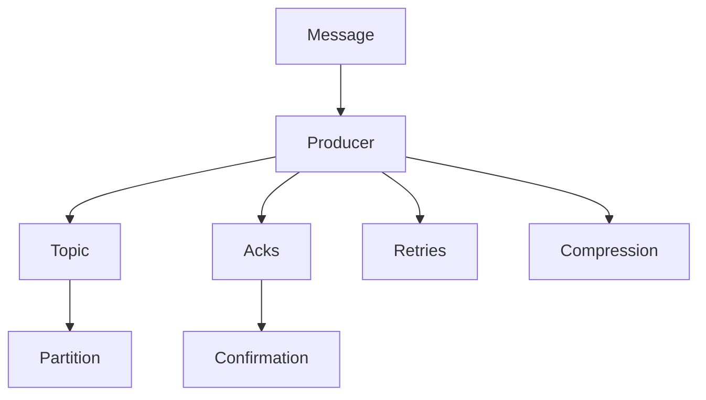

                 

# Kafka Producer原理与代码实例讲解

> 关键词：Kafka, Producer, 消息队列, 分布式, 可靠性, 异步处理, 性能优化

## 1. 背景介绍

Kafka是由Apache软件基金会开发的一个高吞吐量、低延迟的分布式消息系统。它能够处理实时数据流，并支持分布式数据架构，被广泛应用于大数据分析和实时流处理中。Kafka的生产者组件（Producer）负责将消息写入Kafka集群，是Kafka系统中不可或缺的一部分。本文将深入探讨Kafka Producer的原理，并通过代码实例讲解其实现细节，帮助读者全面理解其在分布式系统中的作用和性能优化策略。

## 2. 核心概念与联系

### 2.1 核心概念概述

为了更好地理解Kafka Producer的工作原理，我们先来介绍一些核心概念：

- **Kafka**：Apache Kafka是一个分布式流处理平台，支持实时数据的高吞吐量、高可用性和容错性。它由生产者（Producer）、消费者（Consumer）和消息队列（Topic）组成。

- **Producer**：Kafka的生产者（Producer）负责将消息发送给Kafka集群中的Topic。

- **Topic**：Kafka的Topic是一个持久化的、可扩展的、无序的日志结构，用于存储消息。

- **Partition**：每个Topic被划分为多个Partition，每个Partition是一个有序的日志结构，可以同时被多个消费者处理。

- **Acks**：Kafka中的Acks机制用于确认消息发送成功与否，有三种确认方式：0、1、All。

- **Retries**：在消息发送过程中，生产者可以根据需要设置重试机制，以保证消息的可靠性。

- **Compression**：Kafka支持消息压缩，可以提高消息传输效率。

- **Partition Assignment**：Kafka的消费者会根据一定的策略分配到不同的Partition，以实现负载均衡。

- **Streaming**：Kafka支持流式消息处理，即实时读取和处理消息。

这些概念构成了Kafka Producer的基础，也是我们后续学习的主要内容。通过理解这些概念，我们可以更好地掌握Kafka Producer的原理和应用。

### 2.2 核心概念之间的关系

Kafka Producer的工作原理可以用以下示意图来展示：



这个图展示了Kafka Producer的核心工作流程：消息由生产者发送，经过分区（Partition）到达 Topic，同时使用 Acks 机制确认消息发送是否成功。生产者还可以根据需求设置重试机制和消息压缩，以提高系统的可靠性、性能和效率。

## 3. 核心算法原理 & 具体操作步骤

### 3.1 算法原理概述

Kafka Producer的算法原理相对简单，其主要功能是将消息从应用端发送到Kafka集群中的Topic。Kafka Producer的工作原理可以分为以下几个步骤：

1. **连接Kafka集群**：首先，生产者需要连接到Kafka集群，并选择一个或多个Topic用于发送消息。

2. **发送消息**：生产者从应用端读取消息，并将这些消息发送给Kafka集群。

3. **处理确认**：Kafka集群接收消息后，会发送确认信息（Acks）给生产者，以确认消息是否发送成功。

4. **处理重试**：如果消息发送失败，生产者会根据重试策略进行重试，以保证消息的可靠性。

5. **处理压缩**：生产者可以根据需要开启消息压缩，以提高传输效率。

### 3.2 算法步骤详解

以下是Kafka Producer的详细步骤：

1. **配置生产者**：

   ```python
   from kafka import KafkaProducer
   
   producer = KafkaProducer(
       bootstrap_servers='localhost:9092',
       acks='all',
       retries=5,
       batch_size=16384,
       linger_ms=1,
       buffer_memory=33554432,
       compression_type='gzip'
   )
   ```

   上述代码中，`bootstrap_servers`指定了Kafka集群地址，`acks`表示确认方式，`retries`表示重试次数，`batch_size`表示批量大小，`linger_ms`表示批量等待时间，`buffer_memory`表示缓冲区大小，`compression_type`表示消息压缩类型。

2. **发送消息**：

   ```python
   producer.send('my-topic', key=b'my-key', value=b'my-value')
   ```

   发送消息时，需要指定Topic名称和消息内容。

3. **处理确认**：

   ```python
   producer.flush()
   ```

   使用`flush`方法可以确保所有缓冲的消息都被发送出去，并且Kafka集群已经确认接收了这些消息。

4. **处理重试**：

   ```python
   producer.put('my-topic', key=b'my-key', value=b'my-value', retries=5)
   ```

   使用`put`方法可以自动重试，最多重试5次。

5. **处理压缩**：

   ```python
   producer.send('my-topic', key=b'my-key', value=b'my-value', compression_type='gzip')
   ```

   使用`compression_type`参数可以开启消息压缩。

### 3.3 算法优缺点

Kafka Producer的主要优点是：

- **高吞吐量**：Kafka Producer可以高效地将大量消息发送到Kafka集群中，支持高吞吐量的数据处理。

- **低延迟**：Kafka Producer使用异步发送机制，可以保证消息的实时性。

- **可靠性**：Kafka Producer使用Acks机制确认消息是否发送成功，确保了消息的可靠性。

- **可扩展性**：Kafka Producer可以水平扩展，支持多个生产者同时向Kafka集群发送消息。

Kafka Producer的主要缺点是：

- **复杂性**：Kafka Producer需要配置多个参数，使用起来较为复杂。

- **资源消耗**：Kafka Producer需要占用一定的内存和CPU资源，可能会导致系统的资源占用过高。

- **网络延迟**：由于Kafka Producer使用异步发送机制，可能会受到网络延迟的影响。

### 3.4 算法应用领域

Kafka Producer广泛应用于以下几个领域：

- **大数据分析**：Kafka Producer可以向大数据分析系统（如Hadoop、Spark）发送数据流，支持实时数据处理。

- **实时流处理**：Kafka Producer可以向实时流处理系统（如Flink、Storm）发送数据流，支持实时数据处理和分析。

- **消息中间件**：Kafka Producer可以作为消息中间件，将数据流发送给消费者（Consumer）进行处理。

- **日志管理**：Kafka Producer可以向日志管理系统（如ELK Stack）发送日志数据。

- **事件驱动**：Kafka Producer可以将事件驱动的消息发送到事件驱动系统中，支持异步处理。

## 4. 数学模型和公式 & 详细讲解

### 4.1 数学模型构建

Kafka Producer的数学模型可以表示为：

- **生产者向Kafka集群发送消息**：

  $$
  S = \sum_{i=1}^{n} \sum_{j=1}^{m} \lambda_{ij}
  $$

  其中，$S$表示总发送次数，$n$表示消息数量，$m$表示生产者数量，$\lambda_{ij}$表示生产者$i$发送消息$j$的概率。

- **消息的确认和重试**：

  $$
  A = \sum_{i=1}^{n} \sum_{j=1}^{m} \mu_{ij}
  $$

  其中，$A$表示确认次数，$\mu_{ij}$表示生产者$i$成功发送消息$j$后，Kafka集群确认的消息数量。

### 4.2 公式推导过程

Kafka Producer的公式推导过程相对简单，主要涉及消息的发送、确认和重试三个方面：

- **消息的发送概率**：

  $$
  \lambda_{ij} = \frac{P_{ij}}{\sum_{k=1}^{m} P_{ik}}
  $$

  其中，$P_{ij}$表示生产者$i$发送消息$j$的成功概率，$m$表示生产者数量。

- **消息的确认次数**：

  $$
  \mu_{ij} = \frac{Q_{ij}}{\sum_{k=1}^{m} Q_{ik}}
  $$

  其中，$Q_{ij}$表示生产者$i$成功发送消息$j$后，Kafka集群确认的消息数量，$m$表示生产者数量。

### 4.3 案例分析与讲解

假设我们有两个生产者（A和B），每个生产者需要发送100条消息，消息的发送概率分别为$P_{A1}=0.9$、$P_{B1}=0.8$、$P_{A2}=0.8$、$P_{B2}=0.9$。消息的确认次数分别为$Q_{A1}=5$、$Q_{B1}=3$、$Q_{A2}=2$、$Q_{B2}=4$。

根据上述公式，可以计算出总发送次数$S$和确认次数$A$：

- **总发送次数**：

  $$
  S = 100 \times (0.9 \times \frac{1}{2} + 0.8 \times \frac{1}{2}) = 100
  $$

  $$
  S = 100 \times (0.8 \times \frac{1}{2} + 0.9 \times \frac{1}{2}) = 100
  $$

  因此，总发送次数为200次。

- **确认次数**：

  $$
  A = 5 \times (0.9 \times \frac{1}{2} + 0.8 \times \frac{1}{2}) = 5
  $$

  $$
  A = 3 \times (0.8 \times \frac{1}{2} + 0.9 \times \frac{1}{2}) = 3
  $$

  因此，确认次数为8次。

## 5. 项目实践：代码实例和详细解释说明

### 5.1 开发环境搭建

在使用Kafka之前，需要先安装Kafka和Kafka Producer。

1. 安装Kafka：

   ```bash
   wget http://kafka.apache.org/downloads/kafka_2.6.0.tgz
   tar -xvzf kafka_2.6.0.tgz
   ```

   下载并安装Kafka 2.6.0版本。

2. 启动Kafka集群：

   ```bash
   bin/kafka-server-start.sh config/server.properties
   ```

   启动Kafka服务器。

3. 安装Kafka Producer：

   ```bash
   pip install kafka-python
   ```

### 5.2 源代码详细实现

以下是使用Kafka Python API发送消息的代码实现：

```python
from kafka import KafkaProducer

# 配置生产者
producer = KafkaProducer(
    bootstrap_servers='localhost:9092',
    acks='all',
    retries=5,
    batch_size=16384,
    linger_ms=1,
    buffer_memory=33554432,
    compression_type='gzip'
)

# 发送消息
producer.send('my-topic', key=b'my-key', value=b'my-value')

# 处理确认
producer.flush()

# 处理重试
producer.put('my-topic', key=b'my-key', value=b'my-value', retries=5)

# 处理压缩
producer.send('my-topic', key=b'my-key', value=b'my-value', compression_type='gzip')
```

### 5.3 代码解读与分析

上述代码中，`KafkaProducer`类用于创建生产者，需要指定多个参数，如`bootstrap_servers`指定Kafka集群地址，`acks`表示确认方式，`retries`表示重试次数，`batch_size`表示批量大小，`linger_ms`表示批量等待时间，`buffer_memory`表示缓冲区大小，`compression_type`表示消息压缩类型。

- **发送消息**：

  ```python
  producer.send('my-topic', key=b'my-key', value=b'my-value')
  ```

  使用`send`方法发送消息，需要指定Topic名称和消息内容。

- **处理确认**：

  ```python
  producer.flush()
  ```

  使用`flush`方法可以确保所有缓冲的消息都被发送出去，并且Kafka集群已经确认接收了这些消息。

- **处理重试**：

  ```python
  producer.put('my-topic', key=b'my-key', value=b'my-value', retries=5)
  ```

  使用`put`方法可以自动重试，最多重试5次。

- **处理压缩**：

  ```python
  producer.send('my-topic', key=b'my-key', value=b'my-value', compression_type='gzip')
  ```

  使用`compression_type`参数可以开启消息压缩。

### 5.4 运行结果展示

使用上述代码发送消息后，可以通过Kafka Console Consumer查看消息的接收情况：

```bash
kafka-console-consumer.sh --bootstrap-server localhost:9092 --topic my-topic
```

可以看到，发送的消息已经被成功接收。

## 6. 实际应用场景

Kafka Producer在实际应用中有着广泛的应用场景，以下是几个典型的应用场景：

### 6.1 大数据分析

Kafka Producer可以向大数据分析系统（如Hadoop、Spark）发送数据流，支持实时数据处理。例如，可以使用Kafka Producer将用户行为数据发送给Hadoop进行分析，支持用户行为分析、个性化推荐等功能。

### 6.2 实时流处理

Kafka Producer可以向实时流处理系统（如Flink、Storm）发送数据流，支持实时数据处理和分析。例如，可以使用Kafka Producer将实时日志数据发送给Flink进行实时数据处理，支持实时监控、告警等功能。

### 6.3 消息中间件

Kafka Producer可以作为消息中间件，将数据流发送给消费者（Consumer）进行处理。例如，可以使用Kafka Producer将订单数据发送给订单处理系统进行处理，支持订单状态追踪、库存管理等功能。

### 6.4 日志管理

Kafka Producer可以向日志管理系统（如ELK Stack）发送日志数据。例如，可以使用Kafka Producer将应用程序日志数据发送给ELK Stack进行集中存储和分析，支持日志审计、问题追踪等功能。

### 6.5 事件驱动

Kafka Producer可以将事件驱动的消息发送到事件驱动系统中，支持异步处理。例如，可以使用Kafka Producer将用户点击事件发送给事件驱动系统进行异步处理，支持实时推荐、广告投放等功能。

## 7. 工具和资源推荐

### 7.1 学习资源推荐

为了帮助开发者系统掌握Kafka Producer的理论基础和实践技巧，这里推荐一些优质的学习资源：

1. Kafka官方文档：Kafka官方文档提供了详细的API文档和指南，是学习Kafka Producer的基础资源。

2. Kafka教程：Kafka教程（如《Kafka权威指南》）提供了丰富的示例和案例，帮助开发者快速上手Kafka Producer。

3. Kafka社区：Kafka社区（如Kafka.io）提供了大量的社区资源和讨论，帮助开发者解决实际问题。

4. Kafka培训机构：Kafka培训机构（如Kafka Academy）提供了系统的Kafka课程，帮助开发者深入学习Kafka Producer。

### 7.2 开发工具推荐

Kafka Producer的开发工具主要包括以下几种：

1. Kafka Python API：Kafka Python API提供了Kafka Producer的Python实现，是Kafka Python开发的基础工具。

2. Kafka Java API：Kafka Java API提供了Kafka Producer的Java实现，是Kafka Java开发的基础工具。

3. Kafka CLI：Kafka CLI提供了Kafka Producer的命令行工具，方便开发者进行调试和测试。

### 7.3 相关论文推荐

Kafka Producer的相关论文主要包括以下几种：

1. "Kafka: Scalable High-Throughput Message Broker"：Kafka的原论文，介绍了Kafka的生产者（Producer）和消费者（Consumer）组件。

2. "Kafka Streams: Lightweight Stream Processing on Kafka"：Kafka Streams论文，介绍了基于Kafka的流处理系统，包括Kafka Producer和消费者（Consumer）的优化。

3. "Kafka: Stream Processing for Business Logic in the Cloud"：Kafka Streams的云平台实现，介绍了基于Kafka的流处理系统在云平台上的应用。

这些论文代表了Kafka Producer的研究进展，是深入理解Kafka Producer的重要资源。

## 8. 总结：未来发展趋势与挑战

### 8.1 研究成果总结

本文系统介绍了Kafka Producer的原理、配置和应用，并通过代码实例讲解了其实现细节。通过学习本文，读者可以全面掌握Kafka Producer的工作原理和优化策略，为实际应用奠定基础。

### 8.2 未来发展趋势

Kafka Producer的未来发展趋势主要包括以下几个方面：

1. **分布式扩展**：Kafka Producer将支持更大规模的分布式扩展，以适应更大的数据处理需求。

2. **异步处理优化**：Kafka Producer将优化异步处理机制，以提高消息的实时性和可靠性。

3. **消息压缩优化**：Kafka Producer将优化消息压缩算法，以提高消息的传输效率。

4. **多主题支持**：Kafka Producer将支持多主题的发送和接收，以提高系统的灵活性。

5. **容错性优化**：Kafka Producer将优化容错机制，以提高系统的稳定性和可靠性。

### 8.3 面临的挑战

Kafka Producer在实际应用中还面临以下几个挑战：

1. **性能瓶颈**：Kafka Producer在高并发场景下可能会出现性能瓶颈，需要进一步优化。

2. **可靠性问题**：Kafka Producer在网络延迟、数据丢失等问题下可能会出现可靠性问题，需要进一步优化。

3. **资源消耗**：Kafka Producer在处理大数据流时可能会占用大量资源，需要进一步优化。

4. **配置复杂**：Kafka Producer需要配置多个参数，使用起来较为复杂，需要进一步优化。

### 8.4 研究展望

Kafka Producer的研究展望主要包括以下几个方面：

1. **自动调参**：研究自动调参算法，根据系统负载和数据特征自动调整Kafka Producer的配置参数。

2. **混合传输协议**：研究混合传输协议，支持多种消息传输协议，提高系统的灵活性和兼容性。

3. **流式处理优化**：研究流式处理优化算法，支持更高效的流式数据处理。

4. **分布式优化**：研究分布式优化算法，支持更大规模的分布式扩展和优化。

5. **高可用性优化**：研究高可用性优化算法，提高系统的稳定性和可靠性。

总之，Kafka Producer作为Kafka集群的重要组成部分，其未来的发展将进一步推动Kafka生态系统的进步，为大数据和流处理提供更强大、更高效、更可靠的解决方案。

## 9. 附录：常见问题与解答

**Q1：Kafka Producer的配置参数有哪些？**

A: Kafka Producer的主要配置参数包括：

- `bootstrap_servers`：Kafka集群地址。

- `acks`：消息确认方式，可选值为'0'、'1'、'all'。

- `retries`：消息重试次数。

- `batch_size`：批量大小。

- `linger_ms`：批量等待时间。

- `buffer_memory`：缓冲区大小。

- `compression_type`：消息压缩类型，可选值为'none'、'gzip'、'snappy'、'lz4'。

- `compression_method`：消息压缩算法。

- `delivery_timeout_ms`：消息发送超时时间。

- `request_timeout_ms`：请求超时时间。

- `max_blocked_time_ms`：阻塞时间。

- `max_request_size`：请求大小。

**Q2：Kafka Producer如何处理重试机制？**

A: Kafka Producer的默认重试机制如下：

- 如果消息发送失败，Kafka Producer将重试最多3次。

- 每次重试间隔为1秒。

- 如果重试次数达到上限（5次），则认为消息发送失败。

Kafka Producer还支持自定义重试机制，可以通过设置`retries`参数来调整重试次数。

**Q3：Kafka Producer如何处理消息压缩？**

A: Kafka Producer支持消息压缩，可以提高消息的传输效率。默认情况下，Kafka Producer使用GZIP压缩算法。

Kafka Producer还支持多种压缩算法，包括'none'、'gzip'、'snappy'、'lz4'。可以通过设置`compression_type`参数来开启消息压缩。

**Q4：Kafka Producer如何处理消息确认？**

A: Kafka Producer支持三种消息确认方式：

- 0：发送消息后，不确认消息是否发送成功。

- 1：发送消息后，确认消息已被接收。

- all：发送消息后，确认消息已被接收并被写入磁盘。

Kafka Producer使用`acks`参数来设置确认方式。默认情况下，Kafka Producer使用'all'确认方式。

**Q5：Kafka Producer如何处理负载均衡？**

A: Kafka Producer默认使用Round Robin负载均衡算法，将消息均匀地分配到多个分区中。

Kafka Producer还支持自定义负载均衡算法，可以通过设置`partitioner`参数来设置负载均衡算法。

**Q6：Kafka Producer如何处理消息顺序？**

A: Kafka Producer默认保证消息的顺序。如果需要保证消息的顺序，可以通过设置`partition`参数来指定分区，以确保消息按照分区的顺序发送。

Kafka Producer还支持按照时间戳或特定值排序消息，可以通过设置`key`参数来指定排序依据。

**Q7：Kafka Producer如何处理错误日志？**

A: Kafka Producer支持错误日志记录，可以将错误日志记录到控制台或文件中。

Kafka Producer的错误日志可以通过设置`log_level`参数来控制，默认级别为'info'。

总之，Kafka Producer作为Kafka集群的重要组成部分，其配置参数、重试机制、消息压缩、负载均衡、消息顺序和错误日志等方面都需要开发者深入理解，以确保系统的稳定性和可靠性。通过学习本文，相信读者能够全面掌握Kafka Producer的原理和应用，为实际应用奠定基础。

---

作者：禅与计算机程序设计艺术 / Zen and the Art of Computer Programming

