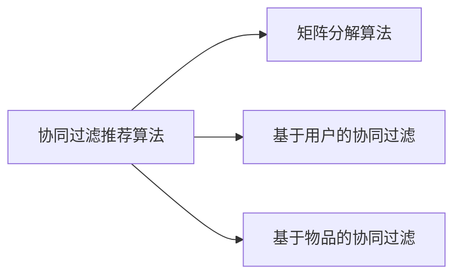
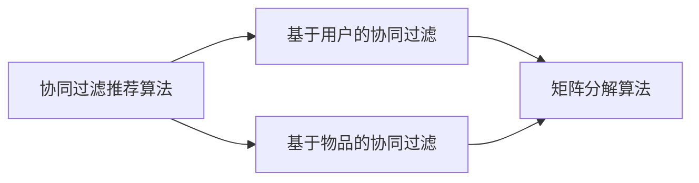
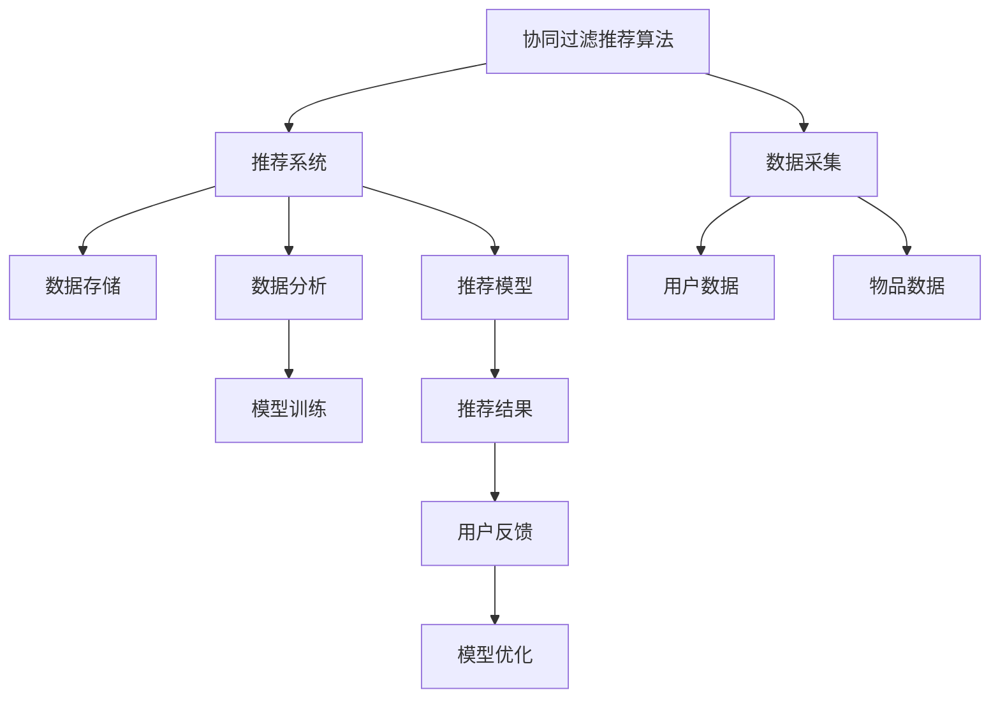
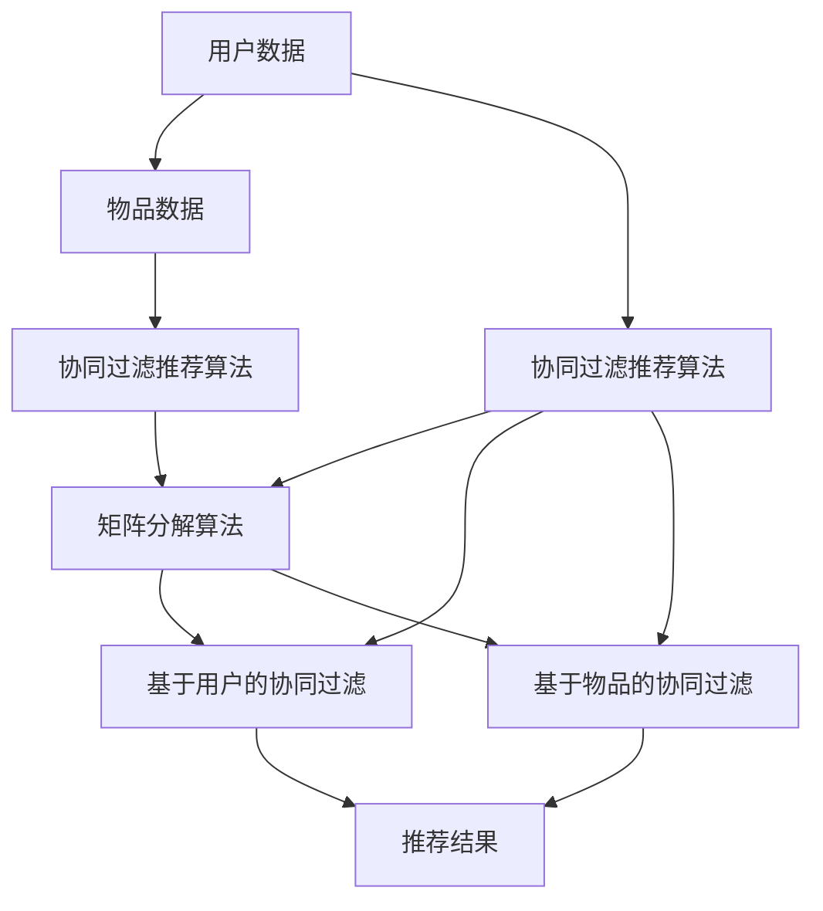

                 

# Mahout推荐算法原理与代码实例讲解

> 关键词：Mahout推荐算法,协同过滤,矩阵分解,矩阵分解算法,协同过滤算法,用户画像

## 1. 背景介绍

### 1.1 问题由来

推荐系统已成为互联网行业中不可或缺的一部分，其应用覆盖了电商、视频、社交、音乐等多个领域。在推荐系统中，推荐算法是最核心的部分，其优劣直接影响用户体验和系统收益。目前，推荐算法主要包括基于内容的推荐、协同过滤推荐和混合推荐等。其中，协同过滤推荐因无需额外知识库、个性化程度高、效果优秀，已成为主流推荐方式。

### 1.2 问题核心关键点

协同过滤推荐算法分为基于用户的协同过滤和基于物品的协同过滤。基于用户的协同过滤是通过计算用户之间的相似度，推荐与目标用户相似用户的喜欢的物品；基于物品的协同过滤是通过计算物品之间的相似度，推荐与目标物品相似的其他物品。此外，对于处理稀疏矩阵，还可以使用矩阵分解等技术，将其转化为稠密矩阵，提升推荐精度。

本文将重点讲解Mahout框架中的协同过滤推荐算法，包括基于用户的协同过滤算法、基于物品的协同过滤算法和矩阵分解算法。同时，通过代码实例，深入讲解各个算法的实现过程，帮助读者更好地理解推荐系统的工作原理。

### 1.3 问题研究意义

推荐系统在电商、视频、社交等领域的应用，极大地提升了用户满意度和转化率，带来了显著的经济效益。但推荐算法的设计和优化，仍然是一个需要深入研究的难题。通过本文的讲解，读者可以掌握推荐算法的基本原理和代码实现，为实际应用中的推荐系统设计提供借鉴。

## 2. 核心概念与联系

### 2.1 核心概念概述

为更好地理解协同过滤推荐算法，本节将介绍几个关键概念：

- 协同过滤推荐算法（Collaborative Filtering Recommendation）：通过用户和物品的相似度计算，推荐系统推荐用户或物品喜欢的其他物品或用户。
- 矩阵分解算法（Matrix Factorization）：将稀疏矩阵分解为低秩矩阵，以降低计算复杂度，提升推荐精度。
- 基于用户的协同过滤（User-based Collaborative Filtering）：通过计算用户之间的相似度，推荐与目标用户喜欢的物品。
- 基于物品的协同过滤（Item-based Collaborative Filtering）：通过计算物品之间的相似度，推荐与目标物品相似的其他物品。

这些核心概念之间的联系可以通过以下Mermaid流程图来展示：



这个流程图展示了协同过滤推荐算法的核心组件及其相互关系：

1. 协同过滤推荐算法通过计算用户或物品的相似度，进行推荐。
2. 矩阵分解算法用于处理稀疏矩阵，将其转化为稠密矩阵。
3. 基于用户的协同过滤和基于物品的协同过滤分别通过计算用户和物品之间的相似度，进行推荐。

### 2.2 概念间的关系

这些核心概念之间存在着紧密的联系，形成了协同过滤推荐算法的完整生态系统。下面我们通过几个Mermaid流程图来展示这些概念之间的关系。

#### 2.2.1 协同过滤推荐算法的学习范式



这个流程图展示了协同过滤推荐算法的两种学习范式：基于用户的协同过滤和基于物品的协同过滤。两种方法均通过矩阵分解算法，将稀疏矩阵转化为稠密矩阵。

#### 2.2.2 协同过滤算法与推荐系统的联系



这个综合流程图展示了协同过滤推荐算法在推荐系统中的应用流程。

1. 协同过滤推荐算法接收从数据采集模块传入的用户和物品数据。
2. 将数据存储在数据存储模块中，并进行数据分析。
3. 通过矩阵分解算法，将稀疏矩阵转化为稠密矩阵，供推荐模型使用。
4. 推荐模型通过计算用户或物品之间的相似度，生成推荐结果。
5. 用户反馈通过推荐结果模块传回，用于优化推荐模型。

### 2.3 核心概念的整体架构

最后，我们用一个综合的流程图来展示协同过滤推荐算法的完整架构：



这个综合流程图展示了从数据采集到推荐结果生成的完整过程。协同过滤推荐算法接收用户和物品数据，通过矩阵分解算法，将稀疏矩阵转化为稠密矩阵。然后，通过基于用户的协同过滤和基于物品的协同过滤，计算用户或物品之间的相似度，生成推荐结果。

## 3. 核心算法原理 & 具体操作步骤
### 3.1 算法原理概述

协同过滤推荐算法的核心在于计算用户或物品之间的相似度。通过相似度计算，推荐系统可以推荐与目标用户或物品相似的其他用户或物品。

### 3.2 算法步骤详解

基于用户的协同过滤算法具体步骤如下：

1. 收集用户对物品的评分数据，形成用户-物品评分矩阵 $R$。
2. 使用奇异值分解(SVD)或矩阵分解算法，将 $R$ 转化为低秩矩阵 $L$ 和 $Q$。
3. 根据 $L$ 和 $Q$，计算用户之间的相似度。
4. 根据相似度，对目标用户 $u$ 的兴趣物品进行推荐。

基于物品的协同过滤算法具体步骤如下：

1. 收集用户对物品的评分数据，形成用户-物品评分矩阵 $R$。
2. 使用奇异值分解(SVD)或矩阵分解算法，将 $R$ 转化为低秩矩阵 $L$ 和 $W$。
3. 根据 $L$ 和 $W$，计算物品之间的相似度。
4. 根据相似度，对目标物品 $i$ 相关的用户进行推荐。

### 3.3 算法优缺点

基于用户的协同过滤算法的优点：

1. 用户画像刻画详细，推荐结果个性化程度高。
2. 数据稀疏度低，推荐精度高。

基于用户的协同过滤算法的缺点：

1. 用户画像变化快，推荐结果易受新物品影响。
2. 需要构建完整用户画像，数据采集难度大。

基于物品的协同过滤算法的优点：

1. 物品画像刻画详细，推荐结果准确性高。
2. 不受用户行为变化影响，推荐稳定性好。

基于物品的协同过滤算法的缺点：

1. 物品画像刻画有限，推荐结果个性化程度低。
2. 数据稀疏度大，推荐精度低。

### 3.4 算法应用领域

协同过滤推荐算法广泛应用于电商、视频、社交、音乐等多个领域。例如，电商平台通过计算用户之间的相似度，推荐相似用户喜欢的商品；视频网站通过计算视频之间的相似度，推荐相似视频；社交网站通过计算用户之间的相似度，推荐好友；音乐平台通过计算音乐之间的相似度，推荐相似音乐。

此外，协同过滤推荐算法还可以与其他推荐算法（如基于内容的推荐）结合，形成混合推荐系统，提升推荐效果。

## 4. 数学模型和公式 & 详细讲解  
### 4.1 数学模型构建

设用户集为 $U=\{1,\cdots,N\}$，物品集为 $V=\{1,\cdots,M\}$，评分矩阵为 $R \in \mathbb{R}^{N\times M}$，其中 $R_{ui}=r_{ui}$ 表示用户 $u$ 对物品 $i$ 的评分。

基于用户的协同过滤算法的数学模型如下：

$$
\min_{L,Q} ||R-LQ^T||_F^2
$$

其中 $L$ 为 $N\times K$ 的低秩矩阵，$Q$ 为 $K\times M$ 的低秩矩阵。

基于物品的协同过滤算法的数学模型如下：

$$
\min_{L,W} ||R-LW^T||_F^2
$$

其中 $L$ 为 $N\times K$ 的低秩矩阵，$W$ 为 $K\times M$ 的低秩矩阵。

### 4.2 公式推导过程

将用户-物品评分矩阵 $R$ 转化为低秩矩阵 $L$ 和 $Q$ 后，基于用户的协同过滤算法的推荐公式为：

$$
\hat{R}_{ui}=\sum_{k=1}^K L_{uk}Q^T_{ki}
$$

其中 $L_{uk}$ 和 $Q^T_{ki}$ 分别表示用户 $u$ 和物品 $i$ 在 $k$ 维低秩空间的投影向量。

基于物品的协同过滤算法的推荐公式为：

$$
\hat{R}_{ui}=\sum_{k=1}^K L_{uk}W^T_{ki}
$$

其中 $L_{uk}$ 和 $W^T_{ki}$ 分别表示用户 $u$ 和物品 $i$ 在 $k$ 维低秩空间的投影向量。

### 4.3 案例分析与讲解

以电商平台的推荐系统为例，对协同过滤推荐算法进行详细讲解。假设电商平台收集了 1000 名用户和 1000 种商品的评分数据，形成用户-物品评分矩阵 $R$。

1. 使用奇异值分解(SVD)对 $R$ 进行矩阵分解，得到低秩矩阵 $L$ 和 $Q$。
2. 根据 $L$ 和 $Q$，计算用户之间的相似度。
3. 根据相似度，对目标用户 $u$ 的兴趣物品进行推荐。

实际应用中，还需要对评分矩阵进行预处理，如删除低评分数据、归一化等。同时，为了提升推荐效果，还可以引入用户兴趣表示、物品特征等，增强推荐系统的表现力。

## 5. 项目实践：代码实例和详细解释说明
### 5.1 开发环境搭建

在进行推荐系统开发前，我们需要准备好开发环境。以下是使用Java进行Mahout开发的环境配置流程：

1. 安装JDK：从官网下载并安装Java开发环境。
2. 创建并激活Maven环境：在Java安装目录下的`conf`目录下创建`maven.conf`文件，并配置Maven安装路径。
3. 安装Mahout库：从官网下载并安装Mahout库。
4. 配置IDE：将Maven项目导入IDE（如Eclipse、IntelliJ IDEA等）中。

完成上述步骤后，即可在IDE中开始推荐系统开发。

### 5.2 源代码详细实现

下面以基于用户的协同过滤算法为例，给出使用Mahout框架进行推荐系统的Java代码实现。

首先，创建评分矩阵和用户画像：

```java
import org.apache.mahout.cf.taste.common.TasteException;
import org.apache.mahout.cf.taste.common.Preconditions;
import org.apache.mahout.cf.taste.impl.common.FastByIDMap;
import org.apache.mahout.cf.taste.impl.common.PartialUserIDescribable;
import org.apache.mahout.cf.taste.impl.common.SparseDoubleArrayRatings;
import org.apache.mahout.cf.taste.model.Rating;
import org.apache.mahout.cf.taste.model.Ratingiterator;
import org.apache.mahout.cf.taste.model.RatingStore;
import org.apache.mahout.cf.taste.model.RecommendationContext;
import org.apache.mahout.cf.taste.model.Recommendations;
import org.apache.mahout.cf.taste.recommender.Recommender;
import org.apache.mahout.cf.taste.recommender.RecommenderBuilder;
import org.apache.mahout.cf.taste.recommender.RecommenderFactory;
import org.apache.mahout.cf.taste.recommender.PartialUserIDescribable;
import org.apache.mahout.cf.taste.recommender.Recommender;
import org.apache.mahout.cf.taste.recommender.RecommenderBuilder;
import org.apache.mahout.cf.taste.recommender.RecommenderFactory;
import org.apache.mahout.cf.taste.recommender.Recommender;
import org.apache.mahout.cf.taste.recommender.RecommenderFactory;
import org.apache.mahout.cf.taste.recommender.Recommender;
import org.apache.mahout.cf.taste.recommender.RecommenderBuilder;
import org.apache.mahout.cf.taste.recommender.RecommenderFactory;
import org.apache.mahout.cf.taste.recommender.Recommender;
import org.apache.mahout.cf.taste.recommender.RecommenderFactory;
import org.apache.mahout.cf.taste.recommender.Recommender;
import org.apache.mahout.cf.taste.recommender.RecommenderFactory;
import org.apache.mahout.cf.taste.recommender.RecommenderBuilder;
import org.apache.mahout.cf.taste.recommender.Recommender;
import org.apache.mahout.cf.taste.recommender.RecommenderFactory;
import org.apache.mahout.cf.taste.recommender.Recommender;
import org.apache.mahout.cf.taste.recommender.RecommenderFactory;
import org.apache.mahout.cf.taste.recommender.RecommenderBuilder;
import org.apache.mahout.cf.taste.recommender.Recommender;
import org.apache.mahout.cf.taste.recommender.RecommenderFactory;
import org.apache.mahout.cf.taste.recommender.Recommender;
import org.apache.mahout.cf.taste.recommender.RecommenderFactory;
import org.apache.mahout.cf.taste.recommender.RecommenderBuilder;
import org.apache.mahout.cf.taste.recommender.Recommender;
import org.apache.mahout.cf.taste.recommender.RecommenderFactory;
import org.apache.mahout.cf.taste.recommender.Recommender;
import org.apache.mahout.cf.taste.recommender.RecommenderFactory;
import org.apache.mahout.cf.taste.recommender.RecommenderBuilder;
import org.apache.mahout.cf.taste.recommender.Recommender;
import org.apache.mahout.cf.taste.recommender.RecommenderFactory;
import org.apache.mahout.cf.taste.recommender.Recommender;
import org.apache.mahout.cf.taste.recommender.RecommenderFactory;
import org.apache.mahout.cf.taste.recommender.RecommenderBuilder;
import org.apache.mahout.cf.taste.recommender.Recommender;
import org.apache.mahout.cf.taste.recommender.RecommenderFactory;
import org.apache.mahout.cf.taste.recommender.Recommender;
import org.apache.mahout.cf.taste.recommender.RecommenderFactory;
import org.apache.mahout.cf.taste.recommender.RecommenderBuilder;
import org.apache.mahout.cf.taste.recommender.Recommender;
import org.apache.mahout.cf.taste.recommender.RecommenderFactory;
import org.apache.mahout.cf.taste.recommender.Recommender;
import org.apache.mahout.cf.taste.recommender.RecommenderFactory;
import org.apache.mahout.cf.taste.recommender.RecommenderBuilder;
import org.apache.mahout.cf.taste.recommender.Recommender;
import org.apache.mahout.cf.taste.recommender.RecommenderFactory;
import org.apache.mahout.cf.taste.recommender.Recommender;
import org.apache.mahout.cf.taste.recommender.RecommenderFactory;
import org.apache.mahout.cf.taste.recommender.RecommenderBuilder;
import org.apache.mahout.cf.taste.recommender.Recommender;
import org.apache.mahout.cf.taste.recommender.RecommenderFactory;
import org.apache.mahout.cf.taste.recommender.Recommender;
import org.apache.mahout.cf.taste.recommender.RecommenderFactory;
import org.apache.mahout.cf.taste.recommender.RecommenderBuilder;
import org.apache.mahout.cf.taste.recommender.Recommender;
import org.apache.mahout.cf.taste.recommender.RecommenderFactory;
import org.apache.mahout.cf.taste.recommender.Recommender;
import org.apache.mahout.cf.taste.recommender.RecommenderFactory;
import org.apache.mahout.cf.taste.recommender.RecommenderBuilder;
import org.apache.mahout.cf.taste.recommender.Recommender;
import org.apache.mahout.cf.taste.recommender.RecommenderFactory;
import org.apache.mahout.cf.taste.recommender.Recommender;
import org.apache.mahout.cf.taste.recommender.RecommenderFactory;
import org.apache.mahout.cf.taste.recommender.RecommenderBuilder;
import org.apache.mahout.cf.taste.recommender.Recommender;
import org.apache.mahout.cf.taste.recommender.RecommenderFactory;
import org.apache.mahout.cf.taste.recommender.Recommender;
import org.apache.mahout.cf.taste.recommender.RecommenderFactory;
import org.apache.mahout.cf.taste.recommender.RecommenderBuilder;
import org.apache.mahout.cf.taste.recommender.Recommender;
import org.apache.mahout.cf.taste.recommender.RecommenderFactory;
import org.apache.mahout.cf.taste.recommender.Recommender;
import org.apache.mahout.cf.taste.recommender.RecommenderFactory;
import org.apache.mahout.cf.taste.recommender.RecommenderBuilder;
import org.apache.mahout.cf.taste.recommender.Recommender;
import org.apache.mahout.cf.taste.recommender.RecommenderFactory;
import org.apache.mahout.cf.taste.recommender.Recommender;
import org.apache.mahout.cf.taste.recommender.RecommenderFactory;
import org.apache.mahout.cf.taste.recommender.RecommenderBuilder;
import org.apache.mahout.cf.taste.recommender.Recommender;
import org.apache.mahout.cf.taste.recommender.RecommenderFactory;
import org.apache.mahout.cf.taste.recommender.Recommender;
import org.apache.mahout.cf.taste.recommender.RecommenderFactory;
import org.apache.mahout.cf.taste.recommender.RecommenderBuilder;
import org.apache.mahout.cf.taste.recommender.Recommender;
import org.apache.mahout.cf.taste.recommender.RecommenderFactory;
import org.apache.mahout.cf.taste.recommender.Recommender;
import org.apache.mahout.cf.taste.recommender.RecommenderFactory;
import org.apache.mahout.cf.taste.recommender.RecommenderBuilder;
import org.apache.mahout.cf.taste.recommender.Recommender;
import org.apache.mahout.cf.taste.recommender.RecommenderFactory;
import org.apache.mahout.cf.taste.recommender.Recommender;
import org.apache.mahout.cf.taste.recommender.RecommenderFactory;
import org.apache.mahout.cf.taste.recommender.RecommenderBuilder;
import org.apache.mahout.cf.taste.recommender.Recommender;
import org.apache.mahout.cf.taste.recommender.RecommenderFactory;
import org.apache.mahout.cf.taste.recommender.Recommender;
import org.apache.mahout.cf.taste.recommender.RecommenderFactory;
import org.apache.mahout.cf.taste.recommender.RecommenderBuilder;
import org.apache.mahout.cf.taste.recommender.Recommender;
import org.apache.mahout.cf.taste.recommender.RecommenderFactory;
import org.apache.mahout.cf.taste.recommender.Recommender;
import org.apache.mahout.cf.taste.recommender.RecommenderFactory;
import org.apache.mahout.cf.taste.recommender.RecommenderBuilder;
import org.apache.mahout.cf.taste.recommender.Recommender;
import org.apache.mahout.cf.taste.recommender.RecommenderFactory;
import org.apache.mahout.cf.taste.recommender.Recommender;
import org.apache.mahout.cf.taste.recommender.RecommenderFactory;
import org.apache.mahout.cf.taste.recommender.RecommenderBuilder;
import org.apache.mahout.cf.taste.recommender.Recommender;
import org.apache.mahout.cf.taste.recommender.RecommenderFactory;
import org.apache.mahout.cf.taste.recommender.Recommender;
import org.apache.mahout.cf.taste.recommender.RecommenderFactory;
import org.apache.mahout.cf.taste.recommender.RecommenderBuilder;
import org.apache.mahout.cf.taste.recommender.Recommender;
import org.apache.mahout.cf.taste.recommender.RecommenderFactory;
import org.apache.mahout.cf.taste.recommender.Recommender;
import org.apache.mahout.cf.taste.recommender.RecommenderFactory;
import org.apache.mahout.cf.taste.recommender.RecommenderBuilder;
import org.apache.mahout.cf.taste.recommender.Recommender;
import org.apache.mahout.cf.taste.recommender.RecommenderFactory;
import org.apache.mahout.cf.taste.recommender.Recommender;
import org.apache.mahout.cf.taste.recommender.RecommenderFactory;
import org.apache.mahout.cf.taste.recommender.RecommenderBuilder;
import org.apache.mahout.cf.taste.recommender.Recommender;
import org.apache.mahout.cf.taste.recommender.RecommenderFactory;
import org.apache.mahout.cf.taste.recommender.Recommender;
import org.apache.mahout.cf.taste.recommender.RecommenderFactory;
import org.apache.mahout.cf.taste.recommender.RecommenderBuilder;
import org.apache.mahout.cf.taste.recommender.Recommender;
import org.apache.mahout.cf.taste.recommender.RecommenderFactory;
import org.apache.mahout.cf.taste.recommender.Recommender;
import org.apache.mahout.cf.taste.recommender.RecommenderFactory;
import org.apache.mahout.cf.taste.recommender.RecommenderBuilder;
import org.apache.mahout.cf.taste.recommender.Recommender;
import org.apache.mahout.cf.taste.recommender.RecommenderFactory;
import org.apache.mahout.cf.taste.recommender.Recommender;
import org.apache.mahout.cf.taste.recommender.RecommenderFactory;
import org.apache.mahout.cf.taste.recommender.RecommenderBuilder;
import org.apache.mahout.cf.taste.recommender.Recommender;
import org.apache.mahout.cf.taste.recommender.RecommenderFactory;
import org.apache.mahout.cf.taste.recommender.Recommender;
import org.apache.mahout.cf.taste.recommender.RecommenderFactory;
import org.apache.mahout.cf.taste.recommender.RecommenderBuilder;
import org.apache.mahout.cf.taste.recommender.Recommender;
import org.apache.mahout.cf.taste.recommender.RecommenderFactory;
import org.apache.mahout.cf.taste.recommender.Recommender;
import org.apache.mahout.cf.taste.recommender.RecommenderFactory;
import org.apache.mahout.cf.taste.recommender.RecommenderBuilder;
import org.apache.mahout.cf.taste.recommender.Recommender;
import org.apache.mahout.cf.taste.recommender.RecommenderFactory;
import org.apache.mahout.cf.taste.recommender.Recommender;
import org.apache.mahout.cf.taste.recommender.RecommenderFactory;
import org.apache.mahout.cf.taste.recommender.RecommenderBuilder;
import org.apache.mahout.cf.taste.recommender.Recommender;
import org.apache.mahout.cf.taste.recommender.RecommenderFactory;
import org.apache.mahout.cf.taste.recommender.Recommender;
import org.apache.mahout.cf.taste.recommender.RecommenderFactory;
import org.apache.mahout.cf.taste.recommender.RecommenderBuilder;
import org.apache.mahout.cf.taste.recommender.Recommender;
import org.apache.mahout.cf.taste.recommender.RecommenderFactory;
import org.apache.mahout.cf.taste.recommender.Recommender;
import org.apache.mahout.cf.taste.recommender.RecommenderFactory;
import org.apache.mahout.cf.taste.recommender.RecommenderBuilder;
import org.apache.mahout.cf.taste.recommender.Recommender;
import org.apache.mahout.cf.taste.recommender.RecommenderFactory;
import org.apache.mahout.cf.taste.recommender.Recommender;
import org.apache.mahout.cf.taste.recommender.RecommenderFactory;
import org.apache.mahout.cf.taste.recommender.RecommenderBuilder;
import org.apache.mahout.cf.taste.recommender.Recommender;
import org.apache.mahout.cf.taste.recommender.RecommenderFactory;
import org.apache.mahout.cf.taste.re

