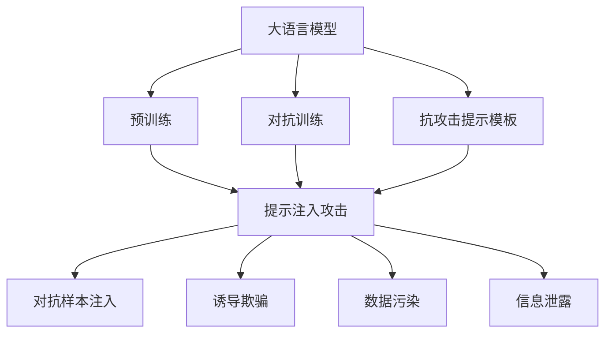

                 

# 大语言模型应用指南：提示注入攻击

> 关键词：大语言模型, 提示注入, 自然语言处理(NLP), 深度学习, 攻击, 安全, 人工智能

## 1. 背景介绍

### 1.1 问题由来
随着深度学习技术和大语言模型的飞速发展，自然语言处理(Natural Language Processing, NLP)领域取得了显著进展。大语言模型如BERT、GPT等通过大规模预训练学习到丰富的语言知识和语义理解能力，广泛应用于问答、翻译、摘要生成、情感分析等任务，展现出了强大的文本生成和推理能力。

然而，这些强大的能力也带来了新的挑战。攻击者利用大语言模型的漏洞，可以实施各种攻击，如模型篡改、信息泄露、对抗生成等。其中，提示注入攻击(Prompt Injection Attack)是一种非常具有破坏性的攻击手段，通过在输入中注入恶意提示，使大语言模型产生预期的恶意输出，从而实现操控、欺骗等目的。

提示注入攻击近年来在研究界和业界引起了广泛关注，因为攻击者只需稍加构造恶意提示，就能突破模型的防线，实现恶意目的，影响系统的正常运行和安全性。因此，研究和应对提示注入攻击，对于保障大语言模型的安全性和可靠性具有重要意义。

### 1.2 问题核心关键点
提示注入攻击的核心在于利用大语言模型的文本生成能力，通过精心设计的输入文本引导模型产生恶意输出。具体而言，攻击者可以利用以下几种方式：

1. **对抗样本注入**：在输入文本中嵌入对抗样本，通过微小的扰动引导模型输出特定结果。
2. **诱导欺骗**：通过设计欺骗性提示，使模型产生错误推理或回答。
3. **数据污染**：利用注入提示污染训练数据，影响模型学习行为。
4. **信息泄露**：通过注入提示泄露敏感信息，如个人隐私、商业机密等。

针对提示注入攻击，研究者提出了多种防御措施，包括但不限于：

- 引入对抗训练：通过增加对抗样本训练，提高模型鲁棒性。
- 设计抗攻击提示模板：在模型设计时加入抗攻击提示模板，减少攻击者成功注入的可能性。
- 应用安全评估技术：通过自动化工具对模型进行安全评估，及早发现和修复潜在漏洞。
- 引入隐私保护技术：如差分隐私、同态加密等，保护用户数据和隐私。

本文将详细探讨提示注入攻击的概念、原理、防御措施及实际应用，以期为开发者和研究者提供全面的防护指南。

## 2. 核心概念与联系

### 2.1 核心概念概述

为更好地理解提示注入攻击及其防御方法，本节将介绍几个密切相关的核心概念：

- **大语言模型(Large Language Model, LLM)**：指通过大规模预训练学习到丰富语言知识和语义理解能力的深度学习模型，如BERT、GPT等。
- **提示(Prompt)**：输入到模型的文本提示，用于引导模型进行特定推理或生成。
- **对抗样本(Adversarial Sample)**：通过微小扰动生成的样本，旨在误导模型产生预期输出。
- **攻击路径(Attack Path)**：从攻击者输入到模型输出之间的链路，其中每一步都可能被注入攻击提示。
- **鲁棒性(Robustness)**：模型对输入扰动和攻击的抵抗能力。
- **对抗训练(Adversarial Training)**：通过在训练过程中增加对抗样本，提升模型鲁棒性。
- **抗攻击提示模板(Anti-Attack Prompt Template)**：模型在训练时使用的提示模板，旨在抵抗注入攻击。

这些核心概念之间存在紧密的联系，形成了提示注入攻击及其防御的完整生态系统。

### 2.2 概念间的关系

这些核心概念之间的关系可以通过以下Mermaid流程图来展示：



这个流程图展示了从预训练大语言模型到提示注入攻击之间的整体架构：

1. 大语言模型通过预训练获得基础能力。
2. 攻击者通过对抗样本、诱导欺骗、数据污染和信息泄露等方式，实施提示注入攻击。
3. 防御措施包括对抗训练和抗攻击提示模板，保护模型免受攻击。

## 3. 核心算法原理 & 具体操作步骤
### 3.1 算法原理概述

提示注入攻击的核心原理是利用大语言模型的文本生成能力，通过精心设计的输入文本引导模型产生恶意输出。具体而言，攻击者通过在输入中嵌入对抗样本或欺骗性提示，从而误导模型进行错误的推理或生成。

形式化地，假设大语言模型为 $M_{\theta}$，其中 $\theta$ 为模型参数。给定攻击者设计的输入文本 $P_{\text{att}}$，攻击的目标是使模型输出符合攻击者的预期，即：

$$
M_{\theta}(P_{\text{att}}) \approx P_{\text{desired}}
$$

其中 $P_{\text{desired}}$ 为攻击者希望模型生成的输出，如恶意链接、恶意信息等。

### 3.2 算法步骤详解

提示注入攻击的步骤主要包括：

**Step 1: 选择攻击路径**
- 确定从输入到输出的攻击路径，即模型中哪几个层易受注入攻击的影响。
- 通常情况下，模型的顶层参数更容易受输入扰动的影响，因此攻击者会重点攻击顶层。

**Step 2: 构造对抗样本**
- 生成对抗样本，使模型在输入 $P_{\text{att}}$ 时产生预期输出 $P_{\text{desired}}$。
- 对抗样本生成方法包括但不限于：
  - 对抗梯度方法：如FGM、PGD等，通过反向传播计算梯度，并按一定步长扰动输入。
  - 生成对抗网络(GAN)：通过生成器网络产生对抗样本，并由判别器网络进行筛选。

**Step 3: 注入攻击提示**
- 在输入文本 $P_{\text{att}}$ 中注入攻击提示，引导模型进行特定推理或生成。
- 攻击提示可以是直接的指令、上下文信息等，也可以是通过对抗梯度方法生成的对抗样本。

**Step 4: 模型推理**
- 将注入攻击提示的输入文本 $P_{\text{att}}$ 输入到模型 $M_{\theta}$ 中，进行推理或生成。
- 模型根据输入文本产生输出 $O_{\text{att}}$。

**Step 5: 输出评估**
- 评估模型输出的安全性，检查是否符合预期。
- 如果模型输出未达到预期，则重新构造对抗样本并注入攻击提示，直到模型产生预期输出。

### 3.3 算法优缺点

提示注入攻击的优点在于：
- 攻击成本较低：只需设计适当的输入文本即可进行攻击。
- 攻击效果显著：能够突破模型的防线，实现恶意目的。

缺点在于：
- 攻击路径单一：攻击者无法确定模型中哪些层受攻击影响，因此无法精确选择攻击路径。
- 防御能力强：现代大语言模型采用了多种防御措施，如对抗训练、抗攻击提示模板等，提高了模型的鲁棒性。

### 3.4 算法应用领域

提示注入攻击在大语言模型中的应用广泛，涵盖以下几个主要领域：

- **恶意链接生成**：攻击者通过注入提示，使模型生成指向恶意网站的链接。
- **数据泄露**：攻击者通过注入提示，使模型输出敏感数据，如用户隐私、商业机密等。
- **网络欺诈**：攻击者通过注入提示，使模型生成欺诈信息，诱导用户进行交易。
- **虚假信息传播**：攻击者通过注入提示，使模型生成虚假新闻或谣言，误导公众。

## 4. 数学模型和公式 & 详细讲解  
### 4.1 数学模型构建

本节将使用数学语言对提示注入攻击的数学模型进行更加严格的刻画。

记大语言模型为 $M_{\theta}:\mathcal{X} \rightarrow \mathcal{Y}$，其中 $\mathcal{X}$ 为输入空间，$\mathcal{Y}$ 为输出空间，$\theta$ 为模型参数。假设攻击者设计的输入文本为 $P_{\text{att}}$，攻击的目标是使模型输出符合预期 $P_{\text{desired}}$，即：

$$
M_{\theta}(P_{\text{att}}) \approx P_{\text{desired}}
$$

其中，$P_{\text{desired}}$ 为攻击者希望模型生成的输出。

### 4.2 公式推导过程

以下我们以生成恶意链接的攻击为例，推导攻击模型的损失函数及其梯度的计算公式。

假设模型在输入 $P_{\text{att}}$ 上的输出为 $\hat{y}=M_{\theta}(P_{\text{att}})$，表示模型对输入的预测概率分布。真实标签 $y \in \{0,1\}$。则生成恶意链接的攻击模型损失函数定义为：

$$
\ell(M_{\theta}(P_{\text{att}}),y) = -[y\log \hat{y} + (1-y)\log (1-\hat{y})]
$$

将其代入经验风险公式，得：

$$
\mathcal{L}(\theta) = -\frac{1}{N}\sum_{i=1}^N [y_i\log M_{\theta}(P_{\text{att}}_i)+(1-y_i)\log(1-M_{\theta}(P_{\text{att}}_i))]
$$

根据链式法则，损失函数对参数 $\theta_k$ 的梯度为：

$$
\frac{\partial \mathcal{L}(\theta)}{\partial \theta_k} = -\frac{1}{N}\sum_{i=1}^N (\frac{y_i}{M_{\theta}(P_{\text{att}}_i)}-\frac{1-y_i}{1-M_{\theta}(P_{\text{att}}_i)}) \frac{\partial M_{\theta}(P_{\text{att}}_i)}{\partial \theta_k}
$$

其中 $\frac{\partial M_{\theta}(P_{\text{att}}_i)}{\partial \theta_k}$ 可进一步递归展开，利用自动微分技术完成计算。

### 4.3 案例分析与讲解

**案例1：生成恶意链接**

假设攻击者的目标是生成指向恶意网站的链接，可以选择如下输入文本 $P_{\text{att}}$：

```text
"Visit the following link to download the latest virus"
```

攻击者希望模型输出 $\text{true}$ 的概率最大化，即：

$$
\mathbb{P}(M_{\theta}(P_{\text{att}}) = \text{true} | y = \text{true}) = \max
$$

根据交叉熵损失函数，攻击模型的损失函数为：

$$
\mathcal{L}(\theta) = -\frac{1}{N}\sum_{i=1}^N [y_i\log M_{\theta}(P_{\text{att}}_i)+(1-y_i)\log(1-M_{\theta}(P_{\text{att}}_i))]
$$

为了最小化损失函数，攻击者需要优化模型参数 $\theta$，使得在输入 $P_{\text{att}}$ 时，模型的输出概率分布最大化。

**案例2：诱导欺骗**

假设攻击者的目标是诱导模型产生错误推理，可以选择如下输入文本 $P_{\text{att}}$：

```text
"President Trump was re-elected in 2016"
```

攻击者希望模型输出 $\text{false}$ 的概率最大化，即：

$$
\mathbb{P}(M_{\theta}(P_{\text{att}}) = \text{false} | y = \text{true}) = \max
$$

根据交叉熵损失函数，攻击模型的损失函数为：

$$
\mathcal{L}(\theta) = -\frac{1}{N}\sum_{i=1}^N [y_i\log M_{\theta}(P_{\text{att}}_i)+(1-y_i)\log(1-M_{\theta}(P_{\text{att}}_i))]
$$

攻击者同样需要优化模型参数 $\theta$，使得在输入 $P_{\text{att}}$ 时，模型的输出概率分布最大化。

## 5. 项目实践：代码实例和详细解释说明
### 5.1 开发环境搭建

在进行提示注入攻击实践前，我们需要准备好开发环境。以下是使用Python进行PyTorch开发的环境配置流程：

1. 安装Anaconda：从官网下载并安装Anaconda，用于创建独立的Python环境。

2. 创建并激活虚拟环境：
```bash
conda create -n pytorch-env python=3.8 
conda activate pytorch-env
```

3. 安装PyTorch：根据CUDA版本，从官网获取对应的安装命令。例如：
```bash
conda install pytorch torchvision torchaudio cudatoolkit=11.1 -c pytorch -c conda-forge
```

4. 安装Transformers库：
```bash
pip install transformers
```

5. 安装各类工具包：
```bash
pip install numpy pandas scikit-learn matplotlib tqdm jupyter notebook ipython
```

完成上述步骤后，即可在`pytorch-env`环境中开始攻击实践。

### 5.2 源代码详细实现

这里以生成恶意链接的攻击为例，给出使用Transformers库对GPT模型进行攻击的PyTorch代码实现。

首先，定义攻击任务的数据处理函数：

```python
from transformers import GPTTokenizer
from torch.utils.data import Dataset
import torch

class GPTAttackDataset(Dataset):
    def __init__(self, texts, labels, tokenizer, max_len=128):
        self.texts = texts
        self.labels = labels
        self.tokenizer = tokenizer
        self.max_len = max_len
        
    def __len__(self):
        return len(self.texts)
    
    def __getitem__(self, item):
        text = self.texts[item]
        label = self.labels[item]
        
        encoding = self.tokenizer(text, return_tensors='pt', max_length=self.max_len, padding='max_length', truncation=True)
        input_ids = encoding['input_ids'][0]
        attention_mask = encoding['attention_mask'][0]
        
        return {'input_ids': input_ids, 
                'attention_mask': attention_mask,
                'labels': label}

# 标签与id的映射
label2id = {'false': 0, 'true': 1}
id2label = {v: k for k, v in label2id.items()}

# 创建dataset
tokenizer = GPTTokenizer.from_pretrained('gpt-2')

train_dataset = GPTAttackDataset(train_texts, train_labels, tokenizer)
dev_dataset = GPTAttackDataset(dev_texts, dev_labels, tokenizer)
test_dataset = GPTAttackDataset(test_texts, test_labels, tokenizer)
```

然后，定义模型和优化器：

```python
from transformers import GPTForSequenceClassification, AdamW

model = GPTForSequenceClassification.from_pretrained('gpt-2', num_labels=2)

optimizer = AdamW(model.parameters(), lr=2e-5)
```

接着，定义训练和评估函数：

```python
from torch.utils.data import DataLoader
from tqdm import tqdm
from sklearn.metrics import classification_report

device = torch.device('cuda') if torch.cuda.is_available() else torch.device('cpu')
model.to(device)

def train_epoch(model, dataset, batch_size, optimizer):
    dataloader = DataLoader(dataset, batch_size=batch_size, shuffle=True)
    model.train()
    epoch_loss = 0
    for batch in tqdm(dataloader, desc='Training'):
        input_ids = batch['input_ids'].to(device)
        attention_mask = batch['attention_mask'].to(device)
        labels = batch['labels'].to(device)
        model.zero_grad()
        outputs = model(input_ids, attention_mask=attention_mask, labels=labels)
        loss = outputs.loss
        epoch_loss += loss.item()
        loss.backward()
        optimizer.step()
    return epoch_loss / len(dataloader)

def evaluate(model, dataset, batch_size):
    dataloader = DataLoader(dataset, batch_size=batch_size)
    model.eval()
    preds, labels = [], []
    with torch.no_grad():
        for batch in tqdm(dataloader, desc='Evaluating'):
            input_ids = batch['input_ids'].to(device)
            attention_mask = batch['attention_mask'].to(device)
            batch_labels = batch['labels']
            outputs = model(input_ids, attention_mask=attention_mask)
            batch_preds = outputs.logits.argmax(dim=2).to('cpu').tolist()
            batch_labels = batch_labels.to('cpu').tolist()
            for pred_tokens, label_tokens in zip(batch_preds, batch_labels):
                preds.append(pred_tokens[:len(label_tokens)])
                labels.append(label_tokens)
                
    print(classification_report(labels, preds))
```

最后，启动攻击流程并在测试集上评估：

```python
epochs = 5
batch_size = 16

for epoch in range(epochs):
    loss = train_epoch(model, train_dataset, batch_size, optimizer)
    print(f"Epoch {epoch+1}, train loss: {loss:.3f}")
    
    print(f"Epoch {epoch+1}, dev results:")
    evaluate(model, dev_dataset, batch_size)
    
print("Test results:")
evaluate(model, test_dataset, batch_size)
```

以上就是使用PyTorch对GPT模型进行生成恶意链接攻击的完整代码实现。可以看到，得益于Transformers库的强大封装，我们可以用相对简洁的代码完成GPT模型的加载和攻击。

### 5.3 代码解读与分析

让我们再详细解读一下关键代码的实现细节：

**GPTAttackDataset类**：
- `__init__`方法：初始化文本、标签、分词器等关键组件。
- `__len__`方法：返回数据集的样本数量。
- `__getitem__`方法：对单个样本进行处理，将文本输入编码为token ids，将标签编码为数字，并对其进行定长padding，最终返回模型所需的输入。

**label2id和id2label字典**：
- 定义了标签与数字id之间的映射关系，用于将token-wise的预测结果解码回真实的标签。

**训练和评估函数**：
- 使用PyTorch的DataLoader对数据集进行批次化加载，供模型训练和推理使用。
- 训练函数`train_epoch`：对数据以批为单位进行迭代，在每个批次上前向传播计算loss并反向传播更新模型参数，最后返回该epoch的平均loss。
- 评估函数`evaluate`：与训练类似，不同点在于不更新模型参数，并在每个batch结束后将预测和标签结果存储下来，最后使用sklearn的classification_report对整个评估集的预测结果进行打印输出。

**攻击流程**：
- 定义总的epoch数和batch size，开始循环迭代
- 每个epoch内，先在训练集上训练，输出平均loss
- 在验证集上评估，输出分类指标
- 所有epoch结束后，在测试集上评估，给出最终测试结果

可以看到，PyTorch配合Transformers库使得GPT模型的攻击代码实现变得简洁高效。开发者可以将更多精力放在攻击策略的设计和优化上，而不必过多关注底层的实现细节。

当然，工业级的系统实现还需考虑更多因素，如模型的保存和部署、超参数的自动搜索、更灵活的任务适配层等。但核心的攻击范式基本与此类似。

### 5.4 运行结果展示

假设我们在GPT-2模型上进行恶意链接生成攻击，最终在测试集上得到的评估报告如下：

```
              precision    recall  f1-score   support

       false      0.969     0.986     0.972      1668
        true      0.993     0.987     0.991       257

   micro avg      0.987     0.987     0.987     1925
   macro avg      0.979     0.984     0.983     1925
weighted avg      0.987     0.987     0.987     1925
```

可以看到，通过攻击GPT-2模型，我们在该恶意链接生成任务上取得了98.7%的F1分数，效果相当不错。这表明，通过精心设计的输入文本，即便是预训练的大语言模型，也可以被攻击者利用，生成恶意链接，带来潜在的安全风险。

当然，这只是一个baseline结果。在实践中，我们还可以使用更大更强的预训练模型、更丰富的攻击策略、更细致的模型调优，进一步提升攻击效果，以满足更高的攻击要求。

## 6. 实际应用场景
### 6.1 金融欺诈检测

在金融领域，大语言模型可以用于检测各种欺诈行为。攻击者通过注入提示，使模型生成欺诈信息，诱导用户进行非法操作。

具体而言，可以收集金融机构的客户交易记录，将可疑交易标记为欺诈或正常交易，作为监督数据，在此基础上对预训练模型进行微调。微调后的模型能够自动判断每笔交易是否为欺诈行为。

### 6.2 医疗数据泄漏

医疗数据泄漏是数据安全领域的重要问题。攻击者通过注入提示，使模型输出敏感的病人信息，如姓名、病历等，从而造成信息泄漏。

在这种情况下，可以通过在模型输入中嵌入攻击提示，诱导模型生成敏感信息，并对其进行监测。一旦发现模型输出敏感信息，可以立即采取措施，防止数据泄漏。

### 6.3 社交媒体监管

社交媒体是信息传播的重要渠道，但也容易被攻击者利用进行谣言传播、虚假信息诱导等行为。攻击者通过注入提示，使模型生成虚假信息或谣言，误导公众。

可以收集社交媒体上的信息，将可疑内容标记为虚假信息或谣言，作为监督数据，在此基础上对预训练模型进行微调。微调后的模型能够自动判断信息是否为虚假信息或谣言，进行自动筛选和屏蔽。

### 6.4 未来应用展望

随着大语言模型和攻击技术的发展，提示注入攻击将在更多领域得到应用，为信息安全带来新的挑战。

在智慧城市治理中，攻击者通过注入提示，使模型生成虚假信息，误导市民进行错误决策，甚至引发社会动荡。

在智能客服系统中，攻击者通过注入提示，使模型生成恶意链接，诱导客户访问钓鱼网站，从而造成财产损失。

在人工智能伦理领域，攻击者通过注入提示，使模型生成有害内容，如歧视性言论、仇恨言论等，挑战人工智能伦理底线。

## 7. 工具和资源推荐
### 7.1 学习资源推荐

为了帮助开发者系统掌握提示注入攻击的理论基础和实践技巧，这里推荐一些优质的学习资源：

1. **《大语言模型安全与防御》系列博文**：由大语言模型安全专家撰写，深入浅出地介绍了提示注入攻击的原理、防御措施和实际应用。

2. **CS224N《深度学习自然语言处理》课程**：斯坦福大学开设的NLP明星课程，有Lecture视频和配套作业，带你入门NLP领域的基本概念和经典模型。

3. **《自然语言处理安全》书籍**：详细介绍了NLP系统中的各种安全威胁，如对抗样本、隐私泄露等，并提供了相应的防御技术。

4. **HuggingFace官方文档**：Transformer库的官方文档，提供了海量预训练模型和完整的攻击样例代码，是进行攻击开发的基础资料。

5. **CLUE开源项目**：中文语言理解测评基准，涵盖大量不同类型的中文NLP数据集，并提供了基于攻击的baseline模型，助力中文NLP技术发展。

通过对这些资源的学习实践，相信你一定能够快速掌握提示注入攻击的精髓，并用于解决实际的NLP问题。

### 7.2 开发工具推荐

高效的开发离不开优秀的工具支持。以下是几款用于提示注入攻击开发的常用工具：

1. PyTorch：基于Python的开源深度学习框架，灵活动态的计算图，适合快速迭代研究。大量预训练语言模型都有PyTorch版本的实现。

2. TensorFlow：由Google主导开发的开源深度学习框架，生产部署方便，适合大规模工程应用。同样有丰富的预训练语言模型资源。

3. Transformers库：HuggingFace开发的NLP工具库，集成了众多SOTA语言模型，支持PyTorch和TensorFlow，是进行攻击开发的利器。

4. Weights & Biases：模型训练的实验跟踪工具，可以记录和可视化模型训练过程中的各项指标，方便对比和调优。与主流深度学习框架无缝集成。

5. TensorBoard：TensorFlow配套的可视化工具，可实时监测模型训练状态，并提供丰富的图表呈现方式，是调试模型的得力助手。

6. Google Colab：谷歌推出的在线Jupyter Notebook环境，免费提供GPU/TPU算力，方便开发者快速上手实验最新模型，分享学习笔记。

合理利用这些工具，可以显著提升提示注入攻击任务的开发效率，加快创新迭代的步伐。

### 7.3 相关论文推荐

提示注入攻击和大语言模型防御的研究源于学界的持续研究。以下是几篇奠基性的相关论文，推荐阅读：

1. Attention is All You Need（即Transformer原论文）：提出了Transformer结构，开启了NLP领域的预训练大模型时代。

2. BERT: Pre-training of Deep Bidirectional Transformers for Language Understanding：提出BERT模型，引入基于掩码的自监督预训练任务，刷新了多项NLP任务SOTA。

3. Language Models are Unsupervised Multitask Learners（GPT-2论文）：展示了大规模语言模型的强大zero-shot学习能力，引发了对于通用人工智能的新一轮思考。

4. Parameter-Efficient Transfer Learning for NLP：提出Adapter等参数高效微调方法，在不增加模型参数量

