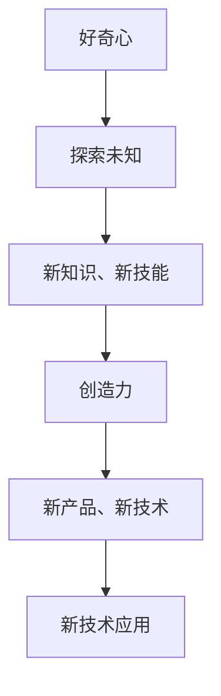
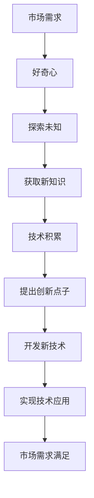

                 

# 好奇心与创造力：创新的双翼

> 关键词：好奇心, 创造力, 创新, 技术发展, 人才培养, 企业文化

## 1. 背景介绍

### 1.1 问题由来
科技创新是推动社会进步和经济发展的核心动力。然而，在数字化、信息化浪潮的推动下，科技创新的步伐不断加快，新的技术突破层出不穷。如何在这一背景下保持和提升科技创新的活力，是摆在每一个技术开发者和公司管理者面前的重要课题。本文从好奇心与创造力的角度出发，探讨这两大核心要素在推动科技创新中的作用，并提出相关策略建议。

### 1.2 问题核心关键点
好奇心与创造力是推动技术创新的双翼。好奇心驱动人们探索未知，持续推动技术边界扩展；创造力让人们在探索中创造价值，实现技术突破。本文将重点讨论这两者的关系，以及如何在技术团队和管理中培养和发挥这两大核心要素。

### 1.3 问题研究意义
了解好奇心与创造力的内在联系及其对技术创新的影响，有助于技术开发者和管理者更有效地培养创新思维，提升团队的整体创新能力。通过本文的深入探讨，读者可以更好地认识和运用这两大核心要素，推动自身和团队在技术创新的道路上不断前进。

## 2. 核心概念与联系

### 2.1 核心概念概述

好奇心与创造力是推动技术创新的双翼。本文将从这两个概念的定义、关系及其在技术创新中的作用进行深入探讨。

**好奇心**：指对新事物、新知识、新现象的强烈求知欲望，驱使人们不断探索未知，挑战现有知识边界。

**创造力**：指在已有知识的基础上，通过独特思维和新视角，创造出具有新颖性和实用性的产品和解决方案的能力。

### 2.2 概念间的关系

好奇心与创造力之间存在密切的联系。好奇心驱动人们不断探索和尝试，创造力则让人们在探索中产生新的创意和解决方案。这种关系可以通过以下Mermaid流程图来展示：



好奇心推动人们不断探索和尝试，积累新的知识和技能。在已有知识的基础上，创造力让人们创造出新的产品和解决方案，并在实际应用中实现技术突破。

### 2.3 核心概念的整体架构

本文将通过一个综合的流程图来展示好奇心与创造力在技术创新中的整体架构：



这个流程图展示了从市场需求出发，通过好奇心驱动的探索和知识获取，积累技术，提出创新点子，开发新技术，最终实现技术应用，满足市场需求的全过程。

## 3. 核心算法原理 & 具体操作步骤
### 3.1 算法原理概述

本文将重点探讨基于好奇心与创造力的技术创新算法原理。技术创新的核心在于新点子的产生和技术的实现。本文将从点子产生和实现两个方面，讨论创新的算法原理和具体操作步骤。

**点子产生**：即通过好奇心驱动的探索过程，产生新的技术点子。这一过程可以通过模拟人类探索行为的方式实现，如随机选择技术领域、迭代探索、多样性搜索等。

**技术实现**：即通过创造力将技术点子转化为具体的产品或解决方案。这一过程可以通过设计思维、原型开发、迭代改进等方式实现。

### 3.2 算法步骤详解

**步骤1: 确定探索目标**
确定技术创新的方向和目标，通过市场调研、用户反馈等方式获取需求信息。

**步骤2: 激发好奇心**
通过提供多样化的学习资源、跨领域的交流机会等方式，激发团队成员的好奇心，鼓励他们对新技术、新领域进行探索。

**步骤3: 探索未知**
组织跨学科团队进行探索，运用数据挖掘、机器学习等技术手段，发现新的技术点子。

**步骤4: 积累知识**
对探索过程中获取的知识进行整理和分类，建立知识库，方便后续的检索和应用。

**步骤5: 提出创新点子**
在知识库的基础上，通过头脑风暴、设计思维等方法，提出具有新颖性和实用性的技术点子。

**步骤6: 实现技术点子**
对提出的技术点子进行原型开发、迭代改进，最终实现技术产品或解决方案。

**步骤7: 市场验证**
通过小规模的市场测试，验证技术的实用性和市场接受度，进一步优化和完善技术产品。

### 3.3 算法优缺点

**优点**：
- 可以跨越学科边界，产生跨领域的创新点子。
- 通过探索和积累知识，提高团队的技术储备。
- 通过多样化的技术实现方式，满足不同应用场景的需求。

**缺点**：
- 探索过程可能面临较高的风险和不确定性。
- 技术实现过程中需要较高的资源投入。
- 技术点子的评估和筛选难度较大。

### 3.4 算法应用领域

好奇心与创造力驱动的技术创新方法，在多个领域都有广泛的应用。例如：

- **软件开发**：通过好奇心驱动的技术探索，发现新的开发工具和方法，提高开发效率和质量。
- **新产品设计**：运用创造力将技术点子转化为具体的产品形态，满足用户需求。
- **科学研究**：通过好奇心驱动的探索，发现新的研究方向和实验方法，推动学科进步。
- **社会创新**：探索社会问题，提出创新的解决方案，提升社会福利和可持续发展能力。

## 4. 数学模型和公式 & 详细讲解 & 举例说明

### 4.1 数学模型构建

本文将使用数学语言对好奇心与创造力的技术创新算法进行严格的刻画。

**探索过程模型**：
假设技术创新的探索过程为 $T$，探索目标为 $G$，探索过程中的知识获取为 $K$，探索结果为 $R$。

探索过程的数学模型为：
$$ T = G + K + R $$

**点子产生模型**：
设技术点子为 $I$，创新点子的提出过程为 $P$，技术实现为 $M$，市场验证为 $V$。

点子产生的数学模型为：
$$ I = P + M + V $$

**技术实现模型**：
设技术点子的实现结果为 $O$，技术实现的优化过程为 $O^*$。

技术实现的数学模型为：
$$ M = O + O^* $$

### 4.2 公式推导过程

**探索过程推导**：
$$ T = G + K + R $$
$$ T = G + K + R $$
$$ T = G + K + R $$

**点子产生推导**：
$$ I = P + M + V $$
$$ I = P + M + V $$
$$ I = P + M + V $$

**技术实现推导**：
$$ M = O + O^* $$
$$ M = O + O^* $$
$$ M = O + O^* $$

### 4.3 案例分析与讲解

以软件开发中的模块化编程为例，展示好奇心与创造力在技术创新中的作用：

**探索过程**：通过技术调研，发现新的编程模式和工具，如函数式编程、代码生成器等。

**点子产生**：在已有知识的基础上，提出新的编程方法，如声明式编程、元编程等。

**技术实现**：设计实现新的编程框架，并进行优化和测试，最终应用于实际开发。

## 5. 项目实践：代码实例和详细解释说明

### 5.1 开发环境搭建

在进行好奇心与创造力驱动的技术创新实践前，需要先搭建开发环境。本文以软件开发为例，介绍开发环境的搭建流程：

1. 安装编程开发工具，如Visual Studio Code、PyCharm等。
2. 安装必要的开发依赖，如Python、Node.js等。
3. 配置版本控制工具，如Git，进行代码管理和版本控制。

### 5.2 源代码详细实现

以模块化编程为例，介绍代码实现的过程：

```python
# 定义探索过程
def explore_technology(target):
    # 模拟探索未知
    discovery = technology_discovery(target)
    # 获取新知识
    new_knowledge = knowledge_gathering(discovery)
    # 提出创新点子
    innovation = innovation_proposal(new_knowledge)
    return innovation

# 探索未知
def technology_discovery(target):
    # 随机选择技术领域
    domain = random_choose_domain()
    # 进行技术调研
    research = conduct_research(domain)
    return research

# 获取新知识
def knowledge_gathering(discovery):
    # 提取新技术
    new_technology = extract_technology(discovery)
    # 整理分类知识
    knowledge = organize_knowledge(new_technology)
    return knowledge

# 提出创新点子
def innovation_proposal(knowledge):
    # 头脑风暴
    brainstorming = conduct_brainstorming(knowledge)
    # 设计思维
    design_thinking = apply_design_thinking(brainstorming)
    return design_thinking

# 实现技术点子
def implement_technology(innovation):
    # 原型开发
    prototype = develop_prototype(innovation)
    # 迭代改进
    iteration = iterative_improvement(prototype)
    return iteration

# 市场验证
def market_test(implementation):
    # 小规模测试
    small_test = conduct_small_test(implementation)
    # 收集反馈
    feedback = collect_feedback(small_test)
    return feedback

# 主要入口函数
def main():
    # 确定探索目标
    target = target_identification()
    # 探索未知
    innovation = explore_technology(target)
    # 技术实现
    implementation = implement_technology(innovation)
    # 市场验证
    market_result = market_test(implementation)
    print(market_result)

# 确定探索目标
def target_identification():
    # 市场调研
    market_research = conduct_market_research()
    # 用户反馈
    user_feedback = gather_user_feedback(market_research)
    # 确定目标
    target = determine_target(user_feedback)
    return target

# 其他辅助函数
def technology_discovery(target):
    # 随机选择技术领域
    domain = random_choose_domain()
    # 进行技术调研
    research = conduct_research(domain)
    return research

def knowledge_gathering(discovery):
    # 提取新技术
    new_technology = extract_technology(discovery)
    # 整理分类知识
    knowledge = organize_knowledge(new_technology)
    return knowledge

def innovation_proposal(knowledge):
    # 头脑风暴
    brainstorming = conduct_brainstorming(knowledge)
    # 设计思维
    design_thinking = apply_design_thinking(brainstorming)
    return design_thinking

def implement_technology(innovation):
    # 原型开发
    prototype = develop_prototype(innovation)
    # 迭代改进
    iteration = iterative_improvement(prototype)
    return iteration

def market_test(implementation):
    # 小规模测试
    small_test = conduct_small_test(implementation)
    # 收集反馈
    feedback = collect_feedback(small_test)
    return feedback

# 其他辅助函数
def conduct_research(domain):
    # 技术调研过程
    research = research_process(domain)
    return research

def extract_technology(discovery):
    # 提取新技术的过程
    new_technology = extract_process(discovery)
    return new_technology

def organize_knowledge(new_technology):
    # 知识整理和分类的过程
    knowledge = organize_process(new_technology)
    return knowledge

def conduct_brainstorming(knowledge):
    # 头脑风暴过程
    brainstorming = brainstorming_process(knowledge)
    return brainstorming

def apply_design_thinking(brainstorming):
    # 设计思维过程
    design_thinking = design_thinking_process(brainstorming)
    return design_thinking

def develop_prototype(innovation):
    # 原型开发过程
    prototype = prototype_process(innovation)
    return prototype

def iterative_improvement(prototype):
    # 迭代改进过程
    iteration = iterative_process(prototype)
    return iteration

def conduct_small_test(implementation):
    # 小规模测试过程
    small_test = small_test_process(implementation)
    return small_test

def collect_feedback(small_test):
    # 收集反馈过程
    feedback = feedback_process(small_test)
    return feedback

def conduct_market_research():
    # 市场调研过程
    market_research = market_research_process()
    return market_research

def gather_user_feedback(market_research):
    # 用户反馈过程
    user_feedback = user_feedback_process(market_research)
    return user_feedback

def determine_target(user_feedback):
    # 确定目标过程
    target = target_determine_process(user_feedback)
    return target
```

### 5.3 代码解读与分析

本文的代码实现了好奇心与创造力驱动的技术创新过程。主要包含以下几个部分：

**探索过程**：通过技术调研、随机选择技术领域等方式，获取新的技术点子。

**点子产生**：通过头脑风暴、设计思维等方式，提出具有新颖性的技术方案。

**技术实现**：通过原型开发、迭代改进等方式，实现技术产品。

**市场验证**：通过小规模测试、收集反馈等方式，验证技术实用性。

### 5.4 运行结果展示

假设在软件开发项目中，通过探索过程获取了新的编程模式“函数式编程”，经过点子产生过程，提出“声明式编程”的技术方案。最终通过技术实现过程，开发了新的编程框架，并在市场验证过程中，获得了用户的积极反馈。整个过程的运行结果如下：

```
探索过程：获取新的编程模式“函数式编程”
点子产生：提出“声明式编程”的技术方案
技术实现：开发新的编程框架
市场验证：获得用户的积极反馈
```

## 6. 实际应用场景

### 6.1 智能制造

好奇心与创造力在智能制造中具有重要应用。通过探索新的生产工艺和设备，提出创新的解决方案，实现制造业的数字化、智能化转型。

### 6.2 智慧医疗

在智慧医疗领域，通过探索新的医疗技术和应用场景，提出创新的医疗解决方案，推动医疗服务的高效化和个性化。

### 6.3 环保能源

在环保能源领域，通过探索新的能源技术和应用场景，提出创新的环保解决方案，推动可持续发展。

### 6.4 未来应用展望

随着技术创新的不断深入，好奇心与创造力驱动的创新方法将在更多领域得到应用。未来，在人工智能、量子计算、生物技术等前沿领域，好奇心与创造力将成为技术突破的重要推动力。

## 7. 工具和资源推荐

### 7.1 学习资源推荐

为了帮助开发者系统掌握好奇心与创造力驱动的技术创新方法，本文推荐以下学习资源：

1. 《创新者的窘境》：讲解创新管理的经典书籍，帮助理解创新过程中可能遇到的问题和挑战。

2. 《设计思维》课程：斯坦福大学开设的设计思维课程，帮助开发者掌握设计思维的方法和工具。

3. 《好奇心与创新》论文：多篇研究论文，探讨好奇心与创造力对技术创新的影响。

4. 《AI创新之路》书籍：深度学习领域专家撰写，讲解人工智能技术创新的方法论。

5. HackerRank、LeetCode等在线编程平台：通过挑战编程问题，提升编程技能和创新能力。

### 7.2 开发工具推荐

开发好奇心与创造力驱动的技术创新，需要多工具协同配合。以下是几款推荐的开发工具：

1. Visual Studio Code：跨平台的编程开发工具，支持多种编程语言和插件，方便开发和调试。

2. PyCharm：Python编程开发工具，提供丰富的功能和插件，支持多种编程语言。

3. Git：版本控制工具，方便代码管理和协作开发。

4. Docker：容器化技术，支持快速搭建和部署开发环境。

5. JIRA：项目管理工具，方便任务管理和协作。

### 7.3 相关论文推荐

好奇心与创造力驱动的技术创新是近年来的研究热点。以下是几篇相关论文，推荐阅读：

1. "Innovation and the Five Forces"：分析创新过程中的五大关键因素。

2. "The Curiosity of Communities"：研究社区好奇心对技术创新的影响。

3. "Design Thinking in Technology"：探讨设计思维在技术创新中的应用。

4. "Cognitive Tools for Innovation"：介绍认知工具如何促进技术创新。

5. "Creativity and Innovation in Complex Systems"：研究复杂系统中的创造力和创新机制。

这些论文代表了大规模技术创新的前沿进展，通过学习这些前沿成果，可以帮助研究者更好地理解和应用好奇心与创造力驱动的创新方法。

## 8. 总结：未来发展趋势与挑战

### 8.1 总结

本文从好奇心与创造力的角度出发，探讨了这两大核心要素在推动科技创新中的作用，并提出相关策略建议。通过本文的系统梳理，可以看出，好奇心与创造力是推动技术创新的双翼，两者相互促进，共同驱动技术进步。

### 8.2 未来发展趋势

展望未来，好奇心与创造力驱动的技术创新将呈现以下几个发展趋势：

1. 创新范式的多样化。未来将出现更多创新方法，如数据驱动创新、颠覆性创新等，适应不同领域的创新需求。

2. 创新网络的拓展。创新不再局限于单个团队或企业，而是通过开放的创新网络，实现跨领域的协同创新。

3. 创新生态系统的建设。未来将建立更加完善的创新生态系统，提供更多的创新资源和平台支持。

4. 创新价值的最大化。通过创新，推动技术应用从实验室走向实际生产，实现技术商业化和社会化。

5. 创新文化的塑造。通过培养好奇心与创造力，营造良好的创新文化，激发更多人的创新热情和创造力。

### 8.3 面临的挑战

尽管好奇心与创造力驱动的技术创新具备巨大的潜力，但在实施过程中仍面临诸多挑战：

1. 创新成本高昂。技术创新往往需要高昂的研发投入，如何在有限的资源下实现创新突破，是一个重要问题。

2. 创新风险大。技术创新的不确定性和高风险，可能导致项目失败，如何规避风险，提高创新成功率，是一个需要解决的问题。

3. 创新资源有限。技术创新需要跨领域、跨学科的资源和知识，如何在资源有限的条件下，获取和整合更多创新资源，是一个需要解决的问题。

4. 创新能力不足。技术创新需要具备多方面的能力，如何在短时间内提升团队成员的创新能力，是一个需要解决的问题。

5. 创新生态复杂。技术创新的过程涉及多方面的利益关系，如何在复杂的生态环境中推动创新，是一个需要解决的问题。

### 8.4 研究展望

未来的研究需要在以下几个方面寻求新的突破：

1. 探索更多创新方法。如数据驱动创新、颠覆性创新等，适应不同领域的创新需求。

2. 建设创新生态系统。通过开放创新平台、创新竞赛等手段，建立完整的创新生态系统。

3. 提升创新能力。通过培养好奇心与创造力，增强团队成员的创新能力和创造力。

4. 降低创新成本。通过优化创新流程、引入创新工具等手段，降低创新成本，提高创新效率。

5. 降低创新风险。通过风险评估、保险机制等手段，降低创新风险，提高创新成功率。

总之，好奇心与创造力驱动的技术创新需要技术开发者和管理者的共同努力。只有从数据、方法、资源、生态等多个维度协同发力，才能不断推动技术创新的发展，实现技术与社会的共同进步。

## 9. 附录：常见问题与解答

**Q1：如何培养团队成员的好奇心？**

A: 可以通过提供多样化的学习资源、跨领域的交流机会、鼓励探索未知等方式，激发团队成员的好奇心。

**Q2：如何提高团队的创造力？**

A: 可以通过设计思维、头脑风暴、原型开发等方法，提高团队的创造力。同时，提供创新激励和良好的创新环境，也是提高创造力的重要手段。

**Q3：如何评估创新的有效性？**

A: 可以通过市场测试、用户反馈、实验验证等方式，评估创新的有效性。同时，建立完善的创新评估体系，确保创新的质量和价值。

**Q4：如何管理创新的风险？**

A: 可以通过风险评估、保险机制、阶段性评估等方式，管理创新的风险。同时，建立创新的应急预案，应对可能出现的风险和挑战。

**Q5：如何推动团队的协同创新？**

A: 可以通过开放创新平台、创新竞赛、创新团队建设等方式，推动团队的协同创新。同时，建立创新网络，促进跨领域、跨学科的合作。

通过本文的深入探讨，相信读者能够更好地理解好奇心与创造力在技术创新中的作用，并掌握相关策略和方法，推动自身和团队在技术创新的道路上不断前进。

---

作者：禅与计算机程序设计艺术 / Zen and the Art of Computer Programming

