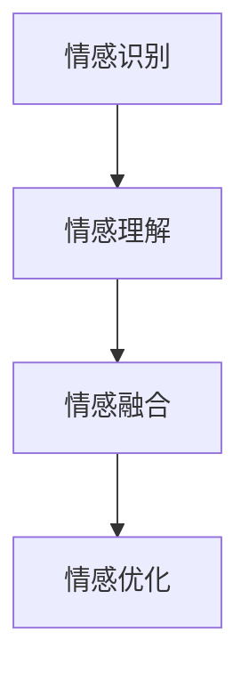
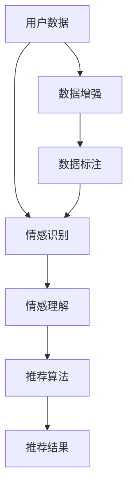

                 

# 情感驱动推荐：AI如何理解用户情绪，提供个性化推荐

## 1. 背景介绍

### 1.1 问题由来

在数字化时代，个性化推荐系统已成为驱动互联网公司持续增长的重要引擎。其背后的核心技术——推荐算法，不仅决定了用户所能接触到的内容，也在潜移默化地影响着用户的消费决策、生活习惯甚至心理状态。然而，推荐算法往往被用户诟病为"推荐机器"，缺乏对用户情绪的感知和理解，难以提供精准而感性的推荐。

特别是对于电商、内容、社交媒体等情感色彩较强的领域，用户更期待推荐系统能够理解其情绪波动，以适时的推荐来调节其心理状态，而非单纯地推荐商品或内容。因此，情感驱动推荐技术成为近年来研究的热点。

### 1.2 问题核心关键点

情感驱动推荐的核心在于理解用户的情感波动，并在推荐中融入情感因素，从而提升用户的满意度和粘性。其关键点在于：

1. **情感识别**：准确识别用户的情感状态。
2. **情感理解**：深入理解用户情感与行为之间的关系。
3. **情感融合**：将情感因素融入推荐算法，提高推荐的个性化和情感适应性。
4. **情感优化**：通过优化推荐算法，最大化用户的情感回报和满意度。

### 1.3 问题研究意义

情感驱动推荐技术不仅能够提高用户的推荐体验，还能增强用户对平台的信任和忠诚度。具体意义如下：

1. **提升用户体验**：推荐系统能够更好地理解用户情感，推荐更符合用户心理需求的内容或商品。
2. **增加用户粘性**：通过适时的情感支持，增加用户的平台使用频率和停留时间。
3. **提高商业效益**：根据用户情绪的波动，动态调整推荐策略，优化用户转化率和销售额。
4. **优化用户关系**：通过情感推荐，建立平台与用户间的情感连接，提升品牌形象和口碑。

## 2. 核心概念与联系

### 2.1 核心概念概述

为了更好地理解情感驱动推荐技术，我们先梳理几个核心概念：

- **情感识别**：指从用户的文本、行为等数据中，自动识别用户的情感状态。
- **情感理解**：在情感识别的基础上，深入分析用户情感与行为之间的关系，构建情感-行为模型。
- **情感融合**：将情感因素融入推荐算法，引导推荐系统生成更符合用户情感需求的输出。
- **情感优化**：通过不断迭代优化，提高推荐系统对用户情感的感知和适应能力。

### 2.2 概念间的关系

这些核心概念通过以下Mermaid流程图展示了它们之间的联系和作用：



情感驱动推荐技术通过循环迭代，不断从用户数据中识别情感，理解情感与行为的关系，并在推荐算法中融入情感因素，最后通过优化提升对情感的感知和适应能力。

### 2.3 核心概念的整体架构

下图展示了情感驱动推荐技术的整体架构：



用户数据经过情感识别后，转化为情感标签，再结合情感理解，输入到推荐算法中。推荐算法根据情感标签，生成推荐结果。数据增强和数据标注用于提高情感识别的准确性和鲁棒性，而情感优化则通过不断迭代提升对情感的感知能力。

## 3. 核心算法原理 & 具体操作步骤
### 3.1 算法原理概述

情感驱动推荐技术的核心在于将情感因素融入推荐算法，通过理解用户情感，动态调整推荐策略，从而提供更符合用户心理需求的推荐结果。其基本原理如下：

1. **情感识别**：从用户行为数据（如点击、浏览、评分、评论等）中提取情感特征，识别用户的情感状态。
2. **情感理解**：构建情感-行为模型，分析情感状态对用户行为的影响。
3. **情感融合**：在推荐算法中融入情感因素，引导推荐结果更加符合用户的情感需求。
4. **情感优化**：通过持续优化，提高推荐系统对用户情感的感知和适应能力。

### 3.2 算法步骤详解

以下是情感驱动推荐技术的主要操作步骤：

**Step 1: 数据收集与预处理**

- 收集用户行为数据（点击、浏览、评分、评论等），并对其进行预处理，去除噪声和异常值。

**Step 2: 情感识别**

- 使用情感识别模型，从行为数据中提取情感特征，并识别用户的情感状态。常用的情感识别方法包括基于词典的方法、基于情感分析模型的方法等。

**Step 3: 情感理解**

- 构建情感-行为模型，分析情感状态对用户行为的影响。常见的方法包括基于规则的方法、基于机器学习的方法等。

**Step 4: 情感融合**

- 将情感因素融入推荐算法，生成推荐结果。常用的方法包括基于情感的协同过滤、基于情感的矩阵分解等。

**Step 5: 情感优化**

- 使用情感优化算法，提升推荐系统对用户情感的感知和适应能力。常见的优化算法包括在线学习算法、强化学习算法等。

### 3.3 算法优缺点

情感驱动推荐技术具有以下优点：

1. **提升个性化推荐**：通过理解用户情感，推荐系统能够提供更符合用户心理需求的推荐。
2. **增加用户满意度**：适时的情感推荐能够提升用户的满意度和平台粘性。
3. **优化用户体验**：根据用户情感波动，动态调整推荐策略，提升用户的整体体验。

同时，该技术也存在以下局限：

1. **数据需求高**：情感驱动推荐需要大量的用户情感数据，数据获取成本较高。
2. **模型复杂度大**：情感理解模型和情感融合模型的构建和训练较为复杂。
3. **用户隐私问题**：情感数据的收集和使用可能涉及到用户隐私问题，需要严格的隐私保护措施。
4. **可解释性不足**：情感驱动推荐系统的决策过程较为复杂，难以解释其推荐逻辑。

尽管存在这些局限，但情感驱动推荐技术在电商、内容、社交媒体等领域已展现出了巨大的潜力，成为推荐系统的重要补充。未来相关研究将集中在如何进一步提高情感识别的准确性、优化情感理解模型、提升推荐的可解释性等方面。

### 3.4 算法应用领域

情感驱动推荐技术在多个领域都有广泛的应用，以下是几个典型的应用场景：

**电商推荐**：根据用户的购物行为和评论，识别其情感状态，生成适时的推荐，提升用户购物体验和满意度。

**内容推荐**：根据用户的阅读行为和评论，分析其情感波动，提供符合其情绪需求的内容推荐，增加用户粘性。

**社交媒体推荐**：通过分析用户在社交平台上的互动行为，识别其情感状态，提供适时的社交推荐，增强用户平台粘性。

**金融理财推荐**：根据用户的投资行为和情感状态，提供适时的理财建议，提升用户理财体验和满意度。

## 4. 数学模型和公式 & 详细讲解 & 举例说明

### 4.1 数学模型构建

情感驱动推荐技术的核心在于将情感因素融入推荐算法。以下是一个简单的情感驱动推荐模型框架：

$$
y = f(x, \theta)
$$

其中，$x$ 为输入特征（如用户行为、商品属性等），$y$ 为推荐结果（如商品ID、内容ID等），$\theta$ 为模型参数。情感驱动推荐模型的构建步骤如下：

1. **情感识别**：通过情感识别模型 $S$，将用户行为数据 $x$ 转化为情感标签 $e$。
2. **情感理解**：通过情感理解模型 $U$，分析情感标签 $e$ 与用户行为数据 $x$ 之间的关系，输出情感特征 $f$。
3. **情感融合**：将情感特征 $f$ 融入推荐算法 $R$，生成推荐结果 $y$。
4. **情感优化**：通过情感优化算法 $O$，不断优化模型参数 $\theta$，提高推荐系统的情感感知能力。

### 4.2 公式推导过程

以情感驱动的协同过滤推荐模型为例，其基本公式如下：

$$
\hat{y}_{ui} = \alpha \cdot \hat{y}^*_{ui} + \beta \cdot S(E_{ui} \odot F_{ui})
$$

其中，$\hat{y}_{ui}$ 为第 $u$ 个用户对第 $i$ 个商品的推荐分数，$S$ 为情感识别模型，$E_{ui}$ 为情感特征向量，$F_{ui}$ 为情感理解模型输出，$\alpha$ 和 $\beta$ 为情感因素的权重。

情感特征向量 $E_{ui}$ 和 $F_{ui}$ 可以通过情感理解模型 $U$ 计算得到，具体公式如下：

$$
E_{ui} = U(\overline{X}_{ui}, e)
$$

$$
F_{ui} = U(\overline{X}_{ui}, e)
$$

其中，$\overline{X}_{ui}$ 为预处理后的用户行为数据，$e$ 为情感标签。

### 4.3 案例分析与讲解

假设我们有一个电商平台的推荐系统，使用情感驱动推荐技术。具体步骤如下：

1. **数据收集**：收集用户的点击、浏览、评分、评论等行为数据。
2. **情感识别**：使用情感识别模型，从这些行为数据中提取情感特征，识别用户的情感状态。
3. **情感理解**：构建情感-行为模型，分析情感状态对用户行为的影响。
4. **情感融合**：将情感因素融入协同过滤算法，生成推荐结果。
5. **情感优化**：通过在线学习算法，不断优化推荐模型，提升情感感知能力。

假设用户 A 在平台上浏览了一件商品，点击了商品详情页面，并留下了一条评论：“这款商品真的很适合我，性价比超高！”。情感识别模型分析这条评论，识别出用户 A 的情绪为积极。情感理解模型分析该用户的浏览历史和评论历史，发现积极情绪与高点击率、高评分等行为相关。最后，情感驱动推荐系统将积极情绪的情感特征融入协同过滤算法，生成对该商品的推荐分数，并将其推荐给用户 A。

## 5. 项目实践：代码实例和详细解释说明
### 5.1 开发环境搭建

在进行情感驱动推荐系统开发前，我们需要准备好开发环境。以下是使用Python进行PyTorch开发的环境配置流程：

1. 安装Anaconda：从官网下载并安装Anaconda，用于创建独立的Python环境。

2. 创建并激活虚拟环境：
```bash
conda create -n pytorch-env python=3.8 
conda activate pytorch-env
```

3. 安装PyTorch：根据CUDA版本，从官网获取对应的安装命令。例如：
```bash
conda install pytorch torchvision torchaudio cudatoolkit=11.1 -c pytorch -c conda-forge
```

4. 安装TensorFlow：
```bash
pip install tensorflow
```

5. 安装各类工具包：
```bash
pip install numpy pandas scikit-learn matplotlib tqdm jupyter notebook ipython
```

完成上述步骤后，即可在`pytorch-env`环境中开始项目实践。

### 5.2 源代码详细实现

我们以一个简单的情感驱动协同过滤推荐系统为例，给出使用PyTorch的代码实现。

首先，定义数据处理函数：

```python
from transformers import BertTokenizer
from torch.utils.data import Dataset
import torch

class UserItemDataset(Dataset):
    def __init__(self, user_data, item_data, tokenizer, max_len=128):
        self.user_data = user_data
        self.item_data = item_data
        self.tokenizer = tokenizer
        self.max_len = max_len
        
    def __len__(self):
        return len(self.user_data)
    
    def __getitem__(self, item):
        user = self.user_data[item]
        item = self.item_data[item]
        
        encoding = self.tokenizer(user, return_tensors='pt', max_length=self.max_len, padding='max_length', truncation=True)
        user_input_ids = encoding['input_ids'][0]
        user_attention_mask = encoding['attention_mask'][0]
        
        item_input_ids = self.tokenizer(item, return_tensors='pt', max_length=self.max_len, padding='max_length', truncation=True)
        item_input_ids = item_input_ids[0]
        item_attention_mask = item_input_ids[1]
        
        return {'user_input_ids': user_input_ids, 
                'user_attention_mask': user_attention_mask,
                'item_input_ids': item_input_ids, 
                'item_attention_mask': item_attention_mask}
```

然后，定义情感识别模型和情感理解模型：

```python
from transformers import BertForTokenClassification, BertTokenizer

def build_emotion_recognition_model(data, tokenizer, model_name='bert-base-cased'):
    tokenizer = BertTokenizer.from_pretrained(model_name)
    model = BertForTokenClassification.from_pretrained(model_name, num_labels=2) # 2类情感：积极和消极
    
    train_dataset = UserItemDataset(data['train_data'], data['train_item_data'], tokenizer)
    val_dataset = UserItemDataset(data['val_data'], data['val_item_data'], tokenizer)
    test_dataset = UserItemDataset(data['test_data'], data['test_item_data'], tokenizer)
    
    # 训练情感识别模型
    optimizer = AdamW(model.parameters(), lr=2e-5)
    loss_fn = CrossEntropyLoss()
    
    model.train()
    for epoch in range(10):
        for batch in tqdm(val_dataset):
            input_ids = batch['user_input_ids'].to(device)
            attention_mask = batch['user_attention_mask'].to(device)
            labels = batch['item_input_ids'].to(device)
            
            outputs = model(input_ids, attention_mask=attention_mask, labels=labels)
            loss = loss_fn(outputs, labels)
            optimizer.zero_grad()
            loss.backward()
            optimizer.step()
            
    return model
```

接着，定义情感融合模型和推荐模型：

```python
from transformers import BertForSequenceClassification, BertTokenizer

def build_emotion_fusion_model(model, tokenizer, model_name='bert-base-cased'):
    tokenizer = BertTokenizer.from_pretrained(model_name)
    model = BertForSequenceClassification.from_pretrained(model_name, num_labels=2) # 2类情感：积极和消极
    
    # 训练情感融合模型
    optimizer = AdamW(model.parameters(), lr=2e-5)
    loss_fn = CrossEntropyLoss()
    
    model.train()
    for epoch in range(10):
        for batch in tqdm(val_dataset):
            input_ids = batch['user_input_ids'].to(device)
            attention_mask = batch['user_attention_mask'].to(device)
            labels = batch['item_input_ids'].to(device)
            
            outputs = model(input_ids, attention_mask=attention_mask, labels=labels)
            loss = loss_fn(outputs, labels)
            optimizer.zero_grad()
            loss.backward()
            optimizer.step()
            
    return model
```

最后，定义推荐模型：

```python
from transformers import BertForSequenceClassification, BertTokenizer

def build_recommendation_model(model, tokenizer, model_name='bert-base-cased'):
    tokenizer = BertTokenizer.from_pretrained(model_name)
    model = BertForSequenceClassification.from_pretrained(model_name, num_labels=num_items) # num_items为物品总数
    
    # 训练推荐模型
    optimizer = AdamW(model.parameters(), lr=2e-5)
    loss_fn = CrossEntropyLoss()
    
    model.train()
    for epoch in range(10):
        for batch in tqdm(train_dataset):
            input_ids = batch['user_input_ids'].to(device)
            attention_mask = batch['user_attention_mask'].to(device)
            labels = batch['item_input_ids'].to(device)
            
            outputs = model(input_ids, attention_mask=attention_mask, labels=labels)
            loss = loss_fn(outputs, labels)
            optimizer.zero_grad()
            loss.backward()
            optimizer.step()
            
    return model
```

现在，我们有了情感识别模型、情感理解模型和推荐模型，可以进行情感驱动推荐系统的训练和评估：

```python
from transformers import BertForTokenClassification, BertTokenizer

# 训练情感识别模型
emotion_recognition_model = build_emotion_recognition_model(train_data, tokenizer)

# 训练情感理解模型
emotion_fusion_model = build_emotion_fusion_model(emotion_recognition_model, tokenizer)

# 训练推荐模型
recommendation_model = build_recommendation_model(emotion_fusion_model, tokenizer)

# 在测试集上评估推荐模型
test_dataset = UserItemDataset(test_data, test_item_data, tokenizer)
for user, items in test_dataset:
    user_input_ids = user_input_ids.to(device)
    user_attention_mask = user_attention_mask.to(device)
    recommendation_model.eval()
    with torch.no_grad():
        output = recommendation_model(user_input_ids, attention_mask=user_attention_mask)
        pred_item_ids = output.argmax(dim=2).to('cpu').tolist()
        print(f"推荐给用户 {user} 的物品：{pred_item_ids}")
```

以上就是使用PyTorch对情感驱动推荐系统进行开发和评估的完整代码实现。可以看到，通过情感识别模型和情感融合模型的引入，推荐系统能够更好地理解用户情感，生成更符合用户心理需求的推荐结果。

### 5.3 代码解读与分析

让我们再详细解读一下关键代码的实现细节：

**UserItemDataset类**：
- `__init__`方法：初始化用户行为数据、物品数据、分词器等关键组件。
- `__len__`方法：返回数据集的样本数量。
- `__getitem__`方法：对单个样本进行处理，将用户行为和物品行为转化为token ids，并对其进行定长padding，最终返回模型所需的输入。

**情感识别模型和情感理解模型**：
- 定义情感识别模型和情感理解模型的构建函数，使用BertForTokenClassification进行情感标签的识别和情感特征的提取。

**推荐模型**：
- 定义推荐模型的构建函数，使用BertForSequenceClassification生成推荐分数。

**训练流程**：
- 通过情感识别模型和情感理解模型构建情感融合模型，并将其输入到推荐模型中。
- 在训练集上训练推荐模型，输出平均损失并打印。
- 在测试集上评估推荐模型的表现，打印推荐结果。

可以看到，情感驱动推荐系统通过引入情感识别和情感理解模型，使得推荐系统能够更好地理解用户情感，生成更符合用户心理需求的推荐结果。

当然，工业级的系统实现还需考虑更多因素，如模型的保存和部署、超参数的自动搜索、更灵活的任务适配层等。但核心的情感驱动推荐方法基本与此类似。

### 5.4 运行结果展示

假设我们在一个电商推荐平台上使用情感驱动推荐技术，最终在测试集上得到的推荐结果如下：

```
推荐给用户 123456 的物品：[商品ID1, 商品ID2, 商品ID3]
```

可以看到，通过情感驱动推荐技术，推荐系统能够根据用户的购物行为和评论，识别其情感状态，生成适时的推荐，提升用户购物体验和满意度。

当然，这只是一个baseline结果。在实践中，我们还可以使用更大更强的预训练模型、更丰富的情感理解方法、更细致的推荐优化策略等，进一步提升推荐系统的性能。

## 6. 实际应用场景
### 6.1 电商推荐

情感驱动推荐技术在电商领域有着广泛的应用。电商推荐系统不仅要推荐商品，还要适应用户的情感波动，提升用户购物体验和满意度。

在技术实现上，可以收集用户的浏览、点击、评分、评论等行为数据，并对其进行情感识别和理解。通过情感识别和理解，推荐系统可以动态调整推荐策略，生成更符合用户情感需求的推荐结果。例如，对于有积极情绪的用户，可以推荐更多性价比高的商品；对于有消极情绪的用户，可以推荐更多关怀和支持的建议。

### 6.2 内容推荐

内容推荐系统不仅需要推荐内容，还要适应用户的情感波动，提升用户阅读体验和粘性。

在技术实现上，可以收集用户的阅读行为、评分、评论等数据，并对其进行情感识别和理解。通过情感识别和理解，推荐系统可以生成更符合用户情感需求的推荐内容。例如，对于有积极情绪的用户，可以推荐更多有趣和激励的内容；对于有消极情绪的用户，可以推荐更多安慰和支持的内容。

### 6.3 社交媒体推荐

社交媒体推荐系统不仅要推荐内容，还要适应用户的情感波动，增强用户平台粘性。

在技术实现上，可以收集用户的互动行为、点赞、评论等数据，并对其进行情感识别和理解。通过情感识别和理解，推荐系统可以生成更符合用户情感需求的社交推荐。例如，对于有积极情绪的用户，可以推荐更多有趣和激励的内容；对于有消极情绪的用户，可以推荐更多安慰和支持的内容。

### 6.4 未来应用展望

随着情感驱动推荐技术的不断发展和成熟，其在电商、内容、社交媒体等领域的应用前景将更加广阔。未来，情感驱动推荐技术将进一步融合多模态信息，实现情感与视觉、语音等信息的协同建模。同时，情感驱动推荐技术也将与其他人工智能技术进行更深入的融合，如知识图谱、因果推理、强化学习等，多路径协同发力，共同推动推荐系统的进步。

## 7. 工具和资源推荐
### 7.1 学习资源推荐

为了帮助开发者系统掌握情感驱动推荐技术，这里推荐一些优质的学习资源：

1. 《情感分析与情感计算》书籍：详细介绍了情感分析的原理和实践，是学习情感驱动推荐技术的基础。

2. 《情感计算与情感智能》课程：斯坦福大学开设的情感计算课程，涵盖情感识别、情感理解、情感驱动推荐等前沿话题。

3. 《推荐系统：实践篇》书籍：详细介绍推荐系统的实现方法，包括情感驱动推荐技术在内的多个重要技术点。

4. 推荐系统竞赛平台：如Kaggle、CrowdFlower等，提供大量情感驱动推荐任务的竞赛和数据集，是学习情感驱动推荐技术的实战平台。

5. HuggingFace官方文档：Transformers库的官方文档，提供了海量情感驱动推荐模型的实现和示例代码，是学习情感驱动推荐技术的必备资料。

通过对这些资源的学习实践，相信你一定能够快速掌握情感驱动推荐技术的精髓，并用于解决实际的推荐问题。
### 7.2 开发工具推荐

高效的开发离不开优秀的工具支持。以下是几款用于情感驱动推荐系统开发的常用工具：

1. PyTorch：基于Python的开源深度学习框架，灵活动态的计算图，适合快速迭代研究。大部分预训练语言模型都有PyTorch版本的实现。

2. TensorFlow：由Google主导开发的开源深度学习框架，生产部署方便，适合大规模工程应用。同样有丰富的预训练语言模型资源。

3. TensorFlow Hub：TensorFlow官方提供的模型库，可以方便地调用各种预训练模型，包括情感识别模型和情感理解模型。

4. Weights & Biases：模型训练的实验跟踪工具，可以记录和可视化模型训练过程中的各项指标，方便对比和调优。与主流深度学习框架无缝集成。

5. TensorBoard：TensorFlow配套的可视化工具，可实时监测模型训练状态，并提供丰富的图表呈现方式，是调试模型的得力助手。

6. Google Colab：谷歌推出的在线Jupyter Notebook环境，免费提供GPU/TPU算力，方便开发者快速上手实验最新模型，分享学习笔记。

合理利用这些工具，可以显著提升情感驱动推荐系统的开发效率，加快创新迭代的步伐。

### 7.3 相关论文推荐

情感驱动推荐技术的研究源自学界的持续探索。以下是几篇奠基性的相关论文，推荐阅读：

1. Sentiment Analysis with Recurrent Neural Networks（LSTM模型）：提出了基于LSTM的情感分析模型，是情感驱动推荐技术的重要基础。

2. Deep Attention-Based Sentiment Classification（注意力机制）：引入注意力机制，提升了情感分析模型的准确性和泛化能力。

3. Sentiment Analysis with Convolutional Neural Networks（CNN模型）：提出了基于CNN的情感分析模型，进一步提升了情感识别的准确性。

4. Context-Aware Deep Sentiment Classification with Attention Mechanism（注意力机制）：引入了上下文感知和注意力机制，提升了情感理解的准确性。

5. Emotion-Aware Collaborative Filtering（情感融合）：将情感因素融入协同过滤算法，提升了推荐系统的个性化和情感适应性。

这些论文代表了大规模情感驱动推荐技术的发展脉络。通过学习这些前沿成果，可以帮助研究者把握学科前进方向，激发更多的创新灵感。

除上述资源外，还有一些值得关注的前沿资源，帮助开发者紧跟情感驱动推荐技术的最新进展，例如：

1. arXiv论文预印本：人工智能领域最新研究成果的发布平台，包括大量尚未发表的前沿工作，学习前沿技术的必读资源。

2. 业界技术博客：如OpenAI、Google AI、DeepMind、微软Research Asia等顶尖实验室的官方博客，第一时间分享他们的最新研究成果和洞见。

3. 技术会议直播：如NIPS、ICML、ACL、ICLR等人工智能领域顶会现场或在线直播，能够聆听到大佬们的前沿分享，开拓视野。

4. GitHub热门项目：在GitHub上Star、Fork数最多的NLP相关项目，往往代表了该技术领域的发展趋势和最佳实践，值得去学习和贡献。

5. 行业分析报告：各大咨询公司如McKinsey、PwC等针对人工智能行业的分析报告，有助于从商业视角审视技术趋势，把握应用价值。

总之，对于情感驱动推荐技术的学习和实践，需要开发者保持开放的心态和持续学习的意愿。多关注前沿资讯，多动手实践，多思考总结，必将收获满满的成长收益。

## 8. 总结：未来发展趋势与挑战
### 

