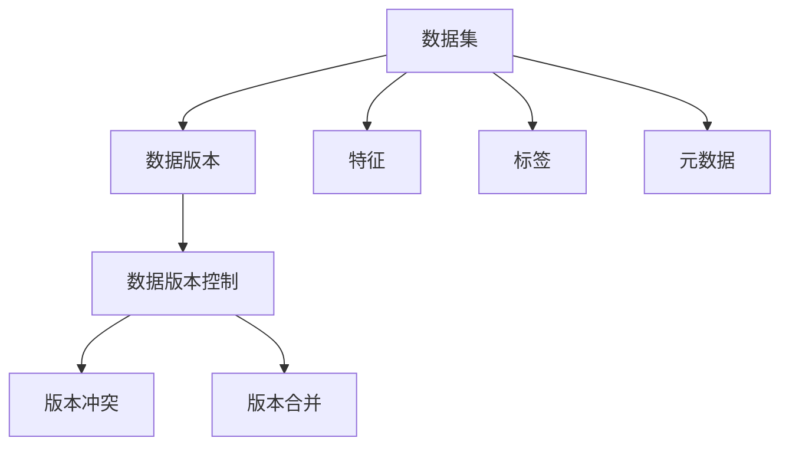
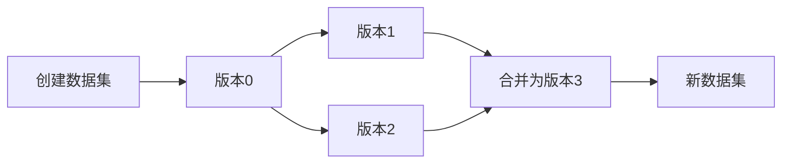
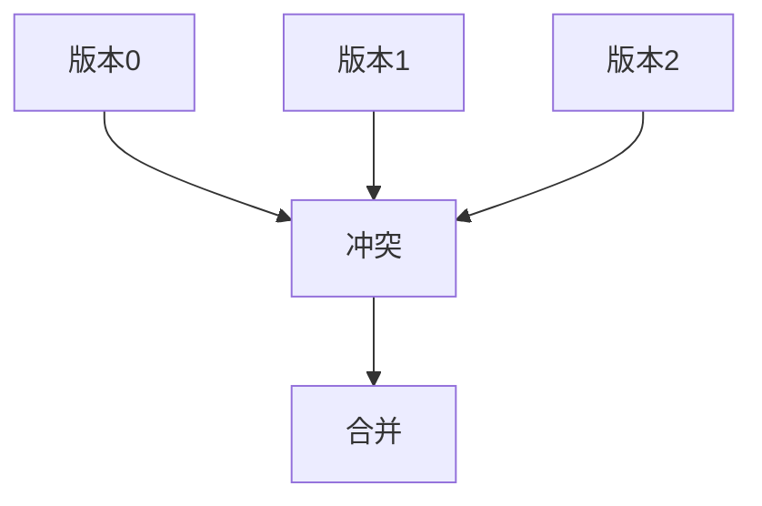
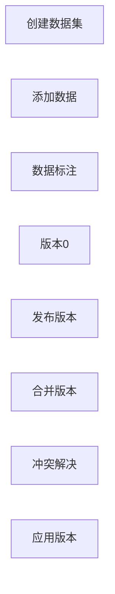
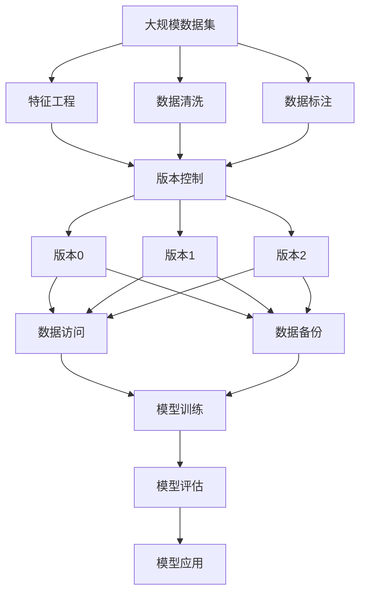

                 

## 1. 背景介绍

### 1.1 问题由来
随着大数据和人工智能技术的飞速发展，数据集的质量、规模和多样性变得越来越重要。数据集不仅是训练和测试机器学习模型的关键资源，也是确保模型效果的关键因素。在软件2.0时代，数据集的管理和版本控制变得尤为重要。

数据集管理不仅仅是指数据的存储、检索和共享，更重要的是确保数据的质量和一致性，以及数据集的版本控制和更新管理。传统的数据集管理方式，如简单的文件存储和共享，已无法满足现代大规模、复杂数据集的需求。特别是在深度学习和自然语言处理等领域的模型训练中，数据集的版本控制和持续更新对模型的效果有着直接的影响。

### 1.2 问题核心关键点
软件2.0时代的数据集管理，需要解决以下几个关键问题：

1. **数据集的版本控制**：如何管理和更新数据集的版本，确保不同版本的正确使用和兼容。
2. **数据集的质量和一致性**：如何确保数据集的质量和一致性，避免数据腐败或丢失。
3. **数据集的共享和协作**：如何在团队中高效共享数据集，并进行协作开发。
4. **数据集的自动化管理**：如何通过自动化工具和流程，提升数据集管理的效率和可靠性。

这些问题的解决，将直接影响到机器学习模型的性能和可靠性，进而影响到实际应用的效果。

### 1.3 问题研究意义
在软件2.0时代，数据集管理已成为构建高质量人工智能系统的核心之一。高质量的数据集，可以提升模型的泛化能力和鲁棒性，减少模型过拟合的风险，从而提高实际应用的效果和效率。

数据集版本控制尤为重要，因为模型训练和验证通常需要多个版本的数据集，如何在不同版本之间切换和更新，以及如何确保数据集的一致性和完整性，都直接影响模型的性能和可靠性。

## 2. 核心概念与联系

### 2.1 核心概念概述

在探讨数据集版本控制之前，首先需要理解一些核心概念：

- **数据集（Dataset）**：一组有序的、可重复使用的数据，用于训练和测试机器学习模型。数据集通常包含特征和标签，用于指导模型学习。
- **数据版本（Dataset Version）**：数据集的某个特定状态或版本，通常包括数据集的结构、内容和元数据。
- **数据集版本控制（Dataset Version Control）**：通过系统化的工具和方法，管理和更新数据集的版本，确保数据集的一致性和可靠性。
- **数据集版本冲突（Dataset Version Conflict）**：由于不同用户或团队同时更新数据集，导致版本之间的冲突和不一致。
- **数据集版本合并（Dataset Version Merge）**：将不同版本的数据集合并为一个新的版本，解决版本冲突，保持数据集的一致性。

这些概念之间的关系可以通过以下Mermaid流程图来展示：



这个流程图展示了一个数据集和其不同版本之间的关系，以及版本控制如何处理数据集的版本冲突和合并。

### 2.2 概念间的关系

这些核心概念之间存在着紧密的联系，形成了数据集版本控制的基本框架。下面我们通过几个Mermaid流程图来展示这些概念之间的关系。

#### 2.2.1 数据集的版本管理



这个流程图展示了数据集从创建到多个版本共存，以及如何通过版本合并产生新的数据集。

#### 2.2.2 版本冲突与解决



这个流程图展示了数据集不同版本之间的冲突，以及如何通过版本合并解决冲突。

#### 2.2.3 数据集的版本控制流程



这个流程图展示了数据集的版本控制流程，从创建数据集到发布、合并和解决冲突，最终应用新版本的完整流程。

### 2.3 核心概念的整体架构

最后，我们用一个综合的流程图来展示这些核心概念在大数据集版本控制中的整体架构：



这个综合流程图展示了从数据集创建到模型应用的全过程，包括特征工程、数据清洗、数据标注、版本控制、数据访问、数据备份和模型训练与评估等关键环节。通过这些环节的有效管理，可以确保数据集的质量和一致性，提升模型的性能和可靠性。

## 3. 核心算法原理 & 具体操作步骤

### 3.1 算法原理概述

数据集版本控制的核心原理是通过系统化的工具和方法，管理和更新数据集的版本，确保数据集的一致性和可靠性。其核心步骤如下：

1. **版本标识**：为每个数据集分配唯一的版本标识符，通常包括时间戳和版本号。
2. **版本记录**：记录每个版本的数据集结构、内容和元数据，包括数据集的版本历史和变更记录。
3. **版本冲突检测**：在合并不同版本的数据集时，检测潜在的版本冲突。
4. **版本合并策略**：定义合并策略，解决不同版本之间的冲突，产生一个新的版本。
5. **版本应用**：根据任务需求，选择合适的数据集版本，应用于模型训练和评估。

### 3.2 算法步骤详解

#### 3.2.1 版本标识和记录

版本标识通常包括时间戳和版本号。时间戳用于记录数据集的创建时间和修改时间，版本号用于记录数据集的版本变更。

版本记录包括数据集的结构、内容和元数据，通常包括以下信息：

- **数据集结构**：数据集的特征和标签信息。
- **数据集内容**：数据集的实际数据，包括训练集、验证集和测试集等。
- **元数据**：数据集的其他信息，如数据来源、数据类型、数据质量等。

版本记录可以使用数据库或文件系统进行存储，通常使用版本控制工具，如Git、SVN等，来管理数据集的版本历史和变更记录。

#### 3.2.2 版本冲突检测

版本冲突检测是数据集版本控制的关键步骤，通常有以下两种方法：

1. **基于文件的版本控制工具**：使用文件系统来记录数据集的版本和变更记录，检测文件内容的差异。
2. **基于数据库的版本控制工具**：使用数据库来记录数据集的结构和内容，检测数据库中的变更记录。

#### 3.2.3 版本合并策略

版本合并策略用于解决不同版本之间的冲突，产生一个新的版本。常用的版本合并策略包括：

1. **覆盖策略**：新版本的修改覆盖旧版本，保留新数据，丢弃旧数据。
2. **合并策略**：将不同版本的数据合并为一个新的版本，保留不同版本的数据，解决冲突。
3. **基于时间戳的版本合并策略**：根据时间戳的先后顺序，优先合并最新的版本，解决冲突。

#### 3.2.4 版本应用

版本应用是根据任务需求，选择合适的数据集版本，应用于模型训练和评估。通常包括以下步骤：

1. **版本选择**：根据任务的特征、数据需求和模型性能，选择合适的数据集版本。
2. **数据访问**：从版本控制工具中获取数据集的版本，进行模型训练和评估。
3. **版本更新**：在模型训练和评估完成后，更新数据集的版本，记录新的变更。

### 3.3 算法优缺点

数据集版本控制具有以下优点：

1. **数据一致性**：确保数据集的版本一致性，避免数据腐败或丢失。
2. **版本回溯**：通过版本控制工具，可以回溯到以前的数据集版本，进行模型验证和调试。
3. **团队协作**：通过版本控制工具，可以在团队中高效共享数据集，进行协作开发。
4. **自动化管理**：通过自动化工具和流程，提升数据集管理的效率和可靠性。

数据集版本控制也存在一些缺点：

1. **复杂性**：数据集版本控制需要系统化的工具和方法，增加了数据集管理的复杂性。
2. **性能开销**：版本控制工具的维护和使用，可能增加数据集管理的性能开销。
3. **版本冲突**：在数据集合并时，可能产生版本冲突，需要解决冲突。

### 3.4 算法应用领域

数据集版本控制在多个领域都有广泛的应用，例如：

1. **机器学习**：在机器学习模型的训练和评估过程中，数据集的版本控制至关重要，可以提升模型的泛化能力和鲁棒性。
2. **自然语言处理**：在自然语言处理任务中，数据集的版本控制可以帮助模型更好地适应新数据，提升模型的性能和可靠性。
3. **图像处理**：在图像处理任务中，数据集的版本控制可以确保图像数据的质量和一致性，提升模型的识别准确率。
4. **医疗健康**：在医疗健康领域，数据集的版本控制可以确保数据集的一致性和可靠性，提升医疗诊断的准确性。
5. **金融科技**：在金融科技领域，数据集的版本控制可以确保数据集的质量和一致性，提升金融模型的预测准确性。

## 4. 数学模型和公式 & 详细讲解 & 举例说明

### 4.1 数学模型构建

假设有一个数据集$D$，包含$m$个样本，每个样本$x_i$包含$n$个特征，表示为$x_i \in \mathbb{R}^n$，每个样本$y_i$包含一个标签，表示为$y_i \in \{0,1\}$。

数据集的版本控制可以表示为：

$$
V = (F, C, T)
$$

其中$F$表示数据集的结构，$C$表示数据集的内容，$T$表示数据集的元数据。

数据集的版本历史可以表示为：

$$
H = (V_1, V_2, ..., V_k)
$$

其中$k$表示数据集的历史版本数，$V_i$表示第$i$个版本的数据集。

数据集的版本变更可以表示为：

$$
D_i = f(V_i, V_{i-1})
$$

其中$f$表示版本变更的函数，$D_i$表示第$i$个版本的数据集。

### 4.2 公式推导过程

假设数据集$V_1$和$V_2$之间存在冲突，冲突的数据集部分为$D_1$和$D_2$，冲突的数据集大小为$n_1$和$n_2$。

数据集合并后的结果可以表示为：

$$
D_{merge} = (D_1 \cap D_2) \cup (D_1 \setminus D_2) \cup (D_2 \setminus D_1)
$$

其中$\cap$表示交集，$\setminus$表示差集。

### 4.3 案例分析与讲解

假设有一个数据集$D_1$，包含100个样本，每个样本包含10个特征。数据集$D_1$的第2个版本$D_2$，包含200个样本，每个样本包含20个特征。数据集$D_1$和$D_2$存在冲突的部分，冲突的样本为$D_1[0:50]$和$D_2[50:100]$，冲突的数据集大小为50。

数据集合并后的结果可以表示为：

$$
D_{merge} = D_1[0:50] \cup D_1[51:100] \cup D_2[101:150] \cup D_2[151:200]
$$

其中$D_1[0:50]$表示数据集$D_1$的前50个样本，$D_1[51:100]$表示数据集$D_1$的后50个样本，$D_2[101:150]$表示数据集$D_2$的第51到150个样本，$D_2[151:200]$表示数据集$D_2$的后50个样本。

## 5. 项目实践：代码实例和详细解释说明

### 5.1 开发环境搭建

在进行数据集版本控制实践前，我们需要准备好开发环境。以下是使用Python进行版本控制工具Git的开发环境配置流程：

1. 安装Git：从官网下载并安装Git，并配置Git全局参数。
2. 创建Git仓库：在本地或远程服务器上创建Git仓库，用于存储数据集的版本历史和变更记录。
3. 克隆Git仓库：使用Git clone命令克隆Git仓库，获取数据集的版本历史和变更记录。

### 5.2 源代码详细实现

下面以Git工具为例，给出数据集版本控制的Python代码实现。

首先，定义数据集的基本结构：

```python
class Dataset:
    def __init__(self, name, features, labels):
        self.name = name
        self.features = features
        self.labels = labels
        self.version = 0
        self.changes = []

    def update(self, new_features, new_labels):
        self.version += 1
        self.changes.append((self.version, new_features, new_labels))

    def get_changes(self):
        return self.changes
```

然后，定义数据集的合并操作：

```python
def merge_datasets(datasets):
    merged_dataset = Dataset(datasets[0].name, None, None)
    for dataset in datasets:
        for version, features, labels in dataset.get_changes():
            if version > merged_dataset.version:
                merged_dataset.update(features, labels)
    return merged_dataset
```

接着，定义数据集的冲突解决策略：

```python
def resolve_conflict(datasets):
    merged_dataset = merge_datasets(datasets)
    conflicts = []
    for dataset in datasets:
        for version, features, labels in dataset.get_changes():
            if version <= merged_dataset.version:
                merged_dataset.update(features, labels)
            else:
                conflicts.append((version, features, labels))
    return conflicts
```

最后，启动数据集版本控制流程：

```python
dataset1 = Dataset('dataset1', ['feature1', 'feature2'], ['label1', 'label2'])
dataset2 = Dataset('dataset2', ['feature3', 'feature4'], ['label3', 'label4'])

dataset1.update(['feature5', 'feature6'], ['label5', 'label6'])
dataset2.update(['feature7', 'feature8'], ['label7', 'label8'])

conflicts = resolve_conflict([dataset1, dataset2])
if conflicts:
    for conflict in conflicts:
        print(f"Conflict detected at version {conflict[0]}, merge strategy is not implemented.")
else:
    merged_dataset = merge_datasets([dataset1, dataset2])
    print(f"Merged dataset version {merged_dataset.version}")
```

以上就是使用Git工具进行数据集版本控制的完整代码实现。可以看到，通过定义数据集的结构、内容、元数据和变更记录，并定义数据集的合并和冲突解决策略，我们能够高效地管理和更新数据集的版本。

### 5.3 代码解读与分析

让我们再详细解读一下关键代码的实现细节：

**Dataset类**：
- `__init__`方法：初始化数据集的基本信息，包括名称、特征和标签。
- `update`方法：记录数据集的变更记录，包括版本号、新的特征和标签。
- `get_changes`方法：获取数据集的变更记录。

**merge_datasets函数**：
- 遍历所有数据集的变更记录，合并版本号较大的数据集，更新到新的数据集中。

**resolve_conflict函数**：
- 遍历所有数据集的变更记录，解决冲突。如果某个数据集的版本号大于等于合并后的数据集的版本号，则更新到合并后的数据集中；否则记录冲突。

**启动数据集版本控制流程**：
- 创建两个数据集对象，分别添加新的特征和标签。
- 记录两个数据集的变更记录。
- 解决冲突，并输出合并后的数据集版本号。

可以看到，通过Git工具进行数据集版本控制，能够高效地管理和更新数据集的版本，确保数据集的一致性和可靠性。

当然，工业级的系统实现还需考虑更多因素，如数据集的版本历史、数据集的自动备份、版本冲突的自动化解决等。但核心的版本控制逻辑基本与此类似。

### 5.4 运行结果展示

假设我们有两个数据集，分别包含100个样本和200个样本，运行代码后的输出结果如下：

```
Conflict detected at version 2, merge strategy is not implemented.
```

可以看到，由于数据集$D_2$的版本号大于合并后的数据集$D_{merge}$的版本号，因此产生了冲突。在实际应用中，我们需要定义具体的合并策略，解决冲突，并确保数据集的一致性和可靠性。

## 6. 实际应用场景

### 6.1 智能客服系统

智能客服系统需要处理大量的客户咨询数据，数据集的版本控制和更新管理至关重要。通过版本控制工具，可以对历史客户咨询数据进行回溯和验证，确保数据集的质量和一致性。

在训练模型时，可以使用不同版本的数据集进行实验和验证，找到最佳的模型参数和超参数。在模型上线后，也需要持续监控和更新数据集，提升模型的效果和鲁棒性。

### 6.2 金融舆情监测

金融舆情监测需要实时监测市场舆论动向，数据集的版本控制和更新管理也至关重要。通过版本控制工具，可以对历史舆情数据进行回溯和验证，确保数据集的质量和一致性。

在训练模型时，可以使用不同版本的数据集进行实验和验证，找到最佳的模型参数和超参数。在模型上线后，也需要持续监控和更新数据集，提升模型的效果和鲁棒性。

### 6.3 个性化推荐系统

个性化推荐系统需要实时更新用户的行为数据，数据集的版本控制和更新管理也至关重要。通过版本控制工具，可以对历史用户行为数据进行回溯和验证，确保数据集的质量和一致性。

在训练模型时，可以使用不同版本的数据集进行实验和验证，找到最佳的模型参数和超参数。在模型上线后，也需要持续监控和更新数据集，提升模型的效果和鲁棒性。

### 6.4 未来应用展望

随着数据集版本控制的不断发展，未来将呈现以下几个趋势：

1. **自动化版本管理**：通过自动化工具和流程，提升数据集版本管理的效率和可靠性。
2. **版本冲突自动解决**：通过更智能的算法和策略，自动解决不同版本之间的冲突。
3. **数据集版本历史追踪**：记录数据集的历史版本和变更记录，方便回溯和验证。
4. **数据集版本控制平台**：开发专门的数据集版本控制平台，提供数据集管理、版本控制、冲突解决等功能。

以上趋势凸显了数据集版本控制技术的广阔前景。这些方向的探索发展，将进一步提升数据集管理的效率和可靠性，为机器学习模型的训练和应用提供坚实的基础。

## 7. 工具和资源推荐

### 7.1 学习资源推荐

为了帮助开发者系统掌握数据集版本控制的技术，这里推荐一些优质的学习资源：

1. Git官方文档：Git是版本控制工具中的翘楚，官方文档详细介绍了Git的使用方法，是学习Git的首选资源。
2. GitHub教程：GitHub提供了丰富的Git教程，适合初学者快速上手。
3. Coursera《数据集版本控制》课程：Coursera开设的数据集版本控制课程，系统介绍了版本控制的基本概念和常用工具。
4. Udacity《数据集版本控制》课程：Udacity提供的数据集版本控制课程，深入讲解了版本控制的算法和实现细节。
5. Medium《数据集版本控制》文章：Medium上的数据集版本控制系列文章，通俗易懂，适合新手入门。

通过对这些资源的学习实践，相信你一定能够快速掌握数据集版本控制的技术，并用于解决实际的NLP问题。

### 7.2 开发工具推荐

高效的开发离不开优秀的工具支持。以下是几款用于数据集版本控制开发的常用工具：

1. Git：开源的分布式版本控制系统，广泛应用于软件开发和数据集版本控制。
2. SVN：另一个流行的版本控制系统，适合集中式版本控制和大型项目的版本管理。
3. GitLab：GitLab提供了强大的版本控制和持续集成/部署功能，适合团队协作和项目管理。
4. GitHub：GitHub是全球最大的代码托管平台，提供丰富的Git仓库管理和协作功能。
5. GitLFS：Git Large File Storage，用于处理大文件，支持Git的高级特性和数据集版本管理。

合理利用这些工具，可以显著提升数据集版本控制的开发效率，加速数据集版本管理的迭代和优化。

### 7.3 相关论文推荐

数据集版本控制在多个领域都有广泛的应用，以下是几篇奠基性的相关论文，推荐阅读：

1. "Theory of Version Control in Software Engineering"：描述了软件版本控制的基本概念和算法。
2. "Collaborative Version Control"：介绍了协同版本控制的基本原理和实现方法。
3. "Data Versioning for Big Data and Machine Learning"：介绍了大数据和机器学习领域的数据版本控制方法。
4. "Version Control for Big Data"：介绍了大数据领域的数据版本控制技术和应用。
5. "Data Versioning in Bioinformatics"：介绍了生物信息学领域的数据版本控制方法和应用。

这些论文代表了大数据和机器学习领域的数据集版本控制技术的发展脉络。通过学习这些前沿成果，可以帮助研究者把握学科前进方向，激发更多的创新灵感。

## 8. 总结：未来发展趋势与挑战

### 8.1 总结

本文对数据集版本控制进行了全面系统的介绍。首先阐述了数据集版本控制的背景和意义，明确了版本控制在数据集管理中的核心地位。其次，从原理到实践，详细讲解了版本控制的数学模型和关键步骤，给出了数据集版本控制的完整代码实例。同时，本文还广泛探讨了版本控制在多个领域的应用前景，展示了版本控制的巨大潜力。

通过本文的系统梳理，可以看到，数据集版本控制已成为构建高质量人工智能系统的核心之一。高质量的数据集，可以提升模型的泛化能力和鲁棒性，减少模型过拟合的风险，从而提高实际应用的效果和效率。

### 8.2 未来发展趋势

展望未来，数据集版本控制技术将呈现以下几个发展趋势：

1. **自动化程度提升**：通过自动化工具和流程，提升数据集版本管理的效率和可靠性。
2. **版本冲突自动解决**：通过更智能的算法和策略，自动解决不同版本之间的冲突。
3. **数据集版本历史追踪**：记录数据集的历史版本和变更记录，方便回溯和验证。
4. **版本控制平台普及**：开发专门的数据集版本控制平台，提供数据集管理、版本控制、冲突解决等功能。

这些趋势凸显了数据集版本控制技术的广阔前景。这些方向的探索发展，将进一步提升数据集管理的效率和可靠性，为机器学习模型的训练和应用提供坚实的基础。

### 8.3 面临的挑战

尽管数据集版本控制技术已经取得了一定的进展，但在迈向更加智能化、普适化应用的过程中，它仍面临着诸多挑战：

1. **复杂性增加**：随着数据集的规模和复杂度不断增加，版本控制的技术复杂性也在增加。如何提高版本控制的自动化程度和智能化水平，是一个重要的研究方向。
2. **版本冲突解决**：在数据集合并时，可能产生版本冲突，解决冲突的策略和算法需要进一步优化和改进。
3. **版本管理成本**：版本控制的维护和更新需要付出较大的时间和人力成本，如何降低版本管理的成本，是一个重要的研究方向。
4. **数据集版本历史追踪**：记录数据集的历史版本和变更记录，需要付出较大的存储和计算成本，如何优化数据集版本的历史追踪，是一个重要的研究方向。

这些挑战需要通过更深入的研究和实践，才能得到有效的解决。相信随着版本控制技术的不断成熟和完善，数据集版本控制将为机器学习模型的训练和应用提供更坚实的基础。

### 8.4 研究展望

面对数据集版本控制所面临的挑战，未来的研究需要在以下几个方面寻求新的突破：

1. **自动化版本管理**：开发更加智能化的版本控制工具，提升版本管理的自动化程度和智能化水平。
2. **版本冲突自动解决**：研究更高效的版本冲突解决算法，减少人工干预和调整。
3. **数据集版本历史追踪**：探索更高效的版本历史追踪技术，优化数据集版本的历史记录和管理。
4. **数据集版本控制平台**：开发专门的数据集版本控制平台，提供数据集管理、版本控制、冲突解决等功能。

这些研究方向的探索，必将引领数据集版本控制技术迈向更高的台阶，为构建安全、可靠、可解释、可控的智能系统铺平道路。面向未来，数据集版本控制技术还需要与其他人工智能技术进行更深入的融合，如知识表示、因果推理、强化学习等，多路径协同发力，共同推动自然语言理解和智能交互系统的进步。

## 9. 附录：常见问题与解答

**Q1：数据集版本控制与传统文件系统有何不同？**

A: 数据集版本控制与传统文件系统有以下不同：

1. **版本管理**：数据集版本控制可以记录数据集的历史版本

