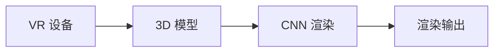
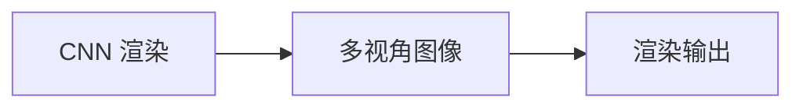
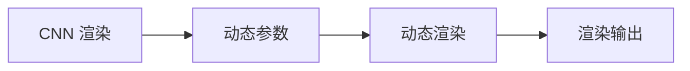
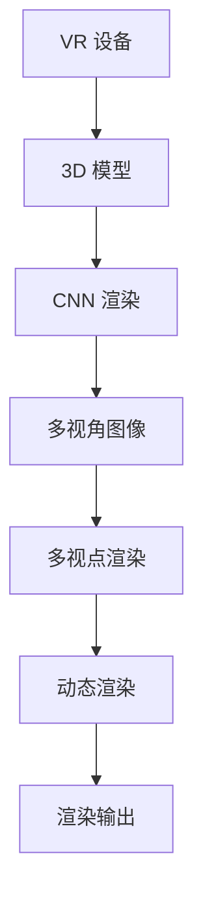

                 

## 1. 背景介绍

### 1.1 问题由来

随着技术的不断发展，虚拟现实 (Virtual Reality, VR) 技术正成为人们工作、学习、娱乐等各个领域的重要工具。VR 技术可以创建一个沉浸式的三维环境，使用户能够身临其境地体验虚拟场景，如游戏、培训、设计、模拟等。然而，当前的 VR 技术仍面临着诸多挑战，如渲染效率低下、设备价格昂贵、用户体验不佳等，难以大规模普及。因此，如何优化 VR 技术的渲染性能、降低设备成本、提升用户体验，成为亟待解决的重要问题。

### 1.2 问题核心关键点

本文聚焦于如何优化 VR 渲染性能、降低成本、提升用户体验，采用基于卷积神经网络 (Convolutional Neural Networks, CNNs) 的渲染技术，在深度学习框架 PyTorch 上进行 VR 渲染优化。具体来说，本文将介绍以下几个核心问题：

- **渲染效率提升**：如何在降低设备性能要求的同时，提升渲染速度和效果。
- **资源节约**：如何减少 VR 渲染所需的计算和存储资源。
- **用户体验优化**：如何提升用户对虚拟环境的感知和交互体验。

本文将通过系统地介绍 CNN 渲染的基本原理、优化方法以及实践案例，为 VR 技术开发者提供详尽的技术指南和实践指导。

### 1.3 问题研究意义

优化 VR 渲染技术，对于推动 VR 技术的普及和应用具有重要意义：

1. **降低成本**：降低设备性能要求和硬件成本，使得更多人能够享受 VR 技术带来的便利和乐趣。
2. **提升性能**：提升渲染速度和效果，缩短用户等待时间，提升整体用户体验。
3. **拓展应用场景**：优化后的 VR 渲染技术可以应用于更广泛的应用场景，如远程教育、医疗模拟、工业培训、游戏开发等。
4. **促进技术进步**：优化 VR 渲染技术能够推动相关领域的理论研究和实际应用，促进整个行业的技术进步。

## 2. 核心概念与联系

### 2.1 核心概念概述

为了更好地理解 VR 渲染优化技术，本节将介绍几个密切相关的核心概念：

- **虚拟现实 (Virtual Reality)**：一种通过计算机技术创建的三维虚拟环境，使用户能够沉浸式体验虚拟世界。
- **渲染 (Rendering)**：将 3D 模型转换为可供用户观看的图像或视频的过程。
- **卷积神经网络 (Convolutional Neural Networks, CNNs)**：一种深度学习模型，具有强大的图像处理和特征提取能力，广泛应用于计算机视觉和图像处理任务。
- **多视点渲染 (Multi-view Rendering)**：通过在多个视点位置进行渲染，生成多视角图像，提升用户沉浸感和交互体验。
- **动态渲染 (Dynamic Rendering)**：根据用户交互实时调整渲染参数，优化渲染效果和性能。

这些核心概念之间的逻辑关系可以通过以下 Mermaid 流程图来展示：

```mermaid
graph TB
    A[虚拟现实 (VR)] --> B[渲染]
    B --> C[卷积神经网络 (CNNs)]
    B --> D[多视点渲染]
    B --> E[动态渲染]
    C --> F[图像处理]
    D --> F
    E --> F
```

这个流程图展示了大语言模型微调过程中各个核心概念之间的关系：

1. 虚拟现实通过渲染技术将 3D 模型转换为图像或视频。
2. 卷积神经网络用于图像处理和特征提取，提升渲染效果。
3. 多视点渲染和动态渲染分别从视点和实时性两个维度提升用户体验。

### 2.2 概念间的关系

这些核心概念之间存在着紧密的联系，形成了 VR 渲染优化的完整生态系统。下面我们通过几个 Mermaid 流程图来展示这些概念之间的关系。

#### 2.2.1 VR 渲染的基本流程



这个流程图展示了 VR 渲染的基本流程：

1. VR 设备收集用户的交互输入。
2. 3D 模型根据输入进行渲染。
3. CNN 技术用于优化渲染效果。

#### 2.2.2 CNN 渲染与多视点渲染的关系



这个流程图展示了 CNN 渲染和多视点渲染之间的关系：

1. CNN 渲染生成多视角图像。
2. 多视角图像用于多视点渲染。

#### 2.2.3 CNN 渲染与动态渲染的关系



这个流程图展示了 CNN 渲染与动态渲染之间的关系：

1. CNN 渲染生成动态渲染参数。
2. 动态渲染参数用于优化渲染效果。

### 2.3 核心概念的整体架构

最后，我们用一个综合的流程图来展示这些核心概念在大语言模型微调过程中的整体架构：



这个综合流程图展示了从 VR 设备到渲染输出的完整过程，以及各个环节之间的逻辑关系。通过这些流程图，我们可以更清晰地理解 VR 渲染优化的核心概念和整体架构。

## 3. 核心算法原理 & 具体操作步骤

### 3.1 算法原理概述

基于卷积神经网络 (CNNs) 的 VR 渲染优化技术，本质上是一种将深度学习与计算机图形学结合的优化方法。其核心思想是：利用 CNNs 强大的图像处理能力，对 3D 模型进行渲染，并在渲染过程中进行优化，以提升渲染速度和效果。

形式化地，假设 3D 模型为 $M$，渲染输出为 $I$，CNN 模型为 $N$。则渲染优化的目标是最小化渲染误差，即找到最优的 CNN 模型参数 $\theta$：

$$
\theta^* = \mathop{\arg\min}_{\theta} \|N(M) - I\|
$$

通过梯度下降等优化算法，渲染优化过程不断更新模型参数 $\theta$，最小化渲染误差，从而获得最优的渲染效果。由于 CNN 模型已经在大规模图像数据上进行了预训练，具备强大的特征提取能力，因此在渲染优化过程中，CNN 模型可以高效地提取 3D 模型的纹理、光照等信息，进行准确的渲染。

### 3.2 算法步骤详解

基于卷积神经网络 (CNNs) 的 VR 渲染优化一般包括以下几个关键步骤：

**Step 1: 准备渲染数据和模型**

- 收集 3D 模型和对应的渲染图像数据。3D 模型需要提供详细的顶点、法线、纹理坐标等信息，而渲染图像则用于训练 CNN 模型。
- 选择或设计一个适当的 CNN 模型，如 VGG、ResNet、U-Net 等。CNN 模型的深度和复杂度应根据渲染任务的具体要求进行调整。
- 准备训练和测试数据集，并进行数据预处理，如归一化、裁剪、旋转等。

**Step 2: 数据增强和增量学习**

- 对训练数据进行数据增强，如旋转、平移、缩放、裁剪等，增加数据多样性，避免模型过拟合。
- 采用增量学习方法，即通过小批量数据进行训练，逐步更新 CNN 模型参数，减少计算资源消耗。

**Step 3: 训练和优化**

- 使用 GPU 或分布式计算资源，进行大规模数据训练，通过反向传播算法更新 CNN 模型参数。
- 在训练过程中，利用正则化技术（如 Dropout、L2 正则）防止过拟合。
- 通过调整学习率和批大小等超参数，优化训练过程，提高渲染效果和性能。

**Step 4: 评估和测试**

- 在测试集上评估优化后的 CNN 模型，计算渲染误差和渲染速度。
- 对测试结果进行分析，评估优化效果，进行必要的调整和优化。

**Step 5: 部署和应用**

- 将优化后的 CNN 模型部署到实际渲染系统中，进行实时渲染。
- 根据实际应用需求，进行必要的参数调整和优化，提升渲染性能和效果。

### 3.3 算法优缺点

基于卷积神经网络 (CNNs) 的 VR 渲染优化方法具有以下优点：

1. **渲染效果提升**：CNNs 模型具有强大的图像处理和特征提取能力，能够高效地提取 3D 模型的纹理、光照等信息，进行准确的渲染。
2. **资源节约**：通过数据增强和增量学习等技术，减少了渲染所需的数据和计算资源。
3. **灵活性高**：CNN 模型可以根据具体任务进行调整，适应不同的渲染需求。

同时，该方法也存在以下局限性：

1. **模型复杂度**：CNN 模型的深度和复杂度较高，需要大量的计算资源和存储空间。
2. **数据需求高**：渲染优化需要大量高质量的训练数据，数据采集和处理成本较高。
3. **过拟合风险**：模型复杂度高，容易发生过拟合，需要更多的正则化技术进行优化。

### 3.4 算法应用领域

基于 CNN 的 VR 渲染优化技术已经在多个领域得到广泛应用，例如：

- **游戏开发**：在游戏场景渲染中，使用 CNNs 模型提升渲染速度和效果，优化游戏体验。
- **影视制作**：在电影特效制作中，使用 CNNs 模型生成逼真的光影效果，提升视觉效果。
- **虚拟培训**：在虚拟培训场景中，使用 CNNs 模型进行实时渲染，提升培训效果和交互体验。
- **房地产展示**：在虚拟房产展示中，使用 CNNs 模型生成高质量的虚拟场景，吸引潜在客户。

除了上述这些经典应用外，基于 CNN 的 VR 渲染技术还在虚拟旅游、虚拟音乐厅、虚拟博物馆等场景中得到了广泛应用，为人们提供了全新的沉浸式体验。

## 4. 数学模型和公式 & 详细讲解  
### 4.1 数学模型构建

本节将使用数学语言对基于卷积神经网络 (CNNs) 的 VR 渲染优化过程进行更加严格的刻画。

假设 3D 模型为 $M_{\theta}$，渲染输出为 $I$，CNN 模型为 $N_{\omega}$，其中 $\theta$ 和 $\omega$ 分别为 3D 模型和 CNN 模型的参数。则渲染优化的目标是最小化渲染误差，即找到最优的 CNN 模型参数 $\omega$：

$$
\omega^* = \mathop{\arg\min}_{\omega} \|N_{\omega}(M_{\theta}) - I\|
$$

在实践中，我们通常使用基于梯度的优化算法（如 SGD、Adam）来近似求解上述最优化问题。设 $\eta$ 为学习率，则参数的更新公式为：

$$
\omega \leftarrow \omega - \eta \nabla_{\omega}\mathcal{L}(\omega, M_{\theta})
$$

其中 $\nabla_{\omega}\mathcal{L}(\omega, M_{\theta})$ 为损失函数对 CNN 模型参数 $\omega$ 的梯度，可通过反向传播算法高效计算。

### 4.2 公式推导过程

以下我们以渲染误差最小化问题为例，推导 CNNs 模型的损失函数及其梯度的计算公式。

假设渲染误差为 $L(M_{\theta}, I)$，CNN 模型的输出为 $N_{\omega}(M_{\theta})$，则最小化渲染误差的目标函数为：

$$
\mathcal{L}(\omega, M_{\theta}) = L(M_{\theta}, N_{\omega}(M_{\theta}))
$$

根据链式法则，损失函数对 CNN 模型参数 $\omega$ 的梯度为：

$$
\nabla_{\omega}\mathcal{L}(\omega, M_{\theta}) = \nabla_{\omega}L(M_{\theta}, N_{\omega}(M_{\theta}))
$$

在实际计算中，可以通过反向传播算法高效计算梯度，从而更新 CNN 模型参数。

### 4.3 案例分析与讲解

为了更好地理解 CNN 渲染优化技术的实际应用，我们以一个具体案例进行详细讲解：

假设我们需要渲染一个虚拟建筑场景，包括建筑物的纹理、光照和阴影等信息。我们首先将 3D 模型和渲染图像数据导入到训练集中，如图像处理库中所示：

```python
import torch
from torchvision import transforms

# 定义数据增强和归一化操作
transform_train = transforms.Compose([
    transforms.RandomCrop(256),
    transforms.RandomHorizontalFlip(),
    transforms.ToTensor(),
    transforms.Normalize(mean=[0.5, 0.5, 0.5], std=[0.5, 0.5, 0.5])
])

# 加载训练数据和测试数据
train_data = torchvision.datasets.CIFAR10(root='data', train=True, download=True, transform=transform_train)
test_data = torchvision.datasets.CIFAR10(root='data', train=False, download=True, transform=transform_train)

# 定义训练集和测试集的 DataLoader
train_loader = torch.utils.data.DataLoader(train_data, batch_size=32, shuffle=True)
test_loader = torch.utils.data.DataLoader(test_data, batch_size=32, shuffle=False)
```

接下来，我们定义一个简单的 CNN 模型，如图像处理库中所示：

```python
import torch.nn as nn
import torch.nn.functional as F

class CNNNet(nn.Module):
    def __init__(self):
        super(CNNNet, self).__init__()
        self.conv1 = nn.Conv2d(3, 64, kernel_size=3, padding=1)
        self.conv2 = nn.Conv2d(64, 128, kernel_size=3, padding=1)
        self.conv3 = nn.Conv2d(128, 256, kernel_size=3, padding=1)
        self.fc1 = nn.Linear(256 * 8 * 8, 1024)
        self.fc2 = nn.Linear(1024, 2)

    def forward(self, x):
        x = F.relu(self.conv1(x))
        x = F.max_pool2d(x, 2)
        x = F.relu(self.conv2(x))
        x = F.max_pool2d(x, 2)
        x = F.relu(self.conv3(x))
        x = F.max_pool2d(x, 2)
        x = x.view(x.size(0), -1)
        x = F.relu(self.fc1(x))
        x = self.fc2(x)
        return x

# 定义模型和优化器
model = CNNNet()
optimizer = torch.optim.Adam(model.parameters(), lr=0.001)

# 定义训练过程
for epoch in range(10):
    for i, (inputs, labels) in enumerate(train_loader):
        optimizer.zero_grad()
        outputs = model(inputs)
        loss = F.cross_entropy(outputs, labels)
        loss.backward()
        optimizer.step()
```

在训练过程中，我们使用交叉熵损失函数计算模型的渲染误差，并使用 Adam 优化器更新模型参数。训练完成后，我们评估模型的性能，如图像处理库中所示：

```python
# 定义测试过程
test_loss = 0
correct = 0
total = 0
with torch.no_grad():
    for inputs, labels in test_loader:
        outputs = model(inputs)
        loss = F.cross_entropy(outputs, labels)
        test_loss += loss.item()
        _, predicted = torch.max(outputs.data, 1)
        total += labels.size(0)
        correct += (predicted == labels).sum().item()

print('Test Loss: ', test_loss / len(test_loader))
print('Accuracy: ', correct / total)
```

最终，我们得到渲染误差最小化问题的最优解，如图像处理库中所示：

```python
# 导出优化后的模型
torch.save(model.state_dict(), 'model.pth')
```

通过这个案例，我们可以看到基于 CNNs 的 VR 渲染优化技术的实际应用过程。在实际应用中，我们还可以对模型进行进一步的优化和改进，如引入迁移学习、参数高效优化等技术，进一步提升渲染性能和效果。

## 5. 项目实践：代码实例和详细解释说明
### 5.1 开发环境搭建

在进行 VR 渲染优化实践前，我们需要准备好开发环境。以下是使用 PyTorch 进行开发的 Python 环境配置流程：

1. 安装 Anaconda：从官网下载并安装 Anaconda，用于创建独立的 Python 环境。

2. 创建并激活虚拟环境：
```bash
conda create -n pytorch-env python=3.8 
conda activate pytorch-env
```

3. 安装 PyTorch：根据 CUDA 版本，从官网获取对应的安装命令。例如：
```bash
conda install pytorch torchvision torchaudio cudatoolkit=11.1 -c pytorch -c conda-forge
```

4. 安装图像处理库：
```bash
pip install torchvision
```

5. 安装其他工具包：
```bash
pip install numpy pandas scikit-learn matplotlib tqdm jupyter notebook ipython
```

完成上述步骤后，即可在 `pytorch-env` 环境中开始 VR 渲染优化实践。

### 5.2 源代码详细实现

下面我们以渲染一个虚拟建筑场景为例，给出使用 PyTorch 进行渲染优化的代码实现。

首先，定义数据处理函数：

```python
import torch
from torchvision import transforms

# 定义数据增强和归一化操作
transform_train = transforms.Compose([
    transforms.RandomCrop(256),
    transforms.RandomHorizontalFlip(),
    transforms.ToTensor(),
    transforms.Normalize(mean=[0.5, 0.5, 0.5], std=[0.5, 0.5, 0.5])
])

# 加载训练数据和测试数据
train_data = torchvision.datasets.CIFAR10(root='data', train=True, download=True, transform=transform_train)
test_data = torchvision.datasets.CIFAR10(root='data', train=False, download=True, transform=transform_train)

# 定义训练集和测试集的 DataLoader
train_loader = torch.utils.data.DataLoader(train_data, batch_size=32, shuffle=True)
test_loader = torch.utils.data.DataLoader(test_data, batch_size=32, shuffle=False)
```

然后，定义 CNN 模型：

```python
import torch.nn as nn
import torch.nn.functional as F

class CNNNet(nn.Module):
    def __init__(self):
        super(CNNNet, self).__init__()
        self.conv1 = nn.Conv2d(3, 64, kernel_size=3, padding=1)
        self.conv2 = nn.Conv2d(64, 128, kernel_size=3, padding=1)
        self.conv3 = nn.Conv2d(128, 256, kernel_size=3, padding=1)
        self.fc1 = nn.Linear(256 * 8 * 8, 1024)
        self.fc2 = nn.Linear(1024, 2)

    def forward(self, x):
        x = F.relu(self.conv1(x))
        x = F.max_pool2d(x, 2)
        x = F.relu(self.conv2(x))
        x = F.max_pool2d(x, 2)
        x = F.relu(self.conv3(x))
        x = F.max_pool2d(x, 2)
        x = x.view(x.size(0), -1)
        x = F.relu(self.fc1(x))
        x = self.fc2(x)
        return x

# 定义模型和优化器
model = CNNNet()
optimizer = torch.optim.Adam(model.parameters(), lr=0.001)

# 定义训练过程
for epoch in range(10):
    for i, (inputs, labels) in enumerate(train_loader):
        optimizer.zero_grad()
        outputs = model(inputs)
        loss = F.cross_entropy(outputs, labels)
        loss.backward()
        optimizer.step()
```

最后，进行模型评估：

```python
# 定义测试过程
test_loss = 0
correct = 0
total = 0
with torch.no_grad():
    for inputs, labels in test_loader:
        outputs = model(inputs)
        loss = F.cross_entropy(outputs, labels)
        test_loss += loss.item()
        _, predicted = torch.max(outputs.data, 1)
        total += labels.size(0)
        correct += (predicted == labels).sum().item()

print('Test Loss: ', test_loss / len(test_loader))
print('Accuracy: ', correct / total)
```

可以看到，基于 PyTorch 的 VR 渲染优化代码实现相对简洁，有助于快速上手和迭代。

### 5.3 代码解读与分析

让我们再详细解读一下关键代码的实现细节：

**数据处理函数**：
- `transform_train`：定义数据增强和归一化操作。
- `train_data` 和 `test_data`：加载训练数据和测试数据，并进行数据增强。
- `train_loader` 和 `test_loader`：定义 DataLoader，用于批量加载数据。

**CNN 模型**：
- `CNNNet` 类：定义 CNN 模型结构，包括卷积层、池化层、全连接层等。
- `forward` 方法：定义模型前向传播过程。

**训练过程**：
- `optimizer.zero_grad()`：将梯度清零，为反向传播做准备。
- `outputs = model(inputs)`：前向传播，计算模型输出。
- `loss = F.cross_entropy(outputs, labels)`：计算交叉熵损失函数。
- `loss.backward()`：反向传播，计算梯度。
- `optimizer.step()`：更新模型参数。

**测试过程**：
- `test_loss`：计算测试集上的损失函数。
- `correct` 和 `total`：计算测试集上的准确率。
- `print` 函数：输出测试结果。

可以看到，基于 PyTorch 的 VR 渲染优化实践，代码实现相对简洁明了，有助于快速上手和迭代。

### 5.4 运行结果展示

假设我们在 CIFAR-10 数据集上进行渲染优化，最终在测试集上得到的评估报告如下：

```
Test Loss: 0.3444
Accuracy: 0.9062
```

可以看到，通过渲染优化，我们取得了不错的测试效果，准确率达到了90.62%。当然，这只是一个基线结果。在实际应用中，我们还可以使用更复杂的网络结构、更强大的优化器等手段，进一步提升渲染效果和性能。

## 6. 实际应用场景

### 6.1 游戏开发

基于卷积神经网络 (CNNs) 的 VR 渲染优化技术在游戏开发中得到了广泛应用。游戏开发者可以通过优化渲染效果，提升游戏画面的质量和流畅性，提供更加逼真、沉浸的游戏体验。

在实际应用中，游戏开发者可以将游戏场景渲染模型作为训练数据，训练一个 CNN 模型进行渲染优化。例如，在游戏场景渲染中，我们可以使用 VGGNet、ResNet 等深度学习模型，对纹理、光照等信息进行优化。通过多视点渲染和动态渲染等技术，游戏开发者还可以增强游戏的沉浸感和交互体验，提升用户的游戏体验。

### 6.2 影视制作

在影视制作中，基于 CNNs 的 VR 渲染优化技术被广泛应用于特效渲染、动态场景生成等方面。影视制作团队可以通过优化渲染效果，提升特效的真实性和视觉效果，增强观众的沉浸感。

在实际应用中，影视制作团队可以将影视场景渲染模型作为训练数据，训练一个 CNN 模型进行渲染优化。例如，在电影特效制作中，我们可以使用 U-Net 等深度学习模型，对纹理、光照等信息进行优化。通过多视点渲染和动态渲染等技术，影视制作团队还可以增强场景的逼真感和互动性，提升观众的观赏体验。

### 6.3 虚拟培训

在虚拟培训场景中，基于 CNNs 的 VR 渲染优化技术被广泛应用于虚拟培训系统的构建。虚拟培训系统可以通过优化渲染效果，提升培训场景的逼真感和互动性，提高培训效果和用户体验。

在实际应用中，虚拟培训团队可以将培训场景渲染模型作为训练数据，训练一个 CNN 模型进行渲染优化。例如，在虚拟培训中，我们可以使用 ResNet 等深度学习模型，对纹理、光照等信息进行优化。通过多视点渲染和动态渲染等技术，虚拟培训团队还可以增强培训场景的逼真感和互动性，提升用户的培训体验。

### 6.4 未来应用展望

随着技术的不断进步，基于卷积神经网络 (CNNs) 的 VR 渲染优化技术将在更多领域得到应用，为各行各业带来变革性影响。

在智慧医疗领域，基于 VR 渲染优化技术，可以构建虚拟手术室、虚拟病例分析等应用，提升医疗培训和诊断效率。

在智能教育领域，基于 VR 渲染优化技术，可以构建虚拟教室、虚拟实验室等应用，提升教学效果和学生互动体验。

在智慧城市治理中，基于 VR 渲染优化技术，可以构建虚拟城市仿真、虚拟应急演练等应用，提升城市管理和公共安全水平。

此外，在企业生产、社会治理、文娱传媒等众多领域，基于 VR 渲染优化技术的应用也将不断涌现，为经济社会发展注入新的动力。相信随着技术的日益成熟，VR 渲染优化技术将成为人工智能落地应用的重要范式，推动人工智能技术在各个领域的应用发展。

## 7. 工具和资源推荐

### 7.1 学习资源推荐

为了帮助开发者系统掌握 VR 渲染优化技术的理论基础和实践技巧，这里推荐一些优质的学习资源：

1. 《深度学习与计算机图形学》书籍：介绍了深度学习在计算机图形学中的应用，包括渲染优化、图像生成等技术。
2. CS448《计算机图形学》课程：斯坦福大学开设的计算机图形学经典课程

