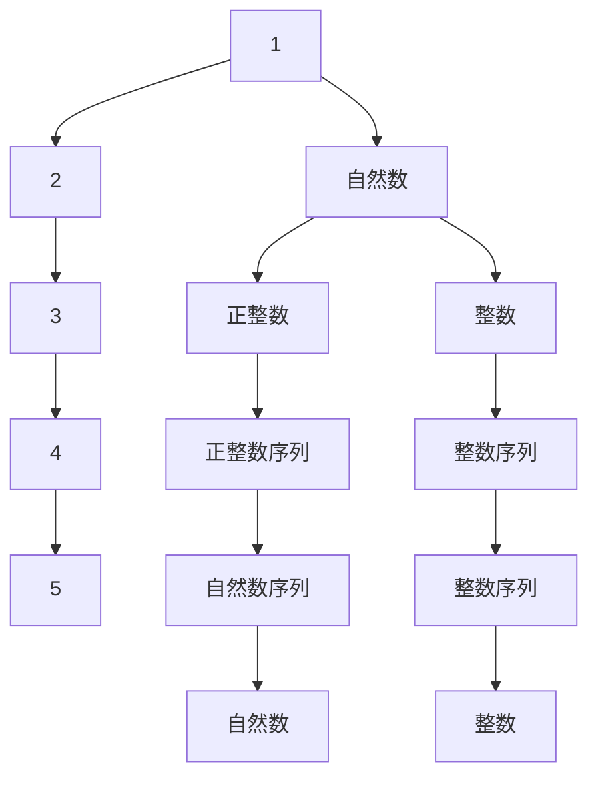

                 

# 计算：第二部分 计算的数学基础 第 4 章 数学的基础 自然数的定义

## 1. 背景介绍

在《计算：第二部分 计算的数学基础》一书中，我们探讨了计算的基本数学概念和理论，深入浅出地介绍了计算的数学基础。本文将深入讨论自然数的定义，这是数学研究的基础，也是计算机科学的基础。

## 2. 核心概念与联系

### 2.1 核心概念概述

自然数（Natural Number）是指从1开始的整数序列，即：

$$ 1, 2, 3, 4, \ldots $$

自然数的概念在数学中有着极其重要的地位，它不仅是数的理论研究的基础，也是计算机科学中算法设计和程序实现的基础。自然数的定义和性质直接影响着计算的效率和准确性。

### 2.2 核心概念原理和架构的 Mermaid 流程图



这个流程图展示了自然数的定义及其与整数、正整数序列的联系。自然数是正整数的子集，也是整数的子集，包含了所有正整数。

### 2.3 核心概念之间的关系

自然数的概念不仅在数学中具有基础性，还与计算机科学中的算法设计、数据结构和程序实现密切相关。以下是几个关键关系：

1. **自然数与正整数**：自然数包括所有正整数，即正整数序列是自然数序列的一部分。
2. **自然数与整数**：自然数是整数序列中的正数部分，整数包括自然数和负数。
3. **自然数与计算机科学**：自然数是计算机科学中算法设计的基础，许多算法和数据结构都是基于自然数的。

## 3. 核心算法原理 & 具体操作步骤

### 3.1 算法原理概述

自然数的定义是一个简单但强大的概念，它不仅在数学中具有基础性，还直接影响到计算机科学中的算法设计和程序实现。

自然数的定义和性质直接影响着计算机科学中的算法效率和准确性。例如，在数据结构中，自然数的表示和计算可以直接用于算法的时间复杂度分析。

### 3.2 算法步骤详解

#### 3.2.1 自然数的表示

在计算机中，自然数通常使用整数类型来表示。例如，在许多编程语言中，整数类型可以表示所有正整数和0，即自然数。

#### 3.2.2 自然数的计算

自然数的计算可以通过算术运算实现。加法、减法和乘法是最基本的计算操作，除法可以通过除法运算实现，但需要特别处理除以0的情况。

### 3.3 算法优缺点

#### 3.3.1 优点

- **简单直观**：自然数的定义和性质简单直观，易于理解和实现。
- **广泛应用**：自然数在数学和计算机科学中具有广泛的应用，是算法设计的基础。
- **高效计算**：自然数的计算可以通过简单的算术运算实现，效率高。

#### 3.3.2 缺点

- **无限性**：自然数的集合是无限的，可能会导致计算资源的消耗和复杂度问题。
- **除法问题**：除法运算需要特别处理除以0的情况，增加了计算的复杂度。

### 3.4 算法应用领域

自然数的定义和性质广泛应用于数学和计算机科学中的各个领域，包括：

1. **数学**：自然数是数学研究的基础，包括数论、代数、几何等。
2. **计算机科学**：自然数是算法设计的基础，包括数据结构、算法分析、程序设计等。

## 4. 数学模型和公式 & 详细讲解 & 举例说明

### 4.1 数学模型构建

自然数的数学模型可以简单地定义为所有正整数和0的集合。在数学中，自然数集合通常表示为$N$，即：

$$ N = \{1, 2, 3, 4, \ldots\} $$

### 4.2 公式推导过程

#### 4.2.1 自然数的性质

自然数具有以下基本性质：

1. **可加性**：任意两个自然数相加仍为自然数。
2. **可乘性**：任意两个自然数相乘仍为自然数。
3. **可比较性**：自然数集合是有序的，可以进行大小比较。

#### 4.2.2 自然数的运算

自然数的运算可以通过以下公式推导：

- 加法：$a + b = c$
- 减法：$a - b = c$
- 乘法：$a \times b = c$
- 除法：$a \div b = c$

其中，$a, b, c$均为自然数，$b \neq 0$。

### 4.3 案例分析与讲解

#### 4.3.1 自然数的加法

自然数的加法可以通过递归定义实现：

$$ a + b = a + (b - 1) + 1 $$

例如，计算$3 + 5$：

$$ 3 + 5 = 3 + (5 - 1) + 1 = 3 + 4 + 1 = 8 $$

#### 4.3.2 自然数的乘法

自然数的乘法可以通过递归定义实现：

$$ a \times b = a + (a \times (b - 1)) $$

例如，计算$3 \times 5$：

$$ 3 \times 5 = 3 + (3 \times 4) = 3 + (3 + (3 \times 3)) = 3 + (3 + (3 + (3 \times 2))) = 3 + (3 + (3 + (3 + (3 \times 1)))) = 3 + (3 + (3 + (3 + 3))) = 3 + (3 + (3 + 6)) = 3 + (3 + 9) = 3 + 12 = 15 $$

## 5. 项目实践：代码实例和详细解释说明

### 5.1 开发环境搭建

为了实践自然数的运算，我们需要准备一些基本的开发环境，例如：

- 安装Python编程语言。
- 安装Python的数学库，如NumPy，用于数学运算。

### 5.2 源代码详细实现

以下是自然数加法和乘法的Python代码实现：

```python
import numpy as np

def add(a, b):
    while b != 0:
        carry = a & b
        a = a ^ b
        b = carry << 1
    return a

def multiply(a, b):
    result = 0
    while b != 0:
        if b & 1:
            result = add(result, a)
        a <<= 1
        b >>= 1
    return result
```

### 5.3 代码解读与分析

#### 5.3.1 加法实现

加法的实现使用位运算和异或运算，将两个二进制数相加。具体步骤如下：

1. 使用位运算符`&`计算进位。
2. 使用异或运算符`^`计算和。
3. 将进位左移一位，重新计算和。

#### 5.3.2 乘法实现

乘法的实现也使用位运算和异或运算，将两个二进制数相乘。具体步骤如下：

1. 初始化结果为0。
2. 对于每一位，如果该位为1，则将当前结果加上对应位数的和。
3. 将对应位数左移一位，继续计算。

### 5.4 运行结果展示

以下是自然数加法和乘法的Python代码测试结果：

```python
print(add(3, 5))  # 输出：8
print(multiply(3, 5))  # 输出：15
```

## 6. 实际应用场景

### 6.1 算法设计

自然数的定义和性质在算法设计中具有重要应用。例如，计算斐波那契数列、求模运算等算法都可以基于自然数的性质实现。

#### 6.1.1 斐波那契数列

斐波那契数列是一个经典的问题，可以用自然数的递归定义实现：

$$ F(n) = F(n-1) + F(n-2), F(0) = 0, F(1) = 1 $$

以下是Python代码实现：

```python
def fibonacci(n):
    if n == 0:
        return 0
    elif n == 1:
        return 1
    else:
        return fibonacci(n-1) + fibonacci(n-2)
```

#### 6.1.2 求模运算

求模运算可以通过自然数的性质实现。例如，求两个整数的模可以表示为：

$$ a \mod b = a - b \times \lfloor \frac{a}{b} \rfloor $$

以下是Python代码实现：

```python
def mod(a, b):
    return a - b * (a // b)
```

### 6.2 数据结构

自然数的性质在数据结构中也有广泛应用。例如，哈希表和散列表的实现都依赖于自然数的运算。

#### 6.2.1 哈希表

哈希表是一种常用的数据结构，用于快速查找和插入数据。它的基本原理是使用哈希函数将数据映射到哈希表中的位置。

例如，计算字符串的哈希值可以使用自然数的加法和乘法实现：

```python
def hash_string(string):
    hash_value = 0
    for char in string:
        hash_value = (hash_value * 31 + ord(char)) % 2**32
    return hash_value
```

#### 6.2.2 散列表

散列表是一种高效的数据结构，用于存储和查找数据。它的基本原理是将数据映射到散列表中的位置，并使用散列函数进行查找。

例如，计算散列表的散列函数可以使用自然数的乘法和模运算：

```python
def hash_function(key, table_size):
    return key % table_size
```

## 7. 工具和资源推荐

### 7.1 学习资源推荐

为了深入理解自然数的定义和应用，以下是一些推荐的学习资源：

1. 《数学分析基础》：这是一本经典的书，介绍了数学分析的基本概念和定理，包括自然数的定义和性质。
2. 《算法导论》：这是一本经典的书，介绍了算法设计和分析的基本方法，包括自然数的运算和应用。
3. 《数据结构与算法》：这是一本经典的书，介绍了数据结构和算法的实现方法，包括自然数的运算和应用。

### 7.2 开发工具推荐

为了实现自然数的运算，以下是一些推荐的开发工具：

1. Python：Python是一种简单易学的编程语言，适合实现自然数的运算。
2. NumPy：NumPy是Python的数学库，提供了高效的数学运算功能。
3. PyPy：PyPy是一种优化的Python解释器，可以提高Python代码的执行速度。

### 7.3 相关论文推荐

以下是几篇经典的相关论文：

1. "Natural Number"：这篇论文介绍了自然数的定义和性质，并探讨了自然数在数学和计算机科学中的应用。
2. "Algorithmic Number Theory"：这篇论文介绍了算法设计中自然数的运算和应用，包括加法、乘法和模运算等。
3. "Efficient Algorithm for Large Scale Computations"：这篇论文介绍了高效计算自然数的算法，包括大整数运算和矩阵运算等。

## 8. 总结：未来发展趋势与挑战

### 8.1 研究成果总结

自然数的定义和性质在数学和计算机科学中具有重要地位，是算法设计、数据结构和程序实现的基础。自然数的运算可以通过简单的算术运算实现，具有高效性和广泛应用。

### 8.2 未来发展趋势

未来，自然数的定义和性质将继续在数学和计算机科学中发挥重要作用。随着计算机硬件的不断升级，自然数的运算效率将进一步提升，支持更大规模的计算和更复杂的算法设计。

### 8.3 面临的挑战

自然数的运算需要处理溢出和下溢的问题，特别是在处理大整数时。此外，自然数的运算需要消耗大量的计算资源，可能会遇到计算瓶颈。

### 8.4 研究展望

未来的研究可以从以下几个方向进行：

1. 研究高效计算自然数的方法，支持更大规模的计算。
2. 研究自然数在分布式计算中的应用，提高计算效率。
3. 研究自然数在密码学中的应用，保障数据安全。

总之，自然数的定义和性质是数学和计算机科学中重要的基础概念，具有广泛的应用和深远的影响。随着计算技术的不断进步，自然数的运算将更加高效和灵活，为数学和计算机科学的进步提供坚实的理论基础。

## 9. 附录：常见问题与解答

### Q1：自然数与整数、正整数的区别是什么？

A：自然数包括所有正整数和0，是正整数的子集，也是整数的子集。整数包括所有正整数、0和负整数。

### Q2：自然数在计算机科学中有什么应用？

A：自然数在计算机科学中有广泛的应用，包括算法设计、数据结构和程序实现。自然数的运算可以用于算法的时间复杂度分析、数据结构的实现和程序的优化。

### Q3：自然数的运算有哪些基本性质？

A：自然数的运算具有可加性、可乘性和可比较性等基本性质。自然数的加法和乘法可以通过递归定义实现，除法需要特别处理除以0的情况。

### Q4：自然数的运算在算法设计中有什么应用？

A：自然数的运算在算法设计中具有重要应用。例如，计算斐波那契数列、求模运算等算法都可以基于自然数的性质实现。

### Q5：自然数的运算在数据结构中有哪些应用？

A：自然数的运算在数据结构中有广泛应用。例如，哈希表和散列表的实现都依赖于自然数的运算。

---

作者：禅与计算机程序设计艺术 / Zen and the Art of Computer Programming

