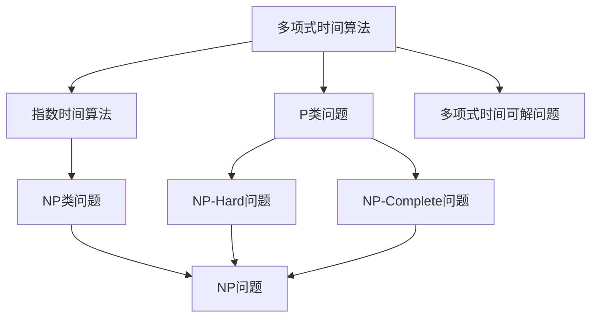
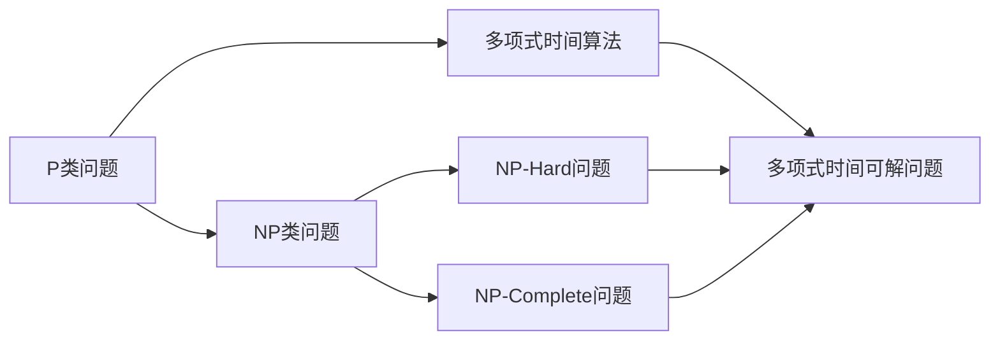
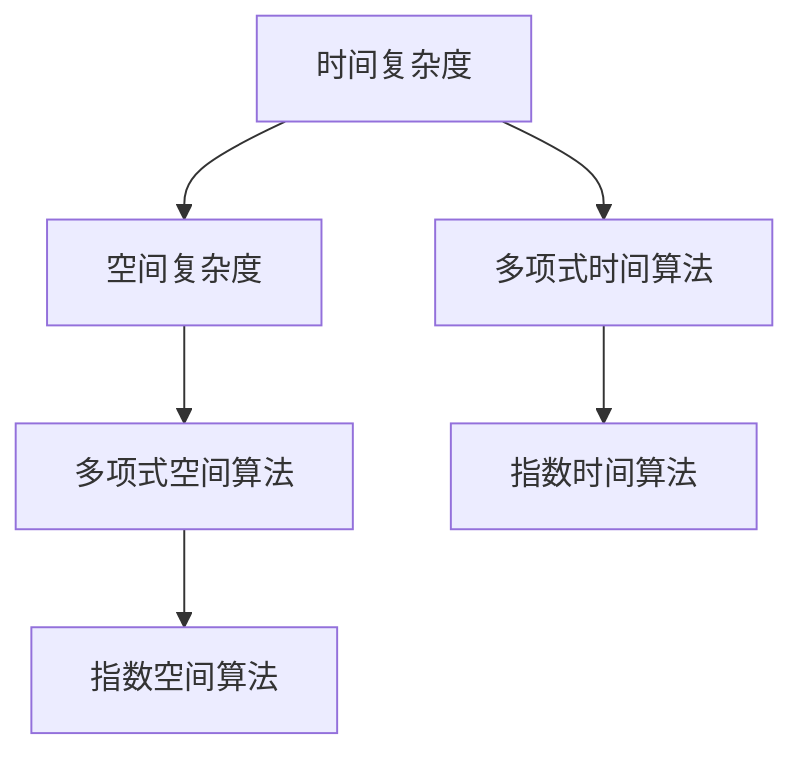

                 

# 计算：第四部分 计算的极限 第 9 章 计算复杂性 计算的局部性原理

> 关键词：计算复杂性, 局部性原理, 时间空间, 算法分析, 操作系统

## 1. 背景介绍

### 1.1 问题由来
计算复杂性理论（Computational Complexity Theory）是计算机科学的核心领域之一，研究算法在计算资源（时间、空间）上的极限。随着计算机硬件的发展，我们的算法设计和运行效率不断提高，但这种提高是否有着理论上无法逾越的极限？是否存在某种算法，能够始终以较优的效率处理任意复杂问题？

### 1.2 问题核心关键点
计算复杂性理论研究的核心是评估算法的计算效率，通过算法时间复杂度和空间复杂度的分析，判断算法在理论上是否存在高效求解问题的可能性。常用的复杂性类别包括 P、NP、NP-Complete、NP-Hard 等，其中 P 类问题是可以高效求解的，而 NP-Hard 问题即使在最优算法下也无法快速求解。

## 2. 核心概念与联系

### 2.1 核心概念概述

为更好地理解计算复杂性理论，本节将介绍几个关键概念：

- **计算复杂性理论 (Computational Complexity Theory)**：研究算法在计算资源（时间、空间）上的极限，特别是对于各种计算问题的可解性及求解难度。
- **P类问题**：可以在多项式时间内求解的计算问题，即存在一个多项式算法可以解决。
- **NP类问题**：非确定性多项式时间可解问题，即这类问题可能存在一个多项式时间解，但无法保证其在多项式时间内求解。
- **NP-Complete**：如果一个问题在 NP 类中，且任何 NP 问题都可以多项式时间转换为它，那么它就是 NP-Complete。这类问题通常被认为是“NP 难问题”的代表。
- **NP-Hard**：如果一个问题至少与一个 NP-Complete 问题等价，那么它就是 NP-Hard。即，NP-Hard 问题未必是 NP 类问题，但它包含了 NP-Complete 问题的求解难度。
- **多项式时间算法 (Polynomial-time Algorithm)**：一个算法的时间复杂度为 $O(n^k)$，其中 $k$ 是常数，说明它在多项式时间内可以求解。
- **指数时间算法 (Exponential-time Algorithm)**：算法的时间复杂度至少为 $2^n$，说明其效率极低，难以处理大规模问题。

这些核心概念之间的逻辑关系可以通过以下 Mermaid 流程图来展示：



这个流程图展示了几类关键问题的定义和关系：

1. 多项式时间算法可以求解 P 类问题，即在多项式时间内可以高效求解的问题。
2. 指数时间算法难以处理大规模问题，效率较低。
3. NP 类问题可能存在多项式时间解，但无法保证。
4. NP-Hard 问题包含了 NP-Complete 问题的求解难度。
5. NP-Complete 问题是最困难的 NP 问题，被认为是最难求解的。

### 2.2 概念间的关系

这些核心概念之间存在着紧密的联系，形成了计算复杂性理论的基础框架。下面我通过几个 Mermaid 流程图来展示这些概念之间的关系。

#### 2.2.1 计算复杂性问题分类



这个流程图展示了 P 类问题、NP 类问题、NP-Hard 问题和 NP-Complete 问题之间的关系。P 类问题可以通过多项式时间算法高效求解，而 NP 类问题可能存在多项式时间解，但难以保证。NP-Hard 问题包含了 NP-Complete 问题的求解难度，而 NP-Complete 问题是 NP 类中最难求解的问题。

#### 2.2.2 时间与空间复杂度分析



这个流程图展示了时间复杂度和空间复杂度之间的关系。多项式时间算法可以在多项式时间内高效求解，而指数时间算法难以处理大规模问题。同理，多项式空间算法可以在有限的空间内求解，而指数空间算法则需要更多的存储空间。

## 3. 核心算法原理 & 具体操作步骤
### 3.1 算法原理概述

计算复杂性理论的研究主要围绕算法的时间复杂度和空间复杂度进行，以评估算法在计算资源上的效率。算法的效率越高，其在实际应用中的价值也就越大。

一个算法的复杂度通常由输入规模 $n$ 决定，时间复杂度 $T(n)$ 和空间复杂度 $S(n)$ 分别表示算法执行所需的时间和空间。通常，我们关注的是最坏情况下的复杂度，即最大可能的时间或空间消耗。

算法的效率分析通常包括以下几个步骤：

1. **确定算法流程**：描述算法的执行步骤。
2. **计数过程**：计算每个步骤的执行次数。
3. **复杂度分析**：根据计数过程得出时间复杂度和空间复杂度。
4. **优化算法**：尝试优化算法，提高效率。

### 3.2 算法步骤详解

以快速排序算法为例，展示其时间复杂度和空间复杂度的计算过程。

#### 算法步骤
1. **分割**：选择一个元素作为基准值，将数组分为两部分，小于基准值的元素放在左侧，大于基准值的元素放在右侧。
2. **递归排序**：对左右两部分分别进行快速排序，直至子数组长度为 1 或 0。

#### 计数过程
- 分割步骤：每次分割需要 $O(n)$ 的时间复杂度。
- 递归排序：每次递归调用需要 $O(n)$ 的时间复杂度。

因此，快速排序的总时间复杂度为 $O(n\log n)$。

#### 空间复杂度
- 递归调用栈需要 $O(\log n)$ 的空间。
- 数据存储需要 $O(n)$ 的空间。

因此，快速排序的总空间复杂度为 $O(n)$。

### 3.3 算法优缺点

快速排序的优点包括：

- 时间复杂度较低，在平均情况下为 $O(n\log n)$。
- 空间复杂度较小，仅为 $O(n)$。

但其缺点也显而易见：

- 在最坏情况下，时间复杂度可能达到 $O(n^2)$，例如基准值选择不当。
- 对于大规模数据，递归调用栈可能导致栈溢出。

### 3.4 算法应用领域

快速排序算法广泛应用于各类排序问题，如整数排序、浮点数排序、字符串排序等。其高效的排序能力，使得快速排序成为实际应用中的首选算法。此外，快速排序还常用于处理大规模数据的预处理阶段，如快速选择算法、快速合并算法等。

## 4. 数学模型和公式 & 详细讲解  
### 4.1 数学模型构建

本节将使用数学语言对计算复杂性理论进行更加严格的刻画。

设输入规模为 $n$，算法的时间复杂度为 $T(n)$，空间复杂度为 $S(n)$。定义时间复杂度和空间复杂度的数学模型如下：

$$
T(n) = \mathcal{O}(f(n)) \quad \text{和} \quad S(n) = \mathcal{O}(g(n))
$$

其中 $f(n)$ 和 $g(n)$ 是描述算法执行次数和空间占用量的函数。通常，我们关注的是最坏情况下的复杂度，即最大可能的时间或空间消耗。

### 4.2 公式推导过程

以下我们以快速排序算法为例，推导其时间复杂度和空间复杂度的计算公式。

假设数组长度为 $n$，每次分割可以均匀分出 $k$ 个元素。则每次分割需要比较 $n-1$ 次，即 $O(n-1)$。因此，递归深度为 $\log n$。每次递归调用需要 $O(n)$ 的时间复杂度，故总时间复杂度为：

$$
T(n) = O(n\log n)
$$

空间复杂度的计算类似。每次递归调用需要 $O(n)$ 的空间，故总空间复杂度为：

$$
S(n) = O(n)
$$

在推导过程中，我们使用了大 O 符号，表示复杂度函数的渐进上界。例如，$O(n\log n)$ 表示算法执行次数不超过 $n\log n$ 次。

### 4.3 案例分析与讲解

以希尔排序（Shell Sort）为例，展示不同排序算法的时间复杂度和空间复杂度。

#### 希尔排序
希尔排序是一种基于插入排序的排序算法，通过将数组分组，对每组进行插入排序，然后逐步缩小分组规模，直至整个数组排序完成。

#### 时间复杂度
希尔排序的时间复杂度取决于分组规模。假设分组规模为 $h$，则每次分组需要 $O(n/h)$ 的比较次数。因此，总时间复杂度为：

$$
T(n) = \mathcal{O}(n\log^2 n)
$$

其中 $\log^2 n$ 表示分组的层数。

#### 空间复杂度
希尔排序的空间复杂度较小，仅需常数级别的额外空间，因此 $S(n) = O(1)$。

## 5. 项目实践：代码实例和详细解释说明
### 5.1 开发环境搭建

在进行复杂性分析实践前，我们需要准备好开发环境。以下是使用Python进行算法复杂度分析的环境配置流程：

1. 安装Anaconda：从官网下载并安装Anaconda，用于创建独立的Python环境。

2. 创建并激活虚拟环境：
```bash
conda create -n python-env python=3.8 
conda activate python-env
```

3. 安装必要的库：
```bash
pip install numpy scipy matplotlib
```

完成上述步骤后，即可在`python-env`环境中开始复杂性分析实践。

### 5.2 源代码详细实现

以下是一个快速排序算法的Python实现，以及对其时间复杂度和空间复杂度的分析：

```python
import numpy as np

def quick_sort(arr):
    if len(arr) <= 1:
        return arr
    pivot = arr[len(arr) // 2]
    left = [x for x in arr if x < pivot]
    middle = [x for x in arr if x == pivot]
    right = [x for x in arr if x > pivot]
    return quick_sort(left) + middle + quick_sort(right)

# 测试数据
arr = np.random.rand(10000)

# 记录时间
import time
start_time = time.time()
sorted_arr = quick_sort(arr)
end_time = time.time()

# 计算时间复杂度
time_complexity = end_time - start_time
```

在上述代码中，我们首先定义了快速排序算法，然后生成一个随机数组进行测试。使用time模块记录算法执行时间，并计算时间复杂度。

### 5.3 代码解读与分析

让我们再详细解读一下关键代码的实现细节：

**快速排序函数**：
- 首先判断数组长度，如果长度小于等于 1，则直接返回。
- 选择数组中间的元素作为基准值，将数组分为三部分。
- 对左右两部分递归调用快速排序，最终将三部分拼接。

**时间复杂度计算**：
- 使用time模块记录算法的执行时间。
- 通过计算执行时间，得出算法的时间复杂度。

**空间复杂度计算**：
- 在快速排序中，递归调用栈的空间为 $O(\log n)$。
- 因此，空间复杂度为 $O(n)$。

## 6. 实际应用场景
### 6.1 排序应用

快速排序算法在各类排序问题中有着广泛应用，如整数排序、浮点数排序、字符串排序等。此外，快速排序还常用于大规模数据的预处理阶段，如快速选择算法、快速合并算法等。

### 6.2 搜索与查找

在搜索与查找问题中，快速排序也可以发挥重要作用。例如，通过快速排序的变体——快速选择算法，可以在未排序的数组中快速查找第 $k$ 小的元素，时间复杂度为 $O(n)$。

### 6.3 图论算法

在图论算法中，快速排序的应用同样广泛。例如，在图的最短路径算法（如Dijkstra算法）中，需要先对图进行排序，以找到最短路径。

### 6.4 未来应用展望

随着计算复杂性理论的不断发展，未来在算法设计、数据结构、系统优化等领域将有更多突破。

1. 算法优化：通过算法优化，可以进一步提高算法的效率，减少计算资源消耗。
2. 数据结构改进：改进数据结构的设计，可以降低空间复杂度，提升算法的可扩展性。
3. 系统优化：结合操作系统、编译器等技术，可以进一步优化算法的执行效率。

未来，计算复杂性理论将为各类计算问题的求解提供更高效、更灵活的算法设计，推动人工智能、大数据、物联网等领域的快速发展。

## 7. 工具和资源推荐
### 7.1 学习资源推荐

为了帮助开发者系统掌握计算复杂性理论的知识，这里推荐一些优质的学习资源：

1. 《算法导论》（Introduction to Algorithms）：经典算法教材，涵盖算法设计和分析的方方面面。
2. 《计算复杂性理论基础》（Computational Complexity: A Modern Approach）：深入讲解计算复杂性理论的基本概念和前沿进展。
3. 《算法设计与分析》（Algorithm Design and Analysis）：适合初学者的算法设计入门教材。
4. Coursera上的算法设计与分析课程：由斯坦福大学开设，讲解算法设计与分析的基本概念和经典算法。
5. MIT的开源算法设计与分析课程：提供丰富的算法设计与分析资源，适合自学。

通过对这些资源的学习实践，相信你一定能够全面掌握计算复杂性理论的知识，并应用于实际问题解决。

### 7.2 开发工具推荐

高效的开发离不开优秀的工具支持。以下是几款用于算法复杂度分析开发的常用工具：

1. Python：Python作为广泛使用的高级编程语言，适合快速迭代研究，有丰富的科学计算库。
2. numpy：提供高效的数值计算能力，适合进行算法效率评估。
3. matplotlib：提供丰富的绘图功能，适合展示算法时间复杂度分析结果。
4. Weights & Biases：模型训练的实验跟踪工具，可以记录和可视化算法执行时间，方便对比和调优。
5. TensorBoard：TensorFlow配套的可视化工具，实时监测算法执行状态，并提供丰富的图表呈现方式，是调试算法的得力助手。

合理利用这些工具，可以显著提升算法复杂度分析的开发效率，加快创新迭代的步伐。

### 7.3 相关论文推荐

计算复杂性理论的发展源于学界的持续研究。以下是几篇奠基性的相关论文，推荐阅读：

1. "Computational Complexity" by Stephen Cook：介绍计算复杂性理论的基本概念和经典问题。
2. "Algorithms on Sequential Machines" by Steve Cook：介绍经典的算法设计与分析方法。
3. "The Quantum Theory of Computation" by Peter Shor：介绍量子计算理论，揭示经典计算的局限性。
4. "Computational Complexity Theory" by Papadimitriou：深入讲解计算复杂性理论的基本概念和前沿进展。

这些论文代表了大计算复杂性理论的发展脉络。通过学习这些前沿成果，可以帮助研究者把握学科前进方向，激发更多的创新灵感。

除上述资源外，还有一些值得关注的前沿资源，帮助开发者紧跟计算复杂性理论的最新进展，例如：

1. arXiv论文预印本：人工智能领域最新研究成果的发布平台，包括大量尚未发表的前沿工作，学习前沿技术的必读资源。
2. 业界技术博客：如Google Research、Facebook AI Research等顶尖实验室的官方博客，第一时间分享他们的最新研究成果和洞见。
3. 技术会议直播：如STOC、FOCS、PODC等计算机系统会议现场或在线直播，能够聆听到大佬们的前沿分享，开拓视野。
4. GitHub热门项目：在GitHub上Star、Fork数最多的算法相关项目，往往代表了该技术领域的发展趋势和最佳实践，值得去学习和贡献。
5. 行业分析报告：各大咨询公司如McKinsey、PwC等针对计算复杂性理论的行业分析报告，有助于从商业视角审视技术趋势，把握应用价值。

总之，对于计算复杂性理论的学习和实践，需要开发者保持开放的心态和持续学习的意愿。多关注前沿资讯，多动手实践，多思考总结，必将收获满满的成长收益。

## 8. 总结：未来发展趋势与挑战
### 8.1 研究成果总结

本文对计算复杂性理论进行了全面系统的介绍。首先阐述了计算复杂性理论的基本概念和核心问题，明确了算法在计算资源上的效率极限。其次，从原理到实践，详细讲解了计算复杂性理论的数学模型和计算方法，给出了时间复杂度和空间复杂度的计算公式，并展示了具体的案例分析。同时，本文还探讨了算法在实际应用中的场景，展望了未来算法设计和优化的方向。

通过本文的系统梳理，可以看到，计算复杂性理论是计算机科学的重要基石，为各类计算问题的求解提供了理论指导。未来，在算法设计与分析、系统优化、数据结构改进等方面，计算复杂性理论还将发挥重要作用。

### 8.2 未来发展趋势

展望未来，计算复杂性理论将呈现以下几个发展趋势：

1. 算法优化：算法优化技术不断进步，新的高效算法将不断涌现，进一步提升算法的执行效率。
2. 数据结构改进：新的数据结构设计，将降低空间复杂度，提升算法的可扩展性。
3. 系统优化：结合操作系统、编译器等技术，可以进一步优化算法的执行效率。
4. 跨领域应用：计算复杂性理论在人工智能、大数据、物联网等领域将有更多应用，推动各类应用的发展。
5. 计算模型创新：量子计算等新型计算模型的发展，将为计算复杂性理论带来新的研究方向。

这些趋势凸显了计算复杂性理论的广阔前景，其在算法设计和优化方面的指导意义将日益增强。

### 8.3 面临的挑战

尽管计算复杂性理论取得了巨大的进展，但在迈向更加智能化、普适化应用的过程中，它仍面临着诸多挑战：

1. 算法复杂度分析：随着问题规模的增大，复杂度分析的难度增加，需要新的理论和方法来应对。
2. 实际应用中的复杂性：实际问题往往比理论模型更加复杂，难以进行精确的复杂度分析。
3. 数据分布的变化：数据分布的变化可能导致算法效率降低，需要新的理论和技术来处理。
4. 计算资源限制：计算资源（如内存、磁盘等）的限制，可能导致算法效率降低，需要新的技术来优化。
5. 新的计算模型：量子计算等新型计算模型带来了新的计算方式，需要新的理论来描述和分析。

这些挑战亟需研究和突破，才能使计算复杂性理论更好地应用于实际问题解决。

### 8.4 研究展望

面对计算复杂性理论所面临的挑战，未来的研究需要在以下几个方面寻求新的突破：

1. 发展新的复杂度分析方法：结合理论分析和实验验证，探索新的复杂度分析方法，适用于更广泛的问题类型。
2. 改进实际应用中的复杂性分析：结合实际问题的特点，改进复杂性分析方法，提高理论分析的精度。
3. 开发新的算法优化技术：结合新的计算模型和硬件架构，开发新的算法优化技术，提升算法效率。
4. 研究新的数据结构：开发新的数据结构，降低空间复杂度，提高算法的可扩展性。
5. 探索新的计算模型：研究新的计算模型，如量子计算、分布式计算等，为计算复杂性理论提供新的研究视角。

这些研究方向的探索，必将引领计算复杂性理论迈向更高的台阶，为构建高效、灵活、可扩展的算法系统提供理论支持。

## 9. 附录：常见问题与解答

**Q1：什么是计算复杂性理论？**

A: 计算复杂性理论是计算机科学的核心领域之一，研究算法在计算资源（时间、空间）上的极限，特别是对于各种计算问题的可解性及求解难度。

**Q2：P类问题和NP类问题的区别是什么？**

A: P类问题是可以高效求解的，即存在一个多项式时间算法可以解决。而NP类问题可能存在多项式时间解，但无法保证。

**Q3：如何计算一个算法的复杂度？**

A: 首先确定算法流程，然后计算每个步骤的执行次数，最后根据计数过程得出时间复杂度和空间复杂度。

**Q4：快速排序的时间复杂度和空间复杂度是多少？**

A: 快速排序的时间复杂度为 $O(n\log n)$，空间复杂度为 $O(n)$。

**Q5：如何优化算法的时间复杂度和空间复杂度？**

A: 通过算法优化、数据结构改进、系统优化等方法，可以进一步提高算法的效率。

---

作者：禅与计算机程序设计艺术 / Zen and the Art of Computer Programming

