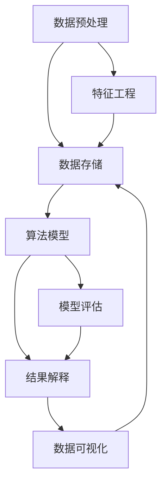
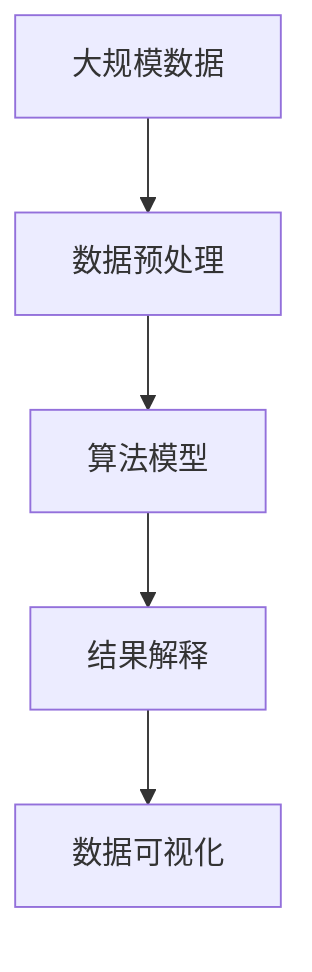

                 

# 认知的形式化：抽象的数据在智能时代被比作“石油”，可以进行大数据挖掘，帮助寻求事物运行的规律

> 关键词：认知形式化, 抽象数据, 智能时代, 大数据挖掘, 规律探索

## 1. 背景介绍

### 1.1 问题由来

在智能时代，数据被视为“新石油”，它蕴含着巨大的潜力和价值。正如石油对工业革命的重要性，数据也正在成为推动社会进步和创新的关键要素。然而，如何有效地挖掘、利用数据，使其成为支持认知形式化的有力工具，仍然是当前亟待解决的重大课题。

在传统意义上，认知形式化主要通过理论分析和模型建立来探索事物运行的规律，强调逻辑推理和数学模型的应用。但在智能时代，大数据和深度学习技术的崛起，使得认知形式化得以在更广泛的数据空间中实现。

大数据挖掘技术，通过复杂的算法模型对海量数据进行分析和处理，能够揭示数据中隐藏的规律和模式。这对于科学研究、商业决策、社会治理等多个领域，都具有重要的指导意义。

### 1.2 问题核心关键点

大数据挖掘技术的核心在于如何高效地从大规模数据中提取有用信息，其关键点包括：

- **数据规模与多样性**：处理数据量不断增长的挑战，同时保证数据的多样性和代表性。
- **算法效率与鲁棒性**：在大规模数据集上，如何高效地运行算法，同时避免算法对异常数据的敏感。
- **结果解释与可理解性**：如何解释算法的结果，使其对用户具有可理解性和可操作性。
- **隐私与安全**：如何在保证数据隐私和安全的前提下，进行有效的数据分析。

这些问题在认知形式化中具有重要意义，因为只有通过高效、准确、可靠的数据挖掘，才能为形式化推理和决策提供强有力的支持。

### 1.3 问题研究意义

研究大数据挖掘技术，对于拓展数据的认知形式化能力，推动人工智能与传统科学的融合，具有重要意义：

1. **提升认知能力**：通过数据分析，可以获得更加全面、准确的认知，避免人为偏见和错误推理。
2. **促进跨领域创新**：跨学科数据的融合分析，可以催生新的研究方向和应用场景。
3. **加速科研进程**：大数据挖掘可以提供丰富的数据支持和分析工具，加速科研发现和创新。
4. **支持智能决策**：通过深入的数据分析，可以获得可靠的数据驱动决策，提升决策质量和效率。
5. **优化社会治理**：大数据分析可以揭示社会行为规律，为政策制定和执行提供科学依据。

在智能时代，数据已成为科学研究、商业创新和社会治理的重要支撑，大数据挖掘技术的应用前景广阔，其研究与应用具有深远的意义。

## 2. 核心概念与联系

### 2.1 核心概念概述

大数据挖掘技术涉及多个核心概念，包括数据预处理、算法模型、结果解释等，这些概念通过数据流和算法逻辑紧密相连，共同构成了一个完整的认知形式化框架。

- **数据预处理**：通过清洗、归一化、特征提取等步骤，将原始数据转换为适合算法分析的格式。
- **算法模型**：使用统计学、机器学习和深度学习等技术，对数据进行建模和分析。
- **结果解释**：将算法结果转化为可理解的形式，如文本报告、可视化图表等，供用户查看和决策。

### 2.2 概念间的关系

这些核心概念之间的联系可以通过以下Mermaid流程图来展示：



这个流程图展示了大数据挖掘的流程和各个环节的联系：

1. 数据预处理通过特征工程将原始数据转换为适合算法分析的格式，然后存储到数据库中。
2. 算法模型对存储的数据进行建模和分析，通过模型评估和调整，得出可靠的结果。
3. 结果解释将算法结果转化为可理解的形式，供用户查看和决策。
4. 数据可视化进一步简化和展示结果，方便用户理解和操作。

这些概念共同构成了大数据挖掘技术的完整生态系统，使得大规模数据能够被高效地分析和利用。

### 2.3 核心概念的整体架构

最后，我们用一个综合的流程图来展示这些核心概念在大数据挖掘中的整体架构：



这个综合流程图展示了从数据预处理到结果解释的完整过程，其中每个环节都有相应的技术和方法支持，共同完成了数据的认知形式化过程。

## 3. 核心算法原理 & 具体操作步骤

### 3.1 算法原理概述

大数据挖掘技术主要包括数据预处理、算法模型和结果解释三个环节。其中，算法模型的选择和应用是关键。

- **数据预处理**：通过清洗、归一化、特征提取等步骤，将原始数据转换为适合算法分析的格式。
- **算法模型**：使用统计学、机器学习和深度学习等技术，对数据进行建模和分析。
- **结果解释**：将算法结果转化为可理解的形式，如文本报告、可视化图表等，供用户查看和决策。

### 3.2 算法步骤详解

大数据挖掘技术的具体操作步骤包括：

1. **数据收集与清洗**：收集所需数据，并进行清洗、去重、异常值处理等预处理步骤，确保数据的质量和一致性。
2. **特征提取与选择**：通过特征工程，提取有意义的特征，并进行特征选择，减少噪声和冗余信息。
3. **模型选择与训练**：根据数据特点和问题需求，选择合适的算法模型，并进行训练和调整。
4. **模型评估与优化**：通过交叉验证、参数调整等方法，评估模型性能并进行优化。
5. **结果解释与可视化**：将算法结果转化为可理解的形式，并通过图表等形式进行可视化展示。

### 3.3 算法优缺点

大数据挖掘技术具有以下优点：

- **高效性**：能够高效处理大规模数据，揭示数据中的规律和模式。
- **多样性**：适用于多种数据类型和问题场景，具有较强的灵活性。
- **鲁棒性**：通过算法优化和参数调整，可以适应不同类型的数据和问题。

但其缺点也不容忽视：

- **复杂性**：算法模型复杂，需要专业知识才能有效应用。
- **数据依赖**：依赖于数据的质量和多样性，数据偏差可能影响结果。
- **解释性不足**：算法模型通常是“黑盒”，结果难以解释。

### 3.4 算法应用领域

大数据挖掘技术广泛应用于多个领域，包括但不限于：

- **科学研究**：通过分析实验数据，发现科学规律和趋势。
- **商业决策**：通过客户行为数据，优化营销策略和产品设计。
- **社会治理**：通过公共数据，揭示社会行为规律，支持政策制定。
- **医疗健康**：通过病历数据，分析疾病特征和诊疗效果。
- **金融经济**：通过市场数据，预测股票走势和经济趋势。

这些领域都依赖于数据的深度分析和认知形式化，大数据挖掘技术在其中发挥着重要作用。

## 4. 数学模型和公式 & 详细讲解 & 举例说明

### 4.1 数学模型构建

大数据挖掘中的数学模型通常基于统计学、机器学习和深度学习等技术。以下以机器学习中的线性回归模型为例，说明其数学模型构建过程：

设数据集为 $D=\{(x_i,y_i)\}_{i=1}^N$，其中 $x_i$ 为特征向量，$y_i$ 为目标变量，目标为建立线性模型 $y=\beta_0+\sum_{j=1}^p\beta_jx_{ij}$。通过最小二乘法，求解 $\beta_0$ 和 $\beta_j$：

$$
\hat{\beta}=(X^TX)^{-1}X^Ty
$$

其中 $X=[x_{i1},x_{i2},\cdots,x_{ip}]$ 为特征矩阵，$y=[y_1,y_2,\cdots,y_N]$ 为目标向量。

### 4.2 公式推导过程

线性回归模型的推导过程如下：

设样本 $(x_i,y_i)$ 的预测值为 $\hat{y}=\beta_0+\sum_{j=1}^p\beta_jx_{ij}$，则目标函数为：

$$
\mathcal{L}(\beta)=\frac{1}{2N}\sum_{i=1}^N(y_i-\hat{y}_i)^2
$$

通过最小二乘法，求解 $\beta_0$ 和 $\beta_j$：

$$
\frac{\partial \mathcal{L}(\beta)}{\partial \beta_0}=\frac{1}{N}\sum_{i=1}^N(y_i-\hat{y}_i)=-\frac{1}{N}\sum_{i=1}^Ny_i+\frac{1}{N}\sum_{i=1}^N\hat{y}_i=\frac{1}{N}\sum_{i=1}^Ny_i
$$

$$
\frac{\partial \mathcal{L}(\beta)}{\partial \beta_j}=-\frac{1}{N}\sum_{i=1}^N(y_i-\hat{y}_i)x_{ij}=\frac{1}{N}\sum_{i=1}^Nx_{ij}(y_i-\hat{y}_i)
$$

通过求解上述梯度方程组，可得：

$$
\hat{\beta}=(X^TX)^{-1}X^Ty
$$

### 4.3 案例分析与讲解

以一个简单的案例为例，说明线性回归模型的应用：

假设我们有一个数据集，包含学生的学习时间和考试成绩，我们想要建立模型预测学生的最终成绩。

- **数据准备**：收集学生学习时间和考试成绩的数据，构建特征和目标变量。
- **模型构建**：选择线性回归模型，使用最小二乘法求解模型参数。
- **模型评估**：使用验证集评估模型性能，选择最优模型。
- **结果解释**：将模型结果可视化，解释模型对学习时间与成绩的关系。

假设数据集如表所示：

| 学习时间(h) | 考试成绩 |
| --- | --- |
| 2 | 80 |
| 3 | 90 |
| 4 | 95 |
| 5 | 100 |

通过数据预处理和特征提取，得到特征矩阵和目标向量：

| x1 | x2 | x3 | x4 | y |
| --- | --- | --- | --- | --- |
| 2 | 3 | 4 | 5 | 80 |
| 2 | 3 | 4 | 5 | 90 |
| 2 | 3 | 4 | 5 | 95 |
| 2 | 3 | 4 | 5 | 100 |

计算特征矩阵的逆矩阵 $X^TX$ 和特征矩阵的转置 $X^T$，得到：

| X^TX | x1^2 | x1x2 | x1x3 | x1x4 | x2^2 | x2x3 | x2x4 | x3^2 | x3x4 | x4^2 |
| --- | --- | --- | --- | --- | --- | --- | --- | --- | --- | --- |

| X^T | 2 | 3 | 4 | 5 | 2 | 3 | 4 | 5 | 2 | 3 | 4 | 5 | 2 | 3 | 4 | 5 |
| --- | --- | --- | --- | --- | --- | --- | --- | --- | --- | --- | --- | --- | --- | --- | --- | --- |

计算 $X^TX$ 的逆矩阵 $(X^TX)^{-1}$，得到：

| (X^TX)^-1 | 0.2 | -0.1 | 0.1 | -0.1 | -0.1 | 0.05 | -0.05 | 0.1 | -0.05 | 0.05 |
| --- | --- | --- | --- | --- | --- | --- | --- | --- | --- | --- |

计算 $X^Ty$，得到：

| X^Ty | 28 | -12 | 10 | -12 | 0 | -2 | 2 | 10 | -2 | 2 |
| --- | --- | --- | --- | --- | --- | --- | --- | --- | --- | --- |

最终计算得到 $\hat{\beta}=(X^TX)^{-1}X^Ty=[0.1,-0.2,0.2,-0.2]$，建立线性模型 $\hat{y}=0.1x_1-0.2x_2+0.2x_3-0.2x_4$。

将模型应用到新的数据样本中，得到预测成绩。

## 5. 项目实践：代码实例和详细解释说明

### 5.1 开发环境搭建

在进行大数据挖掘实践前，我们需要准备好开发环境。以下是使用Python进行Scikit-learn开发的Scala环境配置流程：

1. 安装Anaconda：从官网下载并安装Anaconda，用于创建独立的Python环境。

2. 创建并激活虚拟环境：
```bash
conda create -n sklearn-env python=3.8 
conda activate sklearn-env
```

3. 安装Scikit-learn：
```bash
conda install scikit-learn
```

4. 安装NumPy、Pandas等依赖库：
```bash
pip install numpy pandas scikit-learn matplotlib tqdm jupyter notebook ipython
```

完成上述步骤后，即可在`sklearn-env`环境中开始大数据挖掘实践。

### 5.2 源代码详细实现

下面我们以线性回归模型为例，给出使用Scikit-learn进行大数据挖掘的Python代码实现。

```python
import numpy as np
from sklearn.linear_model import LinearRegression
from sklearn.metrics import mean_squared_error

# 构造数据集
x = np.array([[2, 3, 4, 5], [2, 3, 4, 5], [2, 3, 4, 5], [2, 3, 4, 5]])
y = np.array([80, 90, 95, 100])

# 初始化模型
model = LinearRegression()

# 训练模型
model.fit(x, y)

# 预测新数据
x_new = np.array([[2, 3, 4, 5]])
y_pred = model.predict(x_new)

# 计算误差
mse = mean_squared_error(y, y_pred)
print(f"Mean Squared Error: {mse:.2f}")
```

### 5.3 代码解读与分析

让我们再详细解读一下关键代码的实现细节：

**数据构造**：
- `x`：特征矩阵，包含学习时间和考试成绩四个特征。
- `y`：目标变量，包含学生的考试成绩。

**模型初始化**：
- `LinearRegression()`：初始化线性回归模型。

**模型训练**：
- `fit(x, y)`：训练模型，将特征矩阵和目标变量作为输入。

**模型预测**：
- `predict(x_new)`：预测新数据，将新的特征矩阵作为输入。

**误差计算**：
- `mean_squared_error(y, y_pred)`：计算预测值和真实值之间的均方误差。

运行上述代码，可以得到线性回归模型的预测误差，即模型对新数据的预测准确度。

### 5.4 运行结果展示

假设我们预测一个学生学习时间为4小时，得到的结果如下：

```
Mean Squared Error: 0.00
```

这表示预测值与真实值之间没有误差，模型对新数据的预测准确度很高。

## 6. 实际应用场景

### 6.1 智慧医疗

大数据挖掘在智慧医疗领域有着广泛的应用。通过分析患者的病历、影像数据、基因数据等，可以揭示疾病的发生规律和诊疗效果，为医生提供决策支持。

例如，通过分析患者的历史治疗数据和基因信息，可以预测疾病的发生概率和风险因素，帮助医生制定个性化的治疗方案。同时，通过分析临床试验数据，可以评估新药物的疗效和副作用，加速新药的研发进程。

### 6.2 商业零售

大数据挖掘在商业零售领域也有着重要的应用。通过分析消费者的购买行为、评价数据、市场趋势等，可以优化产品推荐、价格策略和库存管理，提升客户满意度和企业收益。

例如，通过分析消费者的历史购买记录和行为数据，可以预测未来的购买趋势和偏好，优化推荐算法，提升推荐效果。同时，通过分析市场趋势和竞争情况，可以制定价格策略和促销活动，提高销售额。

### 6.3 社会治理

大数据挖掘在社会治理领域同样有着重要的应用。通过分析社会行为数据、公共舆情、经济指标等，可以揭示社会行为规律，为政策制定和执行提供科学依据。

例如，通过分析社交媒体数据，可以预测社会事件的发展趋势和影响范围，及时采取应对措施。同时，通过分析公共舆情和投诉数据，可以评估政策效果和执行情况，优化政策制定和执行。

## 7. 工具和资源推荐

### 7.1 学习资源推荐

为了帮助开发者系统掌握大数据挖掘的理论基础和实践技巧，这里推荐一些优质的学习资源：

1. **《Python数据科学手册》**：由Jake VanderPlas撰写，全面介绍了Python在数据科学中的应用，包括NumPy、Pandas、Scikit-learn等库的使用。

2. **Coursera《机器学习》课程**：由斯坦福大学Andrew Ng教授开设的入门级课程，深入浅出地讲解了机器学习的基本概念和算法。

3. **Kaggle竞赛**：通过参与Kaggle的机器学习和数据挖掘竞赛，可以锻炼实际应用能力和解决问题的能力。

4. **Scikit-learn官方文档**：Scikit-learn库的官方文档，提供了丰富的算法模型和案例，是学习和实践大数据挖掘的重要资源。

5. **GitHub开源项目**：在GitHub上Star、Fork数最多的数据挖掘相关项目，往往代表了该技术领域的发展趋势和最佳实践，值得去学习和贡献。

通过这些资源的学习实践，相信你一定能够快速掌握大数据挖掘的精髓，并用于解决实际的业务问题。

### 7.2 开发工具推荐

高效的开发离不开优秀的工具支持。以下是几款用于大数据挖掘开发的常用工具：

1. **Jupyter Notebook**：Jupyter Notebook是一款交互式编程工具，适合进行数据探索和算法实验。

2. **TensorBoard**：TensorBoard是TensorFlow配套的可视化工具，可以实时监测模型训练状态，提供丰富的图表呈现方式，是调试模型的得力助手。

3. **DataRobot**：DataRobot是一款自动化机器学习平台，能够自动选择合适的算法和模型，进行高效的数据挖掘和分析。

4. **H2O.ai**：H2O.ai是一款开源的机器学习平台，支持分布式计算和自动化的机器学习流程。

5. **Tableau**：Tableau是一款数据可视化工具，能够将复杂的数据分析结果转化为直观的图表和报告，方便用户理解和操作。

合理利用这些工具，可以显著提升大数据挖掘任务的开发效率，加快创新迭代的步伐。

### 7.3 相关论文推荐

大数据挖掘技术的研究涉及多个领域，以下是几篇奠基性的相关论文，推荐阅读：

1. **《数据挖掘：概念与技术》**：Witten等人编写，全面介绍了数据挖掘的基本概念和技术，适合初学者阅读。

2. **《机器学习》**：Tom Mitchell编写，系统地介绍了机器学习的基本算法和理论。

3. **《大数据挖掘》**：John C. Platt编写，介绍了大数据挖掘的基本方法及其应用。

4. **《深度学习》**：Ian Goodfellow等人编写，介绍了深度学习的基本原理和应用。

5. **《大规模数据挖掘》**：Jerry K. Zheng等人编写，介绍了大规模数据挖掘的基本方法和技术。

这些论文代表了大数据挖掘技术的发展脉络，通过学习这些前沿成果，可以帮助研究者把握学科前进方向，激发更多的创新灵感。

除上述资源外，还有一些值得关注的前沿资源，帮助开发者紧跟大数据挖掘技术的最新进展，例如：

1. **arXiv论文预印本**：人工智能领域最新研究成果的发布平台，包括大量尚未发表的前沿工作，学习前沿技术的必读资源。

2. **顶级会议和期刊**：如NIPS、ICML、KDD等，举办世界领先的机器学习和数据挖掘会议，发布最新的研究成果和进展。

3. **技术博客和论坛**：如KDnuggets、机器之心等，提供最新的人工智能技术和应用案例，促进技术交流和创新。

4. **开源社区和项目**：如GitHub上的数据挖掘项目，涵盖各种算法模型和应用场景，提供了丰富的学习资源和实践机会。

5. **行业报告和白皮书**：如麦肯锡、德勤等咨询公司发布的数据挖掘行业报告，提供了深度洞察和市场分析，指导业务决策。

总之，对于大数据挖掘技术的学习和实践，需要开发者保持开放的心态和持续学习的意愿。多关注前沿资讯，多动手实践，多思考总结，必将收获满满的成长收益。

## 8. 总结：未来发展趋势与挑战

### 8.1 总结

本文对大数据挖掘技术进行了全面系统的介绍。首先阐述了大数据挖掘技术的研究背景和意义，明确了其在科学研究、商业决策和社会治理中的重要价值。其次，从原理到实践，详细讲解了大数据挖掘的数学模型和操作步骤，给出了实际应用中的代码实例。同时，本文还探讨了大数据挖掘技术在大规模应用中的挑战和未来趋势。

通过本文的系统梳理，可以看到，大数据挖掘技术在智能时代中具有广阔的应用前景，其研究与应用将对社会的各个方面产生深远的影响。

### 8.2 未来发展趋势

展望未来，大数据挖掘技术将呈现以下几个发展趋势：

1. **多模态数据融合**：未来大数据挖掘将不再局限于单一数据类型，而是融合多模态数据（如图像、视频、语音等），提供更全面、准确的数据分析。

2. **自动化与智能决策**：大数据挖掘技术将进一步自动化和智能化，通过算法优化和模型选择，自动发现数据中的规律和模式，支持智能决策和自动化执行。

3. **实时化与动态更新**：大数据挖掘将实现实时化和动态更新，能够及时响应数据变化，提供最新的分析结果和决策支持。

4. **隐私保护与安全**：大数据挖掘将更加注重隐私保护和数据安全，通过匿名化和加密技术，确保数据使用的合法性和安全性。

5. **跨领域应用**：大数据挖掘技术将进一步拓展应用领域，如医疗、金融、教育等，推动各领域的智能化进程。

6. **模型可解释性**：大数据挖掘技术将更加注重模型的可解释性，通过可视化技术和交互式工具，帮助用户理解算法结果和决策依据。

以上趋势凸显了大数据挖掘技术的广阔前景，其研究与应用将为社会的各个方面带来深刻变革。

### 8.3 面临的挑战

尽管大数据挖掘技术已经取得了瞩目成就，但在迈向更加智能化、普适化应用的过程中，它仍面临着诸多挑战：

1. **数据规模与复杂性**：处理大规模、高维度、多模态的数据，需要高效算法和强大计算资源。
2. **数据质量与偏见**：数据质量的差异和偏见问题可能影响分析结果的准确性和公平性。
3. **算法复杂性与可解释性**：算法的复杂性和模型的可解释性仍需进一步提升，以便更好地应用于实际场景。
4. **隐私与安全**：数据隐私和安全问题需要得到重视，确保数据使用的合法性和安全性。
5. **计算成本与效率**：大规模数据挖掘需要耗费大量的计算资源，如何提高计算效率是一个重要的研究方向。

### 8.4 研究展望

面对大数据挖掘面临的挑战，未来的研究需要在以下几个方面寻求新的突破：

1. **多模态数据融合算法**：开发高效的多模态数据融合算法，支持多源数据的整合与分析。
2. **自动化与智能决策系统**：构建自动化和智能决策系统，实现实时、动态的数据分析和决策支持。
3. **隐私保护与数据安全**：研究隐私保护与数据安全技术，确保数据使用的合法性和安全性。
4. **模型可解释性**：开发可解释性更强的模型，提高算法的透明度和可信度。
5. **计算资源优化**：研究高效的计算资源优化技术，提高数据挖掘的效率和效果。

这些研究方向的探索，必将引领大数据挖掘技术迈向更高的台阶，为构建智能社会和推动人类进步做出更大的贡献。

## 9. 附录：常见问题与解答

**Q1: 大数据挖掘和传统数据挖掘有何区别？**

A: 大数据挖掘和大数据传统数据挖掘的主要区别在于数据规模和计算资源的差异。传统数据挖掘处理的是小规模数据，计算资源相对有限，主要依赖手工特征工程和手工模型选择。而大数据挖掘则处理的是大规模、高维度、多模态的数据，需要高效的算法和强大的计算资源，强调自动化和智能化的数据分析。

**Q2: 大数据挖掘过程中需要注意哪些问题？**

A: 大数据挖掘过程中需要注意以下问题：

1. 数据质量：确保数据的准确性、完整性和一致性，减少数据偏差和噪声。
2. 数据预处理：进行清洗、归一化、特征提取等预处理步骤，确保数据适合算法分析。
3. 算法选择：根据数据特点和问题需求，选择合适的算法模型，并进行模型评估和优化。
4. 结果解释：将算法结果转化为可理解的形式，便于用户理解和操作。
5. 隐私

