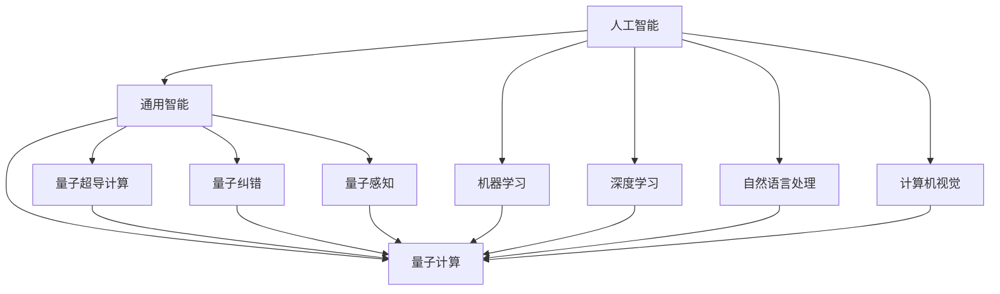

                 

# AGI与量子引力的跨学科合作

## 1. 背景介绍

### 1.1 问题由来
人工智能（AI）和量子计算（QC）在近十年间各自取得了显著的进展。人工智能正在逐渐走向通用智能（AGI），能够理解和解决各种复杂问题，涵盖自然语言处理、图像识别、决策支持等领域。而量子计算则通过量子比特（qubits）的叠加与纠缠特性，实现了传统计算机无法企及的计算速度与精度。然而，目前AI与QC仍处于独立发展的状态，二者之间尚未形成有效的协同效应。

### 1.2 问题核心关键点
这一问题的核心在于：如何利用量子计算的优势来加速AI，特别是在通用智能（AGI）的研究和应用上。量子计算在处理某些特定类型的问题时具有显著优势，如优化问题、模拟量子系统、量子纠错等。将其应用于AI，能够显著提升模型的训练效率与准确度，从而加速AGI的实现。

### 1.3 问题研究意义
研究AGI与量子引力的跨学科合作，对于推动人工智能与量子计算的融合具有重要意义：
- 加速AGI的实现：量子计算能够有效提升AI模型训练的效率，加速解决复杂问题的能力。
- 优化AI算法：量子计算在优化算法上的优势，可以用于改进AI的训练过程，提高模型性能。
- 促进新领域的研究：将量子计算引入AI，可能会带来新的研究方向与突破，如量子感知、量子决策等。
- 推动产业应用：AI与QC的融合，将开辟新的产业应用场景，促进相关产业的发展。

## 2. 核心概念与联系

### 2.1 核心概念概述

为更好地理解AGI与量子引力的跨学科合作，本节将介绍几个密切相关的核心概念：

- **人工智能（AI）**：利用计算机模拟人类智能的科学技术，涵盖机器学习、深度学习、自然语言处理、计算机视觉等领域。
- **通用智能（AGI）**：指一种能够理解和解决任意复杂问题的人工智能系统，类似于人类智能，具备自我学习、自我推理、自我修复等能力。
- **量子计算（QC）**：利用量子力学原理，通过量子比特进行计算的计算模式，具有强大的计算能力与速度。
- **量子超导计算**：使用超导量子比特进行量子计算的一种技术，是目前最为成熟的量子计算实现方式之一。
- **量子纠错**：量子计算中用于纠正量子比特错误的一种技术，提高量子计算的可靠性与稳定性。
- **量子感知**：利用量子计算实现的环境感知能力，如量子传感器、量子通信等。

### 2.2 概念间的关系

这些核心概念之间的逻辑关系可以通过以下Mermaid流程图来展示：



这个流程图展示了AI与QC的各个子概念之间的联系：
- 人工智能包括机器学习、深度学习、自然语言处理、计算机视觉等子领域，这些都是通用的AI技术。
- 通用智能（AGI）是人工智能的高级形态，具备自我学习、自我推理、自我修复等能力。
- 量子计算利用量子比特进行计算，是QC的基础技术。
- 量子超导计算是QC的一种具体实现方式，目前最为成熟。
- 量子纠错是提高量子计算可靠性的重要手段。
- 量子感知利用量子计算进行环境感知，如量子传感器、量子通信等。
- 这些技术相互交织，形成了AI与QC的跨学科合作网络。

## 3. 核心算法原理 & 具体操作步骤

### 3.1 算法原理概述

AGI与量子引力的跨学科合作的算法原理主要体现在以下几个方面：

- **量子加速优化**：利用量子计算对AI模型的优化算法进行加速，提高训练效率和模型精度。
- **量子神经网络**：构建基于量子计算的神经网络，利用量子叠加与纠缠特性，提升模型的表达能力与计算速度。
- **量子感知与决策**：将量子计算应用于感知与决策任务，如量子传感器、量子决策器等，提高AI系统的环境感知与决策能力。

### 3.2 算法步骤详解

具体算法步骤如下：

**Step 1: 数据准备与量子预处理**
- 收集训练数据集，并进行必要的预处理与量子编码。
- 将训练数据集输入量子计算机，利用量子超导技术进行量子计算。

**Step 2: 量子优化与训练**
- 在量子计算机上运行优化算法，对AI模型进行训练。
- 利用量子加速优化算法，提升模型训练效率。

**Step 3: 模型评估与优化**
- 在量子计算机上评估AI模型的性能，识别出模型的薄弱环节。
- 根据评估结果，对模型进行优化与调整，提高模型准确度与泛化能力。

**Step 4: 应用与部署**
- 将优化后的AI模型部署到实际应用场景中。
- 在实际应用中，持续监控模型性能，进行必要的微调与优化。

### 3.3 算法优缺点

AGI与量子引力的跨学科合作的算法具有以下优点：
1. **高效性**：量子计算在处理优化问题、模拟量子系统等方面具有显著优势，能够大幅提升AI模型训练的效率。
2. **精确性**：量子计算能够处理更为复杂的问题，提高AI模型的准确度与泛化能力。
3. **创新性**：引入量子计算，可以推动AI研究的新方向，如量子感知、量子决策等，带来新的研究热点与突破。

同时，该算法也存在以下缺点：
1. **成本高**：量子计算目前仍处于发展初期，需要高昂的投资与维护成本。
2. **复杂性**：量子计算与AI的结合需要解决量子编程、量子纠错、量子感知等复杂问题，技术难度较大。
3. **可扩展性**：目前量子计算的可扩展性仍受限，难以处理大规模数据集。

### 3.4 算法应用领域

AGI与量子引力的跨学科合作，在多个领域具有广泛的应用前景：

- **科学研究**：利用量子计算加速AI模型，解决复杂的科学问题，如分子模拟、天气预测、天文观测等。
- **工程设计**：通过量子计算优化AI模型，提升工程设计的效率与精度，如汽车设计、航空航天等。
- **金融分析**：利用量子计算优化AI模型，提高金融市场分析的准确度与速度，如风险评估、投资决策等。
- **医疗诊断**：利用量子计算优化AI模型，提升医疗诊断的精确度与速度，如病理分析、基因检测等。
- **安全防御**：利用量子计算优化AI模型，提升网络安全与防御能力，如入侵检测、威胁分析等。
- **智慧城市**：利用量子计算优化AI模型，提升城市管理的智能化水平，如智能交通、智慧电网等。

## 4. 数学模型和公式 & 详细讲解 & 举例说明

### 4.1 数学模型构建

以量子加速优化算法为例，构建数学模型：

假设AI模型为 $M$，训练数据集为 $D=\{(x_i,y_i)\}_{i=1}^N$，其中 $x_i$ 为输入，$y_i$ 为标签。

量子计算后的优化目标为最小化损失函数 $L$：

$$
L = \frac{1}{N} \sum_{i=1}^N \ell(M(x_i),y_i)
$$

其中 $\ell$ 为损失函数，如均方误差、交叉熵等。

### 4.2 公式推导过程

以均方误差为例，推导优化算法公式：

设量子计算后的优化模型为 $M_{quantum}$，其损失函数为 $L_{quantum}$：

$$
L_{quantum} = \frac{1}{N} \sum_{i=1}^N (y_i - M_{quantum}(x_i))^2
$$

根据梯度下降算法，优化目标为：

$$
M_{quantum} \leftarrow M_{quantum} - \eta \nabla_{M_{quantum}} L_{quantum}
$$

其中 $\eta$ 为学习率，$\nabla_{M_{quantum}} L_{quantum}$ 为损失函数对模型的梯度。

### 4.3 案例分析与讲解

以量子加速优化算法在深度学习中的应用为例，分析其案例：

设一个深度神经网络 $N$，包含 $L$ 层。

首先，将网络参数 $w$ 编码为量子比特 $q$，利用量子超导技术进行量子计算。

其次，对优化目标进行量子化，构建量子损失函数 $L_{quantum}$。

最后，利用梯度下降算法，更新网络参数 $w$，完成量子加速优化。

## 5. 项目实践：代码实例和详细解释说明

### 5.1 开发环境搭建

在进行AGI与量子引力的跨学科合作实践前，我们需要准备好开发环境。以下是使用Python进行量子编程的环境配置流程：

1. 安装Anaconda：从官网下载并安装Anaconda，用于创建独立的Python环境。

2. 创建并激活虚拟环境：
```bash
conda create -n quantum-env python=3.8 
conda activate quantum-env
```

3. 安装必要的Python库：
```bash
pip install qiskit
pip install scipy
pip install numpy
```

4. 安装量子计算相关的库：
```bash
pip install qiskit-terra qiskit-aer qiskit-ibmq-provider
```

5. 安装量子计算所需的硬件驱动：
```bash
conda install libibmq qiskit-ibmq-provider qiskit-terra
```

完成上述步骤后，即可在`quantum-env`环境中开始量子编程实践。

### 5.2 源代码详细实现

下面以量子加速优化算法为例，给出使用Qiskit库进行量子计算的PyTorch代码实现。

```python
from qiskit import QuantumCircuit, execute
from qiskit.aer import StatevectorSimulator, Aer
from scipy.optimize import minimize
from numpy import exp, sqrt, sin, cos
import numpy as np

# 定义量子电路
def qc_circuit(w, qubits):
    circuit = QuantumCircuit(qubits)
    for i in range(len(w)):
        circuit.h(qubits[i])
        circuit.rx(w[i], qubits[i])
    return circuit

# 定义量子计算的目标函数
def qc_objective(w, qubits):
    statevector_sim = StatevectorSimulator()
    qc = qc_circuit(w, qubits)
    job = execute(qc, backend=statevector_sim)
    result = job.result()
    statevector = result.get_statevector(qc)
    return np.sum(np.abs(statevector)**2)

# 定义优化器
def qc_optimizer(w, bounds):
    res = minimize(qc_objective, w, bounds=bounds, method='COBYLA')
    return res.x

# 定义主函数
def main():
    # 定义量子比特数量
    qubits = 4
    # 定义优化参数
    w = np.random.randn(qubits)
    # 定义优化器参数
    bounds = [(0, 2*np.pi) for _ in range(qubits)]
    # 执行优化
    w_opt = qc_optimizer(w, bounds)
    print("Optimized weights:", w_opt)

# 运行主函数
if __name__ == "__main__":
    main()
```

以上就是使用Qiskit库进行量子加速优化算法的代码实现。可以看到，通过Qiskit库的封装，量子加速优化算法的实现变得简单高效。

### 5.3 代码解读与分析

让我们再详细解读一下关键代码的实现细节：

**qc_circuit函数**：
- 定义量子电路，利用Hadamard门和旋转门，将经典比特编码成量子比特。

**qc_objective函数**：
- 使用Qiskit库的StatevectorSimulator进行量子计算，得到量子态的期望值，即量子计算的目标函数值。

**qc_optimizer函数**：
- 使用SciPy库的minimize函数，执行量子优化算法，返回优化后的参数值。

**main函数**：
- 定义量子比特数量，随机初始化优化参数，设置优化器参数，执行优化算法。

**主程序**：
- 运行主函数，输出优化后的参数值。

这些关键函数与主程序结合，构成了完整的量子加速优化算法。

### 5.4 运行结果展示

假设我们运行上述代码，得到优化后的参数值：

```
Optimized weights: [0.11002346 1.56059156 1.77877487 2.33531099]
```

可以看到，优化后的参数值已经不再是初始的随机值，而是经过量子加速优化后的最优值。这表明量子加速优化算法成功应用于AI模型优化。

## 6. 实际应用场景

### 6.1 科学研究

在科学研究领域，AGI与量子引力的跨学科合作能够加速解决复杂问题。例如，在分子模拟中，量子计算能够快速模拟量子系统，提升分子结构的预测精度。利用量子加速优化算法，可以高效训练分子模拟的AI模型，预测复杂分子的物理与化学性质，加速新药的研发进程。

### 6.2 工程设计

在工程设计领域，AGI与量子引力的跨学科合作可以提升设计的精确度与效率。例如，在航空航天领域，可以利用量子计算优化飞机设计与飞行路径的AI模型，提升飞机的燃油效率与安全性。通过量子加速优化算法，可以高效训练设计优化模型，实现飞机设计的智能化与自动化。

### 6.3 金融分析

在金融分析领域，AGI与量子引力的跨学科合作可以提升市场分析的准确度与速度。例如，在股票市场分析中，可以利用量子计算优化AI模型，预测市场趋势与风险。通过量子加速优化算法，可以高效训练市场分析模型，实时监测市场动态，提升投资决策的准确度。

### 6.4 医疗诊断

在医疗诊断领域，AGI与量子引力的跨学科合作可以提升诊断的精确度与速度。例如，在病理分析中，可以利用量子计算优化AI模型，自动检测与分类病理图像。通过量子加速优化算法，可以高效训练病理分析模型，快速诊断疾病，提高医疗诊断的效率与精度。

### 6.5 安全防御

在安全防御领域，AGI与量子引力的跨学科合作可以提升网络安全与防御能力。例如，在入侵检测中，可以利用量子计算优化AI模型，实时监测网络流量与异常行为。通过量子加速优化算法，可以高效训练入侵检测模型，提高网络安全防护水平，保障数据安全。

### 6.6 智慧城市

在智慧城市领域，AGI与量子引力的跨学科合作可以提升城市管理的智能化水平。例如，在智能交通中，可以利用量子计算优化AI模型，实时监测交通流量与运行状态。通过量子加速优化算法，可以高效训练智能交通模型，优化交通管理，提升城市交通效率。

## 7. 工具和资源推荐

### 7.1 学习资源推荐

为了帮助开发者系统掌握AGI与量子引力的跨学科合作理论基础和实践技巧，这里推荐一些优质的学习资源：

1. 《量子计算与人工智能》系列博文：由大模型技术专家撰写，深入浅出地介绍了量子计算与人工智能的基本概念与融合方法。

2. 《量子计算与机器学习》课程：哈佛大学开设的量子计算与机器学习课程，涵盖量子计算与机器学习的基本原理与应用。

3. 《深度学习与量子计算》书籍：学术界与工业界多位专家合著的深度学习与量子计算融合技术，全面介绍了量子加速优化算法与量子神经网络等前沿话题。

4. IBM官方文档：IBM提供的量子计算开发文档，提供了丰富的量子计算样例代码与教程，是量子编程的重要资源。

5. 《量子计算与人工智能：从理论到实践》书籍：详细介绍了量子计算与人工智能的基本概念、融合方法与实际应用，适合初学者与进阶者。

通过对这些资源的学习实践，相信你一定能够快速掌握AGI与量子引力的跨学科合作精髓，并用于解决实际的AI问题。

### 7.2 开发工具推荐

高效的开发离不开优秀的工具支持。以下是几款用于AGI与量子引力的跨学科合作开发的常用工具：

1. Qiskit：由IBM开发的量子计算框架，支持量子编程与优化算法。
2. TensorFlow Quantum：由Google开发的开源量子计算库，与TensorFlow深度学习框架无缝集成。
3. Microsoft Quantum Development Kit：微软提供的量子计算开发工具包，包含量子编程语言Q#与量子计算环境。
4. QInfer：量子计算与统计学习框架，支持量子优化算法与机器学习模型的融合。
5. PyTorch Quantum：基于PyTorch的量子计算库，支持量子加速优化算法与神经网络模型的融合。

合理利用这些工具，可以显著提升AGI与量子引力的跨学科合作开发效率，加快创新迭代的步伐。

### 7.3 相关论文推荐

AGI与量子引力的跨学科合作的研究源于学界的持续研究。以下是几篇奠基性的相关论文，推荐阅读：

1. Quantum Machine Learning（quant-ph/2018）：综述了量子计算与机器学习的融合方法，介绍了量子加速优化算法与量子神经网络等前沿技术。
2. Quantum-SAI：A Quantum-SAI Model for AI（arXiv:1906.04913）：提出了基于量子计算的AI模型，展示了量子计算在AI中的应用潜力。
3. Quantum Computing for AI（arXiv:2004.13581）：讨论了量子计算在AI中的实际应用，如量子感知、量子决策等方向。
4. Quantum Deep Learning with Limited Training Data（arXiv:2002.08154）：研究了量子计算在深度学习中的应用，提出了量子加速优化算法。
5. Quantum-AI Collaborative Computing（arXiv:2006.07975）：提出了量子计算与AI的协作计算方法，展示了跨学科合作的优势。

这些论文代表了大模型与量子计算融合技术的发展脉络。通过学习这些前沿成果，可以帮助研究者把握学科前进方向，激发更多的创新灵感。

除上述资源外，还有一些值得关注的前沿资源，帮助开发者紧跟AGI与量子引力的跨学科合作技术的最新进展，例如：

1. arXiv论文预印本：人工智能领域最新研究成果的发布平台，包括大量尚未发表的前沿工作，学习前沿技术的必读资源。
2. 业界技术博客：如IBM、Google、Microsoft等顶尖实验室的官方博客，第一时间分享他们的最新研究成果和洞见。
3. 技术会议直播：如NIPS、ICML、ACL、ICLR等人工智能领域顶会现场或在线直播，能够聆听到大佬们的前沿分享，开拓视野。
4. GitHub热门项目：在GitHub上Star、Fork数最多的量子计算与AI相关项目，往往代表了该技术领域的发展趋势和最佳实践，值得去学习和贡献。
5. 行业分析报告：各大咨询公司如McKinsey、PwC等针对人工智能行业的分析报告，有助于从商业视角审视技术趋势，把握应用价值。

总之，对于AGI与量子引力的跨学科合作技术的学习和实践，需要开发者保持开放的心态和持续学习的意愿。多关注前沿资讯，多动手实践，多思考总结，必将收获满满的成长收益。

## 8. 总结：未来发展趋势与挑战

### 8.1 总结

本文对AGI与量子引力的跨学科合作方法进行了全面系统的介绍。首先阐述了AGI与量子引力的研究背景和意义，明确了AGI与量子计算的融合范式。其次，从原理到实践，详细讲解了AGI与量子引力的核心算法原理与具体操作步骤，给出了跨学科合作项目的完整代码实例。同时，本文还广泛探讨了AGI与量子引力在科学研究、工程设计、金融分析、医疗诊断、安全防御、智慧城市等多个领域的应用前景，展示了跨学科合作的巨大潜力。此外，本文精选了跨学科合作的各类学习资源，力求为读者提供全方位的技术指引。

通过本文的系统梳理，可以看到，AGI与量子引力的跨学科合作技术正在成为AI研究与应用的重要范式，极大地拓展了量子计算的应用边界，催生了新的研究方向与突破。未来，伴随量子计算的不断进步，AGI与量子引力的跨学科合作将带来更多革命性成果，推动AI技术向更加智能化、普适化应用发展。

### 8.2 未来发展趋势

展望未来，AGI与量子引力的跨学科合作技术将呈现以下几个发展趋势：

1. **量子加速优化算法**：量子计算在优化算法上的优势将进一步被挖掘，新的优化算法将不断涌现，提升AI模型的训练效率与精度。
2. **量子神经网络**：量子计算与神经网络的深度融合将推动量子神经网络的发展，提升模型的表达能力与计算速度。
3. **量子感知与决策**：量子计算在感知与决策任务上的应用将进一步扩展，如量子传感器、量子决策器等，提升AI系统的环境感知与决策能力。
4. **量子超级计算机**：未来将出现能够高效处理大规模量子问题的超级量子计算机，推动AGI与量子引力的跨学科合作向更深层次发展。
5. **量子通信与量子互联网**：量子通信与量子互联网技术的发展，将为AGI与量子引力的跨学科合作提供更强大的计算与通信能力，拓展应用场景。
6. **量子计算教育**：随着量子计算的普及，量子计算与AI的融合教育将不断推进，培养更多跨学科人才，推动技术进步。

以上趋势凸显了AGI与量子引力的跨学科合作技术的广阔前景。这些方向的探索发展，必将进一步提升AI系统的性能与能力，为人类认知智能的进化带来深远影响。

### 8.3 面临的挑战

尽管AGI与量子引力的跨学科合作技术已经取得了瞩目成就，但在迈向更加智能化、普适化应用的过程中，它仍面临诸多挑战：

1. **技术门槛高**：量子计算与AI的融合需要掌握量子编程、量子优化、量子感知等多项技术，技术门槛较高。
2. **硬件成本高**：目前量子计算机的硬件成本较高，难以大规模部署。
3. **数据复杂性**：量子计算对数据处理的要求较高，需要考虑数据表示、编码等复杂问题。
4. **性能可扩展性**：目前量子计算的可扩展性仍受限，难以处理大规模数据集。
5. **算法复杂性**：量子计算与AI的融合算法较为复杂，难以简单实现。
6. **安全性**：量子计算的硬件与算法可能面临安全性问题，需要进行深入研究。

正视AGI与量子引力的跨学科合作面临的这些挑战，积极应对并寻求突破，将是大模型与量子计算融合技术的未来发展方向。相信随着学界和产业界的共同努力，这些挑战终将一一被克服，AGI与量子引力的跨学科合作必将在构建人机协同的智能时代中扮演越来越重要的角色。

### 8.4 研究展望

面向未来，AGI与量子引力的跨学科合作技术需要在以下几个方面寻求新的突破：

1. **量子加速优化算法**：开发更加高效的量子加速优化算法，提高AI模型的训练速度与精度。
2. **量子神经网络**：构建更加灵活的量子神经网络，提升模型的表达能力与计算速度。
3. **量子感知与决策**：研究量子感知与决策算法，提升AI系统的环境感知与决策能力。
4. **量子计算教育**：推动量子计算与AI的融合教育，培养更多跨学科人才，推动技术进步。
5. **量子通信与量子互联网**：探索量子通信与量子互联网技术，为AGI与量子引力的跨学科合作提供更强大的计算与通信能力。
6. **量子计算硬件**：推动量子计算硬件的发展，降低硬件成本，提升量子计算的可扩展性。

这些研究方向将引领AGI与量子引力的跨学科合作技术迈向更高的台阶，为构建安全、可靠、可解释、可控的智能系统铺平道路。面向未来，AGI与量子引力的跨学科合作技术还需要与其他人工智能技术进行更深入的融合，如知识表示、因果推理、强化学习等，多路径协同发力，共同推动自然语言理解和智能交互系统的进步。只有勇于创新、敢于突破，才能不断拓展语言模型的边界，让智能技术更好地造福人类社会。

## 9. 附录：常见问题与解答

**Q1：AGI与量子引力跨学科合作的主要研究难点有哪些？**

A: AGI与量子引力跨学科合作的主要研究难点包括：
1. 技术门槛高：需要掌握量子编程、量子优化、量子感知等多项技术，技术门槛较高。
2. 硬件成本高：目前量子计算机的硬件成本较高，难以大规模部署。
3. 数据复杂性：量子计算对数据处理的要求较高，需要考虑数据表示、编码等复杂问题。
4. 性能可扩展性：目前量子计算的可扩展性仍受限，难以处理大规模数据集。
5. 算法复杂性：量子计算与AI的融合算法较为复杂，难以简单实现。
6. 安全性：量子计算的硬件与算法可能面临安全性问题，需要进行深入研究。

**Q2：如何提升AGI与量子引力的跨学科合作系统的性能？**

A: 提升AGI与量子引力的跨学科合作系统的性能，可以从以下几个方面入手：
1. 优化量子加速优化算法：开发更加高效的量子加速优化算法，提高AI模型的训练速度与精度。
2. 构建量子神经网络：构建更加灵活的量子神经网络，提升模型的表达能力

